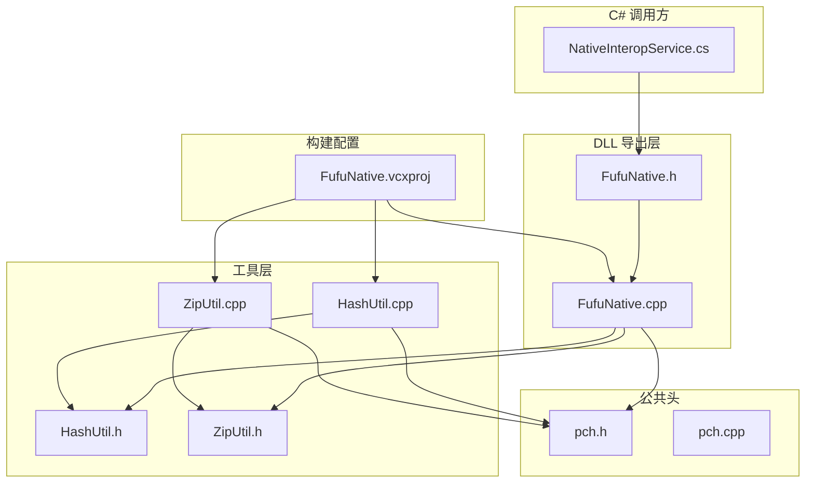
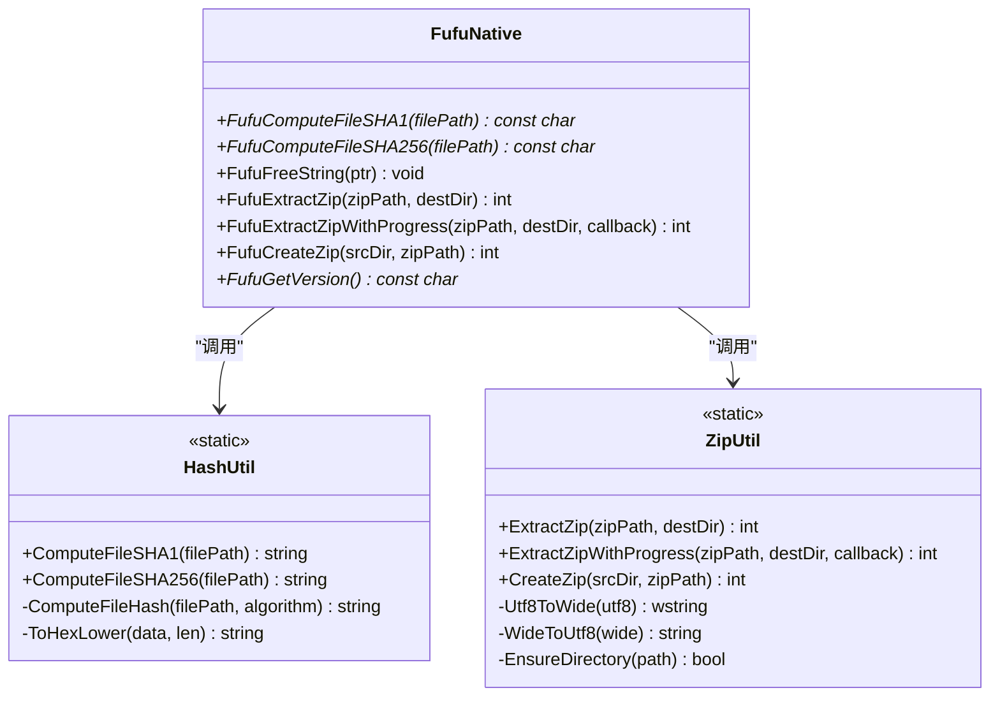
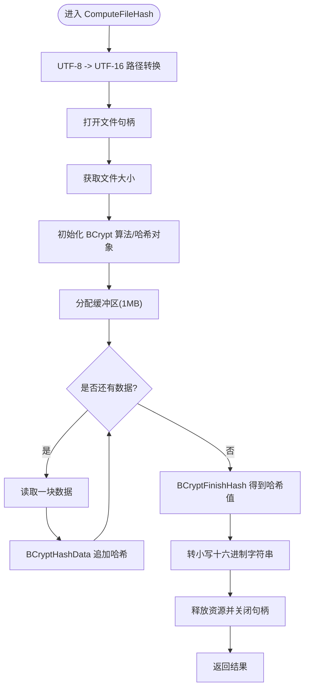
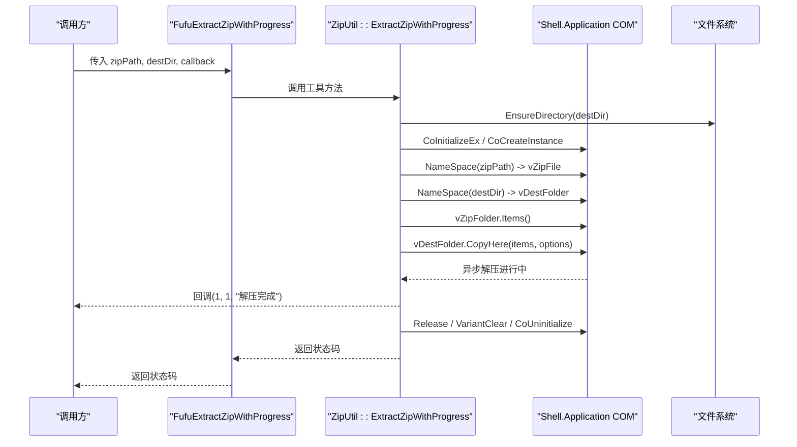
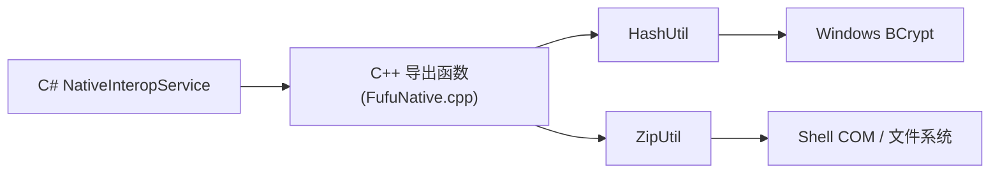

# C++ DLL 架构设计

<cite>
**本文引用的文件**   
- [FufuNative.h](file://native/FufuNative/FufuNative.h)
- [FufuNative.cpp](file://native/FufuNative/FufuNative.cpp)
- [HashUtil.h](file://native/FufuNative/HashUtil.h)
- [HashUtil.cpp](file://native/FufuNative/HashUtil.cpp)
- [ZipUtil.h](file://native/FufuNative/ZipUtil.h)
- [ZipUtil.cpp](file://native/FufuNative/ZipUtil.cpp)
- [pch.h](file://native/FufuNative/pch.h)
- [pch.cpp](file://native/FufuNative/pch.cpp)
- [FufuNative.vcxproj](file://native/FufuNative/FufuNative.vcxproj)
- [NativeInteropService.cs](file://src/FufuLauncher/Services/NativeInteropService.cs)
</cite>

## 目录
1. [简介](#简介)
2. [项目结构](#项目结构)
3. [核心组件](#核心组件)
4. [架构总览](#架构总览)
5. [详细组件分析](#详细组件分析)
6. [依赖关系分析](#依赖关系分析)
7. [性能考量](#性能考量)
8. [故障排查指南](#故障排查指南)
9. [结论](#结论)
10. [附录](#附录)

## 简介
本文件面向 C++ FufuNative DLL 的架构设计与实现，重点说明：
- 导出接口规范与 FUFU_API 宏、__declspec(dllexport/dllimport) 的使用
- extern "C" 声明与 cdecl 调用约定在 C/C++ 互操作中的重要性
- 预编译头 pch.h 的配置与优化策略
- 模块初始化流程、错误处理机制与内存管理策略
- 跨平台兼容性考虑与编译配置选项
- 如何正确实现导出函数（参数校验、异常处理、资源清理）

该 DLL 为 C# 侧提供高性能的文件哈希计算与 ZIP 解压/打包能力，并通过 P/Invoke 暴露稳定的 C 风格 API。

## 项目结构
FufuNative 是一个 Windows 动态库工程，采用分层组织：
- 导出层：FufuNative.h/.cpp，定义对外 C API 并转发到工具类
- 工具层：HashUtil 与 ZipUtil，分别封装 BCrypt 哈希与 Shell COM 解压/打包
- 公共头：pch.h/.cpp，集中包含常用系统头与标准库，启用预编译头加速编译
- 构建配置：vcxproj 定义多平台/多配置（Debug/Release x86/x64），开启 C++20 与全程序优化

图表来源
- [FufuNative.h:1-53](file://native/FufuNative/FufuNative.h#L1-L53)
- [FufuNative.cpp:1-78](file://native/FufuNative/FufuNative.cpp#L1-L78)
- [HashUtil.h:1-23](file://native/FufuNative/HashUtil.h#L1-L23)
- [HashUtil.cpp:1-114](file://native/FufuNative/HashUtil.cpp#L1-L114)
- [ZipUtil.h:1-29](file://native/FufuNative/ZipUtil.h#L1-L29)
- [ZipUtil.cpp:1-301](file://native/FufuNative/ZipUtil.cpp#L1-L301)
- [pch.h:1-15](file://native/FufuNative/pch.h#L1-L15)
- [pch.cpp:1-3](file://native/FufuNative/pch.cpp#L1-L3)
- [FufuNative.vcxproj:1-160](file://native/FufuNative/FufuNative.vcxproj#L1-L160)
- [NativeInteropService.cs:1-214](file://src/FufuLauncher/Services/NativeInteropService.cs#L1-L214)

章节来源
- [FufuNative.h:1-53](file://native/FufuNative/FufuNative.h#L1-L53)
- [FufuNative.cpp:1-78](file://native/FufuNative/FufuNative.cpp#L1-L78)
- [FufuNative.vcxproj:1-160](file://native/FufuNative/FufuNative.vcxproj#L1-L160)

## 核心组件
- 导出接口层（FufuNative.h/.cpp）
  - 使用 FUFU_API 宏统一导出/导入标记
  - 通过 extern "C" 暴露 C 风格 API，确保名称修饰一致
  - 所有字符串以 UTF-8 编码传递，返回字符串由 DLL 分配并由调用方释放
- 哈希工具（HashUtil.h/.cpp）
  - 基于 Windows BCrypt API 实现 SHA1/SHA256
  - 分块读取大文件，避免一次性加载内存
- ZIP 工具（ZipUtil.h/.cpp）
  - 解压：通过 Shell.Application COM 接口 CopyHere 异步解压
  - 打包：写入最小合法空 ZIP 头后，Shell 复制源目录内容入包
- 预编译头（pch.h/.cpp）
  - 集中包含系统头与常用标准库，减少重复编译开销

章节来源
- [FufuNative.h:1-53](file://native/FufuNative/FufuNative.h#L1-L53)
- [FufuNative.cpp:1-78](file://native/FufuNative/FufuNative.cpp#L1-L78)
- [HashUtil.h:1-23](file://native/FufuNative/HashUtil.h#L1-L23)
- [HashUtil.cpp:1-114](file://native/FufuNative/HashUtil.cpp#L1-L114)
- [ZipUtil.h:1-29](file://native/FufuNative/ZipUtil.h#L1-L29)
- [ZipUtil.cpp:1-301](file://native/FufuNative/ZipUtil.cpp#L1-L301)
- [pch.h:1-15](file://native/FufuNative/pch.h#L1-L15)
- [pch.cpp:1-3](file://native/FufuNative/pch.cpp#L1-L3)

## 架构总览
整体采用“导出层 + 工具类”的分层模式，C# 通过 P/Invoke 调用 C 风格 API，C++ 内部再委托给 HashUtil/ZipUtil 完成具体工作。

图表来源
- [FufuNative.h:1-53](file://native/FufuNative/FufuNative.h#L1-L53)
- [FufuNative.cpp:1-78](file://native/FufuNative/FufuNative.cpp#L1-L78)
- [HashUtil.h:1-23](file://native/FufuNative/HashUtil.h#L1-L23)
- [ZipUtil.h:1-29](file://native/FufuNative/ZipUtil.h#L1-L29)

## 详细组件分析

### 导出接口与宏定义（FUFU_API、extern "C"、cdecl）
- FUFU_API 宏
  - 当定义 FUFUNATIVE_EXPORTS 时展开为 __declspec(dllexport)，否则为 __declspec(dllimport)
  - 用于统一导出/导入标记，避免手动维护
- extern "C"
  - 禁用 C++ 名称修饰，使导出符号名稳定，便于 C# P/Invoke 查找
- 调用约定
  - 导出函数默认 cdecl；C# 侧需显式指定 CallingConvention.Cdecl
- 字符串约定
  - 输入输出均为 UTF-8 编码的 C 字符串
  - 返回字符串由 DLL 分配，调用方必须用 FufuFreeString 释放

章节来源
- [FufuNative.h:1-53](file://native/FufuNative/FufuNative.h#L1-L53)
- [FufuNative.cpp:1-78](file://native/FufuNative/FufuNative.cpp#L1-L78)
- [NativeInteropService.cs:1-214](file://src/FufuLauncher/Services/NativeInteropService.cs#L1-L214)

### 模块初始化与入口（DllMain）
- DllMain 仅做占位处理，不执行复杂逻辑，避免阻塞进程/线程生命周期
- 建议将初始化逻辑延迟到首次 API 调用或显式初始化函数中

章节来源
- [FufuNative.cpp:1-78](file://native/FufuNative/FufuNative.cpp#L1-L78)

### 哈希工具（HashUtil）
- 算法选择：BCrypt SHA1/SHA256，利用系统原生加密 API，性能高
- 流式处理：按 1MB 分块读取，降低内存占用
- 错误处理：失败返回空串；资源通过 goto cleanup 统一释放
- 字符集转换：UTF-8 -> UTF-16（MultiByteToWideChar）以适配 CreateFileW

图表来源
- [HashUtil.cpp:1-114](file://native/FufuNative/HashUtil.cpp#L1-L114)

章节来源
- [HashUtil.h:1-23](file://native/FufuNative/HashUtil.h#L1-L23)
- [HashUtil.cpp:1-114](file://native/FufuNative/HashUtil.cpp#L1-L114)

### ZIP 工具（ZipUtil）
- 解压
  - 通过 Shell.Application COM 接口 NameSpace 与 CopyHere 进行解压
  - 异步执行，回调仅在结束时触发一次
  - 目标目录不存在则递归创建
- 打包
  - 先写入最小合法空 ZIP 头（PK\x05\x06 结尾记录）
  - 再通过 Shell 将源目录内容复制到 ZIP
- 错误码
  - 解压/打包过程返回非零表示失败，便于上层判断与回退

图表来源
- [FufuNative.cpp:1-78](file://native/FufuNative/FufuNative.cpp#L1-L78)
- [ZipUtil.cpp:1-301](file://native/FufuNative/ZipUtil.cpp#L1-L301)

章节来源
- [ZipUtil.h:1-29](file://native/FufuNative/ZipUtil.h#L1-L29)
- [ZipUtil.cpp:1-301](file://native/FufuNative/ZipUtil.cpp#L1-L301)

### 预编译头（pch.h/.cpp）
- 作用
  - 集中包含 <windows.h>、<string>、<vector>、<cstdint>、<new> 等
  - 定义 WIN32_LEAN_AND_MEAN 减少不必要的头引入
- 优化策略
  - 在 vcxproj 中启用 PrecompiledHeader=Use，并指定 pch.h
  - 所有 .cpp 均 include pch.h，显著减少编译时间

章节来源
- [pch.h:1-15](file://native/FufuNative/pch.h#L1-L15)
- [pch.cpp:1-3](file://native/FufuNative/pch.cpp#L1-L3)
- [FufuNative.vcxproj:1-160](file://native/FufuNative/FufuNative.vcxproj#L1-L160)

### 内存管理与字符串释放
- 分配策略
  - 导出函数返回的 C 字符串由 DLL 内部分配（new[]）
  - 提供 FufuFreeString 供调用方释放，避免跨模块分配器不一致
- 释放时机
  - C# 侧在 PtrToUtf8StringAndFree 中立即释放，防止泄漏
- 注意事项
  - 不要对 nullptr 调用 FufuFreeString 以外的释放方式
  - 不要在 DLL 内部修改返回指针指向的内存

章节来源
- [FufuNative.cpp:1-78](file://native/FufuNative/FufuNative.cpp#L1-L78)
- [NativeInteropService.cs:1-214](file://src/FufuLauncher/Services/NativeInteropService.cs#L1-L214)

### 错误处理机制
- 参数校验
  - 导出函数对输入指针进行空检查，非法参数直接返回错误或空指针
- 返回值约定
  - 字符串函数返回 nullptr 表示失败
  - 整数函数返回 0 成功，非 0 错误码
- 资源清理
  - 哈希与 ZIP 工具使用 goto cleanup 统一释放 COM、文件句柄、内存
- 上层回退
  - C# 侧捕获 DllNotFoundException/EntryPointNotFoundException/BadImageFormatException，自动切换到托管实现

章节来源
- [FufuNative.cpp:1-78](file://native/FufuNative/FufuNative.cpp#L1-L78)
- [HashUtil.cpp:1-114](file://native/FufuNative/HashUtil.cpp#L1-L114)
- [ZipUtil.cpp:1-301](file://native/FufuNative/ZipUtil.cpp#L1-L301)
- [NativeInteropService.cs:1-214](file://src/FufuLauncher/Services/NativeInteropService.cs#L1-L214)

### 跨平台兼容性与编译配置
- 平台限制
  - 当前实现依赖 Windows BCrypt API 与 Shell COM，仅限 Windows
- 编译配置
  - 支持 Debug/Release 与 Win32/x64 四种组合
  - 启用 C++20 语言标准与全程序优化
  - 预编译头启用 Use，提升编译速度
- 可选依赖
  - 若缺少 DLL，C# 侧自动回退到托管实现，保证可用性

章节来源
- [FufuNative.vcxproj:1-160](file://native/FufuNative/FufuNative.vcxproj#L1-L160)
- [NativeInteropService.cs:1-214](file://src/FufuLauncher/Services/NativeInteropService.cs#L1-L214)

## 依赖关系分析
- 导出层依赖工具层
  - FufuNative.cpp 依赖 HashUtil 与 ZipUtil
- 工具层依赖系统 API
  - HashUtil 依赖 BCrypt API
  - ZipUtil 依赖 Shell COM 与文件系统 API
- C# 依赖导出层
  - NativeInteropService.cs 通过 P/Invoke 调用导出函数

图表来源
- [FufuNative.cpp:1-78](file://native/FufuNative/FufuNative.cpp#L1-L78)
- [HashUtil.cpp:1-114](file://native/FufuNative/HashUtil.cpp#L1-L114)
- [ZipUtil.cpp:1-301](file://native/FufuNative/ZipUtil.cpp#L1-L301)
- [NativeInteropService.cs:1-214](file://src/FufuLauncher/Services/NativeInteropService.cs#L1-L214)

章节来源
- [FufuNative.cpp:1-78](file://native/FufuNative/FufuNative.cpp#L1-L78)
- [HashUtil.cpp:1-114](file://native/FufuNative/HashUtil.cpp#L1-L114)
- [ZipUtil.cpp:1-301](file://native/FufuNative/ZipUtil.cpp#L1-L301)
- [NativeInteropService.cs:1-214](file://src/FufuLauncher/Services/NativeInteropService.cs#L1-L214)

## 性能考量
- 哈希计算
  - 使用系统级 BCrypt，避免用户态库开销
  - 1MB 分块读取，平衡 I/O 与内存占用
- ZIP 解压
  - 借助 Shell 内置压缩支持，无需第三方库
  - 异步解压，UI 友好；但回调粒度较粗，可按需扩展
- 预编译头
  - 显著减少重复头文件编译时间
- 全程序优化
  - Release 配置启用 IntrinsicFunctions、FunctionLevelLinking、EnableCOMDATFolding、OptimizeReferences

[本节为通用指导，不直接分析具体文件]

## 故障排查指南
- 常见问题
  - 找不到 DLL 或入口点：检查 DLL 路径与命名，确认 CallingConvention 与 MarshalAs 设置一致
  - BadImageFormatException：x86/x64 不匹配，确保 C# 与 DLL 平台一致
  - 解压失败：检查目标目录权限与路径有效性，确认 ZIP 文件完整
- 调试建议
  - 在 C# 侧捕获异常并记录日志
  - 在 C++ 侧增加关键路径的错误码与日志输出
- 回退策略
  - C# 侧检测到不可用时自动切换托管实现，保证功能可用

章节来源
- [NativeInteropService.cs:1-214](file://src/FufuLauncher/Services/NativeInteropService.cs#L1-L214)
- [ZipUtil.cpp:1-301](file://native/FufuNative/ZipUtil.cpp#L1-L301)

## 结论
FufuNative DLL 通过清晰的导出层与工具层分离，结合高效的系统 API 与稳健的错误处理，为 C# 应用提供了高性能且可靠的文件哈希与 ZIP 处理能力。其设计遵循 C/C++ 互操作最佳实践，具备可回退的容错机制与良好的编译优化配置。

[本节为总结性内容，不直接分析具体文件]

## 附录

### 导出函数实现要点清单
- 参数验证
  - 对所有指针参数进行空检查，非法参数立即返回错误或空指针
- 异常处理
  - 在 C++ 侧避免抛出异常跨越边界；必要时捕获并转换为错误码/空指针
- 资源清理
  - 使用 RAII 或统一的 goto cleanup 确保文件句柄、COM 对象、内存释放
- 字符串约定
  - 输入输出使用 UTF-8；返回字符串由 DLL 分配，调用方用 FufuFreeString 释放
- 调用约定
  - 明确 cdecl；C# 侧对应 CallingConvention.Cdecl
- 示例参考路径
  - 导出函数实现：[FufuNative.cpp:1-78](file://native/FufuNative/FufuNative.cpp#L1-L78)
  - 哈希实现：[HashUtil.cpp:1-114](file://native/FufuNative/HashUtil.cpp#L1-L114)
  - ZIP 解压/打包：[ZipUtil.cpp:1-301](file://native/FufuNative/ZipUtil.cpp#L1-L301)
  - C# P/Invoke 封装与回退：[NativeInteropService.cs:1-214](file://src/FufuLauncher/Services/NativeInteropService.cs#L1-L214)

章节来源
- [FufuNative.cpp:1-78](file://native/FufuNative/FufuNative.cpp#L1-L78)
- [HashUtil.cpp:1-114](file://native/FufuNative/HashUtil.cpp#L1-L114)
- [ZipUtil.cpp:1-301](file://native/FufuNative/ZipUtil.cpp#L1-L301)
- [NativeInteropService.cs:1-214](file://src/FufuLauncher/Services/NativeInteropService.cs#L1-L214)