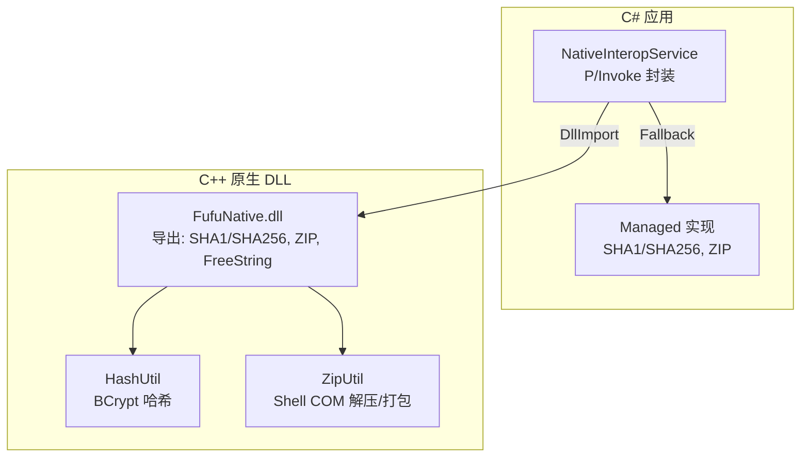
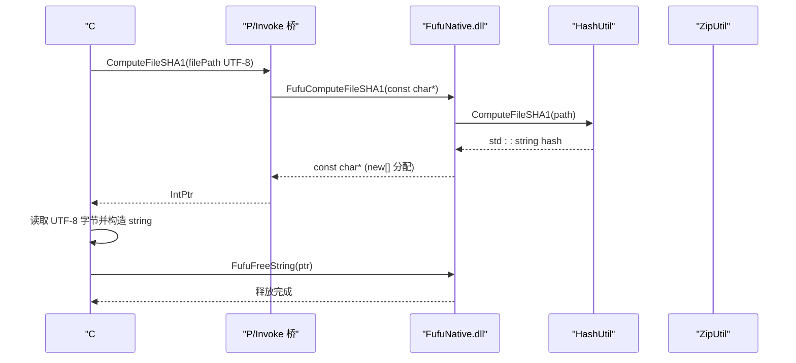
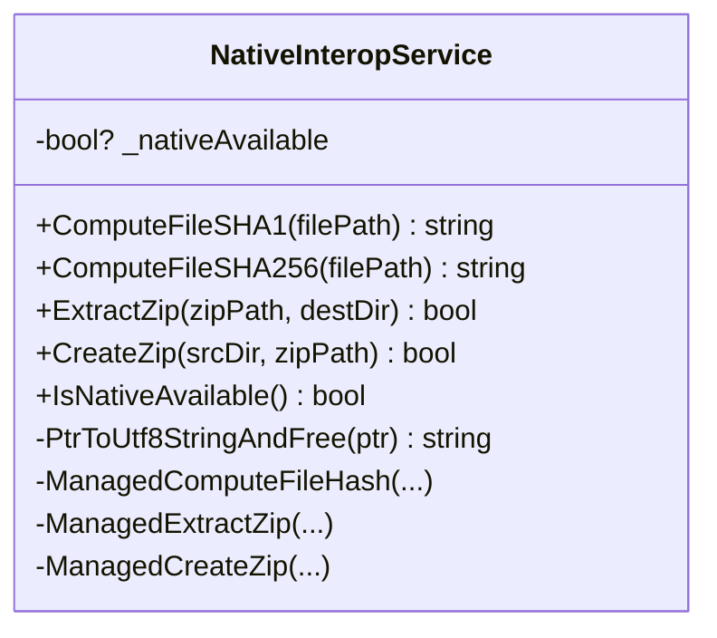
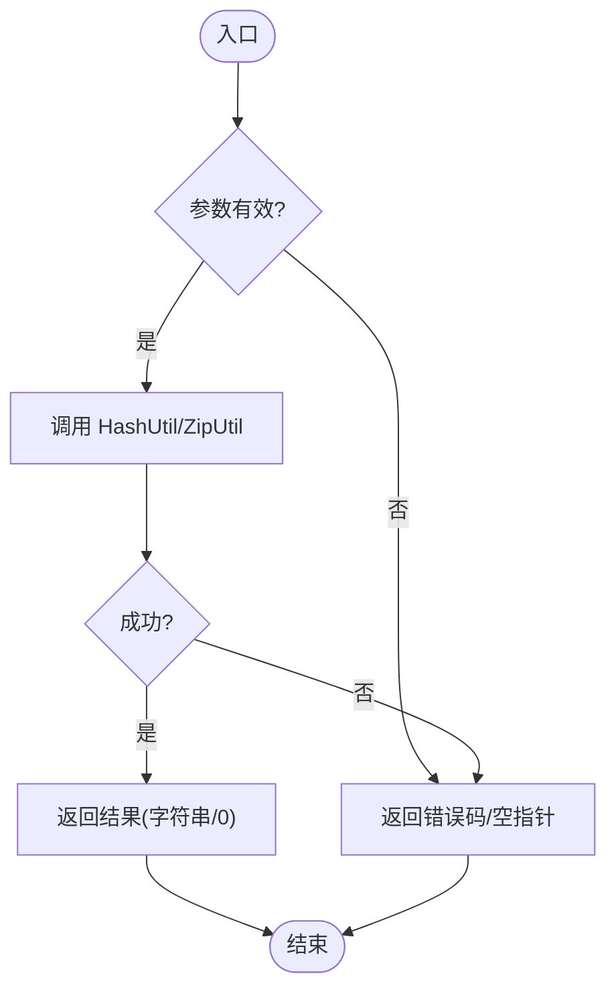
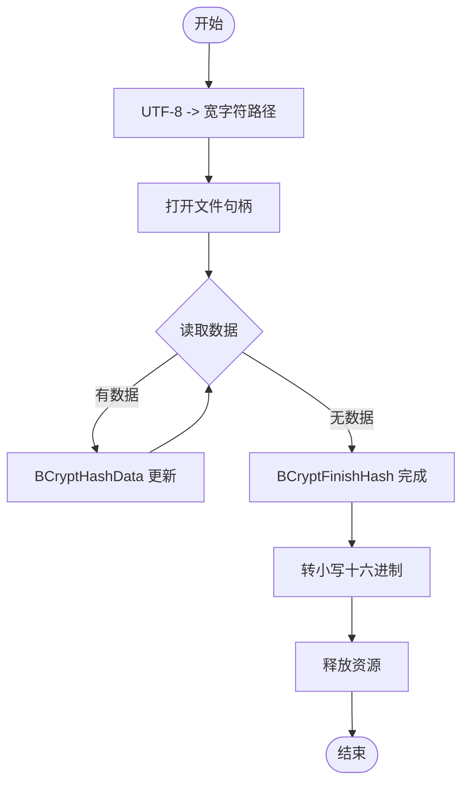
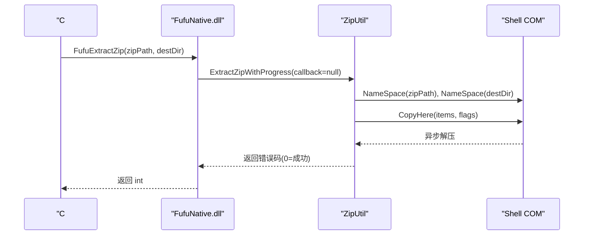
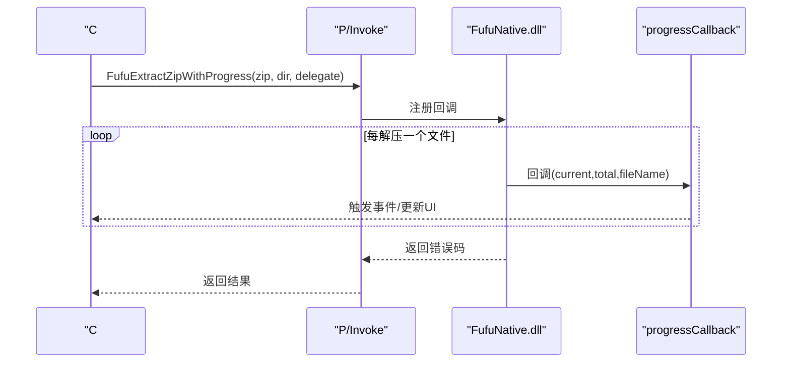
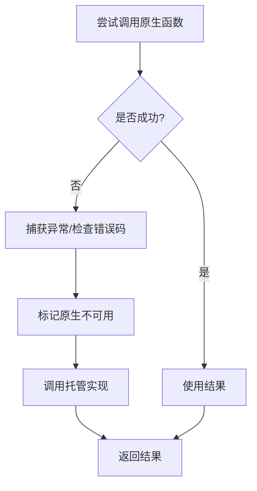
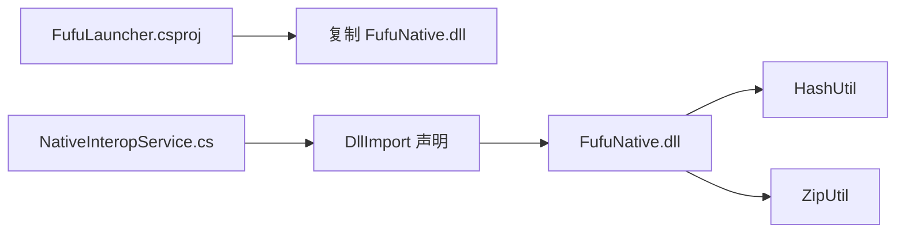

# P/Invoke 接口集成

<cite>
**本文引用的文件**   
- [NativeInteropService.cs](file://src/FufuLauncher/Services/NativeInteropService.cs)
- [FufuNative.h](file://native/FufuNative/FufuNative.h)
- [FufuNative.cpp](file://native/FufuNative/FufuNative.cpp)
- [HashUtil.h](file://native/FufuNative/HashUtil.h)
- [HashUtil.cpp](file://native/FufuNative/HashUtil.cpp)
- [ZipUtil.h](file://native/FufuNative/ZipUtil.h)
- [ZipUtil.cpp](file://native/FufuNative/ZipUtil.cpp)
- [FufuLauncher.csproj](file://src/FufuLauncher/FufuLauncher.csproj)
- [MemoryMonitorService.cs](file://src/FufuLauncher/Services/MemoryMonitorService.cs)
</cite>

## 目录
1. [简介](#简介)
2. [项目结构](#项目结构)
3. [核心组件](#核心组件)
4. [架构总览](#架构总览)
5. [详细组件分析](#详细组件分析)
6. [依赖关系分析](#依赖关系分析)
7. [性能考虑](#性能考虑)
8. [故障排查指南](#故障排查指南)
9. [结论](#结论)
10. [附录](#附录)

## 简介
本文件面向 C# 与 C++ 之间的 P/Invoke 接口集成，结合仓库中的实际实现，系统说明以下要点：
- DllImport 属性的使用与调用约定、字符集设置（CallingConvention.Cdecl、UnmanagedType.LPUTF8Str）
- 数据类型映射规则（char* 与 string 的转换、UTF-8 编码处理、内存释放机制）
- 回调函数的实现方式（C++ 回调函数指针与 .NET 委托桥接）
- 异常处理策略（C++ 错误码与 .NET 异常的转换与回退）
- 具体调用示例（哈希计算、ZIP 解压/打包、异步封装与错误处理模式）
- 性能优化技巧与调试方法

## 项目结构
本项目采用“托管服务 + 原生 DLL”的双层设计：
- 托管层（C#）：通过 NativeInteropService 暴露统一 API，自动探测并优先使用原生 DLL；失败时回退到纯 .NET 实现。
- 原生层（C++）：提供高性能文件哈希与 ZIP 操作，导出 cdecl 接口，字符串以 UTF-8 传递，由 C# 负责释放返回的 C 字符串内存。
- 构建配置：csproj 将 FufuNative.dll 按平台复制到输出目录，运行时通过默认路径加载。

图表来源 
- [FufuLauncher.csproj:34-42](file://src/FufuLauncher/FufuLauncher.csproj#L34-L42)
- [NativeInteropService.cs:20-120](file://src/FufuLauncher/Services/NativeInteropService.cs#L20-L120)
- [FufuNative.h:19-49](file://native/FufuNative/FufuNative.h#L19-L49)
- [HashUtil.h:7-22](file://native/FufuNative/HashUtil.h#L7-L22)
- [ZipUtil.h:9-28](file://native/FufuNative/ZipUtil.h#L9-L28)

章节来源
- [FufuLauncher.csproj:34-42](file://src/FufuLauncher/FufuLauncher.csproj#L34-L42)
- [NativeInteropService.cs:1-120](file://src/FufuLauncher/Services/NativeInteropService.cs#L1-L120)
- [FufuNative.h:1-53](file://native/FufuNative/FufuNative.h#L1-L53)

## 核心组件
- NativeInteropService：定义 P/Invoke 签名、调用约定、UTF-8 编解码、内存释放、可用性探测与托管回退实现。
- FufuNative 导出接口：声明 C 风格导出函数，明确调用约定与字符串编码。
- HashUtil/ZipUtil：原生侧高性能实现（BCrypt 哈希、Shell COM ZIP）。

关键实现要点：
- 调用约定：C# 侧使用 CallingConvention.Cdecl，与 C++ 侧 extern "C" 导出一致。
- 字符集：C# 侧使用 UnmanagedType.LPUTF8Str，确保 UTF-8 字节串传入 C++。
- 内存管理：C++ 分配 char* 字符串，C# 读取后调用 FufuFreeString 释放。
- 错误处理：C++ 返回 int 错误码或 nullptr；C# 捕获 DllNotFoundException/EntryPointNotFoundException/BadImageFormatException 并回退。

章节来源
- [NativeInteropService.cs:20-120](file://src/FufuLauncher/Services/NativeInteropService.cs#L20-L120)
- [FufuNative.h:19-49](file://native/FufuNative/FufuNative.h#L19-L49)
- [FufuNative.cpp:28-78](file://native/FufuNative/FufuNative.cpp#L28-L78)
- [HashUtil.h:7-22](file://native/FufuNative/HashUtil.h#L7-L22)
- [ZipUtil.h:9-28](file://native/FufuNative/ZipUtil.h#L9-L28)

## 架构总览
下图展示 C# 调用 C++ 的完整流程，包括参数传递、返回值处理与内存释放。

图表来源 
- [NativeInteropService.cs:28-55](file://src/FufuLauncher/Services/NativeInteropService.cs#L28-L55)
- [FufuNative.h:19-28](file://native/FufuNative/FufuNative.h#L19-L28)
- [FufuNative.cpp:30-50](file://native/FufuNative/FufuNative.cpp#L30-L50)
- [HashUtil.h:9-13](file://native/FufuNative/HashUtil.h#L9-L13)

## 详细组件分析

### 组件一：NativeInteropService（P/Invoke 封装与回退）
职责与行为：
- 定义 P/Invoke 方法，指定 CallingConvention.Cdecl 与 LPUTF8Str 编解码。
- 首次调用探测 DLL 可用性，缓存结果避免重复开销。
- 成功路径：调用原生函数，读取 UTF-8 字符串并释放内存。
- 失败路径：捕获特定异常并回退到托管实现（功能等价）。

图表来源 
- [NativeInteropService.cs:20-214](file://src/FufuLauncher/Services/NativeInteropService.cs#L20-L214)

章节来源
- [NativeInteropService.cs:20-214](file://src/FufuLauncher/Services/NativeInteropService.cs#L20-L214)

### 组件二：FufuNative 导出接口（C++ 侧）
职责与行为：
- 导出 C 风格函数，供 C# 通过 P/Invoke 调用。
- 字符串参数为 UTF-8；返回值 char* 由调用方释放。
- ZIP 操作返回 int 错误码，0 表示成功。

图表来源 
- [FufuNative.h:19-49](file://native/FufuNative/FufuNative.h#L19-L49)
- [FufuNative.cpp:30-78](file://native/FufuNative/FufuNative.cpp#L30-L78)

章节来源
- [FufuNative.h:1-53](file://native/FufuNative/FufuNative.h#L1-L53)
- [FufuNative.cpp:1-78](file://native/FufuNative/FufuNative.cpp#L1-L78)

### 组件三：HashUtil（BCrypt 高性能哈希）
职责与行为：
- 使用 Windows BCrypt API 进行分块流式哈希计算。
- 内部将 UTF-8 路径转换为宽字符路径，打开文件句柄并循环读取。
- 输出小写十六进制字符串，失败返回空串。

图表来源 
- [HashUtil.cpp:34-105](file://native/FufuNative/HashUtil.cpp#L34-L105)
- [HashUtil.h:9-22](file://native/FufuNative/HashUtil.h#L9-L22)

章节来源
- [HashUtil.cpp:1-114](file://native/FufuNative/HashUtil.cpp#L1-L114)
- [HashUtil.h:1-23](file://native/FufuNative/HashUtil.h#L1-L23)

### 组件四：ZipUtil（Shell COM 解压/打包）
职责与行为：
- 解压：通过 Shell.Application NameSpace/CopyHere 执行解压，支持进度回调。
- 打包：写入最小合法 ZIP 头，再使用 Shell CopyHere 将源目录内容复制进 ZIP。
- 路径处理：UTF-8 与宽字符互转；确保目标目录存在。

图表来源 
- [ZipUtil.cpp:57-200](file://native/FufuNative/ZipUtil.cpp#L57-L200)
- [FufuNative.cpp:52-66](file://native/FufuNative/FufuNative.cpp#L52-L66)

章节来源
- [ZipUtil.cpp:1-301](file://native/FufuNative/ZipUtil.cpp#L1-L301)
- [ZipUtil.h:1-29](file://native/FufuNative/ZipUtil.h#L1-L29)

### 组件五：回调函数与事件触发（进度回调）
- C++ 侧导出 FufuExtractZipWithProgress，接受函数指针回调 (int current, int total, const char* fileName)。
- C# 侧可通过委托桥接（例如 Marshal.GetDelegateForFunctionPointer），将 .NET 事件绑定到 C++ 回调，实现 UI 进度更新。
- 当前托管实现未直接使用该回调，但接口已预留扩展点。

图表来源 
- [FufuNative.h:36-40](file://native/FufuNative/FufuNative.h#L36-L40)
- [FufuNative.cpp:57-66](file://native/FufuNative/FufuNative.cpp#L57-L66)

章节来源
- [FufuNative.h:36-40](file://native/FufuNative/FufuNative.h#L36-L40)
- [FufuNative.cpp:57-66](file://native/FufuNative/FufuNative.cpp#L57-L66)

### 组件六：异常处理策略与回退机制
- C# 侧捕获 DllNotFoundException、EntryPointNotFoundException、BadImageFormatException，标记原生不可用并回退到托管实现。
- C++ 侧通过返回错误码或空指针表达失败；C# 在读取前检查指针是否为空。
- 托管实现保证功能等价，确保在无 C++ DLL 环境下仍可运行。

图表来源 
- [NativeInteropService.cs:40-73](file://src/FufuLauncher/Services/NativeInteropService.cs#L40-L73)
- [FufuNative.cpp:30-78](file://native/FufuNative/FufuNative.cpp#L30-L78)

章节来源
- [NativeInteropService.cs:40-120](file://src/FufuLauncher/Services/NativeInteropService.cs#L40-L120)
- [FufuNative.cpp:30-78](file://native/FufuNative/FufuNative.cpp#L30-L78)

## 依赖关系分析
- C# 项目通过 csproj 将 FufuNative.dll 复制到输出目录，运行时按 win-x64 平台查找。
- NativeInteropService 依赖 FufuNative 导出的哈希与 ZIP 接口。
- FufuNative 依赖 HashUtil（BCrypt）与 ZipUtil（Shell COM）。

图表来源 
- [FufuLauncher.csproj:34-42](file://src/FufuLauncher/FufuLauncher.csproj#L34-L42)
- [NativeInteropService.cs:28-82](file://src/FufuLauncher/Services/NativeInteropService.cs#L28-L82)
- [FufuNative.cpp:1-20](file://native/FufuNative/FufuNative.cpp#L1-L20)

章节来源
- [FufuLauncher.csproj:34-42](file://src/FufuLauncher/FufuLauncher.csproj#L34-L42)
- [NativeInteropService.cs:28-82](file://src/FufuLauncher/Services/NativeInteropService.cs#L28-L82)
- [FufuNative.cpp:1-20](file://native/FufuNative/FufuNative.cpp#L1-L20)

## 性能考虑
- 原生哈希：使用 BCrypt 分块读取，减少内存占用并提升大文件速度。
- ZIP 解压：Shell COM 调用系统内置能力，避免第三方库依赖。
- 回退策略：原生不可用时自动降级到托管实现，保证可用性。
- 定时器与线程：其他服务（如 MemoryMonitorService）使用 DispatcherTimer 降低 UI 阻塞风险，可借鉴于 P/Invoke 调用的异步封装。

[本节为通用指导，不直接分析具体文件]

## 故障排查指南
常见问题与定位：
- 找不到 DLL 或入口点：检查 csproj 复制规则与平台匹配（win-x64），确认 FufuNative.dll 存在于输出目录。
- BadImageFormatException：C# 与 C++ 位宽不一致（x86/x64），需统一编译目标。
- 字符串乱码：确认 C# 侧使用 LPUTF8Str，C++ 侧返回 UTF-8 字符串。
- 内存泄漏：确保每次获取 char* 后调用 FufuFreeString。
- 解压失败：检查 Shell COM 初始化与权限，查看错误码。

章节来源
- [FufuLauncher.csproj:34-42](file://src/FufuLauncher/FufuLauncher.csproj#L34-L42)
- [NativeInteropService.cs:40-120](file://src/FufuLauncher/Services/NativeInteropService.cs#L40-L120)
- [FufuNative.cpp:46-50](file://native/FufuNative/FufuNative.cpp#L46-L50)
- [ZipUtil.cpp:76-100](file://native/FufuNative/ZipUtil.cpp#L76-L100)

## 结论
本集成方案通过清晰的 P/Invoke 边界、严格的 UTF-8 编解码与内存管理、以及健壮的回退机制，实现了高性能与高可用性的平衡。建议在新增功能时遵循现有模式：统一调用约定、明确错误码、确保内存释放，并在必要时提供回调接口以增强交互性。

[本节为总结，不直接分析具体文件]

## 附录

### 数据类型映射与编码规则
- char* ↔ string：C# 使用 LPUTF8Str 将 string 转为 UTF-8 字节串传给 C++；C++ 返回 char* 指向 UTF-8 字符串。
- 内存释放：C++ 分配的 char* 必须由 C# 调用 FufuFreeString 释放。
- 错误码：C++ 返回 int 错误码，0 表示成功；C# 根据返回值判断成功与否。

章节来源
- [FufuNative.h:19-49](file://native/FufuNative/FufuNative.h#L19-L49)
- [NativeInteropService.cs:124-140](file://src/FufuLauncher/Services/NativeInteropService.cs#L124-L140)

### 回调函数桥接建议
- 定义委托类型，使用 Marshal.GetDelegateForFunctionPointer 将 C++ 函数指针转换为 .NET 委托。
- 在 UI 线程中触发事件，避免跨线程访问控件。
- 注意委托生命周期与 GC 回收，保持引用以避免被提前释放。

[本节为概念性指导，不直接分析具体文件]

### 异步封装与错误处理模式
- 使用 Task.Run 包装耗时 P/Invoke 调用，避免阻塞 UI。
- 捕获并记录异常，区分原生缺失、入口点缺失、图像格式错误等场景。
- 对返回值进行有效性检查（空指针、错误码），并提供用户友好的提示。

章节来源
- [GameLaunchService.cs:104-177](file://src/FufuLauncher/Services/GameLaunchService.cs#L104-L177)
- [MemoryMonitorService.cs:130-141](file://src/FufuLauncher/Services/MemoryMonitorService.cs#L130-L141)