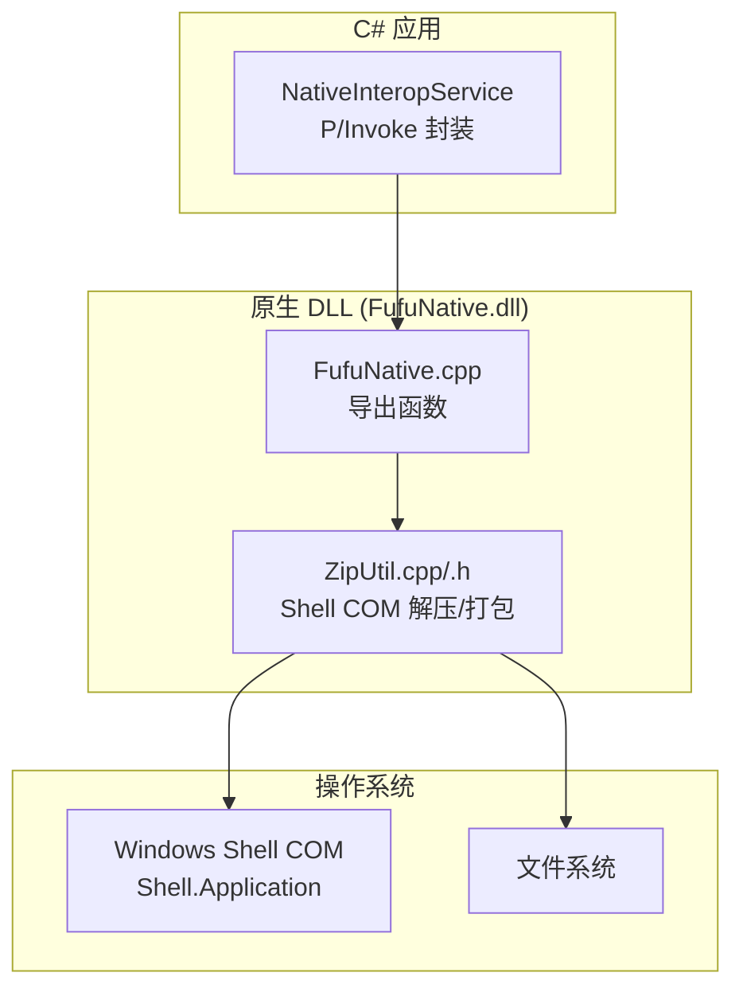
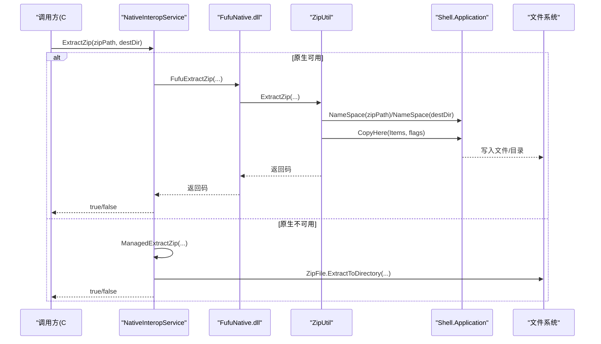
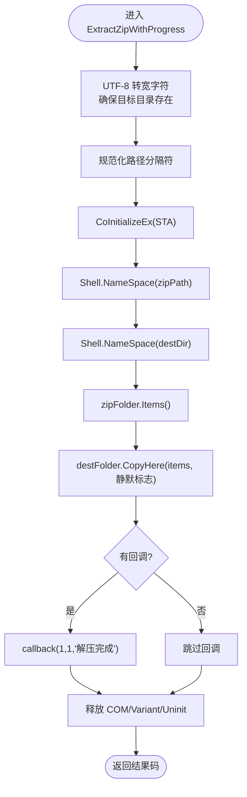
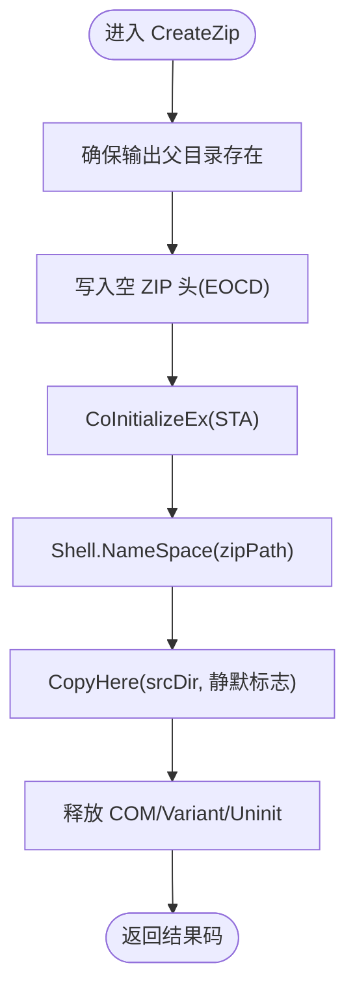
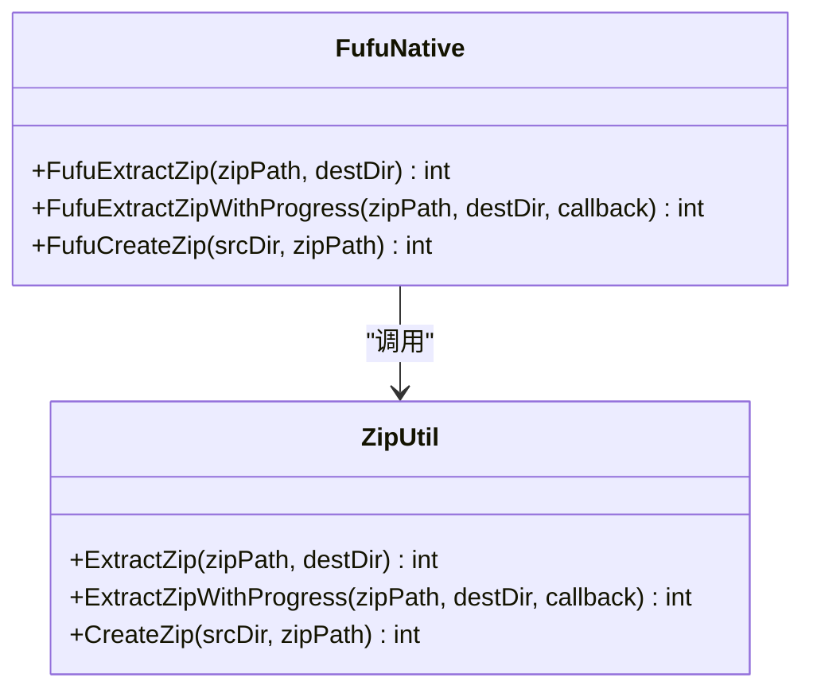
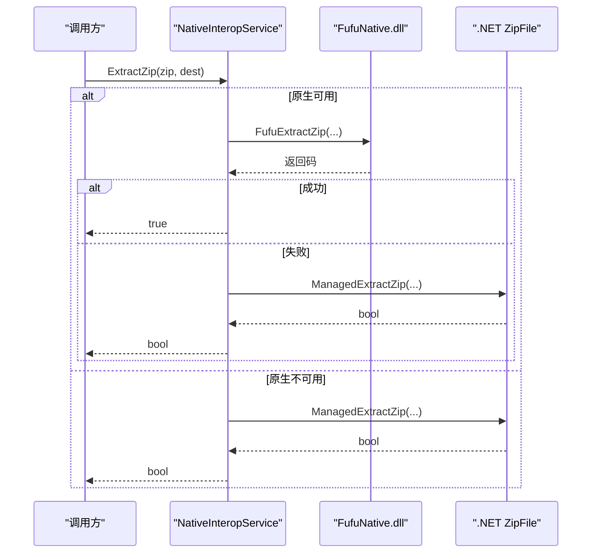
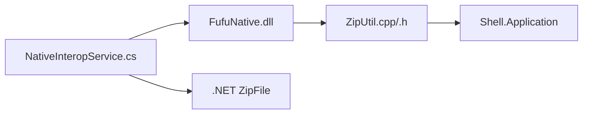

# ZIP 解压压缩功能

<cite>
**本文引用的文件**   
- [ZipUtil.h](file://native/FufuNative/ZipUtil.h)
- [ZipUtil.cpp](file://native/FufuNative/ZipUtil.cpp)
- [FufuNative.h](file://native/FufuNative/FufuNative.h)
- [FufuNative.cpp](file://native/FufuNative/FufuNative.cpp)
- [NativeInteropService.cs](file://src/FufuLauncher/Services/NativeInteropService.cs)
</cite>

## 目录
1. [简介](#简介)
2. [项目结构](#项目结构)
3. [核心组件](#核心组件)
4. [架构总览](#架构总览)
5. [详细组件分析](#详细组件分析)
6. [依赖关系分析](#依赖关系分析)
7. [性能考虑](#性能考虑)
8. [故障排查指南](#故障排查指南)
9. [结论](#结论)
10. [附录：使用示例与最佳实践](#附录使用示例与最佳实践)

## 简介
本文件围绕 ZIP 解压与压缩能力进行系统化文档化，重点说明以下方面：
- 基于 Windows Shell COM 的 ZIP 解压/打包实现（无需第三方库）
- C++ 原生 DLL 导出接口与 C# P/Invoke 封装
- 解压流程、目录重建、冲突处理策略
- 压缩流程、空容器创建、增量更新思路与备份包生成
- 进度回调机制、线程安全与性能优化
- 错误恢复策略、损坏文件处理、中断恢复与数据一致性保证
- 与文件系统操作的集成与调优建议
- 异步操作与错误处理的调用模式

## 项目结构
ZIP 相关能力由三层组成：
- 原生层（C++）：通过 Windows Shell COM 完成解压与打包
- 互操作层（C# P/Invoke）：封装原生 DLL 并实现托管 fallback
- 上层服务：调用 NativeInteropService 完成具体业务

图表来源 
- [FufuNative.cpp:52-71](file://native/FufuNative/FufuNative.cpp#L52-L71)
- [ZipUtil.cpp:61-200](file://native/FufuNative/ZipUtil.cpp#L61-L200)
- [ZipUtil.cpp:203-301](file://native/FufuNative/ZipUtil.cpp#L203-L301)
- [NativeInteropService.cs:75-119](file://src/FufuLauncher/Services/NativeInteropService.cs#L75-L119)

章节来源
- [FufuNative.h:30-45](file://native/FufuNative/FufuNative.h#L30-L45)
- [FufuNative.cpp:52-71](file://native/FufuNative/FufuNative.cpp#L52-L71)
- [ZipUtil.h:9-28](file://native/FufuNative/ZipUtil.h#L9-L28)
- [ZipUtil.cpp:1-301](file://native/FufuNative/ZipUtil.cpp#L1-L301)
- [NativeInteropService.cs:75-119](file://src/FufuLauncher/Services/NativeInteropService.cs#L75-L119)

## 核心组件
- ZipUtil（C++）
  - ExtractZip / ExtractZipWithProgress：解压 ZIP 到目标目录，支持进度回调
  - CreateZip：创建 ZIP 备份包（源目录 -> ZIP）
  - 工具方法：UTF-8/宽字符转换、递归目录创建
- FufuNative（C++ 导出）
  - FufuExtractZip / FufuExtractZipWithProgress / FufuCreateZip：对外 C 风格导出
- NativeInteropService（C#）
  - P/Invoke 调用原生 DLL
  - 失败时回退到 .NET 托管实现（ZipFile.ExtractToDirectory / CreateFromDirectory）

章节来源
- [ZipUtil.h:9-28](file://native/FufuNative/ZipUtil.h#L9-L28)
- [ZipUtil.cpp:57-200](file://native/FufuNative/ZipUtil.cpp#L57-L200)
- [ZipUtil.cpp:203-301](file://native/FufuNative/ZipUtil.cpp#L203-L301)
- [FufuNative.h:30-45](file://native/FufuNative/FufuNative.h#L30-L45)
- [FufuNative.cpp:52-71](file://native/FufuNative/FufuNative.cpp#L52-L71)
- [NativeInteropService.cs:75-119](file://src/FufuLauncher/Services/NativeInteropService.cs#L75-L119)

## 架构总览
整体调用链从 C# 发起，优先走原生路径；若不可用则回退到托管实现。

图表来源 
- [NativeInteropService.cs:85-101](file://src/FufuLauncher/Services/NativeInteropService.cs#L85-L101)
- [FufuNative.cpp:52-55](file://native/FufuNative/FufuNative.cpp#L52-L55)
- [ZipUtil.cpp:57-200](file://native/FufuNative/ZipUtil.cpp#L57-L200)

## 详细组件分析

### 解压流程（ZipUtil::ExtractZipWithProgress）
- 输入校验与路径准备
  - UTF-8 转宽字符
  - 确保目标目录存在（递归创建）
  - 规范化末尾分隔符
- COM 初始化与对象获取
  - CoInitializeEx 初始化 STA（兼容 MTA 场景）
  - 通过 Shell.NameSpace 获取 ZIP 文件夹对象和目标目录对象
- 执行拷贝
  - 获取 Items() 集合
  - 调用 CopyHere(Items, options)，选项为“静默无 UI”
- 回调与清理
  - 解压完成后触发一次完成回调
  - 释放 COM 对象与 Variant，必要时 CoUninitialize

图表来源 
- [ZipUtil.cpp:61-200](file://native/FufuNative/ZipUtil.cpp#L61-L200)

章节来源
- [ZipUtil.cpp:61-200](file://native/FufuNative/ZipUtil.cpp#L61-L200)

### 打包流程（ZipUtil::CreateZip）
- 输出目录准备
- 写入最小合法 ZIP 头（空 EOCD 签名），以便 Shell 识别为 ZIP
- 通过 Shell.NameSpace(zipPath) 获取 ZIP 文件夹对象
- 调用 CopyHere(srcDir, options) 将源目录内容复制到 ZIP
- 清理 COM 资源并返回结果码

图表来源 
- [ZipUtil.cpp:203-301](file://native/FufuNative/ZipUtil.cpp#L203-L301)

章节来源
- [ZipUtil.cpp:203-301](file://native/FufuNative/ZipUtil.cpp#L203-L301)

### 导出接口与回调桥接（FufuNative）
- 导出函数提供 C 风格接口，便于 P/Invoke
- 带进度的解压接口将 C# 委托包装为 std::function 回调

图表来源 
- [FufuNative.h:30-45](file://native/FufuNative/FufuNative.h#L30-L45)
- [FufuNative.cpp:52-71](file://native/FufuNative/FufuNative.cpp#L52-L71)
- [ZipUtil.h:9-28](file://native/FufuNative/ZipUtil.h#L9-L28)

章节来源
- [FufuNative.h:30-45](file://native/FufuNative/FufuNative.h#L30-L45)
- [FufuNative.cpp:52-71](file://native/FufuNative/FufuNative.cpp#L52-L71)

### 托管回退实现（NativeInteropService）
- 优先尝试原生 DLL；若缺失或调用异常，自动回退到 .NET 托管实现
- 托管解压：ZipFile.ExtractToDirectory
- 托管打包：ZipFile.CreateFromDirectory，可选压缩级别

图表来源 
- [NativeInteropService.cs:85-101](file://src/FufuLauncher/Services/NativeInteropService.cs#L85-L101)
- [NativeInteropService.cs:182-194](file://src/FufuLauncher/Services/NativeInteropService.cs#L182-L194)

章节来源
- [NativeInteropService.cs:75-119](file://src/FufuLauncher/Services/NativeInteropService.cs#L75-L119)
- [NativeInteropService.cs:182-212](file://src/FufuLauncher/Services/NativeInteropService.cs#L182-L212)

## 依赖关系分析
- 原生层依赖 Windows Shell COM（Shell.Application）进行 ZIP 读写
- C# 层依赖 System.IO.Compression 作为托管回退
- 字符串编码在 C++ 侧进行 UTF-8/宽字符转换，避免跨边界乱码

图表来源 
- [NativeInteropService.cs:75-119](file://src/FufuLauncher/Services/NativeInteropService.cs#L75-L119)
- [ZipUtil.cpp:1-301](file://native/FufuNative/ZipUtil.cpp#L1-L301)

章节来源
- [NativeInteropService.cs:75-119](file://src/FufuLauncher/Services/NativeInteropService.cs#L75-L119)
- [ZipUtil.cpp:1-301](file://native/FufuNative/ZipUtil.cpp#L1-L301)

## 性能考虑
- 解压
  - 使用 Shell.CopyHere 一次性拷贝，减少 API 调用次数
  - 回调仅在完成时触发一次，避免高频回调开销
  - 注意 COM 初始化与释放，避免重复初始化
- 打包
  - 先写最小 ZIP 头再复制，避免多次 I/O
  - 大目录批量复制由 Shell 内部优化
- 托管回退
  - ZipFile.ExtractToDirectory/CreateFromDirectory 为托管高效实现
  - 可设置 CompressionLevel.Optimal 平衡体积与速度

[本节为通用指导，不直接分析具体文件]

## 故障排查指南
- 常见错误码定位
  - 解压失败：检查目标目录创建、Shell.NameSpace 返回值、CopyHere 调用是否成功
  - 打包失败：检查空 ZIP 头写入、Shell.NameSpace(zipPath) 是否成功、CopyHere(srcDir) 是否成功
- 权限与路径
  - 确保目标目录存在且可写
  - 路径末尾分隔符规范化
- 线程与 COM
  - 确保 STA 初始化正确；若已在 MTA 中运行，需兼容处理
- 回退机制
  - 原生不可用时自动回退到托管实现，确认托管路径可用

章节来源
- [ZipUtil.cpp:61-200](file://native/FufuNative/ZipUtil.cpp#L61-L200)
- [ZipUtil.cpp:203-301](file://native/FufuNative/ZipUtil.cpp#L203-L301)
- [NativeInteropService.cs:85-119](file://src/FufuLauncher/Services/NativeInteropService.cs#L85-L119)

## 结论
本项目采用“原生 Shell COM + 托管回退”的双路径设计，既利用系统内置能力获得稳定高效的 ZIP 处理能力，又保证在无原生 DLL 环境下仍可正常运行。解压与打包均通过 Shell 接口完成，简化了第三方依赖；同时提供清晰的错误码与回退机制，便于问题定位与容错。

[本节为总结性内容，不直接分析具体文件]

## 附录：使用示例与最佳实践

### 解压使用模式（C#）
- 同步调用
  - 调用 NativeInteropService.ExtractZip(zipPath, destDir)
  - 返回 true 表示成功，false 表示失败（已自动回退托管实现）
- 异步调用
  - 可在上层封装 Task.Run(() => ExtractZip(...)) 以非阻塞方式执行
- 错误处理
  - 捕获异常并记录日志
  - 根据返回 false 提示用户重试或检查路径/权限

章节来源
- [NativeInteropService.cs:85-101](file://src/FufuLauncher/Services/NativeInteropService.cs#L85-L101)

### 压缩使用模式（C#）
- 同步调用
  - 调用 NativeInteropService.CreateZip(srcDir, zipPath)
  - 返回 true 表示成功，false 表示失败（已自动回退托管实现）
- 异步调用
  - 同样可封装为 Task.Run(() => CreateZip(...))
- 压缩级别选择
  - 托管实现可使用 CompressionLevel.Optimal（默认）
  - 原生实现通过 Shell 复制，不暴露压缩级别参数

章节来源
- [NativeInteropService.cs:104-119](file://src/FufuLauncher/Services/NativeInteropService.cs#L104-L119)
- [NativeInteropService.cs:197-212](file://src/FufuLauncher/Services/NativeInteropService.cs#L197-L212)

### 进度回调（C++ 原生）
- 解压进度回调接口
  - FufuExtractZipWithProgress(zipPath, destDir, callback)
  - 当前实现仅在一次完成后回调（cur=1,total=1, message="解压完成"）
- 线程安全
  - 回调在解压完成后触发，避免频繁回调带来的性能问题
  - 如需更细粒度进度，可在上层结合下载/任务队列统计

章节来源
- [FufuNative.h:36-39](file://native/FufuNative/FufuNative.h#L36-L39)
- [FufuNative.cpp:57-66](file://native/FufuNative/FufuNative.cpp#L57-L66)
- [ZipUtil.cpp:189-192](file://native/FufuNative/ZipUtil.cpp#L189-L192)

### 目录结构重建与权限保持
- 目录重建
  - 解压前确保目标目录存在（递归创建）
  - Shell.CopyHere 会按 ZIP 内路径重建目录结构
- 权限保持
  - Shell 解压不保留原始文件权限位（Windows 下通常不适用 Unix 权限）
  - 如需要自定义权限，应在解压后对目标文件重新设置

章节来源
- [ZipUtil.cpp:35-55](file://native/FufuNative/ZipUtil.cpp#L35-L55)
- [ZipUtil.cpp:61-200](file://native/FufuNative/ZipUtil.cpp#L61-L200)

### 冲突处理策略
- 覆盖策略
  - Shell.CopyHere 默认行为取决于系统设置；代码中使用“静默无 UI”标志，可能覆盖已有文件
  - 托管回退使用 overwriteFiles: true，明确覆盖
- 建议
  - 在调用前备份关键文件或检测冲突路径
  - 对重要数据增加校验（哈希）后再覆盖

章节来源
- [NativeInteropService.cs:182-194](file://src/FufuLauncher/Services/NativeInteropService.cs#L182-L194)

### 损坏文件处理与中断恢复
- 损坏文件
  - Shell 解压遇到损坏条目可能失败；应捕获错误码并提示用户
  - 托管回退也会抛出异常，统一捕获并返回失败
- 中断恢复
  - 解压本身不支持断点续传；如需断点续传，应在上层对压缩包分片下载与校验
  - 打包过程中断可能导致 ZIP 不完整，建议在完成后校验 ZIP 完整性

章节来源
- [ZipUtil.cpp:61-200](file://native/FufuNative/ZipUtil.cpp#L61-L200)
- [NativeInteropService.cs:182-212](file://src/FufuLauncher/Services/NativeInteropService.cs#L182-L212)

### 与文件系统集成的性能调优
- 路径与权限
  - 提前创建目标目录，避免运行时创建失败
  - 确保进程对目标路径具有写入权限
- I/O 优化
  - 批量复制优于逐文件操作（Shell.CopyHere 已优化）
  - 避免在解压/打包期间进行其他高并发 I/O 操作
- 资源管理
  - 正确释放 COM 对象与 Variant，避免内存泄漏
  - 合理控制线程模型（STA/MTA）以避免 COM 初始化失败

章节来源
- [ZipUtil.cpp:35-55](file://native/FufuNative/ZipUtil.cpp#L35-L55)
- [ZipUtil.cpp:61-200](file://native/FufuNative/ZipUtil.cpp#L61-L200)
- [ZipUtil.cpp:203-301](file://native/FufuNative/ZipUtil.cpp#L203-L301)