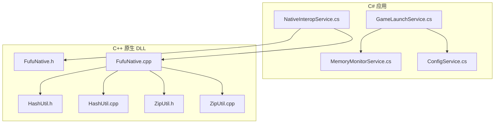
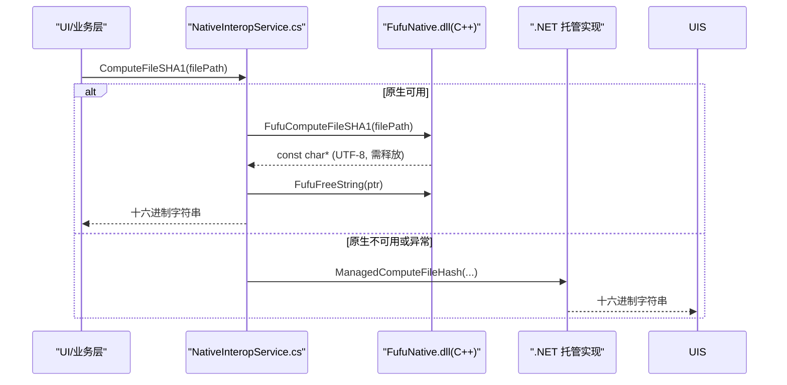
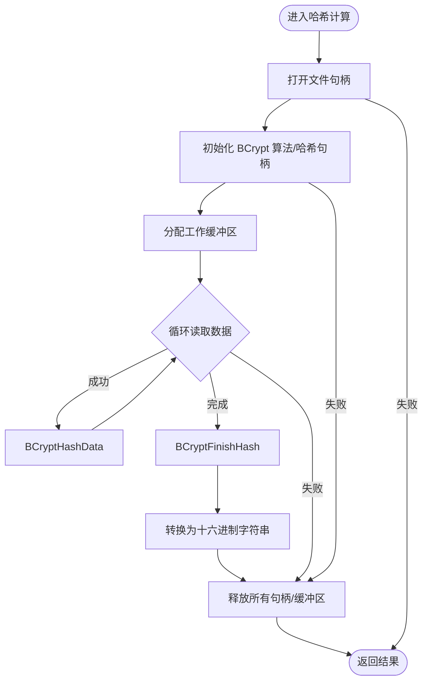
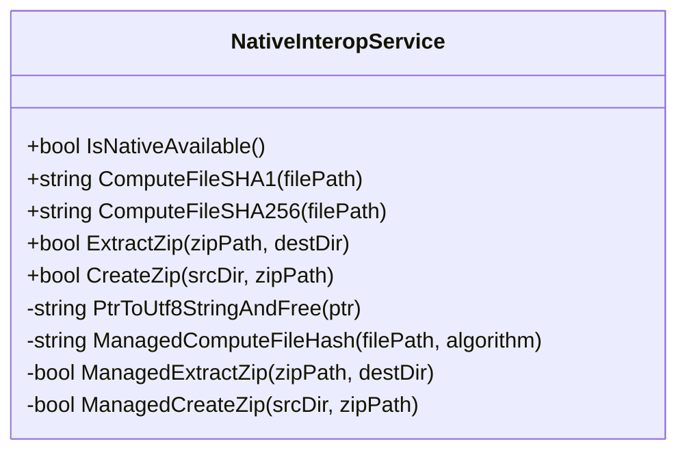
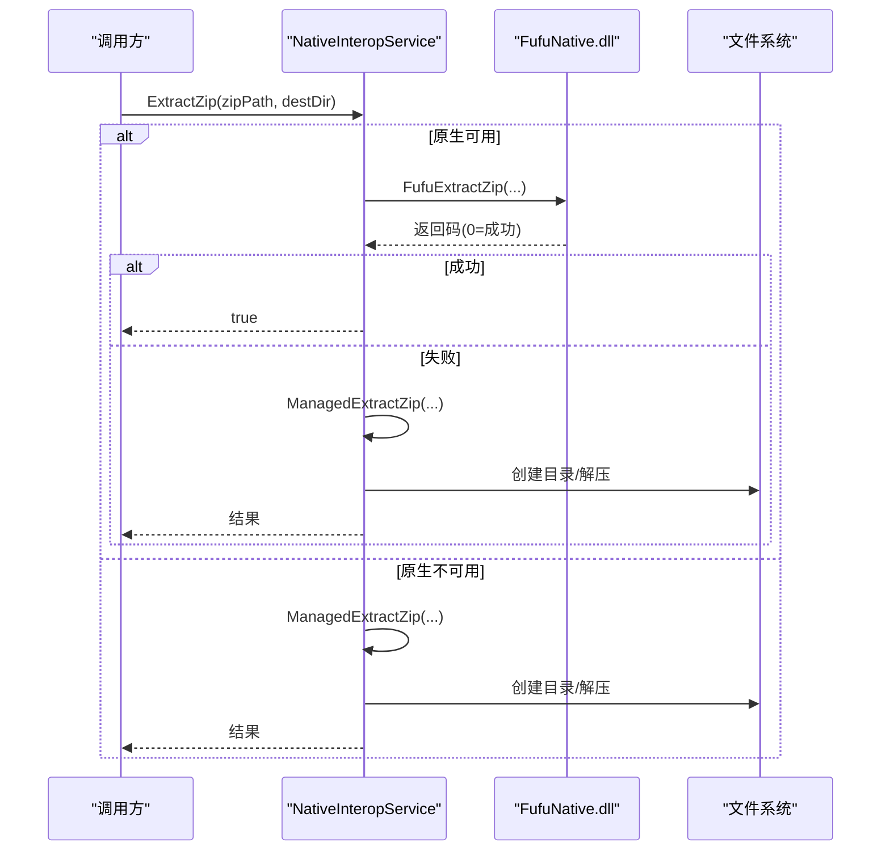
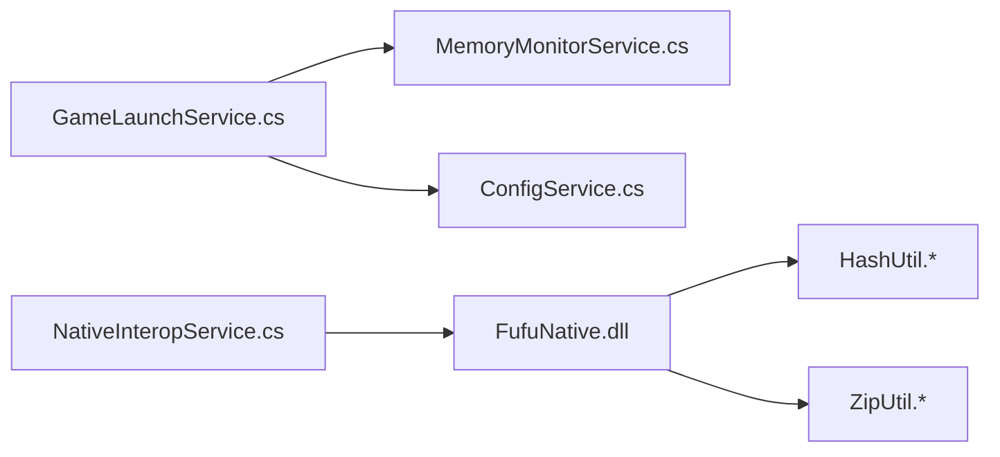

# 内存管理和性能优化

<cite>
**本文引用的文件**   
- [FufuNative.h](file://native/FufuNative/FufuNative.h)
- [FufuNative.cpp](file://native/FufuNative/FufuNative.cpp)
- [HashUtil.h](file://native/FufuNative/HashUtil.h)
- [HashUtil.cpp](file://native/FufuNative/HashUtil.cpp)
- [ZipUtil.h](file://native/FufuNative/ZipUtil.h)
- [ZipUtil.cpp](file://native/FufuNative/ZipUtil.cpp)
- [NativeInteropService.cs](file://src/FufuLauncher/Services/NativeInteropService.cs)
- [MemoryMonitorService.cs](file://src/FufuLauncher/Services/MemoryMonitorService.cs)
- [GameLaunchService.cs](file://src/FufuLauncher/Services/GameLaunchService.cs)
- [ConfigService.cs](file://src/FufuLauncher/Services/ConfigService.cs)
</cite>

## 目录
1. [简介](#简介)
2. [项目结构](#项目结构)
3. [核心组件](#核心组件)
4. [架构总览](#架构总览)
5. [详细组件分析](#详细组件分析)
6. [依赖关系分析](#依赖关系分析)
7. [性能考量](#性能考量)
8. [故障排查指南](#故障排查指南)
9. [结论](#结论)
10. [附录](#附录)

## 简介
本文件围绕原生组件的内存管理与性能优化，系统性梳理 C++ 侧的堆内存分配、字符串与资源释放策略，以及 C# 侧与垃圾回收器的交互方式（含非托管资源清理与 Finalizer 模式建议）。同时总结字符串处理最佳实践（UTF-8 转换、StringBuilder 使用、内存池思路），并给出性能监控与分析方法（系统内存计数器、JVM GC 参数、时间测量与日志）。最后提供可落地的代码示例路径，帮助实现高效的资源生命周期管理与错误恢复机制。

## 项目结构
本项目包含：
- native 层（C++）：提供高性能哈希计算与 ZIP 解压/打包能力，通过 P/Invoke 暴露给 C#。
- src 层（C#）：启动器服务，封装原生调用、内存监控、游戏进程启动与 JVM 参数拼装。
- bootstrap/packager：构建与打包工具链，不直接参与运行时内存管理。

**图表来源** 
- [FufuNative.h:1-53](file://native/FufuNative/FufuNative.h#L1-L53)
- [FufuNative.cpp:1-78](file://native/FufuNative/FufuNative.cpp#L1-L78)
- [HashUtil.h:1-23](file://native/FufuNative/HashUtil.h#L1-L23)
- [HashUtil.cpp:1-114](file://native/FufuNative/HashUtil.cpp#L1-L114)
- [ZipUtil.h:1-29](file://native/FufuNative/ZipUtil.h#L1-L29)
- [ZipUtil.cpp:1-301](file://native/FufuNative/ZipUtil.cpp#L1-L301)
- [NativeInteropService.cs:1-214](file://src/FufuLauncher/Services/NativeInteropService.cs#L1-L214)
- [MemoryMonitorService.cs:1-227](file://src/FufuLauncher/Services/MemoryMonitorService.cs#L1-L227)
- [GameLaunchService.cs:1-401](file://src/FufuLauncher/Services/GameLaunchService.cs#L1-L401)
- [ConfigService.cs:1-148](file://src/FufuLauncher/Services/ConfigService.cs#L1-L148)

**章节来源**
- [FufuNative.h:1-53](file://native/FufuNative/FufuNative.h#L1-L53)
- [FufuNative.cpp:1-78](file://native/FufuNative/FufuNative.cpp#L1-L78)
- [NativeInteropService.cs:1-214](file://src/FufuLauncher/Services/NativeInteropService.cs#L1-L214)
- [MemoryMonitorService.cs:1-227](file://src/FufuLauncher/Services/MemoryMonitorService.cs#L1-L227)
- [GameLaunchService.cs:1-401](file://src/FufuLauncher/Services/GameLaunchService.cs#L1-L401)
- [ConfigService.cs:1-148](file://src/FufuLauncher/Services/ConfigService.cs#L1-L148)

## 核心组件
- 原生导出接口（C++）
  - 文件哈希：SHA1/SHA256，返回 UTF-8 C 字符串，由调用方释放。
  - ZIP 操作：解压（支持进度回调）、创建备份包。
  - 版本查询：返回静态字符串。
- C# 互操作（P/Invoke）
  - 自动探测原生 DLL 可用性，失败回退到纯 .NET 实现。
  - 安全释放 C++ 分配的字符串内存，避免泄漏。
- 内存监控与智能分配
  - 读取系统物理内存状态，按配置预留系统内存后计算 Xmx/Xms。
  - 生成多核 GC 优化参数，提升 JVM 吞吐与延迟表现。
- 游戏启动与 JVM 参数拼装
  - 根据配置与实例信息拼接 classpath、JVM 参数，设置进程优先级与 CPU 亲和性。

**章节来源**
- [FufuNative.h:19-48](file://native/FufuNative/FufuNative.h#L19-L48)
- [FufuNative.cpp:21-78](file://native/FufuNative/FufuNative.cpp#L21-L78)
- [NativeInteropService.cs:20-214](file://src/FufuLauncher/Services/NativeInteropService.cs#L20-L214)
- [MemoryMonitorService.cs:26-227](file://src/FufuLauncher/Services/MemoryMonitorService.cs#L26-L227)
- [GameLaunchService.cs:104-316](file://src/FufuLauncher/Services/GameLaunchService.cs#L104-L316)

## 架构总览
下图展示 C# 与 C++ 之间的调用流、内存边界与错误回退路径。

**图表来源** 
- [NativeInteropService.cs:38-73](file://src/FufuLauncher/Services/NativeInteropService.cs#L38-L73)
- [FufuNative.h:19-28](file://native/FufuNative/FufuNative.h#L19-L28)
- [FufuNative.cpp:30-50](file://native/FufuNative/FufuNative.cpp#L30-L50)

## 详细组件分析

### C++ 侧内存分配与释放策略
- 字符串分配与释放
  - 所有返回 C 字符串的函数均通过统一分配器分配堆内存，并由调用方使用专用释放函数释放，避免跨分配器不一致导致的崩溃。
  - 空指针保护：对输入参数进行空检查，失败路径返回 nullptr 或错误码。
- 大对象与缓冲区
  - 哈希计算采用分块流式读取（固定大小缓冲），避免一次性加载大文件导致峰值内存飙升。
  - 临时缓冲区在作用域内显式释放，确保异常路径也能正确清理。
- 资源句柄与 COM
  - 文件句柄、BCrypt 算法/哈希句柄均在 goto cleanup 统一释放。
  - Shell COM 初始化/反初始化成对出现，避免线程模型冲突与资源泄漏。

**图表来源** 
- [HashUtil.cpp:34-105](file://native/FufuNative/HashUtil.cpp#L34-L105)

**章节来源**
- [FufuNative.cpp:21-50](file://native/FufuNative/FufuNative.cpp#L21-L50)
- [HashUtil.cpp:1-114](file://native/FufuNative/HashUtil.cpp#L1-L114)
- [ZipUtil.cpp:1-301](file://native/FufuNative/ZipUtil.cpp#L1-L301)

### C# 侧与垃圾回收的交互
- P/Invoke 字符串编组
  - 使用 LPUTF8Str 将 C# string 以 UTF-8 传入 C++；从 C++ 返回的 UTF-8 C 字符串通过手动扫描长度 + Marshal.Copy 转托管字符串，并在 finally 中释放原生内存。
- 非托管资源清理
  - 当前未使用 IDisposable/析构函数包装原生句柄；建议在需要长期持有 IntPtr 的场景引入 SafeHandle 派生类或使用 using 语义封装释放逻辑。
- Finalizer 模式建议
  - 若未来引入托管端持有的非托管资源（如文件句柄、COM 对象包装），应实现 IDisposable，并在 Finalizer 中兜底释放，防止主流程遗漏导致泄漏。

**图表来源** 
- [NativeInteropService.cs:20-214](file://src/FufuLauncher/Services/NativeInteropService.cs#L20-L214)

**章节来源**
- [NativeInteropService.cs:124-140](file://src/FufuLauncher/Services/NativeInteropService.cs#L124-L140)
- [NativeInteropService.cs:162-212](file://src/FufuLauncher/Services/NativeInteropService.cs#L162-L212)

### 字符串处理最佳实践
- UTF-8 编码转换
  - C++ 侧统一使用 Utf8ToWide/WideToUtf8 进行 WinAPI/COM 所需的宽字符转换，避免路径与文件名乱码。
  - C# 侧通过 UnmanagedType.LPUTF8Str 保证零拷贝/高效编组。
- StringBuilder 使用
  - 托管侧哈希输出使用 StringBuilder 预分配容量，减少扩容开销。
- 内存池技术（建议）
  - 对于高频小对象（如短字符串、临时缓冲区），可在 C++ 侧实现固定大小内存池，降低 new/delete 频率与碎片化。
  - 在 C# 侧可使用 ArrayPool<byte> 复用字节数组，减少 GC 压力。

**章节来源**
- [HashUtil.cpp:13-21](file://native/FufuNative/HashUtil.cpp#L13-L21)
- [ZipUtil.cpp:13-33](file://native/FufuNative/ZipUtil.cpp#L13-L33)
- [NativeInteropService.cs:162-179](file://src/FufuLauncher/Services/NativeInteropService.cs#L162-L179)

### 性能监控与分析方法
- 系统内存计数器
  - 通过 GlobalMemoryStatusEx 获取物理内存总量、已用/可用、负载百分比，用于 UI 展示与智能分配。
- JVM 参数优化
  - 基于物理核心数计算 ParallelGCThreads、ConcGCThreads、CICompilerCount，减少 GC 停顿与 JIT 编译竞争。
- 时间测量与日志
  - 关键路径（解压、哈希、启动）建议记录起止时间，结合 App.WriteAppLog 输出诊断信息。
- 内存分析工具
  - 使用 dotnet-counters、dotnet-gcstat、PerfView、Visual Studio 诊断工具等采集托管堆与 GC 行为。
  - 原生侧可使用 Windows Performance Toolkit、Visual Studio 内存快照定位泄漏点。

**章节来源**
- [MemoryMonitorService.cs:28-44](file://src/FufuLauncher/Services/MemoryMonitorService.cs#L28-L44)
- [MemoryMonitorService.cs:144-191](file://src/FufuLauncher/Services/MemoryMonitorService.cs#L144-L191)
- [MemoryMonitorService.cs:204-213](file://src/FufuLauncher/Services/MemoryMonitorService.cs#L204-L213)
- [GameLaunchService.cs:216-225](file://src/FufuLauncher/Services/GameLaunchService.cs#L216-L225)

### 资源生命周期管理与错误恢复
- 原生侧
  - 所有失败路径通过 goto cleanup 统一释放句柄与内存，确保异常安全。
  - 压缩/解压使用明确的错误码，便于上层回退与提示。
- 托管侧
  - 使用 try/catch 捕获 DllNotFoundException/EntryPointNotFoundException/BadImageFormatException，切换至托管实现并缓存不可用状态。
  - 文件 I/O 使用 using 语句确保流与文件句柄及时释放。
- 进程与外部资源
  - Java 进程启动后异步等待退出，捕获异常并释放进程引用，避免悬挂。

**图表来源** 
- [NativeInteropService.cs:85-101](file://src/FufuLauncher/Services/NativeInteropService.cs#L85-L101)
- [ZipUtil.cpp:57-200](file://native/FufuNative/ZipUtil.cpp#L57-L200)

**章节来源**
- [NativeInteropService.cs:85-119](file://src/FufuLauncher/Services/NativeInteropService.cs#L85-L119)
- [ZipUtil.cpp:57-200](file://native/FufuNative/ZipUtil.cpp#L57-L200)

## 依赖关系分析
- 模块耦合
  - NativeInteropService 强依赖 FufuNative 导出接口；当不可用时回退到托管实现，解耦了运行环境差异。
  - GameLaunchService 依赖 MemoryMonitorService 与 ConfigService 决定 JVM 参数与进程优化。
- 外部依赖
  - C++ 侧依赖 Windows BCrypt API 与 Shell COM；C# 侧依赖 System.IO.Compression、System.Security.Cryptography。
- 潜在循环依赖
  - 当前无循环依赖；各服务职责清晰，单向依赖。

**图表来源** 
- [GameLaunchService.cs:104-225](file://src/FufuLauncher/Services/GameLaunchService.cs#L104-L225)
- [NativeInteropService.cs:20-119](file://src/FufuLauncher/Services/NativeInteropService.cs#L20-L119)
- [FufuNative.cpp:1-78](file://native/FufuNative/FufuNative.cpp#L1-L78)

**章节来源**
- [GameLaunchService.cs:104-225](file://src/FufuLauncher/Services/GameLaunchService.cs#L104-L225)
- [NativeInteropService.cs:20-119](file://src/FufuLauncher/Services/NativeInteropService.cs#L20-L119)

## 性能考量
- 原生哈希与解压
  - 使用系统级加密库与 Shell COM，避免第三方库开销；分块读取控制内存峰值。
- 字符串与缓冲区
  - 预分配 StringBuilder 容量，减少扩容；必要时使用 ArrayPool<byte> 复用缓冲区。
- JVM 调优
  - 合理设置 Xms/Xmx，启用多核 GC 参数；在高配机器上适当增大并行线程数。
- I/O 与磁盘
  - 解压/打包时尽量顺序读写，避免频繁小文件写入；必要时合并写入批次。
- 进程调度
  - 可选提高进程优先级与绑定 CPU 亲和性，减少上下文切换与跨 NUMA 访问延迟。

[本节为通用指导，不直接分析具体文件]

## 故障排查指南
- 原生 DLL 缺失或入口不存在
  - 现象：抛出 DllNotFoundException/EntryPointNotFoundException/BadImageFormatException。
  - 处理：自动标记不可用并回退托管实现；检查 DLL 路径与平台匹配（x64/x86）。
- 字符串释放问题
  - 现象：程序崩溃或内存增长。
  - 处理：确认所有返回的 C 字符串均通过 FufuFreeString 释放；避免重复释放。
- 解压失败
  - 现象：返回非零错误码。
  - 处理：检查目标目录权限、ZIP 完整性、Shell COM 初始化；查看日志中的错误码含义。
- JVM 启动失败
  - 现象：Java 进程立即退出或无法启动。
  - 处理：校验 java.exe 完整性、Xmx/Xms 是否合理、classpath 是否正确；查看日志与事件查看器。

**章节来源**
- [NativeInteropService.cs:48-73](file://src/FufuLauncher/Services/NativeInteropService.cs#L48-L73)
- [FufuNative.cpp:46-50](file://native/FufuNative/FufuNative.cpp#L46-L50)
- [ZipUtil.cpp:57-200](file://native/FufuNative/ZipUtil.cpp#L57-L200)
- [GameLaunchService.cs:157-177](file://src/FufuLauncher/Services/GameLaunchService.cs#L157-L177)

## 结论
本项目在 C++ 侧实现了严格的内存分配与释放策略，配合 C# 侧的安全编组与回退机制，既保证了高性能，又提升了鲁棒性。通过系统内存监控与 JVM 参数优化，进一步提升了整体稳定性与用户体验。建议在后续迭代中引入更完善的非托管资源封装（SafeHandle/IDisposable）与内存池，持续降低 GC 压力与原生泄漏风险。

[本节为总结，不直接分析具体文件]

## 附录
- 关键实现路径参考
  - 原生导出与释放：[FufuNative.h:19-48](file://native/FufuNative/FufuNative.h#L19-L48)、[FufuNative.cpp:21-50](file://native/FufuNative/FufuNative.cpp#L21-L50)
  - 哈希计算与流式读取：[HashUtil.cpp:34-105](file://native/FufuNative/HashUtil.cpp#L34-L105)
  - ZIP 解压/打包与 COM 调用：[ZipUtil.cpp:57-200](file://native/FufuNative/ZipUtil.cpp#L57-L200)
  - C# 互操作与回退：[NativeInteropService.cs:38-119](file://src/FufuLauncher/Services/NativeInteropService.cs#L38-L119)
  - 内存监控与智能分配：[MemoryMonitorService.cs:144-213](file://src/FufuLauncher/Services/MemoryMonitorService.cs#L144-L213)
  - 游戏启动与 JVM 参数：[GameLaunchService.cs:200-225](file://src/FufuLauncher/Services/GameLaunchService.cs#L200-L225)

[本节为索引，不直接分析具体文件]