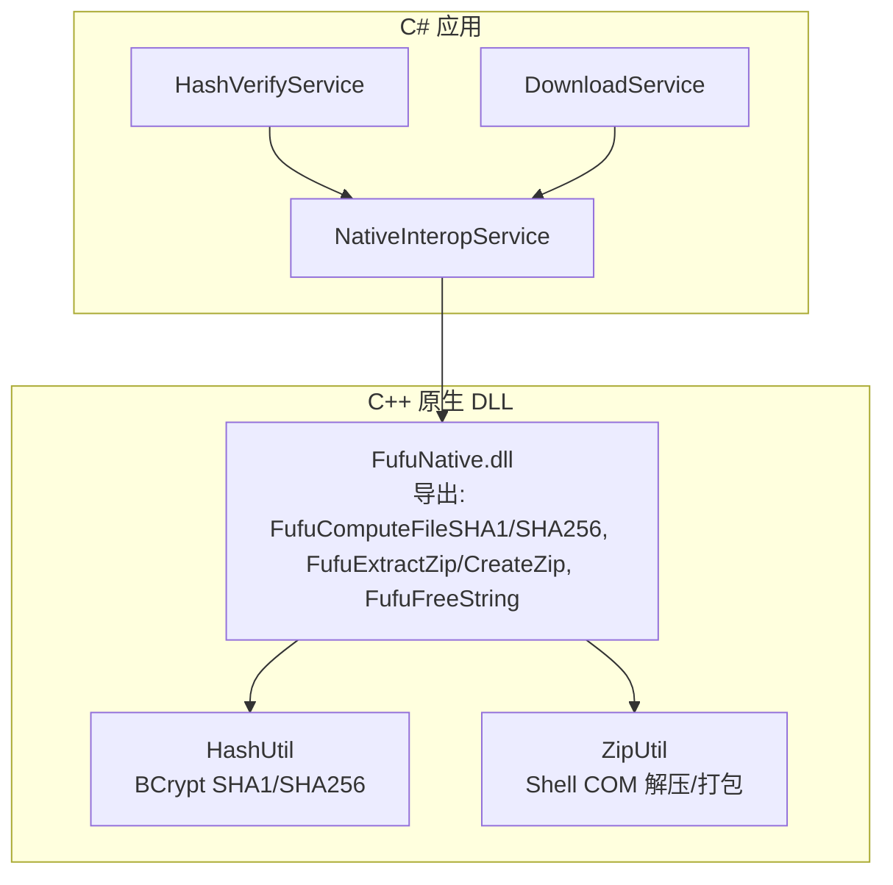
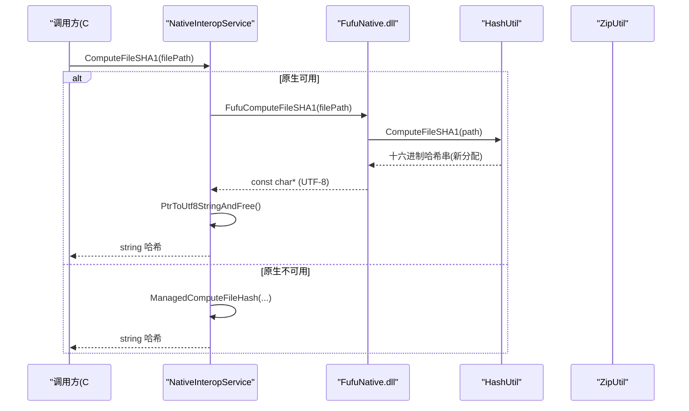
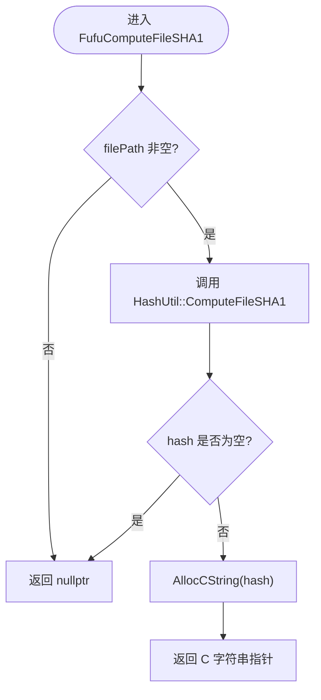
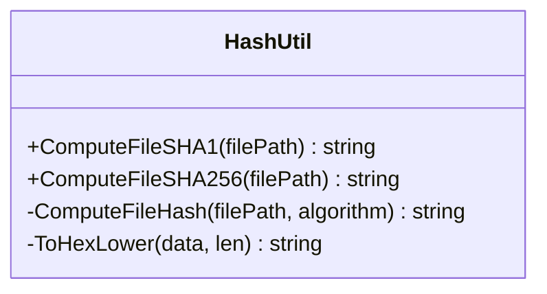
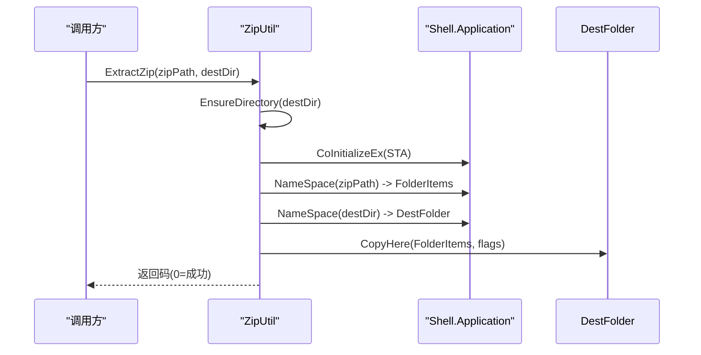
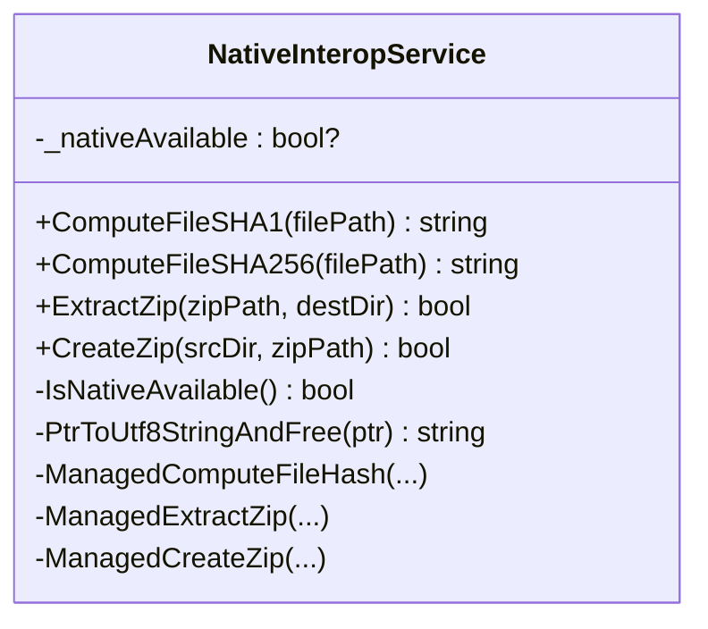
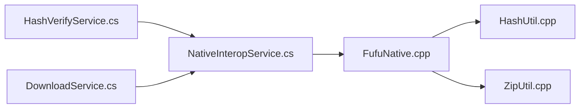

# 原生组件集成

<cite>
**本文引用的文件**   
- [FufuNative.h](file://native/FufuNative/FufuNative.h)
- [FufuNative.cpp](file://native/FufuNative/FufuNative.cpp)
- [HashUtil.h](file://native/FufuNative/HashUtil.h)
- [HashUtil.cpp](file://native/FufuNative/HashUtil.cpp)
- [ZipUtil.h](file://native/FufuNative/ZipUtil.h)
- [ZipUtil.cpp](file://native/FufuNative/ZipUtil.cpp)
- [pch.h](file://native/FufuNative/pch.h)
- [pch.cpp](file://native/FufuNative/pch.cpp)
- [NativeInteropService.cs](file://src/FufuLauncher/Services/NativeInteropService.cs)
- [HashVerifyService.cs](file://src/FufuLauncher/Services/HashVerifyService.cs)
- [DownloadService.cs](file://src/FufuLauncher/Services/DownloadService.cs)
</cite>

## 目录
1. [简介](#简介)
2. [项目结构](#项目结构)
3. [核心组件](#核心组件)
4. [架构总览](#架构总览)
5. [详细组件分析](#详细组件分析)
6. [依赖关系分析](#依赖关系分析)
7. [性能考量](#性能考量)
8. [故障排查指南](#故障排查指南)
9. [结论](#结论)
10. [附录：调用示例与最佳实践](#附录调用示例与最佳实践)

## 简介
本文件面向“可爱的芙芙启动器”的原生组件集成，系统性说明 C++ FufuNative 组件的架构设计、DLL 导出入口、P/Invoke 接口定义与内存管理策略；深入解析 HashUtil 的文件哈希计算（SHA1/SHA256）实现与优化；详述 ZipUtil 的 ZIP 解压与打包细节、大文件处理与错误恢复机制；记录 C# 与 C++ 之间的通信协议（数据类型映射、异常处理、性能考虑），并提供调用示例、调试技巧与性能分析方法。

## 项目结构
- 原生层（C++/Win32）
  - FufuNative.h/.cpp：DLL 导出入口与对外 C 风格 API
  - HashUtil.h/.cpp：基于 Windows BCrypt 的高性能 SHA1/SHA256 文件哈希
  - ZipUtil.h/.cpp：基于 Shell COM 的 ZIP 解压/打包
  - pch.h/.cpp：预编译头与公共包含
- 托管层（C#）
  - NativeInteropService.cs：P/Invoke 封装、自动 fallback 到纯 .NET 实现、内存释放与错误处理
  - 使用方服务：HashVerifyService.cs、DownloadService.cs 等通过 NativeInteropService 访问原生能力

**图表来源**
- [FufuNative.h:1-53](file://native/FufuNative/FufuNative.h#L1-L53)
- [FufuNative.cpp:1-78](file://native/FufuNative/FufuNative.cpp#L1-L78)
- [HashUtil.h:1-23](file://native/FufuNative/HashUtil.h#L1-L23)
- [HashUtil.cpp:1-114](file://native/FufuNative/HashUtil.cpp#L1-L114)
- [ZipUtil.h:1-29](file://native/FufuNative/ZipUtil.h#L1-L29)
- [ZipUtil.cpp:1-301](file://native/FufuNative/ZipUtil.cpp#L1-L301)
- [NativeInteropService.cs:1-214](file://src/FufuLauncher/Services/NativeInteropService.cs#L1-L214)

**章节来源**
- [FufuNative.h:1-53](file://native/FufuNative/FufuNative.h#L1-L53)
- [FufuNative.cpp:1-78](file://native/FufuNative/FufuNative.cpp#L1-L78)
- [NativeInteropService.cs:1-214](file://src/FufuLauncher/Services/NativeInteropService.cs#L1-L214)

## 核心组件
- FufuNative 导出接口
  - 字符串编码：UTF-8（C# 侧使用 LPUTF8Str）
  - 调用约定：cdecl
  - 内存分配：由 DLL 分配的 C 字符串需通过 FufuFreeString 释放
  - 主要函数：
    - 文件哈希：FufuComputeFileSHA1 / FufuComputeFileSHA256
    - 字符串释放：FufuFreeString
    - ZIP 操作：FufuExtractZip / FufuExtractZipWithProgress / FufuCreateZip
    - 版本查询：FufuGetVersion
- HashUtil
  - 基于 Windows BCrypt 算法提供高性能 SHA1/SHA256
  - 分块流式读取（1MB 缓冲），避免大文件内存峰值
  - 字节转小写十六进制输出
- ZipUtil
  - 解压：通过 Shell.Application NameSpace + CopyHere 调用系统内置 ZIP 支持
  - 打包：写入最小合法空 ZIP 头后，再使用 Shell 复制源目录内容
  - 路径与编码：UTF-8 与 UTF-16 互转，递归创建目录
  - 进度回调：支持回调（当前/总数/文件名）
- NativeInteropService（C# 侧）
  - P/Invoke 声明与调用
  - 自动探测与缓存原生可用性
  - 失败时回退到纯 .NET 实现（功能等价）
  - 统一异常捕获与内存释放

**章节来源**
- [FufuNative.h:1-53](file://native/FufuNative/FufuNative.h#L1-L53)
- [FufuNative.cpp:1-78](file://native/FufuNative/FufuNative.cpp#L1-L78)
- [HashUtil.h:1-23](file://native/FufuNative/HashUtil.h#L1-L23)
- [HashUtil.cpp:1-114](file://native/FufuNative/HashUtil.cpp#L1-L114)
- [ZipUtil.h:1-29](file://native/FufuNative/ZipUtil.h#L1-L29)
- [ZipUtil.cpp:1-301](file://native/FufuNative/ZipUtil.cpp#L1-L301)
- [NativeInteropService.cs:1-214](file://src/FufuLauncher/Services/NativeInteropService.cs#L1-L214)

## 架构总览
整体采用“原生加速 + 托管兜底”的双通道架构：
- 优先尝试 C++ 原生路径以获得更高性能
- 若原生不可用或调用失败，自动降级到纯 .NET 实现，保证功能可用性与稳定性
- C# 与 C++ 之间通过 UTF-8 字符串与整型返回码进行通信，避免复杂类型转换带来的开销与风险

**图表来源**
- [NativeInteropService.cs:28-55](file://src/FufuLauncher/Services/NativeInteropService.cs#L28-L55)
- [FufuNative.cpp:30-36](file://native/FufuNative/FufuNative.cpp#L30-L36)
- [HashUtil.cpp:107-113](file://native/FufuNative/HashUtil.cpp#L107-L113)

## 详细组件分析

### C++ 导出入口与内存管理（FufuNative）
- 导出约定
  - 调用约定：cdecl
  - 字符串：UTF-8 编码，C# 侧使用 LPUTF8Str
  - 返回值：字符串为 C 风格指针，由 DLL 分配，必须通过 FufuFreeString 释放
- 关键实现要点
  - AllocCString：将 std::string 复制到堆上并返回 C 字符串
  - 哈希函数：参数校验 -> 调用 HashUtil -> 分配并返回结果
  - ZIP 函数：参数校验 -> 调用 ZipUtil -> 返回整型错误码
  - 版本信息：返回静态字符串

**图表来源**
- [FufuNative.cpp:30-36](file://native/FufuNative/FufuNative.cpp#L30-L36)

**章节来源**
- [FufuNative.h:1-53](file://native/FufuNative/FufuNative.h#L1-L53)
- [FufuNative.cpp:1-78](file://native/FufuNative/FufuNative.cpp#L1-L78)

### 文件哈希计算（HashUtil）
- 算法与平台
  - 使用 Windows BCrypt API 提供硬件加速与内核级优化
  - 支持 SHA1 与 SHA256
- 性能优化
  - 分块读取：1MB 缓冲区流式读取，降低内存占用
  - 直接写入哈希上下文：避免中间拷贝
  - ToHexLower：就地生成小写十六进制字符串，减少额外分配
- 错误处理
  - 文件打开失败、获取大小失败、BCrypt 初始化失败等均返回空串
  - 资源清理：确保关闭句柄、销毁哈希对象、释放算法提供者

**图表来源**
- [HashUtil.h:1-23](file://native/FufuNative/HashUtil.h#L1-L23)
- [HashUtil.cpp:1-114](file://native/FufuNative/HashUtil.cpp#L1-L114)

**章节来源**
- [HashUtil.h:1-23](file://native/FufuNative/HashUtil.h#L1-L23)
- [HashUtil.cpp:1-114](file://native/FufuNative/HashUtil.cpp#L1-L114)

### ZIP 解压与打包（ZipUtil）
- 解压流程
  - 目标目录存在性检查与递归创建
  - 初始化 COM（STA 模式），兼容已初始化为 MTA 的情况
  - 通过 Shell.Application.NameSpace 获取 ZIP 与目标文件夹对象
  - 调用 CopyHere 执行解压（静默无 UI）
  - 回调：由于 Shell 解压异步，完成时触发一次回调
- 打包流程
  - 先写入最小合法空 ZIP 头（PK\x05\x06 签名）
  - 通过 Shell.CopyHere 将源目录内容复制到 ZIP
- 错误恢复与健壮性
  - 路径规范化（末尾分隔符）
  - 目录属性复查，避免把文件误判为目录
  - 统一的 goto cleanup 资源释放路径，防止泄漏
- 大文件处理
  - 解压由系统 Shell 负责，内存占用低
  - 打包同样依赖系统压缩引擎，适合大目录

**图表来源**
- [ZipUtil.cpp:57-200](file://native/FufuNative/ZipUtil.cpp#L57-L200)

**章节来源**
- [ZipUtil.h:1-29](file://native/FufuNative/ZipUtil.h#L1-L29)
- [ZipUtil.cpp:1-301](file://native/FufuNative/ZipUtil.cpp#L1-L301)

### C# 与 C++ 通信协议（NativeInteropService）
- 数据类型映射
  - C++ const char*（UTF-8） <-> C# string（LPUTF8Str）
  - C++ int 错误码 <-> C# bool（封装为 true/false）
  - 字符串内存：C++ 分配，C# 通过 FufuFreeString 释放
- 调用约定与异常
  - CallingConvention.Cdecl
  - 捕获 DllNotFoundException、EntryPointNotFoundException、BadImageFormatException 等
  - 首次调用探测并缓存可用性，后续直接走对应路径
- 回退策略
  - 原生失败时自动切换到托管实现（SHA1/SHA256、ZIP 解压/打包）
  - 托管实现保证功能等价，提升鲁棒性

**图表来源**
- [NativeInteropService.cs:1-214](file://src/FufuLauncher/Services/NativeInteropService.cs#L1-L214)

**章节来源**
- [NativeInteropService.cs:1-214](file://src/FufuLauncher/Services/NativeInteropService.cs#L1-L214)

## 依赖关系分析
- 原生层依赖
  - FufuNative 依赖 HashUtil 与 ZipUtil
  - HashUtil 依赖 Windows BCrypt API
  - ZipUtil 依赖 Shell COM（NameSpace/CopyHere）
- 托管层依赖
  - NativeInteropService 依赖 System.IO.Compression、System.Security.Cryptography
  - 各业务服务（如 HashVerifyService、DownloadService）通过 DI 注入 NativeInteropService

**图表来源**
- [FufuNative.cpp:1-78](file://native/FufuNative/FufuNative.cpp#L1-L78)
- [HashUtil.cpp:1-114](file://native/FufuNative/HashUtil.cpp#L1-L114)
- [ZipUtil.cpp:1-301](file://native/FufuNative/ZipUtil.cpp#L1-L301)
- [NativeInteropService.cs:1-214](file://src/FufuLauncher/Services/NativeInteropService.cs#L1-L214)
- [HashVerifyService.cs:1-85](file://src/FufuLauncher/Services/HashVerifyService.cs#L1-L85)
- [DownloadService.cs:580-592](file://src/FufuLauncher/Services/DownloadService.cs#L580-L592)

**章节来源**
- [FufuNative.cpp:1-78](file://native/FufuNative/FufuNative.cpp#L1-L78)
- [NativeInteropService.cs:1-214](file://src/FufuLauncher/Services/NativeInteropService.cs#L1-L214)

## 性能考量
- 哈希计算
  - 使用 BCrypt 硬件加速，1MB 分块读取，避免大文件内存峰值
  - 建议批量校验时复用 HashAlgorithm（托管侧已按方法内创建，可进一步优化为单例）
- ZIP 操作
  - 解压由系统 Shell 负责，I/O 与 CPU 压力较低
  - 打包前写入空 ZIP 头，避免重复创建容器
- 互操作开销
  - 字符串跨边界传递成本较高，尽量在 C# 侧合并请求、减少往返次数
  - 首次可用性探测有轻微开销，已通过缓存避免重复检测

[本节为通用指导，不直接分析具体文件]

## 故障排查指南
- 常见问题定位
  - 原生 DLL 缺失或架构不匹配：会抛出 DllNotFoundException/EntryPointNotFoundException/BadImageFormatException，此时自动回退到托管实现
  - 路径无效或权限不足：ZIP 解压/打包返回非零错误码；哈希计算返回空串
  - COM 初始化冲突：CoInitializeEx 可能返回 RPC_E_CHANGED_MODE，代码已做兼容处理
- 诊断步骤
  - 确认 FufuNative.dll 位于运行时路径（runtimes\win-x64\native\FufuNative.dll）
  - 检查目标目录是否存在且可写
  - 验证 ZIP 文件是否损坏或受保护
  - 查看 IsNativeAvailable() 结果，判断是否走原生路径
- 日志与断点
  - 在 NativeInteropService 的 try/catch 处设置断点，观察异常类型
  - 在 FufuNative.cpp 的导出函数入口处设置断点，确认调用链
  - 在 ZipUtil.cpp 的每个 resultCode 分支打印错误码，快速定位失败阶段

**章节来源**
- [NativeInteropService.cs:40-73](file://src/FufuLauncher/Services/NativeInteropService.cs#L40-L73)
- [ZipUtil.cpp:189-200](file://native/FufuNative/ZipUtil.cpp#L189-L200)
- [FufuNative.cpp:52-71](file://native/FufuNative/FufuNative.cpp#L52-L71)

## 结论
本项目通过“原生加速 + 托管兜底”的架构，在保证高可用性的同时获得显著的性能收益。C++ 层利用 BCrypt 与 Shell COM 提供高效哈希与 ZIP 能力；C# 层通过严谨的 P/Invoke 封装与异常处理，确保跨语言调用的安全与稳定。建议在大规模文件校验与解压场景中启用原生路径，并在部署时确保 DLL 正确放置与权限配置。

[本节为总结性内容，不直接分析具体文件]

## 附录：调用示例与最佳实践

### C# 调用示例（哈希校验）
- 场景：下载完成后校验文件 SHA1
- 关键点：
  - 使用 NativeInteropService.ComputeFileSHA1
  - 比较期望值与实际值（忽略大小写）
  - 若原生不可用，自动回退到托管实现

参考位置
- [HashVerifyService.Verify:34-70](file://src/FufuLauncher/Services/HashVerifyService.cs#L34-L70)
- [DownloadService.VerifySha1:584-590](file://src/FufuLauncher/Services/DownloadService.cs#L584-L590)

### C# 调用示例（ZIP 解压）
- 场景：Java 运行时包解压
- 关键点：
  - 使用 NativeInteropService.ExtractZip
  - 关注返回值（true/false）
  - 失败时自动回退到托管实现

参考位置
- [JavaRuntimeService 解压调用:240-250](file://src/FufuLauncher/Services/JavaRuntimeService.cs#L240-L250)

### 异步操作建议
- 对于大文件哈希与 ZIP 解压，建议在 UI 线程外执行（Task.Run 或 IAsyncEnumerable）
- 如需进度反馈，可在 C# 侧包装回调或使用事件通知（当前 C++ 进度回调未暴露给 C#）

### 错误处理最佳实践
- 始终检查返回值与空串
- 捕获可能的 P/Invoke 异常并降级到托管实现
- 对路径与权限进行前置校验，减少失败概率

### 调试技巧
- 在 NativeInteropService.IsNativeAvailable 处打点，确认原生可用性
- 在 FufuNative 导出函数入口设置断点，观察参数与返回值
- 在 ZipUtil 的错误分支打印错误码，定位失败阶段

### 性能分析方法
- 使用性能分析工具（如 Visual Studio Profiler）测量哈希与解压耗时
- 对比原生与托管实现的差异，评估收益
- 监控 I/O 与内存峰值，确保分块读取有效降低内存占用

[本节为通用指导，不直接分析具体文件]