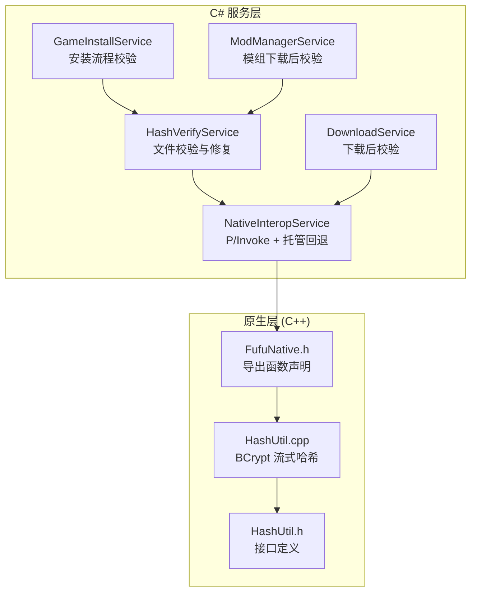
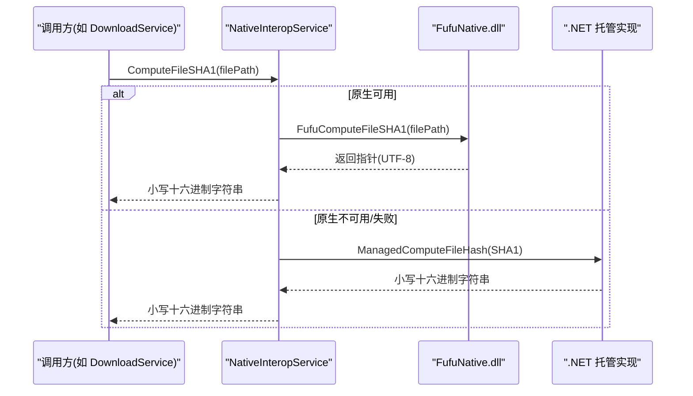
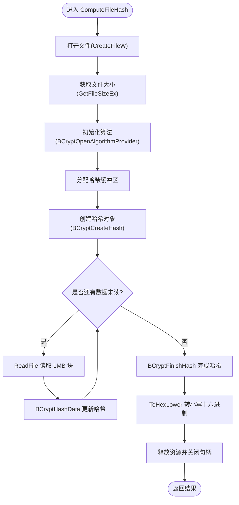
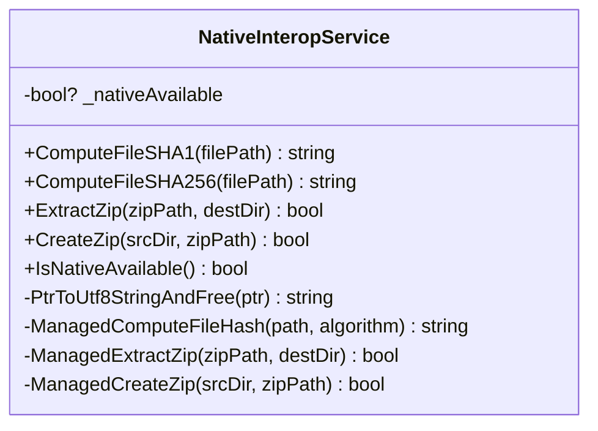
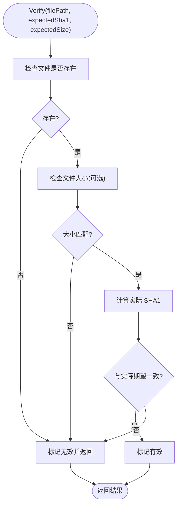
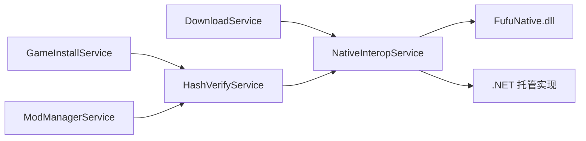

# 文件哈希计算功能

<cite>
**本文引用的文件**   
- [HashVerifyService.cs](file://src/FufuLauncher/Services/HashVerifyService.cs)
- [NativeInteropService.cs](file://src/FufuLauncher/Services/NativeInteropService.cs)
- [HashUtil.cpp](file://native/FufuNative/HashUtil.cpp)
- [HashUtil.h](file://native/FufuNative/HashUtil.h)
- [FufuNative.h](file://native/FufuNative/FufuNative.h)
- [DownloadService.cs](file://src/FufuLauncher/Services/DownloadService.cs)
- [GameInstallService.cs](file://src/FufuLauncher/Services/GameInstallService.cs)
- [ModManagerService.cs](file://src/FufuLauncher/Services/ModManagerService.cs)
</cite>

## 目录
1. [简介](#简介)
2. [项目结构](#项目结构)
3. [核心组件](#核心组件)
4. [架构总览](#架构总览)
5. [详细组件分析](#详细组件分析)
6. [依赖关系分析](#依赖关系分析)
7. [性能考量](#性能考量)
8. [故障排查指南](#故障排查指南)
9. [结论](#结论)
10. [附录：使用示例与最佳实践](#附录使用示例与最佳实践)

## 简介
本文件围绕“文件哈希计算”能力进行系统化文档说明，覆盖 SHA1 与 SHA256 算法实现、原生库集成（Windows BCrypt API）、大文件分块读取策略、缓冲区大小与内存控制、完整性校验流程（路径验证、权限检查、错误处理）、性能优化（多线程并行与缓存策略），以及与其他组件的集成方式与数据格式要求。同时提供可操作的调用示例，包括进度监控与异常处理建议。

## 项目结构
该功能由三层组成：
- C# 服务层：对外暴露统一的哈希计算与校验接口，并封装 P/Invoke 调用与托管回退实现。
- 原生层（C++）：基于 Windows BCrypt API 的高性能哈希实现，支持 SHA1/SHA256 流式计算。
- 业务集成层：下载、安装、模组管理等模块在关键节点调用哈希校验，确保文件完整性。

图表来源
- [HashVerifyService.cs:1-85](file://src/FufuLauncher/Services/HashVerifyService.cs#L1-L85)
- [NativeInteropService.cs:1-214](file://src/FufuLauncher/Services/NativeInteropService.cs#L1-L214)
- [FufuNative.h:1-53](file://native/FufuNative/FufuNative.h#L1-L53)
- [HashUtil.cpp:1-114](file://native/FufuNative/HashUtil.cpp#L1-L114)
- [HashUtil.h:1-23](file://native/FufuNative/HashUtil.h#L1-L23)

章节来源
- [HashVerifyService.cs:1-85](file://src/FufuLauncher/Services/HashVerifyService.cs#L1-L85)
- [NativeInteropService.cs:1-214](file://src/FufuLauncher/Services/NativeInteropService.cs#L1-L214)
- [FufuNative.h:1-53](file://native/FufuNative/FufuNative.h#L1-L53)
- [HashUtil.cpp:1-114](file://native/FufuNative/HashUtil.cpp#L1-L114)
- [HashUtil.h:1-23](file://native/FufuNative/HashUtil.h#L1-L23)

## 核心组件
- HashVerifyService：提供单文件与批量校验入口，负责存在性、大小、SHA1 校验与结果聚合。
- NativeInteropService：统一封装原生 DLL 调用与托管 fallback，自动探测可用性并缓存状态。
- HashUtil（C++）：基于 Windows BCrypt API 的流式哈希实现，支持 SHA1/SHA256，1MB 分块读取。
- FufuNative.h：原生导出函数声明，约定 UTF-8 字符串与释放接口。
- DownloadService / GameInstallService / ModManagerService：在关键业务流程中调用哈希校验，保障完整性。

章节来源
- [HashVerifyService.cs:24-84](file://src/FufuLauncher/Services/HashVerifyService.cs#L24-L84)
- [NativeInteropService.cs:20-73](file://src/FufuLauncher/Services/NativeInteropService.cs#L20-L73)
- [HashUtil.cpp:34-113](file://native/FufuNative/HashUtil.cpp#L34-L113)
- [FufuNative.h:19-28](file://native/FufuNative/FufuNative.h#L19-L28)
- [DownloadService.cs:584-590](file://src/FufuLauncher/Services/DownloadService.cs#L584-L590)
- [GameInstallService.cs:50-80](file://src/FufuLauncher/Services/GameInstallService.cs#L50-L80)
- [ModManagerService.cs:300-318](file://src/FufuLauncher/Services/ModManagerService.cs#L300-L318)

## 架构总览
整体采用“原生优先 + 托管回退”的双通道设计：
- 原生通道：通过 P/Invoke 调用 FufuNative.dll，内部使用 BCrypt API 进行高性能流式哈希。
- 托管通道：若原生不可用或失败，则回退到 .NET 托管实现，保证功能等价与运行鲁棒性。

图表来源
- [NativeInteropService.cs:38-73](file://src/FufuLauncher/Services/NativeInteropService.cs#L38-L73)
- [FufuNative.h:19-28](file://native/FufuNative/FufuNative.h#L19-L28)
- [HashUtil.cpp:107-113](file://native/FufuNative/HashUtil.cpp#L107-L113)

## 详细组件分析

### 原生哈希实现（HashUtil.cpp/h）
- 算法选择：通过 BCryptOpenAlgorithmProvider 打开算法提供者，支持 BCRYPT_SHA1_ALGORITHM 与 BCRYPT_SHA256_ALGORITHM。
- 流式读取：以 1MB 为缓冲区大小循环 ReadFile，逐块 BCryptHashData 更新哈希状态，避免一次性加载大文件。
- 资源管理：成功时 BCryptFinishHash 输出哈希字节，ToHexLower 转为小写十六进制；失败路径统一 goto cleanup 释放句柄与内存。
- 编码转换：Utf8ToWide 将 UTF-8 路径转换为宽字符以调用 CreateFileW。

图表来源
- [HashUtil.cpp:34-105](file://native/FufuNative/HashUtil.cpp#L34-L105)

章节来源
- [HashUtil.cpp:1-114](file://native/FufuNative/HashUtil.cpp#L1-L114)
- [HashUtil.h:1-23](file://native/FufuNative/HashUtil.h#L1-L23)

### 原生导出接口（FufuNative.h）
- 导出函数：FufuComputeFileSHA1、FufuComputeFileSHA256、FufuFreeString。
- 调用约定：cdecl；字符串编码：UTF-8；返回值由调用方使用 FufuFreeString 释放。

章节来源
- [FufuNative.h:19-28](file://native/FufuNative/FufuNative.h#L19-L28)

### C# 互操作与回退（NativeInteropService.cs）
- P/Invoke 声明：导入原生函数，指定 CallingConvention.Cdecl 与 LPUTF8Str 编组。
- 可用性探测：首次调用尝试探测原生 DLL，缓存 _nativeAvailable 避免重复开销。
- 异常处理：捕获 DllNotFoundException、EntryPointNotFoundException、BadImageFormatException 等，切换至托管实现。
- 托管实现：ManagedComputeFileHash 使用 System.Security.Cryptography.HashAlgorithm 计算哈希，失败返回空串。

图表来源
- [NativeInteropService.cs:20-214](file://src/FufuLauncher/Services/NativeInteropService.cs#L20-L214)

章节来源
- [NativeInteropService.cs:1-214](file://src/FufuLauncher/Services/NativeInteropService.cs#L1-L214)

### 文件校验服务（HashVerifyService.cs）
- Verify：检查文件存在性、可选大小校验、计算实际 SHA1 并与期望值比较（忽略大小写）。
- VerifyBatch：遍历文件列表，收集需要重新下载的文件结果。
- 数据结构：FileVerifyResult 包含路径、期望/实际 SHA1、存在性、有效性、期望/实际大小。

图表来源
- [HashVerifyService.cs:34-70](file://src/FufuLauncher/Services/HashVerifyService.cs#L34-L70)

章节来源
- [HashVerifyService.cs:1-85](file://src/FufuLauncher/Services/HashVerifyService.cs#L1-L85)

### 下载与安装流程中的校验集成
- DownloadService.VerifySha1：下载完成后根据期望 SHA1 校验文件，缺失或哈希不符视为失败。
- GameInstallService：在安装流程中组织任务清单，下载完成后调用校验与修复逻辑。
- ModManagerService：模组下载完成后进行二次校验，失败则删除损坏文件并提示。

章节来源
- [DownloadService.cs:584-590](file://src/FufuLauncher/Services/DownloadService.cs#L584-L590)
- [GameInstallService.cs:50-80](file://src/FufuLauncher/Services/GameInstallService.cs#L50-L80)
- [ModManagerService.cs:300-318](file://src/FufuLauncher/Services/ModManagerService.cs#L300-L318)

## 依赖关系分析
- HashVerifyService 依赖 NativeInteropService 进行哈希计算。
- NativeInteropService 依赖原生 DLL（FufuNative.dll）与 .NET 托管实现作为回退。
- 业务服务（DownloadService、GameInstallService、ModManagerService）通过上述服务完成完整性校验。

图表来源
- [HashVerifyService.cs:24-84](file://src/FufuLauncher/Services/HashVerifyService.cs#L24-L84)
- [NativeInteropService.cs:20-73](file://src/FufuLauncher/Services/NativeInteropService.cs#L20-L73)
- [DownloadService.cs:584-590](file://src/FufuLauncher/Services/DownloadService.cs#L584-L590)
- [GameInstallService.cs:50-80](file://src/FufuLauncher/Services/GameInstallService.cs#L50-L80)
- [ModManagerService.cs:300-318](file://src/FufuLauncher/Services/ModManagerService.cs#L300-L318)

章节来源
- [HashVerifyService.cs:24-84](file://src/FufuLauncher/Services/HashVerifyService.cs#L24-L84)
- [NativeInteropService.cs:20-73](file://src/FufuLauncher/Services/NativeInteropService.cs#L20-L73)
- [DownloadService.cs:584-590](file://src/FufuLauncher/Services/DownloadService.cs#L584-L590)
- [GameInstallService.cs:50-80](file://src/FufuLauncher/Services/GameInstallService.cs#L50-L80)
- [ModManagerService.cs:300-318](file://src/FufuLauncher/Services/ModManagerService.cs#L300-L318)

## 性能考量
- 原生优先：BCrypt API 利用系统级加密原语，具备硬件加速潜力，适合大文件与高并发场景。
- 分块读取：1MB 缓冲平衡 I/O 吞吐与内存占用，避免一次性加载导致峰值内存飙升。
- 回退机制：当原生不可用时自动降级到托管实现，保证功能可用性。
- 线程安全：各服务方法无共享可变状态，适合在多线程环境中并发调用；建议在业务层对批量任务进行限流与调度。
- 缓存策略：可在上层对频繁校验的文件引入本地缓存（如按路径+期望值缓存结果），减少重复计算。

[本节为通用指导，不直接分析具体文件]

## 故障排查指南
- 原生 DLL 缺失或版本不匹配：
  - 现象：抛出 DllNotFoundException、EntryPointNotFoundException、BadImageFormatException。
  - 处理：NativeInteropService 会记录不可用并回退到托管实现；检查 DLL 路径与平台架构一致性。
- 文件路径或权限问题：
  - 现象：CreateFileW 失败或 ReadFile 失败，返回空串或校验失败。
  - 处理：确认路径存在、可读；检查进程权限与防病毒软件拦截。
- 哈希不一致：
  - 现象：ActualSha1 与 ExpectedSha1 不一致。
  - 处理：重新下载文件；检查源端哈希是否正确；必要时启用二次校验。
- 内存不足：
  - 现象：分配哈希缓冲区或 1MB 缓冲失败。
  - 处理：降低并发度；检查系统内存压力；确认无内存泄漏。

章节来源
- [NativeInteropService.cs:48-73](file://src/FufuLauncher/Services/NativeInteropService.cs#L48-L73)
- [HashUtil.cpp:34-105](file://native/FufuNative/HashUtil.cpp#L34-L105)
- [HashVerifyService.cs:34-70](file://src/FufuLauncher/Services/HashVerifyService.cs#L34-L70)

## 结论
本方案通过原生 BCrypt 实现与托管回退相结合，提供了高效、稳健的文件哈希计算与完整性校验能力。结合 1MB 分块读取与完善的错误处理，能够在不同环境与负载下稳定运行。建议在业务层配合并发控制与结果缓存，进一步提升整体性能与用户体验。

[本节为总结性内容，不直接分析具体文件]

## 附录：使用示例与最佳实践
- 基本用法（C#）：
  - 通过 HashVerifyService.Verify 进行单文件校验，传入路径、期望 SHA1 与可选期望大小。
  - 通过 HashVerifyService.VerifyBatch 批量校验，收集需重新下载的结果。
- 下载后校验（C#）：
  - 使用 DownloadService.VerifySha1 在文件下载完成后进行 SHA1 校验。
- 安装流程校验（C#）：
  - 在 GameInstallService 中，下载完成后调用校验与修复逻辑，确保游戏与库文件完整。
- 模组下载校验（C#）：
  - 在 ModManagerService 中，下载完成后进行二次校验，失败则删除损坏文件并提示用户。
- 进度监控与异常处理：
  - 在下载与校验过程中，通过事件或回调上报进度；捕获并记录异常，提供友好提示。
- 数据格式要求：
  - 期望 SHA1 为小写十六进制字符串；路径使用 UTF-8 编码；大小校验可选但推荐用于快速失败。

章节来源
- [HashVerifyService.cs:34-84](file://src/FufuLauncher/Services/HashVerifyService.cs#L34-L84)
- [DownloadService.cs:584-590](file://src/FufuLauncher/Services/DownloadService.cs#L584-L590)
- [GameInstallService.cs:50-80](file://src/FufuLauncher/Services/GameInstallService.cs#L50-L80)
- [ModManagerService.cs:300-318](file://src/FufuLauncher/Services/ModManagerService.cs#L300-L318)