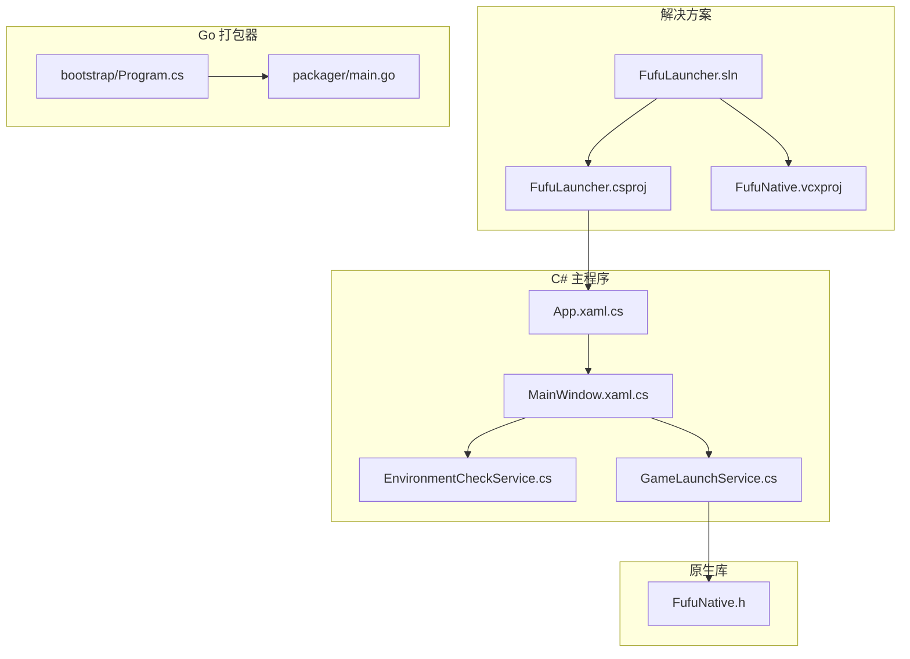
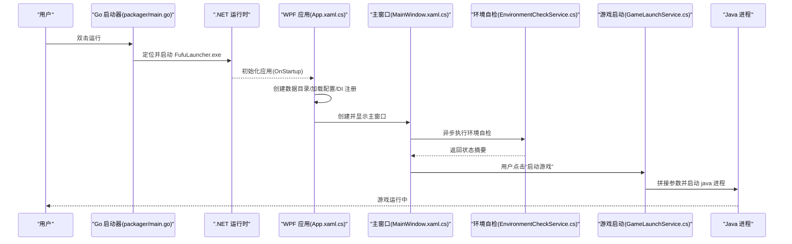
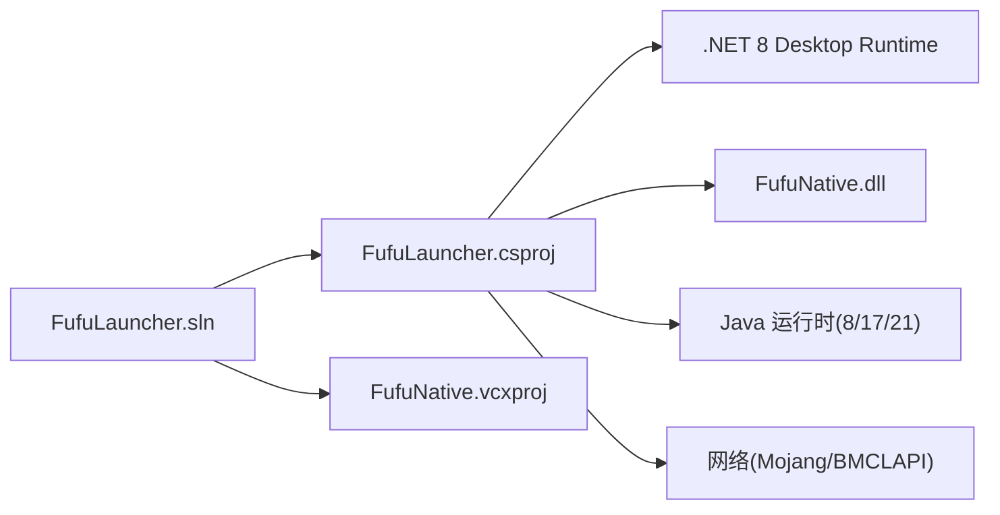

# 快速开始

<cite>
**本文引用的文件**   
- [README.md](file://README.md)
- [FufuLauncher.sln](file://FufuLauncher.sln)
- [FufuLauncher.csproj](file://src/FufuLauncher/FufuLauncher.csproj)
- [App.xaml.cs](file://src/FufuLauncher/App.xaml.cs)
- [MainWindow.xaml.cs](file://src/FufuLauncher/MainWindow.xaml.cs)
- [EnvironmentCheckService.cs](file://src/FufuLauncher/Services/EnvironmentCheckService.cs)
- [GameLaunchService.cs](file://src/FufuLauncher/Services/GameLaunchService.cs)
- [FufuNative.h](file://native/FufuNative/FufuNative.h)
- [Program.cs（bootstrap）](file://bootstrap/Program.cs)
- [main.go（packager）](file://packager/main.go)
- [FufuRelease.pubxml](file://src/FufuLauncher/Properties/PublishProfiles/FufuRelease.pubxml)
</cite>

## 目录
1. [简介](#简介)
2. [项目结构](#项目结构)
3. [核心组件](#核心组件)
4. [架构总览](#架构总览)
5. [详细组件分析](#详细组件分析)
6. [依赖关系分析](#依赖关系分析)
7. [性能注意事项](#性能注意事项)
8. [故障排查指南](#故障排查指南)
9. [结论](#结论)
10. [附录：常见问题与示例](#附录常见问题与示例)

## 简介
本指南面向首次使用“可爱的芙芙”启动器的用户，帮助你快速搭建开发环境、完成构建与发布、运行应用程序并完成首次启动流程。同时提供常见问题的解决方案（如 Windows 智能应用控制拦截的解除方法），以及基本的使用示例，让你迅速上手启动器的核心功能。

## 项目结构
- 解决方案与工程
  - 解决方案文件：FufuLauncher.sln
  - C# WPF 主程序：src/FufuLauncher/FufuLauncher.csproj
  - C++ 原生库：native/FufuNative（哈希与 ZIP 解压）
  - Go 打包器：packager/main.go（作为入口查找并启动主程序）
  - Bootstrap 工具：bootstrap/Program.cs（自动安装 Go、生成资源信息、编译 Go 启动器）
- 运行时与数据
  - 发布配置：src/FufuLauncher/Properties/PublishProfiles/FufuRelease.pubxml
  - 运行时依赖：目标机器需安装 .NET 8 Desktop Runtime (x64)
  - 游戏数据目录：appmcGAME（实例、Java 运行时、加载器等）
  - 配置目录：Start\AppData\Roaming\FufuLauncher（配置、缓存、日志、账号）

图表来源
- [FufuLauncher.sln:1-51](file://FufuLauncher.sln#L1-L51)
- [FufuLauncher.csproj:1-49](file://src/FufuLauncher/FufuLauncher.csproj#L1-L49)
- [App.xaml.cs:1-254](file://src/FufuLauncher/App.xaml.cs#L1-L254)
- [MainWindow.xaml.cs:1-245](file://src/FufuLauncher/MainWindow.xaml.cs#L1-L245)
- [EnvironmentCheckService.cs:1-215](file://src/FufuLauncher/Services/EnvironmentCheckService.cs#L1-L215)
- [GameLaunchService.cs:1-200](file://src/FufuLauncher/Services/GameLaunchService.cs#L1-L200)
- [FufuNative.h:1-53](file://native/FufuNative/FufuNative.h#L1-L53)
- [Program.cs（bootstrap）:1-425](file://bootstrap/Program.cs#L1-L425)
- [main.go（packager）:1-77](file://packager/main.go#L1-L77)

章节来源
- [README.md:11-33](file://README.md#L11-L33)
- [FufuLauncher.sln:1-51](file://FufuLauncher.sln#L1-L51)
- [FufuLauncher.csproj:1-49](file://src/FufuLauncher/FufuLauncher.csproj#L1-L49)

## 核心组件
- 应用入口与生命周期管理
  - App.xaml.cs：初始化 DI 容器、创建数据目录、加载配置、注册服务、显示主窗口、全局异常捕获与日志缓冲写入。
- 主窗口与页面导航
  - MainWindow.xaml.cs：承载标题栏交互、左侧导航切换页面、淡入动画、主题与背景应用、启动环境自检。
- 环境自检服务
  - EnvironmentCheckService.cs：检测 .NET 运行时、系统架构、磁盘空间、网络连通性、Java 扫描结果汇总。
- 游戏启动服务
  - GameLaunchService.cs：校验依赖、拼接 classpath 与 JVM 参数、完整性校验、进程启动与监控、智能内存分配等。
- 原生能力
  - FufuNative.h：导出 SHA1/SHA256 哈希计算、ZIP 解压/压缩接口，供 C# P/Invoke 调用。
- 打包与引导
  - bootstrap/Program.cs：自动发现或下载 Go 工具链、安装 goversioninfo、生成资源信息、编译 Go 启动器。
  - packager/main.go：作为可执行入口，定位并启动主程序 FufuLauncher.exe。

章节来源
- [App.xaml.cs:1-254](file://src/FufuLauncher/App.xaml.cs#L1-L254)
- [MainWindow.xaml.cs:1-245](file://src/FufuLauncher/MainWindow.xaml.cs#L1-L245)
- [EnvironmentCheckService.cs:1-215](file://src/FufuLauncher/Services/EnvironmentCheckService.cs#L1-L215)
- [GameLaunchService.cs:1-200](file://src/FufuLauncher/Services/GameLaunchService.cs#L1-L200)
- [FufuNative.h:1-53](file://native/FufuNative/FufuNative.h#L1-L53)
- [Program.cs（bootstrap）:1-425](file://bootstrap/Program.cs#L1-L425)
- [main.go（packager）:1-77](file://packager/main.go#L1-L77)

## 架构总览
启动器采用 C# WPF + C++ 原生 DLL 混合架构，配合 Go 打包器与 .NET 发布配置，形成“入口引导—主程序—原生能力—游戏进程”的完整链路。

图表来源
- [main.go（packager）:1-77](file://packager/main.go#L1-L77)
- [App.xaml.cs:1-254](file://src/FufuLauncher/App.xaml.cs#L1-L254)
- [MainWindow.xaml.cs:1-245](file://src/FufuLauncher/MainWindow.xaml.cs#L1-L245)
- [EnvironmentCheckService.cs:1-215](file://src/FufuLauncher/Services/EnvironmentCheckService.cs#L1-L215)
- [GameLaunchService.cs:1-200](file://src/FufuLauncher/Services/GameLaunchService.cs#L1-L200)

## 详细组件分析

### 开发环境与安装要求
- IDE：Visual Studio 2022 (17.8+)
- .NET：.NET 8 Desktop Runtime + SDK
- C++：C++ 桌面开发组件（v143 工具集）
- Windows SDK：10.0 (19041+)
- 操作系统：Windows 10 64位 / Windows 11

VS2022 组件安装要点
- 在 Visual Studio Installer 中勾选：
  - .NET 桌面开发（包含 .NET 8 SDK、WPF 工作负载）
  - 使用 C++ 的桌面开发（包含 v143 生成工具、Windows 10 SDK）

章节来源
- [README.md:11-26](file://README.md#L11-L26)

### 构建步骤
- 打开解决方案文件：FufuLauncher.sln
- 配置管理器选择 Release | x64
- 右键解决方案 → 重新生成解决方案
- 输出路径：src\FufuLauncher\bin\Release\net8.0-windows\FufuLauncher.exe

说明
- 项目目标框架为 net8.0-windows，平台目标为 x64，运行时标识 win-x64。
- C++ 原生 DLL 会按当前配置/平台复制到输出目录，确保先编译 native 工程。

章节来源
- [README.md:27-33](file://README.md#L27-L33)
- [FufuLauncher.csproj:1-49](file://src/FufuLauncher/FufuLauncher.csproj#L1-L49)
- [FufuLauncher.sln:1-51](file://FufuLauncher.sln#L1-L51)

### 运行应用程序与首次启动流程
- 直接运行 FufuLauncher.exe（若被 Windows 智能应用控制拦截，请先解除拦截）。
- 应用启动后：
  - 初始化双数据目录（appmcGAME 与 Start\AppData\Roaming\FufuLauncher）
  - 加载配置与主题
  - 显示主窗口并默认导航到主页
  - 异步执行环境自检（.NET 运行时、系统架构、磁盘空间、网络连通、Java 扫描）
  - 根据自检结果在状态栏提示

首次启动建议
- 若未检测到 Java，前往【☕ Java 运行时】页面下载合适的版本（8/17/21）。
- 如需自动扫描 Java，可在设置中开启相关选项。

章节来源
- [App.xaml.cs:82-164](file://src/FufuLauncher/App.xaml.cs#L82-L164)
- [MainWindow.xaml.cs:38-73](file://src/FufuLauncher/MainWindow.xaml.cs#L38-L73)
- [EnvironmentCheckService.cs:52-90](file://src/FufuLauncher/Services/EnvironmentCheckService.cs#L52-L90)

### 基本使用示例
- 主页：查看环境自检状态与常用操作入口。
- 下载页：下载 Minecraft 客户端与资源文件。
- Java 运行时页：下载并管理 Java 运行时。
- 实例页：管理不同版本的 Minecraft 实例。
- 账号页：登录与令牌管理。
- 模组页：安装与管理模组。
- 存档页：备份与恢复存档。
- 设置页：调整下载源、内存分配策略、是否自动扫描 Java 等。

章节来源
- [MainWindow.xaml.cs:99-186](file://src/FufuLauncher/MainWindow.xaml.cs#L99-L186)
- [App.xaml.cs:178-225](file://src/FufuLauncher/App.xaml.cs#L178-L225)

### 打包与发布（可选）
- 使用发布配置文件一键发布：dotnet publish src\FufuLauncher\FufuLauncher.csproj /p:PublishProfile=FufuRelease
- 发布产物：Start/ 目录下仅输出 FufuLauncher.exe（框架依赖模式，不包含 System*.dll 与语言目录）
- 部署白名单：FufuLauncher.exe、*.py 脚本、appmcGAME/ 数据文件夹
- 运行前提：目标机已安装 .NET 8 Desktop Runtime x64

章节来源
- [FufuRelease.pubxml:1-37](file://src/FufuLauncher/Properties/PublishProfiles/FufuRelease.pubxml#L1-L37)

### 引导与打包工具（开发者）
- bootstrap/Program.cs：自动发现或下载 Go 工具链、安装 goversioninfo、生成资源信息、编译 Go 启动器到“开始\FufuLauncher.exe”。
- packager/main.go：作为入口查找并启动主程序 FufuLauncher.exe，找不到时给出友好提示。

章节来源
- [Program.cs（bootstrap）:1-425](file://bootstrap/Program.cs#L1-L425)
- [main.go（packager）:1-77](file://packager/main.go#L1-L77)

## 依赖关系分析
- 解决方案依赖
  - FufuLauncher.sln 引用 C# 项目与 C++ 项目，统一构建 Release|x64。
- 运行时依赖
  - .NET 8 Desktop Runtime (x64)
  - C++ 原生 DLL（哈希与 ZIP 解压）
- 外部依赖
  - Mojang 官方源与 BMCLAPI 国内镜像（网络连通检测）
  - Java 运行时（8/17/21）

图表来源
- [FufuLauncher.sln:1-51](file://FufuLauncher.sln#L1-L51)
- [FufuLauncher.csproj:1-49](file://src/FufuLauncher/FufuLauncher.csproj#L1-L49)
- [EnvironmentCheckService.cs:151-174](file://src/FufuLauncher/Services/EnvironmentCheckService.cs#L151-L174)

章节来源
- [FufuLauncher.sln:1-51](file://FufuLauncher.sln#L1-L51)
- [FufuLauncher.csproj:1-49](file://src/FufuLauncher/FufuLauncher.csproj#L1-L49)
- [EnvironmentCheckService.cs:151-174](file://src/FufuLauncher/Services/EnvironmentCheckService.cs#L151-L174)

## 性能注意事项
- 日志写入采用队列与定时器批量落盘，避免高频同步 IO 阻塞 UI 线程。
- 视频背景在窗口最小化时暂停播放，降低 CPU/GPU 占用。
- 游戏启动前进行依赖与完整性校验，减少启动失败与崩溃概率。
- 智能内存分配可根据系统可用内存动态调整 Xmx/Xms，提升稳定性。

章节来源
- [App.xaml.cs:40-80](file://src/FufuLauncher/App.xaml.cs#L40-L80)
- [MainWindow.xaml.cs:84-89](file://src/FufuLauncher/MainWindow.xaml.cs#L84-L89)
- [GameLaunchService.cs:179-193](file://src/FufuLauncher/Services/GameLaunchService.cs#L179-L193)

## 故障排查指南
- Windows 智能应用控制（SmartScreen）拦截
  - 现象：运行 FufuLauncher.exe 时被拦截。
  - 原因：exe 未经数字签名。
  - 解决方法：
    - PowerShell（管理员）执行：Unblock-File -Path "C:\路径\FufuLauncher.exe"
    - 或在文件属性中勾选“解除锁定”，确定后再次运行。
- 未发现 Java
  - 现象：启动器提示未检测到 Java。
  - 解决：前往【☕ Java 运行时】页面下载合适版本（8/17/21），或在设置中启用开机自动扫描。
- 网络异常
  - 现象：无法访问 Mojang 官方源与 BMCLAPI 国内镜像源。
  - 解决：检查代理与防火墙设置，确保网络连通。
- 磁盘空间不足
  - 现象：提示剩余空间不足。
  - 解决：清理磁盘空间，确保至少 5GB 可用。

章节来源
- [README.md:55-73](file://README.md#L55-L73)
- [EnvironmentCheckService.cs:119-174](file://src/FufuLauncher/Services/EnvironmentCheckService.cs#L119-L174)

## 结论
通过本指南，你已了解“可爱的芙芙”启动器的开发环境搭建、构建与发布、运行与首次启动流程，以及常见问题的处理方法。建议优先完成环境自检与 Java 运行时配置，再进入实例管理与模组安装，以获得最佳体验。

## 附录：常见问题与示例
- 如何解除 SmartScreen 拦截
  - 使用 Unblock-File 命令或在文件属性中解除锁定。
- 如何确认构建成功
  - 检查输出目录是否存在 FufuLauncher.exe，且大小合理。
- 如何验证 Java 可用性
  - 在命令行执行 java -version，确认版本与可执行性。
- 如何查看应用日志
  - 读取 Start\AppData\Roaming\FufuLauncher\app.log，获取启动与运行日志。

章节来源
- [README.md:55-73](file://README.md#L55-L73)
- [App.xaml.cs:40-80](file://src/FufuLauncher/App.xaml.cs#L40-L80)