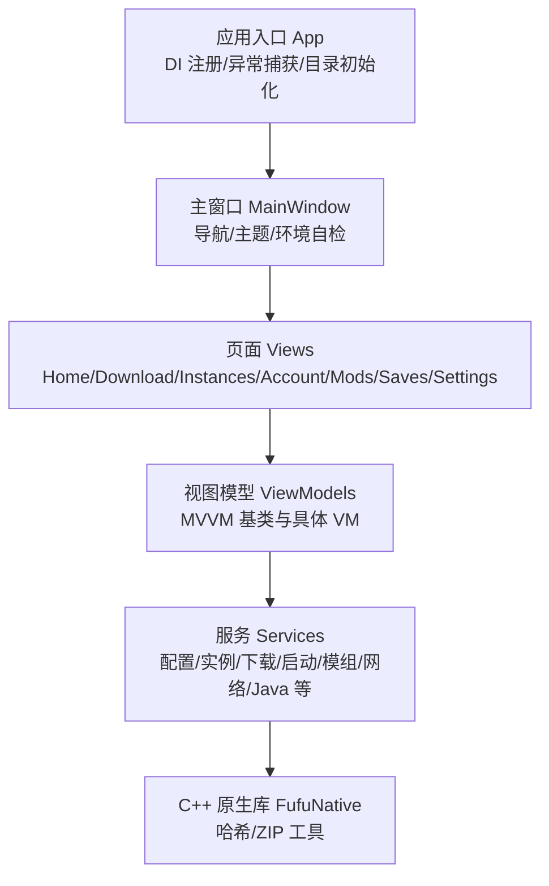
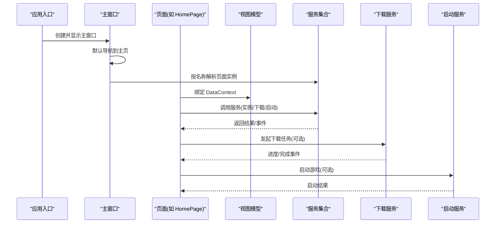
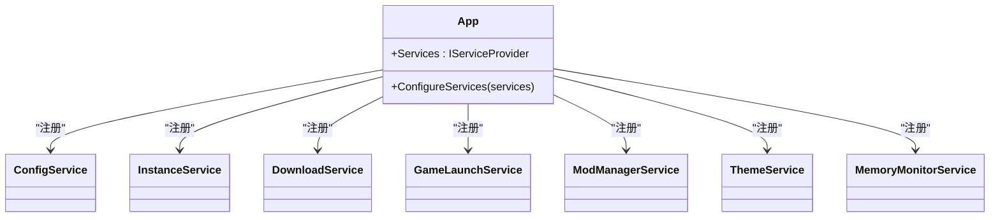
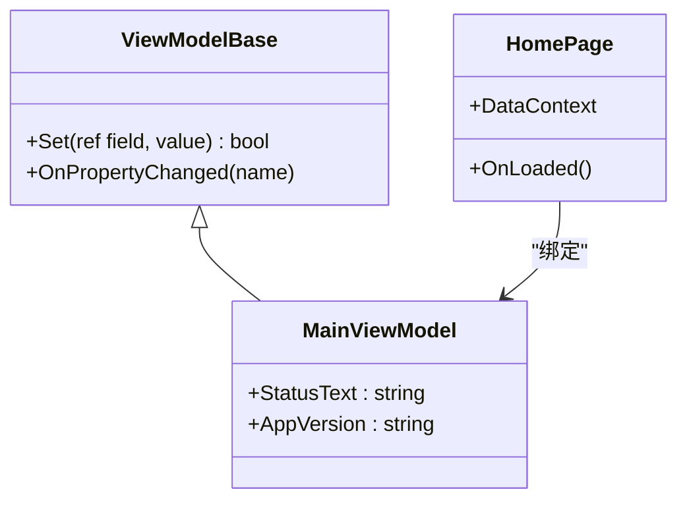
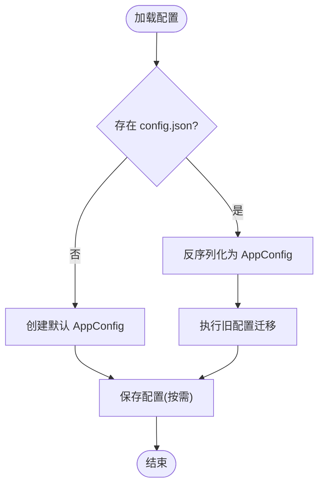
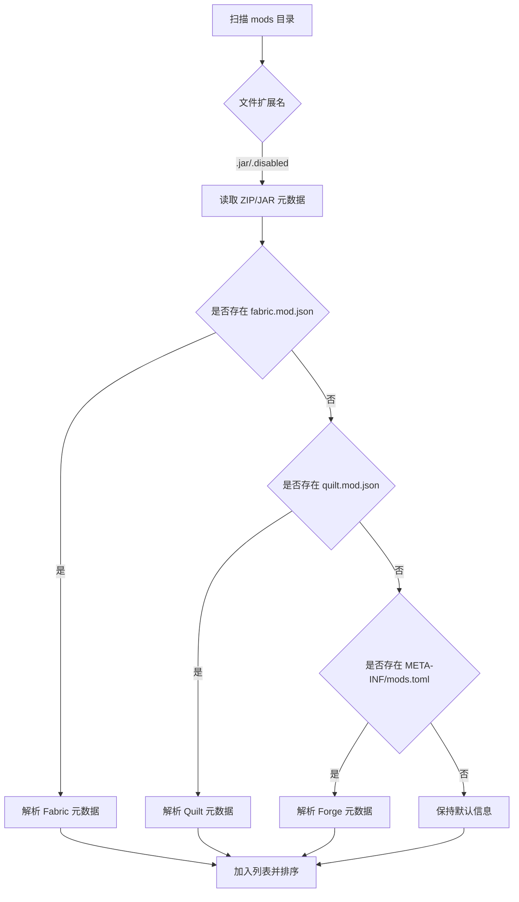
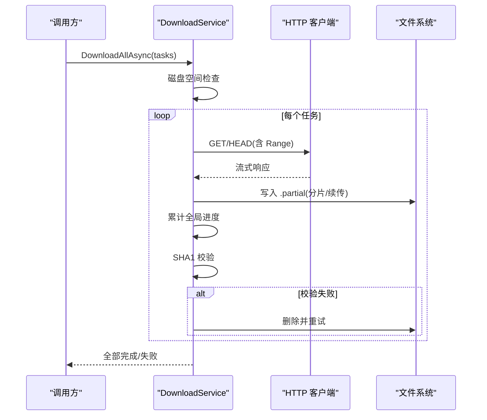
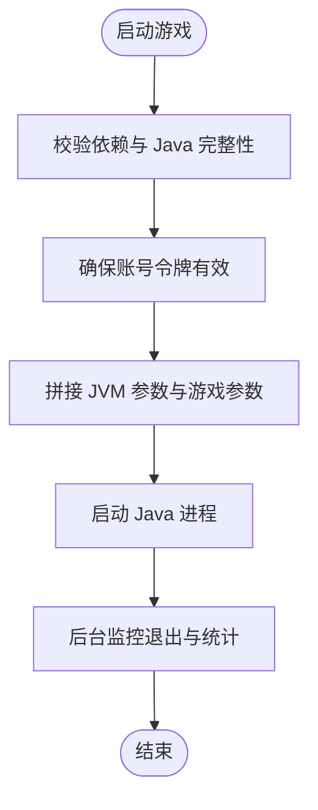
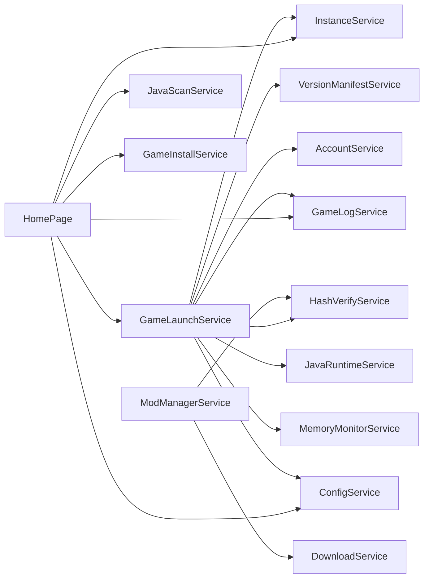

# 扩展开发指南

<cite>
**本文引用的文件**   
- [README.md](file://README.md)
- [App.xaml.cs](file://src/FufuLauncher/App.xaml.cs)
- [MainWindow.xaml.cs](file://src/FufuLauncher/MainWindow.xaml.cs)
- [ConfigService.cs](file://src/FufuLauncher/Services/ConfigService.cs)
- [InstanceService.cs](file://src/FufuLauncher/Services/InstanceService.cs)
- [ModManagerService.cs](file://src/FufuLauncher/Services/ModManagerService.cs)
- [GameLaunchService.cs](file://src/FufuLauncher/Services/GameLaunchService.cs)
- [DownloadService.cs](file://src/FufuLauncher/Services/DownloadService.cs)
- [HomePage.xaml.cs](file://src/FufuLauncher/Views/HomePage.xaml.cs)
- [MainViewModel.cs](file://src/FufuLauncher/ViewModels/MainViewModel.cs)
- [ViewModelBase.cs](file://src/FufuLauncher/ViewModels/ViewModelBase.cs)
</cite>

## 目录
1. [简介](#简介)
2. [项目结构](#项目结构)
3. [核心组件](#核心组件)
4. [架构总览](#架构总览)
5. [详细组件分析](#详细组件分析)
6. [依赖关系分析](#依赖关系分析)
7. [性能考量](#性能考量)
8. [故障排查指南](#故障排查指南)
9. [结论](#结论)
10. [附录：扩展模板与示例](#附录扩展模板与示例)

## 简介
本指南面向“可爱的芙芙”启动器的插件与扩展开发者，围绕服务扩展点、页面扩展、配置扩展、第三方 API 集成、模组加载器扩展机制以及最佳实践与调试技巧进行系统化说明。读者无需深入源码即可理解如何为启动器添加新服务、新页面、新配置项，以及如何安全地对接外部系统与优化性能。

## 项目结构
- 解决方案与构建环境见 README，采用 C# WPF (.NET 8) + C++ 原生 DLL（哈希、ZIP）组合。
- 主程序位于 src\FufuLauncher，包含 Services、ViewModels、Views、Themes 等分层目录。
- 应用入口负责 DI 容器初始化、全局异常捕获、双数据目录创建与配置加载。
- 主窗口承载导航与页面切换，按名称从 DI 容器解析页面实例。

图表来源
- [App.xaml.cs:82-217](file://src/FufuLauncher/App.xaml.cs#L82-L217)
- [MainWindow.xaml.cs:23-186](file://src/FufuLauncher/MainWindow.xaml.cs#L23-L186)

章节来源
- [README.md:1-87](file://README.md#L1-L87)
- [App.xaml.cs:82-217](file://src/FufuLauncher/App.xaml.cs#L82-L217)
- [MainWindow.xaml.cs:23-186](file://src/FufuLauncher/MainWindow.xaml.cs#L23-L186)

## 核心组件
- 应用生命周期与 DI 容器：在应用启动时集中注册所有服务、视图模型与页面，统一由 IServiceProvider 提供。
- 主窗口与页面导航：通过字符串路由名解析并创建页面，支持动画过渡与资源释放。
- 配置系统：集中管理用户设置，支持旧配置迁移与双层背景配置。
- 实例管理：多隔离实例目录结构，支持导入/导出、复制、删除与元信息持久化。
- 下载引擎：多线程分片断点续传、类别并发控制、SHA1 校验与镜像源降级。
- 游戏启动：参数拼接、进程优先级/亲和性、智能内存分配与完整性校验。
- 模组管理：Fabric/Forge/Quilt 元数据解析、启用/禁用、导入/下载与校验。

章节来源
- [App.xaml.cs:138-217](file://src/FufuLauncher/App.xaml.cs#L138-L217)
- [MainWindow.xaml.cs:128-186](file://src/FufuLauncher/MainWindow.xaml.cs#L128-L186)
- [ConfigService.cs:13-148](file://src/FufuLauncher/Services/ConfigService.cs#L13-L148)
- [InstanceService.cs:27-139](file://src/FufuLauncher/Services/InstanceService.cs#L27-L139)
- [DownloadService.cs:28-114](file://src/FufuLauncher/Services/DownloadService.cs#L28-L114)
- [GameLaunchService.cs:35-116](file://src/FufuLauncher/Services/GameLaunchService.cs#L35-L116)
- [ModManagerService.cs:23-91](file://src/FufuLauncher/Services/ModManagerService.cs#L23-L91)

## 架构总览
下图展示启动器整体架构与关键交互路径：应用入口初始化 DI，主窗口根据导航名解析页面，页面通过 ViewModel 调用服务完成业务逻辑；下载与启动流程贯穿多个服务协作。

图表来源
- [App.xaml.cs:138-217](file://src/FufuLauncher/App.xaml.cs#L138-L217)
- [MainWindow.xaml.cs:128-186](file://src/FufuLauncher/MainWindow.xaml.cs#L128-L186)
- [HomePage.xaml.cs:27-41](file://src/FufuLauncher/Views/HomePage.xaml.cs#L27-L41)
- [DownloadService.cs:222-261](file://src/FufuLauncher/Services/DownloadService.cs#L222-L261)
- [GameLaunchService.cs:104-120](file://src/FufuLauncher/Services/GameLaunchService.cs#L104-L120)

## 详细组件分析

### 服务扩展点与依赖注入
- 服务注册位置：应用入口集中注册单例服务与 Transient 页面。
- 扩展方式：新增服务后，在 ConfigureServices 中 AddSingleton/AddTransient 注册，即可被 DI 自动注入到任意构造函数。
- 生命周期：服务多为单例，页面为瞬态，确保每次导航新建实例并正确释放。

图表来源
- [App.xaml.cs:170-217](file://src/FufuLauncher/App.xaml.cs#L170-L217)

章节来源
- [App.xaml.cs:138-217](file://src/FufuLauncher/App.xaml.cs#L138-L217)

### 页面扩展与 MVVM
- 页面注册：在 App 中以 Transient 注册页面类型，MainWindow 通过字符串路由名解析。
- 视图模型：继承 ViewModelBase，使用 Set 方法触发属性变更通知。
- 数据绑定：页面 DataContext 指向 ViewModel，XAML 直接绑定属性与命令。

图表来源
- [ViewModelBase.cs:7-21](file://src/FufuLauncher/ViewModels/ViewModelBase.cs#L7-L21)
- [MainViewModel.cs:8-24](file://src/FufuLauncher/ViewModels/MainViewModel.cs#L8-L24)
- [HomePage.xaml.cs:27-41](file://src/FufuLauncher/Views/HomePage.xaml.cs#L27-L41)

章节来源
- [MainWindow.xaml.cs:128-186](file://src/FufuLauncher/MainWindow.xaml.cs#L128-L186)
- [ViewModelBase.cs:7-21](file://src/FufuLauncher/ViewModels/ViewModelBase.cs#L7-L21)
- [MainViewModel.cs:8-24](file://src/FufuLauncher/ViewModels/MainViewModel.cs#L8-L24)
- [HomePage.xaml.cs:27-41](file://src/FufuLauncher/Views/HomePage.xaml.cs#L27-L41)

### 配置扩展定义
- 配置模型：AppConfig 集中定义所有可配置项，包括主题、下载源、Java、JVM 参数、分辨率、背景、认证、内存分配、视频背景等。
- 持久化：ConfigService 提供 Load/Save，支持旧配置迁移与双层背景字段兼容。
- 扩展建议：新增配置项时，同步更新 AppConfig 属性并在 UI 层暴露设置入口。

图表来源
- [ConfigService.cs:94-148](file://src/FufuLauncher/Services/ConfigService.cs#L94-L148)

章节来源
- [ConfigService.cs:13-148](file://src/FufuLauncher/Services/ConfigService.cs#L13-L148)

### 第三方 API 集成（认证协议、数据格式、错误处理）
- 认证协议：配置项支持微软账号 ClientID、登录模式（设备码/本地回调）、回调端口等，便于接入 OAuth 流程。
- 数据格式：JSON 序列化选项已配置忽略空值与缩进输出，便于扩展其他 JSON API 响应。
- 错误处理：全局异常捕获（UI/域/Task），日志缓冲写入，失败不阻塞主流程。

章节来源
- [ConfigService.cs:37-48](file://src/FufuLauncher/Services/ConfigService.cs#L37-L48)
- [App.xaml.cs:219-245](file://src/FufuLauncher/App.xaml.cs#L219-L245)

### 模组加载器扩展机制（Forge/Fabric/Quilt）
- 元数据解析：ModManagerService 读取 JAR 内 fabric.mod.json、quilt.mod.json、META-INF/mods.toml 以识别加载器与版本信息。
- 启用/禁用：通过重命名 .jar/.disabled 实现，带重试与异常处理。
- 导入/下载：支持拖拽导入与 URL 下载，复用 DownloadService 的类别队列与 SHA1 校验。

图表来源
- [ModManagerService.cs:98-184](file://src/FufuLauncher/Services/ModManagerService.cs#L98-L184)

章节来源
- [ModManagerService.cs:98-184](file://src/FufuLauncher/Services/ModManagerService.cs#L98-L184)

### 下载服务扩展点
- 类别并发：Game/Asset/Java/Mod/Other 独立信号量互不阻塞。
- 断点续传与分片：大文件自动分片，小文件 Range 续传，.partial 临时文件。
- 镜像源降级：官方源失败自动切换到 BMCLAPI，提升国内可用性。
- 校验与重试：SHA1 校验失败自动重下，指数退避重试。

图表来源
- [DownloadService.cs:222-366](file://src/FufuLauncher/Services/DownloadService.cs#L222-L366)

章节来源
- [DownloadService.cs:28-114](file://src/FufuLauncher/Services/DownloadService.cs#L28-L114)
- [DownloadService.cs:222-366](file://src/FufuLauncher/Services/DownloadService.cs#L222-L366)

### 游戏启动服务扩展点
- 依赖校验：启动前校验 client.jar、libraries、Java 完整性。
- JVM 参数：Xms/Xmx、GC 多核优化、额外参数、全屏/窗口参数。
- 进程优化：高优先级、CPU 亲和性（可选）。
- 智能内存：根据系统内存动态计算 Xmx/Xms。

图表来源
- [GameLaunchService.cs:104-177](file://src/FufuLauncher/Services/GameLaunchService.cs#L104-L177)
- [GameLaunchService.cs:179-256](file://src/FufuLauncher/Services/GameLaunchService.cs#L179-L256)

章节来源
- [GameLaunchService.cs:104-177](file://src/FufuLauncher/Services/GameLaunchService.cs#L104-L177)
- [GameLaunchService.cs:179-256](file://src/FufuLauncher/Services/GameLaunchService.cs#L179-L256)

## 依赖关系分析
- 服务间耦合：GameLaunchService 依赖 InstanceService、VersionManifestService、HashVerifyService、AccountService、GameLogService、ConfigService、JavaRuntimeService、MemoryMonitorService。
- 页面与服务：HomePage 依赖 InstanceService、GameLaunchService、GameLogService、JavaScanService、ConfigService、GameInstallService。
- 下载与模组：ModManagerService 复用 DownloadService 与 HashVerifyService。

图表来源
- [HomePage.xaml.cs:27-41](file://src/FufuLauncher/Views/HomePage.xaml.cs#L27-L41)
- [GameLaunchService.cs:48-65](file://src/FufuLauncher/Services/GameLaunchService.cs#L48-L65)
- [ModManagerService.cs:84-91](file://src/FufuLauncher/Services/ModManagerService.cs#L84-L91)

章节来源
- [HomePage.xaml.cs:27-41](file://src/FufuLauncher/Views/HomePage.xaml.cs#L27-L41)
- [GameLaunchService.cs:48-65](file://src/FufuLauncher/Services/GameLaunchService.cs#L48-L65)
- [ModManagerService.cs:84-91](file://src/FufuLauncher/Services/ModManagerService.cs#L84-L91)

## 性能考量
- 日志批量写入：使用 ConcurrentQueue + Timer 批量落盘，避免高频 IO 阻塞。
- 下载节流与分片：全局进度节流 150ms，大文件分片并发，减少卡顿。
- 页面切换动画：淡入+上滑，提升视觉流畅度。
- 视频背景优化：最小化时暂停播放，降低 CPU/GPU 占用。
- 进程优化：可选高优先级与 CPU 亲和性，提升游戏稳定性。

章节来源
- [App.xaml.cs:40-67](file://src/FufuLauncher/App.xaml.cs#L40-L67)
- [DownloadService.cs:140-169](file://src/FufuLauncher/Services/DownloadService.cs#L140-L169)
- [MainWindow.xaml.cs:156-186](file://src/FufuLauncher/MainWindow.xaml.cs#L156-L186)
- [MainWindow.xaml.cs:81-89](file://src/FufuLauncher/MainWindow.xaml.cs#L81-L89)
- [GameLaunchService.cs:318-358](file://src/FufuLauncher/Services/GameLaunchService.cs#L318-L358)

## 故障排查指南
- 全局异常捕获：UI 未处理异常、域异常、Task 未观察异常均记录日志并弹窗提示。
- 下载失败：查看日志中的“下载”标签，关注重试次数与错误消息；确认镜像源与网络连通性。
- 启动失败：检查 Java 完整性与路径，确认令牌有效性；查看“启动”日志定位参数问题。
- 模组导入失败：确认 SHA1 校验与文件占用；必要时清理临时文件并重试。

章节来源
- [App.xaml.cs:219-245](file://src/FufuLauncher/App.xaml.cs#L219-L245)
- [DownloadService.cs:345-366](file://src/FufuLauncher/Services/DownloadService.cs#L345-L366)
- [GameLaunchService.cs:157-177](file://src/FufuLauncher/Services/GameLaunchService.cs#L157-L177)
- [ModManagerService.cs:230-250](file://src/FufuLauncher/Services/ModManagerService.cs#L230-L250)

## 结论
通过统一的 DI 容器与清晰的分层架构，启动器具备良好的扩展能力。开发者可在服务、页面、配置三个维度进行扩展，结合下载与启动服务的成熟机制，快速实现新功能。遵循最佳实践与性能优化建议，可获得稳定、高效的扩展体验。

## 附录：扩展模板与示例

### 新增服务模板
- 定义服务接口与实现类，构造函数注入所需依赖。
- 在 App.ConfigureServices 中注册为单例或瞬态。
- 在页面或 ViewModel 中通过构造函数注入使用。

章节来源
- [App.xaml.cs:170-217](file://src/FufuLauncher/App.xaml.cs#L170-L217)

### 新增页面模板
- 新建 Page 与对应 ViewModel，继承 ViewModelBase 并使用 Set 方法。
- 在 App 中注册页面为 Transient。
- 在 MainWindow 的路由映射中添加新页面名称。

章节来源
- [MainWindow.xaml.cs:128-186](file://src/FufuLauncher/MainWindow.xaml.cs#L128-L186)
- [ViewModelBase.cs:7-21](file://src/FufuLauncher/ViewModels/ViewModelBase.cs#L7-L21)

### 新增配置项模板
- 在 AppConfig 中添加新属性，设置默认值。
- 在 UI 层暴露设置入口，调用 ConfigService.Save 持久化。
- 如需旧配置迁移，在 ConfigService.Load 中增加迁移逻辑。

章节来源
- [ConfigService.cs:13-79](file://src/FufuLauncher/Services/ConfigService.cs#L13-L79)
- [ConfigService.cs:94-148](file://src/FufuLauncher/Services/ConfigService.cs#L94-L148)

### 第三方 API 集成模板
- 使用 HttpClient 发送请求，设置 User-Agent 与超时。
- 解析 JSON 响应，使用 JsonSerializerOptions 保持一致格式。
- 捕获异常并记录日志，提供降级策略与重试机制。

章节来源
- [DownloadService.cs:99-114](file://src/FufuLauncher/Services/DownloadService.cs#L99-L114)
- [ConfigService.cs:83-87](file://src/FufuLauncher/Services/ConfigService.cs#L83-L87)

### 模组加载器扩展模板
- 在 ModManagerService 中新增元数据解析分支，支持新的加载器配置文件。
- 更新 ModInfo.ModLoader 与徽章颜色映射。
- 测试导入/下载/校验流程。

章节来源
- [ModManagerService.cs:139-184](file://src/FufuLauncher/Services/ModManagerService.cs#L139-L184)
- [ModManagerService.cs:23-72](file://src/FufuLauncher/Services/ModManagerService.cs#L23-L72)