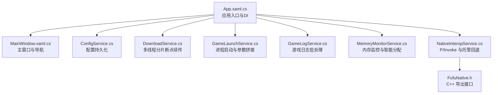
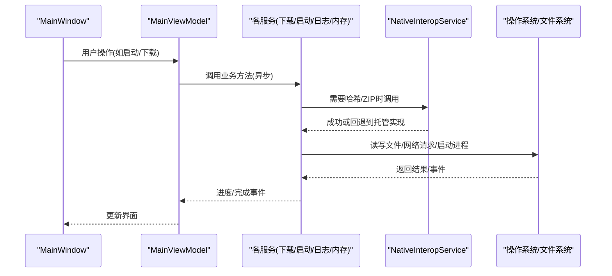
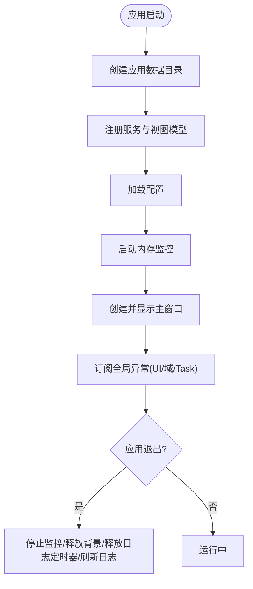
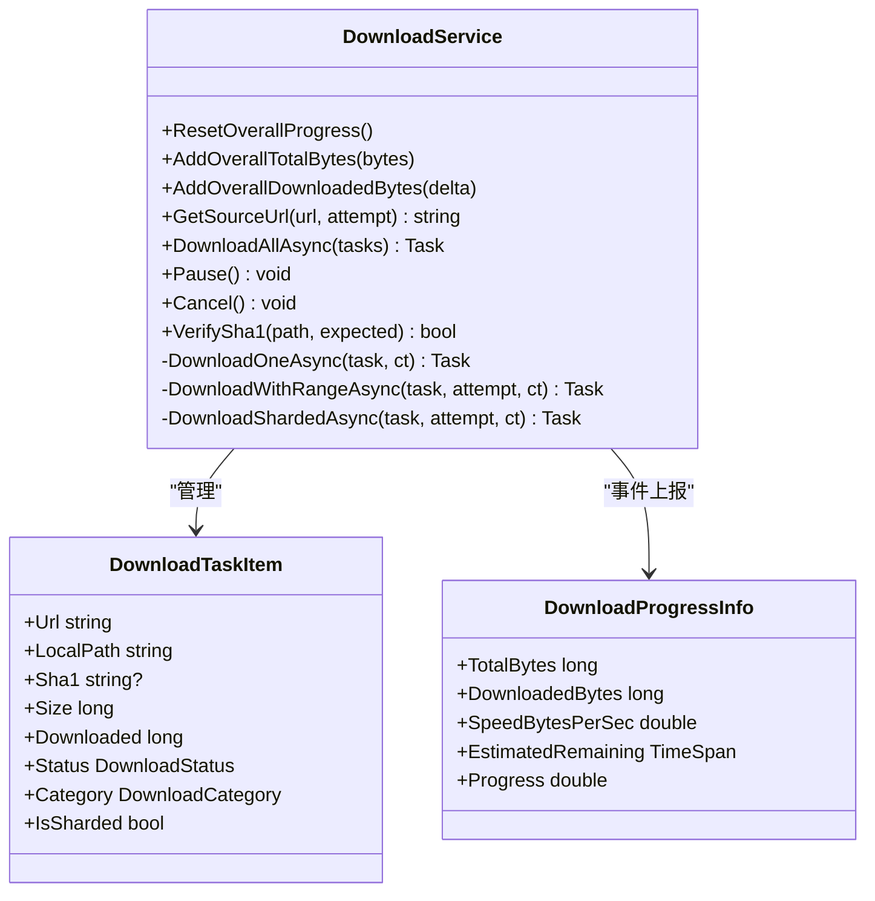
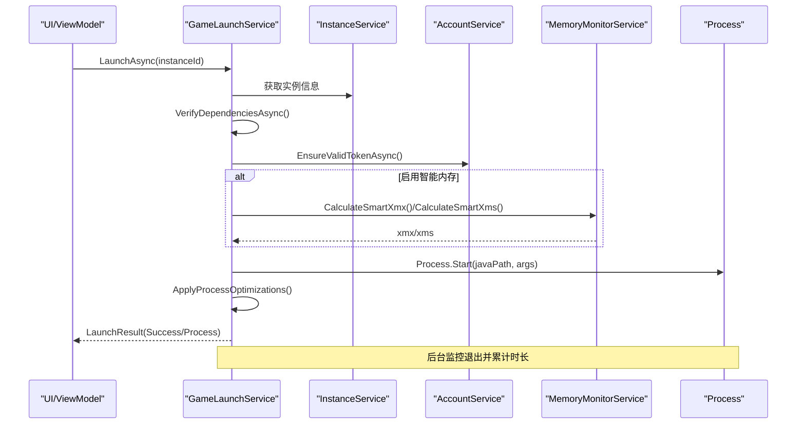
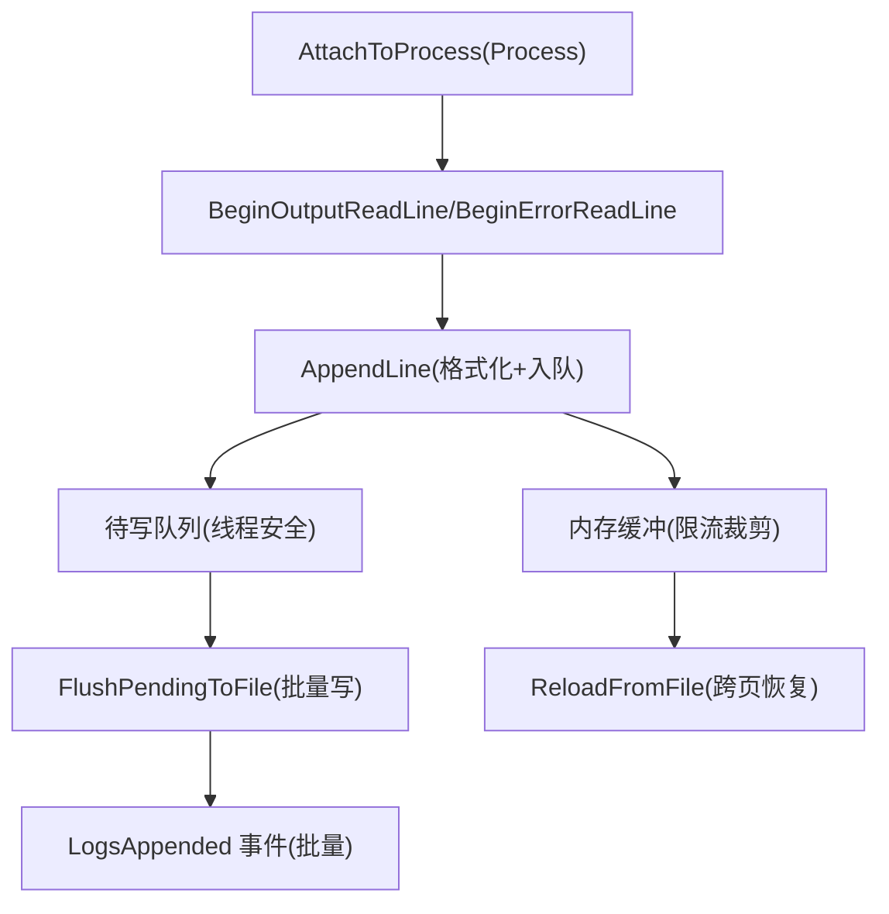
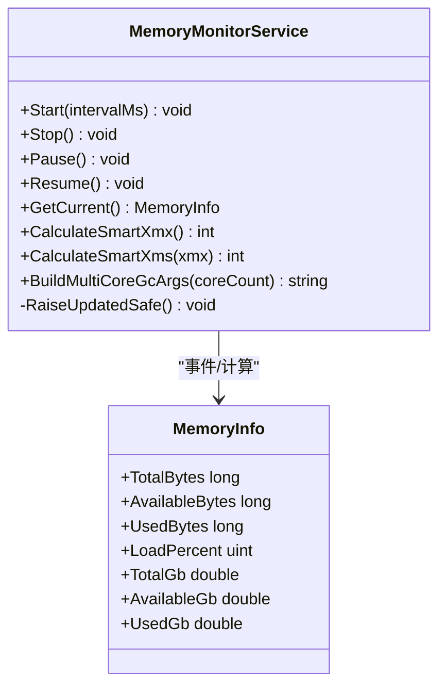
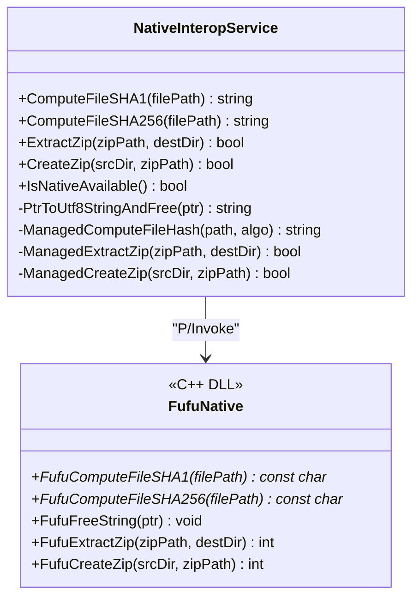
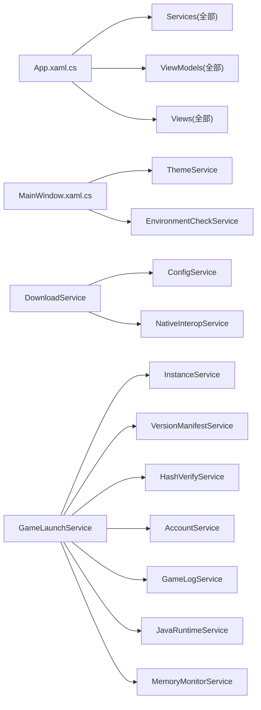

# 扩展开发最佳实践

<cite>
**本文引用的文件**   
- [README.md](file://README.md)
- [FufuLauncher.csproj](file://src/FufuLauncher/FufuLauncher.csproj)
- [App.xaml.cs](file://src/FufuLauncher/App.xaml.cs)
- [MainWindow.xaml.cs](file://src/FufuLauncher/MainWindow.xaml.cs)
- [ConfigService.cs](file://src/FufuLauncher/Services/ConfigService.cs)
- [DownloadService.cs](file://src/FufuLauncher/Services/DownloadService.cs)
- [MemoryMonitorService.cs](file://src/FufuLauncher/Services/MemoryMonitorService.cs)
- [GameLaunchService.cs](file://src/FufuLauncher/Services/GameLaunchService.cs)
- [GameLogService.cs](file://src/FufuLauncher/Services/GameLogService.cs)
- [NativeInteropService.cs](file://src/FufuLauncher/Services/NativeInteropService.cs)
- [FufuNative.h](file://native/FufuNative/FufuNative.h)
</cite>

## 目录
1. [简介](#简介)
2. [项目结构](#项目结构)
3. [核心组件](#核心组件)
4. [架构总览](#架构总览)
5. [详细组件分析](#详细组件分析)
6. [依赖关系分析](#依赖关系分析)
7. [性能优化与资源管理](#性能优化与资源管理)
8. [错误处理与调试指南](#错误处理与调试指南)
9. [代码质量与可维护性规范](#代码质量与可维护性规范)
10. [安全考虑与防护措施](#安全考虑与防护措施)
11. [开发工具与调试技巧](#开发工具与调试技巧)
12. [常见陷阱与解决方案](#常见陷阱与解决方案)
13. [结论](#结论)

## 简介
本指南面向“可爱的芙芙”启动器的扩展开发者，围绕性能优化（异步、内存与资源）、错误处理与调试、代码质量与安全、以及 Visual Studio 调试与性能分析等主题，提供系统化、可落地的最佳实践。内容基于仓库现有实现进行提炼，确保建议与工程实际一致。

## 项目结构
- 解决方案与目标框架：.NET 8 WPF (win-x64)，C++ 原生 DLL 作为可选加速路径
- 入口与应用生命周期：App.xaml.cs 负责 DI 容器初始化、全局异常捕获、应用数据目录创建、日志缓冲与定时器释放
- UI 主窗口：MainWindow.xaml.cs 承载导航、背景层、环境自检、页面切换动画与资源释放
- 服务层：下载、游戏启动、日志、配置、内存监控、原生互操作等
- 原生层：哈希与 ZIP 解压的 C++ 实现，通过 P/Invoke 暴露接口

图表来源
- [App.xaml.cs:75-178](file://src/FufuLauncher/App.xaml.cs#L75-L178)
- [MainWindow.xaml.cs:38-97](file://src/FufuLauncher/MainWindow.xaml.cs#L38-L97)
- [ConfigService.cs:81-147](file://src/FufuLauncher/Services/ConfigService.cs#L81-L147)
- [DownloadService.cs:56-114](file://src/FufuLauncher/Services/DownloadService.cs#L56-L114)
- [GameLaunchService.cs:104-177](file://src/FufuLauncher/Services/GameLaunchService.cs#L104-L177)
- [GameLogService.cs:48-65](file://src/FufuLauncher/Services/GameLogService.cs#L48-L65)
- [MemoryMonitorService.cs:56-88](file://src/FufuLauncher/Services/MemoryMonitorService.cs#L56-L88)
- [NativeInteropService.cs:20-55](file://src/FufuLauncher/Services/NativeInteropService.cs#L20-L55)
- [FufuNative.h:19-48](file://native/FufuNative/FufuNative.h#L19-L48)

章节来源
- [README.md:11-53](file://README.md#L11-L53)
- [FufuLauncher.csproj:1-49](file://src/FufuLauncher/FufuLauncher.csproj#L1-L49)

## 核心组件
- 应用入口与 DI：集中注册服务、视图模型与页面；统一全局异常捕获；应用数据目录与日志缓冲
- 下载服务：按类别并发控制、大文件分片、断点续传、SHA1 校验、源降级与重试
- 游戏启动：依赖校验、Java 完整性检查、JVM 参数拼接、进程优先级与亲和性、退出监控
- 日志系统：应用日志与游戏日志分离，批量写入与事件通知，内存缓冲限流
- 内存监控：DispatcherTimer 定时刷新，智能 Xmx/Xms 计算，多核 GC 参数生成
- 原生互操作：优先调用 C++ 加速，失败自动回退到 .NET 托管实现

章节来源
- [App.xaml.cs:75-178](file://src/FufuLauncher/App.xaml.cs#L75-L178)
- [DownloadService.cs:56-114](file://src/FufuLauncher/Services/DownloadService.cs#L56-L114)
- [GameLaunchService.cs:104-177](file://src/FufuLauncher/Services/GameLaunchService.cs#L104-L177)
- [GameLogService.cs:48-65](file://src/FufuLauncher/Services/GameLogService.cs#L48-L65)
- [MemoryMonitorService.cs:56-88](file://src/FufuLauncher/Services/MemoryMonitorService.cs#L56-L88)
- [NativeInteropService.cs:20-55](file://src/FufuLauncher/Services/NativeInteropService.cs#L20-L55)

## 架构总览
启动器采用 WPF + MVVM + DI 的服务分层架构，UI 通过 ViewModel 绑定 Service，Service 之间低耦合，关键 IO/网络/进程操作均异步化，并辅以原生加速与回退策略。

图表来源
- [MainWindow.xaml.cs:38-97](file://src/FufuLauncher/MainWindow.xaml.cs#L38-L97)
- [MainViewModel.cs:8-24](file://src/FufuLauncher/ViewModels/MainViewModel.cs#L8-L24)
- [DownloadService.cs:222-261](file://src/FufuLauncher/Services/DownloadService.cs#L222-L261)
- [GameLaunchService.cs:104-177](file://src/FufuLauncher/Services/GameLaunchService.cs#L104-L177)
- [NativeInteropService.cs:38-73](file://src/FufuLauncher/Services/NativeInteropService.cs#L38-L73)

## 详细组件分析

### 应用入口与全局异常处理
- 职责：创建应用数据目录、注册 DI、加载配置、启动内存监控、显示主窗口、统一捕获 UI/域/Task 未处理异常
- 关键点：
  - 应用日志使用 ConcurrentQueue + Timer 批量写入，避免高频同步 IO
  - OnExit 中停止监控、释放背景资源、释放日志定时器并强制刷新
  - 全局异常捕获后记录日志并弹窗提示，保障用户体验

图表来源
- [App.xaml.cs:75-129](file://src/FufuLauncher/App.xaml.cs#L75-L129)
- [App.xaml.cs:180-206](file://src/FufuLauncher/App.xaml.cs#L180-L206)

章节来源
- [App.xaml.cs:75-178](file://src/FufuLauncher/App.xaml.cs#L75-L178)

### 下载服务（多线程分片与断点续传）
- 能力：按类别并发控制、单连接 Range 与多 Range 分片、.partial 断点续传、SHA1 校验、指数退避重试、整体进度节流上报
- 关键点：
  - 每类任务独立 SemaphoreSlim，互不阻塞
  - 大文件阈值自动分片，预分配 .partial 文件并按偏移写入
  - 全局总进度防抖节流，保证最终触发
  - 官方源失败自动降级到 BMCLAPI 镜像

图表来源
- [DownloadService.cs:28-54](file://src/FufuLauncher/Services/DownloadService.cs#L28-L54)
- [DownloadService.cs:56-114](file://src/FufuLauncher/Services/DownloadService.cs#L56-L114)
- [DownloadService.cs:222-261](file://src/FufuLauncher/Services/DownloadService.cs#L222-L261)
- [DownloadService.cs:368-451](file://src/FufuLauncher/Services/DownloadService.cs#L368-L451)
- [DownloadService.cs:454-547](file://src/FufuLauncher/Services/DownloadService.cs#L454-L547)

章节来源
- [DownloadService.cs:56-114](file://src/FufuLauncher/Services/DownloadService.cs#L56-L114)
- [DownloadService.cs:222-261](file://src/FufuLauncher/Services/DownloadService.cs#L222-L261)
- [DownloadService.cs:368-451](file://src/FufuLauncher/Services/DownloadService.cs#L368-L451)
- [DownloadService.cs:454-547](file://src/FufuLauncher/Services/DownloadService.cs#L454-L547)

### 游戏启动服务（依赖校验与 JVM 参数）
- 能力：依赖校验、账号令牌有效性检查、Java 完整性验证、智能内存分配、JVM 参数拼接、进程优先级与 CPU 亲和性、退出监控
- 关键点：
  - 启动前再次校验 client.jar 与 libraries 目录
  - Java 完整性二次校验(java -version)
  - 智能 Xmx/Xms 计算，向下对齐 256MB
  - 多核 GC 优化参数根据物理核心数生成
  - 后台监控进程退出并累计游玩时长

图表来源
- [GameLaunchService.cs:104-177](file://src/FufuLauncher/Services/GameLaunchService.cs#L104-L177)
- [GameLaunchService.cs:179-234](file://src/FufuLauncher/Services/GameLaunchService.cs#L179-L234)
- [GameLaunchService.cs:318-358](file://src/FufuLauncher/Services/GameLaunchService.cs#L318-L358)
- [MemoryMonitorService.cs:175-213](file://src/FufuLauncher/Services/MemoryMonitorService.cs#L175-L213)

章节来源
- [GameLaunchService.cs:104-177](file://src/FufuLauncher/Services/GameLaunchService.cs#L104-L177)
- [GameLaunchService.cs:179-234](file://src/FufuLauncher/Services/GameLaunchService.cs#L179-L234)
- [GameLaunchService.cs:318-358](file://src/FufuLauncher/Services/GameLaunchService.cs#L318-L358)

### 游戏日志服务（批处理与内存缓冲）
- 能力：实时捕获 stdout/stderr、批量写文件、内存缓冲限流、事件通知、从文件重载
- 关键点：
  - 内存缓冲限制最大行数，超出裁剪最早行
  - 200ms 定时器批量写入，避免逐行 IO
  - FlushNow 强制刷新，确保读取最新
  - Dispose 时取消事件订阅并释放定时器

图表来源
- [GameLogService.cs:48-65](file://src/FufuLauncher/Services/GameLogService.cs#L48-L65)
- [GameLogService.cs:99-120](file://src/FufuLauncher/Services/GameLogService.cs#L99-L120)
- [GameLogService.cs:139-166](file://src/FufuLauncher/Services/GameLogService.cs#L139-L166)
- [GameLogService.cs:184-208](file://src/FufuLauncher/Services/GameLogService.cs#L184-L208)

章节来源
- [GameLogService.cs:48-65](file://src/FufuLauncher/Services/GameLogService.cs#L48-L65)
- [GameLogService.cs:99-120](file://src/FufuLauncher/Services/GameLogService.cs#L99-L120)
- [GameLogService.cs:139-166](file://src/FufuLauncher/Services/GameLogService.cs#L139-L166)

### 内存监控服务（智能分配与多核优化）
- 能力：读取物理内存状态、定时刷新、智能 Xmx/Xms 计算、多核 GC 参数生成
- 关键点：
  - DispatcherTimer 在 UI 线程触发，避免 Invoke 堆积
  - 预留系统内存至少 1GB，上下限约束，256MB 对齐
  - 多核 GC 参数按物理核心数推导

图表来源
- [MemoryMonitorService.cs:56-88](file://src/FufuLauncher/Services/MemoryMonitorService.cs#L56-L88)
- [MemoryMonitorService.cs:144-155](file://src/FufuLauncher/Services/MemoryMonitorService.cs#L144-L155)
- [MemoryMonitorService.cs:175-213](file://src/FufuLauncher/Services/MemoryMonitorService.cs#L175-L213)

章节来源
- [MemoryMonitorService.cs:56-88](file://src/FufuLauncher/Services/MemoryMonitorService.cs#L56-L88)
- [MemoryMonitorService.cs:175-213](file://src/FufuLauncher/Services/MemoryMonitorService.cs#L175-L213)

### 原生互操作（P/Invoke 与托管回退）
- 能力：优先调用 C++ 哈希/ZIP 功能，失败自动回退到 .NET 托管实现
- 关键点：
  - 首次探测缓存可用性，避免重复开销
  - 字符串 UTF-8 编解码与内存释放
  - 托管实现保证功能等价，提升鲁棒性

图表来源
- [NativeInteropService.cs:20-55](file://src/FufuLauncher/Services/NativeInteropService.cs#L20-L55)
- [NativeInteropService.cs:84-119](file://src/FufuLauncher/Services/NativeInteropService.cs#L84-L119)
- [FufuNative.h:19-48](file://native/FufuNative/FufuNative.h#L19-L48)

章节来源
- [NativeInteropService.cs:20-55](file://src/FufuLauncher/Services/NativeInteropService.cs#L20-L55)
- [NativeInteropService.cs:84-119](file://src/FufuLauncher/Services/NativeInteropService.cs#L84-L119)
- [FufuNative.h:19-48](file://native/FufuNative/FufuNative.h#L19-L48)

## 依赖关系分析
- App.xaml.cs 集中注册所有服务与视图模型，形成松耦合的依赖注入图
- MainWindow 通过 DI 获取页面与服务，页面切换时释放旧 Page 的 IDisposable 资源
- 下载服务依赖配置与原生互操作；游戏启动依赖实例、版本清单、哈希校验、账户、日志、Java 运行时与内存监控
- 日志服务与下载/启动服务解耦，通过事件通知 UI

图表来源
- [App.xaml.cs:131-178](file://src/FufuLauncher/App.xaml.cs#L131-L178)
- [MainWindow.xaml.cs:28-36](file://src/FufuLauncher/MainWindow.xaml.cs#L28-L36)
- [DownloadService.cs:99-114](file://src/FufuLauncher/Services/DownloadService.cs#L99-L114)
- [GameLaunchService.cs:48-65](file://src/FufuLauncher/Services/GameLaunchService.cs#L48-L65)

章节来源
- [App.xaml.cs:131-178](file://src/FufuLauncher/App.xaml.cs#L131-L178)
- [MainWindow.xaml.cs:128-154](file://src/FufuLauncher/MainWindow.xaml.cs#L128-L154)

## 性能优化与资源管理
- 异步编程
  - 下载与日志均采用 async/await 与事件驱动，避免阻塞 UI
  - 使用 CancellationToken 支持取消与超时保护
- 内存管理与资源释放
  - 页面切换时释放旧 Page 的 IDisposable 资源，防止事件订阅泄漏
  - 视频背景最小化时暂停播放，最大化时恢复，降低 GPU/CPU 占用
  - 日志与下载缓冲使用定时器批量写入，减少频繁 IO
  - 内存监控使用 DispatcherTimer Background 优先级，避免抢占输入
- 并发与吞吐
  - 下载按类别独立信号量控制并发度，大文件分片并行下载
  - 全局总进度节流上报，平衡 UI 流畅与准确性
- 原生加速与回退
  - 优先调用 C++ 哈希/ZIP，失败自动回退托管实现，兼顾性能与鲁棒性

章节来源
- [MainWindow.xaml.cs:81-97](file://src/FufuLauncher/MainWindow.xaml.cs#L81-L97)
- [DownloadService.cs:222-261](file://src/FufuLauncher/Services/DownloadService.cs#L222-L261)
- [GameLogService.cs:48-65](file://src/FufuLauncher/Services/GameLogService.cs#L48-L65)
- [MemoryMonitorService.cs:61-88](file://src/FufuLauncher/Services/MemoryMonitorService.cs#L61-L88)
- [NativeInteropService.cs:142-157](file://src/FufuLauncher/Services/NativeInteropService.cs#L142-L157)

## 错误处理与调试指南
- 全局异常捕获
  - UI 线程、AppDomain 与 Task 未观察异常均被捕获，记录日志并弹窗提示
- 下载错误处理
  - 指数退避重试、源降级、SHA1 校验失败重下、删除临时文件
- 日志诊断
  - 应用日志 app.log 与游戏日志 game.log 分离，便于定位问题
  - 日志查看器打开时强制刷新缓冲，确保读到最新
- 调试建议
  - 使用 VS 附加到进程调试 WPF 与 .NET 代码
  - 关注下载与日志的异常堆栈，结合时间戳快速定位
  - 对长时间运行的下载任务，观察整体进度与速度变化

章节来源
- [App.xaml.cs:180-206](file://src/FufuLauncher/App.xaml.cs#L180-L206)
- [DownloadService.cs:305-366](file://src/FufuLauncher/Services/DownloadService.cs#L305-L366)
- [GameLogService.cs:168-172](file://src/FufuLauncher/Services/GameLogService.cs#L168-L172)

## 代码质量与可维护性规范
- 命名规范
  - 服务以 XxxService 命名，视图模型以 XxxViewModel 命名，页面以 XxxPage 命名
  - 公共 API 使用清晰动词开头的方法名（如 DownloadAllAsync、VerifyDependenciesAsync）
- 注释标准
  - 关键方法与类添加职责说明与注意事项，便于扩展与维护
- 单元测试编写
  - 为纯函数与无副作用逻辑编写测试（如内存分配算法、GC 参数生成）
  - 对 IO/网络相关逻辑使用 Mock 隔离外部依赖
- 设计原则
  - 单一职责：每个服务专注一个领域
  - 依赖注入：通过 DI 降低耦合，便于替换与测试
  - 开闭原则：新增功能通过扩展服务或配置项实现

章节来源
- [ConfigService.cs:81-147](file://src/FufuLauncher/Services/ConfigService.cs#L81-L147)
- [MemoryMonitorService.cs:204-213](file://src/FufuLauncher/Services/MemoryMonitorService.cs#L204-L213)

## 安全考虑与防护措施
- 输入验证
  - 下载 URL 与本地路径需校验合法性，避免路径穿越
  - 配置文件字段设置合理默认值与范围（如内存上限）
- 权限控制
  - 进程优先级设置需要管理员权限，失败不应阻塞启动
  - 敏感信息（如 DevPassword、ClientID）应通过配置管理，避免硬编码
- 敏感信息保护
  - 账号令牌与访问凭据仅在必要时刻传递，避免日志泄露
  - 日志中脱敏输出敏感字段

章节来源
- [GameLaunchService.cs:318-358](file://src/FufuLauncher/Services/GameLaunchService.cs#L318-L358)
- [ConfigService.cs:35-43](file://src/FufuLauncher/Services/ConfigService.cs#L35-L43)

## 开发工具与调试技巧
- Visual Studio 调试配置
  - 选择 Release | x64 构建，确保原生 DLL 正确复制到输出目录
  - 启动时附加到已运行进程或使用 VS 启动调试
- 性能分析
  - 使用 VS 性能分析器采集 CPU/内存快照，定位热点
  - 关注下载与日志批处理的定时器频率，避免过高刷新导致卡顿
- 问题排查
  - 检查 app.log 与 game.log 的时间戳与异常堆栈
  - 对下载失败任务，查看 SHA1 校验与源降级日志

章节来源
- [README.md:27-33](file://README.md#L27-L33)
- [FufuLauncher.csproj:34-42](file://src/FufuLauncher/FufuLauncher.csproj#L34-L42)
- [GameLogService.cs:168-172](file://src/FufuLauncher/Services/GameLogService.cs#L168-L172)

## 常见陷阱与解决方案
- 未释放资源导致内存泄漏
  - 页面切换时释放旧 Page 的 IDisposable 资源；关闭窗口时释放背景资源
- 高频率 IO 导致 UI 卡顿
  - 使用批量写入与定时器合并日志与下载进度上报
- 原生 DLL 缺失或失效
  - 自动回退到托管实现，保证功能可用
- 下载进度不更新
  - 跳过下载的文件也计入全局总进度，确保断点续传场景进度条正常

章节来源
- [MainWindow.xaml.cs:148-154](file://src/FufuLauncher/MainWindow.xaml.cs#L148-L154)
- [DownloadService.cs:375-382](file://src/FufuLauncher/Services/DownloadService.cs#L375-L382)
- [NativeInteropService.cs:142-157](file://src/FufuLauncher/Services/NativeInteropService.cs#L142-L157)

## 结论
本指南基于仓库现有实现，总结了扩展开发中的性能优化、错误处理、代码质量与安全等方面的最佳实践。遵循这些实践，可在保持高可用性的同时，提升扩展的可维护性与用户体验。建议在新增功能时严格遵循 DI 与异步模式，完善日志与异常处理，并通过性能分析与单元测试保障质量。