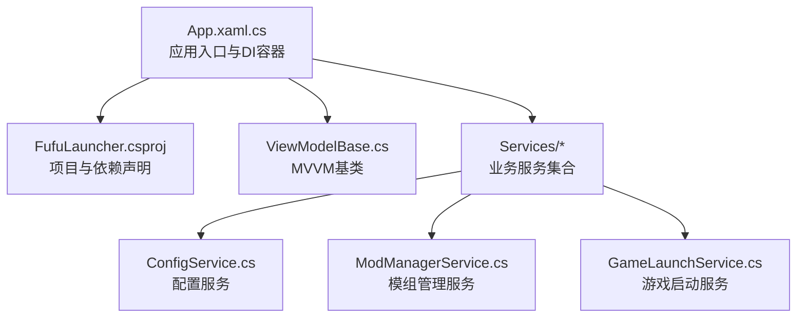
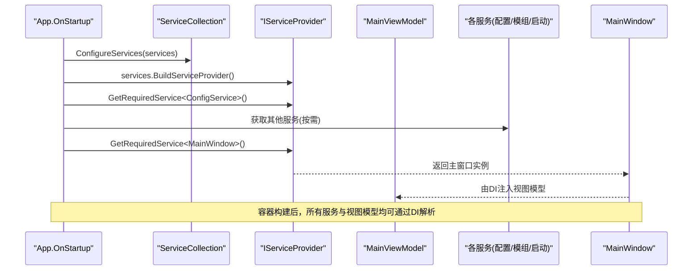
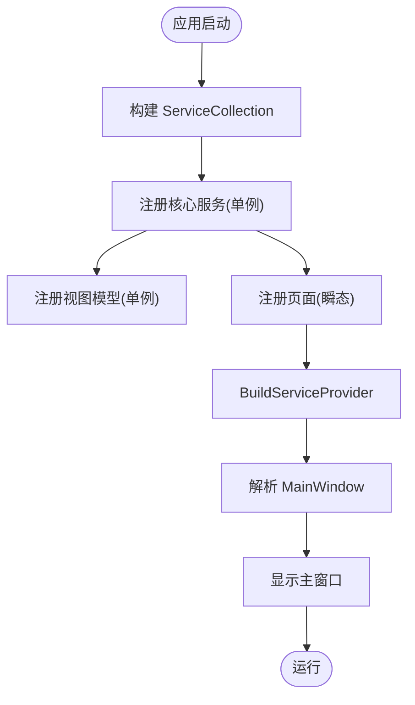
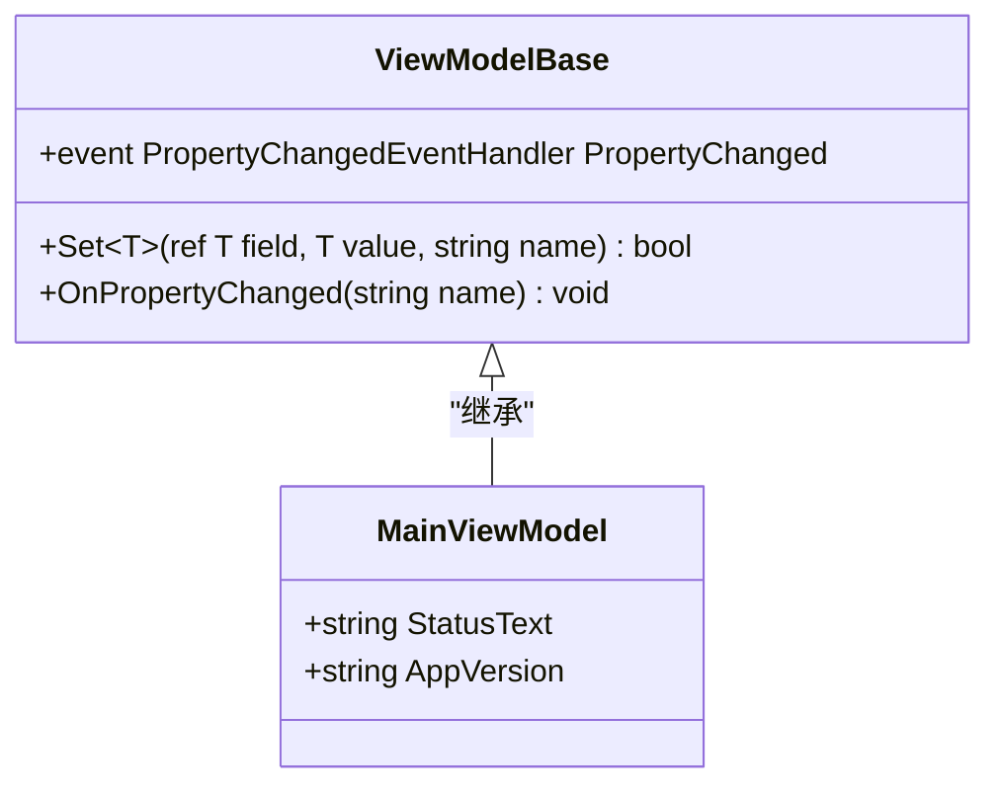
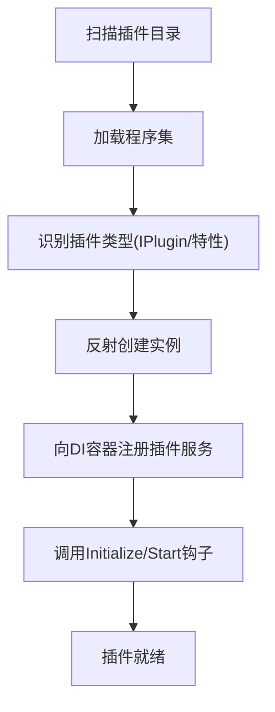
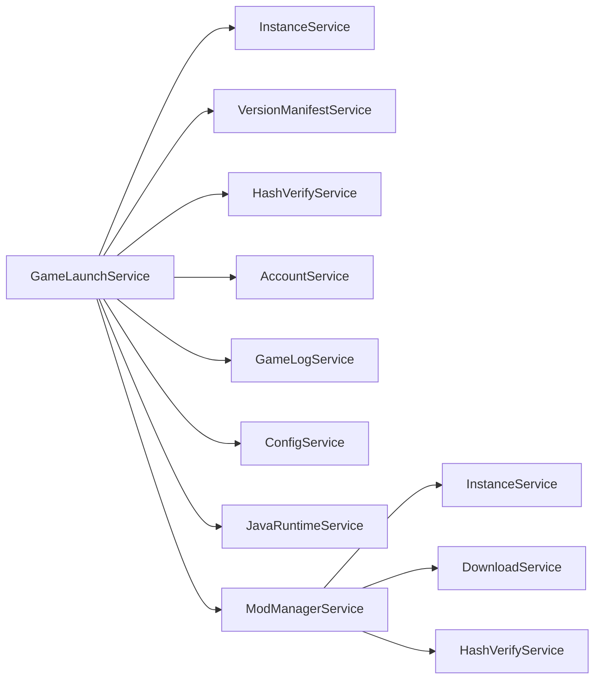

# 插件框架基础

<cite>
**本文引用的文件**   
- [App.xaml.cs](file://src/FufuLauncher/App.xaml.cs)
- [FufuLauncher.csproj](file://src/FufuLauncher/FufuLauncher.csproj)
- [ViewModelBase.cs](file://src/FufuLauncher/ViewModels/ViewModelBase.cs)
- [MainViewModel.cs](file://src/FufuLauncher/ViewModels/MainViewModel.cs)
- [ConfigService.cs](file://src/FufuLauncher/Services/ConfigService.cs)
- [ModManagerService.cs](file://src/FufuLauncher/Services/ModManagerService.cs)
- [GameLaunchService.cs](file://src/FufuLauncher/Services/GameLaunchService.cs)
</cite>

## 目录
1. [简介](#简介)
2. [项目结构](#项目结构)
3. [核心组件](#核心组件)
4. [架构总览](#架构总览)
5. [详细组件分析](#详细组件分析)
6. [依赖关系分析](#依赖关系分析)
7. [性能考量](#性能考量)
8. [故障排查指南](#故障排查指南)
9. [结论](#结论)
10. [附录](#附录)

## 简介
本文件面向“可爱的芙芙启动器”的插件框架，聚焦以下目标：
- 依赖注入容器的配置与扩展机制（服务注册、生命周期管理、接口约定）
- MVVM 基类 ViewModelBase 的扩展点（属性变更通知、数据绑定扩展）
- 插件发现与加载流程（程序集扫描、类型识别、实例化）
- 插件配置文件格式与元数据定义
- 插件开发模板与示例（最小实现与常见扩展模式）

说明：当前仓库尚未包含显式的“插件系统”代码。本文基于现有 DI 容器、服务层与 MVVM 基类的实现，给出可扩展的插件框架设计与落地方案，确保在不破坏现有架构的前提下，提供清晰的扩展路径。

## 项目结构
- 应用入口与 DI 容器初始化位于 App.xaml.cs，集中注册所有服务、视图模型与页面。
- 项目文件 FufuLauncher.csproj 声明了 WPF、.NET 8 与 Microsoft.Extensions.DependencyInjection 依赖。
- MVVM 基类 ViewModelBase 提供统一的属性变更通知能力。
- Services 层以独立职责划分服务（如配置、模组、游戏启动等），便于未来以插件形式扩展。

图表来源
- [App.xaml.cs:138-217](file://src/FufuLauncher/App.xaml.cs#L138-L217)
- [FufuLauncher.csproj:1-49](file://src/FufuLauncher/FufuLauncher.csproj#L1-L49)

章节来源
- [App.xaml.cs:138-217](file://src/FufuLauncher/App.xaml.cs#L138-L217)
- [FufuLauncher.csproj:1-49](file://src/FufuLauncher/FufuLauncher.csproj#L1-L49)

## 核心组件
- 依赖注入容器
  - 使用 Microsoft.Extensions.DependencyInjection 构建 IServiceProvider。
  - 通过 ServiceCollection 统一注册单例服务、视图模型与瞬态页面。
  - 在 OnStartup 中完成容器构建与主窗口创建，避免 StartupUri 导致的 DI 失效问题。
- MVVM 基类
  - ViewModelBase 实现 INotifyPropertyChanged，提供 Set<T> 与 OnPropertyChanged 便捷方法。
  - MainViewModel 继承基类并展示属性变更与版本信息读取的典型用法。
- 配置服务
  - ConfigService 负责 AppConfig 的加载与保存，支持旧配置迁移与默认值处理。
- 服务层
  - ModManagerService、GameLaunchService 等以构造函数注入方式获取依赖，体现松耦合设计。

章节来源
- [App.xaml.cs:138-217](file://src/FufuLauncher/App.xaml.cs#L138-L217)
- [ViewModelBase.cs:1-22](file://src/FufuLauncher/ViewModels/ViewModelBase.cs#L1-L22)
- [MainViewModel.cs:1-25](file://src/FufuLauncher/ViewModels/MainViewModel.cs#L1-L25)
- [ConfigService.cs:81-148](file://src/FufuLauncher/Services/ConfigService.cs#L81-L148)

## 架构总览
下图展示了应用启动时 DI 容器的装配顺序与服务间的调用关系，以及 MVVM 层的基类扩展点。

图表来源
- [App.xaml.cs:138-217](file://src/FufuLauncher/App.xaml.cs#L138-L217)
- [App.xaml.cs:170-217](file://src/FufuLauncher/App.xaml.cs#L170-L217)

## 详细组件分析

### 依赖注入容器：配置与扩展机制
- 服务注册
  - 将核心服务、视图模型与页面按职责分类注册为单例或瞬态。
  - 单例适用于无状态或全局共享的服务（如配置、网络、下载）。
  - 瞬态适用于每次导航需新建的页面，避免状态污染。
- 生命周期管理
  - 单例：容器启动时创建，贯穿应用生命周期。
  - 瞬态：每次解析时创建新实例。
- 扩展点
  - 新增服务：在 ConfigureServices 中追加 services.AddSingleton<T>() 或 AddTransient<T>()。
  - 插件化建议：预留 PluginServiceCollectionExtensions，用于从外部程序集扫描并注册插件服务。

图表来源
- [App.xaml.cs:138-217](file://src/FufuLauncher/App.xaml.cs#L138-L217)

章节来源
- [App.xaml.cs:138-217](file://src/FufuLauncher/App.xaml.cs#L138-L217)

### MVVM 基类：ViewModelBase 的扩展点
- 属性变更通知
  - Set<T> 封装字段赋值与 PropertyChanged 触发，减少样板代码。
  - OnPropertyChanged 提供直接触发事件的能力。
- 数据绑定扩展
  - 建议在派生类中使用 Set<T> 更新属性，确保 UI 自动刷新。
  - 可进一步扩展为异步属性更新、命令封装、验证规则等。

图表来源
- [ViewModelBase.cs:1-22](file://src/FufuLauncher/ViewModels/ViewModelBase.cs#L1-L22)
- [MainViewModel.cs:1-25](file://src/FufuLauncher/ViewModels/MainViewModel.cs#L1-L25)

章节来源
- [ViewModelBase.cs:1-22](file://src/FufuLauncher/ViewModels/ViewModelBase.cs#L1-L22)
- [MainViewModel.cs:1-25](file://src/FufuLauncher/ViewModels/MainViewModel.cs#L1-L25)

### 插件发现与加载流程（设计建议）
由于当前仓库未包含插件系统，以下为推荐实现流程，便于后续扩展：
- 程序集扫描
  - 指定插件目录，枚举 .dll/.exe，排除已加载的程序集。
- 类型识别
  - 查找实现 IPlugin 接口的类型，或带有特定特性标记的类型。
- 实例化与注册
  - 通过反射构造插件实例，并将插件提供的服务注册到 DI 容器。
- 生命周期钩子
  - 提供 Initialize、Start、Stop、Dispose 等钩子，供插件实现。

[此图为概念性流程图，不映射具体源码文件]

### 插件配置文件与元数据（设计建议）
- 建议采用 JSON 作为插件清单，包含以下字段：
  - id: 插件唯一标识
  - name: 插件名称
  - version: 插件版本
  - author: 作者
  - description: 描述
  - dependencies: 依赖的其他插件或服务
  - entryType: 入口类型（实现 IPlugin 的完全限定名）
  - configSchema: 可选的配置项 Schema（键名、类型、默认值、校验规则）
- 运行时行为：
  - 启动时读取清单，校验依赖与版本兼容性。
  - 根据 configSchema 生成设置页或校验用户配置。

[本节为概念性内容，不引用具体源码文件]

### 插件开发模板与示例（设计建议）
- 最小化插件实现
  - 定义一个实现 IPlugin 接口的类，提供 Initialize、Start、Stop、Dispose。
  - 在 Initialize 中注册自定义服务到 DI 容器（通过扩展方法）。
- 常见扩展模式
  - 服务扩展：提供新的 Service 并通过 DI 暴露给宿主与其他插件。
  - UI 扩展：注册新的 Page/ViewModel，并在主界面菜单或侧边栏中挂载。
  - 配置扩展：在 AppConfig 中添加插件相关字段，或在插件内维护独立配置。

[本节为概念性内容，不引用具体源码文件]

## 依赖关系分析
- 服务间依赖
  - GameLaunchService 依赖 InstanceService、VersionManifestService、HashVerifyService、AccountService、GameLogService、ConfigService、JavaRuntimeService、MemoryMonitorService。
  - ModManagerService 依赖 InstanceService、DownloadService、HashVerifyService。
- DI 容器装配
  - App.xaml.cs 中集中注册所有服务，保证依赖解析顺序正确。

图表来源
- [GameLaunchService.cs:35-65](file://src/FufuLauncher/Services/GameLaunchService.cs#L35-L65)
- [ModManagerService.cs:74-91](file://src/FufuLauncher/Services/ModManagerService.cs#L74-L91)

章节来源
- [GameLaunchService.cs:35-65](file://src/FufuLauncher/Services/GameLaunchService.cs#L35-L65)
- [ModManagerService.cs:74-91](file://src/FufuLauncher/Services/ModManagerService.cs#L74-L91)

## 性能考量
- 日志写入
  - 使用 ConcurrentQueue 与 Timer 批量落盘，降低高频 IO 对 UI 线程的影响。
- 进程与内存
  - 游戏启动时可启用多核 GC 优化与 CPU 亲和性，提升稳定性与性能。
- 智能内存分配
  - 根据系统可用内存动态计算 Xmx/Xms，避免低配机器资源不足。

章节来源
- [App.xaml.cs:40-67](file://src/FufuLauncher/App.xaml.cs#L40-L67)
- [GameLaunchService.cs:215-225](file://src/FufuLauncher/Services/GameLaunchService.cs#L215-L225)
- [GameLaunchService.cs:179-193](file://src/FufuLauncher/Services/GameLaunchService.cs#L179-L193)

## 故障排查指南
- 未处理异常捕获
  - 全局捕获 UI 域异常、域异常与 Task 未观察异常，记录日志并提示用户。
- 配置加载失败
  - ConfigService.Load 捕获异常并回退到默认配置，确保启动稳定。
- 模组导入与下载
  - ImportModFile 与 DownloadModAsync 在失败时清理临时文件并记录日志。

章节来源
- [App.xaml.cs:219-244](file://src/FufuLauncher/App.xaml.cs#L219-L244)
- [ConfigService.cs:94-133](file://src/FufuLauncher/Services/ConfigService.cs#L94-L133)
- [ModManagerService.cs:229-250](file://src/FufuLauncher/Services/ModManagerService.cs#L229-L250)
- [ModManagerService.cs:252-324](file://src/FufuLauncher/Services/ModManagerService.cs#L252-L324)

## 结论
- 当前项目已具备完善的 DI 容器与 MVVM 基类，为插件化提供了坚实基础。
- 建议在未来引入插件发现与加载机制，通过程序集扫描与接口约定扩展功能。
- 配置文件与元数据应标准化，便于插件管理与配置校验。
- 遵循现有服务分层与 DI 装配风格，可平滑集成插件模块。

## 附录
- 快速上手建议
  - 新增服务：在 App.xaml.cs 的 ConfigureServices 中注册。
  - 新增视图模型：继承 ViewModelBase，使用 Set<T> 进行属性更新。
  - 插件化准备：定义 IPlugin 接口与插件清单 JSON，预留扩展点。

[本节为概念性内容，不引用具体源码文件]