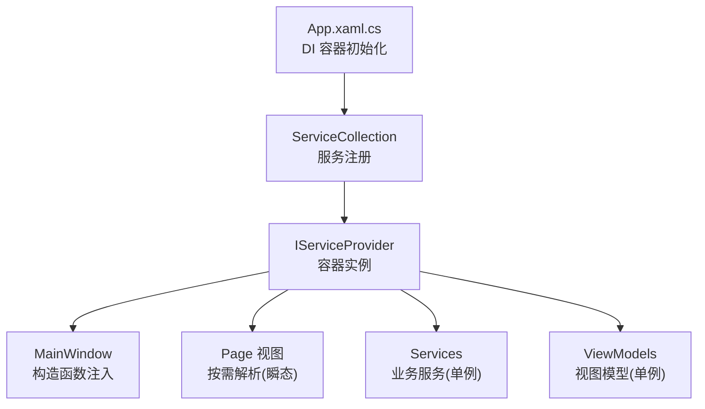
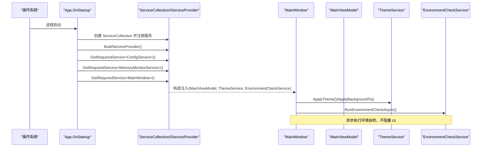
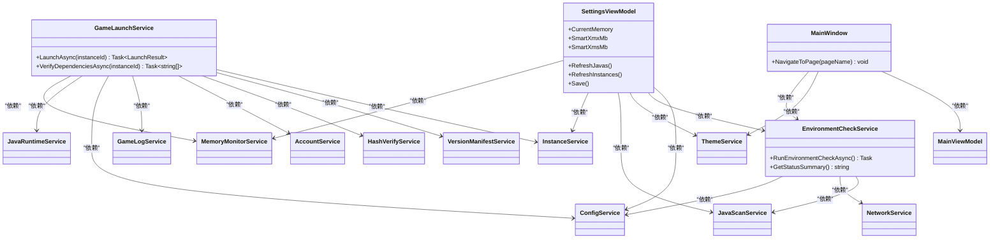
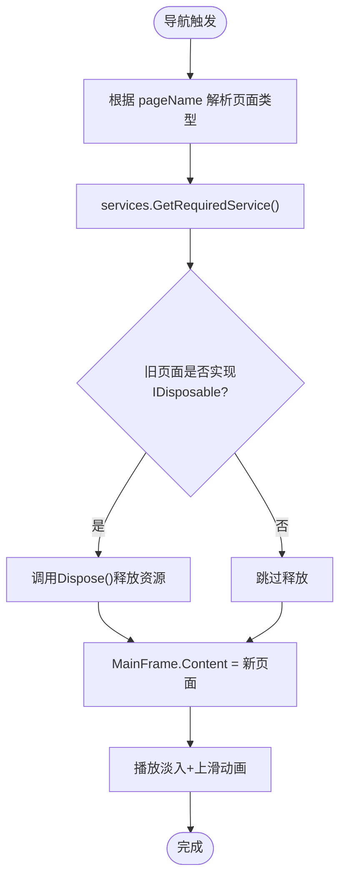
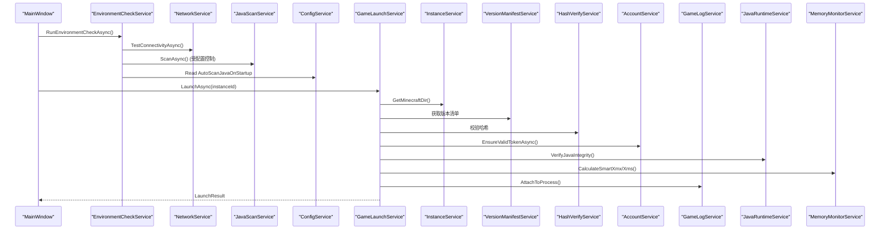
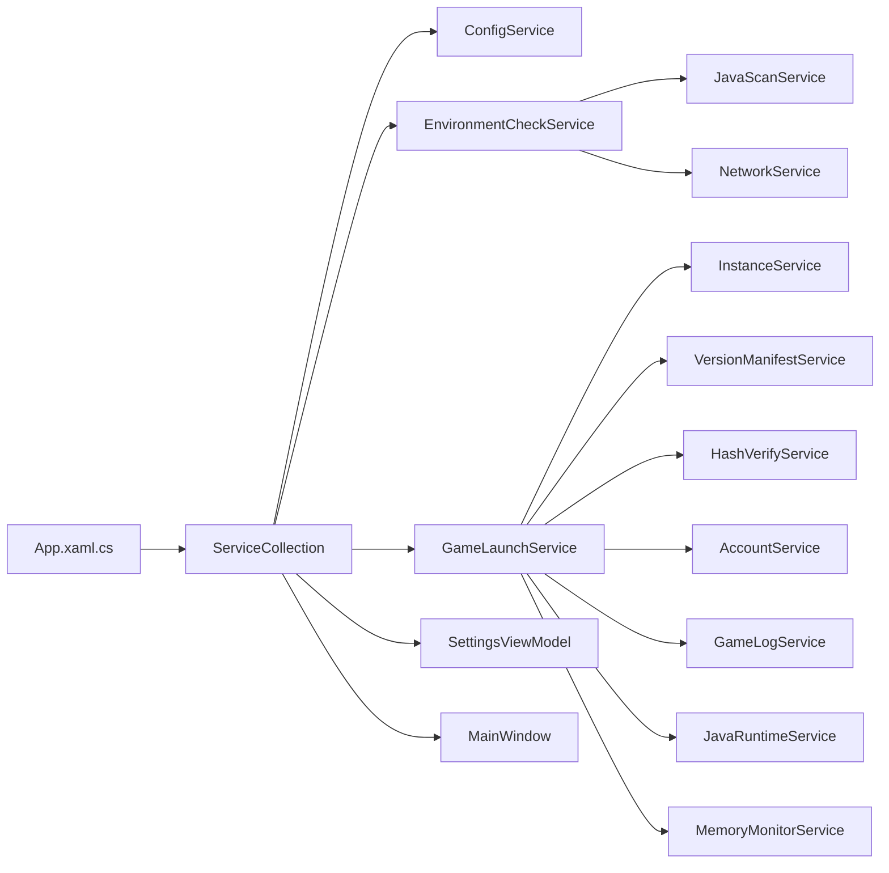

# 依赖注入容器

<cite>
**本文引用的文件**
- [App.xaml.cs](file://src/FufuLauncher/App.xaml.cs)
- [MainWindow.xaml.cs](file://src/FufuLauncher/MainWindow.xaml.cs)
- [ConfigService.cs](file://src/FufuLauncher/Services/ConfigService.cs)
- [EnvironmentCheckService.cs](file://src/FufuLauncher/Services/EnvironmentCheckService.cs)
- [GameLaunchService.cs](file://src/FufuLauncher/Services/GameLaunchService.cs)
- [SettingsViewModel.cs](file://src/FufuLauncher/ViewModels/SettingsViewModel.cs)
</cite>

## 目录
1. [简介](#简介)
2. [项目结构](#项目结构)
3. [核心组件](#核心组件)
4. [架构总览](#架构总览)
5. [详细组件分析](#详细组件分析)
6. [依赖关系分析](#依赖关系分析)
7. [性能考量](#性能考量)
8. [故障排查指南](#故障排查指南)
9. [结论](#结论)
10. [附录](#附录)

## 简介
本指南面向“可爱的芙芙”启动器（WPF）的依赖注入容器使用，重点说明如何在 App.xaml.cs 中配置 ServiceCollection、服务注册模式与生命周期管理；解释单例、瞬态与作用域的使用场景与性能影响；记录服务间依赖关系管理与循环依赖避免策略；并给出如何正确获取服务实例与构造函数注入的实践。文档同时提供完整的 DI 配置示例思路，涵盖条件注册与服务工厂的使用方式。

## 项目结构
- 应用入口与 DI 容器初始化位于 App.xaml.cs：创建 ServiceCollection、注册全部服务、构建 IServiceProvider，并在 OnStartup/OnExit 中完成资源与服务的生命周期管理。
- 主窗口 MainWindow 通过构造函数注入依赖，并在页面导航时从 DI 容器按需解析页面实例。
- 各 Services 与 ViewModels 通过构造函数声明依赖，遵循“显式依赖”原则，便于测试与维护。

图表来源
- [App.xaml.cs:99-178](file://src/FufuLauncher/App.xaml.cs#L99-L178)
- [MainWindow.xaml.cs:28-36](file://src/FufuLauncher/MainWindow.xaml.cs#L28-L36)

章节来源
- [App.xaml.cs:75-117](file://src/FufuLauncher/App.xaml.cs#L75-L117)
- [MainWindow.xaml.cs:128-154](file://src/FufuLauncher/MainWindow.xaml.cs#L128-L154)

## 核心组件
- 容器与入口
  - App.Services：静态只读 IServiceProvider，供全局解析服务。
  - ConfigureServices：集中注册所有服务、视图模型与页面。
- 服务层
  - ConfigService：配置读取与持久化，单例共享。
  - EnvironmentCheckService：环境自检，组合 JavaScanService、NetworkService、ConfigService。
  - GameLaunchService：游戏启动流程，组合多个服务（实例、版本清单、哈希校验、账号、日志、配置、Java 运行时、内存监控）。
- 视图模型
  - SettingsViewModel：设置页逻辑，订阅 MemoryMonitorService 事件，持有多个服务引用。
- 视图与窗口
  - MainWindow：UI 主窗口，构造函数注入 MainViewModel、ThemeService、EnvironmentCheckService；页面导航时按名称解析 Page。

章节来源
- [App.xaml.cs:25-178](file://src/FufuLauncher/App.xaml.cs#L25-L178)
- [ConfigService.cs:81-147](file://src/FufuLauncher/Services/ConfigService.cs#L81-L147)
- [EnvironmentCheckService.cs:35-51](file://src/FufuLauncher/Services/EnvironmentCheckService.cs#L35-L51)
- [GameLaunchService.cs:35-65](file://src/FufuLauncher/Services/GameLaunchService.cs#L35-L65)
- [SettingsViewModel.cs:172-194](file://src/FufuLauncher/ViewModels/SettingsViewModel.cs#L172-L194)
- [MainWindow.xaml.cs:23-36](file://src/FufuLauncher/MainWindow.xaml.cs#L23-L36)

## 架构总览
下图展示 WPF 应用启动到页面导航的关键调用链，以及 DI 容器在其中的作用。

图表来源
- [App.xaml.cs:99-117](file://src/FufuLauncher/App.xaml.cs#L99-L117)
- [MainWindow.xaml.cs:38-73](file://src/FufuLauncher/MainWindow.xaml.cs#L38-L73)

## 详细组件分析

### 容器配置与生命周期管理（App.xaml.cs）
- 容器创建与构建
  - 在 OnStartup 中创建 ServiceCollection，调用 ConfigureServices 注册服务，然后 BuildServiceProvider 得到 IServiceProvider。
- 服务注册模式
  - 单例（AddSingleton）：适用于无状态或共享状态的服务，如配置、网络、下载、版本清单、实例管理、模组加载、哈希校验、账号、认证、资源包、主题、游戏启动、日志、存档管理、原生互操作、安装、Java 运行时、内存监控等。
  - 瞬态（AddTransient）：适用于轻量、短生命周期的 UI 页面，每次导航新建实例，避免跨页面状态污染。
  - 作用域（AddScoped）：当前代码未使用，但可在需要“请求级”上下文时使用（例如 HTTP 请求上下文、事务范围）。
- 生命周期选择建议
  - 单例：适合 IO 密集型、缓存型、配置型服务，减少对象创建开销，注意线程安全。
  - 瞬态：适合 UI 页面、一次性任务，避免状态泄漏。
  - 作用域：适合需要隔离上下文的场景（如一次用户会话、一次命令执行），避免单例带来的隐式共享。

章节来源
- [App.xaml.cs:99-178](file://src/FufuLauncher/App.xaml.cs#L99-L178)

### 服务间依赖关系与构造函数注入
- EnvironmentCheckService
  - 依赖 JavaScanService、NetworkService、ConfigService，通过构造函数注入，职责清晰，易于替换与测试。
- GameLaunchService
  - 依赖 InstanceService、VersionManifestService、HashVerifyService、AccountService、GameLogService、ConfigService、JavaRuntimeService、MemoryMonitorService，负责组装 JVM 参数、校验依赖、启动进程与监控退出。
- SettingsViewModel
  - 依赖 ConfigService、EnvironmentCheckService、ThemeService、JavaScanService、InstanceService、MemoryMonitorService，订阅内存监控事件，暴露可观测属性。
- MainWindow
  - 依赖 MainViewModel、ThemeService、EnvironmentCheckService，负责 UI 交互与页面导航。

图表来源
- [EnvironmentCheckService.cs:35-51](file://src/FufuLauncher/Services/EnvironmentCheckService.cs#L35-L51)
- [GameLaunchService.cs:35-65](file://src/FufuLauncher/Services/GameLaunchService.cs#L35-L65)
- [SettingsViewModel.cs:172-194](file://src/FufuLauncher/ViewModels/SettingsViewModel.cs#L172-L194)
- [MainWindow.xaml.cs:23-36](file://src/FufuLauncher/MainWindow.xaml.cs#L23-L36)

章节来源
- [EnvironmentCheckService.cs:35-51](file://src/FufuLauncher/Services/EnvironmentCheckService.cs#L35-L51)
- [GameLaunchService.cs:35-65](file://src/FufuLauncher/Services/GameLaunchService.cs#L35-L65)
- [SettingsViewModel.cs:172-194](file://src/FufuLauncher/ViewModels/SettingsViewModel.cs#L172-L194)
- [MainWindow.xaml.cs:23-36](file://src/FufuLauncher/MainWindow.xaml.cs#L23-L36)

### 页面导航与瞬态页面解析（MainWindow.xaml.cs）
- 通过 App.Services.GetRequiredService<T>() 按名称解析页面，确保每次导航获得新的页面实例（瞬态），避免状态污染。
- 切换页面前释放旧页面的 IDisposable 资源，防止事件订阅导致的内存泄漏。

图表来源
- [MainWindow.xaml.cs:128-154](file://src/FufuLauncher/MainWindow.xaml.cs#L128-L154)

章节来源
- [MainWindow.xaml.cs:128-154](file://src/FufuLauncher/MainWindow.xaml.cs#L128-L154)

### 服务使用示例：环境自检与游戏启动
- 环境自检（EnvironmentCheckService）
  - 组合 JavaScanService、NetworkService、ConfigService，异步检查 .NET 运行时、系统架构、磁盘空间、网络连通性与 Java 扫描结果。
- 游戏启动（GameLaunchService）
  - 校验依赖文件、账号令牌、Java 完整性，智能内存分配（可选），拼接 JVM 参数与类路径，启动 java 进程并监控退出。

图表来源
- [EnvironmentCheckService.cs:52-73](file://src/FufuLauncher/Services/EnvironmentCheckService.cs#L52-L73)
- [GameLaunchService.cs:104-156](file://src/FufuLauncher/Services/GameLaunchService.cs#L104-L156)

章节来源
- [EnvironmentCheckService.cs:52-73](file://src/FufuLauncher/Services/EnvironmentCheckService.cs#L52-L73)
- [GameLaunchService.cs:104-156](file://src/FufuLauncher/Services/GameLaunchService.cs#L104-L156)

## 依赖关系分析
- 耦合与内聚
  - 服务层职责单一，依赖通过构造函数显式声明，提升内聚性，降低模块间耦合。
- 直接/间接依赖
  - EnvironmentCheckService 间接依赖 NetworkService 与 JavaScanService；GameLaunchService 间接依赖多个底层服务。
- 循环依赖
  - 当前未发现循环依赖。若新增服务，应避免互相引用，必要时引入接口抽象或事件总线解耦。
- 外部依赖
  - 使用 Microsoft.Extensions.DependencyInjection 作为 DI 框架；WPF 页面与 ViewModel 通过 DI 解析。

图表来源
- [App.xaml.cs:99-178](file://src/FufuLauncher/App.xaml.cs#L99-L178)
- [EnvironmentCheckService.cs:35-51](file://src/FufuLauncher/Services/EnvironmentCheckService.cs#L35-L51)
- [GameLaunchService.cs:35-65](file://src/FufuLauncher/Services/GameLaunchService.cs#L35-L65)

章节来源
- [App.xaml.cs:99-178](file://src/FufuLauncher/App.xaml.cs#L99-L178)

## 性能考量
- 单例 vs 瞬态
  - 单例减少对象创建与 GC 压力，适合 IO、缓存、配置类服务；需保证线程安全。
  - 瞬态适合 UI 页面，避免跨页面状态共享，但频繁创建可能带来轻微开销。
- 作用域
  - 当前未使用；如需“请求级”上下文（如一次命令执行），可使用 AddScoped 隔离状态。
- 资源释放
  - 页面切换时释放 IDisposable 资源，避免事件订阅导致内存泄漏。
- 异步与 UI 线程
  - 环境自检与网络检测使用异步，避免阻塞 UI；内存监控通过 DispatcherTimer 在 UI 线程推送数据。

[本节为通用指导，无需特定文件引用]

## 故障排查指南
- 异常捕获
  - App 中统一捕获 UI 域与 Task 未观察异常，写入日志并弹窗提示，便于定位问题。
- 常见错误
  - 服务未注册：GetRequiredService 抛出异常，检查 ConfigureServices 是否遗漏注册。
  - 循环依赖：容器解析失败，检查服务间相互引用，引入接口或事件解耦。
  - 资源未释放：页面切换后内存增长，确认 IDisposable 释放逻辑。
  - 网络/Java 检测失败：检查环境变量、代理设置与 Java 完整性。

章节来源
- [App.xaml.cs:180-206](file://src/FufuLauncher/App.xaml.cs#L180-L206)

## 结论
本项目采用 Microsoft.Extensions.DependencyInjection 进行依赖注入，服务注册集中在 App.xaml.cs，生命周期以单例为主、页面为瞬态，符合 WPF 应用的最佳实践。通过构造函数注入明确依赖关系，提升可测试性与可维护性。建议在后续扩展中谨慎使用作用域，避免循环依赖，并确保资源释放与异常处理完善。

[本节为总结，无需特定文件引用]

## 附录

### 依赖注入配置示例（思路与要点）
- 基础服务注册（单例）
  - 将配置、网络、下载、版本清单、实例管理、模组加载、哈希校验、账号、认证、资源包、主题、游戏启动、日志、存档管理、原生互操作、安装、Java 运行时、内存监控等服务以 AddSingleton 注册。
- 视图模型与页面
  - 视图模型（如 MainViewModel、HomeViewModel、SettingsViewModel 等）以 AddSingleton 注册；页面（HomePage、DownloadPage 等）以 AddTransient 注册。
- 条件注册
  - 根据运行环境或配置决定注册不同实现（例如不同网络客户端、不同存储后端），在 ConfigureServices 中使用 if/else 分支进行条件注册。
- 服务工厂
  - 对于需要复杂构造逻辑或服务工厂的场景，可使用 services.AddTransient<T>(provider => new T(...)) 或 Func<T> 工厂模式，动态传入参数或依赖。
- 获取服务实例
  - 在 App 中通过 Services.GetRequiredService<T>() 获取；在 MainWindow 中通过 App.Services 解析页面；在服务内部通过构造函数注入依赖。

章节来源
- [App.xaml.cs:99-178](file://src/FufuLauncher/App.xaml.cs#L99-L178)
- [MainWindow.xaml.cs:128-154](file://src/FufuLauncher/MainWindow.xaml.cs#L128-L154)