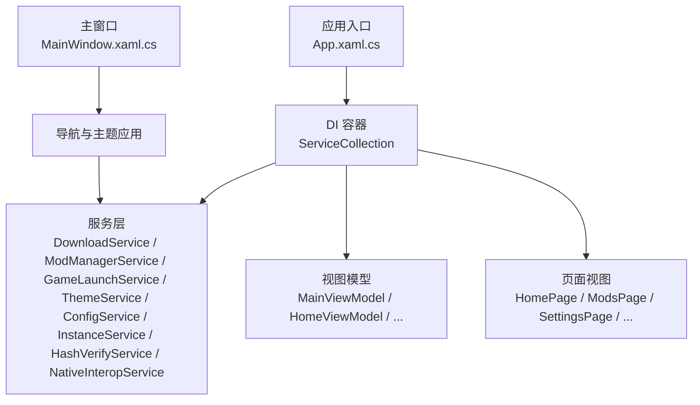
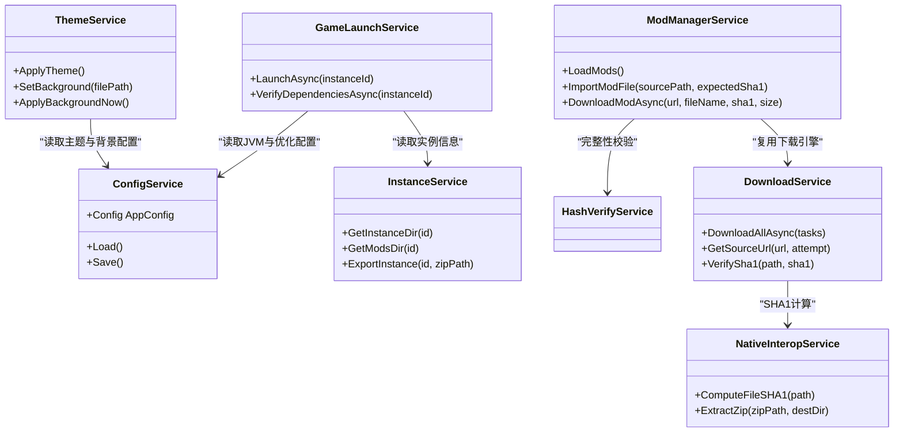
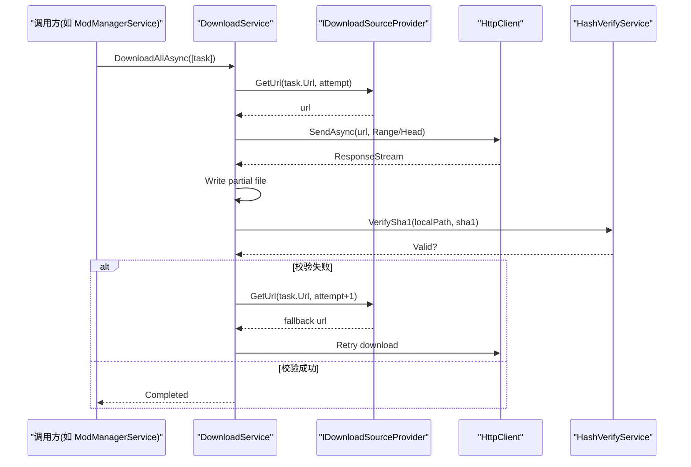
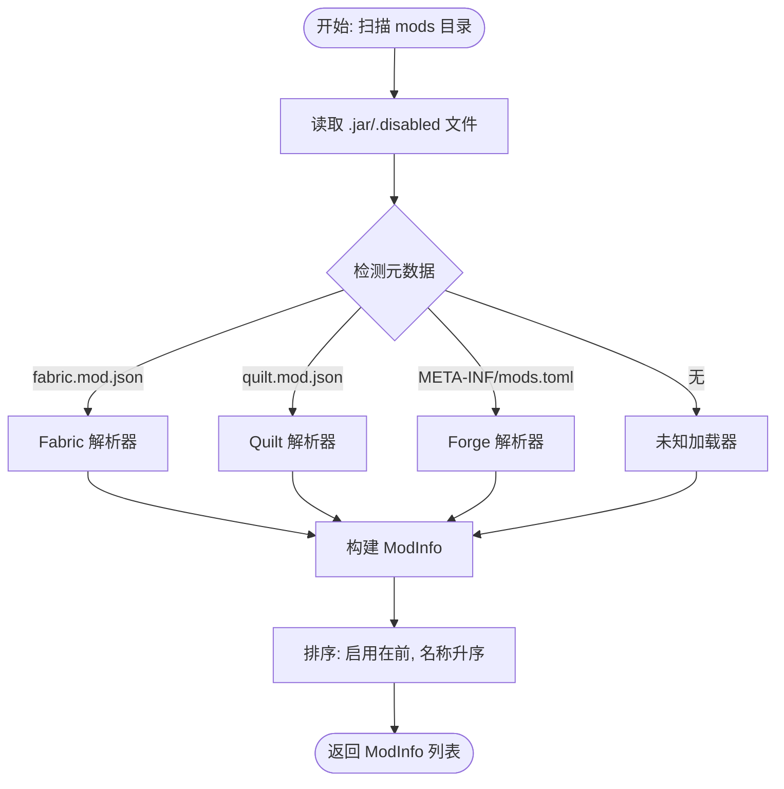
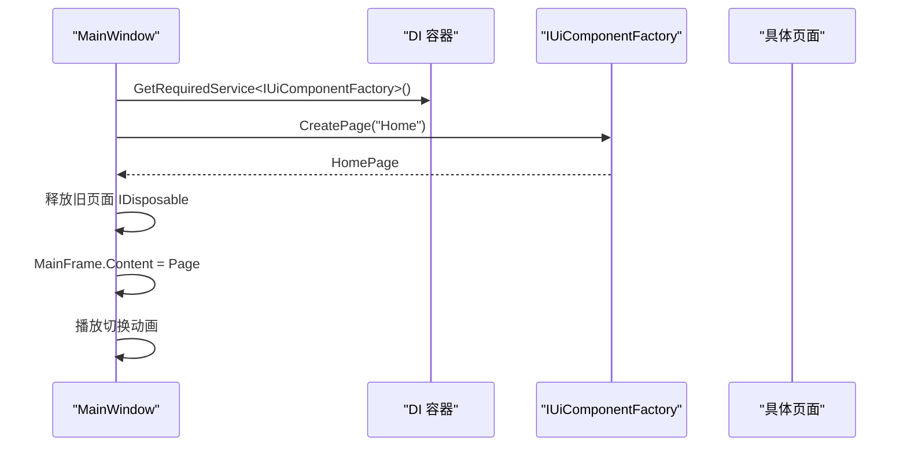
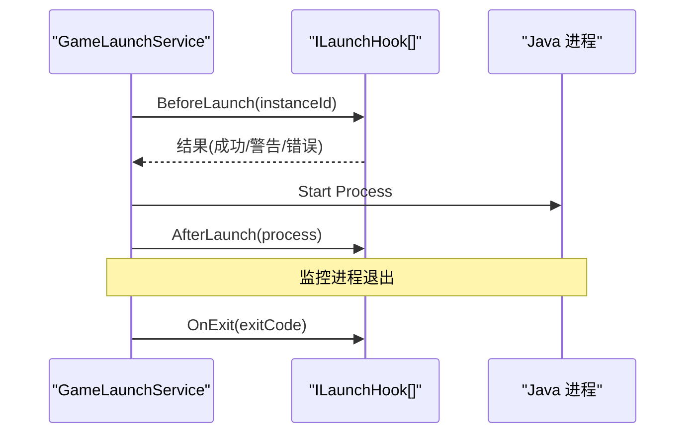
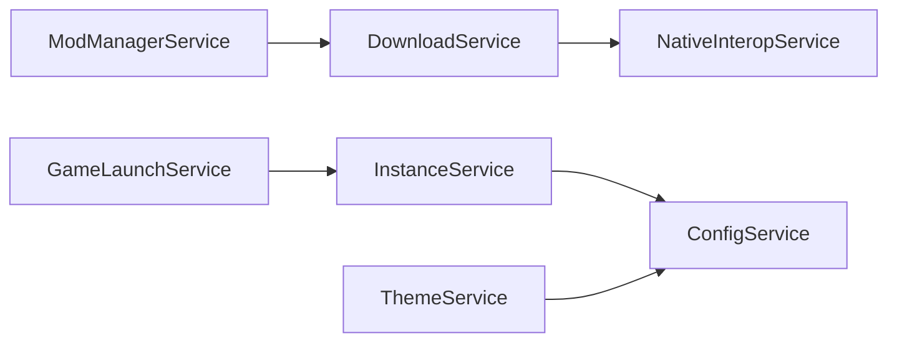

# 扩展点设计

<cite>
**本文引用的文件**   
- [App.xaml.cs](file://src/FufuLauncher/App.xaml.cs)
- [MainWindow.xaml.cs](file://src/FufuLauncher/MainWindow.xaml.cs)
- [ConfigService.cs](file://src/FufuLauncher/Services/ConfigService.cs)
- [DownloadService.cs](file://src/FufuLauncher/Services/DownloadService.cs)
- [ModManagerService.cs](file://src/FufuLauncher/Services/ModManagerService.cs)
- [GameLaunchService.cs](file://src/FufuLauncher/Services/GameLaunchService.cs)
- [ThemeService.cs](file://src/FufuLauncher/Services/ThemeService.cs)
- [NativeInteropService.cs](file://src/FufuLauncher/Services/NativeInteropService.cs)
- [HashVerifyService.cs](file://src/FufuLauncher/Services/HashVerifyService.cs)
- [InstanceService.cs](file://src/FufuLauncher/Services/InstanceService.cs)
- [ViewModelBase.cs](file://src/FufuLauncher/ViewModels/ViewModelBase.cs)
</cite>

## 目录
1. [引言](#引言)
2. [项目结构](#项目结构)
3. [核心组件](#核心组件)
4. [架构总览](#架构总览)
5. [详细组件分析](#详细组件分析)
6. [依赖关系分析](#依赖关系分析)
7. [性能考量](#性能考量)
8. [故障排查指南](#故障排查指南)
9. [结论](#结论)
10. [附录：扩展点实现示例与规范](#附录扩展点实现示例与规范)

## 引言
本指南面向“可爱的芙芙启动器”的扩展点设计与插件化策略，目标是：
- 明确插件架构的设计原则与扩展点预留策略
- 通过接口抽象支持第三方扩展与自定义实现
- 记录扩展点的发现机制与加载顺序管理
- 保证扩展的兼容性与安全性
- 提供完整的扩展点示例（新的模组加载器、下载源扩展、UI 组件扩展）

当前代码库采用 WPF + MVVM + Microsoft.Extensions.DependencyInjection 的服务注册模式。扩展点应围绕服务层进行抽象与注入，避免直接耦合 UI 或具体实现，确保可替换、可测试、可扩展。

## 项目结构
- 应用入口与 DI 容器初始化位于 App.xaml.cs，集中注册所有服务、视图模型与页面
- 主窗口 MainWindow.xaml.cs 负责导航与主题背景应用
- 业务服务集中在 Services 目录，如 DownloadService、ModManagerService、GameLaunchService、ThemeService、ConfigService、InstanceService、HashVerifyService、NativeInteropService 等
- ViewModelBase 提供统一的属性变更通知基类，便于扩展 UI 行为

**图表来源** 
- [App.xaml.cs:100-178](file://src/FufuLauncher/App.xaml.cs#L100-L178)
- [MainWindow.xaml.cs:128-186](file://src/FufuLauncher/MainWindow.xaml.cs#L128-L186)

**章节来源**
- [App.xaml.cs:100-178](file://src/FufuLauncher/App.xaml.cs#L100-L178)
- [MainWindow.xaml.cs:128-186](file://src/FufuLauncher/MainWindow.xaml.cs#L128-L186)

## 核心组件
- 配置中心：ConfigService 统一持久化用户设置，为扩展点提供开关与参数（如下载源、Java 镜像、内存分配策略等）
- 下载引擎：DownloadService 提供多线程分片断点续传、类别隔离队列、SHA1 校验、官方源/BMCLAPI 切换
- 模组管理：ModManagerService 解析 Fabric/Forge/Quilt 元数据，支持启用/禁用、导入、下载与完整性校验
- 游戏启动：GameLaunchService 组装 JVM 参数、校验依赖、启动进程并监控退出
- 主题与背景：ThemeService 统一管理主题与背景资源，暴露事件供 UI 响应
- 原生互操作：NativeInteropService 封装 C++ DLL 调用并提供托管 fallback
- 实例管理：InstanceService 维护多实例目录结构与元信息

这些组件通过 DI 容器解耦，是扩展点的主要接入位置。

**章节来源**
- [ConfigService.cs:88-152](file://src/FufuLauncher/Services/ConfigService.cs#L88-L152)
- [DownloadService.cs:56-114](file://src/FufuLauncher/Services/DownloadService.cs#L56-L114)
- [ModManagerService.cs:74-91](file://src/FufuLauncher/Services/ModManagerService.cs#L74-L91)
- [GameLaunchService.cs:35-65](file://src/FufuLauncher/Services/GameLaunchService.cs#L35-L65)
- [ThemeService.cs:16-28](file://src/FufuLauncher/Services/ThemeService.cs#L16-L28)
- [NativeInteropService.cs:20-55](file://src/FufuLauncher/Services/NativeInteropService.cs#L20-L55)
- [InstanceService.cs:51-70](file://src/FufuLauncher/Services/InstanceService.cs#L51-L70)

## 架构总览
扩展点架构遵循“接口优先、约定优于配置、最小侵入”的原则：
- 在 Services 中定义扩展接口（如 IModLoader、IDownloadSourceProvider、IUiComponentFactory）
- 通过 DI 容器在 App.xaml.cs 中按约定发现并注册扩展
- 使用配置文件（ConfigService）控制扩展开关与参数
- 对关键路径（下载、哈希、启动）提供安全校验与降级策略

**图表来源** 
- [ConfigService.cs:88-152](file://src/FufuLauncher/Services/ConfigService.cs#L88-L152)
- [DownloadService.cs:56-114](file://src/FufuLauncher/Services/DownloadService.cs#L56-L114)
- [ModManagerService.cs:74-91](file://src/FufuLauncher/Services/ModManagerService.cs#L74-L91)
- [GameLaunchService.cs:35-65](file://src/FufuLauncher/Services/GameLaunchService.cs#L35-L65)
- [ThemeService.cs:16-28](file://src/FufuLauncher/Services/ThemeService.cs#L16-L28)
- [NativeInteropService.cs:20-55](file://src/FufuLauncher/Services/NativeInteropService.cs#L20-L55)
- [InstanceService.cs:51-70](file://src/FufuLauncher/Services/InstanceService.cs#L51-L70)

## 详细组件分析

### 下载源扩展点（IDownloadSourceProvider）
- 目标：支持多种下载源（Mojang、BMCLAPI、华为云等），并可按任务类别选择不同并发与超时策略
- 设计要点：
  - 定义接口 IDownloadSourceProvider，包含 GetUrl(originalUrl)、GetHeaders()、GetRetryPolicy() 等方法
  - 在 DownloadService 中通过 DI 获取实现，默认实现为 BMCLAPI/Mojang 切换逻辑
  - 通过 ConfigService.Config.DownloadSource 控制当前源
  - 失败自动降级到备选源（指数退避 + 强制镜像）

**图表来源** 
- [DownloadService.cs:171-210](file://src/FufuLauncher/Services/DownloadService.cs#L171-L210)
- [DownloadService.cs:295-366](file://src/FufuLauncher/Services/DownloadService.cs#L295-L366)
- [HashVerifyService.cs:33-70](file://src/FufuLauncher/Services/HashVerifyService.cs#L33-L70)

**章节来源**
- [DownloadService.cs:171-210](file://src/FufuLauncher/Services/DownloadService.cs#L171-L210)
- [DownloadService.cs:295-366](file://src/FufuLauncher/Services/DownloadService.cs#L295-L366)
- [HashVerifyService.cs:33-70](file://src/FufuLauncher/Services/HashVerifyService.cs#L33-L70)

### 模组加载器扩展点（IModLoader）
- 目标：支持 Fabric、Forge、Quilt 等多种模组加载器的元数据解析与生命周期管理
- 设计要点：
  - 定义接口 IModLoader，包含 ParseMetadata(jarPath)、EnableMod(file), DisableMod(file), ValidateVersion(versionId) 等
  - 在 ModManagerService 中根据 jar 内 manifest 选择对应实现
  - 新增加载器时仅需实现接口并通过 DI 注册
  - 保持向后兼容：未知加载器回退到“未知”显示

**图表来源** 
- [ModManagerService.cs:98-131](file://src/FufuLauncher/Services/ModManagerService.cs#L98-L131)
- [ModManagerService.cs:139-184](file://src/FufuLauncher/Services/ModManagerService.cs#L139-L184)

**章节来源**
- [ModManagerService.cs:98-131](file://src/FufuLauncher/Services/ModManagerService.cs#L98-L131)
- [ModManagerService.cs:139-184](file://src/FufuLauncher/Services/ModManagerService.cs#L139-L184)

### UI 组件扩展点（IUiComponentFactory）
- 目标：允许第三方扩展 UI 页面或控件（如新增“模组市场”、“版本对比”页）
- 设计要点：
  - 定义 IUiComponentFactory，提供 CreatePage(pageName) 方法
  - 在 App.xaml.cs 中注册默认页面映射，同时支持外部扩展动态注入
  - 通过 DI 容器按需创建页面，避免单例导致的内存泄漏
  - 页面切换动画与资源释放由 MainWindow 统一管理

**图表来源** 
- [MainWindow.xaml.cs:128-186](file://src/FufuLauncher/MainWindow.xaml.cs#L128-L186)
- [App.xaml.cs:166-178](file://src/FufuLauncher/App.xaml.cs#L166-L178)

**章节来源**
- [MainWindow.xaml.cs:128-186](file://src/FufuLauncher/MainWindow.xaml.cs#L128-L186)
- [App.xaml.cs:166-178](file://src/FufuLauncher/App.xaml.cs#L166-L178)

### 启动流程扩展点（ILaunchHook）
- 目标：在游戏启动前后插入自定义逻辑（如环境检查、日志增强、权限提升提示）
- 设计要点：
  - 定义 ILaunchHook 接口，包含 BeforeLaunch(instanceId)、AfterLaunch(process)、OnExit(exitCode)
  - 在 GameLaunchService 中按顺序执行钩子
  - 钩子失败不阻塞启动，但记录日志并提示用户

**图表来源** 
- [GameLaunchService.cs:104-176](file://src/FufuLauncher/Services/GameLaunchService.cs#L104-L176)

**章节来源**
- [GameLaunchService.cs:104-176](file://src/FufuLauncher/Services/GameLaunchService.cs#L104-L176)

## 依赖关系分析
- 服务间依赖通过 DI 容器管理，避免循环依赖
- 关键依赖链：
  - ModManagerService → DownloadService → NativeInteropService
  - GameLaunchService → InstanceService → ConfigService
  - ThemeService → ConfigService
- 扩展点应遵循相同依赖模式，通过接口注入而非硬编码

**图表来源** 
- [ModManagerService.cs:74-91](file://src/FufuLauncher/Services/ModManagerService.cs#L74-L91)
- [DownloadService.cs:56-114](file://src/FufuLauncher/Services/DownloadService.cs#L56-L114)
- [GameLaunchService.cs:35-65](file://src/FufuLauncher/Services/GameLaunchService.cs#L35-L65)
- [InstanceService.cs:51-70](file://src/FufuLauncher/Services/InstanceService.cs#L51-L70)
- [ThemeService.cs:16-28](file://src/FufuLauncher/Services/ThemeService.cs#L16-L28)
- [ConfigService.cs:88-152](file://src/FufuLauncher/Services/ConfigService.cs#L88-L152)

**章节来源**
- [ModManagerService.cs:74-91](file://src/FufuLauncher/Services/ModManagerService.cs#L74-L91)
- [DownloadService.cs:56-114](file://src/FufuLauncher/Services/DownloadService.cs#L56-L114)
- [GameLaunchService.cs:35-65](file://src/FufuLauncher/Services/GameLaunchService.cs#L35-L65)
- [InstanceService.cs:51-70](file://src/FufuLauncher/Services/InstanceService.cs#L51-L70)
- [ThemeService.cs:16-28](file://src/FufuLauncher/Services/ThemeService.cs#L16-L28)
- [ConfigService.cs:88-152](file://src/FufuLauncher/Services/ConfigService.cs#L88-L152)

## 性能考量
- 下载服务采用多线程分片与类别隔离信号量，避免互相阻塞
- 大文件阈值（8MB）自动分片，小文件单连接，平衡吞吐与开销
- 全局进度节流（150ms）减少 UI 刷新压力
- 原生 DLL 加速哈希与 ZIP 操作，失败自动降级到托管实现
- 日志批量写入（ConcurrentQueue + Timer）降低 IO 阻塞

**章节来源**
- [DownloadService.cs:69-83](file://src/FufuLauncher/Services/DownloadService.cs#L69-L83)
- [DownloadService.cs:140-169](file://src/FufuLauncher/Services/DownloadService.cs#L140-L169)
- [NativeInteropService.cs:20-55](file://src/FufuLauncher/Services/NativeInteropService.cs#L20-L55)
- [App.xaml.cs:33-60](file://src/FufuLauncher/App.xaml.cs#L33-L60)

## 故障排查指南
- 下载失败：检查网络、磁盘空间、SHA1 校验；查看 app.log 中的重试与降级日志
- Java 启动失败：确认 Java 路径与完整性；查看进程优先级与 CPU 亲和性设置
- 模组解析异常：检查 jar 内元数据格式；查看 ModManagerService 的解析逻辑
- 主题背景异常：确认文件存在与类型；查看 ThemeService 的 ApplyBackgroundNow 异常日志

**章节来源**
- [DownloadService.cs:263-293](file://src/FufuLauncher/Services/DownloadService.cs#L263-L293)
- [GameLaunchService.cs:157-177](file://src/FufuLauncher/Services/GameLaunchService.cs#L157-L177)
- [ModManagerService.cs:139-184](file://src/FufuLauncher/Services/ModManagerService.cs#L139-L184)
- [ThemeService.cs:202-206](file://src/FufuLauncher/Services/ThemeService.cs#L202-L206)

## 结论
通过接口抽象与 DI 容器，启动器已具备良好的扩展基础。建议后续：
- 完善扩展点接口定义与文档
- 提供扩展模板与示例工程
- 建立扩展兼容性矩阵与安全审查流程
- 持续优化性能与用户体验

## 附录：扩展点实现示例与规范

### 新模组加载器扩展（IModLoader）
- 步骤：
  1. 新建类 MyModLoader 实现 IModLoader
  2. 在 App.xaml.cs 的 ConfigureServices 中注册：services.AddSingleton<IModLoader, MyModLoader>()
  3. 在 ModManagerService 中通过 DI 获取并使用
- 注意事项：
  - 保持向后兼容：未知格式返回空元数据
  - 错误处理：捕获异常并记录日志

**章节来源**
- [App.xaml.cs:131-178](file://src/FufuLauncher/App.xaml.cs#L131-L178)
- [ModManagerService.cs:139-184](file://src/FufuLauncher/Services/ModManagerService.cs#L139-L184)

### 新下载源扩展（IDownloadSourceProvider）
- 步骤：
  1. 新建类 HuaweiCloudSource 实现 IDownloadSourceProvider
  2. 在 App.xaml.cs 中注册：services.AddSingleton<IDownloadSourceProvider, HuaweiCloudSource>()
  3. 在 DownloadService 中通过 DI 获取并调用 GetUrl
- 注意事项：
  - 支持重试与降级策略
  - 正确设置请求头与超时

**章节来源**
- [DownloadService.cs:171-210](file://src/FufuLauncher/Services/DownloadService.cs#L171-L210)
- [App.xaml.cs:131-178](file://src/FufuLauncher/App.xaml.cs#L131-L178)

### 新 UI 组件扩展（IUiComponentFactory）
- 步骤：
  1. 新建类 CustomPageFactory 实现 IUiComponentFactory
  2. 在 App.xaml.cs 中注册：services.AddSingleton<IUiComponentFactory, CustomPageFactory>()
  3. 在 MainWindow 中通过 DI 获取并调用 CreatePage
- 注意事项：
  - 页面需实现 IDisposable 以释放资源
  - 避免单例导致的状态污染

**章节来源**
- [MainWindow.xaml.cs:128-186](file://src/FufuLauncher/MainWindow.xaml.cs#L128-L186)
- [App.xaml.cs:166-178](file://src/FufuLauncher/App.xaml.cs#L166-L178)

### 启动钩子扩展（ILaunchHook）
- 步骤：
  1. 新建类 SecurityCheckHook 实现 ILaunchHook
  2. 在 App.xaml.cs 中注册：services.AddSingleton<ILaunchHook, SecurityCheckHook>()
  3. 在 GameLaunchService 中按顺序执行钩子
- 注意事项：
  - 钩子失败不阻塞启动，但记录警告日志
  - 避免长时间阻塞主线程

**章节来源**
- [GameLaunchService.cs:104-176](file://src/FufuLauncher/Services/GameLaunchService.cs#L104-L176)
- [App.xaml.cs:131-178](file://src/FufuLauncher/App.xaml.cs#L131-L178)

### 扩展点发现与加载顺序
- 发现机制：基于 DI 容器的接口注册，无需文件系统扫描
- 加载顺序：在 App.xaml.cs 的 ConfigureServices 中按依赖顺序注册
- 扩展开关：通过 ConfigService.Config 中的布尔字段控制启用/禁用

**章节来源**
- [App.xaml.cs:131-178](file://src/FufuLauncher/App.xaml.cs#L131-L178)
- [ConfigService.cs:88-152](file://src/FufuLauncher/Services/ConfigService.cs#L88-L152)

### 兼容性与安全性保障
- 兼容性：
  - 接口版本化：新增字段不影响旧实现
  - 降级策略：缺失功能回退到默认实现
- 安全性：
  - SHA1 校验所有下载文件
  - 原生 DLL 调用失败自动降级
  - 用户输入验证与异常捕获

**章节来源**
- [DownloadService.cs:295-366](file://src/FufuLauncher/Services/DownloadService.cs#L295-L366)
- [NativeInteropService.cs:20-55](file://src/FufuLauncher/Services/NativeInteropService.cs#L20-L55)
- [HashVerifyService.cs:33-70](file://src/FufuLauncher/Services/HashVerifyService.cs#L33-L70)