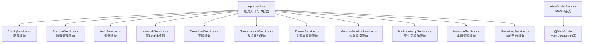
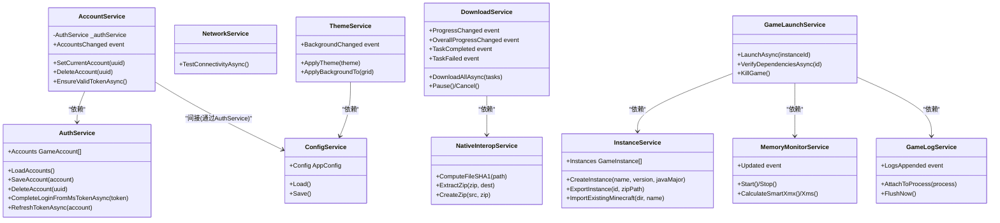
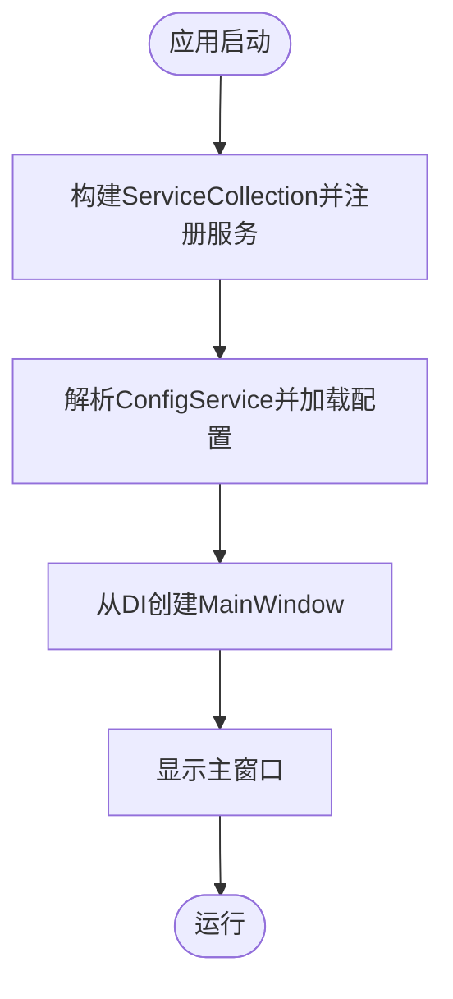
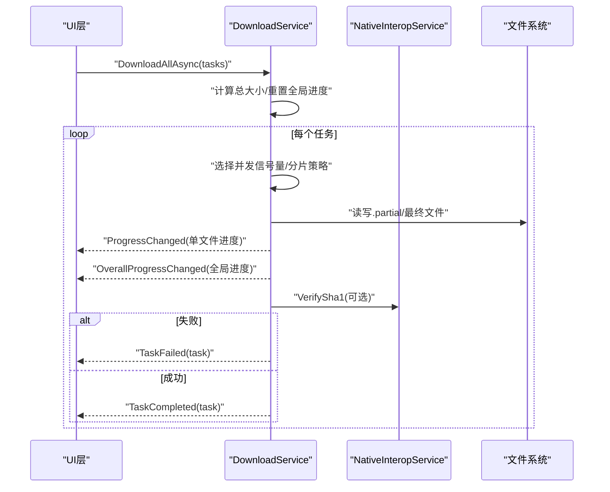
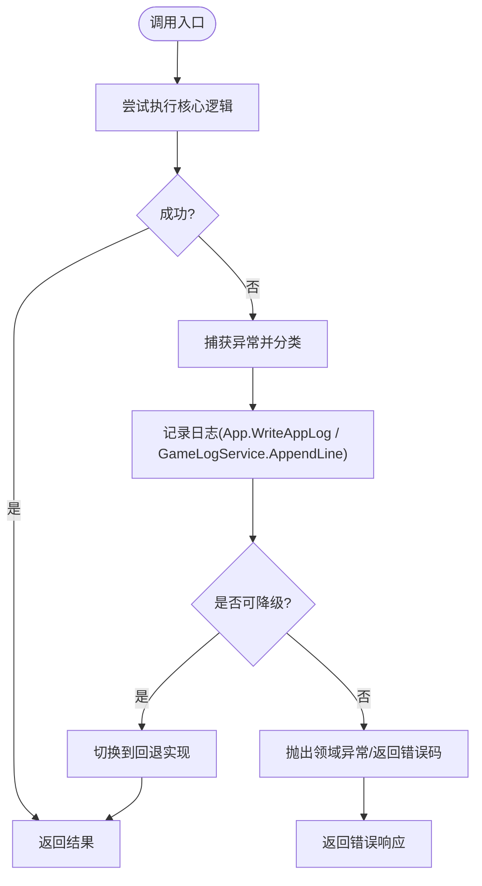
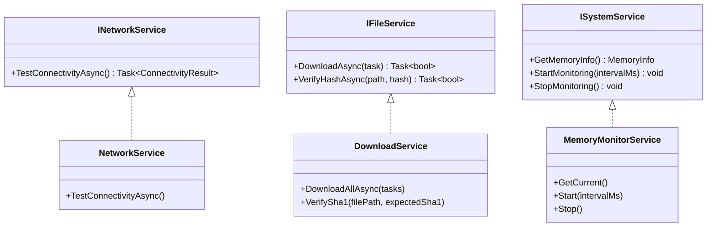
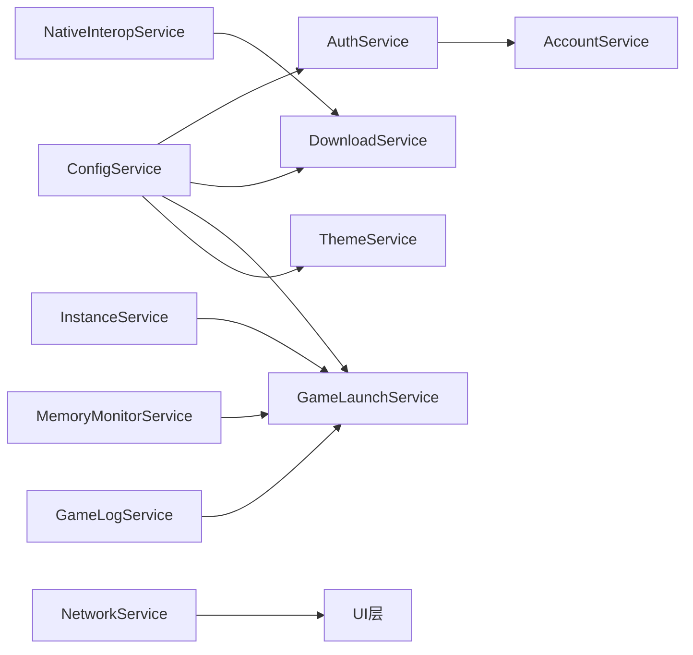

# 服务扩展开发

<cite>
**本文引用的文件**   
- [App.xaml.cs](file://src/FufuLauncher/App.xaml.cs)
- [ConfigService.cs](file://src/FufuLauncher/Services/ConfigService.cs)
- [AccountService.cs](file://src/FufuLauncher/Services/AccountService.cs)
- [AuthService.cs](file://src/FufuLauncher/Services/AuthService.cs)
- [NetworkService.cs](file://src/FufuLauncher/Services/NetworkService.cs)
- [DownloadService.cs](file://src/FufuLauncher/Services/DownloadService.cs)
- [GameLaunchService.cs](file://src/FufuLauncher/Services/GameLaunchService.cs)
- [ThemeService.cs](file://src/FufuLauncher/Services/ThemeService.cs)
- [MemoryMonitorService.cs](file://src/FufuLauncher/Services/MemoryMonitorService.cs)
- [NativeInteropService.cs](file://src/FufuLauncher/Services/NativeInteropService.cs)
- [InstanceService.cs](file://src/FufuLauncher/Services/InstanceService.cs)
- [GameLogService.cs](file://src/FufuLauncher/Services/GameLogService.cs)
- [ViewModelBase.cs](file://src/FufuLauncher/ViewModels/ViewModelBase.cs)
</cite>

## 目录
1. [简介](#简介)
2. [项目结构](#项目结构)
3. [核心组件](#核心组件)
4. [架构总览](#架构总览)
5. [详细组件分析](#详细组件分析)
6. [依赖关系分析](#依赖关系分析)
7. [性能考量](#性能考量)
8. [故障排查指南](#故障排查指南)
9. [结论](#结论)
10. [附录：服务扩展示例与最佳实践](#附录：服务扩展示例与最佳实践)

## 简介
本指南面向“可爱的芙芙启动器”的服务扩展开发，聚焦如何新增业务服务、在依赖注入容器中注册生命周期、实现服务间通信（事件驱动与消息传递）、以及错误处理与日志记录的最佳实践。文档基于现有代码库中的服务设计与实现，提供循序渐进的说明与图示，帮助读者快速上手并写出高质量的可扩展服务。

## 项目结构
- 应用入口与 DI 容器初始化位于 App.xaml.cs，集中注册所有服务与视图模型。
- 服务统一放在 Services 命名空间下，按职责划分（账号、网络、下载、实例、主题、内存监控、原生互操作等）。
- ViewModel 层通过 MVVM 基类提供属性变更通知，便于 UI 绑定。

**图表来源**
- [App.xaml.cs:170-217](file://src/FufuLauncher/App.xaml.cs#L170-L217)
- [ConfigService.cs:81-148](file://src/FufuLauncher/Services/ConfigService.cs#L81-L148)
- [AccountService.cs:12-54](file://src/FufuLauncher/Services/AccountService.cs#L12-L54)
- [AuthService.cs:76-122](file://src/FufuLauncher/Services/AuthService.cs#L76-L122)
- [NetworkService.cs:18-95](file://src/FufuLauncher/Services/NetworkService.cs#L18-L95)
- [DownloadService.cs:56-114](file://src/FufuLauncher/Services/DownloadService.cs#L56-L114)
- [GameLaunchService.cs:35-66](file://src/FufuLauncher/Services/GameLaunchService.cs#L35-L66)
- [ThemeService.cs:15-28](file://src/FufuLauncher/Services/ThemeService.cs#L15-L28)
- [MemoryMonitorService.cs:26-59](file://src/FufuLauncher/Services/MemoryMonitorService.cs#L26-L59)
- [NativeInteropService.cs:20-25](file://src/FufuLauncher/Services/NativeInteropService.cs#L20-L25)
- [InstanceService.cs:51-70](file://src/FufuLauncher/Services/InstanceService.cs#L51-L70)
- [GameLogService.cs:22-52](file://src/FufuLauncher/Services/GameLogService.cs#L22-L52)
- [ViewModelBase.cs:7-21](file://src/FufuLauncher/ViewModels/ViewModelBase.cs#L7-L21)

**章节来源**
- [App.xaml.cs:82-156](file://src/FufuLauncher/App.xaml.cs#L82-L156)
- [App.xaml.cs:170-217](file://src/FufuLauncher/App.xaml.cs#L170-L217)

## 核心组件
- 配置服务（ConfigService）：集中管理用户设置与持久化，为其他服务提供配置访问。
- 账号服务（AccountService/AuthService）：多账号管理、令牌刷新、登录流程封装。
- 网络服务（NetworkService）：连通性检测与延迟测量。
- 下载服务（DownloadService）：多线程分片断点续传、进度与重试、SHA1校验。
- 实例服务（InstanceService）：多隔离实例管理、导入导出、路径解析。
- 启动服务（GameLaunchService）：参数拼接、进程启动、资源监控与优化。
- 主题服务（ThemeService）：主题切换与背景（图片/视频）管理。
- 内存监控（MemoryMonitorService）：系统内存读取、智能分配建议、定时刷新。
- 原生互操作（NativeInteropService）：C++ DLL加速与托管回退。
- 游戏日志（GameLogService）：实时捕获 stdout/stderr，批量写入与事件通知。

**章节来源**
- [ConfigService.cs:81-148](file://src/FufuLauncher/Services/ConfigService.cs#L81-L148)
- [AccountService.cs:12-54](file://src/FufuLauncher/Services/AccountService.cs#L12-L54)
- [AuthService.cs:76-122](file://src/FufuLauncher/Services/AuthService.cs#L76-L122)
- [NetworkService.cs:18-95](file://src/FufuLauncher/Services/NetworkService.cs#L18-L95)
- [DownloadService.cs:56-114](file://src/FufuLauncher/Services/DownloadService.cs#L56-L114)
- [InstanceService.cs:51-70](file://src/FufuLauncher/Services/InstanceService.cs#L51-L70)
- [GameLaunchService.cs:35-66](file://src/FufuLauncher/Services/GameLaunchService.cs#L35-L66)
- [ThemeService.cs:15-28](file://src/FufuLauncher/Services/ThemeService.cs#L15-L28)
- [MemoryMonitorService.cs:26-59](file://src/FufuLauncher/Services/MemoryMonitorService.cs#L26-L59)
- [NativeInteropService.cs:20-25](file://src/FufuLauncher/Services/NativeInteropService.cs#L20-L25)
- [GameLogService.cs:22-52](file://src/FufuLauncher/Services/GameLogService.cs#L22-L52)

## 架构总览
- 依赖注入容器由 App.xaml.cs 统一构建，所有服务以单例方式注册，视图模型同样由容器创建。
- 服务之间通过构造函数注入依赖，避免全局状态；跨服务通信主要采用事件（Action/委托）与回调。
- 日志系统与应用日志队列解耦，后台定时器批量落盘，降低 IO 阻塞。

**图表来源**
- [App.xaml.cs:170-217](file://src/FufuLauncher/App.xaml.cs#L170-L217)
- [AccountService.cs:12-54](file://src/FufuLauncher/Services/AccountService.cs#L12-L54)
- [AuthService.cs:76-122](file://src/FufuLauncher/Services/AuthService.cs#L76-L122)
- [NetworkService.cs:18-95](file://src/FufuLauncher/Services/NetworkService.cs#L18-L95)
- [DownloadService.cs:56-114](file://src/FufuLauncher/Services/DownloadService.cs#L56-L114)
- [GameLaunchService.cs:35-66](file://src/FufuLauncher/Services/GameLaunchService.cs#L35-L66)
- [ThemeService.cs:15-28](file://src/FufuLauncher/Services/ThemeService.cs#L15-L28)
- [MemoryMonitorService.cs:26-59](file://src/FufuLauncher/Services/MemoryMonitorService.cs#L26-L59)
- [NativeInteropService.cs:20-25](file://src/FufuLauncher/Services/NativeInteropService.cs#L20-L25)
- [InstanceService.cs:51-70](file://src/FufuLauncher/Services/InstanceService.cs#L51-L70)
- [GameLogService.cs:22-52](file://src/FufuLauncher/Services/GameLogService.cs#L22-L52)

## 详细组件分析

### 依赖注入与服务注册
- 所有服务在 App.xaml.cs 中通过 ServiceCollection 注册，当前全部使用 AddSingleton，确保全局唯一实例。
- 视图模型也通过单例注册，页面视图使用 AddTransient 每次导航新建。
- 建议在新增服务时遵循以下模式：
  - 若服务无状态或共享状态（如配置、网络客户端），使用单例。
  - 若服务持有请求级或会话级状态，考虑作用域（当前未使用，可按需引入）。
  - 瞬态用于轻量、无状态对象（如某些 DTO 或临时处理器）。

**图表来源**
- [App.xaml.cs:138-156](file://src/FufuLauncher/App.xaml.cs#L138-L156)
- [App.xaml.cs:170-217](file://src/FufuLauncher/App.xaml.cs#L170-L217)

**章节来源**
- [App.xaml.cs:138-156](file://src/FufuLauncher/App.xaml.cs#L138-L156)
- [App.xaml.cs:170-217](file://src/FufuLauncher/App.xaml.cs#L170-L217)

### 服务接口定义与抽象基类
- 当前服务多为具体类直接实现功能，未定义统一接口或抽象基类。推荐做法：
  - 为每个服务定义清晰接口（如 IAccountService、IDownloadService），便于替换与测试。
  - 对通用能力（如异步任务、事件发布、日志记录）抽取抽象基类或混合接口。
- 示例：可定义 IEventBus 作为事件总线，供服务间解耦通信。

[本节为概念性内容，不直接分析具体文件]

### 服务间通信机制（事件驱动与消息传递）
- 事件驱动：服务通过 Action 委托暴露事件，订阅者响应变化（如 DownloadService.ProgressChanged、ThemeService.BackgroundChanged、MemoryMonitorService.Updated）。
- 消息传递：当前未引入消息总线，可通过事件聚合或轻量消息队列扩展。
- 最佳实践：
  - 事件名语义明确，参数尽量不可变。
  - 订阅者在异常时不影响发布者主流程（try/catch 包裹）。
  - 避免循环依赖，必要时引入中介者或服务编排。

**图表来源**
- [DownloadService.cs:222-261](file://src/FufuLauncher/Services/DownloadService.cs#L222-L261)
- [DownloadService.cs:549-560](file://src/FufuLauncher/Services/DownloadService.cs#L549-L560)
- [NativeInteropService.cs:38-55](file://src/FufuLauncher/Services/NativeInteropService.cs#L38-L55)

**章节来源**
- [DownloadService.cs:222-261](file://src/FufuLauncher/Services/DownloadService.cs#L222-L261)
- [DownloadService.cs:549-560](file://src/FufuLauncher/Services/DownloadService.cs#L549-L560)
- [NativeInteropService.cs:38-55](file://src/FufuLauncher/Services/NativeInteropService.cs#L38-L55)

### 错误处理策略与日志记录最佳实践
- 错误分类：AuthException 携带 AuthError 枚举，便于 UI 区分提示；下载失败指数退避重试；网络异常捕获并降级。
- 日志记录：
  - 应用日志（App.WriteAppLog）使用 ConcurrentQueue + Timer 批量写 app.log。
  - 游戏日志（GameLogService）独立 game.log，支持批量追加与事件通知。
- 最佳实践：
  - 关键路径 try/catch 捕获并记录上下文信息。
  - 对外部依赖失败进行降级与回退（如 NativeInterop fallback）。
  - 避免在异常路径中抛出未分类异常，统一包装为领域异常。

**图表来源**
- [AuthService.cs:160-192](file://src/FufuLauncher/Services/AuthService.cs#L160-L192)
- [DownloadService.cs:295-366](file://src/FufuLauncher/Services/DownloadService.cs#L295-L366)
- [NativeInteropService.cs:38-73](file://src/FufuLauncher/Services/NativeInteropService.cs#L38-L73)
- [GameLogService.cs:99-120](file://src/FufuLauncher/Services/GameLogService.cs#L99-L120)

**章节来源**
- [AuthService.cs:160-192](file://src/FufuLauncher/Services/AuthService.cs#L160-L192)
- [DownloadService.cs:295-366](file://src/FufuLauncher/Services/DownloadService.cs#L295-L366)
- [NativeInteropService.cs:38-73](file://src/FufuLauncher/Services/NativeInteropService.cs#L38-L73)
- [GameLogService.cs:99-120](file://src/FufuLauncher/Services/GameLogService.cs#L99-L120)

### 完整服务扩展示例（网络服务、文件服务、系统服务）
- 网络服务示例：参考 NetworkService.TestConnectivityAsync，封装 HTTP 请求、超时控制与结果聚合。
- 文件服务示例：参考 DownloadService 的分片与断点续传，结合 NativeInteropService.ComputeFileSHA1 做完整性校验。
- 系统服务示例：参考 MemoryMonitorService 的系统 API 调用与 DispatcherTimer 定时刷新。

**图表来源**
- [NetworkService.cs:18-95](file://src/FufuLauncher/Services/NetworkService.cs#L18-L95)
- [DownloadService.cs:56-114](file://src/FufuLauncher/Services/DownloadService.cs#L56-L114)
- [MemoryMonitorService.cs:26-59](file://src/FufuLauncher/Services/MemoryMonitorService.cs#L26-L59)

**章节来源**
- [NetworkService.cs:18-95](file://src/FufuLauncher/Services/NetworkService.cs#L18-L95)
- [DownloadService.cs:56-114](file://src/FufuLauncher/Services/DownloadService.cs#L56-L114)
- [MemoryMonitorService.cs:26-59](file://src/FufuLauncher/Services/MemoryMonitorService.cs#L26-L59)

## 依赖关系分析
- 服务间耦合度较低，主要通过构造函数注入与事件解耦。
- 潜在循环依赖：当前未发现强循环依赖，但新增服务时应避免双向引用。
- 外部依赖：HttpClient、文件系统、Windows API（内存、进程）、C++ DLL（可选）。

**图表来源**
- [App.xaml.cs:170-217](file://src/FufuLauncher/App.xaml.cs#L170-L217)
- [AccountService.cs:12-54](file://src/FufuLauncher/Services/AccountService.cs#L12-L54)
- [AuthService.cs:76-122](file://src/FufuLauncher/Services/AuthService.cs#L76-L122)
- [DownloadService.cs:56-114](file://src/FufuLauncher/Services/DownloadService.cs#L56-L114)
- [GameLaunchService.cs:35-66](file://src/FufuLauncher/Services/GameLaunchService.cs#L35-L66)
- [ThemeService.cs:15-28](file://src/FufuLauncher/Services/ThemeService.cs#L15-L28)
- [MemoryMonitorService.cs:26-59](file://src/FufuLauncher/Services/MemoryMonitorService.cs#L26-L59)
- [GameLogService.cs:22-52](file://src/FufuLauncher/Services/GameLogService.cs#L22-L52)

**章节来源**
- [App.xaml.cs:170-217](file://src/FufuLauncher/App.xaml.cs#L170-L217)

## 性能考量
- 下载服务：多线程分片、断点续传、指数退避重试、节流更新全局进度。
- 日志系统：批量写入、缓冲限制、定时器合并 IO。
- 内存监控：DispatcherTimer 后台优先级、降频刷新、P/Invoke 缓存。
- 原生互操作：优先 C++ 加速，失败自动回退到托管实现。

[本节为通用指导，不直接分析具体文件]

## 故障排查指南
- 登录失败：检查 AuthException.Error 类型，查看应用日志中的详细响应。
- 下载失败：关注 TaskFailed 事件与重试次数，确认 SHA1 校验与源切换逻辑。
- 启动失败：验证 Java 完整性与路径，查看进程优先级与 CPU 亲和性设置日志。
- 日志问题：确认 app.log 与 game.log 路径与权限，必要时调用 FlushNow 强制刷新。

**章节来源**
- [AuthService.cs:160-192](file://src/FufuLauncher/Services/AuthService.cs#L160-L192)
- [DownloadService.cs:295-366](file://src/FufuLauncher/Services/DownloadService.cs#L295-L366)
- [GameLaunchService.cs:104-177](file://src/FufuLauncher/Services/GameLaunchService.cs#L104-L177)
- [GameLogService.cs:168-172](file://src/FufuLauncher/Services/GameLogService.cs#L168-L172)

## 结论
本项目采用清晰的 DI 容器管理与事件驱动的服务间通信，服务职责单一、耦合度低。通过统一的错误分类与日志策略，提升了可维护性与可观测性。新增服务时建议遵循接口抽象、生命周期规范与事件解耦原则，确保扩展性与稳定性。

[本节为总结性内容，不直接分析具体文件]

## 附录：服务扩展示例与最佳实践
- 新增服务步骤：
  1. 定义服务接口（如 IMyService）。
  2. 实现服务类并在 App.xaml.cs 中注册（AddSingleton/AddTransient）。
  3. 通过构造函数注入依赖，避免静态全局。
  4. 使用事件（Action）暴露状态变化，订阅者安全处理异常。
  5. 记录关键路径日志，异常分类并降级。
- 生命周期选择：
  - 单例：配置、网络客户端、全局状态。
  - 瞬态：轻量对象、一次性处理器。
  - 作用域：会话级数据（如需引入）。
- 通信模式：
  - 事件驱动：DownloadService、ThemeService、MemoryMonitorService 的事件模式。
  - 消息传递：可扩展事件总线或轻量队列。
- 错误与日志：
  - 统一异常类型（如 AuthException）。
  - 应用日志与游戏日志分离，批量写入。
  - 外部依赖失败回退（NativeInterop fallback）。

[本节为概念性内容，不直接分析具体文件]