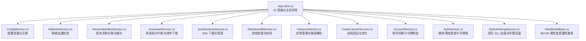
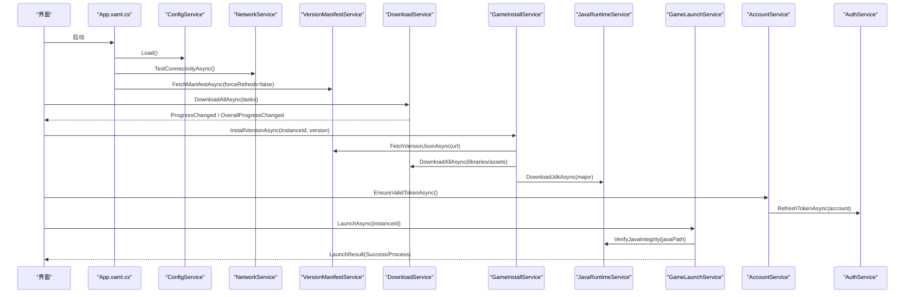
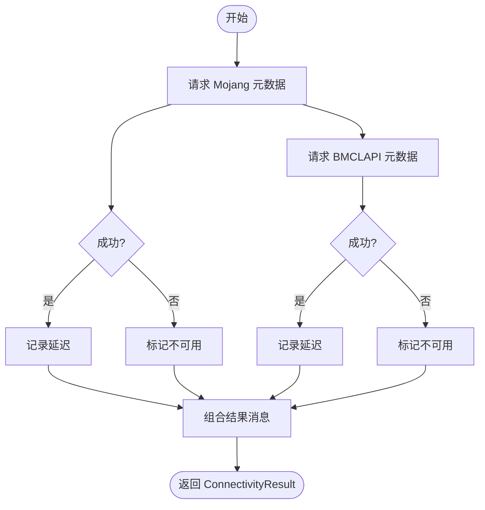
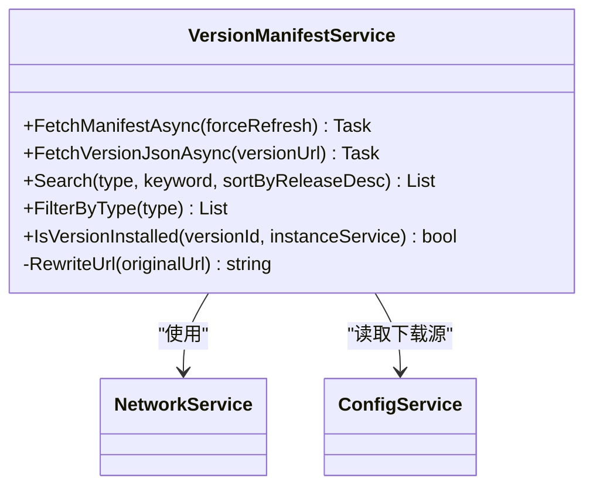
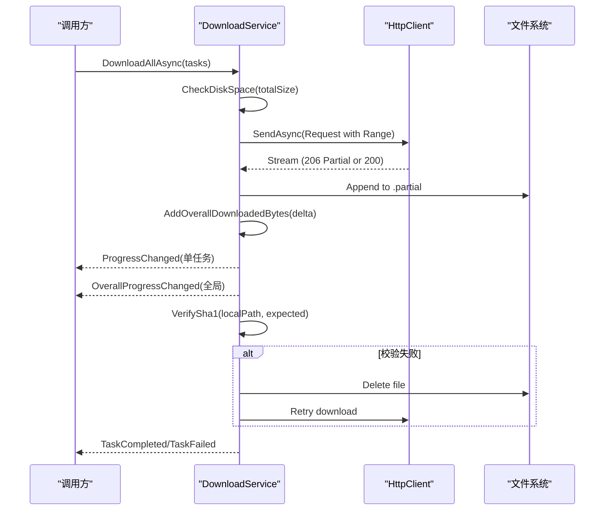
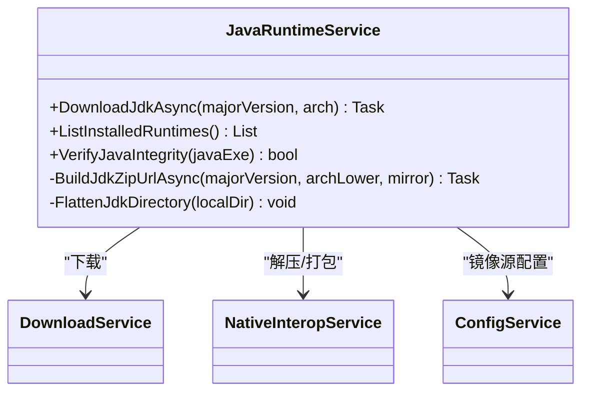
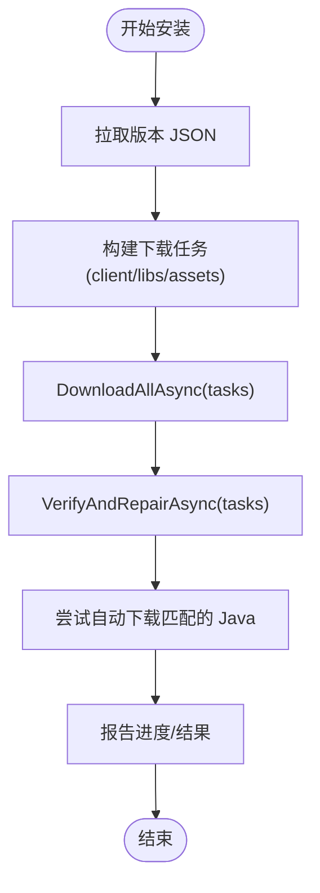
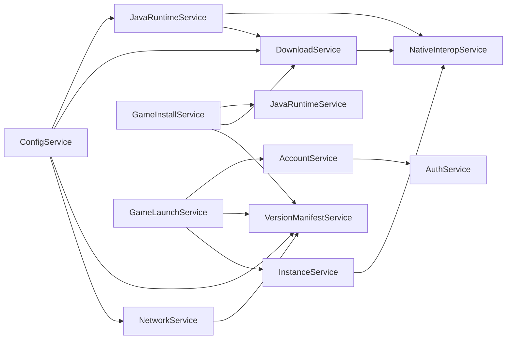

# 服务接口设计

<cite>
**本文引用的文件**   
- [App.xaml.cs](file://src/FufuLauncher/App.xaml.cs)
- [ConfigService.cs](file://src/FufuLauncher/Services/ConfigService.cs)
- [NetworkService.cs](file://src/FufuLauncher/Services/NetworkService.cs)
- [VersionManifestService.cs](file://src/FufuLauncher/Services/VersionManifestService.cs)
- [DownloadService.cs](file://src/FufuLauncher/Services/DownloadService.cs)
- [JavaRuntimeService.cs](file://src/FufuLauncher/Services/JavaRuntimeService.cs)
- [GameInstallService.cs](file://src/FufuLauncher/Services/GameInstallService.cs)
- [InstanceService.cs](file://src/FufuLauncher/Services/InstanceService.cs)
- [GameLaunchService.cs](file://src/FufuLauncher/Services/GameLaunchService.cs)
- [AccountService.cs](file://src/FufuLauncher/Services/AccountService.cs)
- [AuthService.cs](file://src/FufuLauncher/Services/AuthService.cs)
- [NativeInteropService.cs](file://src/FufuLauncher/Services/NativeInteropService.cs)
- [ViewModelBase.cs](file://src/FufuLauncher/ViewModels/ViewModelBase.cs)
</cite>

## 目录
1. [简介](#简介)
2. [项目结构](#项目结构)
3. [核心组件](#核心组件)
4. [架构总览](#架构总览)
5. [详细组件分析](#详细组件分析)
6. [依赖关系分析](#依赖关系分析)
7. [性能考量](#性能考量)
8. [故障排查指南](#故障排查指南)
9. [结论](#结论)
10. [附录：接口设计规范与示例](#附录接口设计规范与示例)

## 简介
本指南面向“可爱的芙芙”启动器的服务接口设计与实现，聚焦以下目标：
- 定义清晰的服务接口：命名规范、方法签名设计原则、参数验证策略
- 抽象基类与继承模式：通用能力封装与扩展点预留
- 版本兼容性与迁移策略：向后兼容、配置迁移、错误降级
- 完整接口设计示例：网络服务、文件服务、系统服务的接口范式
- 接口文档编写规范与最佳实践

本指南基于仓库中现有服务代码进行提炼与总结，确保所有说明均可追溯到具体实现。

## 项目结构
启动器采用 WPF + MVVM + DI（Microsoft.Extensions.DependencyInjection）架构，服务层位于 Services 目录，按职责划分模块；视图模型位于 ViewModels，页面位于 Views；应用入口在 App.xaml.cs 负责 DI 注册与生命周期管理。

**图表来源**
- [App.xaml.cs:131-178](file://src/FufuLauncher/App.xaml.cs#L131-L178)
- [ConfigService.cs:81-147](file://src/FufuLauncher/Services/ConfigService.cs#L81-L147)
- [NetworkService.cs:18-94](file://src/FufuLauncher/Services/NetworkService.cs#L18-L94)
- [VersionManifestService.cs:172-337](file://src/FufuLauncher/Services/VersionManifestService.cs#L172-L337)
- [DownloadService.cs:56-591](file://src/FufuLauncher/Services/DownloadService.cs#L56-L591)
- [JavaRuntimeService.cs:50-517](file://src/FufuLauncher/Services/JavaRuntimeService.cs#L50-L517)
- [GameInstallService.cs:50-456](file://src/FufuLauncher/Services/GameInstallService.cs#L50-L456)
- [InstanceService.cs:51-252](file://src/FufuLauncher/Services/InstanceService.cs#L51-L252)
- [GameLaunchService.cs:35-400](file://src/FufuLauncher/Services/GameLaunchService.cs#L35-L400)
- [AccountService.cs:12-53](file://src/FufuLauncher/Services/AccountService.cs#L12-L53)
- [AuthService.cs:76-682](file://src/FufuLauncher/Services/AuthService.cs#L76-L682)
- [NativeInteropService.cs:20-213](file://src/FufuLauncher/Services/NativeInteropService.cs#L20-L213)
- [ViewModelBase.cs:7-21](file://src/FufuLauncher/ViewModels/ViewModelBase.cs#L7-L21)

**章节来源**
- [App.xaml.cs:75-178](file://src/FufuLauncher/App.xaml.cs#L75-L178)

## 核心组件
- 配置服务（ConfigService）：集中管理用户设置，提供加载/保存与旧配置迁移逻辑
- 网络服务（NetworkService）：连通性检测与延迟测量
- 版本清单服务（VersionManifestService）：拉取并缓存 Mojang 版本清单，支持源切换与回退
- 下载服务（DownloadService）：多线程并发、分片断点续传、SHA1 校验、双进度（单任务+全局）
- Java 运行时服务（JavaRuntimeService）：多镜像源 JDK 下载、解压、元数据探测、完整性校验
- 游戏安装服务（GameInstallService）：版本 JSON 解析、库与资源下载、完整性校验与修复
- 实例服务（InstanceService）：实例创建、复制、导入导出、路径解析
- 游戏启动服务（GameLaunchService）：classpath/JVM 参数拼接、进程优先级与 CPU 亲和性、退出监控
- 账号服务（AccountService）：当前账号切换、令牌过期自动刷新
- 认证服务（AuthService）：微软设备码/本地回调登录、XBL→XSTS→MC 令牌链、离线账号
- 原生互操作（NativeInteropService）：C++ DLL 加速哈希与 ZIP，失败自动回退到托管实现
- MVVM 基类（ViewModelBase）：属性变更通知与 Set 辅助方法

**章节来源**
- [ConfigService.cs:13-79](file://src/FufuLauncher/Services/ConfigService.cs#L13-L79)
- [NetworkService.cs:16-94](file://src/FufuLauncher/Services/NetworkService.cs#L16-L94)
- [VersionManifestService.cs:16-171](file://src/FufuLauncher/Services/VersionManifestService.cs#L16-L171)
- [DownloadService.cs:28-114](file://src/FufuLauncher/Services/DownloadService.cs#L28-L114)
- [JavaRuntimeService.cs:25-84](file://src/FufuLauncher/Services/JavaRuntimeService.cs#L25-L84)
- [GameInstallService.cs:22-80](file://src/FufuLauncher/Services/GameInstallService.cs#L22-L80)
- [InstanceService.cs:27-70](file://src/FufuLauncher/Services/InstanceService.cs#L27-L70)
- [GameLaunchService.cs:28-65](file://src/FufuLauncher/Services/GameLaunchService.cs#L28-L65)
- [AccountService.cs:12-53](file://src/FufuLauncher/Services/AccountService.cs#L12-L53)
- [AuthService.cs:29-121](file://src/FufuLauncher/Services/AuthService.cs#L29-L121)
- [NativeInteropService.cs:20-119](file://src/FufuLauncher/Services/NativeInteropService.cs#L20-L119)
- [ViewModelBase.cs:7-21](file://src/FufuLauncher/ViewModels/ViewModelBase.cs#L7-L21)

## 架构总览
服务层通过 DI 容器统一注册，各服务之间以构造函数注入耦合，职责边界清晰。关键流程包括：
- 启动阶段：App 初始化 DI、加载配置、启动内存监控、显示主窗口
- 网络与版本：NetworkService 检测连通性，VersionManifestService 拉取清单并缓存
- 下载与安装：DownloadService 执行下载，GameInstallService 组装任务并校验
- Java 管理：JavaRuntimeService 下载并解压 JDK，GameLaunchService 校验完整性后启动
- 账号与认证：AccountService 维护当前账号，AuthService 完成令牌链与持久化
- 原生加速：NativeInteropService 优先调用 C++ DLL，失败回退托管实现

**图表来源**
- [App.xaml.cs:75-178](file://src/FufuLauncher/App.xaml.cs#L75-L178)
- [NetworkService.cs:34-76](file://src/FufuLauncher/Services/NetworkService.cs#L34-L76)
- [VersionManifestService.cs:205-255](file://src/FufuLauncher/Services/VersionManifestService.cs#L205-L255)
- [DownloadService.cs:222-261](file://src/FufuLauncher/Services/DownloadService.cs#L222-L261)
- [GameInstallService.cs:83-286](file://src/FufuLauncher/Services/GameInstallService.cs#L83-L286)
- [JavaRuntimeService.cs:199-277](file://src/FufuLauncher/Services/JavaRuntimeService.cs#L199-L277)
- [AccountService.cs:42-52](file://src/FufuLauncher/Services/AccountService.cs#L42-L52)
- [AuthService.cs:421-468](file://src/FufuLauncher/Services/AuthService.cs#L421-L468)
- [GameLaunchService.cs:104-316](file://src/FufuLauncher/Services/GameLaunchService.cs#L104-L316)

## 详细组件分析

### 网络服务（NetworkService）
- 接口职责：检测官方源与 BMCLAPI 连通性与延迟
- 关键方法：TestConnectivityAsync
- 参数验证：URL 常量定义，避免外部传入不可信地址
- 错误处理：捕获异常并返回布尔状态与消息
- 性能特征：短超时（8s），避免阻塞 UI

**图表来源**
- [NetworkService.cs:34-76](file://src/FufuLauncher/Services/NetworkService.cs#L34-L76)

**章节来源**
- [NetworkService.cs:18-94](file://src/FufuLauncher/Services/NetworkService.cs#L18-L94)

### 版本清单服务（VersionManifestService）
- 接口职责：拉取并缓存版本清单，支持关键词搜索与类型过滤
- 关键方法：FetchManifestAsync、Search、FilterByType、IsVersionInstalled
- 参数验证：forceRefresh 控制是否强制网络；keyword/type 空值处理
- 错误处理：首选源失败回退另一源；失败时保留旧缓存不阻塞 UI
- 性能特征：8s 超时快速失败，避免长等待

**图表来源**
- [VersionManifestService.cs:172-337](file://src/FufuLauncher/Services/VersionManifestService.cs#L172-L337)
- [NetworkService.cs:31-32](file://src/FufuLauncher/Services/NetworkService.cs#L31-L32)
- [ConfigService.cs:13-79](file://src/FufuLauncher/Services/ConfigService.cs#L13-L79)

**章节来源**
- [VersionManifestService.cs:172-337](file://src/FufuLauncher/Services/VersionManifestService.cs#L172-L337)

### 下载服务（DownloadService）
- 接口职责：多线程并发下载、分片断点续传、SHA1 校验、双进度事件
- 关键方法：DownloadAllAsync、GetSourceUrl、VerifySha1、Pause/Cancel
- 参数验证：磁盘空间检查、Size/Sha1 校验、重试次数 MaxRetry
- 错误处理：指数退避重试、SHA1 失败重下一次、取消令牌传播
- 性能特征：类别独立信号量、大文件分片、节流更新整体进度

**图表来源**
- [DownloadService.cs:222-366](file://src/FufuLauncher/Services/DownloadService.cs#L222-L366)
- [DownloadService.cs:369-451](file://src/FufuLauncher/Services/DownloadService.cs#L369-L451)
- [DownloadService.cs:454-547](file://src/FufuLauncher/Services/DownloadService.cs#L454-L547)
- [DownloadService.cs:584-590](file://src/FufuLauncher/Services/DownloadService.cs#L584-L590)

**章节来源**
- [DownloadService.cs:56-591](file://src/FufuLauncher/Services/DownloadService.cs#L56-L591)

### Java 运行时服务（JavaRuntimeService）
- 接口职责：多镜像源 JDK 下载、解压、元数据探测、完整性校验
- 关键方法：DownloadJdkAsync、ListInstalledRuntimes、VerifyJavaIntegrity
- 参数验证：majorVersion/arch 合法性、镜像源支持列表
- 错误处理：Adoptium API 失败回退硬编码；华为云目录解析失败日志记录
- 性能特征：优先原生解压，失败回退托管；异步进度事件

**图表来源**
- [JavaRuntimeService.cs:199-277](file://src/FufuLauncher/Services/JavaRuntimeService.cs#L199-L277)
- [JavaRuntimeService.cs:382-429](file://src/FufuLauncher/Services/JavaRuntimeService.cs#L382-L429)
- [JavaRuntimeService.cs:483-510](file://src/FufuLauncher/Services/JavaRuntimeService.cs#L483-L510)
- [NativeInteropService.cs:85-119](file://src/FufuLauncher/Services/NativeInteropService.cs#L85-L119)
- [ConfigService.cs:46-48](file://src/FufuLauncher/Services/ConfigService.cs#L46-L48)

**章节来源**
- [JavaRuntimeService.cs:50-517](file://src/FufuLauncher/Services/JavaRuntimeService.cs#L50-L517)

### 游戏安装服务（GameInstallService）
- 接口职责：解析版本 JSON、下载 client.jar/libraries/assets、校验与修复
- 关键方法：InstallVersionAsync、VerifyAndRepairAsync、VerifyInstanceIntegrityAsync
- 参数验证：任务项 Size/Sha1、操作系统规则过滤
- 错误处理：下载失败提示切换下载源；校验失败自动重下
- 性能特征：先同步索引再批量下载；快速完整性检查用于 UI 反馈

**图表来源**
- [GameInstallService.cs:83-286](file://src/FufuLauncher/Services/GameInstallService.cs#L83-L286)
- [GameInstallService.cs:289-323](file://src/FufuLauncher/Services/GameInstallService.cs#L289-L323)
- [GameInstallService.cs:326-424](file://src/FufuLauncher/Services/GameInstallService.cs#L326-L424)

**章节来源**
- [GameInstallService.cs:50-456](file://src/FufuLauncher/Services/GameInstallService.cs#L50-L456)

### 实例服务（InstanceService）
- 接口职责：实例 CRUD、复制、导入已有 .minecraft、路径解析
- 关键方法：CreateInstance、DuplicateInstance、ImportExistingMinecraft、GetMinecraftDir
- 参数验证：名称唯一性、目录存在性
- 错误处理：损坏实例忽略；复制失败回滚
- 性能特征：递归复制目录；ZIP 备份通过原生加速

**章节来源**
- [InstanceService.cs:51-252](file://src/FufuLauncher/Services/InstanceService.cs#L51-L252)

### 游戏启动服务（GameLaunchService）
- 接口职责：classpath/JVM 参数拼接、进程优先级与 CPU 亲和性、退出监控
- 关键方法：LaunchAsync、VerifyDependenciesAsync、KillGame
- 参数验证：实例存在、Java 可执行文件完整性
- 错误处理：Java 缺失弹窗引导下载；令牌过期自动刷新
- 性能特征：智能内存分配覆盖实例配置；后台监控退出时间

**章节来源**
- [GameLaunchService.cs:35-400](file://src/FufuLauncher/Services/GameLaunchService.cs#L35-L400)

### 账号服务（AccountService）与认证服务（AuthService）
- 接口职责：账号切换、令牌过期自动刷新；微软/离线登录、令牌链、持久化
- 关键方法：EnsureValidTokenAsync、RequestDeviceCodeAsync、CompleteLoginFromMsTokenAsync、LoginOffline
- 参数验证：deviceCode/interval/cancellationToken；nickname 生成确定性 UUID
- 错误处理：AuthException 携带枚举区分错误类型；网络异常与取消处理
- 性能特征：轮询间隔自适应 slow_down；本地回调端口监听

**章节来源**
- [AccountService.cs:12-53](file://src/FufuLauncher/Services/AccountService.cs#L12-L53)
- [AuthService.cs:76-682](file://src/FufuLauncher/Services/AuthService.cs#L76-L682)

### 原生互操作（NativeInteropService）
- 接口职责：C++ DLL 加速 SHA1/SHA256、ZIP 解压/打包；失败回退托管实现
- 关键方法：ComputeFileSHA1/256、ExtractZip/CreateZip、IsNativeAvailable
- 参数验证：路径有效性；DLL 可用性探测缓存
- 错误处理：DllNotFoundException/BadImageFormatException 触发回退
- 性能特征：首次探测缓存结果，避免重复开销

**章节来源**
- [NativeInteropService.cs:20-213](file://src/FufuLauncher/Services/NativeInteropService.cs#L20-L213)

## 依赖关系分析
服务间依赖通过 DI 容器注入，形成清晰的层次：
- 基础服务：ConfigService、NetworkService、NativeInteropService
- 业务服务：VersionManifestService、DownloadService、JavaRuntimeService、GameInstallService、InstanceService、GameLaunchService、AccountService、AuthService
- 视图模型：ViewModelBase 作为基类，提供属性变更通知

**图表来源**
- [App.xaml.cs:131-178](file://src/FufuLauncher/App.xaml.cs#L131-L178)
- [VersionManifestService.cs:172-189](file://src/FufuLauncher/Services/VersionManifestService.cs#L172-L189)
- [DownloadService.cs:99-114](file://src/FufuLauncher/Services/DownloadService.cs#L99-L114)
- [JavaRuntimeService.cs:76-84](file://src/FufuLauncher/Services/JavaRuntimeService.cs#L76-L84)
- [GameInstallService.cs:69-80](file://src/FufuLauncher/Services/GameInstallService.cs#L69-L80)
- [InstanceService.cs:66-70](file://src/FufuLauncher/Services/InstanceService.cs#L66-L70)
- [GameLaunchService.cs:48-65](file://src/FufuLauncher/Services/GameLaunchService.cs#L48-L65)
- [AccountService.cs:22-26](file://src/FufuLauncher/Services/AccountService.cs#L22-L26)

**章节来源**
- [App.xaml.cs:131-178](file://src/FufuLauncher/App.xaml.cs#L131-L178)

## 性能考量
- 网络层：短超时（8s）快速失败，避免 UI 卡顿；User-Agent 头避免限流
- 下载层：类别独立信号量、大文件分片、断点续传、SHA1 校验、指数退避重试
- 进度更新：节流 150ms 更新整体进度，保证视觉平滑
- Java 层：优先原生解压，失败回退托管；java -version 探测元数据
- 启动层：智能内存分配、CPU 亲和性、高优先级（非 Realtime）
- 日志层：队列缓冲 + 定时刷盘，降低 IO 阻塞

[本节为通用指导，无需引用具体文件]

## 故障排查指南
- 网络问题：检查连通性测试结果与下载源配置；查看 LastError 字段
- 下载失败：确认磁盘空间充足；查看重试次数与错误信息；尝试切换下载源
- Java 缺失或损坏：运行 VerifyJavaIntegrity；前往 Java 运行时页面手动下载
- 令牌过期：AccountService.EnsureValidTokenAsync 自动刷新；失败则重新登录
- 原生 DLL 不可用：NativeInteropService.IsNativeAvailable 回退托管实现；不影响功能

**章节来源**
- [VersionManifestService.cs:179-181](file://src/FufuLauncher/Services/VersionManifestService.cs#L179-L181)
- [DownloadService.cs:264-293](file://src/FufuLauncher/Services/DownloadService.cs#L264-L293)
- [JavaRuntimeService.cs:483-510](file://src/FufuLauncher/Services/JavaRuntimeService.cs#L483-L510)
- [AccountService.cs:42-52](file://src/FufuLauncher/Services/AccountService.cs#L42-L52)
- [NativeInteropService.cs:143-157](file://src/FufuLauncher/Services/NativeInteropService.cs#L143-L157)

## 结论
本指南从架构、组件、依赖、性能与故障排查等维度全面梳理了“可爱的芙芙”启动器的服务接口设计与实现。通过明确的接口命名、严谨的参数验证、完善的错误处理与性能优化，确保了系统的稳定性与可扩展性。后续可在抽象基类与扩展点方面进一步提炼通用能力，提升复用性。

[本节为总结，无需引用具体文件]

## 附录：接口设计规范与示例

### 接口命名规范
- 服务类名：以 Service 结尾，如 NetworkService、DownloadService
- 方法名：动词开头，语义明确，异步方法以 Async 结尾，如 TestConnectivityAsync、DownloadAllAsync
- 参数名：小驼峰，具象描述用途，如 instanceId、versionUrl、majorVersion
- 返回值：简单类型或记录/DTO，复杂结果使用专用类型如 ConnectivityResult、InstallProgress

**章节来源**
- [NetworkService.cs:16-18](file://src/FufuLauncher/Services/NetworkService.cs#L16-L18)
- [DownloadService.cs:28-45](file://src/FufuLauncher/Services/DownloadService.cs#L28-L45)
- [GameInstallService.cs:33-48](file://src/FufuLauncher/Services/GameInstallService.cs#L33-L48)

### 方法签名设计原则
- 输入参数最小化且必要，避免多余参数
- 输出结果包含状态与详细信息，便于 UI 展示与错误定位
- 异步方法支持 CancellationToken，允许取消操作
- 事件驱动：ProgressChanged、TaskCompleted 等事件用于进度与状态通知

**章节来源**
- [AuthService.cs:198-265](file://src/FufuLauncher/Services/AuthService.cs#L198-L265)
- [DownloadService.cs:85-90](file://src/FufuLauncher/Services/DownloadService.cs#L85-L90)
- [GameInstallService.cs:58-67](file://src/FufuLauncher/Services/GameInstallService.cs#L58-L67)

### 参数验证策略
- 前置校验：空值检查、范围限制（如 Size/Sha1）、权限与路径存在性
- 运行时校验：网络响应状态码、文件完整性（SHA1）、Java 可执行性
- 容错处理：默认值、回退逻辑、友好错误消息

**章节来源**
- [DownloadService.cs:264-293](file://src/FufuLauncher/Services/DownloadService.cs#L264-L293)
- [JavaRuntimeService.cs:483-510](file://src/FufuLauncher/Services/JavaRuntimeService.cs#L483-L510)
- [GameInstallService.cs:289-323](file://src/FufuLauncher/Services/GameInstallService.cs#L289-L323)

### 抽象基类与继承模式
- ViewModelBase：提供属性变更通知与 Set 辅助方法，统一 MVVM 行为
- 建议：为通用服务（如文件操作、网络请求）建立抽象基类，封装日志、重试、超时等横切关注点

**章节来源**
- [ViewModelBase.cs:7-21](file://src/FufuLauncher/ViewModels/ViewModelBase.cs#L7-L21)

### 版本兼容性与迁移策略
- 配置迁移：ConfigService.Load 中处理旧字段（BackgroundPath/BackgroundType → BaseImagePath/OverlayType）
- 向后兼容：新增字段可选，旧配置仍可加载；失败时回退默认值
- 迁移策略：渐进式升级，保留旧数据结构，逐步废弃

**章节来源**
- [ConfigService.cs:104-128](file://src/FufuLauncher/Services/ConfigService.cs#L104-L128)

### 接口文档编写规范与最佳实践
- 每个服务提供：职责说明、关键方法、参数与返回值、错误处理、性能特性
- 使用流程图/序列图展示关键流程，便于理解
- 示例代码路径引用，避免直接粘贴代码
- 定期更新文档，与实际实现保持一致

[本节为通用指导，无需引用具体文件]