# 服务生命周期管理

<cite>
**本文引用的文件**   
- [App.xaml.cs](file://src/FufuLauncher/App.xaml.cs)
- [MainWindow.xaml.cs](file://src/FufuLauncher/MainWindow.xaml.cs)
- [ConfigService.cs](file://src/FufuLauncher/Services/ConfigService.cs)
- [MemoryMonitorService.cs](file://src/FufuLauncher/Services/MemoryMonitorService.cs)
- [EnvironmentCheckService.cs](file://src/FufuLauncher/Services/EnvironmentCheckService.cs)
- [ThemeService.cs](file://src/FufuLauncher/Services/ThemeService.cs)
- [NetworkService.cs](file://src/FufuLauncher/Services/NetworkService.cs)
- [DownloadService.cs](file://src/FufuLauncher/Services/DownloadService.cs)
- [JavaRuntimeService.cs](file://src/FufuLauncher/Services/JavaRuntimeService.cs)
- [GameLaunchService.cs](file://src/FufuLauncher/Services/GameLaunchService.cs)
- [GameLogService.cs](file://src/FufuLauncher/Services/GameLogService.cs)
</cite>

## 目录
1. [简介](#简介)
2. [项目结构](#项目结构)
3. [核心组件](#核心组件)
4. [架构总览](#架构总览)
5. [详细组件分析](#详细组件分析)
6. [依赖关系分析](#依赖关系分析)
7. [性能考量](#性能考量)
8. [故障排查指南](#故障排查指南)
9. [结论](#结论)
10. [附录：完整生命周期示例](#附录完整生命周期示例)

## 简介
本指南围绕“可爱的芙芙启动器”的服务生命周期管理，系统化阐述服务的初始化顺序、资源分配策略、启动与停止流程（含异步初始化与优雅关闭）、服务间依赖解析与生命周期协调，以及资源释放与内存管理最佳实践。文档同时提供涵盖定时任务服务、缓存服务与连接池服务的完整生命周期示例，帮助读者在实际项目中落地可维护、可扩展的服务治理方案。

## 项目结构
启动器采用 WPF + .NET 8 Desktop 应用，通过 Microsoft.Extensions.DependencyInjection 进行依赖注入与服务注册。应用入口负责创建 DI 容器、注册服务、加载配置、启动 UI 与后台监控；主窗口在加载时触发环境自检并应用主题背景；各 Service 按职责划分，彼此通过构造函数注入协作。

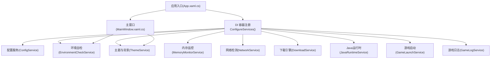

图表来源
- [App.xaml.cs:99-178](file://src/FufuLauncher/App.xaml.cs#L99-L178)
- [MainWindow.xaml.cs:38-73](file://src/FufuLauncher/MainWindow.xaml.cs#L38-L73)

章节来源
- [App.xaml.cs:75-178](file://src/FufuLauncher/App.xaml.cs#L75-L178)
- [MainWindow.xaml.cs:1-73](file://src/FufuLauncher/MainWindow.xaml.cs#L1-L73)

## 核心组件
- 应用入口与 DI 容器：集中注册所有单例服务与视图模型，构建 IServiceProvider，并在 OnStartup/OnExit 中完成生命周期钩子。
- 配置服务：统一读取/保存用户设置，支持旧字段迁移，避免启动期强耦合。
- 环境自检：异步检查 .NET 运行时、系统架构、磁盘空间、网络连通与 Java 扫描结果。
- 主题与背景：动态切换 Light/Dark 主题，管理图片/视频背景层，支持暂停/恢复与释放。
- 内存监控：基于 DispatcherTimer 定时刷新系统内存信息，智能计算 JVM Xmx/Xms。
- 网络检测：并发探测 Mojang/BMCLAPI 源连通性与延迟。
- 下载引擎：多线程分片断点续传、SHA1 校验、失败重试、全局进度节流。
- Java 运行时：多镜像源拉取 JDK 版本列表、下载解压、完整性校验。
- 游戏启动：组装 classpath/JVM 参数、进程优先级与亲和性、退出监控与统计。
- 游戏日志：实时捕获 stdout/stderr，批量落盘，限制内存缓冲行数。

章节来源
- [ConfigService.cs:85-149](file://src/FufuLauncher/Services/ConfigService.cs#L85-L149)
- [EnvironmentCheckService.cs:35-73](file://src/FufuLauncher/Services/EnvironmentCheckService.cs#L35-L73)
- [ThemeService.cs:15-103](file://src/FufuLauncher/Services/ThemeService.cs#L15-L103)
- [MemoryMonitorService.cs:26-122](file://src/FufuLauncher/Services/MemoryMonitorService.cs#L26-L122)
- [NetworkService.cs:18-95](file://src/FufuLauncher/Services/NetworkService.cs#L18-L95)
- [DownloadService.cs:56-114](file://src/FufuLauncher/Services/DownloadService.cs#L56-L114)
- [JavaRuntimeService.cs:50-84](file://src/FufuLauncher/Services/JavaRuntimeService.cs#L50-L84)
- [GameLaunchService.cs:35-65](file://src/FufuLauncher/Services/GameLaunchService.cs#L35-L65)
- [GameLogService.cs:22-52](file://src/FufuLauncher/Services/GameLogService.cs#L22-L52)

## 架构总览
下图展示启动器从应用启动到 UI 就绪的关键调用链，以及服务间的依赖关系。

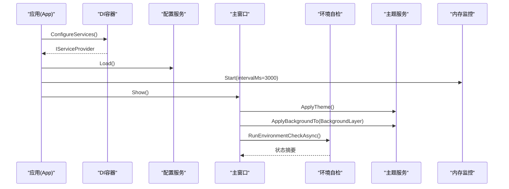

图表来源
- [App.xaml.cs:99-117](file://src/FufuLauncher/App.xaml.cs#L99-L117)
- [MainWindow.xaml.cs:38-73](file://src/FufuLauncher/MainWindow.xaml.cs#L38-L73)
- [EnvironmentCheckService.cs:52-73](file://src/FufuLauncher/Services/EnvironmentCheckService.cs#L52-L73)
- [ThemeService.cs:31-62](file://src/FufuLauncher/Services/ThemeService.cs#L31-L62)
- [MemoryMonitorService.cs:61-88](file://src/FufuLauncher/Services/MemoryMonitorService.cs#L61-L88)

## 详细组件分析

### 应用入口与 DI 容器（App）
- 初始化数据目录与异常捕获
- 注册全部服务为单例，构建 ServiceProvider
- 启动内存监控定时器，显示主窗口
- 退出时优雅停止定时器、释放主题背景、刷新日志缓冲

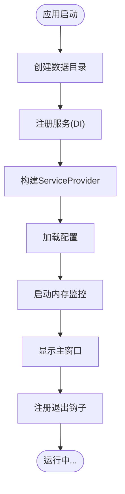

图表来源
- [App.xaml.cs:75-117](file://src/FufuLauncher/App.xaml.cs#L75-L117)
- [App.xaml.cs:119-129](file://src/FufuLauncher/App.xaml.cs#L119-L129)
- [App.xaml.cs:131-178](file://src/FufuLauncher/App.xaml.cs#L131-L178)

章节来源
- [App.xaml.cs:75-178](file://src/FufuLauncher/App.xaml.cs#L75-L178)

### 主窗口与页面导航（MainWindow）
- 窗口加载时淡入动画、默认导航到主页
- 应用主题与背景，订阅背景变更事件
- 异步执行环境自检，更新状态栏
- 最小化/恢复时暂停/恢复视频背景
- 关闭时释放背景资源，避免句柄泄漏

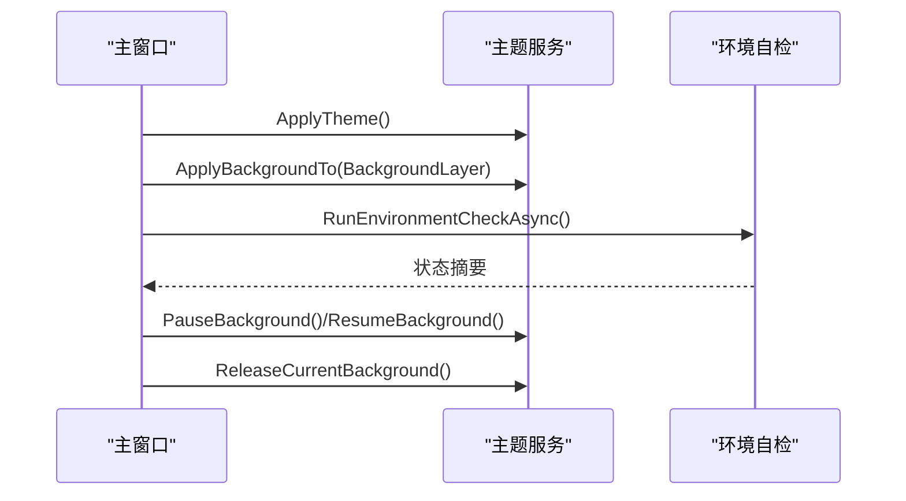

图表来源
- [MainWindow.xaml.cs:38-97](file://src/FufuLauncher/MainWindow.xaml.cs#L38-L97)
- [ThemeService.cs:244-274](file://src/FufuLauncher/Services/ThemeService.cs#L244-L274)

章节来源
- [MainWindow.xaml.cs:38-97](file://src/FufuLauncher/MainWindow.xaml.cs#L38-L97)

### 配置服务（ConfigService）
- 使用实例属性避免静态初始化顺序问题
- 支持旧字段迁移，保证向后兼容
- 读写 config.json，失败不抛异常

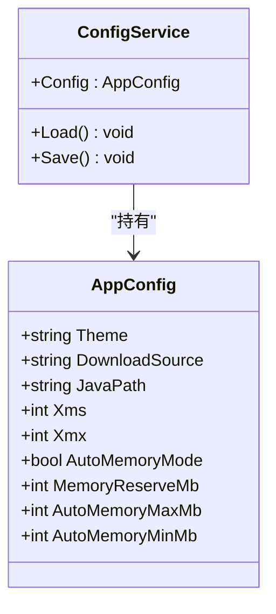

图表来源
- [ConfigService.cs:85-149](file://src/FufuLauncher/Services/ConfigService.cs#L85-L149)

章节来源
- [ConfigService.cs:85-149](file://src/FufuLauncher/Services/ConfigService.cs#L85-L149)

### 环境自检（EnvironmentCheckService）
- 顺序执行：.NET 运行时、系统架构、磁盘空间、网络连通、Java 扫描
- 根据配置决定是否自动扫描 Java
- 汇总结果并提供状态摘要

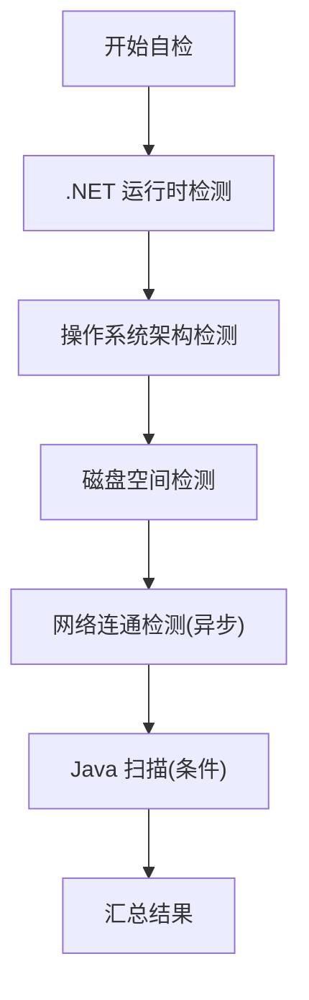

图表来源
- [EnvironmentCheckService.cs:52-73](file://src/FufuLauncher/Services/EnvironmentCheckService.cs#L52-L73)
- [EnvironmentCheckService.cs:151-174](file://src/FufuLauncher/Services/EnvironmentCheckService.cs#L151-L174)
- [EnvironmentCheckService.cs:176-213](file://src/FufuLauncher/Services/EnvironmentCheckService.cs#L176-L213)

章节来源
- [EnvironmentCheckService.cs:35-73](file://src/FufuLauncher/Services/EnvironmentCheckService.cs#L35-L73)

### 主题与背景（ThemeService）
- 切换 Light/Dark 主题，覆盖资源字典
- 支持图片/视频背景，透明蒙版自适应
- 暂停/恢复播放，释放当前背景资源

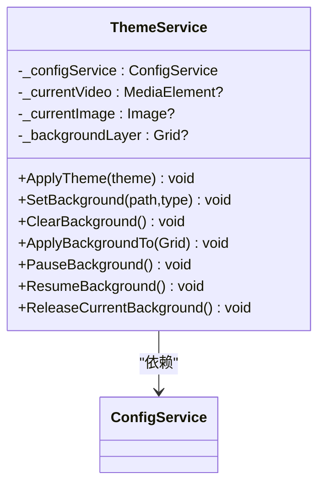

图表来源
- [ThemeService.cs:15-103](file://src/FufuLauncher/Services/ThemeService.cs#L15-L103)
- [ThemeService.cs:119-200](file://src/FufuLauncher/Services/ThemeService.cs#L119-L200)
- [ThemeService.cs:244-274](file://src/FufuLauncher/Services/ThemeService.cs#L244-L274)

章节来源
- [ThemeService.cs:15-103](file://src/FufuLauncher/Services/ThemeService.cs#L15-L103)

### 内存监控（MemoryMonitorService）
- 使用 DispatcherTimer 在 UI 线程触发，避免跨线程 Invoke 堆积
- 兜底 Timer 回退机制
- 智能计算 Xmx/Xms，生成多核 GC 优化参数

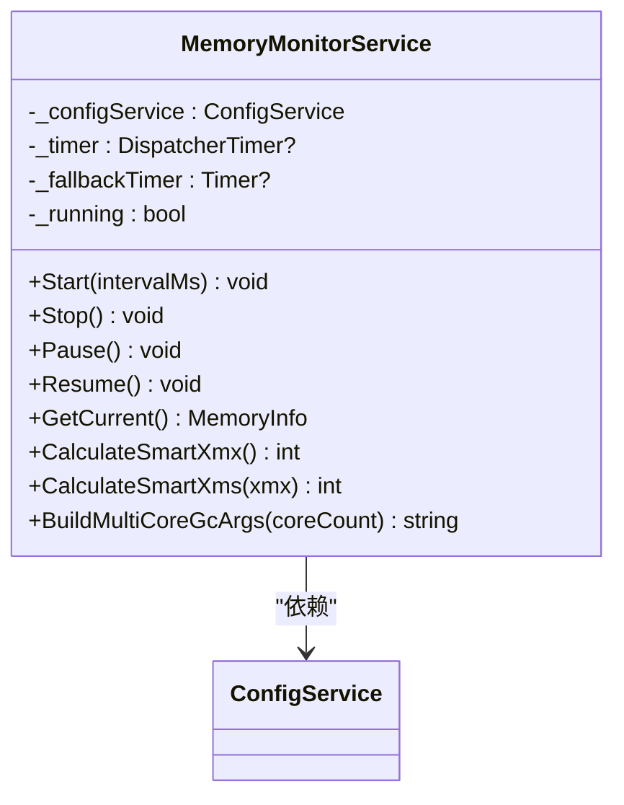

图表来源
- [MemoryMonitorService.cs:26-122](file://src/FufuLauncher/Services/MemoryMonitorService.cs#L26-L122)
- [MemoryMonitorService.cs:175-213](file://src/FufuLauncher/Services/MemoryMonitorService.cs#L175-L213)

章节来源
- [MemoryMonitorService.cs:26-122](file://src/FufuLauncher/Services/MemoryMonitorService.cs#L26-L122)

### 网络检测（NetworkService）
- 并发探测 Mojang/BMCLAPI 源连通性与延迟
- 超时控制与 User-Agent 设置

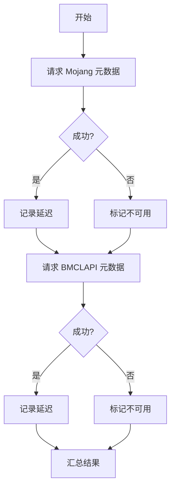

图表来源
- [NetworkService.cs:34-76](file://src/FufuLauncher/Services/NetworkService.cs#L34-L76)

章节来源
- [NetworkService.cs:18-95](file://src/FufuLauncher/Services/NetworkService.cs#L18-L95)

### 下载引擎（DownloadService）
- 每类别独立 SemaphoreSlim 控制并发
- 大文件分片下载与小文件 Range 续传
- SHA1 校验、指数退避重试、全局进度节流
- 取消令牌覆盖与任务清理

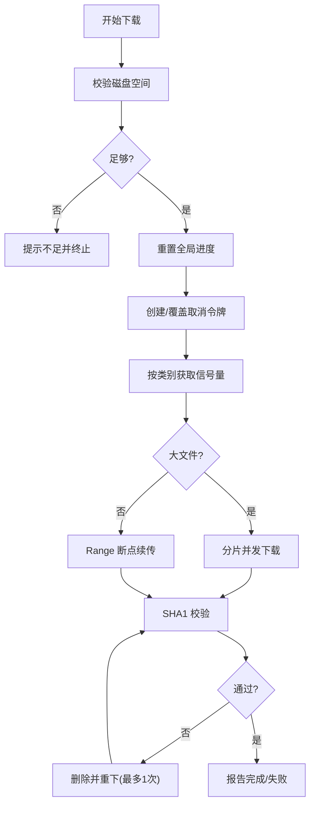

图表来源
- [DownloadService.cs:222-261](file://src/FufuLauncher/Services/DownloadService.cs#L222-L261)
- [DownloadService.cs:295-366](file://src/FufuLauncher/Services/DownloadService.cs#L295-L366)
- [DownloadService.cs:368-451](file://src/FufuLauncher/Services/DownloadService.cs#L368-L451)
- [DownloadService.cs:453-547](file://src/FufuLauncher/Services/DownloadService.cs#L453-L547)

章节来源
- [DownloadService.cs:56-114](file://src/FufuLauncher/Services/DownloadService.cs#L56-L114)

### Java 运行时（JavaRuntimeService）
- 多镜像源版本列表拉取与下载
- 解压后目录上提，确保 java.exe 就位
- 完整性校验（java -version）

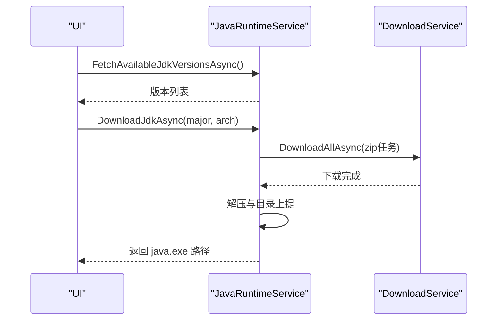

图表来源
- [JavaRuntimeService.cs:116-158](file://src/FufuLauncher/Services/JavaRuntimeService.cs#L116-L158)
- [JavaRuntimeService.cs:199-277](file://src/FufuLauncher/Services/JavaRuntimeService.cs#L199-L277)
- [JavaRuntimeService.cs:482-510](file://src/FufuLauncher/Services/JavaRuntimeService.cs#L482-L510)

章节来源
- [JavaRuntimeService.cs:50-84](file://src/FufuLauncher/Services/JavaRuntimeService.cs#L50-84)

### 游戏启动（GameLaunchService）
- 启动前依赖校验、账号 token 校验、Java 完整性校验
- 智能内存分配覆盖实例配置
- 拼接 JVM 参数与类路径，启动进程并监控退出

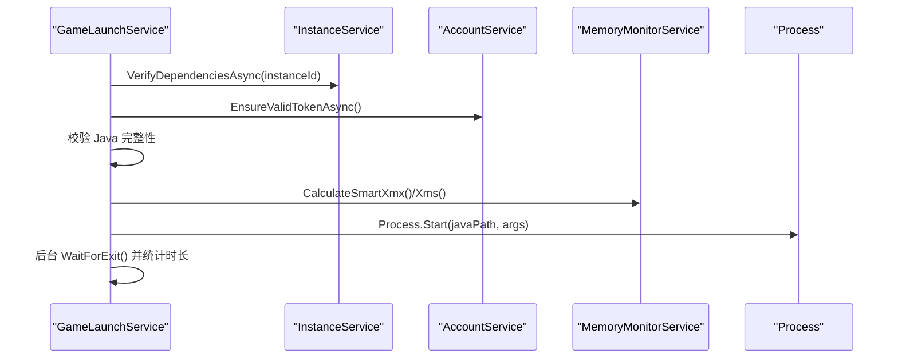

图表来源
- [GameLaunchService.cs:104-177](file://src/FufuLauncher/Services/GameLaunchService.cs#L104-L177)
- [GameLaunchService.cs:179-225](file://src/FufuLauncher/Services/GameLaunchService.cs#L179-L225)
- [GameLaunchService.cs:269-316](file://src/FufuLauncher/Services/GameLaunchService.cs#L269-L316)

章节来源
- [GameLaunchService.cs:35-65](file://src/FufuLauncher/Services/GameLaunchService.cs#L35-L65)

### 游戏日志（GameLogService）
- 实时附加进程输出流，写入内存缓冲与待写队列
- 200ms 批量落盘，限制最大行数，避免内存膨胀
- Dispose 时释放定时器与事件订阅

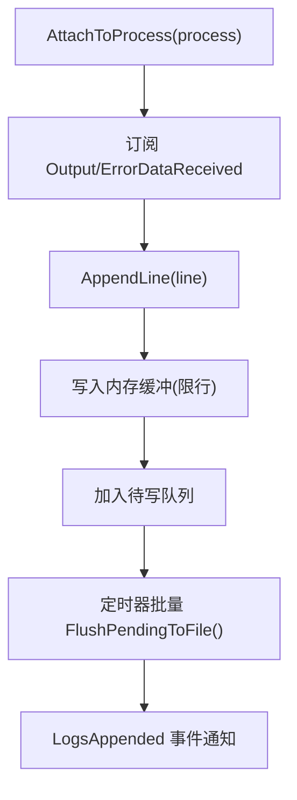

图表来源
- [GameLogService.cs:54-65](file://src/FufuLauncher/Services/GameLogService.cs#L54-L65)
- [GameLogService.cs:99-120](file://src/FufuLauncher/Services/GameLogService.cs#L99-L120)
- [GameLogService.cs:139-166](file://src/FufuLauncher/Services/GameLogService.cs#L139-L166)
- [GameLogService.cs:210-221](file://src/FufuLauncher/Services/GameLogService.cs#L210-L221)

章节来源
- [GameLogService.cs:22-52](file://src/FufuLauncher/Services/GameLogService.cs#L22-L52)

## 依赖关系分析
- 应用入口集中注册服务，形成以 DI 为核心的松耦合架构
- 服务间依赖清晰：如 GameLaunchService 依赖 InstanceService、VersionManifestService、HashVerifyService、AccountService、GameLogService、ConfigService、JavaRuntimeService、MemoryMonitorService
- 下载引擎与 Java 运行时共享 DownloadService，避免重复实现
- 主题服务与主窗口通过事件解耦背景变更

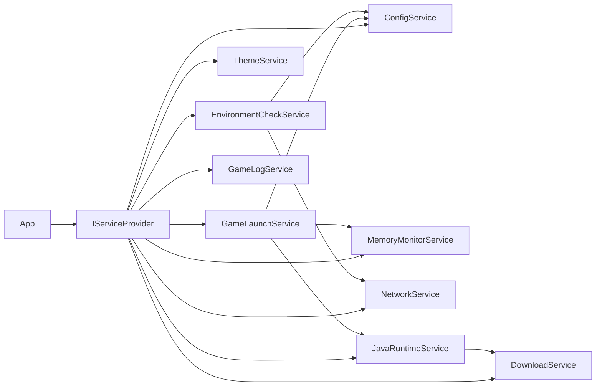

图表来源
- [App.xaml.cs:131-178](file://src/FufuLauncher/App.xaml.cs#L131-L178)
- [GameLaunchService.cs:48-65](file://src/FufuLauncher/Services/GameLaunchService.cs#L48-L65)
- [JavaRuntimeService.cs:76-84](file://src/FufuLauncher/Services/JavaRuntimeService.cs#L76-L84)
- [EnvironmentCheckService.cs:43-50](file://src/FufuLauncher/Services/EnvironmentCheckService.cs#L43-L50)

章节来源
- [App.xaml.cs:131-178](file://src/FufuLauncher/App.xaml.cs#L131-L178)

## 性能考量
- 日志批量写入：应用日志与游戏日志均采用队列+定时器批量落盘，降低 IO 抖动
- 内存监控频率：DispatcherTimer 间隔 3s，降低 P/Invoke 开销
- 下载并发：按类别独立信号量控制，避免互相阻塞；大文件分片提升吞吐
- 进度节流：全局进度事件节流 150ms，减少 UI 重绘压力
- 资源释放：窗口关闭与主题释放及时释放 MediaElement/Image 引用，避免句柄泄漏

[本节为通用指导，无需特定文件引用]

## 故障排查指南
- 未处理异常：应用层捕获 UI 域与 Task 未观察异常，弹窗并记录日志
- 网络异常：环境自检失败时提示用户检查网络
- Java 完整性：启动前校验 java -version，失败则引导下载或修复
- 下载失败：指数退避重试，SHA1 校验失败自动重下一次
- 日志查看：强制刷新缓冲，确保最新内容可读

章节来源
- [App.xaml.cs:180-206](file://src/FufuLauncher/App.xaml.cs#L180-L206)
- [EnvironmentCheckService.cs:151-174](file://src/FufuLauncher/Services/EnvironmentCheckService.cs#L151-L174)
- [GameLaunchService.cs:157-177](file://src/FufuLauncher/Services/GameLaunchService.cs#L157-L177)
- [DownloadService.cs:305-366](file://src/FufuLauncher/Services/DownloadService.cs#L305-L366)
- [GameLogService.cs:168-172](file://src/FufuLauncher/Services/GameLogService.cs#L168-L172)

## 结论
通过 DI 容器统一管理服务生命周期，结合异步初始化与优雅关闭策略，启动器实现了高内聚、低耦合的服务架构。内存监控、下载引擎、Java 运行时与游戏启动等关键模块均具备完善的错误处理与资源释放机制，保障用户体验与系统稳定性。

[本节为总结性内容，无需特定文件引用]

## 附录：完整生命周期示例
以下示例将“定时任务服务、缓存服务与连接池服务”的生命周期管理与本项目的模式对齐，便于移植到实际项目。

- 定时任务服务（类似 MemoryMonitorService）
  - 初始化：在应用启动后创建并注册事件，启动 DispatcherTimer
  - 运行：周期性触发回调，更新内存快照并广播事件
  - 停止：应用退出时 Stop()，释放定时器与事件订阅

- 缓存服务（建议实现 IDisposable）
  - 初始化：按需懒加载，首次访问时创建缓存实例
  - 使用：提供 Get/Set/Remove 接口，内部使用线程安全集合
  - 释放：Dispose 时清空缓存、释放外部资源（如文件句柄）

- 连接池服务（类似 DownloadService 的 HttpClient 管理）
  - 初始化：创建固定大小连接池，设置超时与重试策略
  - 使用：从池中借出连接，使用后归还；异常时回收并重建
  - 释放：应用退出时 CloseAll()，释放底层 Socket/HttpClient

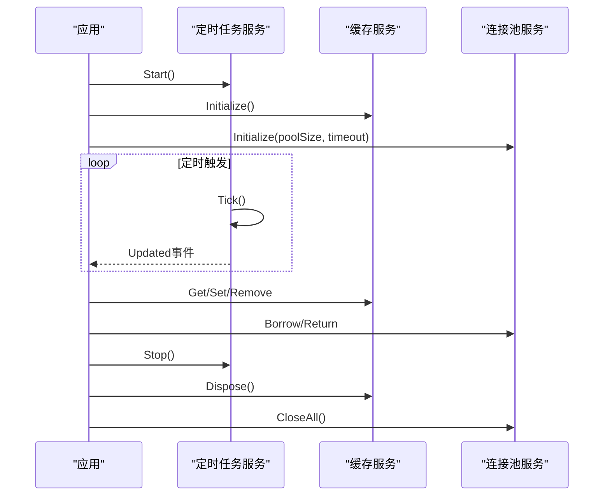

[此图为概念性流程图，不直接映射具体代码文件，故无图表来源]