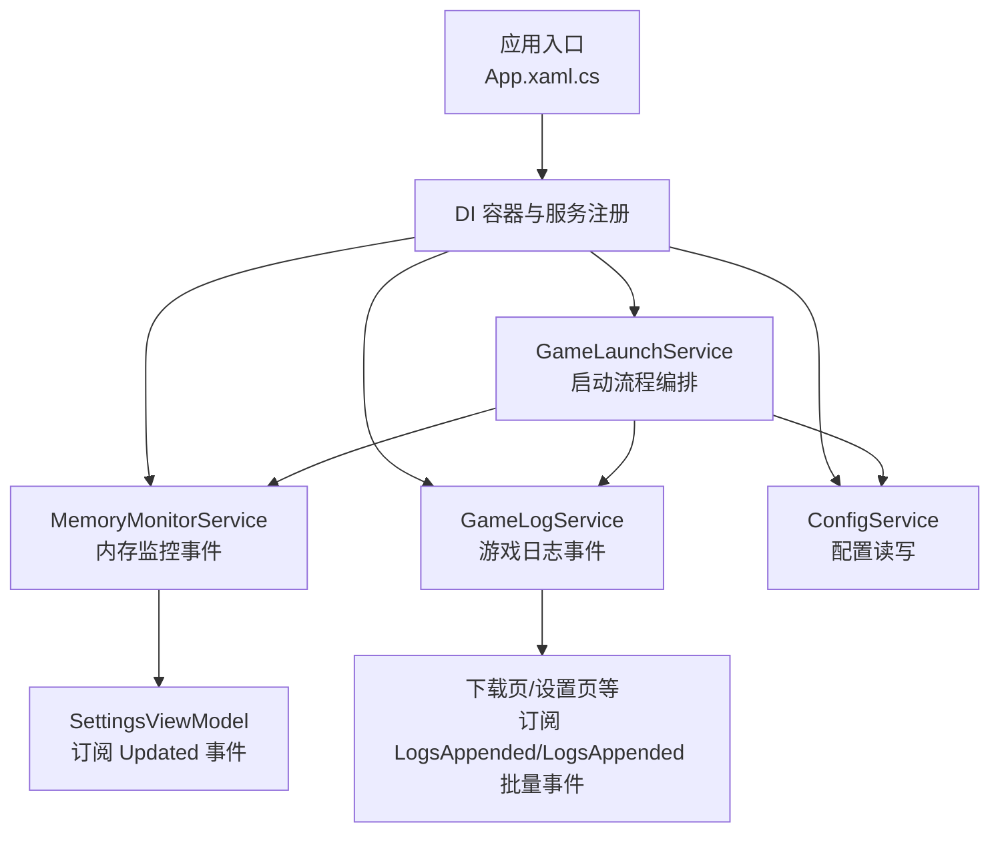
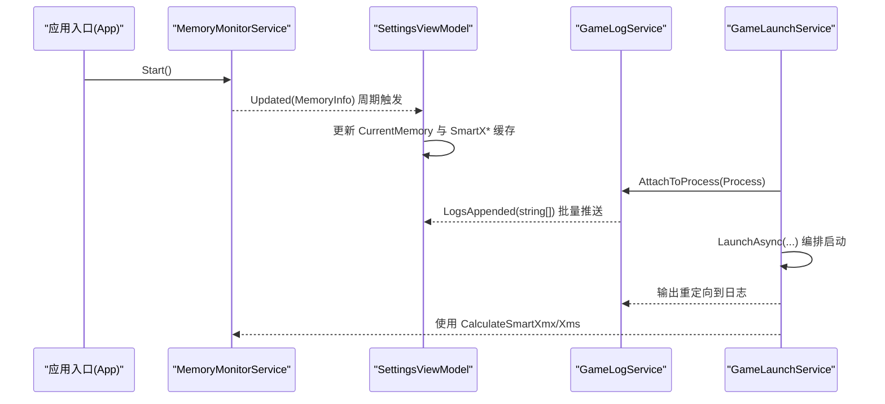
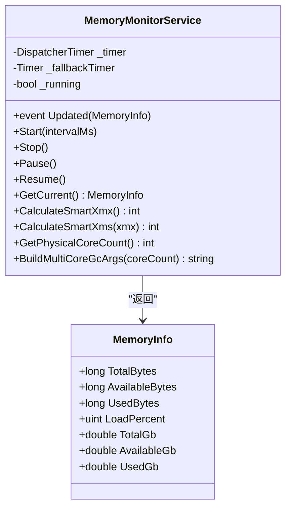
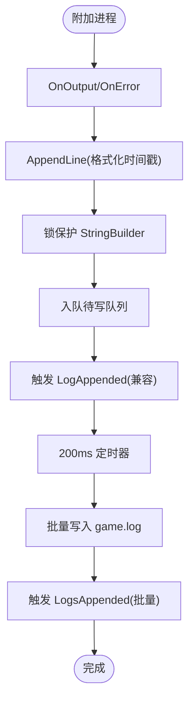
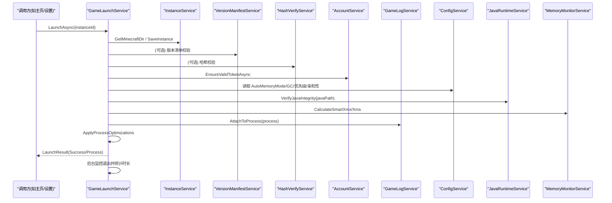
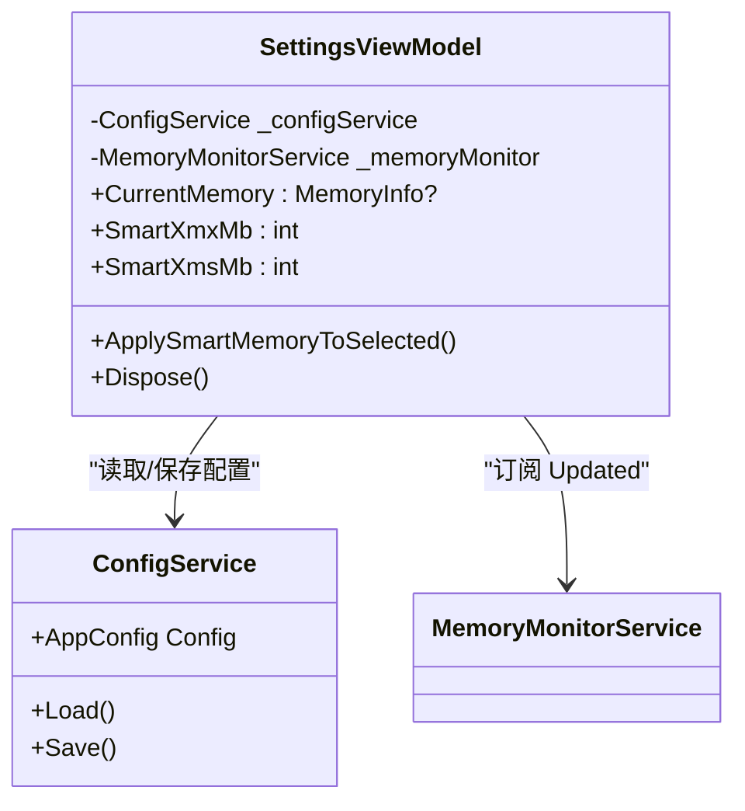
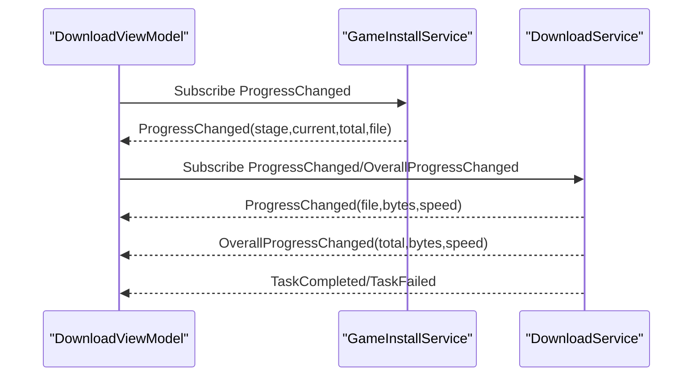
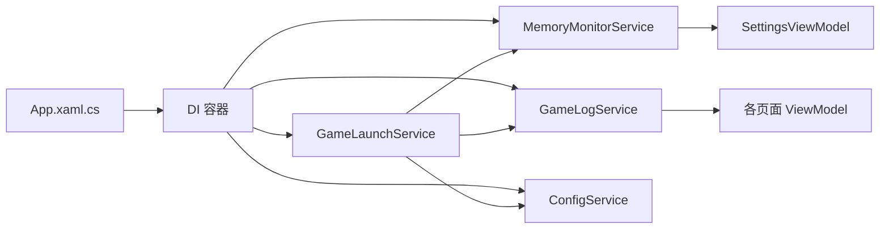

# 服务间通信

<cite>
**本文引用的文件**   
- [App.xaml.cs](file://src/FufuLauncher/App.xaml.cs)
- [MemoryMonitorService.cs](file://src/FufuLauncher/Services/MemoryMonitorService.cs)
- [GameLogService.cs](file://src/FufuLauncher/Services/GameLogService.cs)
- [GameLaunchService.cs](file://src/FufuLauncher/Services/GameLaunchService.cs)
- [ConfigService.cs](file://src/FufuLauncher/Services/ConfigService.cs)
- [SettingsViewModel.cs](file://src/FufuLauncher/ViewModels/SettingsViewModel.cs)
- [DownloadViewModel.cs](file://src/FufuLauncher/ViewModels/DownloadViewModel.cs)
</cite>

## 目录
1. [简介](#简介)
2. [项目结构](#项目结构)
3. [核心组件](#核心组件)
4. [架构总览](#架构总览)
5. [详细组件分析](#详细组件分析)
6. [依赖关系分析](#依赖关系分析)
7. [性能考量](#性能考量)
8. [故障排查指南](#故障排查指南)
9. [结论](#结论)
10. [附录：通信示例与最佳实践](#附录通信示例与最佳实践)

## 简介
本指南聚焦“可爱的芙芙启动器”的服务间通信机制，围绕事件驱动架构、消息传递模式（同步/异步）、解耦设计原则与通信协议选择进行系统化说明。重点覆盖以下场景：
- 自定义事件的定义、订阅与发布模式
- 内存监控事件、日志通知与状态更新的实现模式
- 错误传播与异常处理策略
- 面向 UI 的线程安全与性能优化要点

## 项目结构
启动器采用 WPF + MVVM + DI 的架构，服务层通过 .NET 内置 ServiceCollection 注册为单例，视图模型通过构造函数注入依赖。事件以 Action 委托形式在进程内广播，UI 侧通过订阅事件更新界面。关键入口与生命周期由 App.xaml.cs 管理。

图表来源
- [App.xaml.cs:100-178](file://src/FufuLauncher/App.xaml.cs#L100-L178)
- [MemoryMonitorService.cs:54-88](file://src/FufuLauncher/Services/MemoryMonitorService.cs#L54-L88)
- [GameLogService.cs:41-52](file://src/FufuLauncher/Services/GameLogService.cs#L41-L52)
- [GameLaunchService.cs:48-65](file://src/FufuLauncher/Services/GameLaunchService.cs#L48-L65)
- [ConfigService.cs:94-133](file://src/FufuLauncher/Services/ConfigService.cs#L94-L133)

章节来源
- [App.xaml.cs:75-129](file://src/FufuLauncher/App.xaml.cs#L75-L129)
- [App.xaml.cs:131-178](file://src/FufuLauncher/App.xaml.cs#L131-L178)

## 核心组件
- MemoryMonitorService：定时读取系统内存并触发 Updated 事件，提供智能 Xmx/Xms 计算与多核 GC 参数生成。
- GameLogService：捕获游戏进程 stdout/stderr，批量写入 game.log，并通过 LogsAppended/LogAppended 事件推送。
- GameLaunchService：编排启动流程，校验依赖、拼接 JVM 参数、绑定日志与内存监控、监控进程退出。
- ConfigService：集中管理用户配置，包括自动内存分配、GC 优化、优先级与亲和性等开关。
- SettingsViewModel：订阅内存监控事件，缓存智能推荐值，向 UI 暴露可观察属性。
- DownloadViewModel：订阅安装与下载服务的进度事件，统一刷新 UI。

章节来源
- [MemoryMonitorService.cs:26-88](file://src/FufuLauncher/Services/MemoryMonitorService.cs#L26-L88)
- [GameLogService.cs:22-52](file://src/FufuLauncher/Services/GameLogService.cs#L22-L52)
- [GameLaunchService.cs:35-65](file://src/FufuLauncher/Services/GameLaunchService.cs#L35-L65)
- [ConfigService.cs:13-79](file://src/FufuLauncher/Services/ConfigService.cs#L13-L79)
- [SettingsViewModel.cs:172-200](file://src/FufuLauncher/ViewModels/SettingsViewModel.cs#L172-L200)
- [DownloadViewModel.cs:66-146](file://src/FufuLauncher/ViewModels/DownloadViewModel.cs#L66-L146)

## 架构总览
事件驱动是进程内服务间通信的核心：服务通过 Action 委托暴露事件，订阅方在构造或初始化时订阅，发布者负责在合适时机触发。UI 线程安全由 DispatcherTimer 保证，避免跨线程调用导致的卡顿。

图表来源
- [App.xaml.cs:110-116](file://src/FufuLauncher/App.xaml.cs#L110-L116)
- [MemoryMonitorService.cs:62-88](file://src/FufuLauncher/Services/MemoryMonitorService.cs#L62-L88)
- [SettingsViewModel.cs:186-200](file://src/FufuLauncher/ViewModels/SettingsViewModel.cs#L186-L200)
- [GameLogService.cs:54-65](file://src/FufuLauncher/Services/GameLogService.cs#L54-L65)
- [GameLaunchService.cs:104-193](file://src/FufuLauncher/Services/GameLaunchService.cs#L104-L193)

## 详细组件分析

### 内存监控事件（MemoryMonitorService）
- 事件定义：Updated(Action<MemoryInfo>)，由 DispatcherTimer 在 UI 线程触发，订阅者可直接更新绑定属性。
- 定时器策略：默认 3000ms 间隔，DispatcherPriority.Background；若 UI Dispatcher 不可用则回退到线程池 Timer。
- 智能分配：CalculateSmartXmx/CalculateSmartXms 基于可用内存、预留阈值与上下限对齐到 256MB。
- 多核 GC：BuildMultiCoreGcArgs 根据物理核心数生成 ParallelGCThreads/ConcGCThreads/CICompilerCount。

图表来源
- [MemoryMonitorService.cs:26-55](file://src/FufuLauncher/Services/MemoryMonitorService.cs#L26-L55)
- [MemoryMonitorService.cs:144-213](file://src/FufuLauncher/Services/MemoryMonitorService.cs#L144-L213)
- [MemoryMonitorService.cs:217-227](file://src/FufuLauncher/Services/MemoryMonitorService.cs#L217-L227)

章节来源
- [MemoryMonitorService.cs:54-88](file://src/FufuLauncher/Services/MemoryMonitorService.cs#L54-L88)
- [MemoryMonitorService.cs:130-155](file://src/FufuLauncher/Services/MemoryMonitorService.cs#L130-L155)
- [MemoryMonitorService.cs:175-213](file://src/FufuLauncher/Services/MemoryMonitorService.cs#L175-L213)

### 游戏日志事件（GameLogService）
- 事件定义：LogsAppended(string[]) 批量推送；兼容 LogAppended(string) 单行事件。
- 缓冲策略：StringBuilder 内存缓冲限制最大行数（5000），超出裁剪最早行；待写队列并发入队，200ms 定时器批量写入 game.log。
- 进程绑定：AttachToProcess 订阅 OutputDataReceived/ErrorDataReceived，BeginOutputReadLine 开始读取。
- 强制刷新：FlushNow 供日志查看器打开时立即落盘。

图表来源
- [GameLogService.cs:54-65](file://src/FufuLauncher/Services/GameLogService.cs#L54-L65)
- [GameLogService.cs:99-120](file://src/FufuLauncher/Services/GameLogService.cs#L99-L120)
- [GameLogService.cs:139-166](file://src/FufuLauncher/Services/GameLogService.cs#L139-L166)

章节来源
- [GameLogService.cs:41-52](file://src/FufuLauncher/Services/GameLogService.cs#L41-L52)
- [GameLogService.cs:99-120](file://src/FufuLauncher/Services/GameLogService.cs#L99-L120)
- [GameLogService.cs:139-166](file://src/FufuLauncher/Services/GameLogService.cs#L139-L166)

### 启动编排与事件集成（GameLaunchService）
- 依赖校验：VerifyDependenciesAsync 检查 client.jar 与 libraries 目录。
- 账号令牌：EnsureValidTokenAsync 确保登录态有效。
- Java 完整性：VerifyJavaIntegrity 二次校验 java -version 可执行。
- 智能内存：AutoMemoryMode 开启时调用 MemoryMonitorService.CalculateSmartXmx/Xms。
- 进程优化：ApplyProcessOptimizations 设置优先级与 CPU 亲和性。
- 日志绑定：AttachToProcess 将游戏输出接入 GameLogService。
- 退出监控：后台任务 WaitForExit，统计游玩时长并保存实例。

图表来源
- [GameLaunchService.cs:104-193](file://src/FufuLauncher/Services/GameLaunchService.cs#L104-L193)
- [GameLaunchService.cs:318-358](file://src/FufuLauncher/Services/GameLaunchService.cs#L318-L358)
- [GameLaunchService.cs:280-316](file://src/FufuLauncher/Services/GameLaunchService.cs#L280-L316)

章节来源
- [GameLaunchService.cs:69-101](file://src/FufuLauncher/Services/GameLaunchService.cs#L69-L101)
- [GameLaunchService.cs:104-193](file://src/FufuLauncher/Services/GameLaunchService.cs#L104-L193)
- [GameLaunchService.cs:318-358](file://src/FufuLauncher/Services/GameLaunchService.cs#L318-L358)

### 配置与 UI 联动（ConfigService 与 SettingsViewModel）
- ConfigService：集中管理 AppConfig，包含自动内存、GC 优化、优先级、亲和性等开关。
- SettingsViewModel：订阅 MemoryMonitorService.Updated，缓存 SmartXmx/SartXms，暴露可观察属性给 UI；支持一键应用智能内存到当前实例。

图表来源
- [ConfigService.cs:94-133](file://src/FufuLauncher/Services/ConfigService.cs#L94-L133)
- [SettingsViewModel.cs:172-200](file://src/FufuLauncher/ViewModels/SettingsViewModel.cs#L172-L200)
- [SettingsViewModel.cs:238-245](file://src/FufuLauncher/ViewModels/SettingsViewModel.cs#L238-L245)

章节来源
- [ConfigService.cs:13-79](file://src/FufuLauncher/Services/ConfigService.cs#L13-L79)
- [SettingsViewModel.cs:186-200](file://src/FufuLauncher/ViewModels/SettingsViewModel.cs#L186-L200)
- [SettingsViewModel.cs:238-245](file://src/FufuLauncher/ViewModels/SettingsViewModel.cs#L238-L245)

### 下载与安装事件（DownloadViewModel）
- 订阅安装服务 ProgressChanged，刷新阶段与文件计数。
- 订阅下载服务 ProgressChanged/OverallProgressChanged，刷新子进度条与速度。
- 订阅 TaskCompleted/TaskFailed，反馈单文件结果。

图表来源
- [DownloadViewModel.cs:78-146](file://src/FufuLauncher/ViewModels/DownloadViewModel.cs#L78-L146)

章节来源
- [DownloadViewModel.cs:78-146](file://src/FufuLauncher/ViewModels/DownloadViewModel.cs#L78-L146)

## 依赖关系分析
- 服务间耦合度低：通过 DI 注入与事件解耦，UI 仅订阅事件，不直接调用服务内部逻辑。
- 事件总线模式：Action 委托作为轻量级进程内事件总线，避免引入额外中间件。
- 线程模型：UI 线程优先（DispatcherTimer），后台任务使用 Task.Run 与 Timer，避免阻塞 UI。

图表来源
- [App.xaml.cs:131-178](file://src/FufuLauncher/App.xaml.cs#L131-L178)
- [MemoryMonitorService.cs:54-88](file://src/FufuLauncher/Services/MemoryMonitorService.cs#L54-L88)
- [GameLogService.cs:41-52](file://src/FufuLauncher/Services/GameLogService.cs#L41-L52)
- [GameLaunchService.cs:48-65](file://src/FufuLauncher/Services/GameLaunchService.cs#L48-L65)
- [ConfigService.cs:94-133](file://src/FufuLauncher/Services/ConfigService.cs#L94-L133)

章节来源
- [App.xaml.cs:131-178](file://src/FufuLauncher/App.xaml.cs#L131-L178)

## 性能考量
- 内存监控：DispatcherTimer Background 优先级，降低对 UI 交互抢占；3000ms 刷新频率减少 P/Invoke 开销。
- 日志写入：200ms 批量合并写入，避免逐行 IO；内存缓冲上限 5000 行防止膨胀。
- 智能内存：计算结果缓存于 ViewModel，避免每次 INPC 触发重复 P/Invoke。
- 全局日志：ConcurrentQueue + Timer 批量落盘 app.log，减少频繁文件操作。

[本节为通用指导，不直接分析具体文件]

## 故障排查指南
- 未处理异常捕获：App 层统一捕获 DispatcherUnhandledException、Domain UnhandledException、Task UnobservedTaskException，记录日志并弹窗提示。
- 内存监控异常：RaiseUpdatedSafe 捕获异常并记录到 app.log，避免崩溃。
- 日志写入失败：GameLogService 批量写入 catch 异常并记录，不影响主流程。
- 启动失败：GameLaunchService 返回 LaunchResult，包含 Success/ErrorMessage，UI 展示并引导修复。

章节来源
- [App.xaml.cs:180-206](file://src/FufuLauncher/App.xaml.cs#L180-L206)
- [MemoryMonitorService.cs:130-141](file://src/FufuLauncher/Services/MemoryMonitorService.cs#L130-L141)
- [GameLogService.cs:152-166](file://src/FufuLauncher/Services/GameLogService.cs#L152-L166)
- [GameLaunchService.cs:104-120](file://src/FufuLauncher/Services/GameLaunchService.cs#L104-L120)

## 结论
本项目以事件驱动为核心，结合 DI 与 MVVM，实现了高内聚、低耦合的服务间通信。通过 DispatcherTimer 保障 UI 线程安全，批量 IO 与缓存策略提升性能。错误处理贯穿全链路，确保稳定性与可观测性。该模式易于扩展，新增服务只需暴露事件并在 DI 中注册即可被订阅。

[本节为总结，不直接分析具体文件]

## 附录：通信示例与最佳实践

### 事件驱动架构的实现要点
- 自定义事件：使用 Action<T> 定义事件，T 为轻量数据对象（如 MemoryInfo、string[]）。
- 订阅模式：在 ViewModel 构造中订阅，必要时在 Dispose 中退订。
- 发布模式：在服务内部合适时机触发，注意线程切换（UI 线程优先）。

章节来源
- [MemoryMonitorService.cs:54-88](file://src/FufuLauncher/Services/MemoryMonitorService.cs#L54-L88)
- [SettingsViewModel.cs:186-200](file://src/FufuLauncher/ViewModels/SettingsViewModel.cs#L186-L200)

### 消息传递模式（同步/异步）
- 同步：方法调用（如 GetCurrent、VerifyDependenciesAsync 的同步封装）。
- 异步：Task 与事件组合（如 LaunchAsync、下载/安装进度事件）。

章节来源
- [GameLaunchService.cs:104-193](file://src/FufuLauncher/Services/GameLaunchService.cs#L104-L193)
- [DownloadViewModel.cs:78-146](file://src/FufuLauncher/ViewModels/DownloadViewModel.cs#L78-L146)

### 服务间解耦设计与通信协议选择
- 进程内通信：Action 委托事件，零依赖、高性能。
- 解耦原则：服务只暴露必要事件与方法，UI 通过订阅更新，不感知内部实现。
- 协议选择：WPF 环境下优先使用 UI 线程安全的 DispatcherTimer 与事件。

章节来源
- [App.xaml.cs:131-178](file://src/FufuLauncher/App.xaml.cs#L131-L178)
- [MemoryMonitorService.cs:62-88](file://src/FufuLauncher/Services/MemoryMonitorService.cs#L62-L88)

### 错误传播与异常处理
- 全局异常：App 层统一捕获并记录。
- 局部异常：服务内部 try-catch 记录日志，避免崩溃。
- 启动失败：返回明确错误信息，UI 提示用户。

章节来源
- [App.xaml.cs:180-206](file://src/FufuLauncher/App.xaml.cs#L180-L206)
- [GameLaunchService.cs:312-316](file://src/FufuLauncher/Services/GameLaunchService.cs#L312-L316)

### 完整通信示例
- 内存监控事件：MemoryMonitorService.Updated → SettingsViewModel.CurrentMemory 更新。
- 日志通知：GameLogService.LogsAppended → UI 批量显示最新日志。
- 状态更新：DownloadViewModel 订阅下载/安装事件，刷新进度与状态文本。

章节来源
- [MemoryMonitorService.cs:54-88](file://src/FufuLauncher/Services/MemoryMonitorService.cs#L54-L88)
- [GameLogService.cs:41-52](file://src/FufuLauncher/Services/GameLogService.cs#L41-L52)
- [DownloadViewModel.cs:78-146](file://src/FufuLauncher/ViewModels/DownloadViewModel.cs#L78-L146)