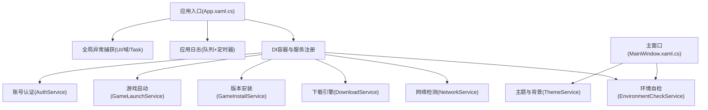
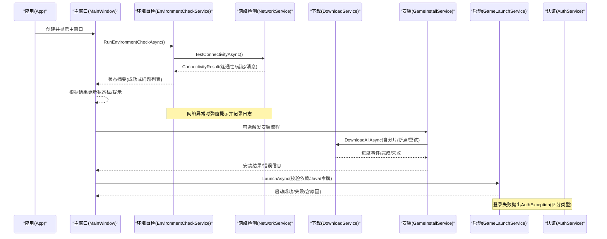
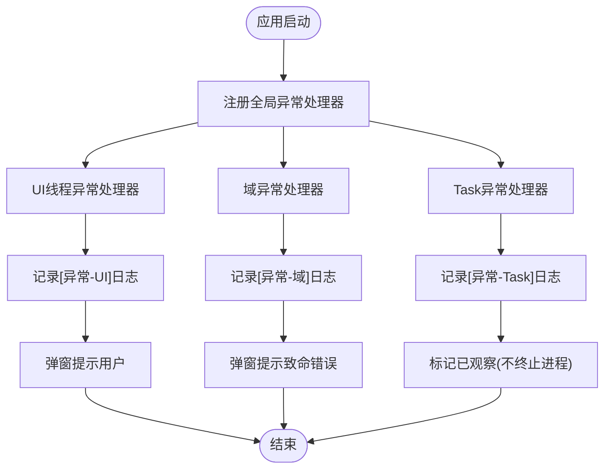
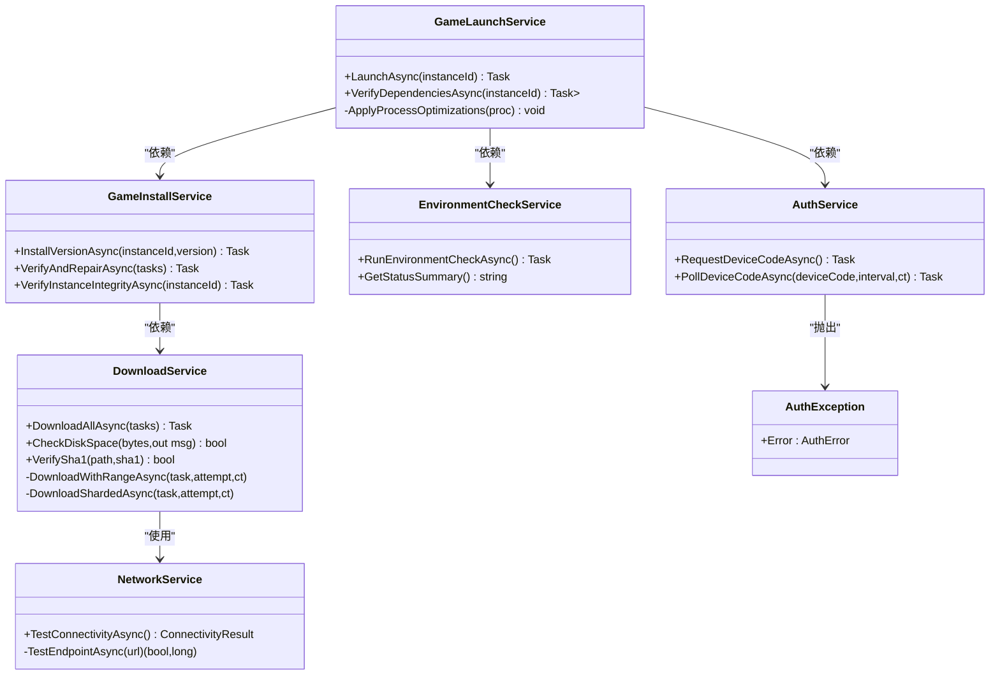
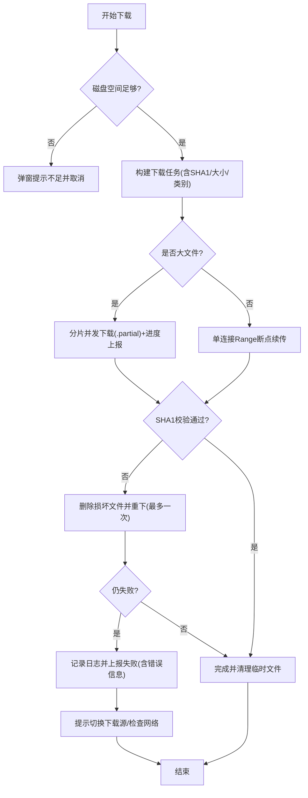
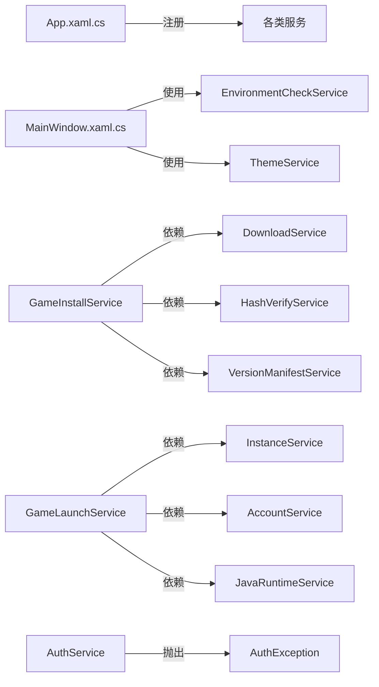

# 错误处理策略

<cite>
**本文引用的文件**   
- [App.xaml.cs](file://src/FufuLauncher/App.xaml.cs)
- [MainWindow.xaml.cs](file://src/FufuLauncher/MainWindow.xaml.cs)
- [NetworkService.cs](file://src/FufuLauncher/Services/NetworkService.cs)
- [DownloadService.cs](file://src/FufuLauncher/Services/DownloadService.cs)
- [GameLaunchService.cs](file://src/FufuLauncher/Services/GameLaunchService.cs)
- [EnvironmentCheckService.cs](file://src/FufuLauncher/Services/EnvironmentCheckService.cs)
- [GameInstallService.cs](file://src/FufuLauncher/Services/GameInstallService.cs)
- [AuthService.cs](file://src/FufuLauncher/Services/AuthService.cs)
</cite>

## 目录
1. [简介](#简介)
2. [项目结构](#项目结构)
3. [核心组件](#核心组件)
4. [架构总览](#架构总览)
5. [详细组件分析](#详细组件分析)
6. [依赖关系分析](#依赖关系分析)
7. [性能考虑](#性能考虑)
8. [故障排查指南](#故障排查指南)
9. [结论](#结论)
10. [附录](#附录)

## 简介
本指南聚焦“可爱的芙芙启动器”的错误处理策略，覆盖全局异常捕获（UI线程、域异常、Task异常）、服务层异常分类与处理（可恢复与致命）、日志分级与异步写入优化、用户友好的错误提示与恢复机制，并给出网络请求失败、文件操作异常、系统资源不足等完整示例模式。目标是帮助开发者与使用者快速定位问题、提升稳定性与用户体验。

## 项目结构
- 应用入口与全局异常捕获集中在 App.xaml.cs，负责统一日志、全局异常钩子与 DI 容器初始化。
- UI 主窗口 MainWindow.xaml.cs 在加载时执行环境自检，并对异常进行友好提示。
- 服务层按职责划分：网络、下载、安装、游戏启动、环境检查、账号认证等，各自实现领域内错误分类与恢复策略。
- 日志采用队列+定时刷盘方式，避免高频同步 IO 阻塞调用线程。

**图示来源** 
- [App.xaml.cs:75-117](file://src/FufuLauncher/App.xaml.cs#L75-L117)
- [MainWindow.xaml.cs:38-73](file://src/FufuLauncher/MainWindow.xaml.cs#L38-L73)

**章节来源**
- [App.xaml.cs:75-117](file://src/FufuLauncher/App.xaml.cs#L75-L117)
- [MainWindow.xaml.cs:38-73](file://src/FufuLauncher/MainWindow.xaml.cs#L38-L73)

## 核心组件
- 全局异常捕获：
  - UI线程异常：DispatcherUnhandledException 捕获并弹窗，记录日志，标记已处理防止崩溃。
  - 域异常：AppDomain.CurrentDomain.UnhandledException 捕获致命异常，记录日志并弹窗。
  - Task异常：UnobservedTaskException 捕获未观察的后台任务异常，记录日志并标记已观察阻止进程终止。
- 日志系统：
  - 使用 ConcurrentQueue 缓冲 + Timer 周期落盘，避免频繁同步 IO；提供读取接口并在读取前强制刷新。
- 服务层错误分类：
  - 可恢复异常：网络抖动、临时IO失败、校验失败重试等，通过指数退避、源切换、断点续传、自动修复等手段恢复。
  - 致命异常：系统架构不支持、Java完整性失败且用户拒绝继续、磁盘空间严重不足等，直接提示并中止流程。

**章节来源**
- [App.xaml.cs:180-206](file://src/FufuLauncher/App.xaml.cs#L180-L206)
- [App.xaml.cs:33-73](file://src/FufuLauncher/App.xaml.cs#L33-L73)

## 架构总览
下图展示从应用启动到各服务交互的关键路径与错误处理节点。

**图示来源** 
- [MainWindow.xaml.cs:38-73](file://src/FufuLauncher/MainWindow.xaml.cs#L38-L73)
- [EnvironmentCheckService.cs:52-73](file://src/FufuLauncher/Services/EnvironmentCheckService.cs#L52-L73)
- [NetworkService.cs:34-76](file://src/FufuLauncher/Services/NetworkService.cs#L34-L76)
- [DownloadService.cs:222-261](file://src/FufuLauncher/Services/DownloadService.cs#L222-L261)
- [GameInstallService.cs:83-120](file://src/FufuLauncher/Services/GameInstallService.cs#L83-L120)
- [GameLaunchService.cs:104-155](file://src/FufuLauncher/Services/GameLaunchService.cs#L104-L155)
- [AuthService.cs:158-192](file://src/FufuLauncher/Services/AuthService.cs#L158-L192)

## 详细组件分析

### 全局异常捕获与日志
- UI线程异常：
  - 捕获 DispatcherUnhandledException，记录日志并弹出用户友好对话框，设置 Handled=true 避免崩溃。
- 域异常：
  - 捕获 UnhandledException，记录致命异常并弹窗提示。
- Task异常：
  - 捕获 UnobservedTaskException，记录日志并标记已观察，避免进程终止。
- 日志写入：
  - WriteAppLog 入队，Timer 周期性 FlushAppLogQueue 批量写入 app.log，读取前强制刷新确保最新。

**图示来源** 
- [App.xaml.cs:180-206](file://src/FufuLauncher/App.xaml.cs#L180-L206)
- [App.xaml.cs:33-73](file://src/FufuLauncher/App.xaml.cs#L33-L73)

**章节来源**
- [App.xaml.cs:180-206](file://src/FufuLauncher/App.xaml.cs#L180-L206)
- [App.xaml.cs:33-73](file://src/FufuLauncher/App.xaml.cs#L33-L73)

### 服务层异常分类与处理策略
- 可恢复异常：
  - 网络请求失败：NetworkService 对两端点分别尝试，返回连通性与延迟；DownloadService 支持指数退避重试、源切换（Mojang→BMCLAPI）、断点续传、SHA1校验失败重下。
  - 文件操作异常：DownloadService 删除损坏文件后重新下载；GameInstallService 校验并自动修复缺失/损坏文件。
  - 令牌交换失败：AuthService 抛出 AuthException，携带具体错误类型（网络、设备码过期、令牌交换失败等），供上层区分处理。
- 致命异常：
  - 系统架构不支持：EnvironmentCheckService 检测到32位系统直接弹窗并中止。
  - Java完整性失败：GameLaunchService 校验失败且用户拒绝继续则中止启动。
  - 磁盘空间不足：DownloadService 在下载前检查剩余空间，不足则提示并取消。

**图示来源** 
- [NetworkService.cs:18-94](file://src/FufuLauncher/Services/NetworkService.cs#L18-L94)
- [DownloadService.cs:56-114](file://src/FufuLauncher/Services/DownloadService.cs#L56-L114)
- [GameInstallService.cs:50-80](file://src/FufuLauncher/Services/GameInstallService.cs#L50-L80)
- [GameLaunchService.cs:35-65](file://src/FufuLauncher/Services/GameLaunchService.cs#L35-L65)
- [EnvironmentCheckService.cs:35-50](file://src/FufuLauncher/Services/EnvironmentCheckService.cs#L35-L50)
- [AuthService.cs:42-48](file://src/FufuLauncher/Services/AuthService.cs#L42-L48)

**章节来源**
- [NetworkService.cs:34-76](file://src/FufuLauncher/Services/NetworkService.cs#L34-L76)
- [DownloadService.cs:222-261](file://src/FufuLauncher/Services/DownloadService.cs#L222-L261)
- [GameInstallService.cs:289-323](file://src/FufuLauncher/Services/GameInstallService.cs#L289-L323)
- [GameLaunchService.cs:104-155](file://src/FufuLauncher/Services/GameLaunchService.cs#L104-L155)
- [EnvironmentCheckService.cs:98-117](file://src/FufuLauncher/Services/EnvironmentCheckService.cs#L98-L117)
- [AuthService.cs:158-192](file://src/FufuLauncher/Services/AuthService.cs#L158-L192)

### 用户友好的错误提示与恢复机制
- 环境自检失败：
  - 网络不通时弹窗提示检查网络；未发现 Java 时引导前往 Java 运行时页面下载。
- 下载失败：
  - 磁盘空间不足弹窗说明所需空间；失败任务记录日志并提示切换下载源重试。
- 启动失败：
  - 依赖缺失弹窗列出问题；Java 完整性失败弹窗询问是否继续或取消。
- 登录失败：
  - 区分网络异常、设备码过期、令牌交换失败等，提示用户采取对应操作（如重新登录、切换网络）。

**章节来源**
- [EnvironmentCheckService.cs:151-174](file://src/FufuLauncher/Services/EnvironmentCheckService.cs#L151-L174)
- [DownloadService.cs:264-293](file://src/FufuLauncher/Services/DownloadService.cs#L264-L293)
- [GameLaunchService.cs:112-155](file://src/FufuLauncher/Services/GameLaunchService.cs#L112-L155)
- [AuthService.cs:158-192](file://src/FufuLauncher/Services/AuthService.cs#L158-L192)

### 完整错误处理示例模式
- 网络请求失败：
  - NetworkService 分别测试官方源与镜像源，返回连通性与延迟；若均不可用，提示检查网络。
  - DownloadService 在请求失败时指数退避重试，必要时切换到 BMCLAPI 镜像源。
- 文件操作异常：
  - DownloadService 删除损坏文件后重下；GameInstallService 校验并自动修复缺失/损坏文件。
- 系统资源不足：
  - DownloadService.CheckDiskSpace 检查剩余空间，不足则弹窗提示并取消下载。
  - EnvironmentCheckService 检查磁盘空间，低于阈值则报告问题。

**图示来源** 
- [DownloadService.cs:222-261](file://src/FufuLauncher/Services/DownloadService.cs#L222-L261)
- [DownloadService.cs:295-366](file://src/FufuLauncher/Services/DownloadService.cs#L295-L366)
- [DownloadService.cs:368-451](file://src/FufuLauncher/Services/DownloadService.cs#L368-L451)
- [DownloadService.cs:453-547](file://src/FufuLauncher/Services/DownloadService.cs#L453-L547)
- [DownloadService.cs:584-590](file://src/FufuLauncher/Services/DownloadService.cs#L584-L590)

**章节来源**
- [DownloadService.cs:222-261](file://src/FufuLauncher/Services/DownloadService.cs#L222-L261)
- [DownloadService.cs:295-366](file://src/FufuLauncher/Services/DownloadService.cs#L295-L366)
- [DownloadService.cs:368-451](file://src/FufuLauncher/Services/DownloadService.cs#L368-L451)
- [DownloadService.cs:453-547](file://src/FufuLauncher/Services/DownloadService.cs#L453-L547)
- [DownloadService.cs:584-590](file://src/FufuLauncher/Services/DownloadService.cs#L584-L590)

## 依赖关系分析
- App.xaml.cs 作为入口，注册所有服务并绑定全局异常处理器。
- MainWindow.xaml.cs 依赖 EnvironmentCheckService 和 ThemeService，在加载时执行自检与主题应用。
- GameInstallService 依赖 VersionManifestService、DownloadService、HashVerifyService、InstanceService、JavaRuntimeService。
- GameLaunchService 依赖 InstanceService、VersionManifestService、HashVerifyService、AccountService、GameLogService、ConfigService、JavaRuntimeService、MemoryMonitorService。
- AuthService 独立处理微软账号登录链路，抛出 AuthException 供上层区分处理。

**图示来源** 
- [App.xaml.cs:131-178](file://src/FufuLauncher/App.xaml.cs#L131-L178)
- [MainWindow.xaml.cs:28-36](file://src/FufuLauncher/MainWindow.xaml.cs#L28-L36)
- [GameInstallService.cs:69-80](file://src/FufuLauncher/Services/GameInstallService.cs#L69-L80)
- [GameLaunchService.cs:48-65](file://src/FufuLauncher/Services/GameLaunchService.cs#L48-L65)
- [AuthService.cs:42-48](file://src/FufuLauncher/Services/AuthService.cs#L42-L48)

**章节来源**
- [App.xaml.cs:131-178](file://src/FufuLauncher/App.xaml.cs#L131-L178)
- [MainWindow.xaml.cs:28-36](file://src/FufuLauncher/MainWindow.xaml.cs#L28-L36)
- [GameInstallService.cs:69-80](file://src/FufuLauncher/Services/GameInstallService.cs#L69-L80)
- [GameLaunchService.cs:48-65](file://src/FufuLauncher/Services/GameLaunchService.cs#L48-L65)
- [AuthService.cs:42-48](file://src/FufuLauncher/Services/AuthService.cs#L42-L48)

## 性能考虑
- 日志异步写入：ConcurrentQueue 缓冲 + Timer 批量落盘，减少同步 IO 开销；读取前强制刷新保证一致性。
- 下载节流：整体进度事件每 150ms 触发一次，避免 UI 卡顿；单文件进度每 200ms 上报一次。
- 并发控制：按任务类别使用独立 SemaphoreSlim，互不阻塞；大文件分片并发下载提升吞吐。
- 超时保护：HttpClient 总超时 5 分钟，单次请求首字节超时 30 秒，防止卡死。

**章节来源**
- [App.xaml.cs:33-73](file://src/FufuLauncher/App.xaml.cs#L33-L73)
- [DownloadService.cs:116-169](file://src/FufuLauncher/Services/DownloadService.cs#L116-L169)
- [DownloadService.cs:428-451](file://src/FufuLauncher/Services/DownloadService.cs#L428-L451)
- [DownloadService.cs:499-547](file://src/FufuLauncher/Services/DownloadService.cs#L499-L547)

## 故障排查指南
- 查看应用日志：
  - 使用 ReadAppLog 获取 app.log 全文，启动/退出/异常均有记录。
- 常见问题定位：
  - 网络异常：检查 NetworkService 测试结果与提示；尝试切换下载源。
  - 下载失败：查看 DownloadService 的任务失败日志与错误信息；确认磁盘空间与网络。
  - 启动失败：检查 GameLaunchService 的依赖校验与 Java 完整性提示；确认 Java 路径与完整性。
  - 登录失败：根据 AuthException 的错误类型采取对应措施（重新登录、检查网络、更换设备码）。

**章节来源**
- [App.xaml.cs:63-73](file://src/FufuLauncher/App.xaml.cs#L63-L73)
- [EnvironmentCheckService.cs:151-174](file://src/FufuLauncher/Services/EnvironmentCheckService.cs#L151-L174)
- [DownloadService.cs:264-293](file://src/FufuLauncher/Services/DownloadService.cs#L264-L293)
- [GameLaunchService.cs:112-155](file://src/FufuLauncher/Services/GameLaunchService.cs#L112-L155)
- [AuthService.cs:158-192](file://src/FufuLauncher/Services/AuthService.cs#L158-L192)

## 结论
该启动器的错误处理体系以全局异常捕获为兜底，服务层按领域细化异常分类与恢复策略，结合异步日志与用户友好提示，形成稳定、可恢复、易诊断的健壮性保障。建议在实际使用中遵循本文的模式与最佳实践，持续优化异常体验与系统稳定性。

## 附录
- 关键错误类型参考：
  - AuthError：网络、未购买MC、用户取消、设备码过期、令牌交换失败、未知。
  - DownloadStatus：待下载、下载中、暂停、校验中、完成、失败、取消。
  - 环境检查结果：.NET运行时、系统架构、磁盘空间、网络、Java扫描。

**章节来源**
- [AuthService.cs:32-40](file://src/FufuLauncher/Services/AuthService.cs#L32-L40)
- [DownloadService.cs:44-45](file://src/FufuLauncher/Services/DownloadService.cs#L44-L45)
- [EnvironmentCheckService.cs:19-33](file://src/FufuLauncher/Services/EnvironmentCheckService.cs#L19-L33)