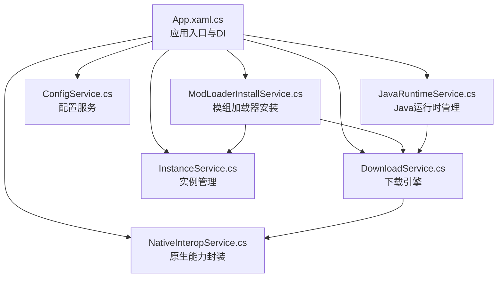
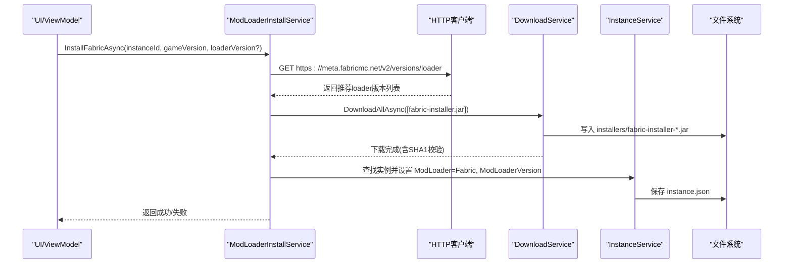
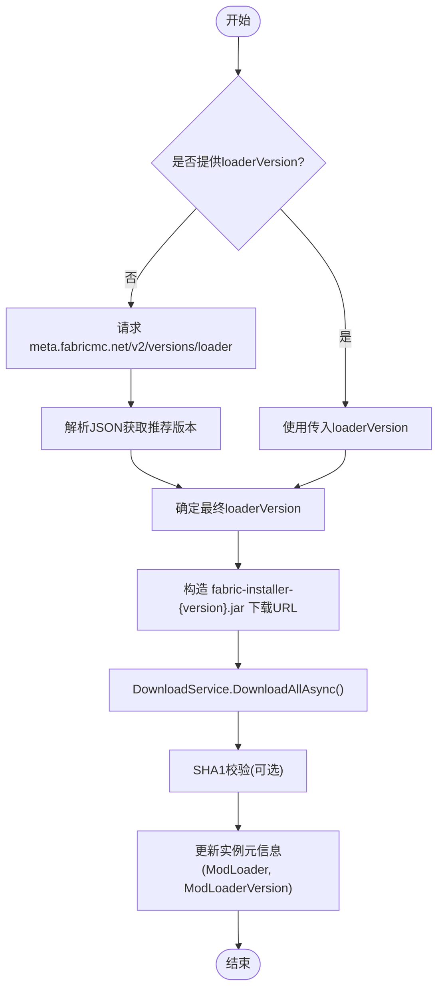
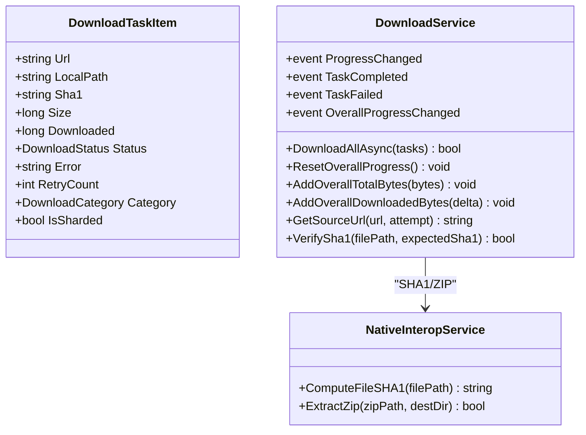
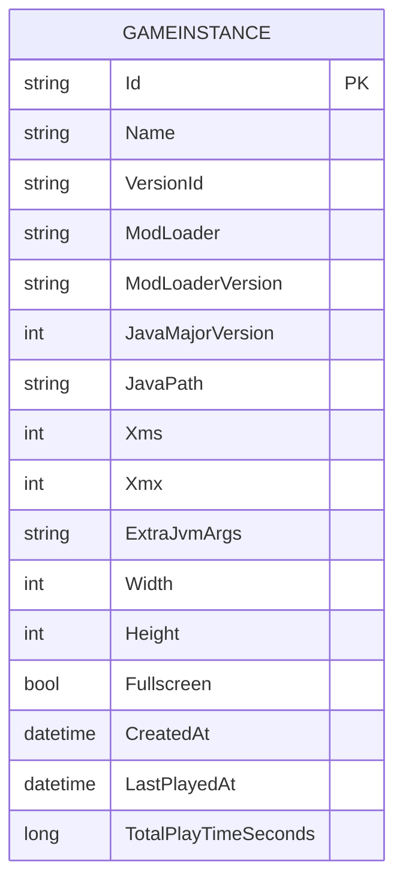
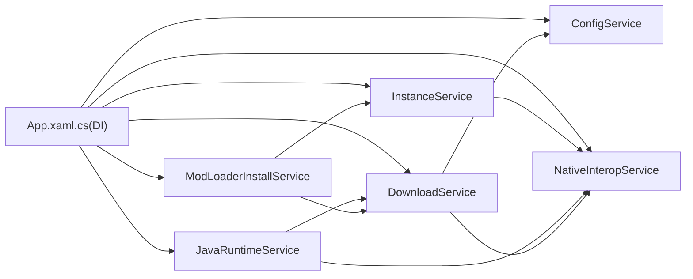

# Fabric 集成实现

<cite>
**本文引用的文件**   
- [ModLoaderInstallService.cs](file://src/FufuLauncher/Services/ModLoaderInstallService.cs)
- [InstanceService.cs](file://src/FufuLauncher/Services/InstanceService.cs)
- [DownloadService.cs](file://src/FufuLauncher/Services/DownloadService.cs)
- [ConfigService.cs](file://src/FufuLauncher/Services/ConfigService.cs)
- [JavaRuntimeService.cs](file://src/FufuLauncher/Services/JavaRuntimeService.cs)
- [NativeInteropService.cs](file://src/FufuLauncher/Services/NativeInteropService.cs)
- [App.xaml.cs](file://src/FufuLauncher/App.xaml.cs)
- [README.md](file://README.md)
</cite>

## 目录
1. [简介](#简介)
2. [项目结构](#项目结构)
3. [核心组件](#核心组件)
4. [架构总览](#架构总览)
5. [详细组件分析](#详细组件分析)
6. [依赖关系分析](#依赖关系分析)
7. [性能考量](#性能考量)
8. [故障排除指南](#故障排除指南)
9. [结论](#结论)
10. [附录](#附录)

## 简介
本文件面向“Fabric 模组加载器”的集成与安装，覆盖以下目标：
- 通过 meta.fabricmc.net API 获取推荐版本、下载 fabric-installer.jar 并执行安装流程。
- 解释 Fabric 的版本管理机制与中间件系统（Intermediary）工作原理。
- 记录 Fabric 相关配置选项与实例设置。
- 提供完整的异步下载与进度监控示例路径。
- 说明与 InstanceService 的数据交互与状态同步机制。
- 汇总常见问题与排错方法。

## 项目结构
本项目为 C# WPF 启动器，采用服务层划分职责，关键服务包括：
- ModLoaderInstallService：模组加载器（Fabric/Forge/Quilt）安装编排。
- DownloadService：多线程分片断点续传下载引擎，支持官方源与镜像源切换、SHA1 校验、失败重试。
- InstanceService：多隔离实例管理，维护每个实例的元数据与目录结构。
- ConfigService：用户配置持久化（下载源、Java 镜像、JVM 参数等）。
- JavaRuntimeService：完整 JDK 下载与管理（Adoptium/华为云镜像）。
- NativeInteropService：C++ 原生 DLL 封装（哈希、ZIP），具备托管 fallback。
- App.xaml.cs：应用入口、DI 容器初始化、全局异常处理与日志缓冲。

图表来源
- [App.xaml.cs:99-178](file://src/FufuLauncher/App.xaml.cs#L99-L178)
- [ModLoaderInstallService.cs:15-27](file://src/FufuLauncher/Services/ModLoaderInstallService.cs#L15-L27)
- [DownloadService.cs:56-114](file://src/FufuLauncher/Services/DownloadService.cs#L56-L114)
- [InstanceService.cs:51-70](file://src/FufuLauncher/Services/InstanceService.cs#L51-L70)
- [ConfigService.cs:81-92](file://src/FufuLauncher/Services/ConfigService.cs#L81-L92)
- [JavaRuntimeService.cs:50-84](file://src/FufuLauncher/Services/JavaRuntimeService.cs#L50-L84)
- [NativeInteropService.cs:20-35](file://src/FufuLauncher/Services/NativeInteropService.cs#L20-L35)

章节来源
- [App.xaml.cs:75-117](file://src/FufuLauncher/App.xaml.cs#L75-L117)
- [README.md:34-53](file://README.md#L34-L53)

## 核心组件
- ModLoaderInstallService：负责 Fabric/Forge/Quilt 的安装编排，当前以 Fabric 为例，调用 meta.fabricmc.net 获取推荐 loader 版本，下载 fabric-installer.jar，并将结果写入实例元信息。
- DownloadService：提供高并发、分片、断点续传、双进度（单任务+全局）、自动重试与 SHA1 校验、官方源与 BMCLAPI 镜像切换。
- InstanceService：维护实例列表与元数据（Id、Name、VersionId、ModLoader、ModLoaderVersion、JavaMajorVersion、内存与分辨率等），并提供创建、复制、导出、导入等操作。
- ConfigService：集中管理下载源、Java 镜像、JVM 参数、界面主题与背景等配置项。
- JavaRuntimeService：按主版本下载完整 JDK（Adoptium/华为云镜像），解压并定位 java.exe。
- NativeInteropService：提供高性能 SHA1/SHA256 计算与 ZIP 操作，缺失 DLL 时回退到托管实现。

章节来源
- [ModLoaderInstallService.cs:15-86](file://src/FufuLauncher/Services/ModLoaderInstallService.cs#L15-L86)
- [DownloadService.cs:28-114](file://src/FufuLauncher/Services/DownloadService.cs#L28-L114)
- [InstanceService.cs:27-116](file://src/FufuLauncher/Services/InstanceService.cs#L27-L116)
- [ConfigService.cs:13-48](file://src/FufuLauncher/Services/ConfigService.cs#L13-L48)
- [JavaRuntimeService.cs:26-84](file://src/FufuLauncher/Services/JavaRuntimeService.cs#L26-L84)
- [NativeInteropService.cs:20-55](file://src/FufuLauncher/Services/NativeInteropService.cs#L20-L55)

## 架构总览
下图展示了 Fabric 安装的核心调用链与数据流：从 UI 触发安装，到 ModLoaderInstallService 拉取版本、下载安装器、更新实例元数据；下载由 DownloadService 统一调度，必要时使用 NativeInteropService 进行校验或解压。

图表来源
- [ModLoaderInstallService.cs:44-86](file://src/FufuLauncher/Services/ModLoaderInstallService.cs#L44-L86)
- [DownloadService.cs:222-261](file://src/FufuLauncher/Services/DownloadService.cs#L222-L261)
- [InstanceService.cs:118-123](file://src/FufuLauncher/Services/InstanceService.cs#L118-L123)

## 详细组件分析

### Fabric 安装流程与版本管理
- 版本获取：当未指定 loaderVersion 时，调用 meta.fabricmc.net/v2/versions/loader 获取推荐版本列表，取第一个作为默认 loader 版本。
- 安装器下载：根据 loaderVersion 构造 maven.fabricmc.net 的 fabric-installer-{version}.jar URL，通过 DownloadService 下载至 {AppDataDir}/installers。
- 安装执行：当前实现为简化版，仅记录元信息到实例（ModLoader=Fabric, ModLoaderVersion=xxx）。生产环境应调用 java -jar fabric-installer.jar 执行实际安装。
- 中间件系统（Intermediary）：Fabric 通过 Intermediary 映射 Minecraft 内部类名，使模组在不同版本间保持兼容。该字段随版本清单返回，用于后续构建运行环境。

图表来源
- [ModLoaderInstallService.cs:44-86](file://src/FufuLauncher/Services/ModLoaderInstallService.cs#L44-L86)

章节来源
- [ModLoaderInstallService.cs:30-86](file://src/FufuLauncher/Services/ModLoaderInstallService.cs#L30-L86)

### 下载引擎与进度监控
- 并发与分片：按类别独立信号量控制并发（Game/Asset/Java/Mod），大文件（>=8MB）启用 Range 分片并发下载，小文件单连接断点续传。
- 断点续传：使用 .partial 临时文件记录已下载字节数，支持中断后继续。
- 双进度：单任务 ProgressChanged 事件 + 全局 OverallProgressChanged 事件，节流 150ms 提升视觉平滑度。
- 失败重试：指数退避（1s, 2s, 4s...），最多 MaxRetry 次；SHA1 校验失败自动重下一次。
- 镜像切换：GetSourceUrl/GetSourceUrl(originalUrl, attempt) 支持 Mojang/BMCLAPI 切换，失败时自动降级国内镜像。

图表来源
- [DownloadService.cs:28-114](file://src/FufuLauncher/Services/DownloadService.cs#L28-L114)
- [NativeInteropService.cs:38-55](file://src/FufuLauncher/Services/NativeInteropService.cs#L38-L55)

章节来源
- [DownloadService.cs:222-366](file://src/FufuLauncher/Services/DownloadService.cs#L222-L366)
- [DownloadService.cs:369-547](file://src/FufuLauncher/Services/DownloadService.cs#L369-L547)

### 实例管理与状态同步
- 实例元数据：包含 Id、Name、VersionId、ModLoader、ModLoaderVersion、JavaMajorVersion、Xms/Xmx、ExtraJvmArgs、分辨率与全屏等。
- 目录结构：每个实例独立 .minecraft、mods、resourcepacks、shaderpacks、options.txt、instance.json。
- 状态同步：ModLoaderInstallService 在 Fabric 安装成功后更新实例的 ModLoader 与 ModLoaderVersion，并通过 SaveInstance 持久化到 instance.json。

图表来源
- [InstanceService.cs:27-49](file://src/FufuLauncher/Services/InstanceService.cs#L27-L49)

章节来源
- [InstanceService.cs:72-123](file://src/FufuLauncher/Services/InstanceService.cs#L72-L123)
- [ModLoaderInstallService.cs:73-80](file://src/FufuLauncher/Services/ModLoaderInstallService.cs#L73-L80)

### 配置与实例设置
- 下载源：ConfigService.Config.DownloadSource 支持 Mojang/BMCLAPI，影响 DownloadService.GetSourceUrl 行为。
- Java 镜像：ConfigService.Config.JavaDownloadMirror 支持 Official/Huaweicloud，影响 JavaRuntimeService 的 JDK 下载源。
- JVM 参数：Xms/Xmx/ExtraJvmArgs 可配置于实例或全局配置，供启动器传递至 Java 进程。
- 其他：主题、分辨率、全屏、背景视频/图片等。

章节来源
- [ConfigService.cs:13-48](file://src/FufuLauncher/Services/ConfigService.cs#L13-L48)
- [InstanceService.cs:34-48](file://src/FufuLauncher/Services/InstanceService.cs#L34-L48)

### 与 Java 运行时的交互
- GameInstallService 在安装游戏时会记录版本所需的 Java 主版本号到实例，并在完成后尝试自动下载匹配的 JDK（失败不阻塞）。
- JavaRuntimeService 支持按主版本下载完整 JDK，解压后定位 java.exe，并支持列出本地已安装的运行时。

章节来源
- [GameInstallService.cs:109-116](file://src/FufuLauncher/Services/GameInstallService.cs#L109-L116)
- [JavaRuntimeService.cs:199-277](file://src/FufuLauncher/Services/JavaRuntimeService.cs#L199-L277)

## 依赖关系分析
- ModLoaderInstallService 依赖 DownloadService 与 InstanceService，通过 HTTP 客户端访问 Fabric Meta API。
- DownloadService 依赖 ConfigService（下载源策略）与 NativeInteropService（SHA1/ZIP）。
- JavaRuntimeService 依赖 DownloadService（下载 JDK zip）与 NativeInteropService（解压）。
- InstanceService 依赖 NativeInteropService（导出 ZIP 备份）。
- App.xaml.cs 通过 DI 容器注册所有服务，确保生命周期与依赖注入正确。

图表来源
- [App.xaml.cs:131-178](file://src/FufuLauncher/App.xaml.cs#L131-L178)
- [ModLoaderInstallService.cs:15-27](file://src/FufuLauncher/Services/ModLoaderInstallService.cs#L15-L27)
- [DownloadService.cs:56-114](file://src/FufuLauncher/Services/DownloadService.cs#L56-L114)
- [JavaRuntimeService.cs:50-84](file://src/FufuLauncher/Services/JavaRuntimeService.cs#L50-L84)
- [InstanceService.cs:61-70](file://src/FufuLauncher/Services/InstanceService.cs#L61-L70)

章节来源
- [App.xaml.cs:131-178](file://src/FufuLauncher/App.xaml.cs#L131-L178)

## 性能考量
- 下载并发与分片：按类别独立信号量避免相互阻塞；大文件分片提升吞吐，小文件单连接降低开销。
- 断点续传与幂等：.partial 文件与 SHA1 校验保证中断恢复与重复安装不浪费带宽。
- 进度节流：整体进度事件节流 150ms，减少 UI 刷新压力。
- 镜像降级：官方源失败自动切换到 BMCLAPI，提高稳定性。
- 原生加速：SHA1/ZIP 优先使用 C++ 原生实现，失败回退托管实现，兼顾性能与可用性。

[本节为通用指导，无需代码引用]

## 故障排除指南
- 网络问题：
  - 现象：下载失败、超时、无法获取版本 JSON。
  - 排查：检查网络连通性；切换下载源（Mojang/BMCLAPI）；查看 DownloadService 的 GetSourceUrl 降级逻辑。
  - 参考：[DownloadService.cs:172-210](file://src/FufuLauncher/Services/DownloadService.cs#L172-L210)
- 磁盘空间不足：
  - 现象：下载前提示空间不足。
  - 排查：清理磁盘或更换盘符；CheckDiskSpace 预留 1GB 缓冲。
  - 参考：[DownloadService.cs:264-293](file://src/FufuLauncher/Services/DownloadService.cs#L264-L293)
- SHA1 校验失败：
  - 现象：下载完成后校验失败，自动重下一次。
  - 排查：确认源文件完整性；检查网络波动；查看日志输出。
  - 参考：[DownloadService.cs:319-334](file://src/FufuLauncher/Services/DownloadService.cs#L319-L334)
- Fabric 安装器下载成功但未执行：
  - 现状：当前实现仅记录元信息，未调用 java -jar 执行安装。
  - 建议：在生产环境补充执行逻辑，确保 fabric-installer.jar 可用且 Java 环境匹配。
  - 参考：[ModLoaderInstallService.cs:71-80](file://src/FufuLauncher/Services/ModLoaderInstallService.cs#L71-L80)
- Java 运行时缺失或不匹配：
  - 现象：启动失败或提示需要特定主版本。
  - 排查：使用 JavaRuntimeService 下载对应 JDK；检查实例的 JavaMajorVersion 与 JavaPath。
  - 参考：[JavaRuntimeService.cs:199-277](file://src/FufuLauncher/Services/JavaRuntimeService.cs#L199-L277)
- 实例元数据不同步：
  - 现象：ModLoader/ModLoaderVersion 未更新。
  - 排查：确认 SaveInstance 被调用；检查 instance.json 是否写入成功。
  - 参考：[InstanceService.cs:118-123](file://src/FufuLauncher/Services/InstanceService.cs#L118-L123)

章节来源
- [DownloadService.cs:264-334](file://src/FufuLauncher/Services/DownloadService.cs#L264-L334)
- [ModLoaderInstallService.cs:71-80](file://src/FufuLauncher/Services/ModLoaderInstallService.cs#L71-L80)
- [JavaRuntimeService.cs:199-277](file://src/FufuLauncher/Services/JavaRuntimeService.cs#L199-L277)
- [InstanceService.cs:118-123](file://src/FufuLauncher/Services/InstanceService.cs#L118-L123)

## 结论
本项目通过清晰的服务分层与强大的下载引擎，实现了 Fabric 模组加载器的自动化安装与实例管理。结合 meta.fabricmc.net API 与镜像源切换策略，提供了稳定高效的安装体验。未来可在 ModLoaderInstallService 中补充 fabric-installer.jar 的实际执行逻辑，完善端到端安装闭环。

[本节为总结，无需代码引用]

## 附录

### 完整安装示例（路径指引）
- 获取推荐版本：参见 [ModLoaderInstallService.cs:44-57](file://src/FufuLauncher/Services/ModLoaderInstallService.cs#L44-L57)
- 下载安装器：参见 [ModLoaderInstallService.cs:59-69](file://src/FufuLauncher/Services/ModLoaderInstallService.cs#L59-L69)
- 更新实例元信息：参见 [ModLoaderInstallService.cs:73-80](file://src/FufuLauncher/Services/ModLoaderInstallService.cs#L73-L80)
- 下载进度监控：参见 [DownloadService.cs:85-90](file://src/FufuLauncher/Services/DownloadService.cs#L85-L90)
- 全局总进度：参见 [DownloadService.cs:117-132](file://src/FufuLauncher/Services/DownloadService.cs#L117-L132)

章节来源
- [ModLoaderInstallService.cs:44-80](file://src/FufuLauncher/Services/ModLoaderInstallService.cs#L44-L80)
- [DownloadService.cs:85-132](file://src/FufuLauncher/Services/DownloadService.cs#L85-L132)