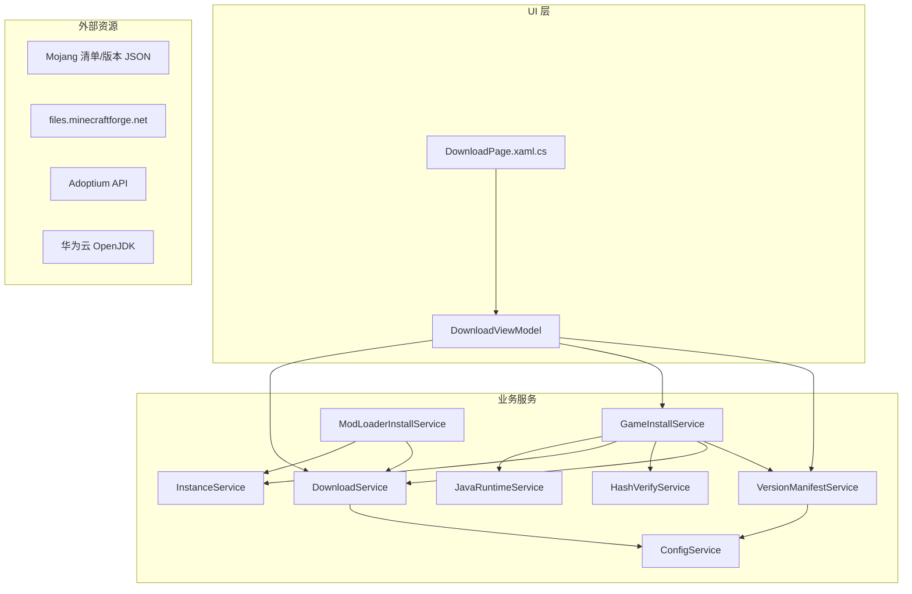
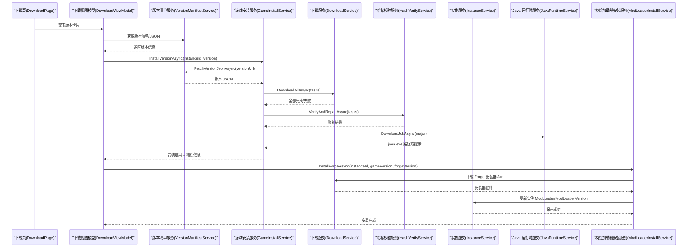
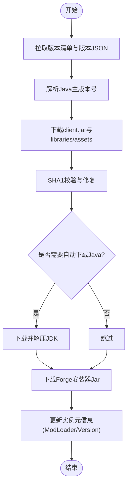
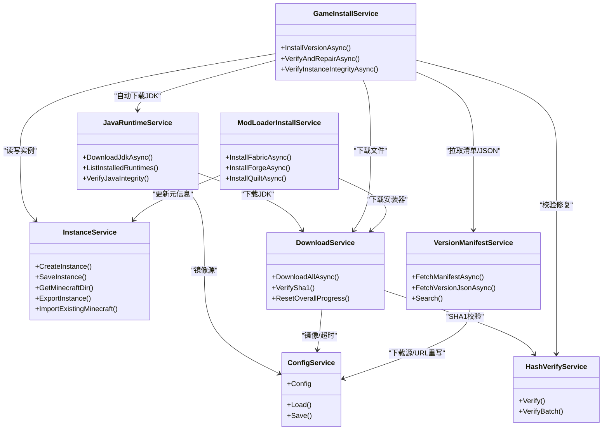

# Forge 集成实现

<cite>
**本文引用的文件**   
- [ModLoaderInstallService.cs](file://src/FufuLauncher/Services/ModLoaderInstallService.cs)
- [GameInstallService.cs](file://src/FufuLauncher/Services/GameInstallService.cs)
- [InstanceService.cs](file://src/FufuLauncher/Services/InstanceService.cs)
- [VersionManifestService.cs](file://src/FufuLauncher/Services/VersionManifestService.cs)
- [DownloadService.cs](file://src/FufuLauncher/Services/DownloadService.cs)
- [JavaRuntimeService.cs](file://src/FufuLauncher/Services/JavaRuntimeService.cs)
- [HashVerifyService.cs](file://src/FufuLauncher/Services/HashVerifyService.cs)
- [ConfigService.cs](file://src/FufuLauncher/Services/ConfigService.cs)
- [DownloadViewModel.cs](file://src/FufuLauncher/ViewModels/DownloadViewModel.cs)
- [DownloadPage.xaml.cs](file://src/FufuLauncher/Views/DownloadPage.xaml.cs)
- [README.md](file://README.md)
</cite>

## 目录
1. [简介](#简介)
2. [项目结构](#项目结构)
3. [核心组件](#核心组件)
4. [架构总览](#架构总览)
5. [详细组件分析](#详细组件分析)
6. [依赖关系分析](#依赖关系分析)
7. [性能考量](#性能考量)
8. [故障排查指南](#故障排查指南)
9. [结论](#结论)
10. [附录](#附录)

## 简介
本文件面向“可爱的芙芙”启动器中的 Forge 模组加载器集成，提供从安装到配置、与实例服务集成、数据持久化以及常见问题的完整说明。当前仓库已实现多模组加载器（Forge / Fabric / Quilt）的一键安装骨架：下载官方安装器 Jar 并记录到实例元信息中；实际执行安装器 Jar 的调用在后续扩展点预留。文档同时覆盖版本选择策略、兼容性检查机制、配置文件格式与目录结构要求，并提供完整的代码级参考路径与流程图，便于二次开发与问题定位。

## 项目结构
- 服务层（Services）负责网络、下载、校验、实例管理、Java 运行时管理与模组加载器安装等能力。
- 视图模型（ViewModels）与页面（Views）负责用户交互与进度反馈。
- 原生库（native\FufuNative）提供哈希计算与 ZIP 解压等高性能操作。
- 配置（ConfigService）集中管理下载源、镜像、JVM 参数等设置。

图表来源 
- [DownloadViewModel.cs](file://src/FufuLauncher/ViewModels/DownloadViewModel.cs)
- [DownloadPage.xaml.cs](file://src/FufuLauncher/Views/DownloadPage.xaml.cs)
- [VersionManifestService.cs](file://src/FufuLauncher/Services/VersionManifestService.cs)
- [GameInstallService.cs](file://src/FufuLauncher/Services/GameInstallService.cs)
- [DownloadService.cs](file://src/FufuLauncher/Services/DownloadService.cs)
- [HashVerifyService.cs](file://src/FufuLauncher/Services/HashVerifyService.cs)
- [InstanceService.cs](file://src/FufuLauncher/Services/InstanceService.cs)
- [JavaRuntimeService.cs](file://src/FufuLauncher/Services/JavaRuntimeService.cs)
- [ModLoaderInstallService.cs](file://src/FufuLauncher/Services/ModLoaderInstallService.cs)
- [ConfigService.cs](file://src/FufuLauncher/Services/ConfigService.cs)

章节来源
- [README.md](file://README.md)

## 核心组件
- ModLoaderInstallService：封装 Forge / Fabric / Quilt 的安装流程，当前实现为下载官方安装器 Jar 并更新实例元信息（ModLoader、ModLoaderVersion）。
- GameInstallService：游戏版本安装主流程，包含拉取版本 JSON、下载 client.jar、libraries、assets、校验修复、自动下载匹配的 Java 运行时。
- InstanceService：实例生命周期与目录结构管理，维护 .minecraft、mods、resourcepacks、shaderpacks、options.txt、instance.json 等。
- VersionManifestService：拉取并缓存 Mojang 版本清单，支持 BMCLAPI/Mojang 双源切换与 URL 重写。
- DownloadService：多线程分片断点续传下载引擎，支持 SHA1 校验、失败重试、全局/单文件进度事件。
- JavaRuntimeService：按主版本下载并解压 JDK，支持 Adoptium 官方与华为云镜像，提供本地运行库扫描与完整性校验。
- HashVerifyService：基于原生 DLL 的 SHA1 校验与批量修复建议。
- ConfigService：集中存储下载源、Java 镜像、JVM 参数、分辨率等配置。

章节来源
- [ModLoaderInstallService.cs](file://src/FufuLauncher/Services/ModLoaderInstallService.cs)
- [GameInstallService.cs](file://src/FufuLauncher/Services/GameInstallService.cs)
- [InstanceService.cs](file://src/FufuLauncher/Services/InstanceService.cs)
- [VersionManifestService.cs](file://src/FufuLauncher/Services/VersionManifestService.cs)
- [DownloadService.cs](file://src/FufuLauncher/Services/DownloadService.cs)
- [JavaRuntimeService.cs](file://src/FufuLauncher/Services/JavaRuntimeService.cs)
- [HashVerifyService.cs](file://src/FufuLauncher/Services/HashVerifyService.cs)
- [ConfigService.cs](file://src/FufuLauncher/Services/ConfigService.cs)

## 架构总览
下图展示 Forge 安装的关键调用链与数据流：UI 触发 → 版本清单 → 游戏安装 → 下载与校验 → 实例元信息更新 → 可选 Java 运行时安装。

图表来源 
- [DownloadPage.xaml.cs](file://src/FufuLauncher/Views/DownloadPage.xaml.cs)
- [DownloadViewModel.cs](file://src/FufuLauncher/ViewModels/DownloadViewModel.cs)
- [VersionManifestService.cs](file://src/FufuLauncher/Services/VersionManifestService.cs)
- [GameInstallService.cs](file://src/FufuLauncher/Services/GameInstallService.cs)
- [DownloadService.cs](file://src/FufuLauncher/Services/DownloadService.cs)
- [HashVerifyService.cs](file://src/FufuLauncher/Services/HashVerifyService.cs)
- [InstanceService.cs](file://src/FufuLauncher/Services/InstanceService.cs)
- [JavaRuntimeService.cs](file://src/FufuLauncher/Services/JavaRuntimeService.cs)
- [ModLoaderInstallService.cs](file://src/FufuLauncher/Services/ModLoaderInstallService.cs)

## 详细组件分析

### Forge 安装流程与版本选择
- 版本选择策略
  - 通过 VersionManifestService 拉取 Mojang 版本清单，支持 Release/Snapshot/Old Beta/Old Alpha 分类与关键词搜索。
  - 下载源优先 BMCLAPI，失败回退 Mojang，且对清单与版本 JSON 的 URL 进行统一重写，保证国内访问稳定性。
- 兼容性检查机制
  - 版本 JSON 中包含 JavaVersion.MajorVersion，GameInstallService 据此自动匹配并尝试下载对应主版本的 JDK。
  - 库过滤规则依据 MojangLibrary.Rules 判断是否适用于当前操作系统（如 windows），避免无关库下载。
- Forge 安装步骤（当前实现）
  - 构造 Forge 安装器 Jar 下载地址（files.minecraftforge.net），使用 DownloadService 下载至 installers 目录。
  - 将实例的 ModLoader 与 ModLoaderVersion 写入 instance.json，供后续启动器读取。
  - 实际执行安装器 Jar 的调用在后续扩展点预留（生产环境应调用 java -jar 安装器以生成 Forge 所需文件）。

图表来源 
- [VersionManifestService.cs](file://src/FufuLauncher/Services/VersionManifestService.cs)
- [GameInstallService.cs](file://src/FufuLauncher/Services/GameInstallService.cs)
- [DownloadService.cs](file://src/FufuLauncher/Services/DownloadService.cs)
- [ModLoaderInstallService.cs](file://src/FufuLauncher/Services/ModLoaderInstallService.cs)
- [InstanceService.cs](file://src/FufuLauncher/Services/InstanceService.cs)

章节来源
- [VersionManifestService.cs](file://src/FufuLauncher/Services/VersionManifestService.cs)
- [GameInstallService.cs](file://src/FufuLauncher/Services/GameInstallService.cs)
- [ModLoaderInstallService.cs](file://src/FufuLauncher/Services/ModLoaderInstallService.cs)

### 实例服务与目录结构
- 实例根目录位于 {AppDataDir}\instances\{InstanceId}\
- 标准子目录：
  - .minecraft：游戏根目录（versions、libraries、assets、options.txt 等）
  - mods：模组文件
  - resourcepacks：资源包
  - shaderpacks：光影包
  - saves：存档（可与 .minecraft\saves 共用）
  - instance.json：实例元信息（名称、版本、模组加载器、Java 路径、内存、分辨率等）
- 支持创建、复制、删除、导出 zip 备份、导入已有 .minecraft 目录。

章节来源
- [InstanceService.cs](file://src/FufuLauncher/Services/InstanceService.cs)

### 下载与校验机制
- 多线程分片断点续传：大文件（≥8MB）自动分片并发下载，小文件单连接 Range 续传。
- 失败重试：指数退避，默认 3 次；SHA1 校验失败自动重下一次。
- 全局与单文件进度：OverallProgressChanged 与 ProgressChanged 事件驱动 UI 显示速度与百分比。
- 下载源切换：根据配置在 Mojang/BMCLAPI 之间切换，并在重试时强制降级到 BMCLAPI。

章节来源
- [DownloadService.cs](file://src/FufuLauncher/Services/DownloadService.cs)
- [HashVerifyService.cs](file://src/FufuLauncher/Services/HashVerifyService.cs)

### Java 运行时管理
- 支持多主版本（8~24）完整 JDK 下载与解压，目录约定 runtimes/jdk-{major}-{arch}。
- 镜像源：Official（Adoptium API）与 Huaweicloud（华为云 OpenJDK），可动态解析最新版本。
- 完整性校验：java -version 输出检测，失败则标记不完整。

章节来源
- [JavaRuntimeService.cs](file://src/FufuLauncher/Services/JavaRuntimeService.cs)

### 配置与持久化
- 配置项包括主题、下载源、Java 路径与版本、JVM 参数、分辨率、背景、微软账号登录、Java 镜像、GC 优化、内存分配、视频背景等。
- 配置文件位置 {AppDataDir}\config.json，支持旧字段迁移。

章节来源
- [ConfigService.cs](file://src/FufuLauncher/Services/ConfigService.cs)

### UI 交互与进度反馈
- 下载页 ViewModel 订阅安装服务与下载服务的进度事件，实时更新状态文本、子进度条与速度。
- 安装完成后弹窗提示 Java 自动下载结果与引导。

章节来源
- [DownloadViewModel.cs](file://src/FufuLauncher/ViewModels/DownloadViewModel.cs)
- [DownloadPage.xaml.cs](file://src/FufuLauncher/Views/DownloadPage.xaml.cs)

## 依赖关系分析
- ModLoaderInstallService 依赖 DownloadService 与 InstanceService。
- GameInstallService 依赖 VersionManifestService、DownloadService、HashVerifyService、InstanceService、JavaRuntimeService。
- VersionManifestService 依赖 NetworkService 与 ConfigService，URL 重写遵循同一规则。
- DownloadService 依赖 ConfigService 与 NativeInteropService（SHA1 计算）。
- JavaRuntimeService 依赖 DownloadService、ConfigService、NativeInteropService（ZIP 解压）。

图表来源 
- [ModLoaderInstallService.cs](file://src/FufuLauncher/Services/ModLoaderInstallService.cs)
- [GameInstallService.cs](file://src/FufuLauncher/Services/GameInstallService.cs)
- [InstanceService.cs](file://src/FufuLauncher/Services/InstanceService.cs)
- [VersionManifestService.cs](file://src/FufuLauncher/Services/VersionManifestService.cs)
- [DownloadService.cs](file://src/FufuLauncher/Services/DownloadService.cs)
- [JavaRuntimeService.cs](file://src/FufuLauncher/Services/JavaRuntimeService.cs)
- [HashVerifyService.cs](file://src/FufuLauncher/Services/HashVerifyService.cs)
- [ConfigService.cs](file://src/FufuLauncher/Services/ConfigService.cs)

## 性能考量
- 下载性能：大文件分片并发下载（默认阈值 8MB，分片数 4），单连接 Range 续传，提升吞吐与稳定性。
- 进度刷新节流：全局总进度每 150ms 刷新一次，避免 UI 卡顿。
- 网络容错：短超时（清单 8s，请求首字节 30s）快速失败并回退镜像源。
- 磁盘空间预检：下载前检查剩余空间并预留 1GB 缓冲，降低中断概率。

[本节为通用指导，不直接分析具体文件]

## 故障排查指南
- 无法拉取版本清单
  - 现象：LastError 非空，提示首选/回退源均失败。
  - 处理：切换下载源（BMCLAPI/Mojang），确认网络连通性。
- 下载失败或进度卡住
  - 现象：TaskFailed 事件触发，或 OverallProgressChanged 长时间无变化。
  - 处理：检查磁盘空间、网络限速、代理设置；必要时暂停后继续。
- SHA1 校验失败
  - 现象：VerifySha1 返回 false，自动重下一次仍失败。
  - 处理：清理损坏文件，更换镜像源或关闭杀毒软件实时扫描。
- Java 自动下载失败
  - 现象：JavaAutoDownloadHint 非空，提示前往「Java 运行库」手动下载。
  - 处理：切换 Java 镜像（Huaweicloud/Official），或手动安装指定主版本 JDK。
- Forge 安装器下载失败
  - 现象：InstallForgeAsync 返回 false。
  - 处理：确认 files.minecraftforge.net 可达，检查防火墙/代理；重试或切换网络。

章节来源
- [VersionManifestService.cs](file://src/FufuLauncher/Services/VersionManifestService.cs)
- [DownloadService.cs](file://src/FufuLauncher/Services/DownloadService.cs)
- [GameInstallService.cs](file://src/FufuLauncher/Services/GameInstallService.cs)
- [ModLoaderInstallService.cs](file://src/FufuLauncher/Services/ModLoaderInstallService.cs)
- [JavaRuntimeService.cs](file://src/FufuLauncher/Services/JavaRuntimeService.cs)

## 结论
本项目已具备 Forge 模组加载器的基础集成能力：版本清单拉取、游戏文件下载与校验、Java 运行时自动安装、实例元信息更新。下一步可在 ModLoaderInstallService 中补充实际执行 Forge 安装器 Jar 的逻辑，以自动生成 Forge 所需的运行时文件与配置。整体架构清晰、模块化良好，便于扩展其他模组加载器与增强用户体验。

[本节为总结，不直接分析具体文件]

## 附录

### 安装流程与代码示例（参考路径）
- 下载并安装游戏版本
  - 入口：DownloadViewModel.DownloadAndInstallAsync
  - 核心：GameInstallService.InstallVersionAsync
  - 下载：DownloadService.DownloadAllAsync
  - 校验：HashVerifyService.Verify / VerifyBatch
  - Java：JavaRuntimeService.DownloadJdkAsync
- 安装 Forge
  - 入口：ModLoaderInstallService.InstallForgeAsync
  - 下载安装器：DownloadService.DownloadAllAsync
  - 更新实例：InstanceService.SaveInstance（写入 ModLoader/ModLoaderVersion）

章节来源
- [DownloadViewModel.cs](file://src/FufuLauncher/ViewModels/DownloadViewModel.cs)
- [GameInstallService.cs](file://src/FufuLauncher/Services/GameInstallService.cs)
- [DownloadService.cs](file://src/FufuLauncher/Services/DownloadService.cs)
- [HashVerifyService.cs](file://src/FufuLauncher/Services/HashVerifyService.cs)
- [JavaRuntimeService.cs](file://src/FufuLauncher/Services/JavaRuntimeService.cs)
- [ModLoaderInstallService.cs](file://src/FufuLauncher/Services/ModLoaderInstallService.cs)
- [InstanceService.cs](file://src/FufuLauncher/Services/InstanceService.cs)

### 配置文件与目录结构要点
- 配置文件：{AppDataDir}\config.json（下载源、Java 镜像、JVM 参数、分辨率、背景等）
- 实例目录：{AppDataDir}\instances\{InstanceId}\
  - .minecraft：versions、libraries、assets、options.txt
  - mods、resourcepacks、shaderpacks、saves
  - instance.json：实例元信息（含 ModLoader、ModLoaderVersion、JavaPath、Xms/Xmx、Width/Height 等）

章节来源
- [ConfigService.cs](file://src/FufuLauncher/Services/ConfigService.cs)
- [InstanceService.cs](file://src/FufuLauncher/Services/InstanceService.cs)

### 常见问题速查
- 网络问题：切换下载源（BMCLAPI/Mojang），检查代理与 DNS。
- 磁盘不足：清理临时文件（.partial）、释放空间后再试。
- Java 不匹配：按版本 JSON 要求的 MajorVersion 安装对应 JDK。
- Forge 安装器不可达：确认域名可达，必要时更换网络环境。

[本节为通用指导，不直接分析具体文件]