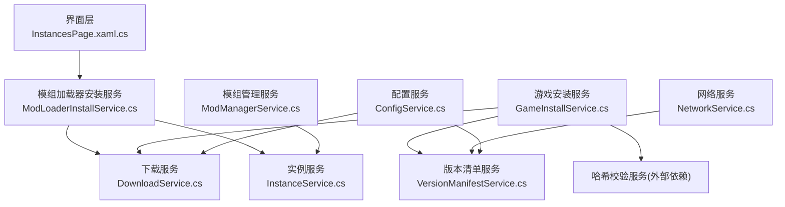
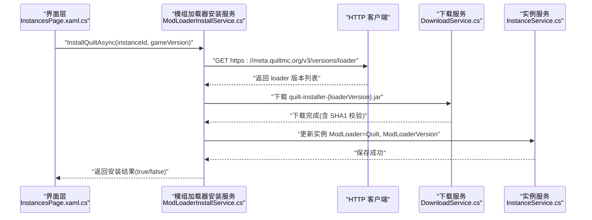
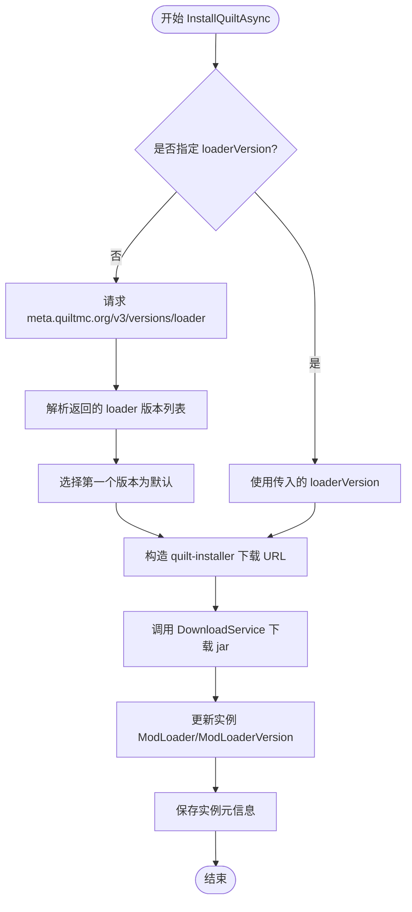
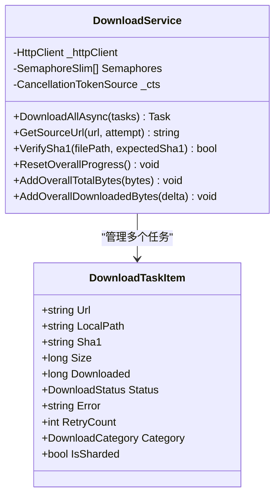
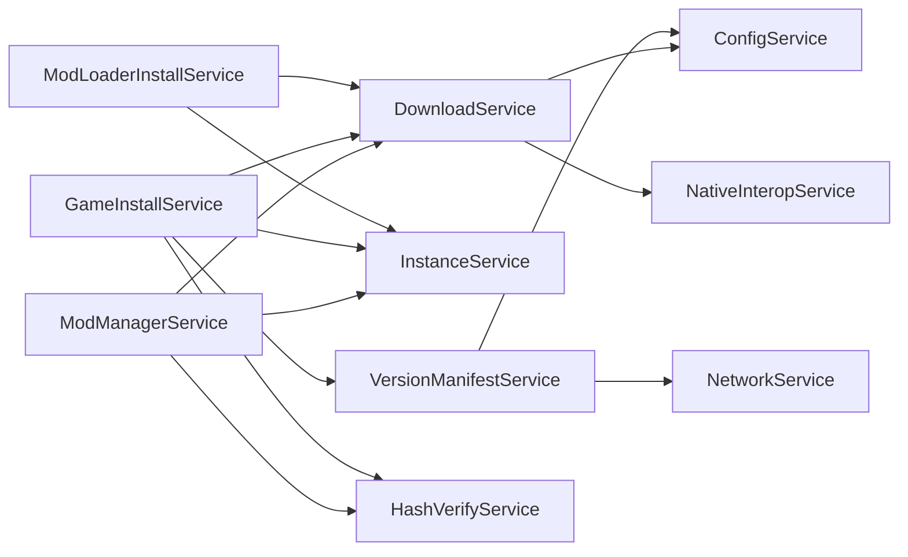

# Quilt 集成实现

<cite>
**本文引用的文件**   
- [ModLoaderInstallService.cs](file://src/FufuLauncher/Services/ModLoaderInstallService.cs)
- [GameInstallService.cs](file://src/FufuLauncher/Services/GameInstallService.cs)
- [VersionManifestService.cs](file://src/FufuLauncher/Services/VersionManifestService.cs)
- [DownloadService.cs](file://src/FufuLauncher/Services/DownloadService.cs)
- [InstanceService.cs](file://src/FufuLauncher/Services/InstanceService.cs)
- [ConfigService.cs](file://src/FufuLauncher/Services/ConfigService.cs)
- [NetworkService.cs](file://src/FufuLauncher/Services/NetworkService.cs)
- [ModManagerService.cs](file://src/FufuLauncher/Services/ModManagerService.cs)
- [InstancesPage.xaml.cs](file://src/FufuLauncher/Views/InstancesPage.xaml.cs)
- [README.md](file://README.md)
</cite>

## 目录
1. [简介](#简介)
2. [项目结构](#项目结构)
3. [核心组件](#核心组件)
4. [架构总览](#架构总览)
5. [详细组件分析](#详细组件分析)
6. [依赖关系分析](#依赖关系分析)
7. [性能考量](#性能考量)
8. [故障排查指南](#故障排查指南)
9. [结论](#结论)
10. [附录：Quilt 安装完整流程与代码示例路径](#附录quilt-安装完整流程与代码示例路径)

## 简介
本文件面向“可爱的芙芙”启动器中的 Quilt 模组加载器集成，系统性说明以下要点：
- Quilt 的安装流程：通过 meta.quiltmc.org API 获取版本信息、下载 quilt-installer.jar 并完成安装记录。
- Quilt 与 Fabric 的兼容性与差异点（元数据、安装器来源、URL 规则等）。
- Quilt 特定的配置要求与实例设置（实例字段、Java 版本建议、JVM 参数位置等）。
- 与现有系统的集成方式与数据模型适配（下载服务、校验、实例管理、网络源切换等）。
- 完整的安装过程错误处理与恢复机制（重试、断点续传、SHA1 校验、自动修复）。

## 项目结构
本项目采用 C# WPF + .NET 8 的多服务分层架构，关键服务包括：
- 版本清单服务：拉取 Mojang 版本清单与版本 JSON。
- 下载服务：多线程分片断点续传、双进度、失败重试、SHA1 校验。
- 实例服务：多隔离实例目录结构与元信息持久化。
- 模组加载器安装服务：支持 Forge / Fabric / Quilt 一键安装。
- 模组管理服务：解析 fabric.mod.json / quilt.mod.json / mods.toml 元数据。
- 网络服务：连通性检测与官方/镜像源常量。
- 配置服务：下载源、Java 镜像、JVM 参数等用户配置。

图表来源
- [ModLoaderInstallService.cs:15-27](file://src/FufuLauncher/Services/ModLoaderInstallService.cs#L15-L27)
- [DownloadService.cs:56-114](file://src/FufuLauncher/Services/DownloadService.cs#L56-L114)
- [InstanceService.cs:51-70](file://src/FufuLauncher/Services/InstanceService.cs#L51-L70)
- [GameInstallService.cs:50-80](file://src/FufuLauncher/Services/GameInstallService.cs#L50-L80)
- [VersionManifestService.cs:172-189](file://src/FufuLauncher/Services/VersionManifestService.cs#L172-L189)
- [ModManagerService.cs:74-91](file://src/FufuLauncher/Services/ModManagerService.cs#L74-L91)
- [NetworkService.cs:18-33](file://src/FufuLauncher/Services/NetworkService.cs#L18-L33)
- [ConfigService.cs:85-96](file://src/FufuLauncher/Services/ConfigService.cs#L85-L96)

章节来源
- [README.md:1-87](file://README.md#L1-L87)

## 核心组件
- ModLoaderInstallService：封装了 Fabric、Forge、Quilt 的一键安装逻辑，其中 Quilt 部分通过 meta.quiltmc.org 获取推荐 loader 版本并下载 quilt-installer.jar，随后更新实例元信息。
- DownloadService：提供高可靠下载能力，包含分片并发、断点续传、SHA1 校验、失败重试、全局/单任务进度事件。
- InstanceService：维护实例目录结构与元信息（含 ModLoader、ModLoaderVersion、JavaMajorVersion 等），供安装后持久化。
- VersionManifestService：拉取 Mojang 版本清单与版本 JSON，支持 BMCLAPI/Mojang 双源切换。
- ModManagerService：解析模组元数据，识别 Fabric/Quilt/Forge，便于后续管理与展示。
- NetworkService：定义官方与镜像源常量，并提供连通性测试。
- ConfigService：集中管理下载源、Java 镜像、JVM 参数等配置项。

章节来源
- [ModLoaderInstallService.cs:15-27](file://src/FufuLauncher/Services/ModLoaderInstallService.cs#L15-L27)
- [DownloadService.cs:56-114](file://src/FufuLauncher/Services/DownloadService.cs#L56-L114)
- [InstanceService.cs:27-49](file://src/FufuLauncher/Services/InstanceService.cs#L27-L49)
- [VersionManifestService.cs:172-189](file://src/FufuLauncher/Services/VersionManifestService.cs#L172-L189)
- [ModManagerService.cs:74-91](file://src/FufuLauncher/Services/ModManagerService.cs#L74-L91)
- [NetworkService.cs:18-33](file://src/FufuLauncher/Services/NetworkService.cs#L18-L33)
- [ConfigService.cs:85-96](file://src/FufuLauncher/Services/ConfigService.cs#L85-L96)

## 架构总览
下图展示了 Quilt 安装的关键调用链与数据流：从 UI 触发到安装服务，再到下载服务与实例服务的协作。

图表来源
- [ModLoaderInstallService.cs:122-160](file://src/FufuLauncher/Services/ModLoaderInstallService.cs#L122-L160)
- [DownloadService.cs:222-261](file://src/FufuLauncher/Services/DownloadService.cs#L222-L261)
- [InstanceService.cs:118-123](file://src/FufuLauncher/Services/InstanceService.cs#L118-L123)
- [InstancesPage.xaml.cs:124-134](file://src/FufuLauncher/Views/InstancesPage.xaml.cs#L124-L134)

## 详细组件分析

### Quilt 安装服务（ModLoaderInstallService）
- 版本获取：调用 meta.quiltmc.org v3 接口获取推荐 loader 版本；若未指定 loaderVersion，则取返回列表的第一个版本作为默认。
- 安装器下载：从 maven.quiltmc.org 仓库下载 quilt-installer-{loaderVersion}.jar，保存到 AppDataDir/installers 目录。
- 实例元信息更新：将实例的 ModLoader 设置为 "Quilt"，ModLoaderVersion 设置为所选 loader 版本，并持久化。
- 错误处理：捕获异常并返回 false，上层可据此提示用户。

图表来源
- [ModLoaderInstallService.cs:122-160](file://src/FufuLauncher/Services/ModLoaderInstallService.cs#L122-L160)

章节来源
- [ModLoaderInstallService.cs:122-160](file://src/FufuLauncher/Services/ModLoaderInstallService.cs#L122-L160)

### 下载服务（DownloadService）
- 并发与分片：对大文件（>=8MB）启用多 Range 分片并发下载，小文件使用单连接 Range 断点续传。
- 断点续传：使用 .partial 临时文件记录已下载字节数，中断后可继续。
- 失败重试：指数退避重试（默认 3 次），并在官方源失败时自动降级到 BMCLAPI。
- 完整性校验：下载完成后进行 SHA1 校验，失败则删除并重下一次。
- 进度事件：提供单任务进度与全局总进度事件，节流更新避免 UI 卡顿。

图表来源
- [DownloadService.cs:28-45](file://src/FufuLauncher/Services/DownloadService.cs#L28-L45)
- [DownloadService.cs:56-114](file://src/FufuLauncher/Services/DownloadService.cs#L56-L114)

章节来源
- [DownloadService.cs:222-261](file://src/FufuLauncher/Services/DownloadService.cs#L222-L261)
- [DownloadService.cs:295-366](file://src/FufuLauncher/Services/DownloadService.cs#L295-L366)
- [DownloadService.cs:368-451](file://src/FufuLauncher/Services/DownloadService.cs#L368-L451)
- [DownloadService.cs:454-547](file://src/FufuLauncher/Services/DownloadService.cs#L454-L547)
- [DownloadService.cs:584-590](file://src/FufuLauncher/Services/DownloadService.cs#L584-L590)

### 实例服务（InstanceService）
- 实例目录结构：每个实例独立 .minecraft、mods、saves、resourcepacks、shaderpacks 等目录。
- 元信息字段：包含 ModLoader、ModLoaderVersion、JavaMajorVersion、Xms/Xmx、ExtraJvmArgs、分辨率等。
- 生命周期操作：创建、重命名、复制、删除、导出 zip、导入已有 .minecraft。

章节来源
- [InstanceService.cs:27-49](file://src/FufuLauncher/Services/InstanceService.cs#L27-L49)
- [InstanceService.cs:118-123](file://src/FufuLauncher/Services/InstanceService.cs#L118-L123)

### 模组管理服务（ModManagerService）
- 元数据解析：支持 fabric.mod.json、quilt.mod.json、META-INF/mods.toml，识别模组名称、版本、作者及加载器类型。
- 启用/禁用：通过重命名 .jar <-> .disabled 控制模组状态。
- 下载与校验：复用 DownloadService 的线程池与 SHA1 校验。

章节来源
- [ModManagerService.cs:139-184](file://src/FufuLauncher/Services/ModManagerService.cs#L139-L184)
- [ModManagerService.cs:252-324](file://src/FufuLauncher/Services/ModManagerService.cs#L252-L324)

### 版本清单服务（VersionManifestService）
- 清单拉取：支持 Mojang 官方与 BMCLAPI 双源，优先根据配置选择首选源，失败回退另一源。
- 版本 JSON：拉取具体版本的详细信息（libraries、assets、downloads、javaVersion 等）。

章节来源
- [VersionManifestService.cs:205-255](file://src/FufuLauncher/Services/VersionManifestService.cs#L205-L255)
- [VersionManifestService.cs:257-272](file://src/FufuLauncher/Services/VersionManifestService.cs#L257-L272)

### 网络服务（NetworkService）
- 常量定义：Mojang 与 BMCLAPI 的版本清单 URL。
- 连通性测试：并行检测两个源的可达性与延迟。

章节来源
- [NetworkService.cs:18-33](file://src/FufuLauncher/Services/NetworkService.cs#L18-L33)
- [NetworkService.cs:34-76](file://src/FufuLauncher/Services/NetworkService.cs#L34-L76)

### 配置服务（ConfigService）
- 下载源：支持 Mojang/BMCLAPI 切换，影响版本清单与资源下载 URL 重写。
- Java 镜像：支持 Official/BMCLAPI/Huaweicloud，用于 Java 运行时自动下载。
- JVM 参数：Xms/Xmx、ExtraJvmArgs、多核优化、优先级、亲和性等。

章节来源
- [ConfigService.cs:13-83](file://src/FufuLauncher/Services/ConfigService.cs#L13-L83)
- [ConfigService.cs:98-147](file://src/FufuLauncher/Services/ConfigService.cs#L98-L147)

## 依赖关系分析
- ModLoaderInstallService 依赖 DownloadService 与 InstanceService，并通过 HttpClient 直接访问 meta.quiltmc.org。
- GameInstallService 依赖 VersionManifestService、DownloadService、HashVerifyService、InstanceService、JavaRuntimeService。
- ModManagerService 依赖 InstanceService、DownloadService、HashVerifyService。
- VersionManifestService 依赖 NetworkService 与 ConfigService。
- DownloadService 依赖 ConfigService 与 NativeInteropService（SHA1 计算）。

图表来源
- [ModLoaderInstallService.cs:15-27](file://src/FufuLauncher/Services/ModLoaderInstallService.cs#L15-L27)
- [GameInstallService.cs:50-80](file://src/FufuLauncher/Services/GameInstallService.cs#L50-L80)
- [ModManagerService.cs:74-91](file://src/FufuLauncher/Services/ModManagerService.cs#L74-L91)
- [VersionManifestService.cs:172-189](file://src/FufuLauncher/Services/VersionManifestService.cs#L172-L189)
- [DownloadService.cs:56-114](file://src/FufuLauncher/Services/DownloadService.cs#L56-L114)

章节来源
- [ModLoaderInstallService.cs:15-27](file://src/FufuLauncher/Services/ModLoaderInstallService.cs#L15-L27)
- [GameInstallService.cs:50-80](file://src/FufuLauncher/Services/GameInstallService.cs#L50-L80)
- [ModManagerService.cs:74-91](file://src/FufuLauncher/Services/ModManagerService.cs#L74-L91)
- [VersionManifestService.cs:172-189](file://src/FufuLauncher/Services/VersionManifestService.cs#L172-L189)
- [DownloadService.cs:56-114](file://src/FufuLauncher/Services/DownloadService.cs#L56-L114)

## 性能考量
- 下载并发与分片：大文件分片并发显著提升吞吐，小文件单连接降低开销。
- 断点续传：减少重复下载，提升用户体验。
- 进度节流：全局与单任务进度事件节流更新，避免 UI 卡顿。
- 失败重试与降级：指数退避与官方源失败自动切换到 BMCLAPI，提高稳定性。
- 磁盘空间检查：下载前预留 1GB 缓冲，防止中途失败。

[本节为通用指导，不直接分析具体文件]

## 故障排查指南
- 网络不可用：检查 NetworkService 连通性测试结果，确认 Mojang/BMCLAPI 可用性。
- 下载失败：查看 DownloadService 的错误信息与重试次数，必要时切换下载源或检查防火墙。
- SHA1 校验失败：自动删除损坏文件并重下一次；若仍失败，检查存储介质与权限。
- 实例元信息未更新：确认 InstanceService.SaveInstance 调用成功，检查实例目录是否存在。
- Java 运行时缺失：GameInstallService 会尝试自动下载匹配的 JDK；失败时提示用户手动下载。

章节来源
- [NetworkService.cs:34-76](file://src/FufuLauncher/Services/NetworkService.cs#L34-L76)
- [DownloadService.cs:295-366](file://src/FufuLauncher/Services/DownloadService.cs#L295-L366)
- [GameInstallService.cs:248-270](file://src/FufuLauncher/Services/GameInstallService.cs#L248-L270)

## 结论
本项目在 Quilt 集成方面实现了稳定的版本获取、安装器下载与实例元信息更新流程，并与现有的下载、校验、实例管理、网络源切换等模块无缝衔接。通过完善的错误处理与恢复机制，确保用户在各种网络与系统环境下都能顺利完成 Quilt 安装。

[本节为总结，不直接分析具体文件]

## 附录：Quilt 安装完整流程与代码示例路径
- 版本选择与下载管理：
  - 版本清单拉取与搜索：[VersionManifestService.cs:205-255](file://src/FufuLauncher/Services/VersionManifestService.cs#L205-L255)
  - 下载任务构建与执行：[DownloadService.cs:222-261](file://src/FufuLauncher/Services/DownloadService.cs#L222-L261)
- Quilt 安装流程：
  - 获取 meta.quiltmc.org 版本信息：[ModLoaderInstallService.cs:122-160](file://src/FufuLauncher/Services/ModLoaderInstallService.cs#L122-L160)
  - 下载 quilt-installer.jar：[DownloadService.cs:295-366](file://src/FufuLauncher/Services/DownloadService.cs#L295-L366)
  - 更新实例元信息：[InstanceService.cs:118-123](file://src/FufuLauncher/Services/InstanceService.cs#L118-L123)
- 与现有系统集成：
  - 下载源切换与 URL 重写：[VersionManifestService.cs:274-292](file://src/FufuLauncher/Services/VersionManifestService.cs#L274-L292)
  - 模组元数据识别（Quilt）：[ModManagerService.cs:157-171](file://src/FufuLauncher/Services/ModManagerService.cs#L157-L171)
- 错误处理与恢复：
  - 下载失败重试与降级：[DownloadService.cs:305-366](file://src/FufuLauncher/Services/DownloadService.cs#L305-L366)
  - 完整性校验与自动修复：[GameInstallService.cs:289-323](file://src/FufuLauncher/Services/GameInstallService.cs#L289-L323)
- UI 交互入口：
  - 实例菜单触发 Quilt 安装：[InstancesPage.xaml.cs:124-134](file://src/FufuLauncher/Views/InstancesPage.xaml.cs#L124-L134)

章节来源
- [ModLoaderInstallService.cs:122-160](file://src/FufuLauncher/Services/ModLoaderInstallService.cs#L122-L160)
- [DownloadService.cs:222-261](file://src/FufuLauncher/Services/DownloadService.cs#L222-L261)
- [InstanceService.cs:118-123](file://src/FufuLauncher/Services/InstanceService.cs#L118-L123)
- [VersionManifestService.cs:274-292](file://src/FufuLauncher/Services/VersionManifestService.cs#L274-L292)
- [ModManagerService.cs:157-171](file://src/FufuLauncher/Services/ModManagerService.cs#L157-L171)
- [GameInstallService.cs:289-323](file://src/FufuLauncher/Services/GameInstallService.cs#L289-L323)
- [InstancesPage.xaml.cs:124-134](file://src/FufuLauncher/Views/InstancesPage.xaml.cs#L124-L134)