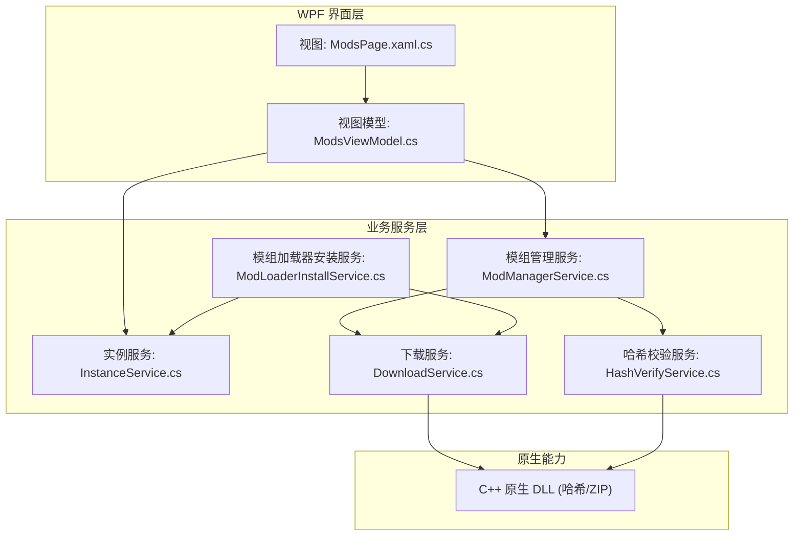
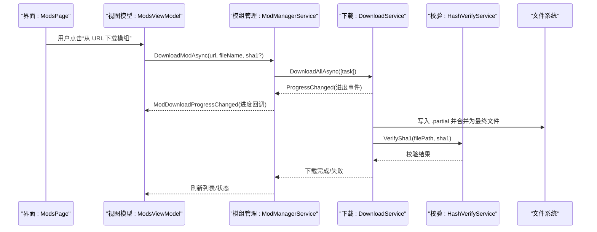
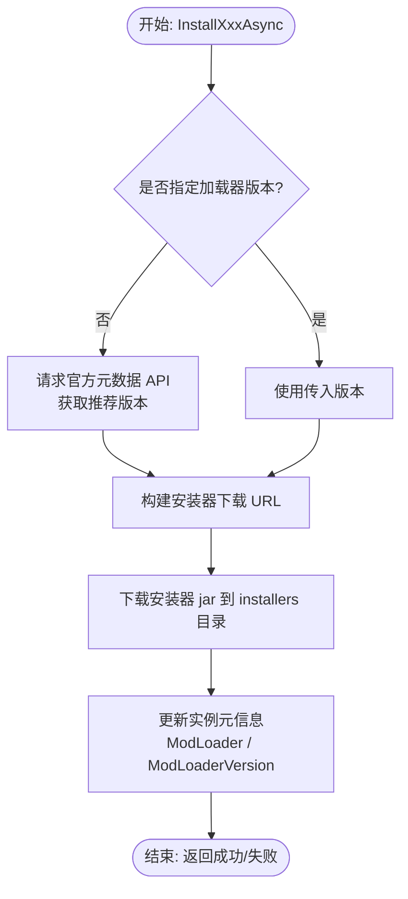
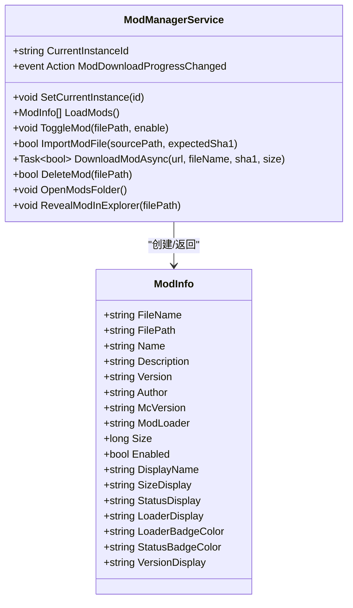
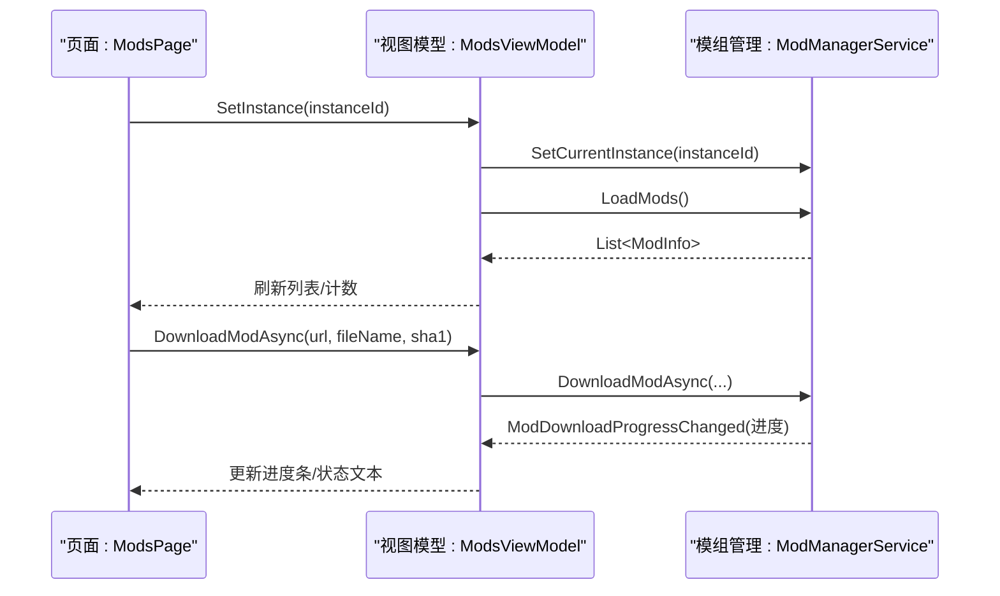
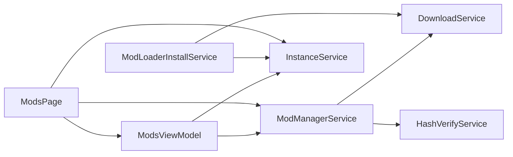

# 模组加载器扩展

<cite>
**本文引用的文件**   
- [ModLoaderInstallService.cs](file://src/FufuLauncher/Services/ModLoaderInstallService.cs)
- [ModManagerService.cs](file://src/FufuLauncher/Services/ModManagerService.cs)
- [ModsViewModel.cs](file://src/FufuLauncher/ViewModels/ModsViewModel.cs)
- [ModsPage.xaml.cs](file://src/FufuLauncher/Views/ModsPage.xaml.cs)
- [InstanceService.cs](file://src/FufuLauncher/Services/InstanceService.cs)
- [DownloadService.cs](file://src/FufuLauncher/Services/DownloadService.cs)
- [HashVerifyService.cs](file://src/FufuLauncher/Services/HashVerifyService.cs)
- [FufuLauncher.csproj](file://src/FufuLauncher/FufuLauncher.csproj)
- [README.md](file://README.md)
</cite>

## 目录
1. [简介](#简介)
2. [项目结构](#项目结构)
3. [核心组件](#核心组件)
4. [架构总览](#架构总览)
5. [详细组件分析](#详细组件分析)
6. [依赖关系分析](#依赖关系分析)
7. [性能考量](#性能考量)
8. [故障排查指南](#故障排查指南)
9. [结论](#结论)
10. [附录：扩展示例与最佳实践](#附录扩展示例与最佳实践)

## 简介
本文件面向“可爱的芙芙”启动器的模组加载器扩展，系统化阐述抽象接口设计、现有加载器（Fabric、Forge、Quilt）实现原理与扩展点，以及新增加载器的支持方法（版本兼容性检查、依赖解析、冲突处理）。同时记录模组文件的下载、校验与安装流程，并提供完整的扩展示例与集成方法，帮助开发者快速为新的模组加载器提供统一安装与管理能力。

## 项目结构
本项目采用 C# WPF (.NET 8) + C++ 原生 DLL 的混合架构。模组相关能力集中在 Services 层，UI 通过 ViewModels 与 Views 驱动交互；实例与模组目录由 InstanceService 统一管理；下载与校验由 DownloadService 与 HashVerifyService 提供。

图表来源
- [ModsPage.xaml.cs](file://src/FufuLauncher/Views/ModsPage.xaml.cs)
- [ModsViewModel.cs](file://src/FufuLauncher/ViewModels/ModsViewModel.cs)
- [ModLoaderInstallService.cs](file://src/FufuLauncher/Services/ModLoaderInstallService.cs)
- [ModManagerService.cs](file://src/FufuLauncher/Services/ModManagerService.cs)
- [InstanceService.cs](file://src/FufuLauncher/Services/InstanceService.cs)
- [DownloadService.cs](file://src/FufuLauncher/Services/DownloadService.cs)
- [HashVerifyService.cs](file://src/FufuLauncher/Services/HashVerifyService.cs)

章节来源
- [FufuLauncher.csproj](file://src/FufuLauncher/FufuLauncher.csproj)
- [README.md](file://README.md)

## 核心组件
- 模组加载器安装服务（ModLoaderInstallService）：封装 Fabric、Forge、Quilt 的一键安装流程，负责获取元数据、下载安装器并更新实例元信息。
- 模组管理服务（ModManagerService）：扫描 mods 目录、解析模组元数据（fabric.mod.json、quilt.mod.json、META-INF/mods.toml）、启用/禁用、导入与下载模组、打开资源管理器定位文件。
- 实例服务（InstanceService）：多隔离实例管理，维护每个实例的 .minecraft、mods、resourcepacks、shaderpacks、options 等目录结构及 instance.json 元信息。
- 下载服务（DownloadService）：多线程分片断点续传下载引擎，支持官方源/BMCLAPI 镜像切换、SHA1 校验、失败重试与全局进度。
- 哈希校验服务（HashVerifyService）：基于 C++ 原生 DLL 计算 SHA1，支持单文件与批量校验。

章节来源
- [ModLoaderInstallService.cs](file://src/FufuLauncher/Services/ModLoaderInstallService.cs)
- [ModManagerService.cs](file://src/FufuLauncher/Services/ModManagerService.cs)
- [InstanceService.cs](file://src/FufuLauncher/Services/InstanceService.cs)
- [DownloadService.cs](file://src/FufuLauncher/Services/DownloadService.cs)
- [HashVerifyService.cs](file://src/FufuLauncher/Services/HashVerifyService.cs)

## 架构总览
模组加载器扩展围绕“安装—管理—运行”三阶段展开：
- 安装阶段：通过 ModLoaderInstallService 调用各加载器官方安装器，完成环境准备与实例元信息写入。
- 管理阶段：通过 ModManagerService 对模组进行扫描、启用/禁用、导入与下载，结合 DownloadService 与 HashVerifyService 保证完整性。
- 运行阶段：由上层 GameLaunchService（不在本文范围）读取实例元信息（ModLoader、ModLoaderVersion）并生成启动参数。

图表来源
- [ModsPage.xaml.cs](file://src/FufuLauncher/Views/ModsPage.xaml.cs)
- [ModsViewModel.cs](file://src/FufuLauncher/ViewModels/ModsViewModel.cs)
- [ModManagerService.cs](file://src/FufuLauncher/Services/ModManagerService.cs)
- [DownloadService.cs](file://src/FufuLauncher/Services/DownloadService.cs)
- [HashVerifyService.cs](file://src/FufuLauncher/Services/HashVerifyService.cs)

## 详细组件分析

### 模组加载器安装服务（ModLoaderInstallService）
- 功能要点
  - Fabric：从 meta.fabricmc.net 获取推荐 loader 版本，下载 fabric-installer.jar，并在实例中记录 ModLoader 与 ModLoaderVersion。
  - Forge：根据 gameVersion 与 forgeVersion 构造 installer.jar 地址，下载后更新实例元信息。
  - Quilt：从 meta.quiltmc.org 获取 loader 版本，下载 quilt-installer.jar 并更新实例元信息。
- 扩展点
  - 新增加载器：遵循 InstallXxxAsync(instanceId, gameVersion, loaderVersion?) 模式，在方法内完成“元数据获取—安装器下载—实例元信息写入”。
  - 版本兼容性检查：可在方法开头查询官方元数据 API，判断 gameVersion 与 loaderVersion 是否兼容。
  - 依赖解析与冲突处理：可在此处增加对依赖清单的解析与冲突检测逻辑（例如读取 mod 元数据中的依赖声明）。

图表来源
- [ModLoaderInstallService.cs](file://src/FufuLauncher/Services/ModLoaderInstallService.cs)

章节来源
- [ModLoaderInstallService.cs](file://src/FufuLauncher/Services/ModLoaderInstallService.cs)

### 模组管理服务（ModManagerService）
- 功能要点
  - 扫描 mods 目录，识别 .jar/.disabled 文件，解析 fabric.mod.json、quilt.mod.json、META-INF/mods.toml 以填充名称、描述、版本、作者、加载器类型等信息。
  - 启用/禁用：通过重命名 .jar ↔ .disabled 实现。
  - 导入与下载：支持本地拖拽导入与 URL 下载，复用 DownloadService 的多线程引擎，支持 SHA1 校验。
  - 资源管理器集成：打开 mods 文件夹或高亮选中具体模组文件。
- 扩展点
  - 新增加载器元数据解析：在 ParseModMetadata 中增加对应清单文件的解析逻辑。
  - 依赖解析与冲突处理：可在 LoadMods 或 Import/Download 完成后，对依赖声明进行解析与冲突检测。

图表来源
- [ModManagerService.cs](file://src/FufuLauncher/Services/ModManagerService.cs)

章节来源
- [ModManagerService.cs](file://src/FufuLauncher/Services/ModManagerService.cs)

### 视图模型与页面（ModsViewModel、ModsPage）
- 职责分工
  - ModsViewModel：绑定 UI 状态（搜索过滤、下载进度、计数），调用 ModManagerService 执行操作，处理后台事件回传到 UI 线程。
  - ModsPage：处理用户交互（拖拽导入、按钮点击、右键菜单），将动作委托给 ViewModel 与服务层。
- 关键流程
  - 选择实例后设置当前实例 ID，刷新模组列表。
  - 从 URL 下载模组时，订阅下载进度事件，更新 UI 状态。
  - 导入/删除/启用/禁用等操作后刷新列表。

图表来源
- [ModsPage.xaml.cs](file://src/FufuLauncher/Views/ModsPage.xaml.cs)
- [ModsViewModel.cs](file://src/FufuLauncher/ViewModels/ModsViewModel.cs)
- [ModManagerService.cs](file://src/FufuLauncher/Services/ModManagerService.cs)

章节来源
- [ModsViewModel.cs](file://src/FufuLauncher/ViewModels/ModsViewModel.cs)
- [ModsPage.xaml.cs](file://src/FufuLauncher/Views/ModsPage.xaml.cs)

### 实例服务（InstanceService）
- 职责
  - 维护实例目录结构（instances/{InstanceId}/.minecraft、mods、resourcepacks、shaderpacks、options.txt、instance.json）。
  - 提供 GetModsDir、GetInstanceDir 等路径工具方法，供模组管理与加载器安装服务使用。
  - 保存/加载实例元信息（包含 ModLoader、ModLoaderVersion）。
- 扩展点
  - 新增加载器字段：如需扩展更多元信息（如依赖清单路径、插件配置），可在 GameInstance 中添加属性并序列化。

章节来源
- [InstanceService.cs](file://src/FufuLauncher/Services/InstanceService.cs)

### 下载服务（DownloadService）
- 能力
  - 多线程并发下载，按任务类别独立队列互不阻塞（Game、Asset、Java、Mod、Other）。
  - 大文件分片下载（>=8MB），小文件 Range 断点续传。
  - 官方源/BMCLAPI 镜像自动降级，SHA1 校验失败自动重下。
  - 全局总进度与单文件进度事件，便于 UI 显示。
- 扩展点
  - 新增下载类别：在枚举与信号量中扩展新类别，保持隔离。
  - 自定义校验策略：可扩展其他校验算法（如 MD5、CRC32），但需与 HashVerifyService 协作。

章节来源
- [DownloadService.cs](file://src/FufuLauncher/Services/DownloadService.cs)

### 哈希校验服务（HashVerifyService）
- 能力
  - 基于 C++ 原生 DLL 计算 SHA1，支持单文件与批量校验。
  - 返回 FileVerifyResult，包含存在性、大小、期望与实际哈希、有效性。
- 扩展点
  - 新增校验算法：在 ComputeFileSHA1 基础上扩展其他算法，并保持接口一致。

章节来源
- [HashVerifyService.cs](file://src/FufuLauncher/Services/HashVerifyService.cs)

## 依赖关系分析
- 组件耦合
  - ModLoaderInstallService 依赖 DownloadService 与 InstanceService。
  - ModManagerService 依赖 InstanceService、DownloadService、HashVerifyService。
  - ModsViewModel 依赖 ModManagerService 与 InstanceService。
  - ModsPage 依赖 ModsViewModel、InstanceService、ResourcePackService、ModManagerService。
- 外部依赖
  - C++ 原生 DLL 用于高性能哈希计算与 ZIP 解压。
  - .NET 8 WPF 运行时。

图表来源
- [ModsViewModel.cs](file://src/FufuLauncher/ViewModels/ModsViewModel.cs)
- [ModManagerService.cs](file://src/FufuLauncher/Services/ModManagerService.cs)
- [ModLoaderInstallService.cs](file://src/FufuLauncher/Services/ModLoaderInstallService.cs)
- [InstanceService.cs](file://src/FufuLauncher/Services/InstanceService.cs)
- [DownloadService.cs](file://src/FufuLauncher/Services/DownloadService.cs)
- [HashVerifyService.cs](file://src/FufuLauncher/Services/HashVerifyService.cs)
- [ModsPage.xaml.cs](file://src/FufuLauncher/Views/ModsPage.xaml.cs)

章节来源
- [FufuLauncher.csproj](file://src/FufuLauncher/FufuLauncher.csproj)

## 性能考量
- 下载性能
  - 大文件分片并发下载显著提升吞吐；小文件 Range 断点续传减少重复传输。
  - 各类别独立信号量避免相互阻塞（Mod 类别默认并发 4）。
  - 全局总进度节流更新，降低 UI 刷新开销。
- 校验性能
  - 使用 C++ 原生 DLL 计算哈希，提升校验速度。
- 文件 I/O
  - 导入/删除/重命名操作具备重试机制，降低文件占用导致的失败概率。

[本节为通用指导，无需引用具体文件]

## 故障排查指南
- 下载失败
  - 检查磁盘空间是否充足（DownloadService.CheckDiskSpace）。
  - 查看日志输出（App.WriteAppLog），确认网络错误、超时或 SHA1 校验失败。
  - 若官方源不稳定，系统会自动降级到 BMCLAPI 镜像。
- 校验失败
  - 确认期望 SHA1 是否正确；失败会触发自动重下（最多一次）。
  - 若仍失败，建议重新获取模组源链接。
- 文件被占用
  - 启用/禁用模组时，TryMoveFile 具备多次重试机制；若仍失败，检查是否有进程锁定该文件。
- 实例未选择
  - 下载/导入前需先选择实例（CurrentInstanceId 为空会抛出异常或提示）。

章节来源
- [DownloadService.cs](file://src/FufuLauncher/Services/DownloadService.cs)
- [ModManagerService.cs](file://src/FufuLauncher/Services/ModManagerService.cs)

## 结论
本扩展通过统一的安装与管理接口，将 Fabric、Forge、Quilt 等主流加载器整合进“可爱的芙芙”启动器，提供了稳定的下载、校验与实例管理能力。新增加载器只需遵循既定模式与扩展点，即可无缝集成。

[本节为总结，无需引用具体文件]

## 附录：扩展示例与最佳实践

### 新增加载器支持（示例：NeoForge）
- 步骤
  - 在 ModLoaderInstallService 中新增 InstallNeoForgeAsync(instanceId, gameVersion, loaderVersion?) 方法。
  - 参考 Fabric/Forge/Quilt 的实现：获取元数据、下载安装器、更新实例元信息。
  - 在 UI 层（如 ModsPage 或设置页）提供一键安装入口。
- 版本兼容性检查
  - 调用 NeoForge 官方元数据 API，验证 gameVersion 与 loaderVersion 的兼容性。
- 依赖解析与冲突处理
  - 在安装完成后，扫描 mods 目录，解析依赖声明（如依赖库、前置模组），检测冲突并给出提示。

章节来源
- [ModLoaderInstallService.cs](file://src/FufuLauncher/Services/ModLoaderInstallService.cs)

### 自定义加载器元数据解析（示例：NeoForge 的 mods.toml 扩展）
- 在 ModManagerService.ParseModMetadata 中增加对 NeoForge 清单的解析逻辑（若与 Forge 不同）。
- 确保 ModInfo.ModLoader 正确标记为 “NeoForge”，以便 UI 显示徽章颜色。

章节来源
- [ModManagerService.cs](file://src/FufuLauncher/Services/ModManagerService.cs)

### 与现有系统集成
- 下载与校验
  - 复用 DownloadService 的多线程引擎与 SHA1 校验，确保一致性。
- 实例管理
  - 通过 InstanceService 的路径工具方法访问 mods 目录，避免硬编码路径。
- UI 交互
  - 在 ModsViewModel 中订阅 ModDownloadProgressChanged，更新 UI 状态。

章节来源
- [DownloadService.cs](file://src/FufuLauncher/Services/DownloadService.cs)
- [InstanceService.cs](file://src/FufuLauncher/Services/InstanceService.cs)
- [ModsViewModel.cs](file://src/FufuLauncher/ViewModels/ModsViewModel.cs)

### 最佳实践
- 错误处理
  - 所有对外暴露的方法应捕获异常并返回明确结果（布尔或结果对象），避免崩溃。
- 日志记录
  - 关键路径（下载、校验、文件操作）记录日志，便于问题定位。
- 用户体验
  - 提供清晰的进度反馈与错误提示，避免长时间无响应。
- 可扩展性
  - 通过接口与事件解耦，便于后续扩展新的加载器与校验算法。

[本节为通用指导，无需引用具体文件]