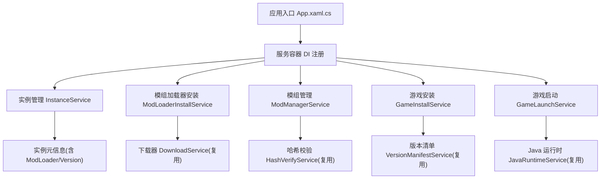
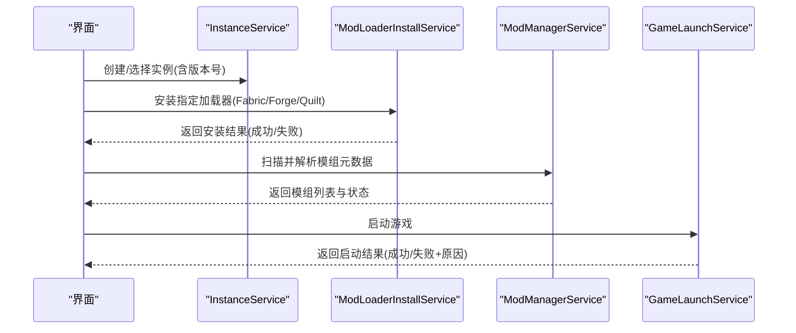
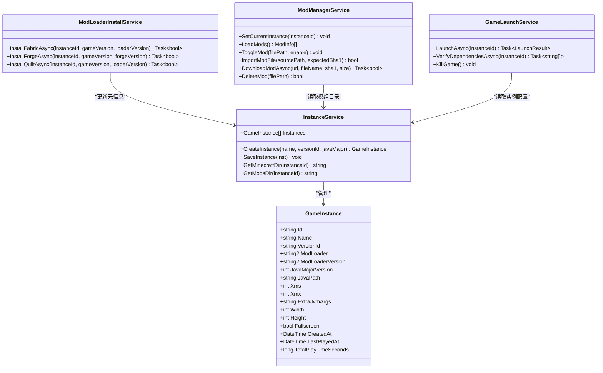
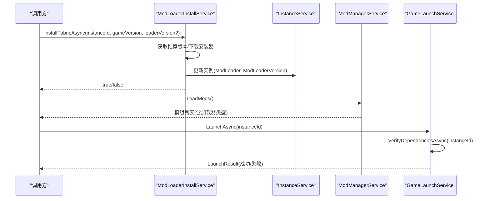
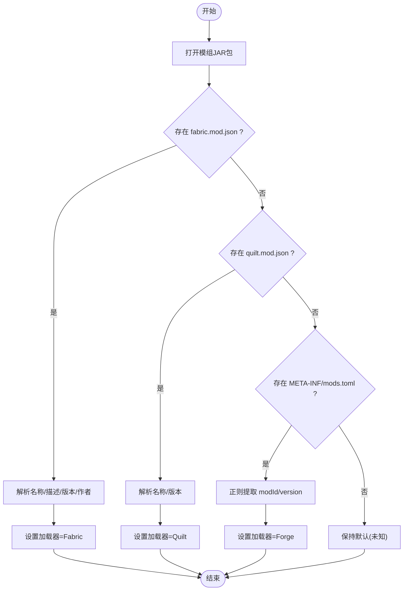
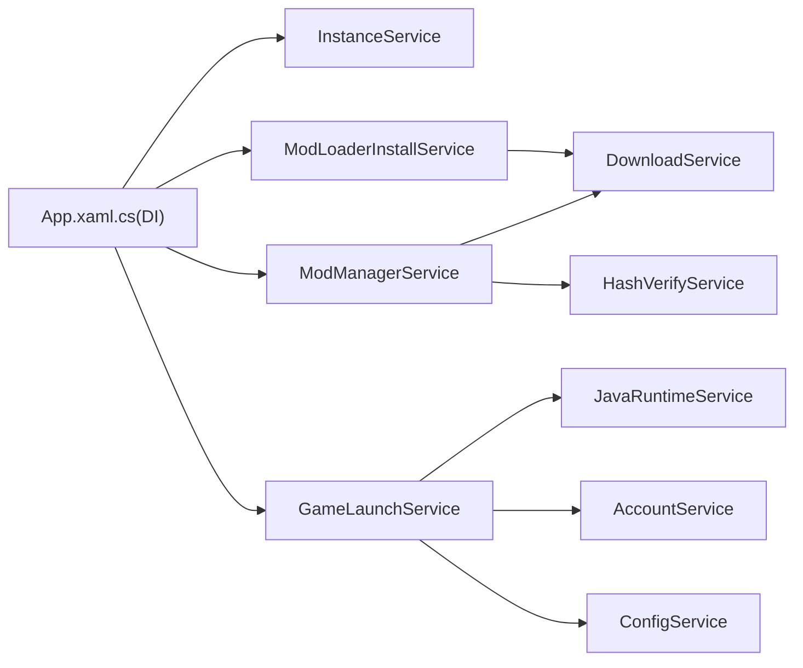

# 模组加载器接口设计

<cite>
**本文引用的文件**   
- [README.md](file://README.md)
- [App.xaml.cs](file://src/FufuLauncher/App.xaml.cs)
- [InstanceService.cs](file://src/FufuLauncher/Services/InstanceService.cs)
- [ModLoaderInstallService.cs](file://src/FufuLauncher/Services/ModLoaderInstallService.cs)
- [ModManagerService.cs](file://src/FufuLauncher/Services/ModManagerService.cs)
- [GameLaunchService.cs](file://src/FufuLauncher/Services/GameLaunchService.cs)
- [GameInstallService.cs](file://src/FufuLauncher/Services/GameInstallService.cs)
</cite>

## 目录
1. [引言](#引言)
2. [项目结构](#项目结构)
3. [核心组件](#核心组件)
4. [架构总览](#架构总览)
5. [详细组件分析](#详细组件分析)
6. [依赖关系分析](#依赖关系分析)
7. [性能考量](#性能考量)
8. [故障排查指南](#故障排查指南)
9. [结论](#结论)
10. [附录：接口规范与扩展指南](#附录接口规范与扩展指南)

## 引言
本文件面向“模组加载器接口设计”，目标是建立统一的安装、配置与管理接口规范，支持多种模组加载器（Forge、Fabric、Quilt）的扩展。文档从系统架构、数据流、处理逻辑、集成点、错误处理与性能特性等维度进行系统化说明，并提供面向实现者的最佳实践与示例路径，帮助开发者快速扩展新的模组加载器支持。

## 项目结构
本项目为 C# WPF (.NET 8) + C++ 原生 DLL 的 Minecraft Java 版启动器。与模组加载器相关的关键代码集中在 Services 层，包括实例管理、模组加载器安装、模组管理与游戏启动流程。

图表来源
- [App.xaml.cs:131-178](file://src/FufuLauncher/App.xaml.cs#L131-L178)
- [InstanceService.cs:27-49](file://src/FufuLauncher/Services/InstanceService.cs#L27-L49)
- [ModLoaderInstallService.cs:15-28](file://src/FufuLauncher/Services/ModLoaderInstallService.cs#L15-L28)
- [ModManagerService.cs:74-91](file://src/FufuLauncher/Services/ModManagerService.cs#L74-L91)
- [GameInstallService.cs:50-80](file://src/FufuLauncher/Services/GameInstallService.cs#L50-L80)
- [GameLaunchService.cs:35-65](file://src/FufuLauncher/Services/GameLaunchService.cs#L35-L65)

章节来源
- [README.md:34-53](file://README.md#L34-L53)
- [App.xaml.cs:131-178](file://src/FufuLauncher/App.xaml.cs#L131-L178)

## 核心组件
围绕模组加载器的关键服务如下：
- 实例管理（InstanceService）：维护实例元数据，包含 ModLoader、ModLoaderVersion、Java 主版本等字段，提供实例目录访问方法。
- 模组加载器安装（ModLoaderInstallService）：针对 Fabric、Forge、Quilt 提供一键安装能力，拉取官方安装器并写入实例元信息。
- 模组管理（ModManagerService）：扫描 mods 目录，解析 fabric.mod.json / quilt.mod.json / META-INF/mods.toml，支持启用/禁用、导入、下载与完整性校验。
- 游戏安装（GameInstallService）：负责版本与资源下载、校验与修复，以及自动匹配 Java 运行时。
- 游戏启动（GameLaunchService）：启动前校验依赖、构建 JVM 参数与类路径、启动进程并监控退出。

章节来源
- [InstanceService.cs:27-49](file://src/FufuLauncher/Services/InstanceService.cs#L27-L49)
- [ModLoaderInstallService.cs:15-28](file://src/FufuLauncher/Services/ModLoaderInstallService.cs#L15-L28)
- [ModManagerService.cs:23-72](file://src/FufuLauncher/Services/ModManagerService.cs#L23-L72)
- [GameInstallService.cs:50-80](file://src/FufuLauncher/Services/GameInstallService.cs#L50-L80)
- [GameLaunchService.cs:35-65](file://src/FufuLauncher/Services/GameLaunchService.cs#L35-L65)

## 架构总览
下图展示模组加载器在启动器中的整体交互：实例创建后，通过安装服务选择并安装特定加载器；随后由模组管理服务扫描与校验模组；最终由启动服务组装参数并拉起游戏进程。

图表来源
- [InstanceService.cs:94-116](file://src/FufuLauncher/Services/InstanceService.cs#L94-L116)
- [ModLoaderInstallService.cs:44-86](file://src/FufuLauncher/Services/ModLoaderInstallService.cs#L44-L86)
- [ModLoaderInstallService.cs:89-119](file://src/FufuLauncher/Services/ModLoaderInstallService.cs#L89-L119)
- [ModLoaderInstallService.cs:122-160](file://src/FufuLauncher/Services/ModLoaderInstallService.cs#L122-L160)
- [ModManagerService.cs:98-131](file://src/FufuLauncher/Services/ModManagerService.cs#L98-L131)
- [GameLaunchService.cs:104-120](file://src/FufuLauncher/Services/GameLaunchService.cs#L104-L120)

## 详细组件分析

### 抽象接口设计原则
- 统一安装接口：所有加载器安装方法应遵循一致的参数与返回值约定，便于上层调用与扩展。
- 统一配置与管理接口：实例元数据中需记录加载器类型与版本，模组元数据解析需覆盖主流格式。
- 可扩展性：新增加载器时仅需实现对应安装方法，并在模组元数据解析处补充识别规则。
- 异常与错误码：安装与解析过程需明确异常处理策略，保证失败可追溯、可恢复。

章节来源
- [ModLoaderInstallService.cs:44-86](file://src/FufuLauncher/Services/ModLoaderInstallService.cs#L44-L86)
- [ModLoaderInstallService.cs:89-119](file://src/FufuLauncher/Services/ModLoaderInstallService.cs#L89-L119)
- [ModLoaderInstallService.cs:122-160](file://src/FufuLauncher/Services/ModLoaderInstallService.cs#L122-L160)
- [ModManagerService.cs:139-184](file://src/FufuLauncher/Services/ModManagerService.cs#L139-L184)

### 统一安装接口规范（Fabric/Forge/Quilt）
- 输入参数
  - instanceId：目标实例标识
  - gameVersion：Minecraft 版本标识
  - loaderVersion：可选，未提供时按官方推荐或默认值选取
- 返回值
  - Task<bool>：true 表示安装成功，false 表示失败
- 行为约定
  - 下载官方安装器到 installers 目录
  - 更新实例元数据（ModLoader、ModLoaderVersion）
  - 捕获异常并返回 false，避免中断上层流程

章节来源
- [ModLoaderInstallService.cs:44-86](file://src/FufuLauncher/Services/ModLoaderInstallService.cs#L44-L86)
- [ModLoaderInstallService.cs:89-119](file://src/FufuLauncher/Services/ModLoaderInstallService.cs#L89-L119)
- [ModLoaderInstallService.cs:122-160](file://src/FufuLauncher/Services/ModLoaderInstallService.cs#L122-L160)

### 模组元数据解析与兼容性检查
- 支持的元数据格式
  - Fabric：fabric.mod.json
  - Quilt：quilt.mod.json
  - Forge：META-INF/mods.toml
- 解析字段
  - 名称、描述、版本、作者、加载器类型
- 兼容性建议
  - 根据元数据中的版本信息与实例版本进行匹配提示
  - 若缺失必要字段，回退为“未知”并保留文件名作为显示名

章节来源
- [ModManagerService.cs:139-184](file://src/FufuLauncher/Services/ModManagerService.cs#L139-L184)
- [ModManagerService.cs:23-72](file://src/FufuLauncher/Services/ModManagerService.cs#L23-L72)

### 依赖解析与冲突处理规范
- 依赖解析
  - 基于版本 JSON 的 libraries 列表，过滤操作系统规则，下载 artifact 与 natives
  - 资产索引与对象按需下载，确保资源完整性
- 冲突处理
  - 同一模组重复导入时优先校验 SHA1，失败则删除并重下
  - 模组启用/禁用通过重命名 .jar/.disabled 切换，避免并发占用

章节来源
- [GameInstallService.cs:140-183](file://src/FufuLauncher/Services/GameInstallService.cs#L140-L183)
- [GameInstallService.cs:289-323](file://src/FufuLauncher/Services/GameInstallService.cs#L289-L323)
- [ModManagerService.cs:186-227](file://src/FufuLauncher/Services/ModManagerService.cs#L186-L227)
- [ModManagerService.cs:229-250](file://src/FufuLauncher/Services/ModManagerService.cs#L229-L250)

### 版本兼容性检查与 Java 运行时匹配
- 版本要求
  - 从版本 JSON 提取 JavaMajorVersion，写入实例元数据
- 运行时匹配
  - 启动前校验 Java 路径存在性与完整性（java -version）
  - 自动下载匹配的 JDK 组件，失败时提示用户手动下载

章节来源
- [GameInstallService.cs:109-116](file://src/FufuLauncher/Services/GameInstallService.cs#L109-L116)
- [GameLaunchService.cs:129-177](file://src/FufuLauncher/Services/GameLaunchService.cs#L129-L177)

### 异常处理机制
- 安装阶段
  - 网络异常、JSON 解析失败、文件写入失败均捕获并返回 false
- 模组导入/下载
  - 校验失败删除临时文件并返回 false，同时记录日志
- 启动阶段
  - 依赖缺失、令牌过期、Java 不可用等情况弹窗提示并返回失败结果

章节来源
- [ModLoaderInstallService.cs:82-86](file://src/FufuLauncher/Services/ModLoaderInstallService.cs#L82-L86)
- [ModLoaderInstallService.cs:115-119](file://src/FufuLauncher/Services/ModLoaderInstallService.cs#L115-L119)
- [ModLoaderInstallService.cs:156-160](file://src/FufuLauncher/Services/ModLoaderInstallService.cs#L156-L160)
- [ModManagerService.cs:241-250](file://src/FufuLauncher/Services/ModManagerService.cs#L241-L250)
- [GameLaunchService.cs:113-120](file://src/FufuLauncher/Services/GameLaunchService.cs#L113-L120)

### 类图（代码级关系）

图表来源
- [InstanceService.cs:27-49](file://src/FufuLauncher/Services/InstanceService.cs#L27-L49)
- [InstanceService.cs:94-116](file://src/FufuLauncher/Services/InstanceService.cs#L94-L116)
- [ModLoaderInstallService.cs:44-86](file://src/FufuLauncher/Services/ModLoaderInstallService.cs#L44-L86)
- [ModManagerService.cs:98-131](file://src/FufuLauncher/Services/ModManagerService.cs#L98-L131)
- [GameLaunchService.cs:104-120](file://src/FufuLauncher/Services/GameLaunchService.cs#L104-L120)

### 序列图（安装与启动流程）

图表来源
- [ModLoaderInstallService.cs:44-86](file://src/FufuLauncher/Services/ModLoaderInstallService.cs#L44-L86)
- [ModManagerService.cs:98-131](file://src/FufuLauncher/Services/ModManagerService.cs#L98-L131)
- [GameLaunchService.cs:104-120](file://src/FufuLauncher/Services/GameLaunchService.cs#L104-L120)

### 流程图（模组元数据解析）

图表来源
- [ModManagerService.cs:139-184](file://src/FufuLauncher/Services/ModManagerService.cs#L139-L184)

## 依赖关系分析
- 服务注册
  - 所有服务通过 DI 容器单例注册，确保生命周期一致与依赖注入可用
- 模块耦合
  - ModLoaderInstallService 依赖 DownloadService 与 InstanceService
  - ModManagerService 依赖 InstanceService、DownloadService、HashVerifyService
  - GameLaunchService 依赖 InstanceService、AccountService、ConfigService、JavaRuntimeService 等

图表来源
- [App.xaml.cs:131-178](file://src/FufuLauncher/App.xaml.cs#L131-L178)
- [ModLoaderInstallService.cs:15-28](file://src/FufuLauncher/Services/ModLoaderInstallService.cs#L15-L28)
- [ModManagerService.cs:74-91](file://src/FufuLauncher/Services/ModManagerService.cs#L74-L91)
- [GameLaunchService.cs:35-65](file://src/FufuLauncher/Services/GameLaunchService.cs#L35-L65)

章节来源
- [App.xaml.cs:131-178](file://src/FufuLauncher/App.xaml.cs#L131-L178)

## 性能考量
- 下载与校验
  - 使用多线程下载引擎与分类队列，避免阻塞 UI
  - 下载完成后二次校验，失败即删并重下，减少无效重试
- 文件系统操作
  - 启用/禁用模组采用重命名方式，降低频繁 IO
  - 文件移动增加重试与延时，提高成功率
- 启动优化
  - 智能内存分配与多核 GC 参数预设，提升运行效率
  - 进程优先级与 CPU 亲和性设置，改善调度延迟

章节来源
- [ModManagerService.cs:252-324](file://src/FufuLauncher/Services/ModManagerService.cs#L252-L324)
- [ModManagerService.cs:186-227](file://src/FufuLauncher/Services/ModManagerService.cs#L186-L227)
- [GameLaunchService.cs:179-225](file://src/FufuLauncher/Services/GameLaunchService.cs#L179-L225)

## 故障排查指南
- 安装失败
  - 检查网络连通与下载源可用性
  - 查看安装器下载路径与权限
- 模组导入失败
  - 确认 SHA1 校验是否通过
  - 查看日志中关于文件删除失败的记录
- 启动失败
  - 校验 Java 路径与完整性
  - 检查依赖缺失项与令牌有效性

章节来源
- [ModLoaderInstallService.cs:82-86](file://src/FufuLauncher/Services/ModLoaderInstallService.cs#L82-L86)
- [ModManagerService.cs:241-250](file://src/FufuLauncher/Services/ModManagerService.cs#L241-L250)
- [GameLaunchService.cs:129-177](file://src/FufuLauncher/Services/GameLaunchService.cs#L129-L177)

## 结论
通过统一的安装接口与稳定的元数据解析机制，当前实现已能良好支持 Fabric、Forge、Quilt 三种主流模组加载器。结合实例管理与启动服务的协作，形成了完整的模组生态闭环。未来扩展新加载器只需遵循统一接口规范与解析规则即可无缝接入。

## 附录：接口规范与扩展指南
- 统一安装接口
  - 方法签名建议：Task<bool> InstallXxxAsync(string instanceId, string gameVersion, string? loaderVersion = null)
  - 返回值：true 表示成功，false 表示失败
  - 行为：下载官方安装器、更新实例元数据、异常捕获
- 模组元数据解析
  - 支持 fabric.mod.json、quilt.mod.json、META-INF/mods.toml
  - 字段：名称、描述、版本、作者、加载器类型
- 依赖与冲突
  - 基于版本 JSON 的 libraries 列表进行依赖解析
  - 重复导入时以 SHA1 校验为准，失败删除并重下
- 版本兼容与 Java 匹配
  - 从版本 JSON 提取 Java 主版本，写入实例元数据
  - 启动前校验 Java 路径与完整性，自动下载匹配组件
- 最佳实践
  - 使用 DI 容器注册服务，确保生命周期一致
  - 下载与校验分离，失败及时清理临时文件
  - 对 UI 友好的错误提示与日志记录

章节来源
- [ModLoaderInstallService.cs:44-86](file://src/FufuLauncher/Services/ModLoaderInstallService.cs#L44-L86)
- [ModLoaderInstallService.cs:89-119](file://src/FufuLauncher/Services/ModLoaderInstallService.cs#L89-L119)
- [ModLoaderInstallService.cs:122-160](file://src/FufuLauncher/Services/ModLoaderInstallService.cs#L122-L160)
- [ModManagerService.cs:139-184](file://src/FufuLauncher/Services/ModManagerService.cs#L139-L184)
- [GameInstallService.cs:109-116](file://src/FufuLauncher/Services/GameInstallService.cs#L109-L116)
- [GameLaunchService.cs:129-177](file://src/FufuLauncher/Services/GameLaunchService.cs#L129-L177)