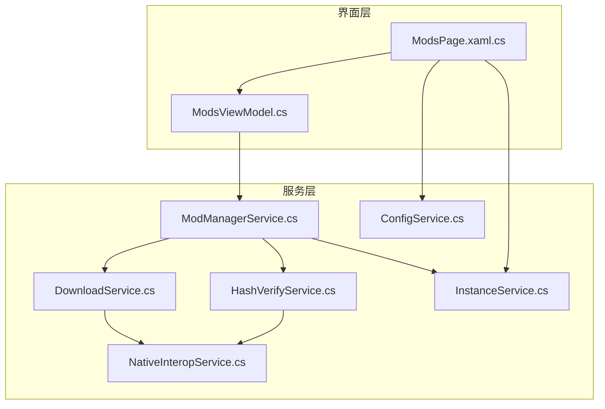
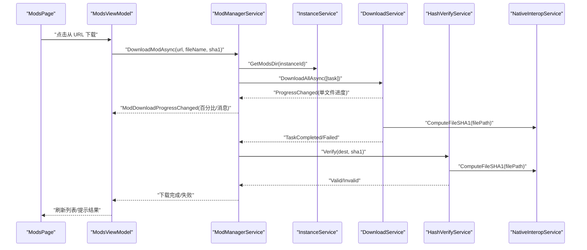
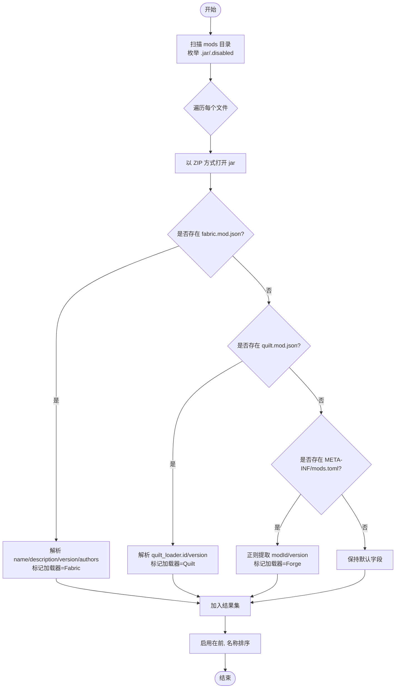
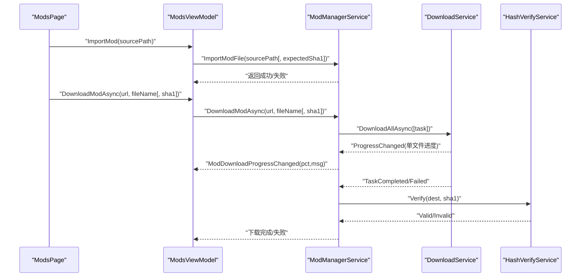
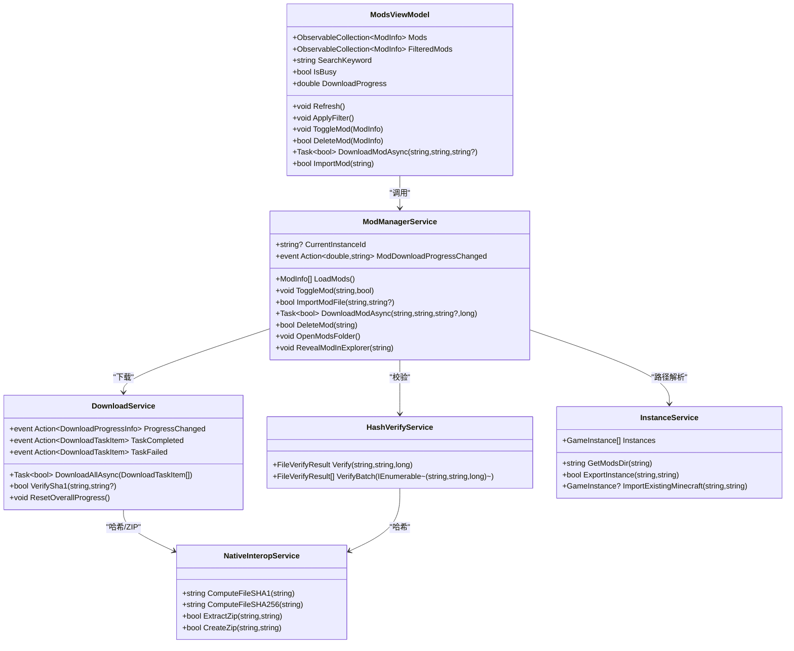

# 模组管理功能

<cite>
**本文引用的文件**   
- [ModManagerService.cs](file://src/FufuLauncher/Services/ModManagerService.cs)
- [ModsViewModel.cs](file://src/FufuLauncher/ViewModels/ModsViewModel.cs)
- [ModsPage.xaml.cs](file://src/FufuLauncher/Views/ModsPage.xaml.cs)
- [DownloadService.cs](file://src/FufuLauncher/Services/DownloadService.cs)
- [HashVerifyService.cs](file://src/FufuLauncher/Services/HashVerifyService.cs)
- [InstanceService.cs](file://src/FufuLauncher/Services/InstanceService.cs)
- [NativeInteropService.cs](file://src/FufuLauncher/Services/NativeInteropService.cs)
- [ConfigService.cs](file://src/FufuLauncher/Services/ConfigService.cs)
- [README.md](file://README.md)
</cite>

## 目录
1. [简介](#简介)
2. [项目结构](#项目结构)
3. [核心组件](#核心组件)
4. [架构总览](#架构总览)
5. [详细组件分析](#详细组件分析)
6. [依赖关系分析](#依赖关系分析)
7. [性能考量](#性能考量)
8. [故障排查指南](#故障排查指南)
9. [结论](#结论)
10. [附录](#附录)

## 简介
本文件为“模组管理功能”的完整技术文档，覆盖模组的发现、下载、验证与安装流程；说明模组文件格式支持与元数据解析机制；记录依赖管理与冲突检测现状；提供完整的 API 接口与使用示例；阐述版本控制与更新机制；包含完整性校验与安全验证；并说明配置导入导出与备份恢复能力。

## 项目结构
模组管理相关代码主要位于 WPF 启动器项目的 Services、ViewModels、Views 三层：
- Services：业务服务层（模组管理、下载、哈希校验、实例管理、原生互操作、配置）
- ViewModels：MVVM 视图模型（模组页状态与交互）
- Views：UI 页面（拖拽导入、URL 下载、列表展示与操作）

图表来源
- [ModsPage.xaml.cs:1-300](file://src/FufuLauncher/Views/ModsPage.xaml.cs#L1-L300)
- [ModsViewModel.cs:1-189](file://src/FufuLauncher/ViewModels/ModsViewModel.cs#L1-L189)
- [ModManagerService.cs:1-381](file://src/FufuLauncher/Services/ModManagerService.cs#L1-L381)
- [DownloadService.cs:1-592](file://src/FufuLauncher/Services/DownloadService.cs#L1-L592)
- [HashVerifyService.cs:1-85](file://src/FufuLauncher/Services/HashVerifyService.cs#L1-L85)
- [InstanceService.cs:1-253](file://src/FufuLauncher/Services/InstanceService.cs#L1-L253)
- [NativeInteropService.cs:1-214](file://src/FufuLauncher/Services/NativeInteropService.cs#L1-L214)
- [ConfigService.cs:1-152](file://src/FufuLauncher/Services/ConfigService.cs#L1-L152)

章节来源
- [README.md:1-87](file://README.md#L1-L87)

## 核心组件
- 模组管理服务（ModManagerService）：负责模组发现、元数据解析、启用/禁用、导入/删除、打开文件夹、从 URL 下载与完整性校验。
- 下载服务（DownloadService）：多线程分片断点续传下载引擎，支持 SHA1 校验、自动重试、源切换与全局进度。
- 哈希校验服务（HashVerifyService）：对单个或批量文件进行存在性、大小与 SHA1 校验。
- 实例服务（InstanceService）：多实例隔离目录管理，提供 mods/resourcepacks/shaderpacks/saves 等路径。
- 原生互操作服务（NativeInteropService）：C++ 原生 DLL 加速（SHA1/SHA256、ZIP），失败时回退到托管实现。
- 配置服务（ConfigService）：应用配置持久化（下载源、Java、JVM 参数等）。
- 视图模型与页面（ModsViewModel、ModsPage）：UI 绑定、搜索过滤、事件驱动刷新与用户交互。

章节来源
- [ModManagerService.cs:1-381](file://src/FufuLauncher/Services/ModManagerService.cs#L1-L381)
- [DownloadService.cs:1-592](file://src/FufuLauncher/Services/DownloadService.cs#L1-L592)
- [HashVerifyService.cs:1-85](file://src/FufuLauncher/Services/HashVerifyService.cs#L1-L85)
- [InstanceService.cs:1-253](file://src/FufuLauncher/Services/InstanceService.cs#L1-L253)
- [NativeInteropService.cs:1-214](file://src/FufuLauncher/Services/NativeInteropService.cs#L1-L214)
- [ConfigService.cs:1-152](file://src/FufuLauncher/Services/ConfigService.cs#L1-L152)
- [ModsViewModel.cs:1-189](file://src/FufuLauncher/ViewModels/ModsViewModel.cs#L1-L189)
- [ModsPage.xaml.cs:1-300](file://src/FufuLauncher/Views/ModsPage.xaml.cs#L1-L300)

## 架构总览
模组管理的整体调用链如下：
- UI 层通过 ModsViewModel 暴露命令与属性，驱动 ModManagerService。
- ModManagerService 调用 InstanceService 获取实例的 mods 目录，调用 DownloadService 执行下载，调用 HashVerifyService 完成完整性校验。
- DownloadService 与 HashVerifyService 通过 NativeInteropService 调用 C++ 原生 DLL 提升性能，失败则回退到托管实现。

图表来源
- [ModsPage.xaml.cs:104-126](file://src/FufuLauncher/Views/ModsPage.xaml.cs#L104-L126)
- [ModsViewModel.cs:147-171](file://src/FufuLauncher/ViewModels/ModsViewModel.cs#L147-L171)
- [ModManagerService.cs:253-324](file://src/FufuLauncher/Services/ModManagerService.cs#L253-L324)
- [DownloadService.cs:222-261](file://src/FufuLauncher/Services/DownloadService.cs#L222-L261)
- [HashVerifyService.cs:34-70](file://src/FufuLauncher/Services/HashVerifyService.cs#L34-L70)
- [NativeInteropService.cs:38-55](file://src/FufuLauncher/Services/NativeInteropService.cs#L38-L55)

## 详细组件分析

### 模组发现与元数据解析
- 发现范围：当前实例的 mods 目录下 .jar 与 .disabled 文件。
- 元数据解析：
  - Fabric：读取 fabric.mod.json 的 name/description/version/authors。
  - Quilt：读取 quilt.mod.json 的 quilt_loader.id/version。
  - Forge：读取 META-INF/mods.toml 中的 modId/version（正则提取）。
- 排序规则：已启用优先，其次按显示名（忽略大小写）排序。

图表来源
- [ModManagerService.cs:98-131](file://src/FufuLauncher/Services/ModManagerService.cs#L98-L131)
- [ModManagerService.cs:139-184](file://src/FufuLauncher/Services/ModManagerService.cs#L139-L184)

章节来源
- [ModManagerService.cs:98-131](file://src/FufuLauncher/Services/ModManagerService.cs#L98-L131)
- [ModManagerService.cs:139-184](file://src/FufuLauncher/Services/ModManagerService.cs#L139-L184)

### 启用/禁用与文件重命名
- 启用：将 .disabled 重命名为 .jar。
- 禁用：将 .jar 重命名为 .jar.disabled。
- 文件占用处理：多次重试移动，避免 IO 竞争。

章节来源
- [ModManagerService.cs:186-227](file://src/FufuLauncher/Services/ModManagerService.cs#L186-L227)

### 导入与下载流程
- 本地导入：复制 zip/jar 到 mods 目录，可选 SHA1 校验，失败则清理目标文件。
- URL 下载：复用 DownloadService，设置 Category=Mod 独立队列；下载完成后二次校验 SHA1；失败删除并重试。
- 进度反馈：订阅 DownloadService.ProgressChanged，转换为 ModDownloadProgressChanged 事件推送给 UI。

图表来源
- [ModsPage.xaml.cs:85-102](file://src/FufuLauncher/Views/ModsPage.xaml.cs#L85-L102)
- [ModsPage.xaml.cs:104-126](file://src/FufuLauncher/Views/ModsPage.xaml.cs#L104-L126)
- [ModsViewModel.cs:174-187](file://src/FufuLauncher/ViewModels/ModsViewModel.cs#L174-L187)
- [ModsViewModel.cs:147-171](file://src/FufuLauncher/ViewModels/ModsViewModel.cs#L147-L171)
- [ModManagerService.cs:230-250](file://src/FufuLauncher/Services/ModManagerService.cs#L230-L250)
- [ModManagerService.cs:253-324](file://src/FufuLauncher/Services/ModManagerService.cs#L253-L324)
- [DownloadService.cs:222-261](file://src/FufuLauncher/Services/DownloadService.cs#L222-L261)
- [HashVerifyService.cs:34-70](file://src/FufuLauncher/Services/HashVerifyService.cs#L34-L70)

章节来源
- [ModManagerService.cs:230-250](file://src/FufuLauncher/Services/ModManagerService.cs#L230-L250)
- [ModManagerService.cs:253-324](file://src/FufuLauncher/Services/ModManagerService.cs#L253-L324)
- [DownloadService.cs:222-261](file://src/FufuLauncher/Services/DownloadService.cs#L222-L261)
- [HashVerifyService.cs:34-70](file://src/FufuLauncher/Services/HashVerifyService.cs#L34-L70)

### 完整性校验与安全验证
- 校验入口：HashVerifyService.Verify 支持缺失检查、大小校验与 SHA1 校验。
- 下载内建校验：DownloadService 在每次下载后执行 SHA1 校验，失败自动删除并重下一次。
- 原生加速：NativeInteropService.ComputeFileSHA1 优先调用 C++ 原生实现，失败回退到托管实现。

章节来源
- [HashVerifyService.cs:34-70](file://src/FufuLauncher/Services/HashVerifyService.cs#L34-L70)
- [DownloadService.cs:319-334](file://src/FufuLauncher/Services/DownloadService.cs#L319-L334)
- [NativeInteropService.cs:38-55](file://src/FufuLauncher/Services/NativeInteropService.cs#L38-L55)

### 版本控制与更新机制
- 模组版本信息：从元数据中解析 version 字段（Fabric/Quilt/Forge），用于 UI 展示与筛选。
- 更新策略：当前未实现自动更新与版本比较逻辑；可通过重新下载同名文件覆盖实现手动更新。
- 建议扩展：可基于元数据 version 与远程索引对比，实现增量更新与冲突提示。

章节来源
- [ModManagerService.cs:139-184](file://src/FufuLauncher/Services/ModManagerService.cs#L139-L184)

### 依赖管理与冲突检测
- 现状：当前代码未实现模组依赖解析与冲突检测算法。
- 建议扩展：
  - 解析 fabric.mod.json/quilt.mod.json/mods.toml 中的依赖声明（如 requires、depends、conflicts）。
  - 构建依赖图并进行环检测与版本兼容性检查。
  - 在导入/下载阶段给出冲突警告或阻止安装。

章节来源
- [ModManagerService.cs:139-184](file://src/FufuLauncher/Services/ModManagerService.cs#L139-L184)

### 配置导入导出与备份恢复
- 实例级备份：InstanceService.ExportInstance 可将整个实例目录打包为 ZIP（含 mods、resourcepacks、shaderpacks 等）。
- 导入已有游戏：InstanceService.ImportExistingMinecraft 可将现有 .minecraft 目录作为新实例导入。
- 应用配置：ConfigService 负责 config.json 的读写（下载源、Java、JVM 参数等），可用于迁移与恢复环境设置。

章节来源
- [InstanceService.cs:194-238](file://src/FufuLauncher/Services/InstanceService.cs#L194-L238)
- [ConfigService.cs:101-150](file://src/FufuLauncher/Services/ConfigService.cs#L101-L150)

## 依赖关系分析
模组管理模块间的依赖关系如下：
- ModsViewModel 依赖 ModManagerService 与 InstanceService。
- ModManagerService 依赖 InstanceService、DownloadService、HashVerifyService。
- DownloadService 与 HashVerifyService 依赖 NativeInteropService。
- UI 层通过事件与回调与下载进度、任务完成状态联动。

图表来源
- [ModsViewModel.cs:1-189](file://src/FufuLauncher/ViewModels/ModsViewModel.cs#L1-L189)
- [ModManagerService.cs:1-381](file://src/FufuLauncher/Services/ModManagerService.cs#L1-L381)
- [DownloadService.cs:1-592](file://src/FufuLauncher/Services/DownloadService.cs#L1-L592)
- [HashVerifyService.cs:1-85](file://src/FufuLauncher/Services/HashVerifyService.cs#L1-L85)
- [InstanceService.cs:1-253](file://src/FufuLauncher/Services/InstanceService.cs#L1-L253)
- [NativeInteropService.cs:1-214](file://src/FufuLauncher/Services/NativeInteropService.cs#L1-L214)

## 性能考量
- 下载并发与分片：DownloadService 按类别独立信号量控制并发，大文件自动分片（>=8MB）提升吞吐。
- 断点续传：使用 .partial 临时文件与偏移写入，中断后可继续下载。
- 进度节流：全局进度事件节流 150ms，保证 UI 流畅同时不丢失最终触发。
- 原生加速：SHA1/SHA256 计算优先走 C++ 原生 DLL，失败回退托管实现，兼顾性能与可用性。
- 磁盘空间预检：下载前检查剩余空间，预留 1GB 缓冲，避免中途失败。

章节来源
- [DownloadService.cs:69-83](file://src/FufuLauncher/Services/DownloadService.cs#L69-L83)
- [DownloadService.cs:264-293](file://src/FufuLauncher/Services/DownloadService.cs#L264-L293)
- [DownloadService.cs:369-451](file://src/FufuLauncher/Services/DownloadService.cs#L369-L451)
- [DownloadService.cs:454-547](file://src/FufuLauncher/Services/DownloadService.cs#L454-L547)
- [NativeInteropService.cs:38-73](file://src/FufuLauncher/Services/NativeInteropService.cs#L38-L73)

## 故障排查指南
- 下载失败：
  - 检查网络与下载源（BMCLAPI/Mojang）切换是否生效。
  - 查看日志输出（App.WriteAppLog）确认错误原因与重试次数。
- 校验失败：
  - 确认预期 SHA1 是否正确；若失败会自动删除并重下一次。
- 文件被占用：
  - 启用/禁用时的文件移动会重试若干次，确保无其他进程锁定。
- 资源管理器打开失败：
  - explorer.exe 调用异常会被捕获并记录日志。

章节来源
- [DownloadService.cs:345-360](file://src/FufuLauncher/Services/DownloadService.cs#L345-L360)
- [ModManagerService.cs:213-227](file://src/FufuLauncher/Services/ModManagerService.cs#L213-L227)
- [ModManagerService.cs:364-379](file://src/FufuLauncher/Services/ModManagerService.cs#L364-L379)

## 结论
模组管理功能在当前实现中提供了完善的模组发现、元数据解析、启用/禁用、导入/下载、完整性校验与 UI 交互能力。依赖管理与冲突检测尚未实现，建议在后续迭代中补充。备份恢复与应用配置管理已具备基础能力，可满足日常使用需求。

## 附录

### 模组管理 API 参考
- ModManagerService
  - SetCurrentInstance(instanceId)
  - LoadMods() → List<ModInfo>
  - ToggleMod(filePath, enable)
  - ImportModFile(sourcePath, expectedSha1?) → bool
  - DownloadModAsync(url, fileName, sha1?, size?) → Task<bool>
  - DeleteMod(filePath) → bool
  - OpenModsFolder()
  - RevealModInExplorer(filePath)
- ModsViewModel
  - SetInstance(instanceId)
  - Refresh()
  - ApplyFilter()
  - ToggleMod(mod)
  - DeleteMod(mod) → bool
  - DownloadModAsync(url, fileName, sha1?) → Task<bool>
  - ImportMod(sourcePath) → bool
- DownloadService
  - DownloadAllAsync(tasks) → Task<bool>
  - VerifySha1(filePath, expectedSha1) → bool
  - ResetOverallProgress()
- HashVerifyService
  - Verify(filePath, expectedSha1, expectedSize?) → FileVerifyResult
  - VerifyBatch(files) → List<FileVerifyResult>
- InstanceService
  - GetModsDir(instanceId) → string
  - ExportInstance(instanceId, outputZipPath) → bool
  - ImportExistingMinecraft(minecraftDir, instanceName) → GameInstance?

章节来源
- [ModManagerService.cs:93-381](file://src/FufuLauncher/Services/ModManagerService.cs#L93-L381)
- [ModsViewModel.cs:84-187](file://src/FufuLauncher/ViewModels/ModsViewModel.cs#L84-L187)
- [DownloadService.cs:222-261](file://src/FufuLauncher/Services/DownloadService.cs#L222-L261)
- [HashVerifyService.cs:34-83](file://src/FufuLauncher/Services/HashVerifyService.cs#L34-L83)
- [InstanceService.cs:131-238](file://src/FufuLauncher/Services/InstanceService.cs#L131-L238)

### 使用示例（步骤说明）
- 从 URL 下载模组：
  - 在 ModsPage 输入直链 URL，系统推断文件名并调用 DownloadModAsync。
  - 下载过程中通过 ModDownloadProgressChanged 更新 UI 进度。
  - 下载完成后进行 SHA1 校验，失败则删除并重试。
- 拖拽导入模组：
  - 将 .jar/.zip 拖入页面，调用 ImportMod 复制到 mods 目录。
  - 可选择传入 expectedSha1 进行完整性校验。
- 启用/禁用模组：
  - 通过 ToggleMod 修改文件后缀（.jar ↔ .jar.disabled）。
- 打开模组目录：
  - 调用 OpenModsFolder 或 RevealModInExplorer 快速定位文件。

章节来源
- [ModsPage.xaml.cs:85-126](file://src/FufuLauncher/Views/ModsPage.xaml.cs#L85-L126)
- [ModsViewModel.cs:147-187](file://src/FufuLauncher/ViewModels/ModsViewModel.cs#L147-L187)
- [ModManagerService.cs:230-324](file://src/FufuLauncher/Services/ModManagerService.cs#L230-L324)