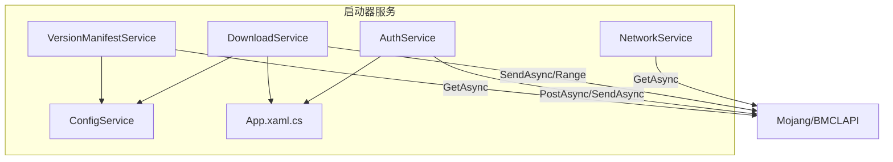
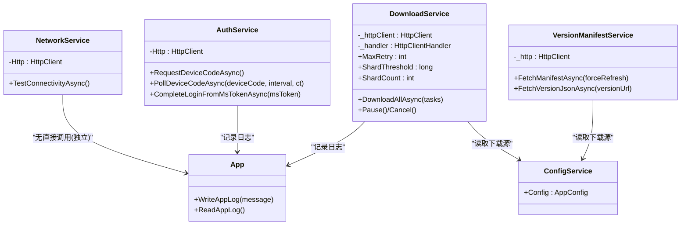
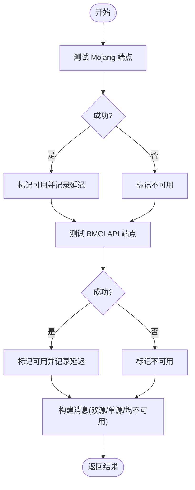
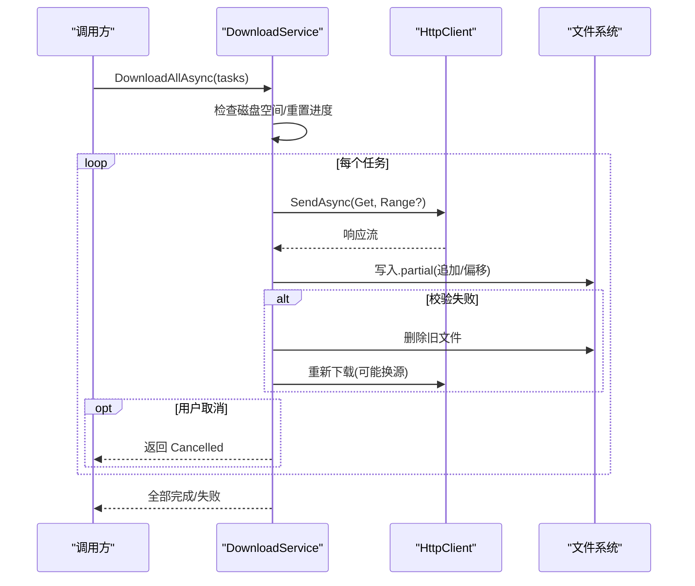
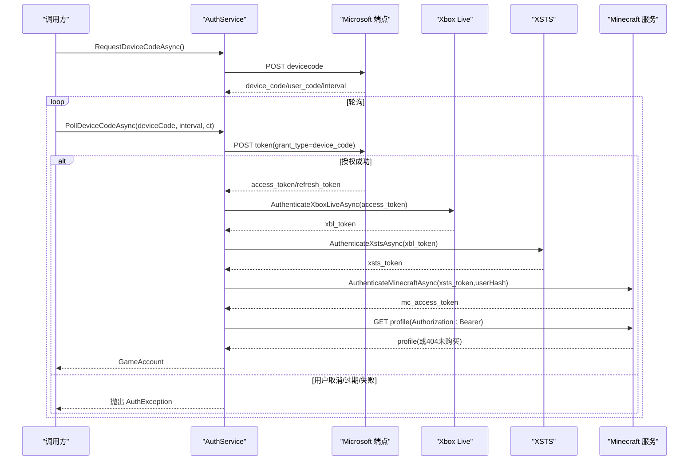
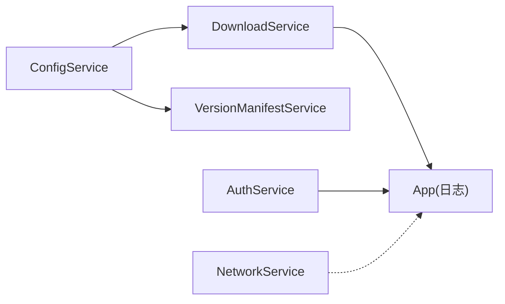

# HTTP 客户端配置

<cite>
**本文引用的文件**   
- [NetworkService.cs](file://src/FufuLauncher/Services/NetworkService.cs)
- [DownloadService.cs](file://src/FufuLauncher/Services/DownloadService.cs)
- [AuthService.cs](file://src/FufuLauncher/Services/AuthService.cs)
- [VersionManifestService.cs](file://src/FufuLauncher/Services/VersionManifestService.cs)
- [ConfigService.cs](file://src/FufuLauncher/Services/ConfigService.cs)
- [App.xaml.cs](file://src/FufuLauncher/App.xaml.cs)
</cite>

## 目录
1. [简介](#简介)
2. [项目结构](#项目结构)
3. [核心组件](#核心组件)
4. [架构总览](#架构总览)
5. [详细组件分析](#详细组件分析)
6. [依赖关系分析](#依赖关系分析)
7. [性能考虑](#性能考虑)
8. [故障排查指南](#故障排查指南)
9. [结论](#结论)
10. [附录](#附录)

## 简介
本文件面向“可爱的芙芙启动器”的 HTTP 客户端配置与使用，聚焦以下目标：
- HttpClient 实例的创建与配置（连接池、超时、重试）
- User-Agent 与 Accept 头配置要求（特别是 Microsoft API 的特殊要求）
- 异步请求处理模式（CancellationToken 的使用与取消操作）
- 请求头管理与身份验证令牌注入方式
- 错误处理与异常捕获最佳实践
- 日志记录与调试信息收集
- 性能优化建议与内存管理策略

## 项目结构
本项目在 Services 层中按职责划分多个服务，每个服务负责特定网络交互或业务逻辑。HTTP 相关能力主要分布在以下服务：
- NetworkService：轻量连通性检测，使用独立 HttpClient
- DownloadService：下载引擎，包含连接池、分片、断点续传、重试、源切换等
- AuthService：微软登录链路，统一设置 UA/Accept，并注入 Bearer 令牌
- VersionManifestService：版本清单拉取，具备短超时与双源回退
- ConfigService：应用配置（含下载源选择等）
- App.xaml.cs：全局异常捕获与日志缓冲写入

图表来源 
- [NetworkService.cs:18-29](file://src/FufuLauncher/Services/NetworkService.cs#L18-L29)
- [DownloadService.cs:99-114](file://src/FufuLauncher/Services/DownloadService.cs#L99-L114)
- [AuthService.cs:94-100](file://src/FufuLauncher/Services/AuthService.cs#L94-L100)
- [VersionManifestService.cs:184-189](file://src/FufuLauncher/Services/VersionManifestService.cs#L184-L189)
- [ConfigService.cs:13-48](file://src/FufuLauncher/Services/ConfigService.cs#L13-L48)
- [App.xaml.cs:33-60](file://src/FufuLauncher/App.xaml.cs#L33-L60)

章节来源
- [NetworkService.cs:1-95](file://src/FufuLauncher/Services/NetworkService.cs#L1-L95)
- [DownloadService.cs:1-114](file://src/FufuLauncher/Services/DownloadService.cs#L1-L114)
- [AuthService.cs:76-100](file://src/FufuLauncher/Services/AuthService.cs#L76-L100)
- [VersionManifestService.cs:172-189](file://src/FufuLauncher/Services/VersionManifestService.cs#L172-L189)
- [ConfigService.cs:13-48](file://src/FufuLauncher/Services/ConfigService.cs#L13-L48)
- [App.xaml.cs:33-60](file://src/FufuLauncher/App.xaml.cs#L33-L60)

## 核心组件
- NetworkService：为连通性检测提供轻量 HttpClient，设置较短超时与固定 User-Agent，避免被限流。
- DownloadService：下载引擎，封装 HttpClientHandler 与 HttpClient，配置 MaxConnectionsPerServer、超时、User-Agent；实现分片、断点续传、指数退避重试、SHA1 校验与源切换。
- AuthService：微软登录链路专用 HttpClient，统一设置 User-Agent 与 Accept，并在请求中注入 Bearer 令牌。
- VersionManifestService：版本清单获取，短超时 + 双源回退，保持与下载源一致的 URL 重写规则。
- ConfigService：集中管理下载源等配置，影响各服务的行为（如 BMCLAPI/Mojang 切换）。
- App.xaml.cs：全局异常捕获与日志缓冲写入，确保失败可追踪。

章节来源
- [NetworkService.cs:18-29](file://src/FufuLauncher/Services/NetworkService.cs#L18-L29)
- [DownloadService.cs:99-114](file://src/FufuLauncher/Services/DownloadService.cs#L99-L114)
- [AuthService.cs:94-100](file://src/FufuLauncher/Services/AuthService.cs#L94-L100)
- [VersionManifestService.cs:184-189](file://src/FufuLauncher/Services/VersionManifestService.cs#L184-L189)
- [ConfigService.cs:13-48](file://src/FufuLauncher/Services/ConfigService.cs#L13-L48)
- [App.xaml.cs:33-60](file://src/FufuLauncher/App.xaml.cs#L33-L60)

## 架构总览
下图展示各服务如何基于 HttpClient 进行网络访问，以及配置与日志的协作关系。

图表来源 
- [NetworkService.cs:18-29](file://src/FufuLauncher/Services/NetworkService.cs#L18-L29)
- [DownloadService.cs:99-114](file://src/FufuLauncher/Services/DownloadService.cs#L99-L114)
- [AuthService.cs:94-100](file://src/FufuLauncher/Services/AuthService.cs#L94-L100)
- [VersionManifestService.cs:184-189](file://src/FufuLauncher/Services/VersionManifestService.cs#L184-L189)
- [ConfigService.cs:13-48](file://src/FufuLauncher/Services/ConfigService.cs#L13-L48)
- [App.xaml.cs:33-60](file://src/FufuLauncher/App.xaml.cs#L33-L60)

## 详细组件分析

### NetworkService：连通性检测与轻量 HttpClient
- 连接池与超时：静态 HttpClient，Timeout=8s，适合快速探测。
- 请求头：默认 User-Agent 设置为“FufuLauncher/1.0.5.1 (Windows)”，避免被 Mojang/BMCLAPI 限流。
- 异步与取消：内部使用 async/await，未暴露 CancellationToken（仅用于简单探测）。
- 错误处理：捕获异常并返回连通状态与延迟。

图表来源 
- [NetworkService.cs:34-76](file://src/FufuLauncher/Services/NetworkService.cs#L34-L76)

章节来源
- [NetworkService.cs:18-29](file://src/FufuLauncher/Services/NetworkService.cs#L18-L29)
- [NetworkService.cs:34-76](file://src/FufuLauncher/Services/NetworkService.cs#L34-L76)

### DownloadService：下载引擎与 HttpClient 配置
- 连接池与超时：
  - HttpClientHandler.MaxConnectionsPerServer = 64
  - HttpClient.Timeout = 5 分钟
- 请求头：默认 User-Agent 设置为“FufuLauncher/1.0.5.1 (Windows)”
- 重试机制：指数退避（1s, 2s, 4s...），最大重试次数可配置
- 分片与断点续传：>=8MB 自动分片，支持 .partial 临时文件与 Range 请求
- 源切换：根据配置与尝试次数自动降级到 BMCLAPI
- 取消与异步：通过 CancellationTokenSource 覆盖全局取消，子任务使用 per-request CTS 保护首字节超时
- 校验：完成后 SHA1 校验，失败则删除并重下一次

图表来源 
- [DownloadService.cs:99-114](file://src/FufuLauncher/Services/DownloadService.cs#L99-L114)
- [DownloadService.cs:295-366](file://src/FufuLauncher/Services/DownloadService.cs#L295-L366)
- [DownloadService.cs:369-451](file://src/FufuLauncher/Services/DownloadService.cs#L369-L451)
- [DownloadService.cs:454-547](file://src/FufuLauncher/Services/DownloadService.cs#L454-L547)

章节来源
- [DownloadService.cs:99-114](file://src/FufuLauncher/Services/DownloadService.cs#L99-L114)
- [DownloadService.cs:222-261](file://src/FufuLauncher/Services/DownloadService.cs#L222-L261)
- [DownloadService.cs:295-366](file://src/FufuLauncher/Services/DownloadService.cs#L295-L366)
- [DownloadService.cs:369-451](file://src/FufuLauncher/Services/DownloadService.cs#L369-L451)
- [DownloadService.cs:454-547](file://src/FufuLauncher/Services/DownloadService.cs#L454-L547)

### AuthService：微软登录链路与令牌注入
- HttpClient 配置：
  - Timeout = 30s
  - DefaultRequestHeaders.User-Agent = “FufuLauncher/1.0.5.1 (Windows)”
  - DefaultRequestHeaders.Accept = “application/json”
- 令牌注入：
  - 查询玩家资料时，Authorization: Bearer <mc_access_token>
- 异步与取消：
  - PollDeviceCodeAsync 接受 CancellationToken，轮询期间支持取消
- 错误处理：
  - 区分网络异常、设备码过期、用户拒绝、令牌交换失败等
  - 对 JSON 解析失败进行截断日志记录

图表来源 
- [AuthService.cs:94-100](file://src/FufuLauncher/Services/AuthService.cs#L94-L100)
- [AuthService.cs:160-192](file://src/FufuLauncher/Services/AuthService.cs#L160-L192)
- [AuthService.cs:198-265](file://src/FufuLauncher/Services/AuthService.cs#L198-L265)
- [AuthService.cs:343-398](file://src/FufuLauncher/Services/AuthService.cs#L343-L398)
- [AuthService.cs:609-643](file://src/FufuLauncher/Services/AuthService.cs#L609-L643)

章节来源
- [AuthService.cs:94-100](file://src/FufuLauncher/Services/AuthService.cs#L94-L100)
- [AuthService.cs:160-192](file://src/FufuLauncher/Services/AuthService.cs#L160-L192)
- [AuthService.cs:198-265](file://src/FufuLauncher/Services/AuthService.cs#L198-L265)
- [AuthService.cs:343-398](file://src/FufuLauncher/Services/AuthService.cs#L343-L398)
- [AuthService.cs:609-643](file://src/FufuLauncher/Services/AuthService.cs#L609-L643)

### VersionManifestService：版本清单与短超时回退
- HttpClient 配置：Timeout = 8s，User-Agent 设置一致
- 双源回退：优先 BMCLAPI/Mojang，失败自动切换另一源
- URL 重写：与 DownloadService 保持一致的规则，保证下载源一致性

章节来源
- [VersionManifestService.cs:184-189](file://src/FufuLauncher/Services/VersionManifestService.cs#L184-L189)
- [VersionManifestService.cs:205-255](file://src/FufuLauncher/Services/VersionManifestService.cs#L205-L255)
- [VersionManifestService.cs:274-292](file://src/FufuLauncher/Services/VersionManifestService.cs#L274-L292)

### ConfigService：配置项对 HTTP 行为的影响
- DownloadSource：控制首选源（BMCLAPI/Mojang），影响下载与清单拉取
- 其他配置（Java、JVM、背景等）不直接影响 HTTP，但影响整体体验

章节来源
- [ConfigService.cs:13-48](file://src/FufuLauncher/Services/ConfigService.cs#L13-L48)

### App.xaml.cs：全局异常与日志
- 全局异常捕获：UI 线程、域级、Task 未观察异常
- 日志缓冲：ConcurrentQueue + Timer 批量写入 app.log，避免高频 IO 阻塞

章节来源
- [App.xaml.cs:33-60](file://src/FufuLauncher/App.xaml.cs#L33-L60)
- [App.xaml.cs:180-206](file://src/FufuLauncher/App.xaml.cs#L180-L206)

## 依赖关系分析
- DownloadService 与 VersionManifestService 都依赖 ConfigService 的 DownloadSource 决定源切换与 URL 重写
- AuthService 独立于下载流程，但同样受 User-Agent/Accept 配置影响
- NetworkService 独立运行，用于快速连通性检测
- 所有服务通过 App.WriteAppLog 输出日志，便于问题定位

图表来源 
- [ConfigService.cs:13-48](file://src/FufuLauncher/Services/ConfigService.cs#L13-L48)
- [DownloadService.cs:99-114](file://src/FufuLauncher/Services/DownloadService.cs#L99-L114)
- [VersionManifestService.cs:184-189](file://src/FufuLauncher/Services/VersionManifestService.cs#L184-L189)
- [App.xaml.cs:33-60](file://src/FufuLauncher/App.xaml.cs#L33-L60)

章节来源
- [ConfigService.cs:13-48](file://src/FufuLauncher/Services/ConfigService.cs#L13-L48)
- [DownloadService.cs:99-114](file://src/FufuLauncher/Services/DownloadService.cs#L99-L114)
- [VersionManifestService.cs:184-189](file://src/FufuLauncher/Services/VersionManifestService.cs#L184-L189)
- [App.xaml.cs:33-60](file://src/FufuLauncher/App.xaml.cs#L33-L60)

## 性能考虑
- 连接池与并发
  - DownloadService 使用 MaxConnectionsPerServer=64，提升高并发下载吞吐
  - 分片下载将大文件拆分为多 Range 请求，充分利用带宽
- 超时策略
  - 连通性检测 8s 快速失败
  - 下载 5 分钟长超时，适配大文件
  - 认证 30s 首字节超时保护，避免卡死
- 重试与退避
  - 指数退避降低服务端压力，提高成功率
- 内存与 I/O
  - 使用 64KB 缓冲与异步流式读写，减少内存占用
  - .partial 临时文件与断点续传避免重复下载
- 日志与节流
  - 全局进度事件节流 150ms，避免 UI 卡顿
  - 日志批量写入，降低 IO 开销

[本节为通用指导，不直接分析具体文件]

## 故障排查指南
- 常见错误分类
  - 网络异常：HttpRequestException，需检查网络与代理
  - 设备码过期：AuthError.DeviceCodeExpired，提示重新登录
  - 用户取消：OperationCanceledException，正常流程中断
  - 令牌交换失败：AuthError.TokenExchangeFailed，查看日志中的响应片段
  - 未购买 Minecraft：404 表示账号未拥有 Java 版
- 日志定位
  - 使用 App.ReadAppLog() 获取完整日志
  - 关注 “[登录]”、“[下载]” 前缀的日志行
- 常见问题
  - 缺少 User-Agent 导致 401/403：确认已设置 UA
  - Accept 头缺失：确保 application/json
  - 下载失败：检查磁盘空间、网络稳定性与服务端是否支持 Range

章节来源
- [AuthService.cs:160-192](file://src/FufuLauncher/Services/AuthService.cs#L160-L192)
- [AuthService.cs:198-265](file://src/FufuLauncher/Services/AuthService.cs#L198-L265)
- [AuthService.cs:609-643](file://src/FufuLauncher/Services/AuthService.cs#L609-L643)
- [App.xaml.cs:33-60](file://src/FufuLauncher/App.xaml.cs#L33-L60)

## 结论
本项目的 HTTP 客户端配置围绕“稳定、可控、可观测”展开：
- 统一的 User-Agent/Accept 配置满足 Microsoft API 特殊要求
- 分层超时与重试策略保障鲁棒性
- 分片与断点续传提升下载效率与可靠性
- 完善的日志与异常捕获便于问题定位
- 合理的连接池与内存管理确保性能与稳定性

[本节为总结，不直接分析具体文件]

## 附录
- 关键配置项速览
  - DownloadSource：BMCLAPI/Mojang
  - MaxRetry：下载重试次数
  - ShardThreshold：分片阈值（8MB）
  - ShardCount：分片数量
  - Timeout：各服务独立设置（8s/30s/5min）
- 最佳实践
  - 始终设置 User-Agent 与 Accept
  - 使用 CancellationToken 控制异步取消
  - 对敏感响应体进行截断日志记录
  - 优先使用流式读写与缓冲，避免大对象驻留

[本节为补充说明，不直接分析具体文件]