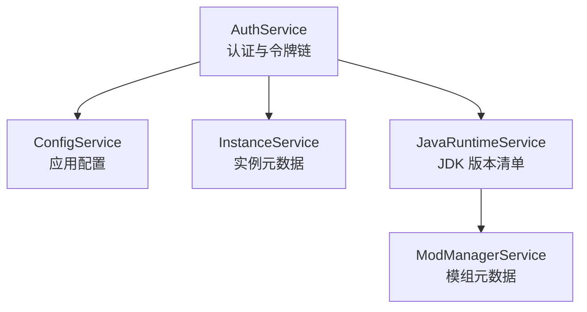
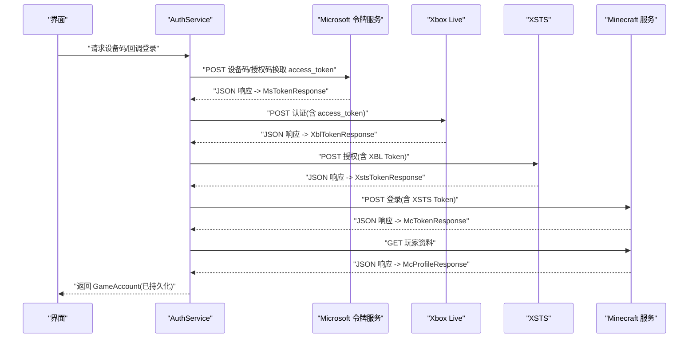
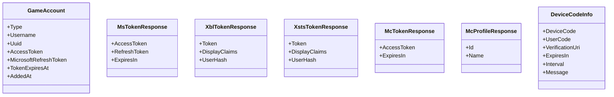
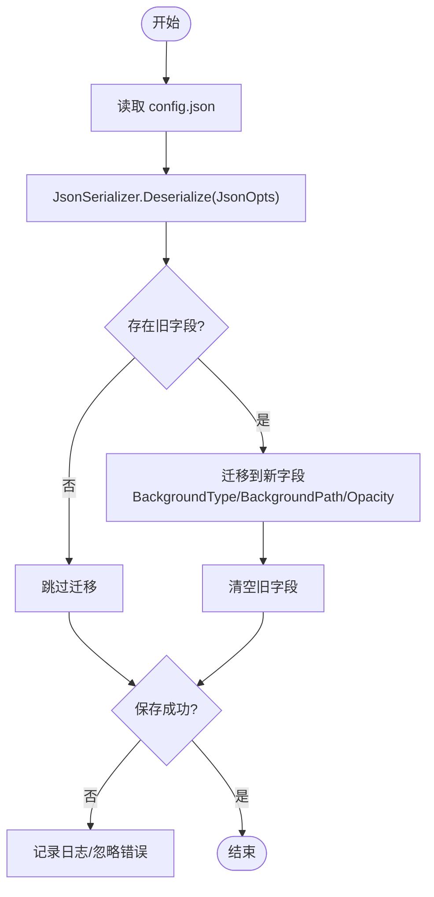
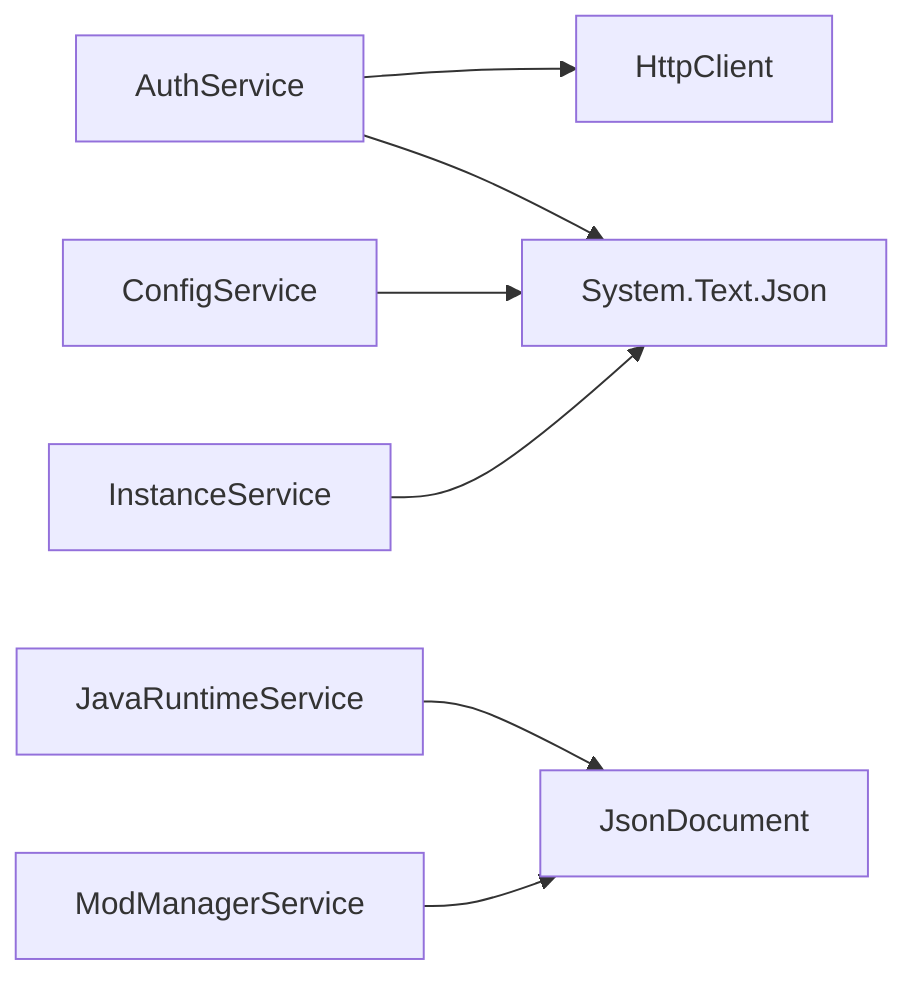

# JSON 序列化与反序列化

<cite>
**本文引用的文件**   
- [AuthService.cs](file://src/FufuLauncher/Services/AuthService.cs)
- [ConfigService.cs](file://src/FufuLauncher/Services/ConfigService.cs)
- [InstanceService.cs](file://src/FufuLauncher/Services/InstanceService.cs)
- [JavaRuntimeService.cs](file://src/FufuLauncher/Services/JavaRuntimeService.cs)
- [ModManagerService.cs](file://src/FufuLauncher/Services/ModManagerService.cs)
</cite>

## 目录
1. [简介](#简介)
2. [项目结构](#项目结构)
3. [核心组件](#核心组件)
4. [架构总览](#架构总览)
5. [详细组件分析](#详细组件分析)
6. [依赖关系分析](#依赖关系分析)
7. [性能考虑](#性能考虑)
8. [故障排查指南](#故障排查指南)
9. [结论](#结论)
10. [附录：模型字段说明](#附录模型字段说明)

## 简介
本文件围绕“可爱的芙芙启动器”中 System.Text.Json 的序列化与反序列化实践，系统性梳理 JsonSerializerOptions 配置、自定义属性映射（JsonPropertyName）、响应模型定义与最佳实践。重点覆盖以下方面：
- 统一使用 System.Text.Json 进行 JSON 读写
- 通过 JsonPropertyName 精确映射第三方 API 字段名
- 针对大对象、流式解析与内存管理的优化策略
- 认证链路中的关键响应模型：MsTokenResponse、XblTokenResponse、XstsTokenResponse、McTokenResponse、GameAccount 等

## 项目结构
本项目在多个服务层中使用 System.Text.Json 完成配置、账号、实例、运行时与模组元数据的持久化与网络交互。关键位置如下：
- 认证与令牌链：AuthService.cs
- 应用配置持久化：ConfigService.cs
- 游戏实例元数据：InstanceService.cs
- Java 运行时清单解析：JavaRuntimeService.cs
- 模组包内元数据解析：ModManagerService.cs

图表来源
- [AuthService.cs:1-683](file://src/FufuLauncher/Services/AuthService.cs#L1-L683)
- [ConfigService.cs:1-152](file://src/FufuLauncher/Services/ConfigService.cs#L1-L152)
- [InstanceService.cs:1-253](file://src/FufuLauncher/Services/InstanceService.cs#L1-L253)
- [JavaRuntimeService.cs:1-527](file://src/FufuLauncher/Services/JavaRuntimeService.cs#L1-L527)
- [ModManagerService.cs:140-339](file://src/FufuLauncher/Services/ModManagerService.cs#L140-L339)

章节来源
- [AuthService.cs:1-683](file://src/FufuLauncher/Services/AuthService.cs#L1-L683)
- [ConfigService.cs:1-152](file://src/FufuLauncher/Services/ConfigService.cs#L1-L152)
- [InstanceService.cs:1-253](file://src/FufuLauncher/Services/InstanceService.cs#L1-L253)
- [JavaRuntimeService.cs:1-527](file://src/FufuLauncher/Services/JavaRuntimeService.cs#L1-L527)
- [ModManagerService.cs:140-339](file://src/FufuLauncher/Services/ModManagerService.cs#L140-L339)

## 核心组件
- AuthService：负责微软设备码/回调登录、XBL/XSTS/MC 令牌链、玩家资料获取，以及账号持久化。大量使用 System.Text.Json 对响应体进行反序列化和请求体序列化。
- ConfigService：集中管理应用配置，提供统一的 JsonSerializerOptions，支持忽略空值、缩进输出。
- InstanceService：管理游戏实例元数据 instance.json，使用统一选项进行序列化/反序列化。
- JavaRuntimeService：拉取 Adoptium/Huaweicloud 版本清单，使用 JsonDocument 进行流式解析，避免全量对象分配。
- ModManagerService：从模组 jar 包内读取 fabric.mod.json/quilt.mod.json/mods.toml，使用 JsonDocument 解析关键字段。

章节来源
- [AuthService.cs:1-683](file://src/FufuLauncher/Services/AuthService.cs#L1-L683)
- [ConfigService.cs:1-152](file://src/FufuLauncher/Services/ConfigService.cs#L1-L152)
- [InstanceService.cs:1-253](file://src/FufuLauncher/Services/InstanceService.cs#L1-L253)
- [JavaRuntimeService.cs:1-527](file://src/FufuLauncher/Services/JavaRuntimeService.cs#L1-L527)
- [ModManagerService.cs:140-339](file://src/FufuLauncher/Services/ModManagerService.cs#L140-L339)

## 架构总览
下图展示了认证流程中各服务的调用顺序与 JSON 序列化点。

图表来源
- [AuthService.cs:158-265](file://src/FufuLauncher/Services/AuthService.cs#L158-L265)
- [AuthService.cs:488-502](file://src/FufuLauncher/Services/AuthService.cs#L488-L502)
- [AuthService.cs:504-541](file://src/FufuLauncher/Services/AuthService.cs#L504-L541)
- [AuthService.cs:543-575](file://src/FufuLauncher/Services/AuthService.cs#L543-L575)
- [AuthService.cs:577-606](file://src/FufuLauncher/Services/AuthService.cs#L577-L606)
- [AuthService.cs:608-643](file://src/FufuLauncher/Services/AuthService.cs#L608-L643)

## 详细组件分析

### AuthService：认证与令牌链
- 使用 System.Text.Json 将 HTTP 响应体反序列化为强类型模型，如 MsTokenResponse、XblTokenResponse、XstsTokenResponse、McTokenResponse、McProfileResponse。
- 使用 JsonPropertyName 精确映射第三方 API 字段名（例如 access_token、expires_in、Token、DisplayClaims 等）。
- 使用 JsonDocument 对部分响应进行选择性解析，减少对象分配与异常开销。
- 账号持久化：SaveAccount 使用 WriteIndented=true 生成可读 JSON；LoadAccounts 批量反序列化并容错损坏文件。

图表来源
- [AuthService.cs:50-74](file://src/FufuLauncher/Services/AuthService.cs#L50-L74)
- [AuthService.cs:646-681](file://src/FufuLauncher/Services/AuthService.cs#L646-L681)

章节来源
- [AuthService.cs:123-145](file://src/FufuLauncher/Services/AuthService.cs#L123-L145)
- [AuthService.cs:158-265](file://src/FufuLauncher/Services/AuthService.cs#L158-L265)
- [AuthService.cs:488-502](file://src/FufuLauncher/Services/AuthService.cs#L488-L502)
- [AuthService.cs:504-541](file://src/FufuLauncher/Services/AuthService.cs#L504-L541)
- [AuthService.cs:543-575](file://src/FufuLauncher/Services/AuthService.cs#L543-L575)
- [AuthService.cs:577-606](file://src/FufuLauncher/Services/AuthService.cs#L577-L606)
- [AuthService.cs:608-643](file://src/FufuLauncher/Services/AuthService.cs#L608-L643)
- [AuthService.cs:646-681](file://src/FufuLauncher/Services/AuthService.cs#L646-L681)

### ConfigService：配置持久化与迁移
- 集中定义 JsonSerializerOptions：WriteIndented=true、DefaultIgnoreCondition=JsonIgnoreCondition.WhenWritingNull，确保配置文件可读且精简。
- 使用 JsonPropertyName 兼容旧字段（如 BaseImagePath、OverlayPath 等），并在加载时执行迁移逻辑，写入新字段后清空旧字段。
- 保存失败不抛出异常，保证应用稳定性。

图表来源
- [ConfigService.cs:90-152](file://src/FufuLauncher/Services/ConfigService.cs#L90-L152)

章节来源
- [ConfigService.cs:1-152](file://src/FufuLauncher/Services/ConfigService.cs#L1-L152)

### InstanceService：实例元数据
- 使用统一 JsonSerializerOptions（缩进+忽略空值）对 instance.json 进行序列化/反序列化。
- 加载时遍历实例目录，逐个解析元数据并填充 Id。

章节来源
- [InstanceService.cs:51-123](file://src/FufuLauncher/Services/InstanceService.cs#L51-L123)

### JavaRuntimeService：JDK 版本清单解析
- 使用 JsonDocument 流式解析 Adoptium 可用版本列表，提取 available_releases 与 available_lts_releases 数组，避免全量对象分配。
- 对华为云镜像目录页进行 HTML 解析以动态确定最新版本 zip 文件名。

章节来源
- [JavaRuntimeService.cs:160-191](file://src/FufuLauncher/Services/JavaRuntimeService.cs#L160-L191)

### ModManagerService：模组元数据解析
- 从模组 jar 包内读取 fabric.mod.json、quilt.mod.json、mods.toml，使用 JsonDocument 解析关键字段（名称、描述、版本、作者等）。
- 对 Forge 使用正则匹配 toml 字段，Fabric/Quilt 使用 JSON 字段映射。

章节来源
- [ModManagerService.cs:140-184](file://src/FufuLauncher/Services/ModManagerService.cs#L140-L184)

## 依赖关系分析
- AuthService 依赖 HttpClient 与 System.Text.Json，用于网络请求与 JSON 处理。
- ConfigService、InstanceService 共享相同的 JsonSerializerOptions 模式，提升一致性与可维护性。
- JavaRuntimeService、ModManagerService 采用 JsonDocument 进行轻量级解析，降低内存占用。

图表来源
- [AuthService.cs:1-683](file://src/FufuLauncher/Services/AuthService.cs#L1-L683)
- [ConfigService.cs:1-152](file://src/FufuLauncher/Services/ConfigService.cs#L1-L152)
- [InstanceService.cs:1-253](file://src/FufuLauncher/Services/InstanceService.cs#L1-L253)
- [JavaRuntimeService.cs:1-527](file://src/FufuLauncher/Services/JavaRuntimeService.cs#L1-L527)
- [ModManagerService.cs:140-339](file://src/FufuLauncher/Services/ModManagerService.cs#L140-L339)

章节来源
- [AuthService.cs:1-683](file://src/FufuLauncher/Services/AuthService.cs#L1-L683)
- [ConfigService.cs:1-152](file://src/FufuLauncher/Services/ConfigService.cs#L1-L152)
- [InstanceService.cs:1-253](file://src/FufuLauncher/Services/InstanceService.cs#L1-L253)
- [JavaRuntimeService.cs:1-527](file://src/FufuLauncher/Services/JavaRuntimeService.cs#L1-L527)
- [ModManagerService.cs:140-339](file://src/FufuLauncher/Services/ModManagerService.cs#L140-L339)

## 性能考虑
- 使用 JsonDocument 进行流式解析：适用于大对象或仅需少量字段的场景（如 Adoptium 版本列表、模组元数据），减少临时对象分配与 GC 压力。
- 统一 JsonSerializerOptions：集中配置 WriteIndented、DefaultIgnoreCondition，避免重复创建与不一致行为。
- 忽略空值：WhenWritingNull 可减少配置文件体积，提高可读性与传输效率。
- 分片下载与大文件：JDK zip 启用分片下载，结合原生解压优先，提升 I/O 性能。
- 超时与重试：HTTP 客户端设置合理超时，网络异常时进行有限重试，避免长时间阻塞。

[本节为通用指导，不直接分析具体文件]

## 故障排查指南
- 认证失败：检查网络连通性、设备码是否过期、用户是否取消授权；查看日志中的错误枚举（Network、DeviceCodeExpired、Cancelled、TokenExchangeFailed）。
- 令牌交换失败：确认 Microsoft/XBL/XSTS/MC 各端点返回状态码与响应体是否包含必要字段（access_token、Token 等）。
- 玩家资料查询失败：404 表示未购买 Minecraft；其他错误按网络/未知处理。
- 配置加载失败：若 config.json 损坏，回退到默认配置；旧字段迁移逻辑会尝试恢复背景相关设置。
- 实例加载失败：忽略损坏实例，继续加载其余实例。

章节来源
- [AuthService.cs:158-265](file://src/FufuLauncher/Services/AuthService.cs#L158-L265)
- [AuthService.cs:488-502](file://src/FufuLauncher/Services/AuthService.cs#L488-L502)
- [AuthService.cs:504-541](file://src/FufuLauncher/Services/AuthService.cs#L504-L541)
- [AuthService.cs:543-575](file://src/FufuLauncher/Services/AuthService.cs#L543-L575)
- [AuthService.cs:577-606](file://src/FufuLauncher/Services/AuthService.cs#L577-L606)
- [AuthService.cs:608-643](file://src/FufuLauncher/Services/AuthService.cs#L608-L643)
- [ConfigService.cs:101-152](file://src/FufuLauncher/Services/ConfigService.cs#L101-L152)
- [InstanceService.cs:72-92](file://src/FufuLauncher/Services/InstanceService.cs#L72-L92)

## 结论
本项目在 System.Text.Json 的使用上遵循了清晰一致的实践：强类型模型配合 JsonPropertyName 精确映射、统一 JsonSerializerOptions 提升一致性、JsonDocument 流式解析优化大对象处理。这些做法有效提升了认证链路的可靠性、配置与元数据的可维护性，以及在大规模数据下的性能表现。建议后续扩展继续保持该模式，并在需要时引入缓存与更细粒度的错误分类。

[本节为总结性内容，不直接分析具体文件]

## 附录：模型字段说明
- GameAccount：账号实体，包含类型、用户名、UUID、访问令牌、刷新令牌、过期时间、添加时间等。
- MsTokenResponse：微软令牌响应，包含 access_token、refresh_token、expires_in。
- XblTokenResponse：Xbox Live 令牌响应，包含 Token、DisplayClaims（含 xui 列表与 UserHash）。
- XstsTokenResponse：XSTS 令牌响应，结构与 XblTokenResponse 类似。
- McTokenResponse：Minecraft 令牌响应，包含 access_token、expires_in。
- McProfileResponse：玩家资料响应，包含 id、name。
- DeviceCodeInfo：设备码信息，包含 device_code、user_code、verification_uri、expires_in、interval、message。

章节来源
- [AuthService.cs:50-74](file://src/FufuLauncher/Services/AuthService.cs#L50-L74)
- [AuthService.cs:646-681](file://src/FufuLauncher/Services/AuthService.cs#L646-L681)