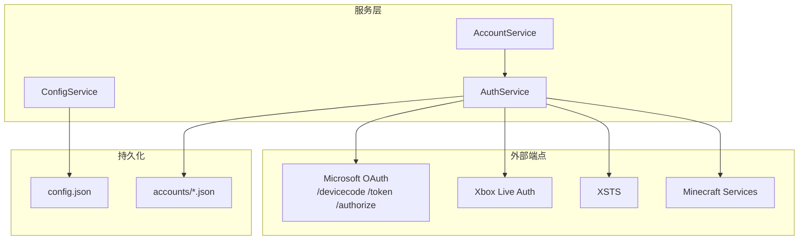
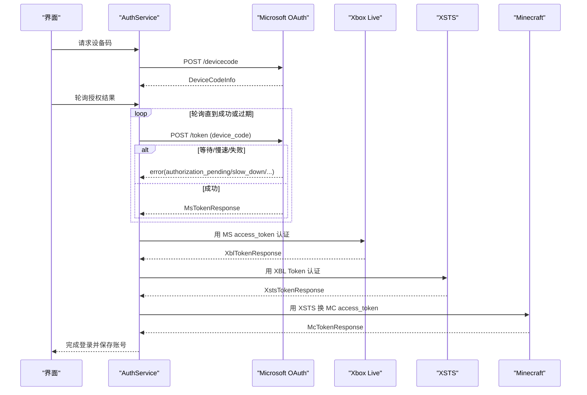
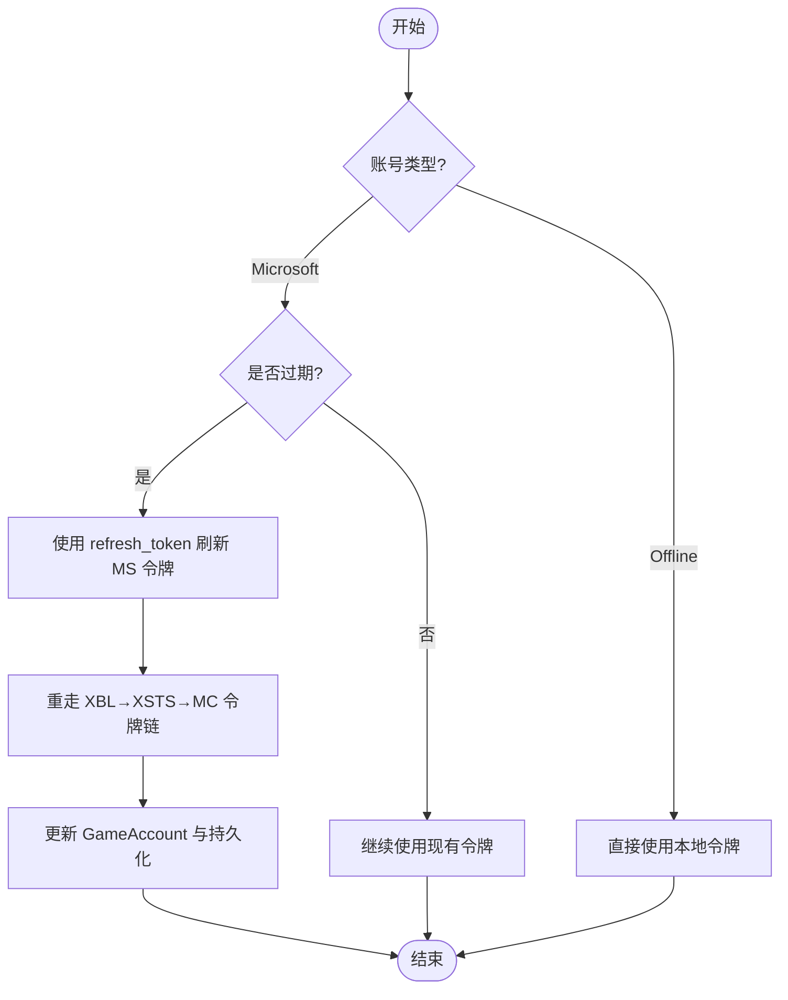
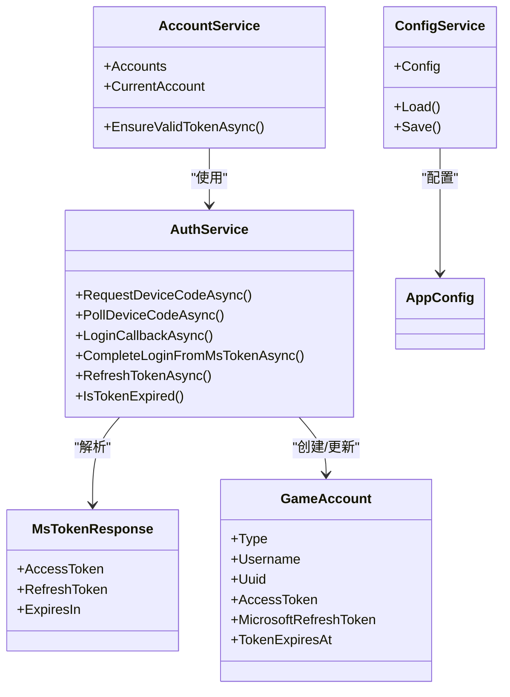

# Microsoft OAuth 令牌模型

<cite>
**本文引用的文件**   
- [AuthService.cs](file://src/FufuLauncher/Services/AuthService.cs)
- [AccountService.cs](file://src/FufuLauncher/Services/AccountService.cs)
- [ConfigService.cs](file://src/FufuLauncher/Services/ConfigService.cs)
- [config.json](file://Start/appmcGAME/config.json)
- [43381ea021e59839958af459800e4d11.json](file://Start/appmcGAME/accounts/43381ea021e59839958af459800e4d11.json)
</cite>

## 目录
1. [简介](#简介)
2. [项目结构](#项目结构)
3. [核心组件](#核心组件)
4. [架构总览](#架构总览)
5. [详细组件分析](#详细组件分析)
6. [依赖关系分析](#依赖关系分析)
7. [性能与可靠性](#性能与可靠性)
8. [故障排查指南](#故障排查指南)
9. [结论](#结论)
10. [附录](#附录)

## 简介
本文件围绕 Microsoft OAuth 2.0 的令牌响应模型，聚焦 MsTokenResponse 类的结构与字段含义，包括 access_token、refresh_token 与 expires_in。文档解释这些字段在微软 OAuth 流程中的作用与使用场景，给出完整的 JSON 响应示例与字段验证规则，并说明令牌生命周期管理与自动刷新机制的实现方式。

## 项目结构
本项目采用服务层组织认证与账号管理逻辑：
- AuthService：实现 Microsoft OAuth 设备码登录、本地回调登录、完整令牌链（MS → XBL → XSTS → Minecraft）以及令牌刷新。
- AccountService：负责多账号列表、切换、删除与启动前校验 token 并自动刷新。
- ConfigService：加载/保存应用配置，包含 Microsoft ClientId、AuthMode、回调端口等。
- 持久化数据：accounts 目录下以 UUID.json 存储账号信息；config.json 存储应用配置。

图表来源
- [AuthService.cs:76-121](file://src/FufuLauncher/Services/AuthService.cs#L76-L121)
- [AccountService.cs:12-26](file://src/FufuLauncher/Services/AccountService.cs#L12-L26)
- [ConfigService.cs:88-100](file://src/FufuLauncher/Services/ConfigService.cs#L88-L100)

章节来源
- [AuthService.cs:1-121](file://src/FufuLauncher/Services/AuthService.cs#L1-L121)
- [AccountService.cs:1-26](file://src/FufuLauncher/Services/AccountService.cs#L1-L26)
- [ConfigService.cs:1-100](file://src/FufuLauncher/Services/ConfigService.cs#L1-L100)

## 核心组件
- MsTokenResponse：表示 Microsoft OAuth 令牌响应，包含 access_token、refresh_token、expires_in。
- GameAccount：表示一个游戏账号，包含类型、用户名、UUID、访问令牌、Microsoft refresh_token、过期时间等。
- DeviceCodeInfo：设备码授权请求返回的信息，用于轮询获取令牌。
- 其他响应模型：XblTokenResponse、XstsTokenResponse、McTokenResponse、McProfileResponse。

章节来源
- [AuthService.cs:646-651](file://src/FufuLauncher/Services/AuthService.cs#L646-L651)
- [AuthService.cs:50-63](file://src/FufuLauncher/Services/AuthService.cs#L50-L63)
- [AuthService.cs:65-74](file://src/FufuLauncher/Services/AuthService.cs#L65-L74)

## 架构总览
Microsoft OAuth 令牌模型在本项目中的关键路径如下：
- 设备码模式：请求设备码 → 用户授权 → 轮询 /token → 获得 MsTokenResponse → 继续完成 XBL/XSTS/MC 令牌链。
- 本地回调模式：浏览器打开授权页 → 回调到本地端口 → 交换 code 为 MsTokenResponse → 继续完成令牌链。
- 令牌刷新：使用 Microsoft refresh_token 重新换取 MsTokenResponse，再重走 XBL→XSTS→MC 链路更新游戏令牌。

图表来源
- [AuthService.cs:159-265](file://src/FufuLauncher/Services/AuthService.cs#L159-L265)
- [AuthService.cs:342-398](file://src/FufuLauncher/Services/AuthService.cs#L342-L398)
- [AuthService.cs:488-502](file://src/FufuLauncher/Services/AuthService.cs#L488-L502)

## 详细组件分析

### MsTokenResponse 类与字段语义
- access_token：Microsoft OAuth 访问令牌，用于后续 Xbox Live 认证。
- refresh_token：Microsoft 刷新令牌，用于在 access_token 过期后重新换取新的令牌。
- expires_in：令牌有效期（秒），用于计算过期时间与刷新策略。

该模型在设备码轮询与本地回调两种模式下均被解析并使用。

章节来源
- [AuthService.cs:646-651](file://src/FufuLauncher/Services/AuthService.cs#L646-L651)

### 字段验证规则
- access_token：必须非空字符串；若为空则视为令牌响应解析失败。
- refresh_token：可为空（某些客户端流可能不返回），但刷新流程需要其存在。
- expires_in：整数，用于计算过期时间；在刷新与过期判断中参与决策。

章节来源
- [AuthService.cs:243-248](file://src/FufuLauncher/Services/AuthService.cs#L243-L248)
- [AuthService.cs:445-446](file://src/FufuLauncher/Services/AuthService.cs#L445-L446)

### 完整 JSON 响应示例
以下为 Microsoft OAuth /token 响应（MsTokenResponse）的典型 JSON 结构示例：
{
  "access_token": "eyJhbGciOiJSUzI1NiIsInR5cCI6IkpXVCJ9...",
  "refresh_token": "0.AQEA...",
  "expires_in": 3600,
  "scope": "XboxLive.signin offline_access",
  "token_type": "Bearer"
}

说明：
- access_token：JWT 格式的访问令牌。
- refresh_token：长串刷新令牌，用于离线访问与自动续期。
- expires_in：单位秒，常见为 3600。
- scope 与 token_type：由服务端返回，便于调试与鉴权。

章节来源
- [AuthService.cs:243-248](file://src/FufuLauncher/Services/AuthService.cs#L243-L248)
- [AuthService.cs:445-446](file://src/FufuLauncher/Services/AuthService.cs#L445-L446)

### 令牌生命周期管理与自动刷新机制
- 初始登录：通过设备码或本地回调获得 MsTokenResponse，随后完成 XBL→XSTS→MC 令牌链，生成 GameAccount 并持久化。
- 过期判断：根据 mcToken.ExpiresIn 设置 TokenExpiresAt，并在启动前检查是否过期（含提前缓冲）。
- 自动刷新：当检测到过期时，使用 Microsoft refresh_token 调用 /token 刷新 MsTokenResponse，然后重走 XBL→XSTS→MC 链路更新游戏令牌。

图表来源
- [AccountService.cs:42-52](file://src/FufuLauncher/Services/AccountService.cs#L42-L52)
- [AuthService.cs:420-468](file://src/FufuLauncher/Services/AuthService.cs#L420-L468)
- [AuthService.cs:470-473](file://src/FufuLauncher/Services/AuthService.cs#L470-L473)

章节来源
- [AccountService.cs:42-52](file://src/FufuLauncher/Services/AccountService.cs#L42-L52)
- [AuthService.cs:420-468](file://src/FufuLauncher/Services/AuthService.cs#L420-L468)

### 使用场景与最佳实践
- 设备码模式：适合无交互环境或自动化流程，需处理 authorization_pending、slow_down、expired_token、authorization_declined 等错误。
- 本地回调模式：适合桌面应用，需监听本地端口并处理状态校验。
- 刷新策略：建议在 TokenExpiresAt 前进行预刷新，避免临界时刻失败；同时记录刷新失败日志以便排查。

章节来源
- [AuthService.cs:195-265](file://src/FufuLauncher/Services/AuthService.cs#L195-L265)
- [AuthService.cs:269-338](file://src/FufuLauncher/Services/AuthService.cs#L269-L338)

## 依赖关系分析
- AuthService 依赖 HttpClient 与 Json 序列化，调用 Microsoft、Xbox Live、XSTS、Minecraft 端点。
- AccountService 依赖 AuthService 提供账号列表、过期检测与刷新能力。
- ConfigService 提供 Microsoft ClientId、AuthMode、回调端口等配置项。

图表来源
- [AuthService.cs:76-121](file://src/FufuLauncher/Services/AuthService.cs#L76-L121)
- [AccountService.cs:12-26](file://src/FufuLauncher/Services/AccountService.cs#L12-L26)
- [ConfigService.cs:88-100](file://src/FufuLauncher/Services/ConfigService.cs#L88-L100)

章节来源
- [AuthService.cs:76-121](file://src/FufuLauncher/Services/AuthService.cs#L76-L121)
- [AccountService.cs:12-26](file://src/FufuLauncher/Services/AccountService.cs#L12-L26)
- [ConfigService.cs:88-100](file://src/FufuLauncher/Services/ConfigService.cs#L88-L100)

## 性能与可靠性
- HTTP 超时与重试：HttpClient 设置超时，网络异常时进行短暂延迟并重试。
- 错误分类：区分网络异常、未购买 Minecraft、用户取消、设备码过期、令牌交换失败等，便于上层提示与恢复。
- 日志截断：对响应体进行截断，避免日志过大。
- 预刷新策略：在 TokenExpiresAt 前进行刷新，减少临界失败概率。

章节来源
- [AuthService.cs:94-100](file://src/FufuLauncher/Services/AuthService.cs#L94-L100)
- [AuthService.cs:102-104](file://src/FufuLauncher/Services/AuthService.cs#L102-L104)
- [AuthService.cs:205-265](file://src/FufuLauncher/Services/AuthService.cs#L205-L265)
- [AuthService.cs:470-473](file://src/FufuLauncher/Services/AuthService.cs#L470-L473)

## 故障排查指南
- 设备码过期：轮询过程中出现 expired_token，需重新请求设备码。
- 用户取消：收到 authorization_declined，提示用户重新授权。
- 网络异常：HttpRequestException，记录日志并重试。
- 令牌交换失败：任一环节（MS/XBL/XSTS/MC）失败，查看对应日志与响应。
- 未购买 Minecraft：查询玩家资料返回 404，提示购买后再试。

章节来源
- [AuthService.cs:221-240](file://src/FufuLauncher/Services/AuthService.cs#L221-L240)
- [AuthService.cs:608-643](file://src/FufuLauncher/Services/AuthService.cs#L608-L643)

## 结论
MsTokenResponse 是 Microsoft OAuth 令牌响应的核心模型，包含 access_token、refresh_token、expires_in。结合设备码与本地回调两种登录模式，项目实现了完整的令牌链与自动刷新机制，确保用户在长时间运行与跨会话场景中保持稳定登录。通过严格的字段验证与错误分类，提升了系统的可靠性与可维护性。

## 附录

### 配置文件与账号数据示例
- config.json：包含 MicrosoftClientId、AuthMode、AuthCallbackPort 等配置项。
- accounts/*.json：存储账号信息，如 Type、Username、Uuid、AccessToken、MicrosoftRefreshToken、TokenExpiresAt、AddedAt。

章节来源
- [config.json:21-23](file://Start/appmcGAME/config.json#L21-L23)
- [43381ea021e59839958af459800e4d11.json:1-9](file://Start/appmcGAME/accounts/43381ea021e59839958af459800e4d11.json#L1-L9)