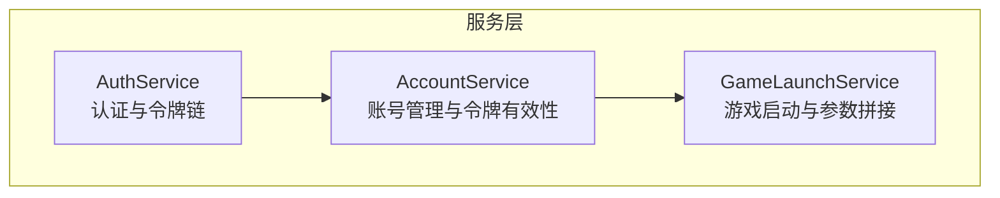
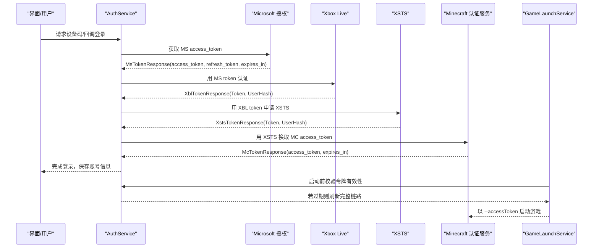
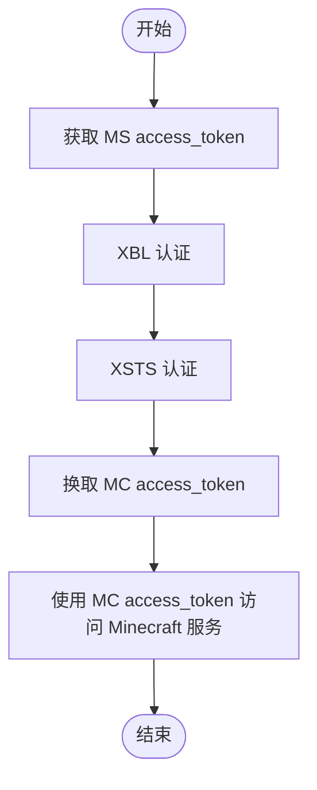
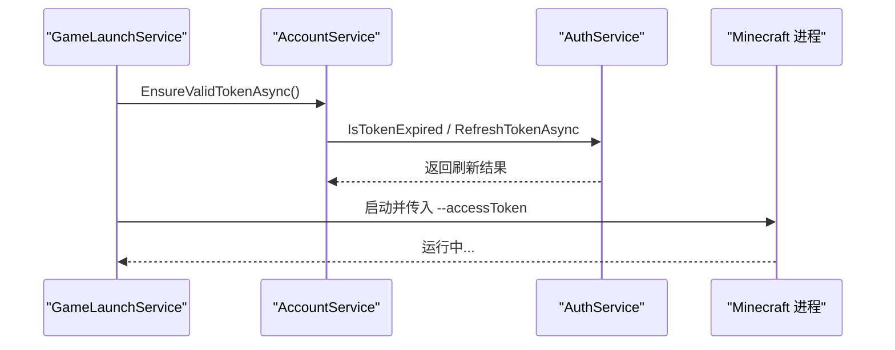
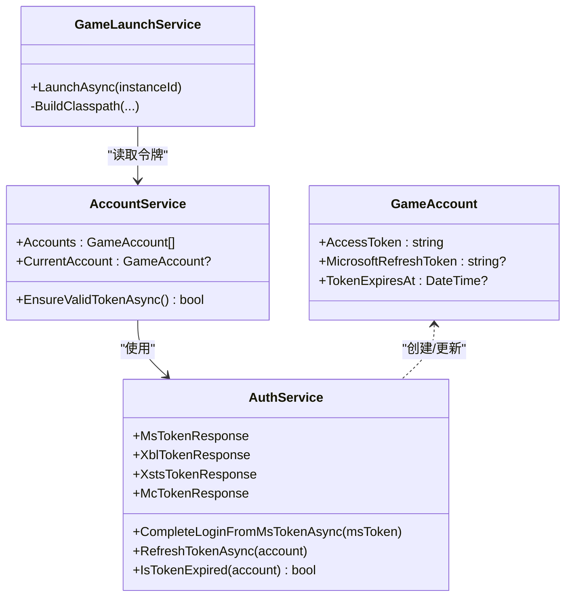

# Minecraft 令牌模型

<cite>
**本文引用的文件**   
- [AuthService.cs](file://src/FufuLauncher/Services/AuthService.cs)
- [AccountService.cs](file://src/FufuLauncher/Services/AccountService.cs)
- [GameLaunchService.cs](file://src/FufuLauncher/Services/GameLaunchService.cs)
</cite>

## 目录
1. [简介](#简介)
2. [项目结构](#项目结构)
3. [核心组件](#核心组件)
4. [架构总览](#架构总览)
5. [详细组件分析](#详细组件分析)
6. [依赖关系分析](#依赖关系分析)
7. [性能与过期策略](#性能与过期策略)
8. [故障排查指南](#故障排查指南)
9. [结论](#结论)
10. [附录：JSON 示例与字段校验规则](#附录json-示例与字段校验规则)

## 简介
本文面向 Minecraft Java 版启动器中的“服务端令牌响应模型”，聚焦 McTokenResponse 类的结构与语义，解释 access_token（Minecraft 访问令牌）与 expires_in（过期时间）的作用、取值范围与验证规则；说明该令牌与上游 XSTS 令牌的关系与使用边界；给出完整的 JSON 响应示例；并阐述令牌在 Minecraft Java 版启动流程中的作用与安全注意事项。

## 项目结构
本项目为 C# WPF 启动器，认证与令牌相关逻辑集中在 Services 层：
- AuthService：实现微软 OAuth、XBL/XSTS、Minecraft 令牌的完整链路，定义各类响应模型（含 McTokenResponse）。
- AccountService：账号管理与会话有效性检查（自动刷新）。
- GameLaunchService：游戏启动前校验令牌，并将 accessToken 作为 JVM 参数注入到 Minecraft 进程。

**图表来源** 
- [AuthService.cs:76-121](file://src/FufuLauncher/Services/AuthService.cs#L76-L121)
- [AccountService.cs:12-26](file://src/FufuLauncher/Services/AccountService.cs#L12-L26)
- [GameLaunchService.cs:35-65](file://src/FufuLauncher/Services/GameLaunchService.cs#L35-L65)

**章节来源**
- [AuthService.cs:76-121](file://src/FufuLauncher/Services/AuthService.cs#L76-L121)
- [AccountService.cs:12-26](file://src/FufuLauncher/Services/AccountService.cs#L12-L26)
- [GameLaunchService.cs:35-65](file://src/FufuLauncher/Services/GameLaunchService.cs#L35-L65)

## 核心组件
- McTokenResponse：Minecraft 服务端返回的访问令牌响应模型，包含 access_token 与 expires_in。
- GameAccount：本地持久化的账号对象，保存 AccessToken、MicrosoftRefreshToken、TokenExpiresAt 等。
- 认证链路：MS access_token → XBL → XSTS → MC access_token → 玩家资料。

关键要点
- McTokenResponse.AccessToken 是最终用于登录 Minecraft 的访问令牌。
- McTokenResponse.ExpiresIn 表示该令牌的有效期（秒），用于计算本地 TokenExpiresAt 并触发刷新。
- 令牌刷新会完整重走 XBL→XSTS→MC 链路，确保令牌有效性与一致性。

**章节来源**
- [AuthService.cs:672-676](file://src/FufuLauncher/Services/AuthService.cs#L672-L676)
- [AuthService.cs:50-63](file://src/FufuLauncher/Services/AuthService.cs#L50-L63)
- [AuthService.cs:342-398](file://src/FufuLauncher/Services/AuthService.cs#L342-L398)

## 架构总览
下图展示了从微软授权到获取 Minecraft 令牌的完整调用序列，以及令牌在启动时的传递路径。

**图表来源** 
- [AuthService.cs:159-265](file://src/FufuLauncher/Services/AuthService.cs#L159-L265)
- [AuthService.cs:488-502](file://src/FufuLauncher/Services/AuthService.cs#L488-L502)
- [AuthService.cs:504-541](file://src/FufuLauncher/Services/AuthService.cs#L504-L541)
- [AuthService.cs:543-575](file://src/FufuLauncher/Services/AuthService.cs#L543-L575)
- [AuthService.cs:577-606](file://src/FufuLauncher/Services/AuthService.cs#L577-L606)
- [GameLaunchService.cs:122-127](file://src/FufuLauncher/Services/GameLaunchService.cs#L122-L127)
- [GameLaunchService.cs:252-255](file://src/FufuLauncher/Services/GameLaunchService.cs#L252-L255)

## 详细组件分析

### McTokenResponse 类与字段语义
- access_token：Minecraft 访问令牌，用于后续向 Minecraft 服务发起鉴权请求（如查询玩家资料、进入服务器等）。
- expires_in：令牌有效期（秒），用于客户端计算本地过期时间，提前触发刷新。

字段约束与验证
- access_token 必须非空且长度合理（服务端返回 JWT 字符串）。
- expires_in 为正整数，通常几十分钟到数小时不等。
- 解析失败或字段缺失将导致认证失败并抛出异常。

生命周期与刷新
- 首次登录后，客户端根据 expires_in 计算 TokenExpiresAt（预留安全余量，例如减去若干秒）。
- 启动前通过 IsTokenExpired 判断是否即将过期，必要时调用 RefreshTokenAsync 完整重走 XBL→XSTS→MC 链路刷新。

**章节来源**
- [AuthService.cs:672-676](file://src/FufuLauncher/Services/AuthService.cs#L672-L676)
- [AuthService.cs:392-393](file://src/FufuLauncher/Services/AuthService.cs#L392-L393)
- [AuthService.cs:458-459](file://src/FufuLauncher/Services/AuthService.cs#L458-L459)
- [AuthService.cs:470-473](file://src/FufuLauncher/Services/AuthService.cs#L470-L473)

### 与上游 XSTS 令牌的关系与使用范围
- 上游令牌链：MS access_token → XBL Token → XSTS Token → MC access_token。
- XSTS Token 仅用于向 Minecraft 认证服务换取 MC access_token，不可直接用于游戏内鉴权。
- MC access_token 的使用范围限于 Minecraft 官方服务（如 profile 查询、联机登录等），由服务端校验其签发方与权限。

**图表来源** 
- [AuthService.cs:342-398](file://src/FufuLauncher/Services/AuthService.cs#L342-L398)
- [AuthService.cs:504-541](file://src/FufuLauncher/Services/AuthService.cs#L504-L541)
- [AuthService.cs:543-575](file://src/FufuLauncher/Services/AuthService.cs#L543-L575)
- [AuthService.cs:577-606](file://src/FufuLauncher/Services/AuthService.cs#L577-L606)

### 令牌在 Minecraft Java 版启动过程中的作用
- 启动前校验：AccountService.EnsureValidTokenAsync 检查当前账号令牌是否过期，必要时自动刷新。
- 参数注入：GameLaunchService 将 CurrentAccount.AccessToken 通过 --accessToken 传递给 Minecraft 主进程。
- 用户类型：--userType 设置为 mojang，表明使用 Mojang/Microsoft 账户体系。

**图表来源** 
- [AccountService.cs:42-52](file://src/FufuLauncher/Services/AccountService.cs#L42-L52)
- [GameLaunchService.cs:122-127](file://src/FufuLauncher/Services/GameLaunchService.cs#L122-L127)
- [GameLaunchService.cs:252-255](file://src/FufuLauncher/Services/GameLaunchService.cs#L252-L255)

**章节来源**
- [AccountService.cs:42-52](file://src/FufuLauncher/Services/AccountService.cs#L42-L52)
- [GameLaunchService.cs:122-127](file://src/FufuLauncher/Services/GameLaunchService.cs#L122-L127)
- [GameLaunchService.cs:252-255](file://src/FufuLauncher/Services/GameLaunchService.cs#L252-L255)

## 依赖关系分析
- AuthService 依赖 HttpClient 与多个外部端点（Microsoft、XBL、XSTS、Minecraft）。
- AccountService 依赖 AuthService 进行令牌有效性检查与刷新。
- GameLaunchService 依赖 AccountService 获取当前账号及令牌，并在启动时注入参数。

**图表来源** 
- [AuthService.cs:646-681](file://src/FufuLauncher/Services/AuthService.cs#L646-L681)
- [AccountService.cs:12-26](file://src/FufuLauncher/Services/AccountService.cs#L12-L26)
- [GameLaunchService.cs:35-65](file://src/FufuLauncher/Services/GameLaunchService.cs#L35-L65)

**章节来源**
- [AuthService.cs:646-681](file://src/FufuLauncher/Services/AuthService.cs#L646-L681)
- [AccountService.cs:12-26](file://src/FufuLauncher/Services/AccountService.cs#L12-L26)
- [GameLaunchService.cs:35-65](file://src/FufuLauncher/Services/GameLaunchService.cs#L35-L65)

## 性能与过期策略
- 令牌刷新采用完整链路（XBL→XSTS→MC），避免部分刷新导致的权限不一致。
- 过期检测预留安全余量（例如减去若干秒），减少临界时刻的失败概率。
- 网络异常重试机制在设备码轮询与令牌交换过程中均有体现，提升鲁棒性。

[本节为通用指导，不直接分析具体文件]

## 故障排查指南
常见问题与定位
- 未购买 Minecraft：查询玩家资料返回 404，提示账号未拥有游戏。
- 网络异常：HTTP 请求失败或超时，需检查网络与代理设置。
- 设备码过期：设备码等待超时或已过期，需重新发起设备码流程。
- 令牌交换失败：任一环节（MS/XBL/XSTS/MC）失败，查看应用日志中的响应体片段。

建议操作
- 检查应用日志中截断的响应体，确认错误码与描述。
- 确认端口占用与浏览器回调是否正常（LocalCallback 模式）。
- 尝试切换登录模式（DeviceCode 优先，LocalCallback 备选）。

**章节来源**
- [AuthService.cs:608-643](file://src/FufuLauncher/Services/AuthService.cs#L608-L643)
- [AuthService.cs:159-265](file://src/FufuLauncher/Services/AuthService.cs#L159-L265)
- [AuthService.cs:267-338](file://src/FufuLauncher/Services/AuthService.cs#L267-L338)

## 结论
McTokenResponse 是 Minecraft 认证链路的关键输出，其 access_token 与 expires_in 共同决定了客户端如何安全、稳定地使用 Minecraft 服务。通过完整的上游令牌链与严格的过期检测与刷新策略，启动器能够在复杂网络环境下保持会话一致性与用户体验。

[本节为总结性内容，不直接分析具体文件]

## 附录：JSON 示例与字段校验规则

### McTokenResponse 完整 JSON 示例
以下为 Minecraft 认证服务返回的典型响应结构（字段名与顺序可能因服务端版本略有差异）：
{
  "access_token": "eyJhbGciOiJSUzI1NiIsInR5cCI6IkpXVCJ9...",
  "expires_in": 1440
}

字段说明
- access_token：JWT 格式的访问令牌，非空字符串。
- expires_in：正整数，单位为秒。

字段校验规则
- access_token 必须存在且非空；否则视为解析失败或令牌无效。
- expires_in 必须为正整数；否则应拒绝使用该响应并记录错误。
- 其他可选字段（如 refresh_token）不在 McTokenResponse 中定义，但 MsTokenResponse 中包含 refresh_token，用于刷新微软令牌。

### 与 MsTokenResponse 的区别
- MsTokenResponse：微软 OAuth 响应，包含 access_token、refresh_token、expires_in。
- McTokenResponse：Minecraft 认证响应，包含 access_token、expires_in。

**章节来源**
- [AuthService.cs:646-651](file://src/FufuLauncher/Services/AuthService.cs#L646-L651)
- [AuthService.cs:672-676](file://src/FufuLauncher/Services/AuthService.cs#L672-L676)