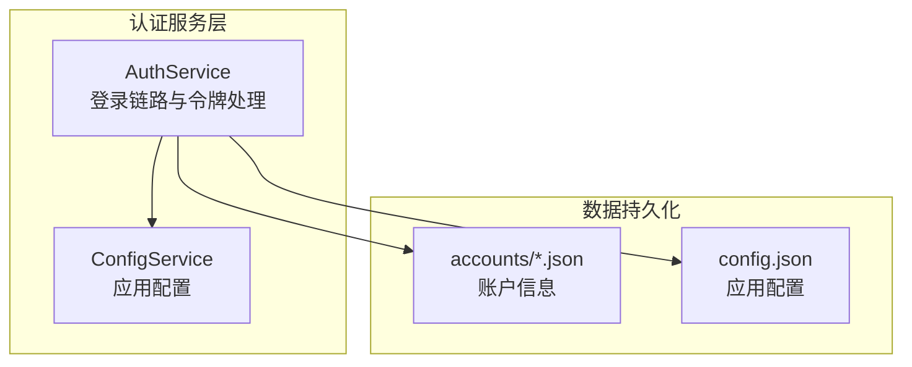
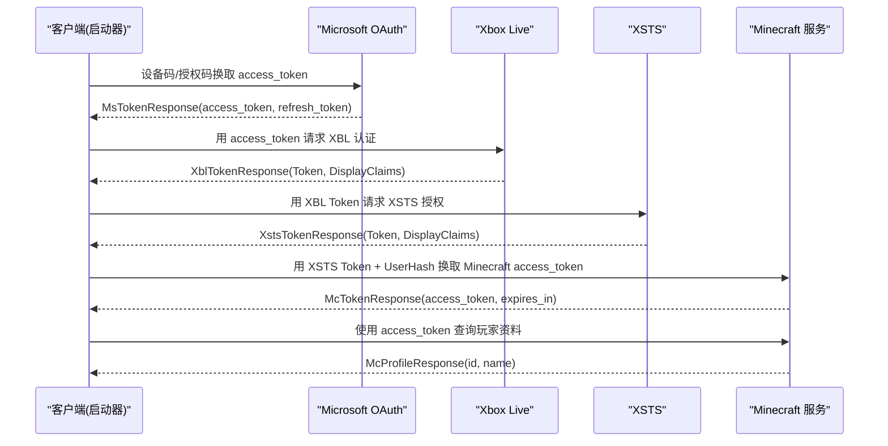
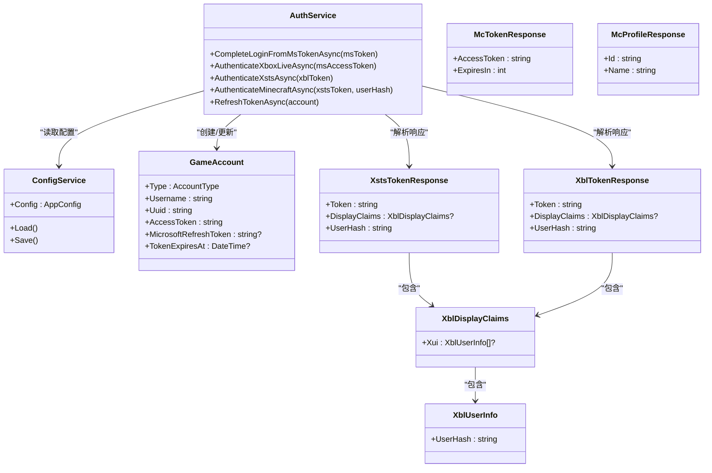

# XSTS 令牌模型

<cite>
**本文引用的文件**   
- [AuthService.cs](file://src/FufuLauncher/Services/AuthService.cs)
- [ConfigService.cs](file://src/FufuLauncher/Services/ConfigService.cs)
- [config.json](file://Start/appmcGAME/config.json)
- [43381ea021e59839958af459800e4d11.json](file://Start/appmcGAME/accounts/43381ea021e59839958af459800e4d11.json)
</cite>

## 目录
1. [简介](#简介)
2. [项目结构](#项目结构)
3. [核心组件](#核心组件)
4. [架构总览](#架构总览)
5. [详细组件分析](#详细组件分析)
6. [依赖关系分析](#依赖关系分析)
7. [性能考量](#性能考量)
8. [故障排查指南](#故障排查指南)
9. [结论](#结论)
10. [附录](#附录)

## 简介
本文件围绕 Xbox Security Token Service（XSTS）令牌响应模型，系统化说明 XstsTokenResponse 类的结构与字段含义，解释 XSTS 与 Xbox Live（XBL）令牌的区别与联系，阐述 DisplayClaims 中用户信息的传递机制，并给出完整的 JSON 响应示例与字段验证规则。同时说明 XSTS 在跨服务认证中的作用与安全特性，帮助读者理解从微软账号到 Minecraft 的完整令牌链路。

## 项目结构
本项目采用分层服务化设计，认证相关逻辑集中在 AuthService 中，配置由 ConfigService 管理，账户数据以 JSON 文件持久化。XSTS 令牌解析、校验与使用均位于 AuthService 内部，便于统一维护与调试。

图表来源
- [AuthService.cs:76-121](file://src/FufuLauncher/Services/AuthService.cs#L76-L121)
- [ConfigService.cs:88-151](file://src/FufuLauncher/Services/ConfigService.cs#L88-L151)

章节来源
- [AuthService.cs:1-121](file://src/FufuLauncher/Services/AuthService.cs#L1-L121)
- [ConfigService.cs:1-151](file://src/FufuLauncher/Services/ConfigService.cs#L1-L151)

## 核心组件
- XstsTokenResponse：XSTS 令牌响应模型，包含令牌字符串与显示声明（DisplayClaims），并提供便捷属性获取 UserHash。
- XblTokenResponse：XBL 令牌响应模型，结构与 XSTS 类似，用于中间态身份凭证。
- XblDisplayClaims / XblUserInfo：承载用户显示信息，如用户哈希（UserHash）。
- McTokenResponse / McProfileResponse：Minecraft 服务令牌与玩家资料模型。
- GameAccount：本地账户实体，封装访问令牌、过期时间等。

章节来源
- [AuthService.cs:646-681](file://src/FufuLauncher/Services/AuthService.cs#L646-L681)
- [AuthService.cs:50-63](file://src/FufuLauncher/Services/AuthService.cs#L50-L63)

## 架构总览
XSTS 令牌处于“微软 → XBL → XSTS → Minecraft”的令牌链关键位置。其作用是将 XBL 的用户身份扩展为可被 Minecraft 服务信任的跨域凭证，并在 DisplayClaims 中携带必要的用户标识（如 UserHash）供下游服务使用。

图表来源
- [AuthService.cs:342-398](file://src/FufuLauncher/Services/AuthService.cs#L342-L398)
- [AuthService.cs:504-541](file://src/FufuLauncher/Services/AuthService.cs#L504-L541)
- [AuthService.cs:543-575](file://src/FufuLauncher/Services/AuthService.cs#L543-L575)
- [AuthService.cs:577-606](file://src/FufuLauncher/Services/AuthService.cs#L577-L606)

## 详细组件分析

### XstsTokenResponse 类结构与字段含义
- Token：XSTS 签发的 JWT 令牌字符串，用于后续向 Minecraft 服务进行身份证明。
- DisplayClaims：显示声明对象，包含用户可见或下游服务需要的声明信息。
- UserHash（便捷属性）：从 DisplayClaims.Xui[0].UserHash 提取的用户哈希值，常用于构造 Minecraft 的身份头（例如 “XBL3.0 x={userHash};{xstsToken}”）。

字段验证规则
- Token：非空字符串；长度通常较长（JWT 格式），需通过服务端验签。
- DisplayClaims：可为空；若存在，则应包含 Xui 列表；至少一个元素时，UserHash 应为非空字符串。
- UserHash：非空字符串，作为用户唯一标识的一部分，用于构建 Minecraft 身份令牌。

章节来源
- [AuthService.cs:666-671](file://src/FufuLauncher/Services/AuthService.cs#L666-L671)

### XSTS 与 XBL 令牌的区别与联系
- XBL 令牌：由 Xbox Live 签发，表示用户在 Xbox Live 生态中的身份，包含 DisplayClaims（如 Xui.UserHash）。
- XSTS 令牌：在 XBL 基础上进一步扩展，面向更广泛的依赖方（如 Minecraft 服务），提供跨域信任的令牌。
- 联系：XSTS 请求需要传入有效的 XBL Token；XSTS 响应同样包含 DisplayClaims，其中 UserHash 与 XBL 一致，确保下游服务能正确识别用户。

章节来源
- [AuthService.cs:504-541](file://src/FufuLauncher/Services/AuthService.cs#L504-L541)
- [AuthService.cs:543-575](file://src/FufuLauncher/Services/AuthService.cs#L543-L575)

### DisplayClaims 中用户信息的传递机制
- XblDisplayClaims：包含 Xui 列表，每个元素代表一个用户上下文。
- XblUserInfo：包含 uhs（UserHash），即用户的哈希标识。
- 传递方式：XBL 和 XSTS 响应均返回 DisplayClaims，客户端从中提取 UserHash，用于构造 Minecraft 的身份令牌（identityToken），实现跨服务认证。

章节来源
- [AuthService.cs:652-665](file://src/FufuLauncher/Services/AuthService.cs#L652-L665)
- [AuthService.cs:577-582](file://src/FufuLauncher/Services/AuthService.cs#L577-L582)

### 完整 JSON 响应示例与字段验证规则
以下为典型响应结构的示例（基于代码模型映射）：

- XBL 响应（XblTokenResponse）
  - Token：JWT 字符串
  - DisplayClaims：
    - xui：数组，元素包含 uhs（UserHash）

- XSTS 响应（XstsTokenResponse）
  - Token：JWT 字符串
  - DisplayClaims：
    - xui：数组，元素包含 uhs（UserHash）

- Minecraft 令牌响应（McTokenResponse）
  - access_token：JWT 字符串
  - expires_in：过期秒数

- Minecraft 玩家资料响应（McProfileResponse）
  - id：UUID
  - name：用户名

字段验证规则
- Token/access_token：必须为非空字符串；服务端会进行签名验证与有效期检查。
- DisplayClaims.xui：可选；若存在，则至少包含一个元素；每个元素的 uhs 必须为非空字符串。
- expires_in：正整数，表示令牌有效时长（秒）。
- id/name：非空字符串，用于展示与绑定用户。

章节来源
- [AuthService.cs:646-681](file://src/FufuLauncher/Services/AuthService.cs#L646-L681)

### XSTS 令牌在跨服务认证中的作用与安全特性
- 作用：将 Xbox Live 的用户身份扩展到 Minecraft 服务，形成统一的跨域信任链。
- 安全特性：
  - 令牌签名：XSTS 令牌为 JWT，服务端可验签防止篡改。
  - 依赖方限制：XSTS 请求指定 RelyingParty（如 Minecraft 服务域名），限制令牌适用范围。
  - 沙盒环境：Properties.SandboxId 指定 RETAIL，避免测试/开发环境混淆。
  - 用户哈希：UserHash 作为用户标识，结合令牌签名确保身份不可伪造。
  - 过期控制：令牌具有有效期，客户端需定期刷新。

章节来源
- [AuthService.cs:543-575](file://src/FufuLauncher/Services/AuthService.cs#L543-L575)

## 依赖关系分析
AuthService 依赖 HttpClient 发起网络请求，调用 Microsoft、XBL、XSTS、Minecraft 各端点；ConfigService 提供应用配置；账户数据以 JSON 文件存储。

图表来源
- [AuthService.cs:76-121](file://src/FufuLauncher/Services/AuthService.cs#L76-L121)
- [AuthService.cs:646-681](file://src/FufuLauncher/Services/AuthService.cs#L646-L681)
- [ConfigService.cs:88-151](file://src/FufuLauncher/Services/ConfigService.cs#L88-L151)

章节来源
- [AuthService.cs:1-121](file://src/FufuLauncher/Services/AuthService.cs#L1-L121)
- [AuthService.cs:646-681](file://src/FufuLauncher/Services/AuthService.cs#L646-L681)
- [ConfigService.cs:1-151](file://src/FufuLauncher/Services/ConfigService.cs#L1-L151)

## 性能考量
- 网络超时：HttpClient 设置超时时间，避免长时间阻塞。
- 重试策略：轮询设备码时支持指数退避与取消令牌，提升稳定性。
- 日志截断：响应体截断写入日志，避免大 JSON 影响性能。
- 令牌刷新：自动检测过期并重走完整令牌链，减少手动干预。

章节来源
- [AuthService.cs:94-100](file://src/FufuLauncher/Services/AuthService.cs#L94-L100)
- [AuthService.cs:198-265](file://src/FufuLauncher/Services/AuthService.cs#L198-L265)
- [AuthService.cs:102-104](file://src/FufuLauncher/Services/AuthService.cs#L102-L104)
- [AuthService.cs:420-468](file://src/FufuLauncher/Services/AuthService.cs#L420-L468)

## 故障排查指南
- 网络异常：检查 HttpClient 超时与网络连通性，查看日志中的错误码与响应体。
- 令牌交换失败：确认 MS/XBL/XSTS/MC 各端点返回状态码与响应结构。
- 未购买 Minecraft：当查询玩家资料返回 404 时，提示用户购买游戏。
- 设备码过期：轮询超时或收到 expired_token 错误时，重新请求设备码。

章节来源
- [AuthService.cs:160-192](file://src/FufuLauncher/Services/AuthService.cs#L160-L192)
- [AuthService.cs:198-265](file://src/FufuLauncher/Services/AuthService.cs#L198-L265)
- [AuthService.cs:608-643](file://src/FufuLauncher/Services/AuthService.cs#L608-L643)

## 结论
XSTS 令牌在跨服务认证中扮演关键角色，它将 Xbox Live 的用户身份扩展为 Minecraft 服务可信任的凭证。通过 DisplayClaims 传递用户信息（如 UserHash），并结合 JWT 签名与依赖方限制，确保安全性与适用性。项目中对令牌链路的实现清晰、健壮，具备完善的错误处理与性能优化措施。

## 附录

### 配置文件与账户数据参考
- 应用配置（config.json）：包含主题、下载源、Java 路径、JVM 参数、分辨率、背景设置、微软客户端 ID、认证模式等。
- 账户数据（accounts/*.json）：存储账户类型、用户名、UUID、访问令牌、刷新令牌、过期时间、添加时间等。

章节来源
- [config.json:1-34](file://Start/appmcGAME/config.json#L1-L34)
- [43381ea021e59839958af459800e4d11.json:1-9](file://Start/appmcGAME/accounts/43381ea021e59839958af459800e4d11.json#L1-L9)