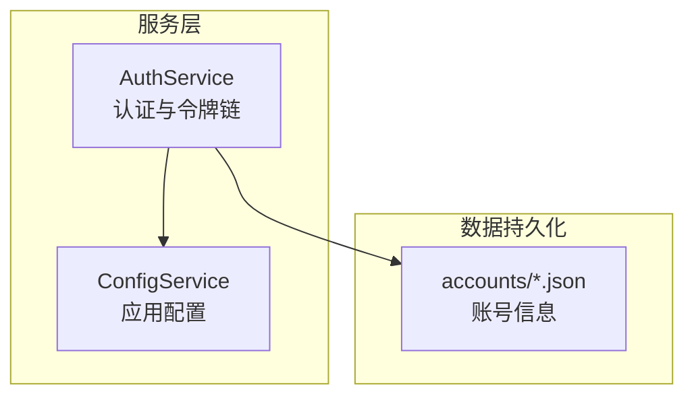
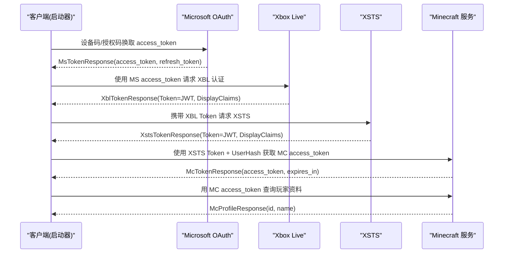
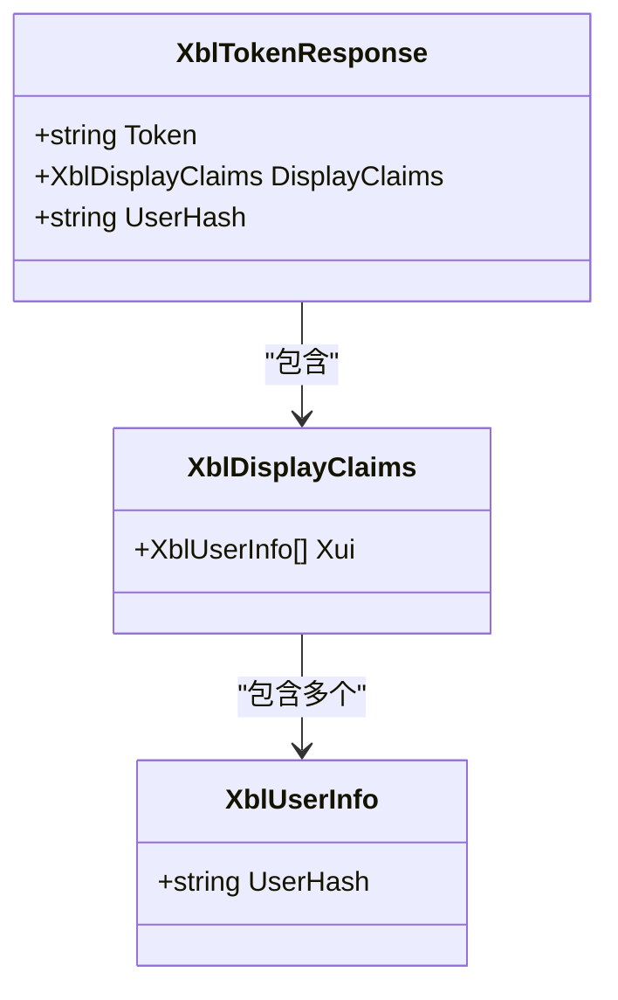
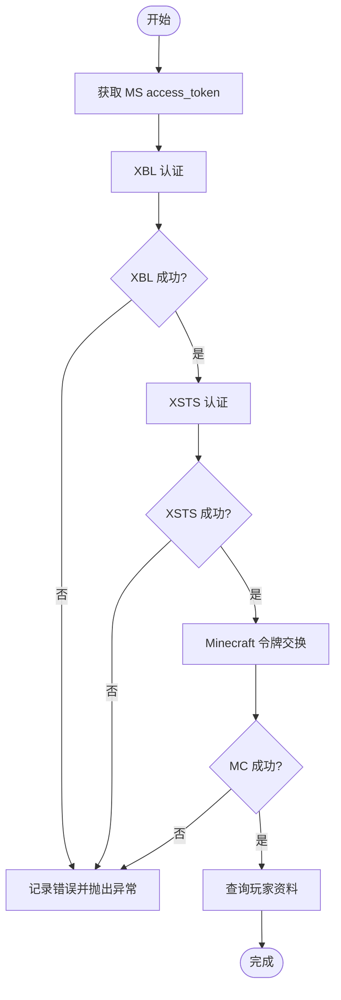
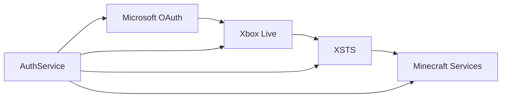

# Xbox Live 认证模型

<cite>
**本文引用的文件**   
- [AuthService.cs](file://src/FufuLauncher/Services/AuthService.cs)
- [ConfigService.cs](file://src/FufuLauncher/Services/ConfigService.cs)
- [43381ea021e59839958af459800e4d11.json](file://Start/appmcGAME/accounts/43381ea021e59839958af459800e4d11.json)
</cite>

## 目录
1. [简介](#简介)
2. [项目结构](#项目结构)
3. [核心组件](#核心组件)
4. [架构总览](#架构总览)
5. [详细组件分析](#详细组件分析)
6. [依赖关系分析](#依赖关系分析)
7. [性能考虑](#性能考虑)
8. [故障排查指南](#故障排查指南)
9. [结论](#结论)
10. [附录：JSON 响应示例与字段校验规则](#附录json-响应示例与字段校验规则)

## 简介
本文件围绕 Xbox Live（XBL）认证响应模型，系统化说明 XblTokenResponse、XblDisplayClaims 与 XblUserInfo 的结构关系，解释 Token 字段的 JWT 格式、DisplayClaims 中的用户信息结构，以及 UserHash 的生成与用途。同时给出完整的 JSON 响应示例与字段验证规则，并阐述 XBL 认证在 Minecraft 登录流程中的作用与安全注意事项。

## 项目结构
本项目采用服务层组织方式，认证相关逻辑集中在 AuthService 中，配置由 ConfigService 管理，账户数据以 JSON 文件持久化到 accounts 目录。

图表来源
- [AuthService.cs:76-121](file://src/FufuLauncher/Services/AuthService.cs#L76-L121)
- [ConfigService.cs:88-151](file://src/FufuLauncher/Services/ConfigService.cs#L88-L151)

章节来源
- [AuthService.cs:76-121](file://src/FufuLauncher/Services/AuthService.cs#L76-L121)
- [ConfigService.cs:88-151](file://src/FufuLauncher/Services/ConfigService.cs#L88-L151)

## 核心组件
- XblTokenResponse：Xbox Live 认证返回的令牌对象，包含 Token（JWT）、DisplayClaims（用户显示声明），并提供便捷属性 UserHash。
- XblDisplayClaims：承载 xui 列表，其中每个元素为 XblUserInfo。
- XblUserInfo：包含 uhs（User Hash 字符串）。

这些类用于解析 XBL/XSTS/MC 各阶段的响应体，并在后续步骤中传递关键标识（如 UserHash）。

章节来源
- [AuthService.cs:652-671](file://src/FufuLauncher/Services/AuthService.cs#L652-L671)

## 架构总览
XBL 认证是 Minecraft 登录链路的关键一环。完整令牌链如下：
MS access_token → XBL（Xbox Live）→ XSTS（Xbox Secure Token Service）→ Minecraft access_token → 玩家资料

图表来源
- [AuthService.cs:343-398](file://src/FufuLauncher/Services/AuthService.cs#L343-L398)
- [AuthService.cs:504-541](file://src/FufuLauncher/Services/AuthService.cs#L504-L541)
- [AuthService.cs:543-575](file://src/FufuLauncher/Services/AuthService.cs#L543-L575)
- [AuthService.cs:577-606](file://src/FufuLauncher/Services/AuthService.cs#L577-L606)
- [AuthService.cs:608-643](file://src/FufuLauncher/Services/AuthService.cs#L608-L643)

## 详细组件分析

### XblTokenResponse、XblDisplayClaims、XblUserInfo 结构关系
- XblTokenResponse.Token：XBL 返回的 JWT 令牌，用于后续 XSTS 交换。
- XblTokenResponse.DisplayClaims：包含 xui 列表，提供用户显示信息与标识。
- XblDisplayClaims.Xui：XblUserInfo 列表，通常仅含一个元素。
- XblUserInfo.UserHash：即 uhs，代表用户唯一哈希，贯穿 XSTS 与 Minecraft 令牌交换。

图表来源
- [AuthService.cs:652-665](file://src/FufuLauncher/Services/AuthService.cs#L652-L665)

章节来源
- [AuthService.cs:652-671](file://src/FufuLauncher/Services/AuthService.cs#L652-L671)

### Token 字段的 JWT 格式
- XblTokenResponse.Token 与 XstsTokenResponse.Token 均为 JWT（JSON Web Token）。
- 在本项目中，JWT 作为服务端签发的身份凭证被原样传递，未进行本地解码或签名校验。
- 安全建议：生产环境应实现 JWT 验签与过期检查，避免伪造令牌；当前实现依赖服务端校验，适合内部工具场景。

章节来源
- [AuthService.cs:504-541](file://src/FufuLauncher/Services/AuthService.cs#L504-L541)
- [AuthService.cs:543-575](file://src/FufuLauncher/Services/AuthService.cs#L543-L575)

### DisplayClaims 中的用户信息结构
- DisplayClaims.xui[0].uhs 即为 UserHash（UHS），用于标识用户身份。
- 该值在 XSTS 与 Minecraft 令牌交换中被复用，确保跨服务的身份一致性。

章节来源
- [AuthService.cs:658-665](file://src/FufuLauncher/Services/AuthService.cs#L658-L665)

### UserHash 的生成与用途
- 生成：UserHash 由 Xbox Live 服务端签发，位于 DisplayClaims.xui[0].uhs。
- 用途：
  - 传递给 XSTS 服务，用于构建 XSTS Token。
  - 拼接为 identityToken 的一部分，向 Minecraft 服务申请 access_token。
- 注意：UserHash 不应被篡改或泄露，需通过 HTTPS 传输并限制日志输出。

章节来源
- [AuthService.cs:577-606](file://src/FufuLauncher/Services/AuthService.cs#L577-L606)

### 认证流程与错误处理
- 设备码/回调两种模式获取 MS access_token。
- 依次调用 XBL、XSTS、MC 接口，任一失败均抛出 AuthException，区分网络异常、未购买 Minecraft、取消、设备码过期等错误类型。
- 刷新流程：使用 refresh_token 重新走完整令牌链，保证长期可用性。

图表来源
- [AuthService.cs:343-398](file://src/FufuLauncher/Services/AuthService.cs#L343-L398)
- [AuthService.cs:421-468](file://src/FufuLauncher/Services/AuthService.cs#L421-L468)

章节来源
- [AuthService.cs:343-398](file://src/FufuLauncher/Services/AuthService.cs#L343-L398)
- [AuthService.cs:421-468](file://src/FufuLauncher/Services/AuthService.cs#L421-L468)

## 依赖关系分析
AuthService 依赖以下端点与服务：
- Microsoft OAuth：设备码与授权码换 token。
- Xbox Live：用户认证与令牌签发。
- XSTS：扩展令牌服务。
- Minecraft Services：最终游戏令牌与玩家资料。

图表来源
- [AuthService.cs:78-85](file://src/FufuLauncher/Services/AuthService.cs#L78-L85)

章节来源
- [AuthService.cs:78-85](file://src/FufuLauncher/Services/AuthService.cs#L78-L85)

## 性能考虑
- HttpClient 统一设置超时与请求头，减少连接开销与兼容性问题。
- 响应体截断写入日志，避免长 JSON 影响 I/O 性能。
- 轮询设备码时动态退避，降低服务器压力。
- 刷新令牌时完整重走令牌链，确保状态一致但会增加网络往返，建议在后台异步执行。

章节来源
- [AuthService.cs:94-100](file://src/FufuLauncher/Services/AuthService.cs#L94-L100)
- [AuthService.cs:102-104](file://src/FufuLauncher/Services/AuthService.cs#L102-L104)
- [AuthService.cs:198-265](file://src/FufuLauncher/Services/AuthService.cs#L198-L265)
- [AuthService.cs:421-468](file://src/FufuLauncher/Services/AuthService.cs#L421-L468)

## 故障排查指南
- 常见错误类型：
  - Network：网络异常导致设备码请求或令牌交换失败。
  - NotOwnedMinecraft：微软账号未购买 Minecraft Java 版。
  - Cancelled：用户取消授权或关闭浏览器。
  - DeviceCodeExpired：设备码等待超时。
  - TokenExchangeFailed：MS/XBL/XSTS/MC 任一环节失败。
- 排查要点：
  - 检查网络连通性与代理设置。
  - 确认微软账号已购买 Minecraft。
  - 查看应用日志中截断的响应体，定位具体失败阶段。
  - 若刷新失败，检查 refresh_token 是否有效且未被吊销。

章节来源
- [AuthService.cs:32-48](file://src/FufuLauncher/Services/AuthService.cs#L32-L48)
- [AuthService.cs:608-643](file://src/FufuLauncher/Services/AuthService.cs#L608-L643)

## 结论
XBL 认证模型通过 XblTokenResponse、XblDisplayClaims、XblUserInfo 三类对象串联起从 Microsoft 到 Minecraft 的完整令牌链。UserHash 作为用户标识贯穿多服务，JWT 作为安全凭证在各阶段传递。本项目实现了稳健的错误分类与日志记录，便于问题定位。生产环境中建议增强 JWT 验签与过期检查，进一步提升安全性。

## 附录：JSON 响应示例与字段校验规则

### XblTokenResponse 示例
以下为 XBL 认证响应的典型结构（字段名与顺序可能因服务端版本略有差异）：
{
  "Token": "eyJhbGciOiJIUzI1NiIsInR5cCI6IkpXVCJ9...",
  "DisplayClaims": {
    "xui": [
      {
        "uhs": "0000000000000000"
      }
    ]
  }
}

字段校验规则
- Token：非空字符串，长度大于 0。
- DisplayClaims：存在且包含 xui 列表。
- DisplayClaims.xui：至少包含一个元素。
- DisplayClaims.xui[0].uhs：非空字符串，即 UserHash。

章节来源
- [AuthService.cs:652-665](file://src/FufuLauncher/Services/AuthService.cs#L652-L665)

### XstsTokenResponse 示例
{
  "Token": "eyJhbGciOiJIUzI1NiIsInR5cCI6IkpXVCJ9...",
  "DisplayClaims": {
    "xui": [
      {
        "uhs": "0000000000000000"
      }
    ]
  }
}

字段校验规则
- Token：非空字符串。
- DisplayClaims.xui[0].uhs：非空字符串，用于后续 Minecraft 令牌交换。

章节来源
- [AuthService.cs:666-671](file://src/FufuLauncher/Services/AuthService.cs#L666-L671)

### McTokenResponse 示例
{
  "access_token": "eyJhbGciOiJIUzI1NiIsInR5cCI6IkpXVCJ9...",
  "expires_in": 3600
}

字段校验规则
- access_token：非空字符串。
- expires_in：正整数，表示令牌有效期秒数。

章节来源
- [AuthService.cs:672-676](file://src/FufuLauncher/Services/AuthService.cs#L672-L676)

### McProfileResponse 示例
{
  "id": "xxxxxxxx-xxxx-xxxx-xxxx-xxxxxxxxxxxx",
  "name": "Player"
}

字段校验规则
- id：非空字符串，通常为 UUID。
- name：非空字符串，玩家昵称。

章节来源
- [AuthService.cs:677-681](file://src/FufuLauncher/Services/AuthService.cs#L677-L681)

### 账户持久化示例
{
  "Type": 1,
  "Username": "Player",
  "Uuid": "43381ea021e59839958af459800e4d11",
  "AccessToken": "43381ea021e59839958af459800e4d11",
  "MicrosoftRefreshToken": null,
  "TokenExpiresAt": null,
  "AddedAt": "2026-08-01T20:15:37.0252838+08:00"
}

章节来源
- [43381ea021e59839958af459800e4d11.json:1-9](file://Start/appmcGAME/accounts/43381ea021e59839958af459800e4d11.json#L1-L9)