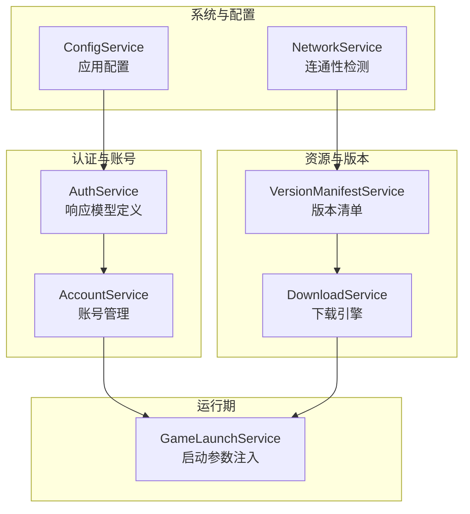
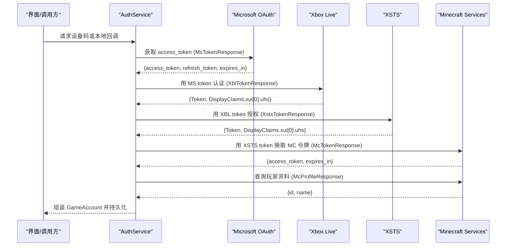
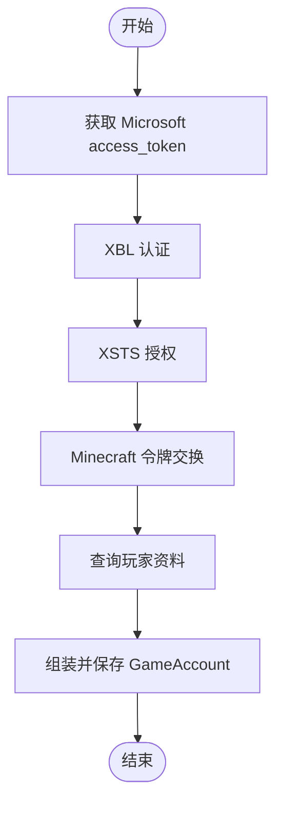
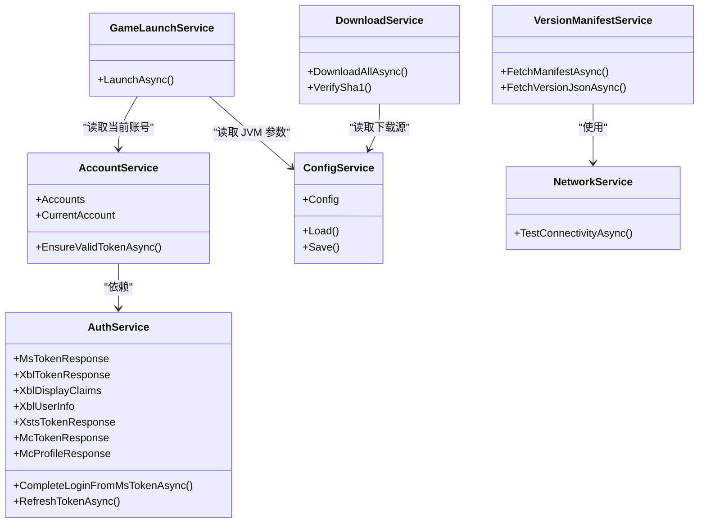

# 响应数据模型

<cite>
**本文引用的文件**   
- [AuthService.cs](file://src/FufuLauncher/Services/AuthService.cs)
- [AccountService.cs](file://src/FufuLauncher/Services/AccountService.cs)
- [ConfigService.cs](file://src/FufuLauncher/Services/ConfigService.cs)
- [NetworkService.cs](file://src/FufuLauncher/Services/NetworkService.cs)
- [VersionManifestService.cs](file://src/FufuLauncher/Services/VersionManifestService.cs)
- [DownloadService.cs](file://src/FufuLauncher/Services/DownloadService.cs)
- [GameLaunchService.cs](file://src/FufuLauncher/Services/GameLaunchService.cs)
</cite>

## 目录
1. [简介](#简介)
2. [项目结构](#项目结构)
3. [核心组件](#核心组件)
4. [架构总览](#架构总览)
5. [详细组件分析](#详细组件分析)
6. [依赖关系分析](#依赖关系分析)
7. [性能考量](#性能考量)
8. [故障排查指南](#故障排查指南)
9. [结论](#结论)
10. [附录：完整 JSON 示例与字段校验规则](#附录完整-json-示例与字段校验规则)

## 简介
本文件为“可爱的芙芙启动器”的响应数据模型文档，聚焦于认证与令牌链路中的各类 API 响应模型及其使用方式。内容涵盖：
- Microsoft OAuth 令牌模型（MsTokenResponse）
- Xbox Live 认证模型（XblTokenResponse、XblDisplayClaims、XblUserInfo）
- XSTS 令牌模型（XstsTokenResponse）
- Minecraft 令牌模型（McTokenResponse）
- 玩家资料模型（McProfileResponse）

文档将说明每个字段的含义、数据类型、使用场景、JSON 示例与字段校验规则，并给出模型之间的关系与数据流转过程。

## 项目结构
本项目采用服务层组织方式，认证相关逻辑集中在 AuthService，其他服务负责配置、网络、下载、版本清单与游戏启动等。响应模型定义位于 AuthService 内部，便于在登录流程中统一解析与复用。

图表来源
- [AuthService.cs:646-681](file://src/FufuLauncher/Services/AuthService.cs#L646-L681)
- [AccountService.cs:1-54](file://src/FufuLauncher/Services/AccountService.cs#L1-L54)
- [ConfigService.cs:13-86](file://src/FufuLauncher/Services/ConfigService.cs#L13-L86)
- [NetworkService.cs:16-33](file://src/FufuLauncher/Services/NetworkService.cs#L16-L33)
- [VersionManifestService.cs:16-26](file://src/FufuLauncher/Services/VersionManifestService.cs#L16-L26)
- [DownloadService.cs:28-54](file://src/FufuLauncher/Services/DownloadService.cs#L28-L54)
- [GameLaunchService.cs:28-33](file://src/FufuLauncher/Services/GameLaunchService.cs#L28-L33)

章节来源
- [AuthService.cs:1-120](file://src/FufuLauncher/Services/AuthService.cs#L1-L120)
- [AccountService.cs:1-54](file://src/FufuLauncher/Services/AccountService.cs#L1-L54)
- [ConfigService.cs:1-152](file://src/FufuLauncher/Services/ConfigService.cs#L1-L152)

## 核心组件
- 响应模型集中定义于 AuthService 内部类，用于反序列化各阶段 API 返回的 JSON 数据。
- 关键模型包括：
  - MsTokenResponse：Microsoft OAuth access_token、refresh_token、expires_in
  - XblTokenResponse：Xbox Live Token、DisplayClaims、UserHash 便捷属性
  - XblDisplayClaims：xui 列表
  - XblUserInfo：用户哈希 uhs
  - XstsTokenResponse：XSTS Token、DisplayClaims、UserHash 便捷属性
  - McTokenResponse：Minecraft access_token、expires_in
  - McProfileResponse：Minecraft 玩家 id、name

章节来源
- [AuthService.cs:646-681](file://src/FufuLauncher/Services/AuthService.cs#L646-L681)

## 架构总览
认证链路从 Microsoft OAuth 开始，依次获取 Xbox Live、XSTS、Minecraft 令牌，最终拉取玩家资料。刷新流程同样重走该链路以保证令牌有效性。

图表来源
- [AuthService.cs:158-265](file://src/FufuLauncher/Services/AuthService.cs#L158-L265)
- [AuthService.cs:343-398](file://src/FufuLauncher/Services/AuthService.cs#L343-L398)
- [AuthService.cs:504-606](file://src/FufuLauncher/Services/AuthService.cs#L504-L606)
- [AuthService.cs:608-643](file://src/FufuLauncher/Services/AuthService.cs#L608-L643)

## 详细组件分析

### Microsoft OAuth 令牌模型（MsTokenResponse）
- 用途：承载 Microsoft OAuth 返回的访问令牌、刷新令牌与过期时间。
- 字段说明：
  - access_token：字符串，后续用于 Xbox Live 认证。
  - refresh_token：字符串，用于刷新 Microsoft 令牌。
  - expires_in：整数，秒数，表示 access_token 有效期。
- 使用场景：
  - 设备码轮询成功后返回；
  - 本地回调授权码交换后返回；
  - 刷新流程中重新获取。
- 验证规则：
  - access_token 非空；
  - refresh_token 非空（用于后续刷新）；
  - expires_in > 0。
- JSON 示例：
  - 参考路径：[AuthService.cs:646-651](file://src/FufuLauncher/Services/AuthService.cs#L646-L651)

章节来源
- [AuthService.cs:646-651](file://src/FufuLauncher/Services/AuthService.cs#L646-L651)

### Xbox Live 认证模型（XblTokenResponse、XblDisplayClaims、XblUserInfo）
- 用途：通过 Microsoft access_token 获取 Xbox Live 令牌与用户哈希（uhs）。
- 字段说明：
  - Token：字符串，XBL JWT 令牌。
  - DisplayClaims：对象，包含 xui 列表。
  - UserHash：便捷属性，从 DisplayClaims.xui[0].uhs 提取。
  - XblDisplayClaims：xui 列表容器。
  - XblUserInfo：包含 uhs（用户哈希），用于后续 XSTS 与 MC 认证。
- 使用场景：
  - 作为 XSTS 授权的输入；
  - 构造 Minecraft identityToken 的前缀部分。
- 验证规则：
  - Token 非空；
  - DisplayClaims.xui 至少存在一项且 uhs 非空。
- JSON 示例：
  - 参考路径：[AuthService.cs:652-665](file://src/FufuLauncher/Services/AuthService.cs#L652-L665)

章节来源
- [AuthService.cs:652-665](file://src/FufuLauncher/Services/AuthService.cs#L652-L665)

### XSTS 令牌模型（XstsTokenResponse）
- 用途：基于 XBL 令牌获取 XSTS 令牌，继续向 Minecraft 服务证明身份。
- 字段说明：
  - Token：字符串，XSTS JWT 令牌。
  - DisplayClaims：对象，包含 xui 列表。
  - UserHash：便捷属性，从 DisplayClaims.xui[0].uhs 提取。
- 使用场景：
  - 作为 Minecraft 令牌交换的凭据；
  - 与 userHash 组合成 identityToken。
- 验证规则：
  - Token 非空；
  - DisplayClaims.xui 至少存在一项且 uhs 非空。
- JSON 示例：
  - 参考路径：[AuthService.cs:666-671](file://src/FufuLauncher/Services/AuthService.cs#L666-L671)

章节来源
- [AuthService.cs:666-671](file://src/FufuLauncher/Services/AuthService.cs#L666-L671)

### Minecraft 令牌模型（McTokenResponse）
- 用途：使用 XSTS 令牌换取 Minecraft 访问令牌，用于后续玩家资料查询与游戏启动。
- 字段说明：
  - access_token：字符串，Minecraft 访问令牌。
  - expires_in：整数，秒数，表示 access_token 有效期。
- 使用场景：
  - 查询玩家资料；
  - 注入到游戏启动参数 --accessToken。
- 验证规则：
  - access_token 非空；
  - expires_in > 0。
- JSON 示例：
  - 参考路径：[AuthService.cs:672-676](file://src/FufuLauncher/Services/AuthService.cs#L672-L676)

章节来源
- [AuthService.cs:672-676](file://src/FufuLauncher/Services/AuthService.cs#L672-L676)

### 玩家资料模型（McProfileResponse）
- 用途：获取 Minecraft 玩家的唯一标识与显示名称。
- 字段说明：
  - id：字符串，玩家 UUID（小写无连字符）。
  - name：字符串，玩家昵称。
- 使用场景：
  - 填充 GameAccount 的 Username 与 Uuid；
  - 若失败则回退生成确定性离线 UUID。
- 验证规则：
  - id 非空；
  - name 非空。
- JSON 示例：
  - 参考路径：[AuthService.cs:677-681](file://src/FufuLauncher/Services/AuthService.cs#L677-L681)

章节来源
- [AuthService.cs:677-681](file://src/FufuLauncher/Services/AuthService.cs#L677-L681)

### 数据流转与处理逻辑
- 登录主流程：
  - 获取 Microsoft access_token（设备码或本地回调）；
  - 调用 Xbox Live 认证得到 XblTokenResponse；
  - 调用 XSTS 授权得到 XstsTokenResponse；
  - 调用 Minecraft 认证得到 McTokenResponse；
  - 查询玩家资料 McProfileResponse；
  - 组装 GameAccount 并持久化。
- 刷新流程：
  - 使用 refresh_token 刷新 Microsoft 令牌；
  - 重走 XBL→XSTS→MC 链更新 mc 令牌与过期时间。
- 错误区分：
  - 未购买 Minecraft：404 返回，抛出特定异常类型；
  - 网络异常：捕获 HttpRequestException 并转换为通用异常；
  - 取消与过期：根据错误码与超时判断。

图表来源
- [AuthService.cs:343-398](file://src/FufuLauncher/Services/AuthService.cs#L343-L398)
- [AuthService.cs:418-468](file://src/FufuLauncher/Services/AuthService.cs#L418-L468)

章节来源
- [AuthService.cs:343-398](file://src/FufuLauncher/Services/AuthService.cs#L343-L398)
- [AuthService.cs:418-468](file://src/FufuLauncher/Services/AuthService.cs#L418-L468)

## 依赖关系分析
- 响应模型均位于 AuthService 内部，被其内部方法直接反序列化使用。
- AccountService 依赖 AuthService 提供的账号列表与刷新能力。
- ConfigService 提供应用配置（如下载源、Java 路径、JVM 参数等），间接影响启动参数。
- NetworkService 提供连通性检测，辅助版本清单与下载服务选择可用源。
- VersionManifestService 拉取版本清单与版本 JSON，供下载与启动使用。
- DownloadService 负责分片断点续传与 SHA1 校验，确保资源完整性。
- GameLaunchService 在启动前校验依赖与 Java 完整性，并将当前账号的 accessToken、uuid、username 注入 JVM 参数。

图表来源
- [AuthService.cs:646-681](file://src/FufuLauncher/Services/AuthService.cs#L646-L681)
- [AccountService.cs:12-53](file://src/FufuLauncher/Services/AccountService.cs#L12-L53)
- [ConfigService.cs:88-151](file://src/FufuLauncher/Services/ConfigService.cs#L88-L151)
- [NetworkService.cs:18-76](file://src/FufuLauncher/Services/NetworkService.cs#L18-L76)
- [VersionManifestService.cs:172-255](file://src/FufuLauncher/Services/VersionManifestService.cs#L172-L255)
- [DownloadService.cs:56-114](file://src/FufuLauncher/Services/DownloadService.cs#L56-L114)
- [GameLaunchService.cs:35-65](file://src/FufuLauncher/Services/GameLaunchService.cs#L35-L65)

章节来源
- [AccountService.cs:1-54](file://src/FufuLauncher/Services/AccountService.cs#L1-L54)
- [ConfigService.cs:1-152](file://src/FufuLauncher/Services/ConfigService.cs#L1-L152)
- [NetworkService.cs:1-95](file://src/FufuLauncher/Services/NetworkService.cs#L1-L95)
- [VersionManifestService.cs:1-338](file://src/FufuLauncher/Services/VersionManifestService.cs#L1-L338)
- [DownloadService.cs:1-592](file://src/FufuLauncher/Services/DownloadService.cs#L1-L592)
- [GameLaunchService.cs:1-401](file://src/FufuLauncher/Services/GameLaunchService.cs#L1-L401)

## 性能考量
- 令牌刷新避免频繁网络请求：仅在接近过期时触发刷新，并缓存结果。
- 下载服务支持分片并发与断点续传，提升大文件吞吐与稳定性。
- 版本清单服务具备缓存机制，减少重复网络请求。
- HttpClient 设置合理超时与连接限制，避免阻塞与资源耗尽。

## 故障排查指南
- 常见错误类型：
  - 网络异常：检查网络连接与代理设置；
  - 未购买 Minecraft：提示前往官方渠道购买；
  - 设备码过期：重新发起设备码登录；
  - 令牌交换失败：查看应用日志中的详细响应信息。
- 定位方法：
  - 查看应用日志输出（TruncateBody 截断长响应，便于阅读）；
  - 确认各端点可达性与状态码；
  - 检查 User-Agent 与 Accept 头是否被服务端要求。

章节来源
- [AuthService.cs:102-104](file://src/FufuLauncher/Services/AuthService.cs#L102-L104)
- [AuthService.cs:521-540](file://src/FufuLauncher/Services/AuthService.cs#L521-L540)
- [AuthService.cs:555-574](file://src/FufuLauncher/Services/AuthService.cs#L555-L574)
- [AuthService.cs:586-605](file://src/FufuLauncher/Services/AuthService.cs#L586-L605)
- [AuthService.cs:617-643](file://src/FufuLauncher/Services/AuthService.cs#L617-L643)

## 结论
本文件系统化梳理了“可爱的芙芙启动器”在认证与令牌链路中的响应数据模型，明确了各模型的字段含义、数据类型、使用场景与校验规则，并通过序列图与流程图展示了数据流转过程。结合服务间的依赖关系与性能优化策略，可为开发与维护提供清晰指引。

## 附录：完整 JSON 示例与字段校验规则

- Microsoft OAuth 令牌（MsTokenResponse）
  - 示例 JSON：
    - {"access_token": "...", "refresh_token": "...", "expires_in": 3600}
  - 校验规则：
    - access_token 非空；
    - refresh_token 非空；
    - expires_in > 0。
  - 参考路径：[AuthService.cs:646-651](file://src/FufuLauncher/Services/AuthService.cs#L646-L651)

- Xbox Live 认证（XblTokenResponse、XblDisplayClaims、XblUserInfo）
  - 示例 JSON：
    - {"Token": "...", "DisplayClaims": {"xui": [{"uhs": "..."}]}}
  - 校验规则：
    - Token 非空；
    - DisplayClaims.xui 至少存在一项且 uhs 非空。
  - 参考路径：[AuthService.cs:652-665](file://src/FufuLauncher/Services/AuthService.cs#L652-L665)

- XSTS 令牌（XstsTokenResponse）
  - 示例 JSON：
    - {"Token": "...", "DisplayClaims": {"xui": [{"uhs": "..."}]}}
  - 校验规则：
    - Token 非空；
    - DisplayClaims.xui 至少存在一项且 uhs 非空。
  - 参考路径：[AuthService.cs:666-671](file://src/FufuLauncher/Services/AuthService.cs#L666-L671)

- Minecraft 令牌（McTokenResponse）
  - 示例 JSON：
    - {"access_token": "...", "expires_in": 3600}
  - 校验规则：
    - access_token 非空；
    - expires_in > 0。
  - 参考路径：[AuthService.cs:672-676](file://src/FufuLauncher/Services/AuthService.cs#L672-L676)

- 玩家资料（McProfileResponse）
  - 示例 JSON：
    - {"id": "...", "name": "..."}
  - 校验规则：
    - id 非空；
    - name 非空。
  - 参考路径：[AuthService.cs:677-681](file://src/FufuLauncher/Services/AuthService.cs#L677-L681)