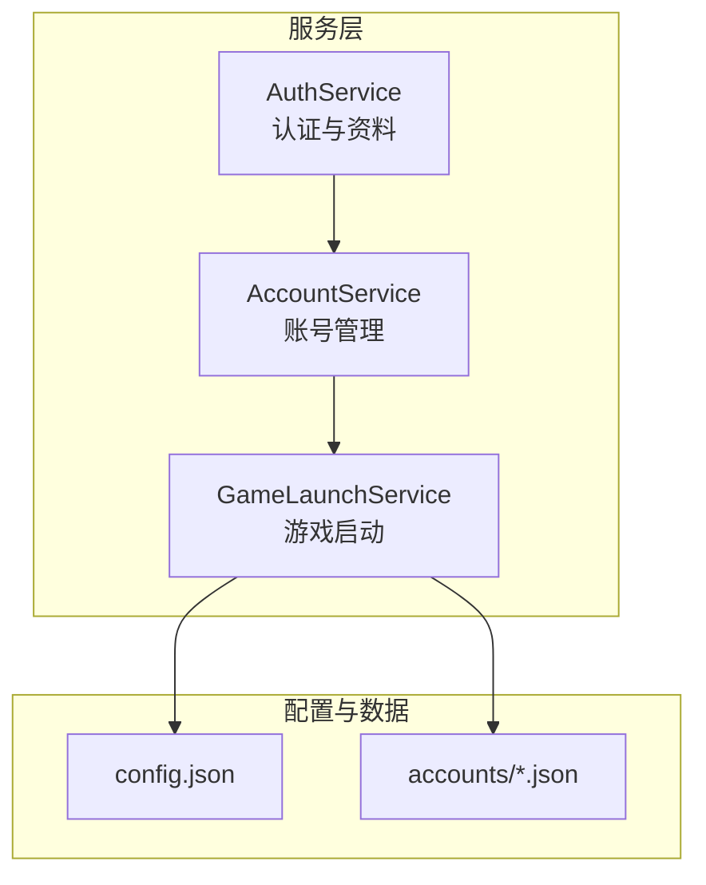
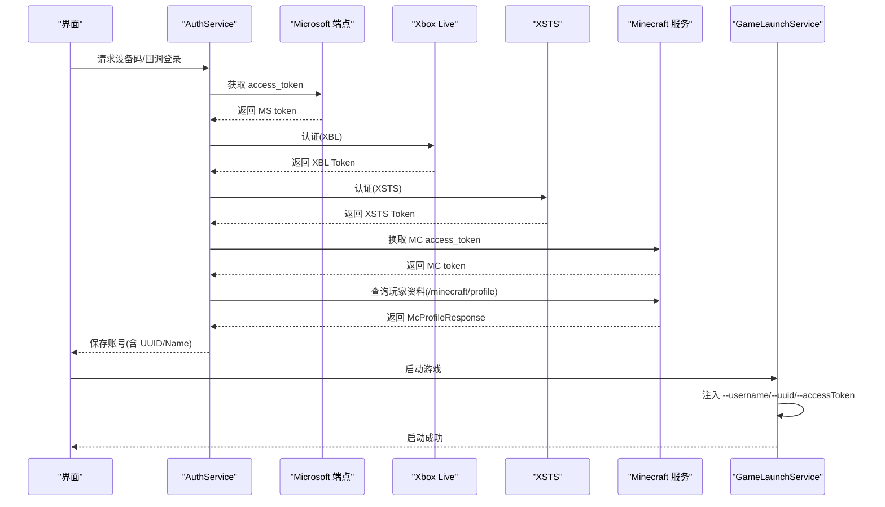
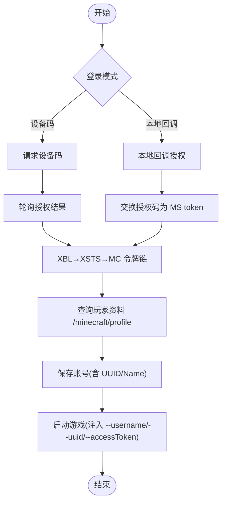
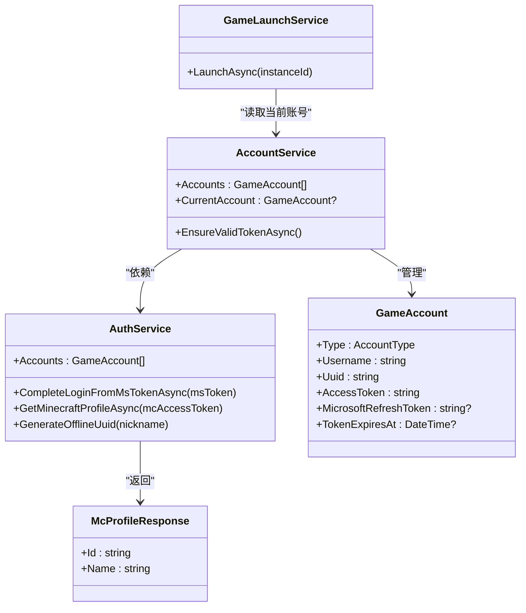
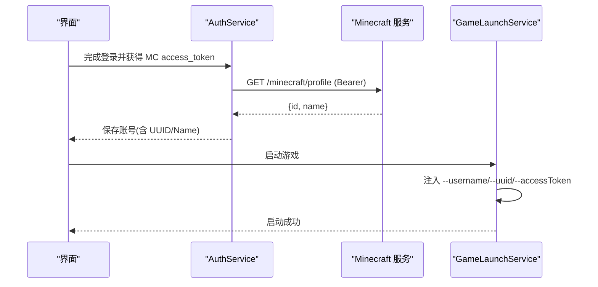

# 玩家资料模型

<cite>
**本文引用的文件**   
- [AuthService.cs](file://src/FufuLauncher/Services/AuthService.cs)
- [AccountService.cs](file://src/FufuLauncher/Services/AccountService.cs)
- [GameLaunchService.cs](file://src/FufuLauncher/Services/GameLaunchService.cs)
- [config.json](file://Start/appmcGAME/config.json)
- [43381ea021e59839958af459800e4d11.json](file://Start/appmcGAME/accounts/43381ea021e59839958af459800e4d11.json)
</cite>

## 目录
1. [简介](#简介)
2. [项目结构](#项目结构)
3. [核心组件](#核心组件)
4. [架构总览](#架构总览)
5. [详细组件分析](#详细组件分析)
6. [依赖关系分析](#依赖关系分析)
7. [性能考量](#性能考量)
8. [故障排查指南](#故障排查指南)
9. [结论](#结论)
10. [附录](#附录)

## 简介
本文件围绕 Minecraft 玩家资料响应模型，系统化说明 McProfileResponse 类的结构与字段含义（id、name），解释 UUID 的格式规范与命名空间，并给出玩家资料的获取条件与限制。同时提供完整的 JSON 响应示例与字段验证规则，阐述玩家资料在游戏启动与模组加载中的作用。

## 项目结构
本项目为 C# WPF 启动器，认证与账号管理集中在 Services 层：
- AuthService：负责微软设备码/回调登录、XBL/XSTS/MC 令牌链、玩家资料查询与离线 UUID 生成。
- AccountService：当前账号管理与 token 有效性校验。
- GameLaunchService：拼接 JVM 参数与游戏进程启动，注入 --username/--uuid/--accessToken 等关键参数。
- 配置文件与账户持久化：config.json 与 accounts/*.json。

图表来源
- [AuthService.cs:76-121](file://src/FufuLauncher/Services/AuthService.cs#L76-L121)
- [AccountService.cs:12-26](file://src/FufuLauncher/Services/AccountService.cs#L12-L26)
- [GameLaunchService.cs:35-65](file://src/FufuLauncher/Services/GameLaunchService.cs#L35-L65)

章节来源
- [AuthService.cs:76-121](file://src/FufuLauncher/Services/AuthService.cs#L76-L121)
- [AccountService.cs:12-26](file://src/FufuLauncher/Services/AccountService.cs#L12-L26)
- [GameLaunchService.cs:35-65](file://src/FufuLauncher/Services/GameLaunchService.cs#L35-L65)

## 核心组件
- McProfileResponse：Minecraft 玩家资料响应模型，包含 id（UUID）与 name（玩家名称）。
- GameAccount：本地账号实体，包含类型、用户名、UUID、访问令牌、刷新令牌、过期时间等。
- 认证链路：MS access_token → XBL → XSTS → MC access_token → 玩家资料。
- 离线模式：基于昵称生成确定性离线 UUID（OfflinePlayer 命名空间）。

章节来源
- [AuthService.cs:677-681](file://src/FufuLauncher/Services/AuthService.cs#L677-L681)
- [AuthService.cs:50-63](file://src/FufuLauncher/Services/AuthService.cs#L50-L63)
- [AuthService.cs:477-486](file://src/FufuLauncher/Services/AuthService.cs#L477-L486)

## 架构总览
下图展示从登录到获取玩家资料，再到启动游戏的完整流程。

图表来源
- [AuthService.cs:159-192](file://src/FufuLauncher/Services/AuthService.cs#L159-L192)
- [AuthService.cs:269-338](file://src/FufuLauncher/Services/AuthService.cs#L269-L338)
- [AuthService.cs:504-575](file://src/FufuLauncher/Services/AuthService.cs#L504-L575)
- [AuthService.cs:577-606](file://src/FufuLauncher/Services/AuthService.cs#L577-L606)
- [AuthService.cs:608-643](file://src/FufuLauncher/Services/AuthService.cs#L608-L643)
- [GameLaunchService.cs:240-255](file://src/FufuLauncher/Services/GameLaunchService.cs#L240-L255)

## 详细组件分析

### McProfileResponse 类与字段语义
- id：字符串，表示玩家的 UUID。该值来自 Minecraft 官方 API，遵循标准 UUID 格式（32 位十六进制字符，无分隔符或带分隔符均可解析）。
- name：字符串，表示玩家名称（显示名）。

用途：
- 用于在启动器中显示玩家信息。
- 作为启动参数 --uuid 传入游戏客户端，确保联机与皮肤等资源按身份加载。

章节来源
- [AuthService.cs:677-681](file://src/FufuLauncher/Services/AuthService.cs#L677-L681)

### UUID 格式规范与命名空间
- 在线账号 UUID：由 Minecraft 服务端分配，通常为 32 位十六进制字符串（如 43381ea021e59839958af459800e4d11）。
- 离线账号 UUID：基于“OfflinePlayer:” + 昵称进行 MD5 v3 计算，属于 OfflinePlayer 命名空间下的确定性 UUID。实现中通过构造字节序列、MD5 哈希后设置版本与变体位生成 Guid。

章节来源
- [AuthService.cs:477-486](file://src/FufuLauncher/Services/AuthService.cs#L477-L486)
- [43381ea021e59839958af459800e4d11.json:1-9](file://Start/appmcGAME/accounts/43381ea021e59839958af459800e4d11.json#L1-L9)

### 玩家资料获取条件与限制
- 必要条件：
  - 有效的 Microsoft access_token（通过设备码或本地回调获得）。
  - 完整的令牌链：XBL → XSTS → MC access_token。
  - 网络可达 api.minecraftservices.com，且请求头包含 User-Agent。
- 限制与错误：
  - 若返回 404，表示该微软账号未购买 Minecraft Java 版。
  - 非 2xx 状态码视为失败，记录日志并回退处理。
  - 解析异常时记录响应体片段以便排查。

章节来源
- [AuthService.cs:608-643](file://src/FufuLauncher/Services/AuthService.cs#L608-L643)
- [AuthService.cs:89-100](file://src/FufuLauncher/Services/AuthService.cs#L89-L100)

### JSON 响应示例与字段验证规则
- 成功响应示例（来自 /minecraft/profile）：
  - { "id": "43381ea021e59839958af459800e4d11", "name": "Player" }
- 字段验证规则：
  - id：非空字符串；建议符合 UUID 格式（32 位十六进制）。
  - name：非空字符串；长度合理（通常 3–16 字符）。
  - 其他字段：当前模型仅映射 id 与 name，忽略额外字段。

章节来源
- [AuthService.cs:677-681](file://src/FufuLauncher/Services/AuthService.cs#L677-L681)
- [43381ea021e59839958af459800e4d11.json:1-9](file://Start/appmcGAME/accounts/43381ea021e59839958af459800e4d11.json#L1-L9)

### 玩家资料在游戏启动与模组加载中的作用
- 启动参数注入：
  - --username：使用账号 Username。
  - --uuid：使用账号 Uuid（在线或离线）。
  - --accessToken：使用账号 AccessToken（在线模式必需）。
  - --userType：设置为 mojang（在线模式）。
- 作用：
  - 确保游戏客户端正确识别玩家身份，加载对应皮肤、资源包与联机权限。
  - 模组与资源包可能依据 UUID/name 做差异化加载或缓存。

章节来源
- [GameLaunchService.cs:240-255](file://src/FufuLauncher/Services/GameLaunchService.cs#L240-L255)

### 登录与资料获取流程图

图表来源
- [AuthService.cs:159-192](file://src/FufuLauncher/Services/AuthService.cs#L159-L192)
- [AuthService.cs:269-338](file://src/FufuLauncher/Services/AuthService.cs#L269-L338)
- [AuthService.cs:504-606](file://src/FufuLauncher/Services/AuthService.cs#L504-L606)
- [AuthService.cs:608-643](file://src/FufuLauncher/Services/AuthService.cs#L608-L643)
- [GameLaunchService.cs:240-255](file://src/FufuLauncher/Services/GameLaunchService.cs#L240-L255)

## 依赖关系分析
- AuthService 依赖 ConfigService（读取配置）、HttpClient（网络请求）、JsonSerializer（序列化/反序列化）。
- AccountService 依赖 AuthService，维护当前账号与 token 有效性。
- GameLaunchService 依赖 AccountService 获取当前账号的 Username、Uuid、AccessToken，并注入到 JVM 参数。

图表来源
- [AuthService.cs:76-121](file://src/FufuLauncher/Services/AuthService.cs#L76-L121)
- [AuthService.cs:677-681](file://src/FufuLauncher/Services/AuthService.cs#L677-L681)
- [AccountService.cs:12-26](file://src/FufuLauncher/Services/AccountService.cs#L12-L26)
- [GameLaunchService.cs:35-65](file://src/FufuLauncher/Services/GameLaunchService.cs#L35-L65)

章节来源
- [AuthService.cs:76-121](file://src/FufuLauncher/Services/AuthService.cs#L76-L121)
- [AccountService.cs:12-26](file://src/FufuLauncher/Services/AccountService.cs#L12-L26)
- [GameLaunchService.cs:35-65](file://src/FufuLauncher/Services/GameLaunchService.cs#L35-L65)

## 性能考量
- HttpClient 复用与超时：统一创建 HttpClient，设置超时与默认请求头，避免频繁握手与 401/403。
- 令牌刷新策略：仅在必要时重走完整令牌链，减少不必要网络开销。
- 日志截断：对长响应体进行截断，降低 I/O 压力。
- 启动参数构建：按需添加 GC 优化与 CPU 亲和性参数，提升运行效率。

[本节为通用指导，不直接分析具体文件]

## 故障排查指南
- 常见错误与定位：
  - 404 未购买 Minecraft：检查微软账号是否拥有 Java 版。
  - 网络异常：检查网络连通性与代理设置。
  - 令牌失效：触发自动刷新，若失败需重新登录。
  - 解析失败：查看应用日志中的响应片段。
- 诊断要点：
  - 确认 User-Agent 已设置。
  - 检查 config.json 的 AuthMode 与端口配置。
  - 核对 accounts/*.json 中 UUID/Name/AccessToken 是否有效。

章节来源
- [AuthService.cs:608-643](file://src/FufuLauncher/Services/AuthService.cs#L608-L643)
- [config.json:1-34](file://Start/appmcGAME/config.json#L1-L34)
- [43381ea021e59839958af459800e4d11.json:1-9](file://Start/appmcGAME/accounts/43381ea021e59839958af459800e4d11.json#L1-L9)

## 结论
McProfileResponse 是连接认证与服务端玩家信息的桥梁，其 id 与 name 字段驱动了启动器的账号展示与游戏启动参数注入。通过严格的令牌链与错误处理，系统确保了玩家资料获取的可靠性与一致性。离线模式下，基于 OfflinePlayer 命名空间的确定性 UUID 保证了体验一致。

[本节为总结，不直接分析具体文件]

## 附录

### 玩家资料获取与启动时序图

图表来源
- [AuthService.cs:608-643](file://src/FufuLauncher/Services/AuthService.cs#L608-L643)
- [GameLaunchService.cs:240-255](file://src/FufuLauncher/Services/GameLaunchService.cs#L240-L255)

### 字段验证规则表
- id：必填，字符串，建议匹配 UUID 格式（32 位十六进制）。
- name：必填，字符串，长度合理（通常 3–16 字符）。
- 其他字段：当前模型忽略，不影响解析。

[本节为概念性说明，不直接分析具体文件]