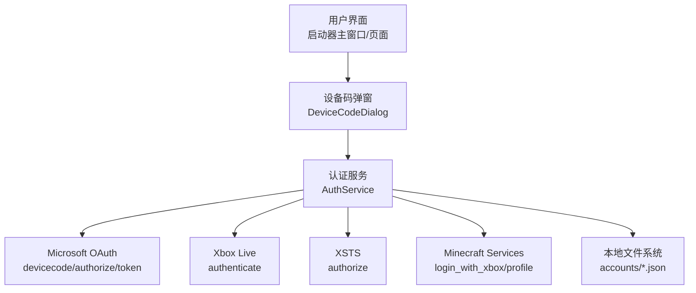
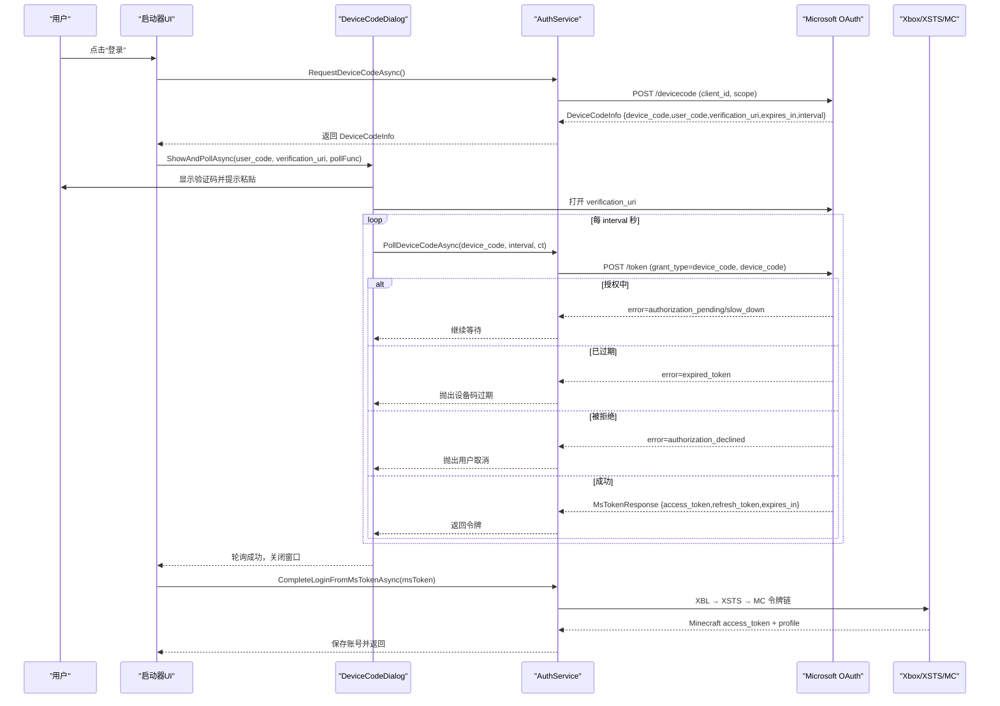
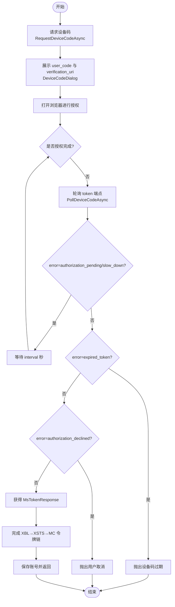
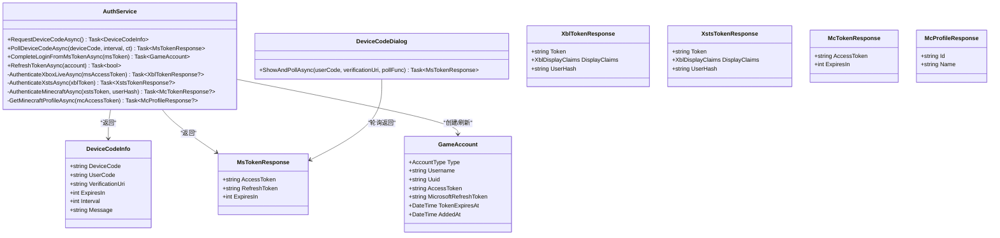
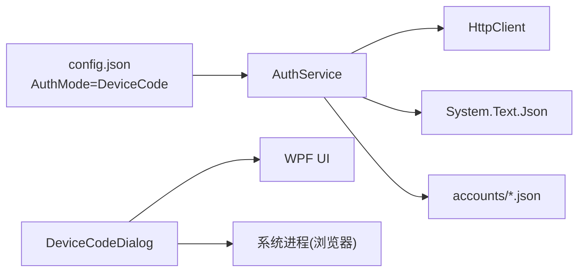

# 设备码模型

<cite>
**本文引用的文件**   
- [AuthService.cs](file://src/FufuLauncher/Services/AuthService.cs)
- [DeviceCodeDialog.cs](file://src/FufuLauncher/Interaction/DeviceCodeDialog.cs)
- [config.json](file://Start/appmcGAME/config.json)
- [43381ea021e59839958af459800e4d11.json](file://Start/appmcGAME/accounts/43381ea021e59839958af459800e4d11.json)
</cite>

## 目录
1. [简介](#简介)
2. [项目结构](#项目结构)
3. [核心组件](#核心组件)
4. [架构总览](#架构总览)
5. [详细组件分析](#详细组件分析)
6. [依赖关系分析](#依赖关系分析)
7. [性能考虑](#性能考虑)
8. [故障排查指南](#故障排查指南)
9. [结论](#结论)
10. [附录](#附录)

## 简介
本文件围绕 Microsoft 设备码授权响应模型，系统化说明 DeviceCodeInfo 类的结构与字段含义，解释设备码授权流程的工作原理与使用场景，给出完整的 JSON 响应示例与字段验证规则，并总结设备码的安全特性与最佳实践。该能力由 AuthService 实现，UI 交互由 DeviceCodeDialog 提供，配置项位于 config.json，账号数据持久化在 accounts 目录下。

## 项目结构
与设备码授权相关的代码主要分布在以下位置：
- 服务层：AuthService.cs（设备码请求、轮询、令牌链）
- 交互层：DeviceCodeDialog.cs（弹窗展示 user_code、自动复制剪贴板、一键打开 verification_uri、后台轮询）
- 配置：config.json（AuthMode=DeviceCode、回调端口等）
- 账号数据：accounts/*.json（登录成功后的持久化记录）

图表来源
- [AuthService.cs:158-265](file://src/FufuLauncher/Services/AuthService.cs#L158-L265)
- [DeviceCodeDialog.cs:20-203](file://src/FufuLauncher/Interaction/DeviceCodeDialog.cs#L20-L203)
- [config.json:21-23](file://Start/appmcGAME/config.json#L21-L23)

章节来源
- [AuthService.cs:1-120](file://src/FufuLauncher/Services/AuthService.cs#L1-L120)
- [DeviceCodeDialog.cs:1-60](file://src/FufuLauncher/Interaction/DeviceCodeDialog.cs#L1-L60)
- [config.json:1-34](file://Start/appmcGAME/config.json#L1-L34)

## 核心组件
- DeviceCodeInfo：设备码授权响应模型，包含 device_code、user_code、verification_uri、expires_in、interval 以及 message 字段。
- AuthService：负责发起设备码请求、轮询授权结果、完成微软→XBL→XSTS→MC 的完整令牌链路，并提供错误分类与异常封装。
- DeviceCodeDialog：设备码登录弹窗，负责展示 user_code、自动复制到剪贴板、一键打开 verification_uri、后台轮询授权结果并在完成后关闭弹窗。

章节来源
- [AuthService.cs:65-74](file://src/FufuLauncher/Services/AuthService.cs#L65-L74)
- [AuthService.cs:158-265](file://src/FufuLauncher/Services/AuthService.cs#L158-L265)
- [DeviceCodeDialog.cs:20-203](file://src/FufuLauncher/Interaction/DeviceCodeDialog.cs#L20-L203)

## 架构总览
设备码授权的整体流程如下：
1. 客户端调用 AuthService.RequestDeviceCodeAsync 向 Microsoft 请求设备码，返回 DeviceCodeInfo。
2. UI 通过 DeviceCodeDialog.ShowAndPollAsync 展示 user_code 和 verification_uri，并自动复制 user_code 到剪贴板，同时打开浏览器访问 verification_uri。
3. 客户端按 interval 周期调用 AuthService.PollDeviceCodeAsync 轮询 token 端点，直到获得 MsTokenResponse 或出现错误（如 expired_token、authorization_declined）。
4. 成功后，AuthService.CompleteLoginFromMsTokenAsync 依次完成 XBL、XSTS、MC 令牌交换，并获取玩家资料，最终持久化为 GameAccount。

图表来源
- [AuthService.cs:158-265](file://src/FufuLauncher/Services/AuthService.cs#L158-L265)
- [AuthService.cs:342-398](file://src/FufuLauncher/Services/AuthService.cs#L342-L398)
- [DeviceCodeDialog.cs:20-203](file://src/FufuLauncher/Interaction/DeviceCodeDialog.cs#L20-L203)

## 详细组件分析

### DeviceCodeInfo 模型与字段说明
DeviceCodeInfo 是 Microsoft 设备码授权响应的数据模型，字段含义如下：
- device_code：一次性设备码，用于后续轮询授权状态。
- user_code：供用户在浏览器中输入的短验证码，便于人工输入。
- verification_uri：用户完成授权的网页地址。
- expires_in：设备码有效期（秒），超过后需重新请求。
- interval：建议的轮询间隔（秒），客户端应遵循以避免频繁请求。
- message：可选的人类可读提示信息（例如操作指引）。

字段验证规则（基于实现与协议约定）：
- device_code：非空字符串；若为空则视为解析失败。
- user_code：非空字符串；用于展示与剪贴板复制。
- verification_uri：非空 URL；用于打开浏览器进行授权。
- expires_in：正整数；用于计算轮询截止时间（默认约 900 秒）。
- interval：正整数；用于控制轮询延迟（最小不低于 2 秒）。
- message：可选字符串；可用于 UI 提示。

章节来源
- [AuthService.cs:65-74](file://src/FufuLauncher/Services/AuthService.cs#L65-L74)
- [AuthService.cs:158-192](file://src/FufuLauncher/Services/AuthService.cs#L158-L192)
- [AuthService.cs:198-265](file://src/FufuLauncher/Services/AuthService.cs#L198-L265)

### 设备码授权流程与交互
- 请求设备码：POST 到 Microsoft devicecode 端点，携带 client_id 与 scope，返回 DeviceCodeInfo。
- 展示与引导：DeviceCodeDialog 展示 user_code 与 verification_uri，自动复制 user_code 到剪贴板，并打开浏览器。
- 轮询授权：按 interval 周期 POST 到 token 端点，处理 authorization_pending、slow_down、expired_token、authorization_declined 等状态。
- 成功处理：获得 MsTokenResponse 后，进入 XBL→XSTS→MC 令牌链，最终得到 Minecraft access_token 与玩家资料，并持久化账号。

图表来源
- [AuthService.cs:158-265](file://src/FufuLauncher/Services/AuthService.cs#L158-L265)
- [DeviceCodeDialog.cs:20-203](file://src/FufuLauncher/Interaction/DeviceCodeDialog.cs#L20-L203)

章节来源
- [AuthService.cs:158-265](file://src/FufuLauncher/Services/AuthService.cs#L158-L265)
- [DeviceCodeDialog.cs:20-203](file://src/FufuLauncher/Interaction/DeviceCodeDialog.cs#L20-L203)

### 相关类图（代码级）

图表来源
- [AuthService.cs:65-74](file://src/FufuLauncher/Services/AuthService.cs#L65-L74)
- [AuthService.cs:646-681](file://src/FufuLauncher/Services/AuthService.cs#L646-L681)
- [DeviceCodeDialog.cs:20-203](file://src/FufuLauncher/Interaction/DeviceCodeDialog.cs#L20-L203)

## 依赖关系分析
- AuthService 依赖 HttpClient 与 System.Text.Json 进行 HTTP 请求与 JSON 序列化。
- DeviceCodeDialog 依赖 WPF 窗口与剪贴板 API，以及系统进程启动以打开浏览器。
- 配置 AuthMode=DeviceCode 决定优先使用设备码模式；回调端口为 54321（备选 LocalCallback 模式）。
- 账号数据以 JSON 文件形式保存在 accounts 目录，文件名以 UUID 命名。

图表来源
- [config.json:21-23](file://Start/appmcGAME/config.json#L21-L23)
- [AuthService.cs:94-100](file://src/FufuLauncher/Services/AuthService.cs#L94-L100)
- [DeviceCodeDialog.cs:126-154](file://src/FufuLauncher/Interaction/DeviceCodeDialog.cs#L126-L154)

章节来源
- [AuthService.cs:94-100](file://src/FufuLauncher/Services/AuthService.cs#L94-L100)
- [DeviceCodeDialog.cs:126-154](file://src/FufuLauncher/Interaction/DeviceCodeDialog.cs#L126-L154)
- [config.json:21-23](file://Start/appmcGAME/config.json#L21-L23)

## 性能考虑
- 轮询间隔：遵循 interval 参数，且实现中设置最小 2 秒，避免过度请求。
- 超时控制：设备码默认有效期约 900 秒，轮询循环在 deadline 前持续，避免无限等待。
- 网络重试：对 HttpRequestException 进行短暂延时后重试，提高稳定性。
- 日志截断：响应体截断输出，防止长 JSON 污染日志。

[本节为通用指导，不直接分析具体文件]

## 故障排查指南
常见错误与处理：
- 网络异常：HttpRequestException，提示检查网络与代理设置。
- 设备码过期：error=expired_token，需重新请求设备码。
- 用户取消：error=authorization_declined，提示用户重新尝试。
- 令牌交换失败：MS/XBL/XSTS/MC 任一环节失败，查看应用日志定位。
- 未购买 Minecraft：查询玩家资料返回 404，提示前往官方渠道购买。

章节来源
- [AuthService.cs:198-265](file://src/FufuLauncher/Services/AuthService.cs#L198-L265)
- [AuthService.cs:608-643](file://src/FufuLauncher/Services/AuthService.cs#L608-L643)

## 结论
DeviceCodeInfo 作为 Microsoft 设备码授权的核心响应模型，提供了设备码、用户验证码、验证网址、有效期与轮询间隔等关键信息。结合 AuthService 与 DeviceCodeDialog，实现了安全、友好的设备码登录体验。遵循字段验证规则与安全最佳实践，可有效提升用户体验与系统健壮性。

[本节为总结，不直接分析具体文件]

## 附录

### 完整 JSON 响应示例（设备码授权）
以下为设备码授权响应（DeviceCodeInfo）的典型字段结构（示例值仅示意，实际值由服务端生成）：
- device_code：随机生成的设备码字符串
- user_code：简短的用户验证码（如 ABC-123）
- verification_uri：授权网页地址（如 https://www.microsoft.com/link）
- expires_in：有效期秒数（如 900）
- interval：轮询间隔秒数（如 5）
- message：可选提示文本（如 “请在浏览器中输入验证码并完成授权”）

章节来源
- [AuthService.cs:65-74](file://src/FufuLauncher/Services/AuthService.cs#L65-L74)

### 字段验证规则汇总
- device_code：必填，非空字符串
- user_code：必填，非空字符串
- verification_uri：必填，有效 URL
- expires_in：必填，正整数
- interval：必填，正整数
- message：可选，字符串

章节来源
- [AuthService.cs:158-192](file://src/FufuLauncher/Services/AuthService.cs#L158-L192)

### 安全特性与最佳实践
- 安全性：
  - 设备码一次性使用，降低泄露风险
  - 用户验证码便于人工输入，减少误输
  - 支持 offline_access 刷新令牌，避免频繁登录
  - 错误分类明确，便于区分网络、取消、过期等问题
- 最佳实践：
  - 严格遵循 interval 轮询，避免过快请求
  - 合理设置超时与重试策略
  - 对用户友好提示（复制剪贴板、一键打开浏览器）
  - 记录必要日志但不输出敏感信息（响应体截断）

章节来源
- [AuthService.cs:158-265](file://src/FufuLauncher/Services/AuthService.cs#L158-L265)
- [DeviceCodeDialog.cs:126-154](file://src/FufuLauncher/Interaction/DeviceCodeDialog.cs#L126-L154)