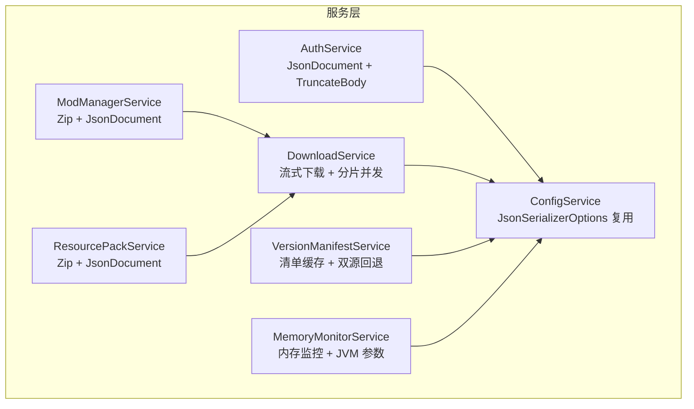
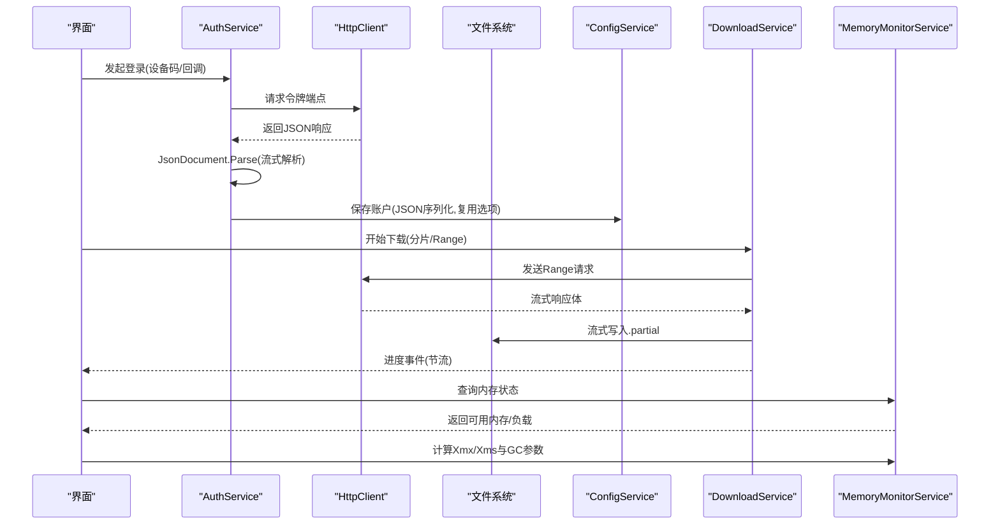
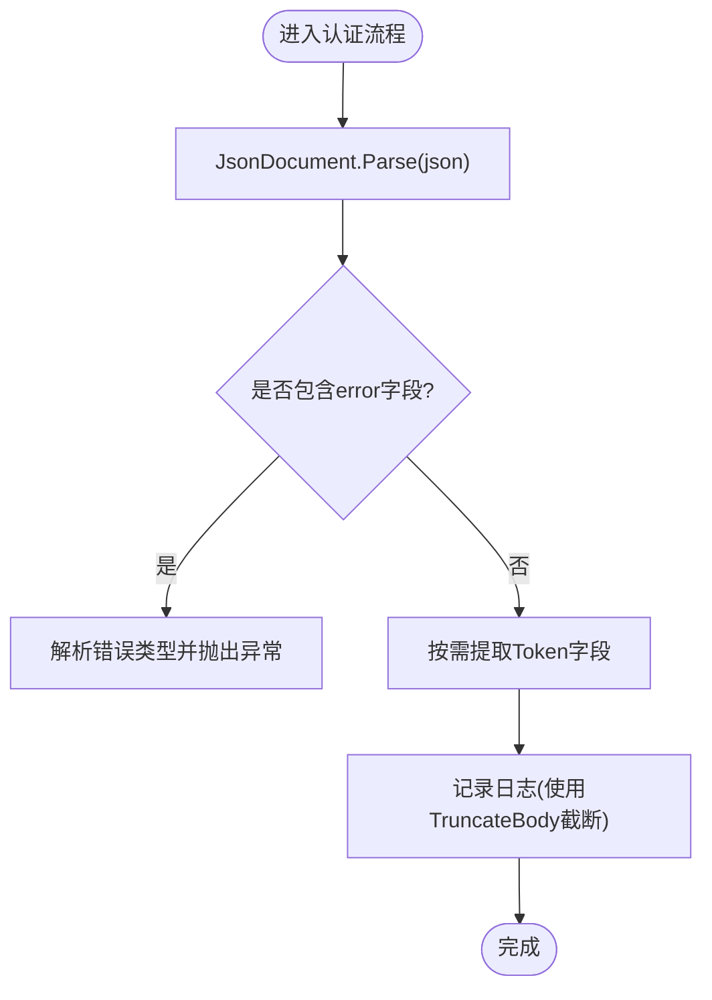
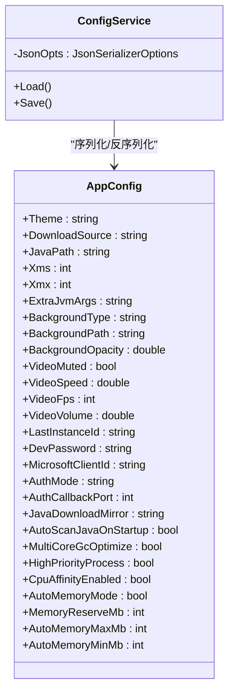
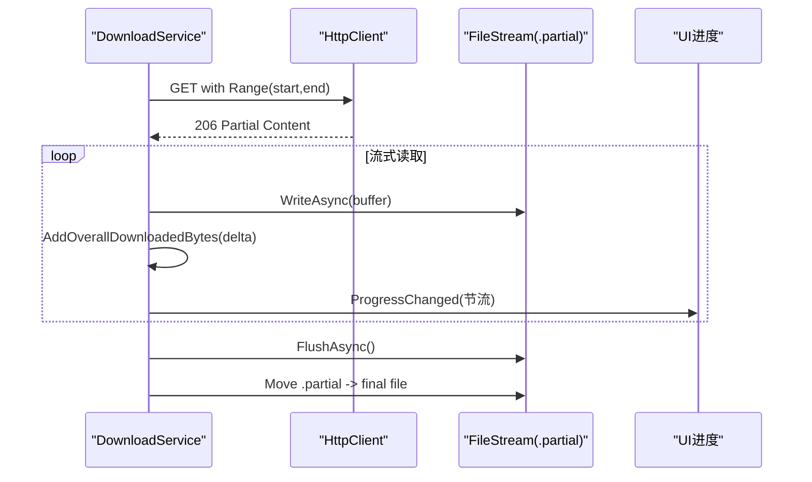
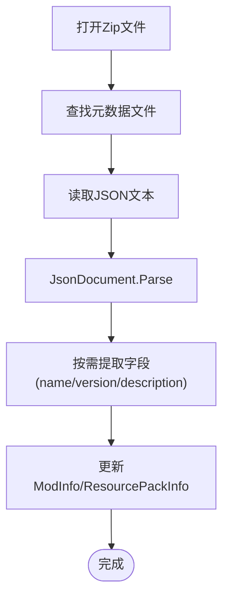
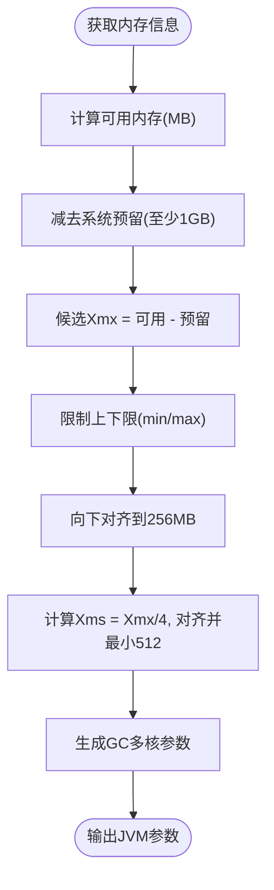
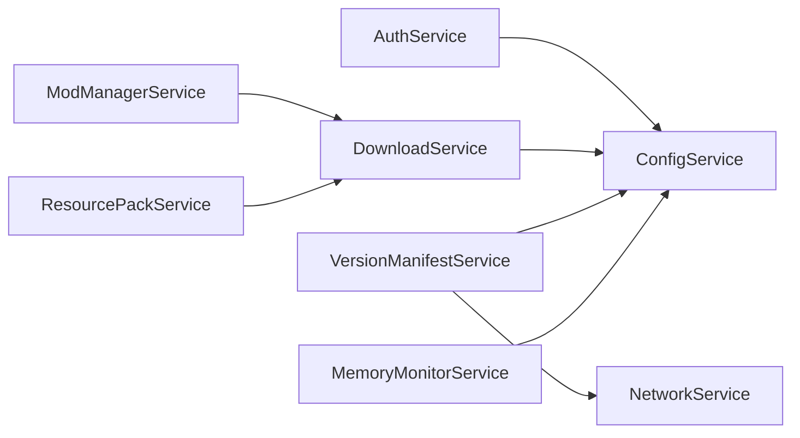

# 性能优化与内存管理

<cite>
**本文引用的文件**   
- [AuthService.cs](file://src/FufuLauncher/Services/AuthService.cs)
- [ConfigService.cs](file://src/FufuLauncher/Services/ConfigService.cs)
- [DownloadService.cs](file://src/FufuLauncher/Services/DownloadService.cs)
- [VersionManifestService.cs](file://src/FufuLauncher/Services/VersionManifestService.cs)
- [ModManagerService.cs](file://src/FufuLauncher/Services/ModManagerService.cs)
- [ResourcePackService.cs](file://src/FufuLauncher/Services/ResourcePackService.cs)
- [MemoryMonitorService.cs](file://src/FufuLauncher/Services/MemoryMonitorService.cs)
</cite>

## 目录
1. [引言](#引言)
2. [项目结构](#项目结构)
3. [核心组件](#核心组件)
4. [架构总览](#架构总览)
5. [详细组件分析](#详细组件分析)
6. [依赖关系分析](#依赖关系分析)
7. [性能考量](#性能考量)
8. [故障排查指南](#故障排查指南)
9. [结论](#结论)
10. [附录](#附录)

## 引言
本文件聚焦“可爱的芙芙启动器”的数据格式处理与内存管理性能优化，围绕大对象处理、流式解析、序列化复用、字符串截断、内存池化与资源释放等主题，给出可落地的实践方法与调优建议。文档结合仓库中实际代码实现，提供可视化图示与具体定位路径，帮助读者快速理解并应用相关优化技巧。

## 项目结构
本项目采用按服务划分的模块化结构，数据与网络相关的核心逻辑集中在 Services 层：
- AuthService：账号登录与令牌链，使用 JsonDocument 进行流式解析，并提供日志安全截断方法。
- ConfigService：配置持久化，集中复用 JsonSerializerOptions，避免重复创建开销。
- DownloadService：多线程分片断点续传下载，流式读取响应体，减少内存峰值。
- VersionManifestService：版本清单拉取与缓存，统一超时与源切换策略。
- ModManagerService / ResourcePackService：模组与资源包元数据解析，使用 JsonDocument 按需取值。
- MemoryMonitorService：系统内存监控与 JVM 智能分配，降低 GC 压力。

**图表来源** 
- [AuthService.cs:100-110](file://src/FufuLauncher/Services/AuthService.cs#L100-L110)
- [ConfigService.cs:90-98](file://src/FufuLauncher/Services/ConfigService.cs#L90-L98)
- [DownloadService.cs:100-115](file://src/FufuLauncher/Services/DownloadService.cs#L100-L115)
- [VersionManifestService.cs:172-189](file://src/FufuLauncher/Services/VersionManifestService.cs#L172-L189)
- [ModManagerService.cs:139-184](file://src/FufuLauncher/Services/ModManagerService.cs#L139-L184)
- [ResourcePackService.cs:75-92](file://src/FufuLauncher/Services/ResourcePackService.cs#L75-L92)
- [MemoryMonitorService.cs:175-213](file://src/FufuLauncher/Services/MemoryMonitorService.cs#L175-L213)

**章节来源**
- [AuthService.cs:100-110](file://src/FufuLauncher/Services/AuthService.cs#L100-L110)
- [ConfigService.cs:90-98](file://src/FufuLauncher/Services/ConfigService.cs#L90-L98)
- [DownloadService.cs:100-115](file://src/FufuLauncher/Services/DownloadService.cs#L100-L115)
- [VersionManifestService.cs:172-189](file://src/FufuLauncher/Services/VersionManifestService.cs#L172-L189)
- [ModManagerService.cs:139-184](file://src/FufuLauncher/Services/ModManagerService.cs#L139-L184)
- [ResourcePackService.cs:75-92](file://src/FufuLauncher/Services/ResourcePackService.cs#L75-L92)
- [MemoryMonitorService.cs:175-213](file://src/FufuLauncher/Services/MemoryMonitorService.cs#L175-L213)

## 核心组件
- 流式 JSON 解析（JsonDocument）：在认证、模组与资源包元数据处理中，通过 JsonDocument 按需读取字段，避免一次性反序列化为完整对象，显著降低大对象内存占用与 GC 压力。
- 序列化选项复用（JsonSerializerOptions）：配置服务集中定义并复用序列化选项，避免频繁创建带来的额外开销。
- 流式下载与分片：下载服务以流式方式读取响应体，配合 Range 请求与多分片并发，提升吞吐并控制内存峰值。
- 字符串截断（TruncateBody）：在记录错误日志时，对长响应体进行截断，防止日志膨胀影响 I/O 与存储。
- 内存监控与 JVM 参数：根据系统可用内存智能计算 Xmx/Xms，并生成多核 GC 优化参数，降低运行时抖动。

**章节来源**
- [AuthService.cs:219-241](file://src/FufuLauncher/Services/AuthService.cs#L219-L241)
- [ModManagerService.cs:148-163](file://src/FufuLauncher/Services/ModManagerService.cs#L148-L163)
- [ResourcePackService.cs:82-92](file://src/FufuLauncher/Services/ResourcePackService.cs#L82-L92)
- [ConfigService.cs:90-98](file://src/FufuLauncher/Services/ConfigService.cs#L90-L98)
- [DownloadService.cs:422-451](file://src/FufuLauncher/Services/DownloadService.cs#L422-L451)
- [AuthService.cs:103-104](file://src/FufuLauncher/Services/AuthService.cs#L103-L104)
- [MemoryMonitorService.cs:175-213](file://src/FufuLauncher/Services/MemoryMonitorService.cs#L175-L213)

## 架构总览
下图展示数据格式处理与内存管理的整体交互：认证流程使用 JsonDocument 流式解析；配置服务复用序列化选项；下载服务流式写入磁盘；模组与资源包从压缩包内读取元数据并流式解析；内存监控为 JVM 提供参数建议。

**图表来源** 
- [AuthService.cs:219-241](file://src/FufuLauncher/Services/AuthService.cs#L219-L241)
- [ConfigService.cs:139-150](file://src/FufuLauncher/Services/ConfigService.cs#L139-L150)
- [DownloadService.cs:422-451](file://src/FufuLauncher/Services/DownloadService.cs#L422-L451)
- [MemoryMonitorService.cs:175-213](file://src/FufuLauncher/Services/MemoryMonitorService.cs#L175-L213)

## 详细组件分析

### 流式 JSON 解析与日志截断（AuthService）
- 使用 JsonDocument 解析认证响应，按需提取字段，避免全量反序列化。
- 提供 TruncateBody 方法，将长响应体截断后写入日志，降低 I/O 压力。
- 在轮询与错误分支中，均使用截断后的片段记录上下文，便于问题定位。

**图表来源** 
- [AuthService.cs:219-241](file://src/FufuLauncher/Services/AuthService.cs#L219-L241)
- [AuthService.cs:103-104](file://src/FufuLauncher/Services/AuthService.cs#L103-L104)

**章节来源**
- [AuthService.cs:219-241](file://src/FufuLauncher/Services/AuthService.cs#L219-L241)
- [AuthService.cs:103-104](file://src/FufuLauncher/Services/AuthService.cs#L103-L104)

### 配置序列化选项复用（ConfigService）
- 集中定义 JsonSerializerOptions，启用 WriteIndented 与忽略空值，避免每次序列化新建配置。
- 加载与保存配置时复用同一选项实例，减少对象创建与解析器初始化成本。

**图表来源** 
- [ConfigService.cs:90-98](file://src/FufuLauncher/Services/ConfigService.cs#L90-L98)
- [ConfigService.cs:13-86](file://src/FufuLauncher/Services/ConfigService.cs#L13-L86)

**章节来源**
- [ConfigService.cs:90-98](file://src/FufuLauncher/Services/ConfigService.cs#L90-L98)
- [ConfigService.cs:139-150](file://src/FufuLauncher/Services/ConfigService.cs#L139-L150)

### 流式下载与分片并发（DownloadService）
- 小文件单连接 Range 断点续传，大文件多 Range 分片并发，预分配 .partial 文件，避免随机写放大。
- 流式读取响应体，使用固定大小缓冲区循环写入，控制内存峰值。
- 全局总进度节流上报，平衡 UI 刷新与性能。

**图表来源** 
- [DownloadService.cs:422-451](file://src/FufuLauncher/Services/DownloadService.cs#L422-L451)
- [DownloadService.cs:454-547](file://src/FufuLauncher/Services/DownloadService.cs#L454-L547)
- [DownloadService.cs:140-169](file://src/FufuLauncher/Services/DownloadService.cs#L140-L169)

**章节来源**
- [DownloadService.cs:422-451](file://src/FufuLauncher/Services/DownloadService.cs#L422-L451)
- [DownloadService.cs:454-547](file://src/FufuLauncher/Services/DownloadService.cs#L454-L547)
- [DownloadService.cs:140-169](file://src/FufuLauncher/Services/DownloadService.cs#L140-L169)

### 模组与资源包元数据解析（ModManagerService / ResourcePackService）
- 从 Zip 中读取元数据文件（fabric.mod.json、quilt.mod.json、mods.toml、pack.mcmeta），使用 JsonDocument 按需取值。
- 失败容错与降级：解析失败保留默认值，不影响主流程。

**图表来源** 
- [ModManagerService.cs:148-163](file://src/FufuLauncher/Services/ModManagerService.cs#L148-L163)
- [ResourcePackService.cs:82-92](file://src/FufuLauncher/Services/ResourcePackService.cs#L82-L92)

**章节来源**
- [ModManagerService.cs:148-163](file://src/FufuLauncher/Services/ModManagerService.cs#L148-L163)
- [ResourcePackService.cs:82-92](file://src/FufuLauncher/Services/ResourcePackService.cs#L82-L92)

### 内存监控与 JVM 参数优化（MemoryMonitorService）
- 读取系统物理内存总量与可用内存，智能计算 Xmx/Xms，向下对齐到 256MB 减少碎片。
- 生成多核 GC 优化参数（ParallelGCThreads、ConcGCThreads、CICompilerCount），适配多核 CPU。

**图表来源** 
- [MemoryMonitorService.cs:175-213](file://src/FufuLauncher/Services/MemoryMonitorService.cs#L175-L213)

**章节来源**
- [MemoryMonitorService.cs:175-213](file://src/FufuLauncher/Services/MemoryMonitorService.cs#L175-L213)

## 依赖关系分析
- AuthService 依赖 ConfigService 进行账户持久化，使用 HttpClient 与 JsonDocument 进行网络与解析。
- DownloadService 依赖 ConfigService 的下载源设置，使用 HttpClient 与 FileStream 进行流式下载。
- VersionManifestService 依赖 NetworkService 与 ConfigService，统一超时与源切换。
- ModManagerService / ResourcePackService 依赖 InstanceService 与 DownloadService，复用下载引擎。
- MemoryMonitorService 依赖 ConfigService 的配置项，提供 JVM 参数建议。

**图表来源** 
- [AuthService.cs:106-121](file://src/FufuLauncher/Services/AuthService.cs#L106-L121)
- [DownloadService.cs:99-114](file://src/FufuLauncher/Services/DownloadService.cs#L99-L114)
- [VersionManifestService.cs:172-189](file://src/FufuLauncher/Services/VersionManifestService.cs#L172-L189)
- [ModManagerService.cs:84-91](file://src/FufuLauncher/Services/ModManagerService.cs#L84-L91)
- [ResourcePackService.cs:38-41](file://src/FufuLauncher/Services/ResourcePackService.cs#L38-L41)
- [MemoryMonitorService.cs:56-59](file://src/FufuLauncher/Services/MemoryMonitorService.cs#L56-L59)

**章节来源**
- [AuthService.cs:106-121](file://src/FufuLauncher/Services/AuthService.cs#L106-L121)
- [DownloadService.cs:99-114](file://src/FufuLauncher/Services/DownloadService.cs#L99-L114)
- [VersionManifestService.cs:172-189](file://src/FufuLauncher/Services/VersionManifestService.cs#L172-L189)
- [ModManagerService.cs:84-91](file://src/FufuLauncher/Services/ModManagerService.cs#L84-L91)
- [ResourcePackService.cs:38-41](file://src/FufuLauncher/Services/ResourcePackService.cs#L38-L41)
- [MemoryMonitorService.cs:56-59](file://src/FufuLauncher/Services/MemoryMonitorService.cs#L56-L59)

## 性能考量
- 大对象处理优化
  - 使用 JsonDocument 流式解析，避免一次性构建大型对象图，降低堆分配与 GC 频率。
  - 在模组与资源包元数据处理中，仅读取必要字段，减少无用对象创建。
- 流式处理
  - 下载过程使用流式读取与写入，固定缓冲大小，避免大数组分配。
  - 分片并发下载提升吞吐，同时通过独立信号量隔离不同类别任务，避免相互阻塞。
- 序列化性能优化
  - 复用 JsonSerializerOptions，避免重复初始化解析器与格式化器。
  - 避免不必要的对象创建：在保存账户与配置时直接序列化目标对象，不引入中间包装。
- 字符串截断技术
  - TruncateBody 方法限制日志长度，降低 I/O 与存储压力，提高错误定位效率。
- 内存管理与垃圾回收优化
  - 内存监控服务动态计算 Xmx/Xms，并按 256MB 对齐，减少 GC 碎片。
  - 生成多核 GC 参数，匹配 CPU 核心数，提升并行度与吞吐。
- 大文件处理策略
  - 预分配 .partial 文件，避免扩展开销；分片写入非重叠偏移，保证并发安全。
  - 校验失败自动删除并重下，确保最终一致性。

[本节为通用指导，不直接分析具体文件]

## 故障排查指南
- 认证失败
  - 检查网络连通性与 User-Agent 头设置，确认服务端未限流或拒绝。
  - 查看日志中的 TruncateBody 片段，定位错误码与描述。
- 下载失败
  - 检查磁盘空间与权限，确认 .partial 文件未被锁定。
  - 观察分片并发与 Range 支持情况，必要时降级为单连接模式。
- 配置读写异常
  - 确认配置文件路径与权限，检查序列化选项是否正确。
- 内存不足
  - 调整 AutoMemoryMinMb/AutoMemoryMaxMb 与 MemoryReserveMb，重新计算 Xmx/Xms。
  - 观察 JVM GC 参数是否合理，必要时手动调整。

**章节来源**
- [AuthService.cs:523-634](file://src/FufuLauncher/Services/AuthService.cs#L523-L634)
- [DownloadService.cs:264-293](file://src/FufuLauncher/Services/DownloadService.cs#L264-L293)
- [ConfigService.cs:139-150](file://src/FufuLauncher/Services/ConfigService.cs#L139-L150)
- [MemoryMonitorService.cs:175-213](file://src/FufuLauncher/Services/MemoryMonitorService.cs#L175-L213)

## 结论
通过 JsonDocument 流式解析、序列化选项复用、流式下载与分片并发、字符串截断以及内存监控与 JVM 参数优化，项目在数据格式处理与内存管理方面实现了显著的性能提升与稳定性增强。建议在后续迭代中持续评估内存占用与 GC 行为，结合监控工具进行精细化调优。

[本节为总结性内容，不直接分析具体文件]

## 附录
- 性能监控与调优工具建议
  - 使用 .NET 内置诊断工具（dotnet-counters、dotnet-trace）监控 GC 与内存分配。
  - 结合 Windows 性能监视器（PerfMon）观察进程内存与线程活动。
  - 针对下载与 I/O 瓶颈，使用磁盘 IO 监控工具（如 Process Explorer 的 IO 视图）。
- 最佳实践清单
  - 优先使用流式 API（ReadAsStreamAsync、JsonDocument）处理大对象。
  - 复用共享资源（HttpClient、JsonSerializerOptions、缓冲池）。
  - 严格控制日志大小，避免长文本写入。
  - 合理设置超时与重试策略，提升鲁棒性。

[本节为通用指导，不直接分析具体文件]