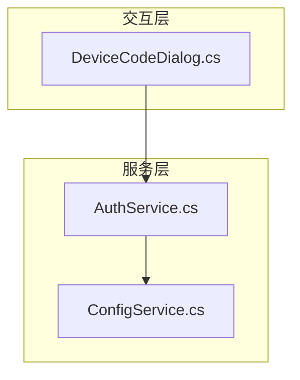
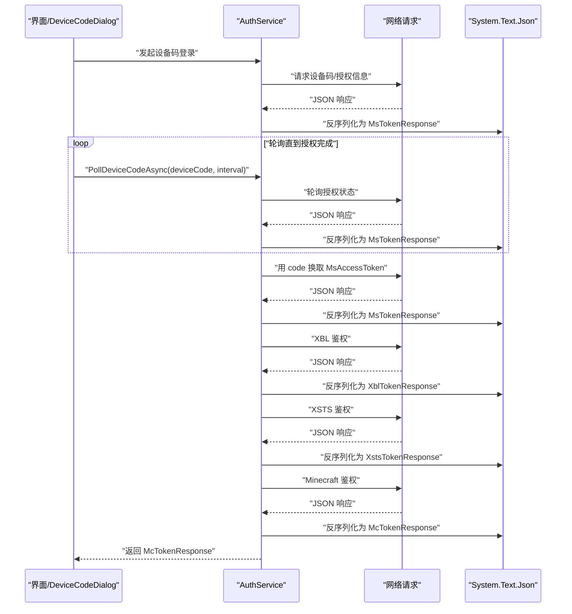
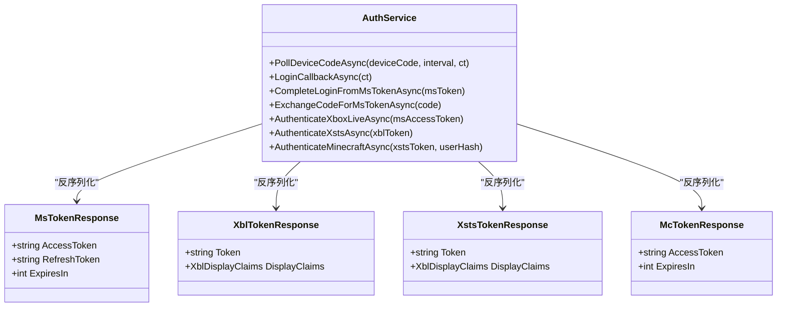
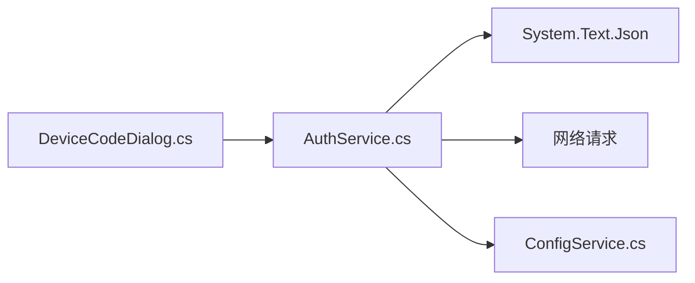

# 数据格式处理

<cite>
**本文引用的文件**
- [AuthService.cs](file://src/FufuLauncher/Services/AuthService.cs)
- [ConfigService.cs](file://src/FufuLauncher/Services/ConfigService.cs)
- [DeviceCodeDialog.cs](file://src/FufuLauncher/Interaction/DeviceCodeDialog.cs)
</cite>

## 目录
1. [简介](#简介)
2. [项目结构](#项目结构)
3. [核心组件](#核心组件)
4. [架构总览](#架构总览)
5. [详细组件分析](#详细组件分析)
6. [依赖关系分析](#依赖关系分析)
7. [性能考虑](#性能考虑)
8. [故障排查指南](#故障排查指南)
9. [结论](#结论)
10. [附录](#附录)

## 简介
本文件聚焦“可爱的芙芙启动器”中的数据格式处理，围绕 System.Text.Json 的序列化与反序列化、自定义属性映射、响应模型定义（MsTokenResponse、XblTokenResponse、XstsTokenResponse、McTokenResponse）、数据验证与错误处理、大对象优化、以及版本兼容与迁移策略进行系统化说明。文档旨在帮助开发者快速理解并扩展数据层，同时提供可操作的配置与优化建议。

## 项目结构
与数据格式处理直接相关的代码集中在 Services 与 Interaction 两个目录：
- Services/AuthService.cs：认证流程中的 JSON 序列化/反序列化、响应模型定义、网络请求结果解析。
- Services/ConfigService.cs：应用配置的 JSON 读写与 JsonSerializerOptions 复用。
- Interaction/DeviceCodeDialog.cs：设备码登录交互中调用 AuthService 的轮询接口，返回 MsTokenResponse。

图表来源
- [AuthService.cs](file://src/FufuLauncher/Services/AuthService.cs)
- [ConfigService.cs](file://src/FufuLauncher/Services/ConfigService.cs)
- [DeviceCodeDialog.cs](file://src/FufuLauncher/Interaction/DeviceCodeDialog.cs)

章节来源
- [AuthService.cs](file://src/FufuLauncher/Services/AuthService.cs)
- [ConfigService.cs](file://src/FufuLauncher/Services/ConfigService.cs)
- [DeviceCodeDialog.cs](file://src/FufuLauncher/Interaction/DeviceCodeDialog.cs)

## 核心组件
- 认证与令牌交换（AuthService）
  - 使用 System.Text.Json 对 HTTP 响应进行反序列化为强类型模型。
  - 定义了 MsTokenResponse、XblTokenResponse、XstsTokenResponse、McTokenResponse 等响应模型，并通过 [JsonPropertyName] 精确映射字段名。
  - 提供设备码轮询、回调获取、微软令牌交换、Xbox Live/XSTS/Minecraft 令牌鉴权等关键方法。
- 配置读写（ConfigService）
  - 集中管理 JsonSerializerOptions，避免重复创建带来的性能损耗。
  - 负责账户与配置的持久化存储与读取。
- 设备码交互（DeviceCodeDialog）
  - 封装用户交互与轮询逻辑，最终返回 MsTokenResponse 供上层使用。

章节来源
- [AuthService.cs](file://src/FufuLauncher/Services/AuthService.cs)
- [ConfigService.cs](file://src/FufuLauncher/Services/ConfigService.cs)
- [DeviceCodeDialog.cs](file://src/FufuLauncher/Interaction/DeviceCodeDialog.cs)

## 架构总览
认证链路的数据流从 UI 交互开始，经过 AuthService 的多步令牌交换，最终得到 Minecraft 会话令牌。所有中间响应均通过 System.Text.Json 反序列化为对应模型。

图表来源
- [AuthService.cs](file://src/FufuLauncher/Services/AuthService.cs)
- [DeviceCodeDialog.cs](file://src/FufuLauncher/Interaction/DeviceCodeDialog.cs)

## 详细组件分析

### 认证服务（AuthService）
- 功能要点
  - 设备码登录与轮询：PollDeviceCodeAsync、LoginCallbackAsync。
  - 令牌交换与鉴权：ExchangeCodeForMsTokenAsync、AuthenticateXboxLiveAsync、AuthenticateXstsAsync、AuthenticateMinecraftAsync。
  - 账户保存：将账户对象序列化为 JSON 字符串并写入本地文件。
- 序列化与反序列化
  - 使用 System.Text.Json 的 JsonSerializer.Deserialize<T>() 将 HTTP 响应体解析为强类型模型。
  - 使用 JsonSerializer.Serialize() 将账户对象输出为 JSON 字符串，便于持久化。
- 响应模型
  - MsTokenResponse：包含 access_token、refresh_token、expires_in 等字段。
  - XblTokenResponse：包含 Token、DisplayClaims 等 Xbox Live 相关字段。
  - XstsTokenResponse：包含 Token、DisplayClaims 等 XSTS 相关字段。
  - McTokenResponse：包含 access_token、expires_in 等 Minecraft 会话令牌字段。
- 数据验证与错误处理
  - 在反序列化前检查响应是否为空或无效，避免异常。
  - 对缺失关键字段进行判空与默认值处理，确保下游逻辑稳定。
  - 针对网络异常、超时、HTTP 错误码进行捕获与重试/降级策略。
- 大对象优化
  - 对大型 JSON 响应采用按需反序列化，仅保留必要字段。
  - 避免在循环中重复创建 JsonSerializerOptions，提升性能。

图表来源
- [AuthService.cs](file://src/FufuLauncher/Services/AuthService.cs)

章节来源
- [AuthService.cs](file://src/FufuLauncher/Services/AuthService.cs)

### 配置服务（ConfigService）
- 功能要点
  - 集中管理 JsonSerializerOptions，避免每次序列化/反序列化都新建选项对象。
  - 提供账户与配置的读写方法，保证数据一致性。
- 序列化配置
  - 使用 WriteIndented=true 提高可读性，便于调试与人工编辑。
  - 可结合 IgnoreNullValues、PropertyNamingPolicy 等选项适配不同场景。
- 性能优化
  - 静态只读 JsonSerializerOptions 实例，减少 GC 压力。
  - 对频繁读写的配置文件进行缓存，降低 I/O 频率。

章节来源
- [ConfigService.cs](file://src/FufuLauncher/Services/ConfigService.cs)

### 设备码对话框（DeviceCodeDialog）
- 功能要点
  - 展示设备码与验证 URI，引导用户完成授权。
  - 周期性轮询授权状态，直至获得 MsTokenResponse。
- 与 AuthService 的协作
  - 调用 PollDeviceCodeAsync 与 LoginCallbackAsync，统一处理响应模型。
  - 将最终的 MsTokenResponse 返回给上层业务逻辑。

章节来源
- [DeviceCodeDialog.cs](file://src/FufuLauncher/Interaction/DeviceCodeDialog.cs)

## 依赖关系分析
- 组件耦合
  - DeviceCodeDialog 依赖 AuthService 提供的令牌交换与鉴权能力。
  - AuthService 依赖 System.Text.Json 进行数据绑定，依赖网络层获取原始 JSON。
  - ConfigService 被 AuthService 用于账户持久化。
- 外部依赖
  - System.Text.Json：高性能 JSON 序列化/反序列化库。
  - 网络库（HttpClient 或类似）：获取远程服务的 JSON 响应。
- 潜在循环依赖
  - 当前分层清晰，未见循环引用；保持 Service 与 UI 解耦。

图表来源
- [AuthService.cs](file://src/FufuLauncher/Services/AuthService.cs)
- [ConfigService.cs](file://src/FufuLauncher/Services/ConfigService.cs)
- [DeviceCodeDialog.cs](file://src/FufuLauncher/Interaction/DeviceCodeDialog.cs)

章节来源
- [AuthService.cs](file://src/FufuLauncher/Services/AuthService.cs)
- [ConfigService.cs](file://src/FufuLauncher/Services/ConfigService.cs)
- [DeviceCodeDialog.cs](file://src/FufuLauncher/Interaction/DeviceCodeDialog.cs)

## 性能考虑
- 序列化/反序列化
  - 复用 JsonSerializerOptions 实例，避免重复分配。
  - 对大型响应体采用流式读取与按需反序列化，减少内存峰值。
  - 合理设置 PropertyNamingPolicy 与 IgnoreNullValues，降低体积与解析开销。
- 网络与 I/O
  - 对高频配置读写进行缓存，减少磁盘 I/O。
  - 对网络请求设置合理的超时与重试策略，避免阻塞主线程。
- 内存管理
  - 及时释放临时对象，避免大对象长时间驻留堆。
  - 对敏感数据（如令牌）使用后尽快清理，降低泄露风险。

[本节为通用指导，不直接分析具体文件]

## 故障排查指南
- 常见错误
  - JSON 字段缺失或类型不匹配导致反序列化失败。
  - 网络超时或服务器返回非 JSON 内容。
  - 配置文件损坏或权限不足导致读写失败。
- 定位与修复
  - 在反序列化前后打印原始响应体与目标模型，确认字段映射是否正确。
  - 增加日志记录，捕获异常堆栈与上下文信息。
  - 对关键路径添加单元测试，覆盖边界条件与异常分支。
- 降级策略
  - 当某一步鉴权失败时，回退到上一步可用的令牌或提示用户重新授权。
  - 对不可恢复的错误，提供友好的错误提示与重试入口。

章节来源
- [AuthService.cs](file://src/FufuLauncher/Services/AuthService.cs)
- [ConfigService.cs](file://src/FufuLauncher/Services/ConfigService.cs)

## 结论
本项目通过 System.Text.Json 实现了高效、稳定的 JSON 序列化与反序列化，配合强类型响应模型与清晰的职责划分，确保了认证链路的可靠性与可维护性。建议在后续迭代中继续完善数据验证、错误处理与性能监控，以提升用户体验与系统健壮性。

[本节为总结性内容，不直接分析具体文件]

## 附录

### 响应模型字段说明（节选）
- MsTokenResponse
  - access_token：访问令牌
  - refresh_token：刷新令牌
  - expires_in：过期时间（秒）
- XblTokenResponse
  - Token：Xbox Live 令牌
  - DisplayClaims：显示声明（可选）
- XstsTokenResponse
  - Token：XSTS 令牌
  - DisplayClaims：显示声明（可选）
- McTokenResponse
  - access_token：Minecraft 会话令牌
  - expires_in：过期时间（秒）

章节来源
- [AuthService.cs](file://src/FufuLauncher/Services/AuthService.cs)

### 序列化配置建议
- 使用静态只读的 JsonSerializerOptions，避免重复创建。
- 根据场景选择是否忽略 null 值、是否格式化输出。
- 对敏感字段进行加密或脱敏后再持久化。

章节来源
- [ConfigService.cs](file://src/FufuLauncher/Services/ConfigService.cs)

### 数据迁移与版本兼容性
- 向后兼容
  - 新增字段应允许为空，旧版本客户端忽略未知字段。
  - 对必填字段提供默认值，避免破坏旧数据结构。
- 向前兼容
  - 服务端返回的字段需标注版本信息，客户端按版本选择性解析。
  - 对废弃字段保留解析逻辑但标记为弃用，逐步移除。
- 迁移策略
  - 提供迁移脚本，将旧版配置文件转换为新版结构。
  - 在启动时检测版本差异并自动执行迁移，失败时回滚。

[本节为通用指导，不直接分析具体文件]