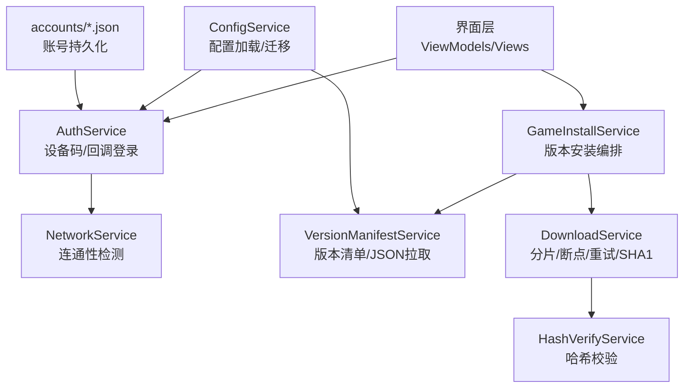
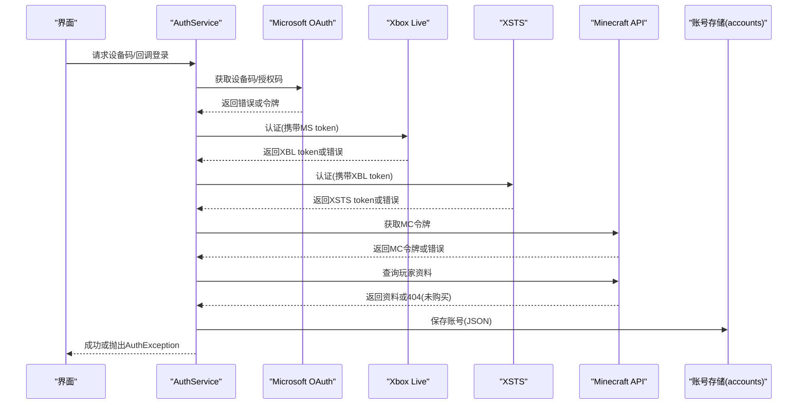
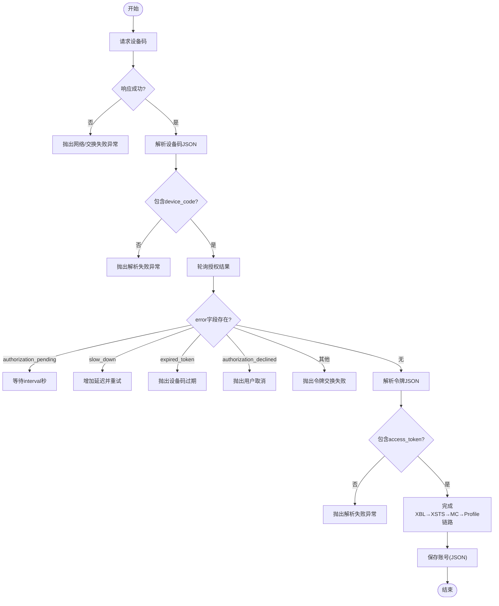
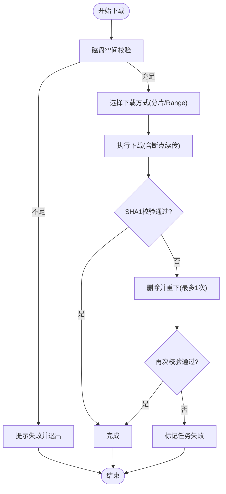
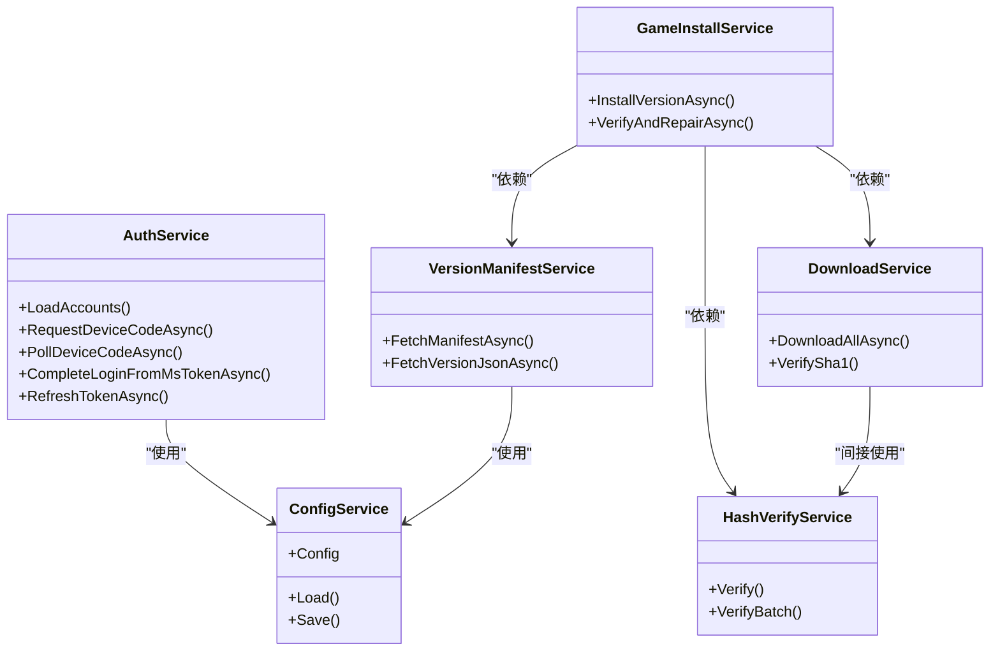

# 数据验证与错误处理

<cite>
**本文引用的文件**   
- [AuthService.cs](file://src/FufuLauncher/Services/AuthService.cs)
- [DeviceCodeDialog.cs](file://src/FufuLauncher/Interaction/DeviceCodeDialog.cs)
- [ConfigService.cs](file://src/FufuLauncher/Services/ConfigService.cs)
- [DownloadService.cs](file://src/FufuLauncher/Services/DownloadService.cs)
- [VersionManifestService.cs](file://src/FufuLauncher/Services/VersionManifestService.cs)
- [NetworkService.cs](file://src/FufuLauncher/Services/NetworkService.cs)
- [HashVerifyService.cs](file://src/FufuLauncher/Services/HashVerifyService.cs)
- [GameInstallService.cs](file://src/FufuLauncher/Services/GameInstallService.cs)
- [43381ea021e59839958af459800e4d11.json](file://Start/appmcGAME/accounts/43381ea021e59839958af459800e4d11.json)
</cite>

## 目录
1. [简介](#简介)
2. [项目结构](#项目结构)
3. [核心组件](#核心组件)
4. [架构总览](#架构总览)
5. [详细组件分析](#详细组件分析)
6. [依赖关系分析](#依赖关系分析)
7. [性能考量](#性能考量)
8. [故障排查指南](#故障排查指南)
9. [结论](#结论)
10. [附录](#附录)

## 简介
本文件聚焦“可爱的芙芙启动器”的数据验证与错误处理机制，重点覆盖：
- JSON 解析过程中的空值检查、字段完整性校验、格式校验策略
- 错误处理体系：AuthException 异常类与 AuthError 枚举的定义与使用
- 降级与容错：网络异常重试、无效响应处理、默认值设置
- 下载与安装流程中的校验与修复（SHA1、断点续传、分片）
- 调试技巧与常见问题定位方法

## 项目结构
围绕数据验证与错误处理的关键代码分布在以下服务与交互模块中：
- 认证与令牌链：AuthService、DeviceCodeDialog
- 配置与持久化：ConfigService、账号 JSON 文件
- 网络与清单：NetworkService、VersionManifestService
- 下载与校验：DownloadService、HashVerifyService
- 安装编排：GameInstallService

图表来源
- [AuthService.cs:76-121](file://src/FufuLauncher/Services/AuthService.cs#L76-L121)
- [DeviceCodeDialog.cs:20-30](file://src/FufuLauncher/Interaction/DeviceCodeDialog.cs#L20-L30)
- [ConfigService.cs:88-151](file://src/FufuLauncher/Services/ConfigService.cs#L88-L151)
- [NetworkService.cs:18-33](file://src/FufuLauncher/Services/NetworkService.cs#L18-L33)
- [VersionManifestService.cs:172-200](file://src/FufuLauncher/Services/VersionManifestService.cs#L172-L200)
- [DownloadService.cs:56-114](file://src/FufuLauncher/Services/DownloadService.cs#L56-L114)
- [HashVerifyService.cs:24-31](file://src/FufuLauncher/Services/HashVerifyService.cs#L24-L31)
- [GameInstallService.cs:50-80](file://src/FufuLauncher/Services/GameInstallService.cs#L50-L80)

章节来源
- [AuthService.cs:1-121](file://src/FufuLauncher/Services/AuthService.cs#L1-L121)
- [ConfigService.cs:1-151](file://src/FufuLauncher/Services/ConfigService.cs#L1-L151)
- [DownloadService.cs:1-114](file://src/FufuLauncher/Services/DownloadService.cs#L1-L114)
- [VersionManifestService.cs:1-200](file://src/FufuLauncher/Services/VersionManifestService.cs#L1-L200)
- [NetworkService.cs:1-33](file://src/FufuLauncher/Services/NetworkService.cs#L1-L33)
- [HashVerifyService.cs:1-31](file://src/FufuLauncher/Services/HashVerifyService.cs#L1-L31)
- [GameInstallService.cs:1-80](file://src/FufuLauncher/Services/GameInstallService.cs#L1-L80)

## 核心组件
- 认证服务（AuthService）
  - 定义 AuthError 枚举与 AuthException 异常类，统一错误类型与消息
  - 设备码登录与本地回调登录两种模式，完整令牌链（MS→XBL→XSTS→MC→Profile）
  - JSON 解析失败、空字段、HTTP 状态码异常均被捕获并转换为 AuthException
- 配置服务（ConfigService）
  - 提供 AppConfig 模型与 JSON 序列化选项，支持旧字段迁移与默认值
  - 读取失败时回退到默认配置，避免崩溃
- 下载服务（DownloadService）
  - 多线程分片、断点续传、指数退避重试、SHA1 校验与自动重下
  - 官方源/BMCLAPI 镜像切换与 URL 重写规则
- 版本清单服务（VersionManifestService）
  - 双源拉取（BMCLAPI/Mojang），失败回退与缓存策略
  - 版本 JSON 拉取失败返回 null，调用方负责提示
- 网络连通检测（NetworkService）
  - 快速探测 Mojang 与 BMCLAPI 可用性，返回延迟与状态
- 哈希校验（HashVerifyService）
  - 单文件/批量校验，缺失或大小不符即标记为需修复
- 安装编排（GameInstallService）
  - 组装下载任务、校验与修复、Java 运行时自动下载（失败不阻塞）

章节来源
- [AuthService.cs:31-48](file://src/FufuLauncher/Services/AuthService.cs#L31-L48)
- [ConfigService.cs:13-86](file://src/FufuLauncher/Services/ConfigService.cs#L13-L86)
- [DownloadService.cs:28-114](file://src/FufuLauncher/Services/DownloadService.cs#L28-L114)
- [VersionManifestService.cs:16-171](file://src/FufuLauncher/Services/VersionManifestService.cs#L16-L171)
- [NetworkService.cs:16-33](file://src/FufuLauncher/Services/NetworkService.cs#L16-L33)
- [HashVerifyService.cs:13-31](file://src/FufuLauncher/Services/HashVerifyService.cs#L13-L31)
- [GameInstallService.cs:50-80](file://src/FufuLauncher/Services/GameInstallService.cs#L50-L80)

## 架构总览
下图展示认证与安装流程中的数据验证与错误处理路径。

图表来源
- [AuthService.cs:158-265](file://src/FufuLauncher/Services/AuthService.cs#L158-L265)
- [AuthService.cs:342-398](file://src/FufuLauncher/Services/AuthService.cs#L342-L398)
- [AuthService.cs:608-643](file://src/FufuLauncher/Services/AuthService.cs#L608-L643)
- [AuthService.cs:123-137](file://src/FufuLauncher/Services/AuthService.cs#L123-L137)

## 详细组件分析

### 认证服务（AuthService）数据验证与错误处理
- 错误类型与异常
  - AuthError 枚举涵盖网络异常、未购买 Minecraft、用户取消、设备码过期、令牌交换失败、未知错误
  - AuthException 携带 Error 与消息，便于 UI 区分提示
- JSON 解析与空值检查
  - 设备码响应、令牌响应、XBL/XSTS/MC 响应均进行空字段检查（如 DeviceCode、AccessToken、Token）
  - 解析失败抛出对应类型的 AuthException，并附带原始异常信息
- HTTP 状态码与错误映射
  - 非成功状态码统一包装为 TokenExchangeFailed 或 Network
  - 404 表示未购买 Minecraft，抛出 NotOwnedMinecraft
- 轮询与超时
  - 设备码轮询支持 slow_down、authorization_pending、expired_token、authorization_declined 等错误分支
  - 超时后抛出 DeviceCodeExpired
- 离线账号
  - 生成确定性离线 UUID，仅保存昵称与 UUID，不受网络影响

图表来源
- [AuthService.cs:158-192](file://src/FufuLauncher/Services/AuthService.cs#L158-L192)
- [AuthService.cs:198-265](file://src/FufuLauncher/Services/AuthService.cs#L198-L265)
- [AuthService.cs:342-398](file://src/FufuLauncher/Services/AuthService.cs#L342-L398)
- [AuthService.cs:608-643](file://src/FufuLauncher/Services/AuthService.cs#L608-L643)

章节来源
- [AuthService.cs:31-48](file://src/FufuLauncher/Services/AuthService.cs#L31-L48)
- [AuthService.cs:158-265](file://src/FufuLauncher/Services/AuthService.cs#L158-L265)
- [AuthService.cs:342-398](file://src/FufuLauncher/Services/AuthService.cs#L342-L398)
- [AuthService.cs:608-643](file://src/FufuLauncher/Services/AuthService.cs#L608-L643)

### 设备码对话框（DeviceCodeDialog）错误传播
- 弹窗显示验证码、自动复制剪贴板、一键打开网页
- 后台轮询成功后关闭窗口；用户取消或窗口关闭触发取消
- 将轮询异常或取消统一以 AuthException(Cancelled) 抛出，供上层处理

章节来源
- [DeviceCodeDialog.cs:20-30](file://src/FufuLauncher/Interaction/DeviceCodeDialog.cs#L20-L30)
- [DeviceCodeDialog.cs:156-204](file://src/FufuLauncher/Interaction/DeviceCodeDialog.cs#L156-L204)

### 配置服务（ConfigService）JSON 解析与默认值
- 使用 JsonSerializerOptions 控制写入忽略空值、格式化输出
- 读取失败时直接回退到默认 AppConfig，保证应用稳定
- 旧字段迁移：OverlayPath/Type → BackgroundPath/Type，确保兼容性

章节来源
- [ConfigService.cs:88-151](file://src/FufuLauncher/Services/ConfigService.cs#L88-L151)
- [ConfigService.cs:13-86](file://src/FufuLauncher/Services/ConfigService.cs#L13-L86)

### 下载服务（DownloadService）校验与容错
- 分片与断点续传：大文件自动分片，小文件 Range 下载，.partial 临时文件记录进度
- 重试与退避：指数退避（1s, 2s, 4s...），最大重试次数可配置
- SHA1 校验：下载完成后校验，失败删除并重下一次；若仍失败则标记任务失败
- 源切换：根据配置与尝试次数自动切换到 BMCLAPI 镜像，提升国内稳定性
- 全局进度：节流上报，最终强制触发，避免进度条卡住

图表来源
- [DownloadService.cs:222-261](file://src/FufuLauncher/Services/DownloadService.cs#L222-L261)
- [DownloadService.cs:295-366](file://src/FufuLauncher/Services/DownloadService.cs#L295-L366)
- [DownloadService.cs:368-451](file://src/FufuLauncher/Services/DownloadService.cs#L368-L451)
- [DownloadService.cs:453-547](file://src/FufuLauncher/Services/DownloadService.cs#L453-L547)
- [DownloadService.cs:583-591](file://src/FufuLauncher/Services/DownloadService.cs#L583-L591)

章节来源
- [DownloadService.cs:28-114](file://src/FufuLauncher/Services/DownloadService.cs#L28-L114)
- [DownloadService.cs:222-366](file://src/FufuLauncher/Services/DownloadService.cs#L222-L366)
- [DownloadService.cs:368-547](file://src/FufuLauncher/Services/DownloadService.cs#L368-L547)
- [DownloadService.cs:583-591](file://src/FufuLauncher/Services/DownloadService.cs#L583-L591)

### 版本清单服务（VersionManifestService）JSON 解析与回退
- 优先按配置源拉取 version_manifest_v2.json，失败回退另一源
- 拉取版本 JSON 失败返回 null，调用方（安装服务）负责提示与引导
- 提供搜索、过滤、是否已安装判断等能力

章节来源
- [VersionManifestService.cs:205-255](file://src/FufuLauncher/Services/VersionManifestService.cs#L205-L255)
- [VersionManifestService.cs:257-272](file://src/FufuLauncher/Services/VersionManifestService.cs#L257-L272)

### 网络连通检测（NetworkService）
- 同时检测 Mojang 与 BMCLAPI 的连通性与延迟
- 用于安装前提示与诊断

章节来源
- [NetworkService.cs:34-76](file://src/FufuLauncher/Services/NetworkService.cs#L34-L76)

### 哈希校验（HashVerifyService）
- 单文件校验：存在性、大小、SHA1
- 批量校验：返回需要重新下载的文件列表

章节来源
- [HashVerifyService.cs:33-70](file://src/FufuLauncher/Services/HashVerifyService.cs#L33-L70)
- [HashVerifyService.cs:72-84](file://src/FufuLauncher/Services/HashVerifyService.cs#L72-L84)

### 安装编排（GameInstallService）
- 拉取版本 JSON、构建下载任务（client.jar、libraries、assets）
- 执行下载后校验与修复，损坏或缺失自动重下
- Java 运行时自动下载失败不阻塞安装，仅提示用户手动下载

章节来源
- [GameInstallService.cs:83-286](file://src/FufuLauncher/Services/GameInstallService.cs#L83-L286)
- [GameInstallService.cs:288-323](file://src/FufuLauncher/Services/GameInstallService.cs#L288-L323)
- [GameInstallService.cs:325-424](file://src/FufuLauncher/Services/GameInstallService.cs#L325-L424)

## 依赖关系分析
- AuthService 依赖 ConfigService（ClientId/端口等）、App（日志）、HttpClient（网络）
- VersionManifestService 依赖 NetworkService（连通性）、ConfigService（下载源）
- DownloadService 依赖 ConfigService（下载源）、NativeInteropService（SHA1）
- GameInstallService 组合上述服务，协调安装流程

图表来源
- [AuthService.cs:106-121](file://src/FufuLauncher/Services/AuthService.cs#L106-L121)
- [VersionManifestService.cs:172-189](file://src/FufuLauncher/Services/VersionManifestService.cs#L172-L189)
- [DownloadService.cs:56-114](file://src/FufuLauncher/Services/DownloadService.cs#L56-L114)
- [HashVerifyService.cs:24-31](file://src/FufuLauncher/Services/HashVerifyService.cs#L24-L31)
- [GameInstallService.cs:50-80](file://src/FufuLauncher/Services/GameInstallService.cs#L50-L80)

章节来源
- [AuthService.cs:106-121](file://src/FufuLauncher/Services/AuthService.cs#L106-L121)
- [VersionManifestService.cs:172-189](file://src/FufuLauncher/Services/VersionManifestService.cs#L172-L189)
- [DownloadService.cs:56-114](file://src/FufuLauncher/Services/DownloadService.cs#L56-L114)
- [HashVerifyService.cs:24-31](file://src/FufuLauncher/Services/HashVerifyService.cs#L24-L31)
- [GameInstallService.cs:50-80](file://src/FufuLauncher/Services/GameInstallService.cs#L50-L80)

## 性能考量
- 网络超时与连接限制
  - HttpClient 统一设置超时与 User-Agent，避免被限流
  - 下载服务按类别独立信号量控制并发，避免互相阻塞
- 进度上报节流
  - 全局进度每 150ms 上报一次，下载完成强制触发，平衡性能与体验
- 分片与断点续传
  - 大文件分片并行下载，减少长连接风险，提高吞吐
- 缓存与回退
  - 版本清单缓存，避免频繁网络请求；失败自动回退另一源

[本节为通用指导，无需具体文件引用]

## 故障排查指南
- 认证失败
  - 查看 App 日志（WriteAppLog）中的“登录”相关条目，确认各阶段（MS/XBL/XSTS/MC）状态码与响应截断
  - 常见错误：设备码过期、用户取消、未购买 Minecraft、网络异常
- 下载失败
  - 检查磁盘空间、网络连通性（NetworkService）
  - 查看下载任务的 Error 与 RetryCount，确认是否触发 SHA1 校验失败重下
- 版本 JSON 拉取失败
  - 切换下载源（BMCLAPI/Mojang）后重试
  - 关注 LastError 字段，了解首选源与回退源失败原因
- 账号 JSON 损坏
  - LoadAccounts 会忽略损坏文件，建议清理 accounts 目录下异常 JSON

章节来源
- [AuthService.cs:123-137](file://src/FufuLauncher/Services/AuthService.cs#L123-L137)
- [AuthService.cs:158-192](file://src/FufuLauncher/Services/AuthService.cs#L158-L192)
- [AuthService.cs:198-265](file://src/FufuLauncher/Services/AuthService.cs#L198-L265)
- [AuthService.cs:608-643](file://src/FufuLauncher/Services/AuthService.cs#L608-L643)
- [DownloadService.cs:295-366](file://src/FufuLauncher/Services/DownloadService.cs#L295-L366)
- [VersionManifestService.cs:205-255](file://src/FufuLauncher/Services/VersionManifestService.cs#L205-L255)
- [NetworkService.cs:34-76](file://src/FufuLauncher/Services/NetworkService.cs#L34-L76)

## 结论
本项目在数据验证与错误处理方面具备完善的分层设计：
- 认证链路通过 AuthException 与 AuthError 明确错误类型，便于 UI 友好提示
- JSON 解析与空值检查贯穿各服务，确保数据结构完整性
- 下载与安装流程内置 SHA1 校验、断点续传、分片与重试，具备强容错能力
- 配置与清单服务提供默认值与回退策略，保障用户体验与稳定性

[本节为总结性内容，无需具体文件引用]

## 附录
- 账号 JSON 示例（离线账号）
  - 字段包括 Type、Username、Uuid、AccessToken、MicrosoftRefreshToken、TokenExpiresAt、AddedAt
  - 离线账号的 AccessToken 使用 UUID 占位，刷新令牌为空

章节来源
- [43381ea021e59839958af459800e4d11.json:1-9](file://Start/appmcGAME/accounts/43381ea021e59839958af459800e4d11.json#L1-L9)