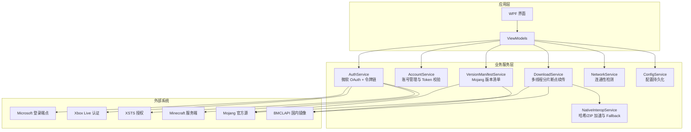
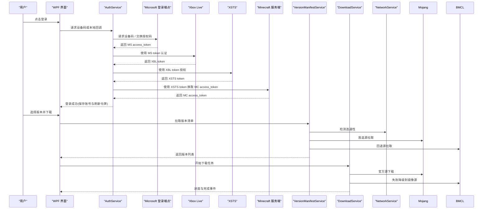
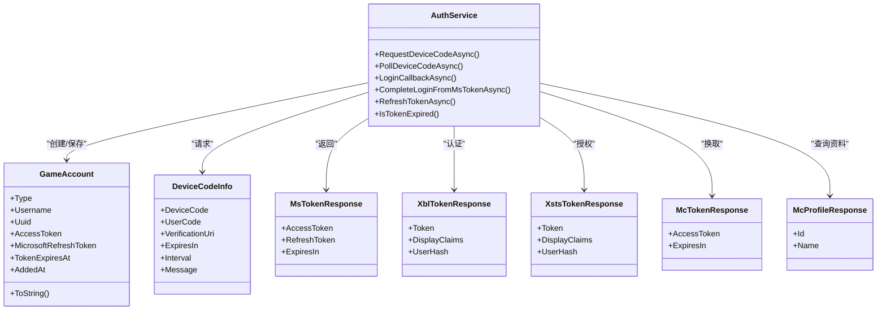
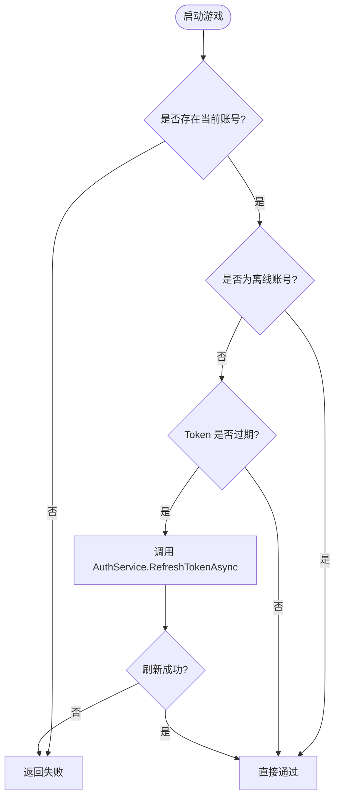
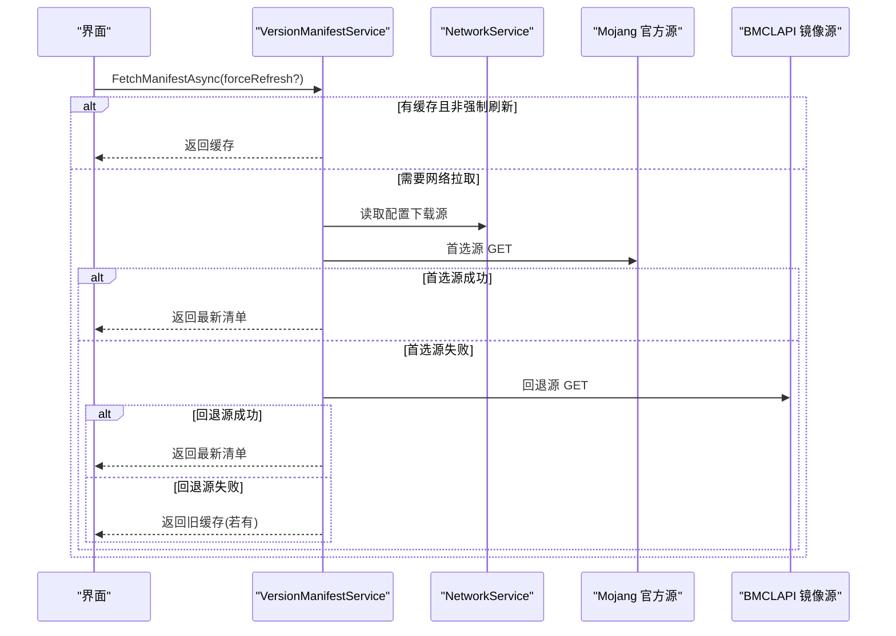
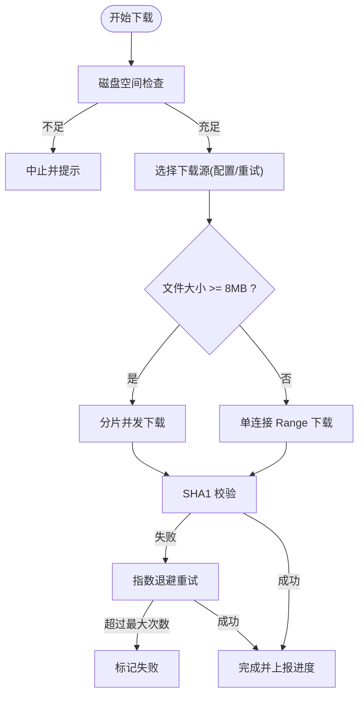
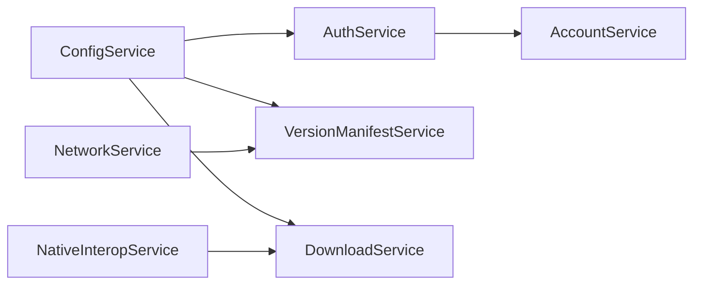

# 第三方 API 集成

<cite>
**本文引用的文件**   
- [AuthService.cs](file://src/FufuLauncher/Services/AuthService.cs)
- [NetworkService.cs](file://src/FufuLauncher/Services/NetworkService.cs)
- [AccountService.cs](file://src/FufuLauncher/Services/AccountService.cs)
- [DeviceCodeDialog.cs](file://src/FufuLauncher/Interaction/DeviceCodeDialog.cs)
- [ConfigService.cs](file://src/FufuLauncher/Services/ConfigService.cs)
- [DownloadService.cs](file://src/FufuLauncher/Services/DownloadService.cs)
- [VersionManifestService.cs](file://src/FufuLauncher/Services/VersionManifestService.cs)
- [NativeInteropService.cs](file://src/FufuLauncher/Services/NativeInteropService.cs)
- [README.md](file://README.md)
</cite>

## 目录
1. [简介](#简介)
2. [项目结构](#项目结构)
3. [核心组件](#核心组件)
4. [架构总览](#架构总览)
5. [详细组件分析](#详细组件分析)
6. [依赖关系分析](#依赖关系分析)
7. [性能与优化](#性能与优化)
8. [故障排查指南](#故障排查指南)
9. [结论](#结论)
10. [附录：第三方服务集成示例](#附录第三方服务集成示例)

## 简介
本指南面向“可爱的芙芙启动器”的第三方 API 集成，重点覆盖以下方面：
- 认证协议实现：OAuth 2.0（微软设备码与本地回调）、JWT 令牌链管理（MS → XBL → XSTS → Minecraft）、会话与刷新策略。
- HTTP 客户端配置与优化：连接池、超时控制、重试机制、镜像源降级。
- 数据格式处理：JSON 序列化/反序列化、字段校验与容错。
- 错误处理策略：网络异常、API 限制、降级与回退方案。
- 完整集成示例：微软认证、版本清单拉取、模组仓库下载等。

## 项目结构
本项目采用分层服务化设计，关键服务位于 Services 目录，交互层位于 Interaction，视图模型位于 ViewModels，原生能力通过 NativeInteropService 封装。

**图表来源** 
- [AuthService.cs:76-121](file://src/FufuLauncher/Services/AuthService.cs#L76-L121)
- [AccountService.cs:12-26](file://src/FufuLauncher/Services/AccountService.cs#L12-L26)
- [VersionManifestService.cs:172-189](file://src/FufuLauncher/Services/VersionManifestService.cs#L172-L189)
- [DownloadService.cs:56-114](file://src/FufuLauncher/Services/DownloadService.cs#L56-L114)
- [NetworkService.cs:18-29](file://src/FufuLauncher/Services/NetworkService.cs#L18-L29)
- [ConfigService.cs:81-92](file://src/FufuLauncher/Services/ConfigService.cs#L81-L92)
- [NativeInteropService.cs:20-25](file://src/FufuLauncher/Services/NativeInteropService.cs#L20-L25)

**章节来源**
- [README.md:1-87](file://README.md#L1-L87)

## 核心组件
- AuthService：实现微软 OAuth 2.0（设备码与本地回调），完成 XBL/XSTS/MC 令牌链，持久化 refresh_token 并支持自动刷新。
- AccountService：多账号管理、当前账号切换、启动前 Token 有效性校验与自动刷新。
- VersionManifestService：拉取 Mojang 版本清单，支持缓存、双源回退、URL 重写。
- DownloadService：多线程分片断点续传下载，指数退避重试，SHA1 校验，镜像源降级。
- NetworkService：连通性检测（Mojang/BMCLAPI），带 User-Agent 防限流。
- ConfigService：用户配置持久化，包含下载源、Java 路径、JVM 参数、登录模式等。
- NativeInteropService：C++ 原生 DLL 调用封装，失败时自动回退到托管实现。

**章节来源**
- [AuthService.cs:76-121](file://src/FufuLauncher/Services/AuthService.cs#L76-L121)
- [AccountService.cs:12-26](file://src/FufuLauncher/Services/AccountService.cs#L12-L26)
- [VersionManifestService.cs:172-189](file://src/FufuLauncher/Services/VersionManifestService.cs#L172-L189)
- [DownloadService.cs:56-114](file://src/FufuLauncher/Services/DownloadService.cs#L56-L114)
- [NetworkService.cs:18-29](file://src/FufuLauncher/Services/NetworkService.cs#L18-L29)
- [ConfigService.cs:81-92](file://src/FufuLauncher/Services/ConfigService.cs#L81-L92)
- [NativeInteropService.cs:20-25](file://src/FufuLauncher/Services/NativeInteropService.cs#L20-L25)

## 架构总览
下图展示从用户操作到第三方服务的端到端流程，涵盖认证、版本清单获取与资源下载。

**图表来源** 
- [AuthService.cs:159-265](file://src/FufuLauncher/Services/AuthService.cs#L159-L265)
- [AuthService.cs:343-398](file://src/FufuLauncher/Services/AuthService.cs#L343-L398)
- [VersionManifestService.cs:205-255](file://src/FufuLauncher/Services/VersionManifestService.cs#L205-L255)
- [DownloadService.cs:222-261](file://src/FufuLauncher/Services/DownloadService.cs#L222-L261)
- [NetworkService.cs:34-76](file://src/FufuLauncher/Services/NetworkService.cs#L34-L76)

## 详细组件分析

### 认证协议与令牌管理（AuthService）
- 支持两种登录模式：
  - 设备码登录（默认）：请求设备码，弹窗展示 user_code，后台轮询授权结果。
  - 本地回调登录：监听 127.0.0.1:54321，浏览器重定向后交换授权码。
- 完整令牌链：MS access_token → XBL → XSTS → Minecraft access_token → 玩家资料。
- 持久化 refresh_token，过期自动刷新（完整重走令牌链）。
- 错误区分：网络异常、未购买 Minecraft、用户取消、设备码过期、令牌交换失败。

**图表来源** 
- [AuthService.cs:50-74](file://src/FufuLauncher/Services/AuthService.cs#L50-L74)
- [AuthService.cs:646-682](file://src/FufuLauncher/Services/AuthService.cs#L646-L682)
- [AuthService.cs:76-121](file://src/FufuLauncher/Services/AuthService.cs#L76-L121)

**章节来源**
- [AuthService.cs:159-265](file://src/FufuLauncher/Services/AuthService.cs#L159-L265)
- [AuthService.cs:343-398](file://src/FufuLauncher/Services/AuthService.cs#L343-L398)
- [AuthService.cs:421-468](file://src/FufuLauncher/Services/AuthService.cs#L421-L468)
- [AuthService.cs:470-474](file://src/FufuLauncher/Services/AuthService.cs#L470-L474)

### 账号管理与 Token 刷新（AccountService）
- 提供账号列表、切换、删除。
- 启动游戏前校验 Token 有效性，若过期则自动刷新。

**图表来源** 
- [AccountService.cs:42-52](file://src/FufuLauncher/Services/AccountService.cs#L42-L52)

**章节来源**
- [AccountService.cs:12-26](file://src/FufuLauncher/Services/AccountService.cs#L12-L26)
- [AccountService.cs:28-39](file://src/FufuLauncher/Services/AccountService.cs#L28-L39)
- [AccountService.cs:42-52](file://src/FufuLauncher/Services/AccountService.cs#L42-L52)

### 版本清单与镜像源（VersionManifestService）
- 拉取 version_manifest_v2.json，分类 Release/Snapshot/Old Beta/Old Alpha。
- 支持缓存、强制刷新、双源回退（BMCLAPI ↔ Mojang）。
- URL 重写规则与 DownloadService 保持一致。

**图表来源** 
- [VersionManifestService.cs:205-255](file://src/FufuLauncher/Services/VersionManifestService.cs#L205-L255)

**章节来源**
- [VersionManifestService.cs:172-189](file://src/FufuLauncher/Services/VersionManifestService.cs#L172-L189)
- [VersionManifestService.cs:205-255](file://src/FufuLauncher/Services/VersionManifestService.cs#L205-L255)
- [VersionManifestService.cs:275-292](file://src/FufuLauncher/Services/VersionManifestService.cs#L275-L292)

### 下载引擎与重试机制（DownloadService）
- 多线程并发下载，按任务类别独立队列互不阻塞。
- 大文件自动分片（>=8MB），单连接 Range 断点续传。
- 指数退避重试（默认 3 次），SHA1 校验失败自动重下。
- 官方源失败自动降级到 BMCLAPI 镜像源。
- 全局总进度与单文件进度分离，节流更新避免 UI 卡顿。

**图表来源** 
- [DownloadService.cs:222-261](file://src/FufuLauncher/Services/DownloadService.cs#L222-L261)
- [DownloadService.cs:295-366](file://src/FufuLauncher/Services/DownloadService.cs#L295-L366)
- [DownloadService.cs:369-451](file://src/FufuLauncher/Services/DownloadService.cs#L369-L451)
- [DownloadService.cs:454-547](file://src/FufuLauncher/Services/DownloadService.cs#L454-L547)

**章节来源**
- [DownloadService.cs:56-114](file://src/FufuLauncher/Services/DownloadService.cs#L56-L114)
- [DownloadService.cs:172-210](file://src/FufuLauncher/Services/DownloadService.cs#L172-L210)
- [DownloadService.cs:222-261](file://src/FufuLauncher/Services/DownloadService.cs#L222-L261)
- [DownloadService.cs:295-366](file://src/FufuLauncher/Services/DownloadService.cs#L295-L366)
- [DownloadService.cs:369-451](file://src/FufuLauncher/Services/DownloadService.cs#L369-L451)
- [DownloadService.cs:454-547](file://src/FufuLauncher/Services/DownloadService.cs#L454-L547)

### 连通性检测（NetworkService）
- 检测 Mojang 官方源与 BMCLAPI 国内镜像源的连通性与延迟。
- 设置 User-Agent 避免被限流。

**章节来源**
- [NetworkService.cs:18-29](file://src/FufuLauncher/Services/NetworkService.cs#L18-L29)
- [NetworkService.cs:34-76](file://src/FufuLauncher/Services/NetworkService.cs#L34-L76)

### 配置服务（ConfigService）
- 持久化主题、下载源、Java 路径、JVM 参数、分辨率、背景设置等。
- 支持微软账号登录模式（DeviceCode/LocalCallback）与回调端口配置。
- Java 下载镜像选择与开机扫描开关。
- JVM 多核优化预设、内存智能分配、视频背景增强等。

**章节来源**
- [ConfigService.cs:13-79](file://src/FufuLauncher/Services/ConfigService.cs#L13-L79)
- [ConfigService.cs:81-92](file://src/FufuLauncher/Services/ConfigService.cs#L81-L92)
- [ConfigService.cs:94-133](file://src/FufuLauncher/Services/ConfigService.cs#L94-L133)
- [ConfigService.cs:135-146](file://src/FufuLauncher/Services/ConfigService.cs#L135-L146)

### 原生能力封装（NativeInteropService）
- C++ 原生 DLL 调用封装，失败时自动回退到托管实现。
- 提供 SHA1/SHA256 计算、ZIP 解压与打包功能。

**章节来源**
- [NativeInteropService.cs:20-25](file://src/FufuLauncher/Services/NativeInteropService.cs#L20-L25)
- [NativeInteropService.cs:38-73](file://src/FufuLauncher/Services/NativeInteropService.cs#L38-L73)
- [NativeInteropService.cs:85-119](file://src/FufuLauncher/Services/NativeInteropService.cs#L85-L119)
- [NativeInteropService.cs:143-157](file://src/FufuLauncher/Services/NativeInteropService.cs#L143-L157)

## 依赖关系分析
- AuthService 依赖 ConfigService（读取 ClientId、AuthMode、端口），并通过 HttpClient 访问 Microsoft/XBL/XSTS/MC 端点。
- AccountService 依赖 AuthService 进行 Token 刷新与账号管理。
- VersionManifestService 依赖 NetworkService 与 ConfigService，使用 HttpClient 拉取清单。
- DownloadService 依赖 ConfigService（下载源）、NativeInteropService（SHA1 校验），并使用 HttpClientHandler 配置连接池与超时。
- NetworkService 使用 HttpClient 检测连通性。
- ConfigService 负责所有配置的读写。

**图表来源** 
- [AuthService.cs:106-121](file://src/FufuLauncher/Services/AuthService.cs#L106-L121)
- [VersionManifestService.cs:172-189](file://src/FufuLauncher/Services/VersionManifestService.cs#L172-L189)
- [DownloadService.cs:56-114](file://src/FufuLauncher/Services/DownloadService.cs#L56-L114)
- [NetworkService.cs:18-29](file://src/FufuLauncher/Services/NetworkService.cs#L18-L29)
- [AccountService.cs:12-26](file://src/FufuLauncher/Services/AccountService.cs#L12-L26)

**章节来源**
- [AuthService.cs:106-121](file://src/FufuLauncher/Services/AuthService.cs#L106-L121)
- [VersionManifestService.cs:172-189](file://src/FufuLauncher/Services/VersionManifestService.cs#L172-L189)
- [DownloadService.cs:56-114](file://src/FufuLauncher/Services/DownloadService.cs#L56-L114)
- [NetworkService.cs:18-29](file://src/FufuLauncher/Services/NetworkService.cs#L18-L29)
- [AccountService.cs:12-26](file://src/FufuLauncher/Services/AccountService.cs#L12-L26)

## 性能与优化
- HTTP 客户端配置：
  - 连接池：DownloadService 使用 HttpClientHandler.MaxConnectionsPerServer=64，提升并发吞吐。
  - 超时控制：AuthService 默认 30 秒；NetworkService 8 秒；DownloadService 5 分钟；分片下载首字节 30 秒保护。
  - User-Agent：统一注入，避免被限流或拒绝。
- 重试机制：
  - 指数退避（1s, 2s, 4s...），最大重试次数可配置。
  - 官方源失败自动降级到 BMCLAPI 镜像源。
- 数据校验：
  - 下载完成后 SHA1 校验，失败自动重下一次。
  - JSON 解析失败记录日志并返回空值，避免崩溃。
- 进度更新：
  - 全局总进度节流 150ms，避免频繁 UI 更新。
  - 单文件进度每 200ms 报告一次。

**章节来源**
- [DownloadService.cs:103-114](file://src/FufuLauncher/Services/DownloadService.cs#L103-L114)
- [DownloadService.cs:141-169](file://src/FufuLauncher/Services/DownloadService.cs#L141-L169)
- [DownloadService.cs:305-358](file://src/FufuLauncher/Services/DownloadService.cs#L305-L358)
- [VersionManifestService.cs:177-189](file://src/FufuLauncher/Services/VersionManifestService.cs#L177-L189)
- [NetworkService.cs:20-29](file://src/FufuLauncher/Services/NetworkService.cs#L20-L29)

## 故障排查指南
- 登录失败：
  - 检查设备码是否过期（等待时间过长）。
  - 确认微软账号已购买 Minecraft（404 表示未购买）。
  - 查看应用日志中的详细响应（TruncateBody 截断输出）。
- 下载失败：
  - 检查磁盘空间是否充足（预留 1GB 缓冲）。
  - 确认下载源可达（官方源可能超时，自动降级到 BMCLAPI）。
  - 查看 SHA1 校验失败日志，触发自动重下。
- 版本清单拉取失败：
  - 优先源失败后自动回退到另一源。
  - 若无网络，返回旧缓存并显示 LastError。
- 原生 DLL 不可用：
  - 自动回退到托管实现，功能等价但性能略低。

**章节来源**
- [AuthService.cs:171-191](file://src/FufuLauncher/Services/AuthService.cs#L171-L191)
- [AuthService.cs:608-643](file://src/FufuLauncher/Services/AuthService.cs#L608-L643)
- [DownloadService.cs:264-293](file://src/FufuLauncher/Services/DownloadService.cs#L264-L293)
- [VersionManifestService.cs:229-255](file://src/FufuLauncher/Services/VersionManifestService.cs#L229-L255)
- [NativeInteropService.cs:48-53](file://src/FufuLauncher/Services/NativeInteropService.cs#L48-L53)

## 结论
本指南系统梳理了“可爱的芙芙启动器”在第三方 API 集成方面的设计与实现，涵盖认证协议、HTTP 客户端优化、数据格式处理、错误处理策略以及完整的集成示例。通过模块化服务设计与健壮的错误处理机制，确保在不同网络环境与第三方服务状态下的稳定运行。

## 附录：第三方服务集成示例

### 微软认证集成（设备码与本地回调）
- 设备码登录：
  - 调用 RequestDeviceCodeAsync 获取设备码与验证链接。
  - 通过 DeviceCodeDialog.ShowAndPollAsync 展示验证码并后台轮询。
  - 成功后调用 CompleteLoginFromMsTokenAsync 完成令牌链。
- 本地回调登录：
  - 调用 LoginCallbackAsync 监听本地端口并重定向交换授权码。
  - 成功后同样完成令牌链。

**章节来源**
- [AuthService.cs:159-192](file://src/FufuLauncher/Services/AuthService.cs#L159-L192)
- [DeviceCodeDialog.cs:26-202](file://src/FufuLauncher/Interaction/DeviceCodeDialog.cs#L26-L202)
- [AuthService.cs:270-338](file://src/FufuLauncher/Services/AuthService.cs#L270-L338)
- [AuthService.cs:343-398](file://src/FufuLauncher/Services/AuthService.cs#L343-L398)

### 版本管理集成（Mojang 版本清单）
- 拉取版本清单：
  - 调用 FetchManifestAsync(forceRefresh=false) 使用缓存。
  - 首次或强制刷新时拉取首选源，失败回退到另一源。
- 搜索与过滤：
  - 使用 Search(type, keyword, sortByReleaseDesc) 进行关键词搜索。
  - FilterByType(type) 按类型过滤。

**章节来源**
- [VersionManifestService.cs:205-255](file://src/FufuLauncher/Services/VersionManifestService.cs#L205-L255)
- [VersionManifestService.cs:294-326](file://src/FufuLauncher/Services/VersionManifestService.cs#L294-L326)

### 模组仓库集成（下载服务）
- 构建下载任务：
  - 设置 DownloadTaskItem.Url、LocalPath、Sha1、Size、Category。
  - 调用 DownloadAllAsync(tasks) 批量下载。
- 进度与事件：
  - 订阅 ProgressChanged 与 OverallProgressChanged 事件。
  - 处理 TaskCompleted 与 TaskFailed 事件。

**章节来源**
- [DownloadService.cs:28-42](file://src/FufuLauncher/Services/DownloadService.cs#L28-L42)
- [DownloadService.cs:222-261](file://src/FufuLauncher/Services/DownloadService.cs#L222-L261)
- [DownloadService.cs:85-89](file://src/FufuLauncher/Services/DownloadService.cs#L85-L89)