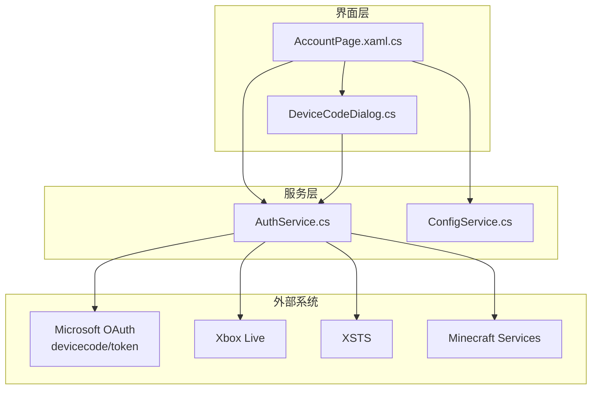
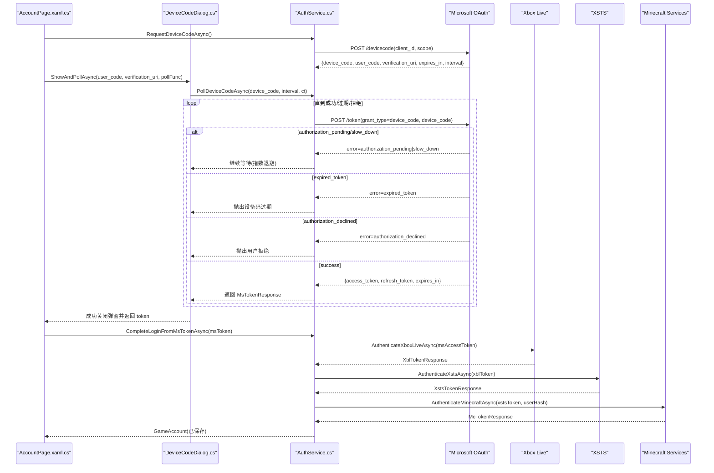
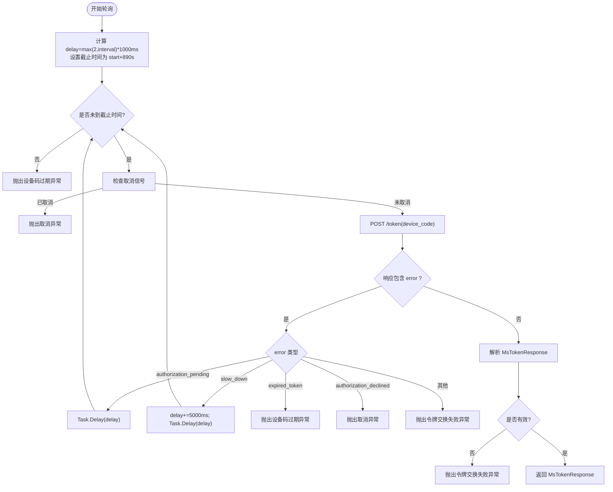
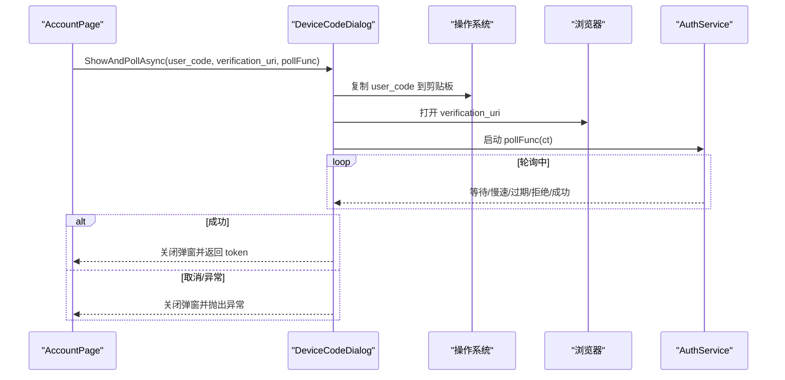
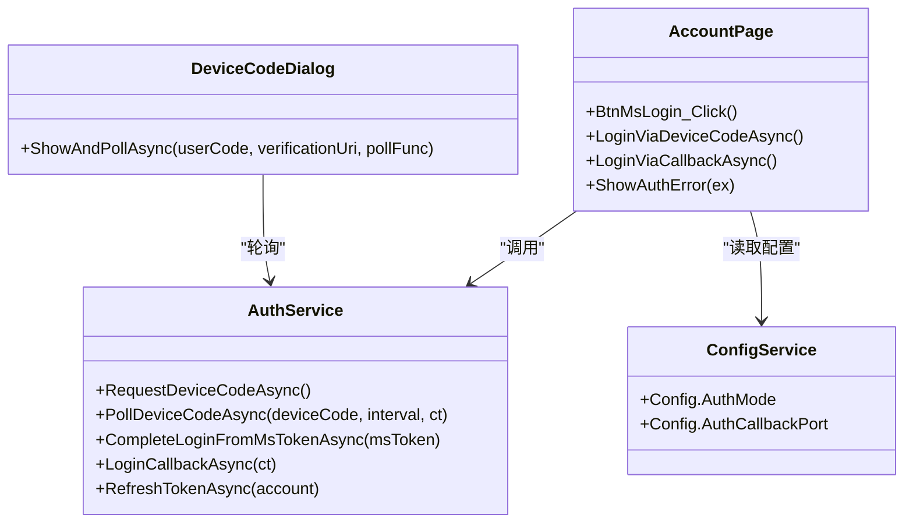

# OAuth 2.0 设备码登录

<cite>
**本文引用的文件**   
- [AuthService.cs](file://src/FufuLauncher/Services/AuthService.cs)
- [DeviceCodeDialog.cs](file://src/FufuLauncher/Interaction/DeviceCodeDialog.cs)
- [AccountPage.xaml.cs](file://src/FufuLauncher/Views/AccountPage.xaml.cs)
- [ConfigService.cs](file://src/FufuLauncher/Services/ConfigService.cs)
- [config.json](file://Start/appmcGAME/config.json)
</cite>

## 目录
1. [简介](#简介)
2. [项目结构](#项目结构)
3. [核心组件](#核心组件)
4. [架构总览](#架构总览)
5. [详细组件分析](#详细组件分析)
6. [依赖关系分析](#依赖关系分析)
7. [性能与稳定性](#性能与稳定性)
8. [故障排查指南](#故障排查指南)
9. [结论](#结论)
10. [附录：配置与示例](#附录配置与示例)

## 简介
本文件面向“可爱的芙芙”启动器中的 Microsoft 账号 OAuth 2.0 设备码登录模式，系统性说明从请求设备码、用户交互、轮询授权到完成令牌链的完整流程。重点覆盖：
- 向 Microsoft 设备码端点发送请求的参数与响应处理
- 设备码轮询机制（间隔控制、超时、错误状态码）
- 用户交互流程（显示验证码、自动复制到剪贴板、一键打开授权网页）
- 取消操作与异常恢复机制
- 具体代码位置与配置参数说明

## 项目结构
与设备码登录相关的核心代码位于 WPF 启动器项目中，关键文件如下：
- 认证服务：AuthService.cs（设备码请求、轮询、令牌链）
- 交互弹窗：DeviceCodeDialog.cs（展示验证码、复制剪贴板、打开浏览器、轮询 UI）
- 页面入口：AccountPage.xaml.cs（触发设备码登录流程）
- 配置服务：ConfigService.cs（AuthMode、回调端口等）
- 配置文件：config.json（运行时配置）

图表来源
- [AccountPage.xaml.cs:57-64](file://src/FufuLauncher/Views/AccountPage.xaml.cs#L57-L64)
- [DeviceCodeDialog.cs:26-30](file://src/FufuLauncher/Interaction/DeviceCodeDialog.cs#L26-L30)
- [AuthService.cs:159-265](file://src/FufuLauncher/Services/AuthService.cs#L159-L265)
- [ConfigService.cs:41-45](file://src/FufuLauncher/Services/ConfigService.cs#L41-L45)

章节来源
- [AccountPage.xaml.cs:57-64](file://src/FufuLauncher/Views/AccountPage.xaml.cs#L57-L64)
- [AuthService.cs:159-265](file://src/FufuLauncher/Services/AuthService.cs#L159-L265)
- [DeviceCodeDialog.cs:26-30](file://src/FufuLauncher/Interaction/DeviceCodeDialog.cs#L26-L30)
- [ConfigService.cs:41-45](file://src/FufuLauncher/Services/ConfigService.cs#L41-L45)

## 核心组件
- AuthService：封装 Microsoft OAuth 设备码请求、轮询、以及后续 XBL→XSTS→MC 令牌链；提供本地回调登录备选方案；负责账号持久化与刷新。
- DeviceCodeDialog：WPF 弹窗，展示 user_code 与 verification_uri，自动复制验证码到剪贴板并打开浏览器，后台轮询授权结果，支持取消。
- AccountPage：UI 入口，根据配置选择设备码或本地回调登录，统一错误提示。
- ConfigService：管理应用配置，包括 AuthMode、回调端口等。

章节来源
- [AuthService.cs:159-265](file://src/FufuLauncher/Services/AuthService.cs#L159-L265)
- [DeviceCodeDialog.cs:26-30](file://src/FufuLauncher/Interaction/DeviceCodeDialog.cs#L26-L30)
- [AccountPage.xaml.cs:57-64](file://src/FufuLauncher/Views/AccountPage.xaml.cs#L57-L64)
- [ConfigService.cs:41-45](file://src/FufuLauncher/Services/ConfigService.cs#L41-L45)

## 架构总览
设备码登录的整体时序如下：

图表来源
- [AccountPage.xaml.cs:57-64](file://src/FufuLauncher/Views/AccountPage.xaml.cs#L57-L64)
- [AuthService.cs:159-265](file://src/FufuLauncher/Services/AuthService.cs#L159-L265)
- [AuthService.cs:342-398](file://src/FufuLauncher/Services/AuthService.cs#L342-L398)

## 详细组件分析

### 设备码请求与响应处理（AuthService）
- 端点与参数
  - 设备码端点：POST https://login.microsoftonline.com/consumers/oauth2/v2.0/devicecode
  - 请求体字段：client_id、scope
  - 响应字段：device_code、user_code、verification_uri、expires_in、interval、message
- 错误处理
  - 非 2xx 响应：包装为 AuthException(TokenExchangeFailed)
  - 解析失败：包装为 AuthException(TokenExchangeFailed)
  - 网络异常：包装为 AuthException(Network)
  - 其他异常：包装为 AuthException(Unknown)

章节来源
- [AuthService.cs:159-192](file://src/FufuLauncher/Services/AuthService.cs#L159-L192)

### 设备码轮询机制（AuthService.PollDeviceCodeAsync）
- 轮询端点：POST https://login.microsoftonline.com/consumers/oauth2/v2.0/token
- 请求体字段：client_id、grant_type=urn:ietf:params:oauth:grant-type:device_code、device_code
- 间隔控制
  - 初始 delay = max(2, interval) * 1000 ms
  - slow_down：delay += 5000 ms 后重试
- 超时处理
  - 以 start.AddSeconds(890) 作为截止时间，循环内检查 DateTime.Now < deadline
  - 若超时未成功：抛出 AuthException(DeviceCodeExpired)
- 错误状态码处理
  - authorization_pending：继续等待
  - slow_down：增加延迟后继续等待
  - expired_token：抛出 AuthException(DeviceCodeExpired)
  - authorization_declined：抛出 AuthException(Cancelled)
  - 其他错误：包装为 AuthException(TokenExchangeFailed)
- 网络异常
  - HttpRequestException：记录日志并重试
  - 其他异常：包装为 AuthException(Unknown)

图表来源
- [AuthService.cs:198-265](file://src/FufuLauncher/Services/AuthService.cs#L198-L265)

章节来源
- [AuthService.cs:198-265](file://src/FufuLauncher/Services/AuthService.cs#L198-L265)

### 用户交互流程（DeviceCodeDialog）
- 弹窗内容
  - 显示 verification_uri 与 user_code（大字号醒目）
  - 提示“验证码已自动复制到剪贴板”
  - 按钮：“复制并打开网页”、“取消”
- 自动行为
  - 窗口渲染完成后尝试将 user_code 复制到剪贴板
  - 自动触发“复制并打开网页”按钮事件，使用默认浏览器打开 verification_uri
- 取消与关闭
  - 点击“取消”或关闭窗口：触发 CancellationTokenSource.Cancel()
  - 轮询任务完成后在 UI 线程关闭弹窗并返回结果或异常
- 结果处理
  - 成功：返回 MsTokenResponse
  - 用户取消：抛出 AuthException(Cancelled)
  - 其他异常：抛出原始异常

图表来源
- [DeviceCodeDialog.cs:126-154](file://src/FufuLauncher/Interaction/DeviceCodeDialog.cs#L126-L154)
- [DeviceCodeDialog.cs:156-170](file://src/FufuLauncher/Interaction/DeviceCodeDialog.cs#L156-L170)
- [DeviceCodeDialog.cs:172-196](file://src/FufuLauncher/Interaction/DeviceCodeDialog.cs#L172-L196)

章节来源
- [DeviceCodeDialog.cs:26-30](file://src/FufuLauncher/Interaction/DeviceCodeDialog.cs#L26-L30)
- [DeviceCodeDialog.cs:126-154](file://src/FufuLauncher/Interaction/DeviceCodeDialog.cs#L126-L154)
- [DeviceCodeDialog.cs:156-170](file://src/FufuLauncher/Interaction/DeviceCodeDialog.cs#L156-L170)
- [DeviceCodeDialog.cs:172-196](file://src/FufuLauncher/Interaction/DeviceCodeDialog.cs#L172-L196)

### 页面入口与错误提示（AccountPage）
- 登录入口
  - 设备码登录：RequestDeviceCodeAsync → DeviceCodeDialog.ShowAndPollAsync → CompleteLoginFromMsTokenAsync
  - 本地回调登录：LoginCallbackAsync → CompleteLoginFromMsTokenAsync
- 错误提示
  - 根据 AuthError 枚举区分提示标题与图标（未购买 Minecraft、网络异常、取消、设备码过期、未知）

章节来源
- [AccountPage.xaml.cs:57-64](file://src/FufuLauncher/Views/AccountPage.xaml.cs#L57-L64)
- [AccountPage.xaml.cs:75-103](file://src/FufuLauncher/Views/AccountPage.xaml.cs#L75-L103)

### 令牌链与账号持久化（AuthService）
- 完整链路：MS access_token → XBL → XSTS → Minecraft access_token → 玩家资料
- 账号持久化：SaveAccount 写入 accounts 目录 JSON 文件
- 令牌刷新：RefreshTokenAsync 使用 refresh_token 重走完整链路

章节来源
- [AuthService.cs:342-398](file://src/FufuLauncher/Services/AuthService.cs#L342-L398)
- [AuthService.cs:420-468](file://src/FufuLauncher/Services/AuthService.cs#L420-L468)
- [AuthService.cs:139-145](file://src/FufuLauncher/Services/AuthService.cs#L139-L145)

## 依赖关系分析
- AccountPage 依赖 AuthService 与 ConfigService
- DeviceCodeDialog 依赖 AuthService 的轮询方法
- AuthService 依赖 HttpClient 访问 Microsoft/XBL/XSTS/MC 端点
- 配置项 AuthMode 决定使用设备码或本地回调

图表来源
- [AccountPage.xaml.cs:57-64](file://src/FufuLauncher/Views/AccountPage.xaml.cs#L57-L64)
- [DeviceCodeDialog.cs:26-30](file://src/FufuLauncher/Interaction/DeviceCodeDialog.cs#L26-L30)
- [AuthService.cs:159-265](file://src/FufuLauncher/Services/AuthService.cs#L159-L265)
- [ConfigService.cs:41-45](file://src/FufuLauncher/Services/ConfigService.cs#L41-L45)

章节来源
- [AccountPage.xaml.cs:57-64](file://src/FufuLauncher/Views/AccountPage.xaml.cs#L57-L64)
- [AuthService.cs:159-265](file://src/FufuLauncher/Services/AuthService.cs#L159-L265)
- [DeviceCodeDialog.cs:26-30](file://src/FufuLauncher/Interaction/DeviceCodeDialog.cs#L26-L30)
- [ConfigService.cs:41-45](file://src/FufuLauncher/Services/ConfigService.cs#L41-L45)

## 性能与稳定性
- 轮询间隔与退避
  - 初始间隔由服务端 interval 决定，最小 2 秒
  - slow_down 时增加 5 秒延迟，避免频繁请求
- 超时策略
  - 设备码有效期约 900 秒，实现中使用 890 秒作为截止时间，预留余量
- 网络容错
  - HttpRequestException 捕获后记录日志并重试
  - 客户端 HttpClient 设置 User-Agent 与 Accept 头，避免部分端点 401/403
- 用户体验
  - 自动复制验证码与一键打开浏览器减少用户操作步骤
  - 取消与窗口关闭均能中断轮询，提升响应性

[本节为通用指导，不直接分析具体文件]

## 故障排查指南
- 常见错误与定位
  - 网络异常（Network）：检查网络连接与代理设置
  - 设备码过期（DeviceCodeExpired）：重新发起设备码请求
  - 用户拒绝授权（Cancelled）：引导用户在浏览器中完成授权
  - 令牌交换失败（TokenExchangeFailed）：查看应用日志，确认各端点响应
  - 未购买 Minecraft（NotOwnedMinecraft）：提示用户购买后再试
- 日志与调试
  - 使用 App.WriteAppLog 输出关键步骤与响应摘要
  - 关注 HttpRequestException 与 JsonException 的堆栈信息
- 常见问题
  - 无法打开浏览器：检查系统默认浏览器与权限
  - 本地回调端口占用：切换为设备码登录模式或释放端口

章节来源
- [AccountPage.xaml.cs:75-103](file://src/FufuLauncher/Views/AccountPage.xaml.cs#L75-L103)
- [AuthService.cs:252-265](file://src/FufuLauncher/Services/AuthService.cs#L252-L265)

## 结论
该实现通过设备码模式提供了安全、无客户端密钥的 Microsoft 账号登录流程，结合友好的用户交互与完善的错误处理，确保在复杂网络环境下仍能稳定工作。配合完整的令牌链与刷新机制，实现了从微软账号到 Minecraft 的无缝认证。

[本节为总结，不直接分析具体文件]

## 附录：配置与示例
- 配置项（AuthMode、回调端口）
  - AuthMode：DeviceCode（推荐）或 LocalCallback
  - AuthCallbackPort：本地回调端口（默认 54321）
- 运行配置示例（节选）
  - MicrosoftClientId：用于 OAuth 的客户端标识
  - AuthMode：当前登录模式
  - AuthCallbackPort：回调监听端口
- 典型调用路径
  - 设备码登录：AccountPage.LoginViaDeviceCodeAsync → AuthService.RequestDeviceCodeAsync → DeviceCodeDialog.ShowAndPollAsync → AuthService.PollDeviceCodeAsync → AuthService.CompleteLoginFromMsTokenAsync

章节来源
- [ConfigService.cs:41-45](file://src/FufuLauncher/Services/ConfigService.cs#L41-L45)
- [config.json:21-23](file://Start/appmcGAME/config.json#L21-L23)
- [AccountPage.xaml.cs:57-64](file://src/FufuLauncher/Views/AccountPage.xaml.cs#L57-L64)