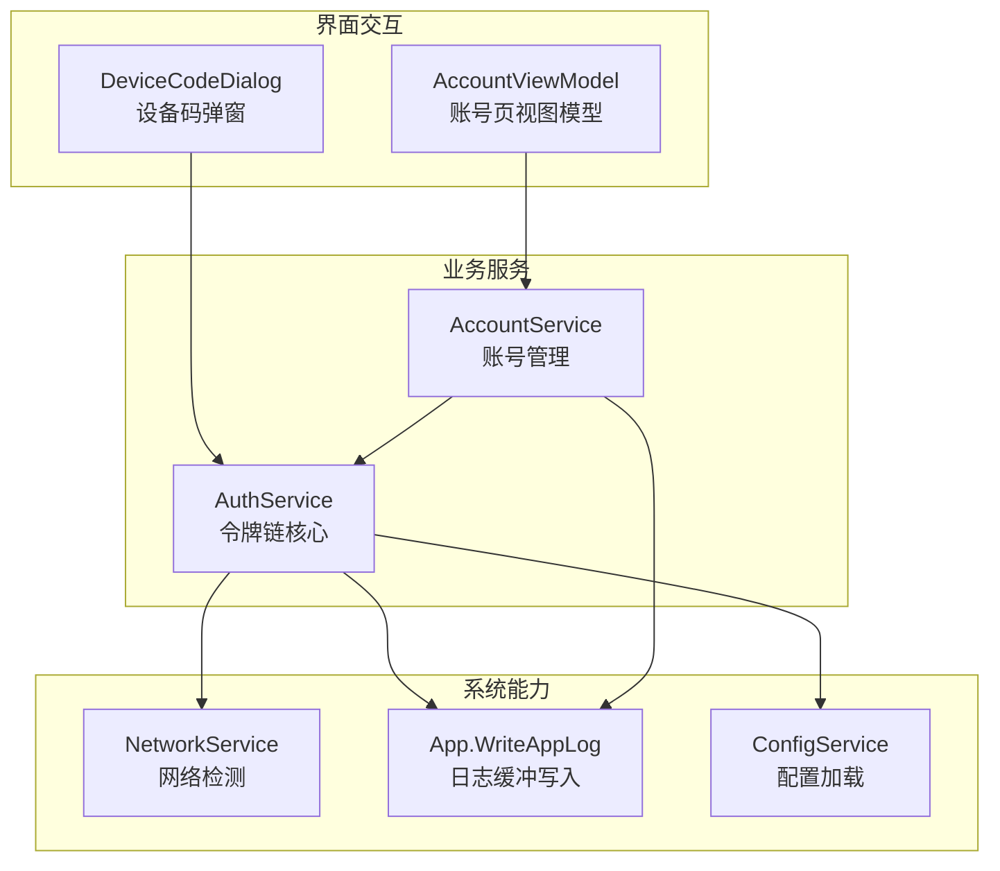
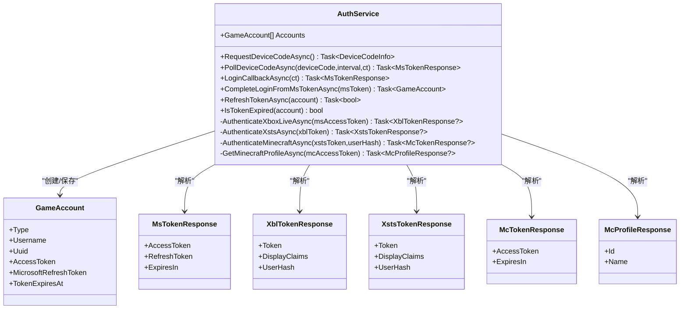
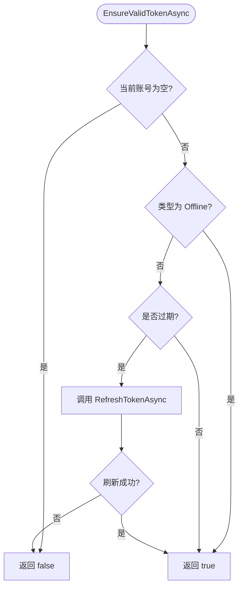
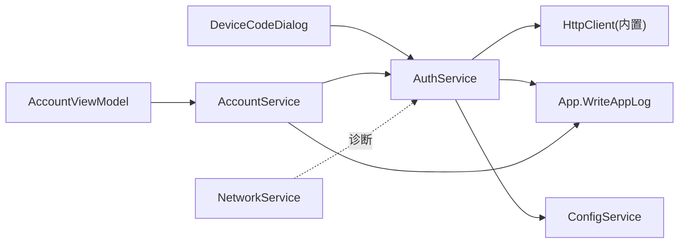

# 令牌链转换实现

<cite>
**本文引用的文件**   
- [AuthService.cs](file://src/FufuLauncher/Services/AuthService.cs)
- [AccountService.cs](file://src/FufuLauncher/Services/AccountService.cs)
- [DeviceCodeDialog.cs](file://src/FufuLauncher/Interaction/DeviceCodeDialog.cs)
- [ConfigService.cs](file://src/FufuLauncher/Services/ConfigService.cs)
- [NetworkService.cs](file://src/FufuLauncher/Services/NetworkService.cs)
- [App.xaml.cs](file://src/FufuLauncher/App.xaml.cs)
</cite>

## 目录
1. [简介](#简介)
2. [项目结构](#项目结构)
3. [核心组件](#核心组件)
4. [架构总览](#架构总览)
5. [详细组件分析](#详细组件分析)
6. [依赖关系分析](#依赖关系分析)
7. [性能考量](#性能考量)
8. [故障排查指南](#故障排查指南)
9. [结论](#结论)
10. [附录：请求与响应示例、调试技巧与最佳实践](#附录请求与响应示例调试技巧与最佳实践)

## 简介
本文件围绕“从 MS access_token 到 Minecraft access_token”的完整令牌链转换流程进行系统化说明，覆盖以下关键路径：
- 微软 OAuth（设备码或本地回调）获取 MS access_token
- MS access_token → Xbox Live(XBL) 认证
- XBL → XSTS 令牌交换（含 UserHash 的作用）
- XSTS → Minecraft access_token 最终令牌
- 玩家资料查询与离线账号处理
- 令牌生命周期管理与自动刷新机制
- 错误处理与降级策略
- 完整的请求/响应结构与调试建议

该实现采用分层服务设计，将认证逻辑封装在 AuthService，账户管理由 AccountService 负责，UI 交互通过 DeviceCodeDialog 完成。日志与网络诊断由 App.xaml.cs 与 NetworkService 提供支撑。

## 项目结构
与令牌链相关的代码主要位于 Services、Interaction 与 App 层：
- Services/AuthService.cs：定义令牌链全流程、HTTP 调用、模型解析、错误分类与刷新策略
- Services/AccountService.cs：当前账号选择、过期检测与自动刷新协调
- Interaction/DeviceCodeDialog.cs：设备码登录弹窗与轮询 UI
- Services/ConfigService.cs：配置项（如 AuthMode、端口等）
- Services/NetworkService.cs：网络连通性检测
- App.xaml.cs：应用初始化、DI 容器、日志写入与异常捕获



图表来源
- [AuthService.cs:76-121](file://src/FufuLauncher/Services/AuthService.cs#L76-L121)
- [AccountService.cs:12-26](file://src/FufuLauncher/Services/AccountService.cs#L12-L26)
- [DeviceCodeDialog.cs:20-30](file://src/FufuLauncher/Interaction/DeviceCodeDialog.cs#L20-L30)
- [NetworkService.cs:18-33](file://src/FufuLauncher/Services/NetworkService.cs#L18-L33)
- [App.xaml.cs:38-42](file://src/FufuLauncher/App.xaml.cs#L38-L42)
- [ConfigService.cs:88-100](file://src/FufuLauncher/Services/ConfigService.cs#L88-L100)

章节来源
- [AuthService.cs:1-121](file://src/FufuLauncher/Services/AuthService.cs#L1-L121)
- [AccountService.cs:1-54](file://src/FufuLauncher/Services/AccountService.cs#L1-L54)
- [DeviceCodeDialog.cs:1-204](file://src/FufuLauncher/Interaction/DeviceCodeDialog.cs#L1-L204)
- [ConfigService.cs:1-152](file://src/FufuLauncher/Services/ConfigService.cs#L1-L152)
- [NetworkService.cs:1-95](file://src/FufuLauncher/Services/NetworkService.cs#L1-L95)
- [App.xaml.cs:30-207](file://src/FufuLauncher/App.xaml.cs#L30-L207)

## 核心组件
- AuthService：承载完整令牌链逻辑，包括设备码登录、本地回调登录、XBL/XSTS/MC 认证、玩家资料查询、令牌刷新与过期判断、错误分类与日志记录。
- AccountService：维护当前账号、列表、删除、切换；在启动游戏前校验 token 是否过期并触发刷新。
- DeviceCodeDialog：设备码登录弹窗，自动复制验证码、打开浏览器、后台轮询授权结果。
- ConfigService：提供 AuthMode、CallbackPort 等配置项。
- NetworkService：检测 Mojang/BMCLAPI 连通性，辅助定位网络问题。
- App.xaml.cs：全局日志写入、异常捕获、DI 容器注册。

章节来源
- [AuthService.cs:76-121](file://src/FufuLauncher/Services/AuthService.cs#L76-L121)
- [AccountService.cs:12-54](file://src/FufuLauncher/Services/AccountService.cs#L12-L54)
- [DeviceCodeDialog.cs:20-30](file://src/FufuLauncher/Interaction/DeviceCodeDialog.cs#L20-L30)
- [ConfigService.cs:41-45](file://src/FufuLauncher/Services/ConfigService.cs#L41-L45)
- [NetworkService.cs:18-33](file://src/FufuLauncher/Services/NetworkService.cs#L18-L33)
- [App.xaml.cs:131-178](file://src/FufuLauncher/App.xaml.cs#L131-L178)

## 架构总览
下图展示从 MS access_token 到 Minecraft access_token 的端到端调用序列，以及各服务的职责边界。

```mermaid
sequenceDiagram
participant UI as "用户界面"
participant DCD as "DeviceCodeDialog"
participant AS as "AuthService"
participant MS as "Microsoft OAuth"
participant XBL as "Xbox Live"
participant XSTS as "XSTS"
participant MC as "Minecraft API"
participant LOG as "App.WriteAppLog"
UI->>DCD : 显示设备码弹窗
DCD->>AS : 轮询授权结果(带取消Token)
AS->>MS : POST /token (device_code)
MS-->>AS : 返回 MS access_token/refresh_token
AS->>LOG : 记录开始链路
AS->>XBL : POST /user/authenticate (RPSTicket=MS token)
XBL-->>AS : 返回 XBL Token + UserHash
AS->>XSTS : POST /xsts/authorize (UserTokens=[XBL])
XSTS-->>AS : 返回 XSTS Token + UserHash
AS->>MC : POST /authentication/login_with_xbox (identityToken=XBL3.0 x=UserHash;XSTS)
MC-->>AS : 返回 MC access_token + expires_in
AS->>MC : GET /minecraft/profile (Bearer MC token)
MC-->>AS : 返回玩家信息或404(未购买)
AS-->>DCD : 成功返回 MS token
DCD-->>UI : 关闭弹窗并返回结果
```

图表来源
- [AuthService.cs:158-265](file://src/FufuLauncher/Services/AuthService.cs#L158-L265)
- [AuthService.cs:342-398](file://src/FufuLauncher/Services/AuthService.cs#L342-L398)
- [AuthService.cs:504-606](file://src/FufuLauncher/Services/AuthService.cs#L504-L606)
- [DeviceCodeDialog.cs:26-30](file://src/FufuLauncher/Interaction/DeviceCodeDialog.cs#L26-L30)

## 详细组件分析

### 令牌链核心：AuthService
- 入口方法 CompleteLoginFromMsTokenAsync(msToken)：串联 XBL→XSTS→MC→Profile 四步，失败抛出 AuthException，携带具体错误类型。
- 内部方法 AuthenticateXboxLiveAsync(msAccessToken)：构造 RPS Ticket，请求 XBL 认证，返回 XblTokenResponse（含 UserHash）。
- 内部方法 AuthenticateXstsAsync(xblToken)：以 XBL Token 作为 UserTokens，请求 XSTS，返回 XstsTokenResponse（含 UserHash）。
- 内部方法 AuthenticateMinecraftAsync(xstsToken, userHash)：构造 identityToken="XBL3.0 x={userHash};{xstsToken}"，换取 MC access_token。
- GetMinecraftProfileAsync(mcAccessToken)：查询玩家资料，404 表示未购买 Minecraft，抛出 NotOwnedMinecraft 错误。
- RefreshTokenAsync(account)：使用 refresh_token 重新获取 MS token，再完整重走 XBL→XSTS→MC 链，更新持久化数据。
- IsTokenExpired(account)：基于 TokenExpiresAt 提前 5 分钟判定过期，便于预刷新。



图表来源
- [AuthService.cs:50-63](file://src/FufuLauncher/Services/AuthService.cs#L50-L63)
- [AuthService.cs:646-682](file://src/FufuLauncher/Services/AuthService.cs#L646-L682)
- [AuthService.cs:342-398](file://src/FufuLauncher/Services/AuthService.cs#L342-L398)

章节来源
- [AuthService.cs:158-265](file://src/FufuLauncher/Services/AuthService.cs#L158-L265)
- [AuthService.cs:342-398](file://src/FufuLauncher/Services/AuthService.cs#L342-L398)
- [AuthService.cs:418-468](file://src/FufuLauncher/Services/AuthService.cs#L418-L468)
- [AuthService.cs:504-606](file://src/FufuLauncher/Services/AuthService.cs#L504-L606)
- [AuthService.cs:608-643](file://src/FufuLauncher/Services/AuthService.cs#L608-L643)
- [AuthService.cs:646-682](file://src/FufuLauncher/Services/AuthService.cs#L646-L682)

### 账号管理：AccountService
- EnsureValidTokenAsync()：在启动游戏前检查当前账号是否为 Microsoft 类型且已过期，若过期则调用 AuthService.RefreshTokenAsync() 自动刷新。
- SetCurrentAccount/DeleteAccount：切换或删除账号，触发 AccountsChanged 事件通知 UI。



图表来源
- [AccountService.cs:42-52](file://src/FufuLauncher/Services/AccountService.cs#L42-L52)

章节来源
- [AccountService.cs:12-54](file://src/FufuLauncher/Services/AccountService.cs#L12-L54)

### 设备码登录交互：DeviceCodeDialog
- ShowAndPollAsync(userCode, verificationUri, pollFunc)：弹出窗口，自动复制验证码到剪贴板，一键打开浏览器，后台轮询授权结果，支持取消。
- 成功时关闭窗口并返回 MS token；失败或取消抛出 AuthException(Cancelled)。

章节来源
- [DeviceCodeDialog.cs:20-30](file://src/FufuLauncher/Interaction/DeviceCodeDialog.cs#L20-L30)
- [DeviceCodeDialog.cs:126-170](file://src/FufuLauncher/Interaction/DeviceCodeDialog.cs#L126-L170)
- [DeviceCodeDialog.cs:172-204](file://src/FufuLauncher/Interaction/DeviceCodeDialog.cs#L172-L204)

### 配置与网络支撑
- ConfigService：提供 AuthMode（DeviceCode/LocalCallback）、AuthCallbackPort 等配置。
- NetworkService：测试 Mojang/BMCLAPI 连通性，用于诊断下载源问题（与认证链路间接相关，帮助区分网络问题）。
- App.xaml.cs：集中式日志写入（ConcurrentQueue + Timer），全局异常捕获，DI 容器注册所有服务。

章节来源
- [ConfigService.cs:41-45](file://src/FufuLauncher/Services/ConfigService.cs#L41-L45)
- [NetworkService.cs:18-33](file://src/FufuLauncher/Services/NetworkService.cs#L18-L33)
- [App.xaml.cs:38-42](file://src/FufuLauncher/App.xaml.cs#L38-L42)
- [App.xaml.cs:131-178](file://src/FufuLauncher/App.xaml.cs#L131-L178)

## 依赖关系分析
- AuthService 依赖 HttpClient（统一设置 User-Agent/Accept），避免部分服务端拒绝无 UA 的请求。
- AccountService 依赖 AuthService 暴露的账号列表与刷新能力。
- DeviceCodeDialog 依赖 AuthService 的轮询函数（pollFunc），解耦 UI 与网络逻辑。
- App.xaml.cs 通过 DI 注入所有服务，保证生命周期一致性与可测试性。
- NetworkService 独立于认证链路，但可用于快速定位网络问题。



图表来源
- [AuthService.cs:94-100](file://src/FufuLauncher/Services/AuthService.cs#L94-L100)
- [AccountService.cs:12-26](file://src/FufuLauncher/Services/AccountService.cs#L12-L26)
- [DeviceCodeDialog.cs:26-30](file://src/FufuLauncher/Interaction/DeviceCodeDialog.cs#L26-L30)
- [App.xaml.cs:131-178](file://src/FufuLauncher/App.xaml.cs#L131-L178)

章节来源
- [AuthService.cs:94-100](file://src/FufuLauncher/Services/AuthService.cs#L94-L100)
- [AccountService.cs:12-26](file://src/FufuLauncher/Services/AccountService.cs#L12-L26)
- [DeviceCodeDialog.cs:26-30](file://src/FufuLauncher/Interaction/DeviceCodeDialog.cs#L26-L30)
- [App.xaml.cs:131-178](file://src/FufuLauncher/App.xaml.cs#L131-L178)

## 性能考量
- HttpClient 复用与超时控制：AuthService 使用静态 HttpClient，设置合理超时与默认头，减少连接开销。
- 日志批量写入：App.WriteAppLog 使用队列与定时器批量落盘，避免高频 IO 阻塞主线程。
- 轮询退避：设备码轮询遇到 slow_down 时增加延迟，降低服务器压力。
- 预刷新策略：IsTokenExpired 提前 5 分钟判定过期，减少运行时刷新带来的卡顿。
- 网络诊断：NetworkService 快速检测外部源连通性，有助于区分认证失败与网络问题。

[本节为通用指导，不直接分析具体文件]

## 故障排查指南
- 常见错误分类（AuthError）：
  - Network：网络异常（DNS/连接/超时）
  - NotOwnedMinecraft：账号未购买 Minecraft（MC 资料接口返回 404）
  - Cancelled：用户取消或拒绝授权
  - DeviceCodeExpired：设备码过期
  - TokenExchangeFailed：任一环节（MS/XBL/XSTS/MC）令牌交换失败
- 排查步骤：
  1. 查看应用日志 app.log（App.ReadAppLog），关注“[登录]”开头的行，包含各端点状态码与响应片段。
  2. 使用 NetworkService.TestConnectivityAsync 验证 Mojang/BMCLAPI 连通性。
  3. 确认 AuthMode 与 CallbackPort 配置正确（DeviceCode/LocalCallback）。
  4. 若为 404 未购买 MC，提示用户前往官方渠道购买。
  5. 若设备码过期，引导用户重新发起登录流程。
- 降级策略：
  - 设备码模式优先，本地回调模式备选（当端口占用或浏览器无法打开时）。
  - 玩家资料查询失败时回退生成 UUID，不影响后续登录。
  - 刷新失败时保持旧令牌，等待下次重试或提示用户重新登录。

章节来源
- [AuthService.cs:32-48](file://src/FufuLauncher/Services/AuthService.cs#L32-L48)
- [AuthService.cs:608-643](file://src/FufuLauncher/Services/AuthService.cs#L608-L643)
- [NetworkService.cs:34-76](file://src/FufuLauncher/Services/NetworkService.cs#L34-L76)
- [App.xaml.cs:38-42](file://src/FufuLauncher/App.xaml.cs#L38-L42)

## 结论
该实现以清晰的分层与模块化设计完成了从 MS access_token 到 Minecraft access_token 的完整令牌链转换，具备完善的错误分类、日志记录与自动刷新机制。通过设备码与本地回调双模式提升用户体验，结合网络诊断与预刷新策略保障稳定性与性能。建议在部署中开启详细日志，并结合 NetworkService 快速定位问题。

[本节为总结性内容，不直接分析具体文件]

## 附录：请求与响应示例、调试技巧与最佳实践

### 请求与响应结构（概念性描述）
- 设备码授权（MS OAuth）
  - 请求：POST /consumers/oauth2/v2.0/devicecode，参数 client_id、scope
  - 响应：device_code、user_code、verification_uri、expires_in、interval
  - 轮询：POST /consumers/oauth2/v2.0/token，grant_type=device_code，device_code
  - 成功响应：access_token、refresh_token、expires_in
- XBL 认证
  - 请求：POST /user/authenticate，JSON body 包含 Properties.AuthMethod=RPS、Properties.RpsTicket=d={ms_access_token}、RelyingParty=http://auth.xboxlive.com、TokenType=JWT
  - 响应：Token、DisplayClaims.Xui[0].UserHash
- XSTS 认证
  - 请求：POST /xsts/authorize，JSON body 包含 Properties.UserTokens=[xbl_token]、RelyingParty=rp://api.minecraftservices.com/、TokenType=JWT
  - 响应：Token、DisplayClaims.Xui[0].UserHash
- Minecraft 认证
  - 请求：POST /authentication/login_with_xbox，JSON body 包含 identityToken="XBL3.0 x={user_hash};{xsts_token}"
  - 响应：access_token、expires_in
- 玩家资料
  - 请求：GET /minecraft/profile，Header Authorization: Bearer {mc_access_token}
  - 响应：id、name；404 表示未购买 Minecraft

章节来源
- [AuthService.cs:158-265](file://src/FufuLauncher/Services/AuthService.cs#L158-L265)
- [AuthService.cs:504-606](file://src/FufuLauncher/Services/AuthService.cs#L504-L606)
- [AuthService.cs:608-643](file://src/FufuLauncher/Services/AuthService.cs#L608-L643)

### 调试技巧
- 启用详细日志：查看 app.log 中“[登录]”相关条目，关注状态码与响应片段。
- 网络诊断：运行 NetworkService.TestConnectivityAsync，确认外部源可达。
- 设备码弹窗：确保剪贴板可用、浏览器能打开 verification_uri。
- 本地回调模式：检查端口 54321 未被占用，Azure 重定向 URI 匹配。
- 错误分类：根据 AuthError 枚举快速定位问题类型。

章节来源
- [App.xaml.cs:38-42](file://src/FufuLauncher/App.xaml.cs#L38-L42)
- [NetworkService.cs:34-76](file://src/FufuLauncher/Services/NetworkService.cs#L34-L76)
- [DeviceCodeDialog.cs:126-170](file://src/FufuLauncher/Interaction/DeviceCodeDialog.cs#L126-L170)
- [AuthService.cs:32-48](file://src/FufuLauncher/Services/AuthService.cs#L32-L48)

### 最佳实践
- 始终设置 User-Agent/Accept 头，避免被服务端拒绝。
- 使用设备码模式为主，本地回调模式为辅，提高兼容性。
- 预刷新令牌，避免运行时刷新导致的卡顿。
- 对玩家资料查询失败做回退处理，确保登录流程健壮性。
- 定期清理无效账号文件，避免读取损坏数据。

[本节为通用指导，不直接分析具体文件]