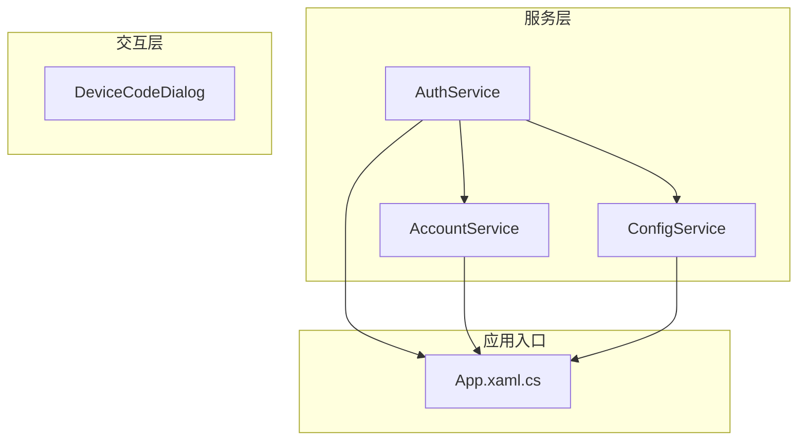
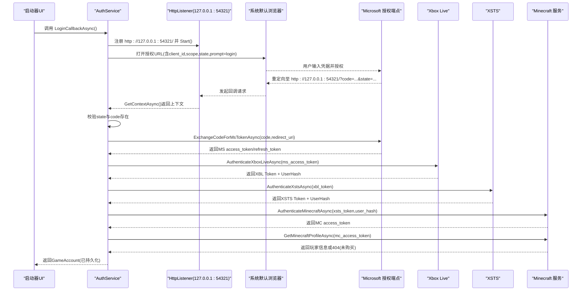
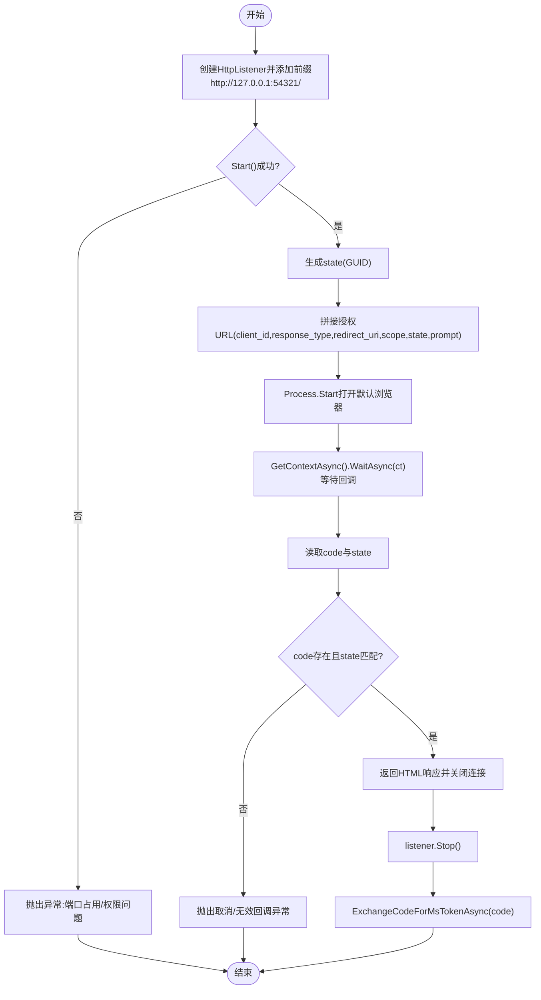
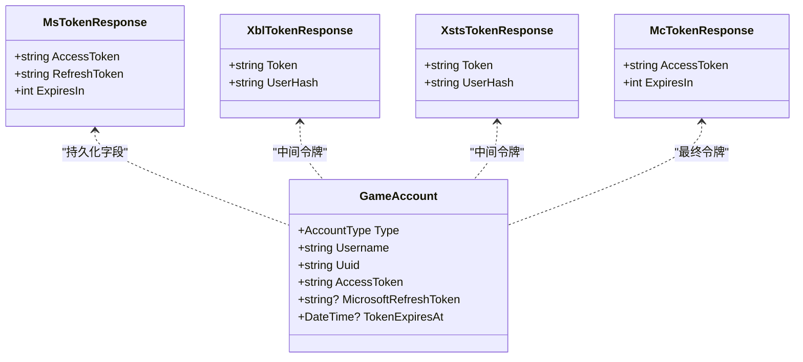
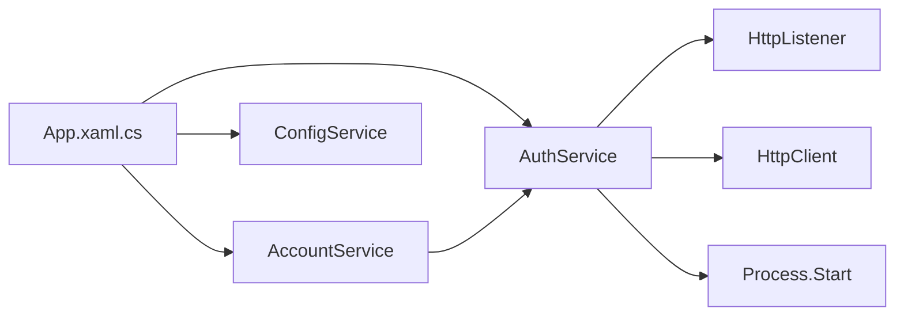

# 本地回调登录模式

<cite>
**本文引用的文件**   
- [AuthService.cs](file://src/FufuLauncher/Services/AuthService.cs)
- [AccountService.cs](file://src/FufuLauncher/Services/AccountService.cs)
- [ConfigService.cs](file://src/FufuLauncher/Services/ConfigService.cs)
- [DeviceCodeDialog.cs](file://src/FufuLauncher/Interaction/DeviceCodeDialog.cs)
- [App.xaml.cs](file://src/FufuLauncher/App.xaml.cs)
</cite>

## 目录
1. [简介](#简介)
2. [项目结构](#项目结构)
3. [核心组件](#核心组件)
4. [架构总览](#架构总览)
5. [详细组件分析](#详细组件分析)
6. [依赖关系分析](#依赖关系分析)
7. [性能与安全性考虑](#性能与安全性考虑)
8. [故障排除指南](#故障排除指南)
9. [结论](#结论)
10. [附录：关键流程时序图](#附录关键流程时序图)

## 简介
本文件面向“本地回调登录模式”的完整实现与使用，聚焦以下要点：
- HttpListener 的使用与本地服务器启动过程（端口监听、重定向 URI 配置、安全性）
- 浏览器重定向处理流程（打开授权页面、用户认证、回调接收）
- 授权码交换过程（从接收 code 参数到获取 MS access_token 的完整链路）
- state 参数验证与 CSRF 防护机制
- 错误处理策略（端口占用、浏览器启动失败、用户取消等）
- 具体代码示例路径与排错建议

该模式作为设备码登录的备选方案，适用于需要浏览器交互且可接受本地回环地址回调的场景。

## 项目结构
与本地回调登录相关的核心代码集中在 Services 层与 Interaction 层：
- AuthService：封装微软 OAuth 端点、HttpListener 回调、授权码交换、XBL/XSTS/Minecraft 令牌链、刷新与持久化
- AccountService：账号列表、当前账号切换、Token 过期自动刷新
- ConfigService：应用配置（包含 AuthMode、回调端口等）
- DeviceCodeDialog：设备码弹窗（与本模式并列的另一种登录方式）
- App.xaml.cs：全局日志写入、异常捕获、服务注册

图表来源
- [AuthService.cs:118-121](file://src/FufuLauncher/Services/AuthService.cs#L118-L121)
- [AccountService.cs:22-26](file://src/FufuLauncher/Services/AccountService.cs#L22-L26)
- [ConfigService.cs:88-100](file://src/FufuLauncher/Services/ConfigService.cs#L88-L100)
- [App.xaml.cs:131-178](file://src/FufuLauncher/App.xaml.cs#L131-L178)

章节来源
- [AuthService.cs:118-121](file://src/FufuLauncher/Services/AuthService.cs#L118-L121)
- [AccountService.cs:22-26](file://src/FufuLauncher/Services/AccountService.cs#L22-L26)
- [ConfigService.cs:88-100](file://src/FufuLauncher/Services/ConfigService.cs#L88-L100)
- [App.xaml.cs:131-178](file://src/FufuLauncher/App.xaml.cs#L131-L178)

## 核心组件
- AuthService
  - 负责两种登录模式：设备码（默认）和本地回调（备选）
  - 本地回调模式通过 HttpListener 在 127.0.0.1:54321 监听回调
  - 构建授权 URL 并调用系统默认浏览器打开
  - 接收回调中的 code 和 state，校验 state 后换取 MS token
  - 完成 XBL→XSTS→MC 令牌链，获取玩家资料并持久化
  - 支持 refresh_token 自动刷新完整令牌链
- AccountService
  - 管理账号列表、当前账号、删除操作
  - 启动游戏前检查 Token 是否过期，必要时触发刷新
- ConfigService
  - 提供 AuthMode、AuthCallbackPort 等配置项
- DeviceCodeDialog
  - 设备码登录弹窗（与本模式并列）
- App.xaml.cs
  - 统一日志写入（WriteAppLog）、全局异常捕获、DI 容器初始化

章节来源
- [AuthService.cs:157-338](file://src/FufuLauncher/Services/AuthService.cs#L157-L338)
- [AccountService.cs:12-53](file://src/FufuLauncher/Services/AccountService.cs#L12-L53)
- [ConfigService.cs:41-45](file://src/FufuLauncher/Services/ConfigService.cs#L41-L45)
- [DeviceCodeDialog.cs:20-204](file://src/FufuLauncher/Interaction/DeviceCodeDialog.cs#L20-L204)
- [App.xaml.cs:38-73](file://src/FufuLauncher/App.xaml.cs#L38-L73)

## 架构总览
下图展示了本地回调登录模式的端到端流程，包括浏览器、本地 HttpListener、AuthService 以及微软/Xbox/Minecraft 服务端之间的交互。

图表来源
- [AuthService.cs:269-338](file://src/FufuLauncher/Services/AuthService.cs#L269-L338)
- [AuthService.cs:488-502](file://src/FufuLauncher/Services/AuthService.cs#L488-L502)
- [AuthService.cs:504-606](file://src/FufuLauncher/Services/AuthService.cs#L504-L606)
- [AuthService.cs:608-643](file://src/FufuLauncher/Services/AuthService.cs#L608-L643)

## 详细组件分析

### HttpListener 本地服务器与回调处理
- 端口监听与重定向 URI
  - 固定端口 54321，重定向 URI 为 http://127.0.0.1:54321/（需尾斜杠）
  - 使用 HttpListener.Prefixes.Add(RedirectUri) 注册监听前缀
  - listener.Start() 启动监听；若抛出 HttpListenerException，说明端口被占用或权限不足
- 打开浏览器与等待回调
  - 构造授权 URL，包含 client_id、response_type=code、redirect_uri、scope、state、prompt=login
  - 使用 System.Diagnostics.Process.Start 打开默认浏览器
  - 使用 listener.GetContextAsync().WaitAsync(ct) 等待回调，支持取消
- 回调处理与响应
  - 从 QueryString 中读取 code 与 state
  - 立即返回 HTML 响应（成功/失败提示），关闭输出流并停止监听
  - 校验 state 是否与生成值一致，否则视为无效回调

图表来源
- [AuthService.cs:269-338](file://src/FufuLauncher/Services/AuthService.cs#L269-L338)

章节来源
- [AuthService.cs:269-338](file://src/FufuLauncher/Services/AuthService.cs#L269-L338)

### 授权码交换与令牌链
- 授权码交换
  - 向 Microsoft Token 端点 POST authorization_code 请求，携带 client_id、grant_type、code、redirect_uri、scope
  - 解析响应得到 MS access_token 与 refresh_token
- 完整令牌链
  - XBL 认证：以 MS access_token 换取 XBL Token（RPS Ticket）
  - XSTS 认证：以 XBL Token 换取 XSTS Token（用于 Minecraft）
  - Minecraft 认证：以 XSTS Token 换取 MC access_token
  - 查询玩家资料：使用 MC access_token 获取玩家名与 UUID；404 表示未购买 Minecraft
- 持久化与刷新
  - 保存 GameAccount（类型、用户名、UUID、MC access_token、MS refresh_token、过期时间）
  - 刷新流程：使用 refresh_token 重新获取 MS token，再完整重走 XBL→XSTS→MC 链

图表来源
- [AuthService.cs:646-681](file://src/FufuLauncher/Services/AuthService.cs#L646-L681)

章节来源
- [AuthService.cs:488-502](file://src/FufuLauncher/Services/AuthService.cs#L488-L502)
- [AuthService.cs:504-606](file://src/FufuLauncher/Services/AuthService.cs#L504-L606)
- [AuthService.cs:608-643](file://src/FufuLauncher/Services/AuthService.cs#L608-L643)
- [AuthService.cs:646-681](file://src/FufuLauncher/Services/AuthService.cs#L646-L681)

### state 参数验证与 CSRF 防护
- 生成随机 state（GUID 无分隔符）
- 将 state 拼接到授权 URL
- 回调时比对返回的 state 与原始值，不一致则拒绝
- 此机制防止跨站请求伪造攻击，确保回调来自预期的授权流程

章节来源
- [AuthService.cs:284-291](file://src/FufuLauncher/Services/AuthService.cs#L284-L291)
- [AuthService.cs:317-334](file://src/FufuLauncher/Services/AuthService.cs#L317-L334)

### 错误处理策略
- 端口占用
  - HttpListener.Start() 抛出异常时，包装为 AuthException，提示端口占用或切换到设备码模式
- 浏览器启动失败
  - Process.Start() 抛异常时，包装为 AuthException，提示无法打开浏览器
- 用户取消
  - WaitAsync 被取消或回调缺少 code/state，抛出 AuthException(Cancelled)
- 网络异常
  - HttpRequestException 被捕获并转换为 AuthError.Network
- 令牌交换失败
  - 任一环节（MS/XBL/XSTS/MC）失败均抛出 AuthError.TokenExchangeFailed
- 未购买 Minecraft
  - 查询玩家资料返回 404，抛出 AuthError.NotOwnedMinecraft

章节来源
- [AuthService.cs:278-282](file://src/FufuLauncher/Services/AuthService.cs#L278-L282)
- [AuthService.cs:295-304](file://src/FufuLauncher/Services/AuthService.cs#L295-L304)
- [AuthService.cs:312-315](file://src/FufuLauncher/Services/AuthService.cs#L312-L315)
- [AuthService.cs:331-334](file://src/FufuLauncher/Services/AuthService.cs#L331-L334)
- [AuthService.cs:184-191](file://src/FufuLauncher/Services/AuthService.cs#L184-L191)
- [AuthService.cs:252-262](file://src/FufuLauncher/Services/AuthService.cs#L252-L262)
- [AuthService.cs:617-622](file://src/FufuLauncher/Services/AuthService.cs#L617-L622)

### 与 AccountService 的集成
- EnsureValidTokenAsync：启动游戏前检查当前账号的 Token 是否即将过期
- 若过期，调用 AuthService.RefreshTokenAsync 刷新完整令牌链
- 刷新成功后更新持久化的 GameAccount

章节来源
- [AccountService.cs:42-52](file://src/FufuLauncher/Services/AccountService.cs#L42-L52)
- [AuthService.cs:420-468](file://src/FufuLauncher/Services/AuthService.cs#L420-L468)

### 配置项与模式选择
- ConfigService.AppConfig 中包含：
  - AuthMode：DeviceCode（默认）或 LocalCallback（备选）
  - AuthCallbackPort：回调端口（默认 54321）
- AuthService 内部硬编码了 ClientId、RedirectUri、CallbackPort，需与 Azure 应用注册保持一致

章节来源
- [ConfigService.cs:41-45](file://src/FufuLauncher/Services/ConfigService.cs#L41-L45)
- [AuthService.cs:109-114](file://src/FufuLauncher/Services/AuthService.cs#L109-L114)

## 依赖关系分析
- AuthService 依赖：
  - ConfigService（读取配置）
  - HttpClient（HTTP 请求）
  - System.Net.HttpListener（本地回调）
  - System.Diagnostics.Process（打开浏览器）
- AccountService 依赖：
  - AuthService（账号管理与刷新）
- App.xaml.cs 依赖：
  - 所有服务（DI 容器注册）
  - WriteAppLog（统一日志）

图表来源
- [App.xaml.cs:131-178](file://src/FufuLauncher/App.xaml.cs#L131-L178)
- [AuthService.cs:92-100](file://src/FufuLauncher/Services/AuthService.cs#L92-L100)
- [AuthService.cs:269-338](file://src/FufuLauncher/Services/AuthService.cs#L269-L338)
- [AccountService.cs:22-26](file://src/FufuLauncher/Services/AccountService.cs#L22-L26)

章节来源
- [App.xaml.cs:131-178](file://src/FufuLauncher/App.xaml.cs#L131-L178)
- [AuthService.cs:92-100](file://src/FufuLauncher/Services/AuthService.cs#L92-L100)
- [AccountService.cs:22-26](file://src/FufuLauncher/Services/AccountService.cs#L22-L26)

## 性能与安全性考虑
- 性能
  - HttpClient 设置超时与统一 User-Agent/Accept 头，避免部分端点拒绝无 UA 的请求
  - 日志批量写入（ConcurrentQueue + Timer），降低 IO 阻塞
- 安全性
  - 仅监听 127.0.0.1，避免外部访问
  - state 参数校验，防止 CSRF
  - prompt=login 强制重新认证，减少会话劫持风险
  - 敏感数据（refresh_token）持久化需谨慎保管

章节来源
- [AuthService.cs:94-100](file://src/FufuLauncher/Services/AuthService.cs#L94-L100)
- [AuthService.cs:284-291](file://src/FufuLauncher/Services/AuthService.cs#L284-L291)
- [App.xaml.cs:34-60](file://src/FufuLauncher/App.xaml.cs#L34-L60)

## 故障排除指南
- 端口占用
  - 现象：HttpListener.Start() 抛出异常
  - 处理：确认 54321 未被占用；或在设置页切换为设备码模式
  - 参考路径：[AuthService.cs:278-282](file://src/FufuLauncher/Services/AuthService.cs#L278-L282)
- 浏览器启动失败
  - 现象：Process.Start() 抛异常
  - 处理：检查系统默认浏览器设置；尝试手动复制授权 URL 到浏览器
  - 参考路径：[AuthService.cs:295-304](file://src/FufuLauncher/Services/AuthService.cs#L295-L304)
- 用户取消登录
  - 现象：WaitAsync 取消或回调缺少 code/state
  - 处理：提示用户重试；记录日志
  - 参考路径：[AuthService.cs:312-315](file://src/FufuLauncher/Services/AuthService.cs#L312-L315), [AuthService.cs:331-334](file://src/FufuLauncher/Services/AuthService.cs#L331-L334)
- 网络异常
  - 现象：HttpRequestException
  - 处理：重试或提示网络问题；查看 app.log
  - 参考路径：[AuthService.cs:184-191](file://src/FufuLauncher/Services/AuthService.cs#L184-L191), [AuthService.cs:252-262](file://src/FufuLauncher/Services/AuthService.cs#L252-L262)
- 令牌交换失败
  - 现象：MS/XBL/XSTS/MC 任一环节失败
  - 处理：查看详细日志；检查客户端 ID、Scope、网络连通性
  - 参考路径：[AuthService.cs:488-502](file://src/FufuLauncher/Services/AuthService.cs#L488-L502), [AuthService.cs:504-606](file://src/FufuLauncher/Services/AuthService.cs#L504-L606)
- 未购买 Minecraft
  - 现象：查询玩家资料返回 404
  - 处理：引导用户购买 Minecraft Java 版
  - 参考路径：[AuthService.cs:617-622](file://src/FufuLauncher/Services/AuthService.cs#L617-L622)
- 日志查看
  - 位置：appmcGAME/app.log
  - 读取方法：App.ReadAppLog()
  - 参考路径：[App.xaml.cs:62-73](file://src/FufuLauncher/App.xaml.cs#L62-L73)

章节来源
- [AuthService.cs:278-334](file://src/FufuLauncher/Services/AuthService.cs#L278-L334)
- [AuthService.cs:488-606](file://src/FufuLauncher/Services/AuthService.cs#L488-L606)
- [AuthService.cs:617-622](file://src/FufuLauncher/Services/AuthService.cs#L617-L622)
- [App.xaml.cs:62-73](file://src/FufuLauncher/App.xaml.cs#L62-L73)

## 结论
本地回调登录模式通过 HttpListener 在本地回环地址上安全接收授权回调，结合 state 校验有效防范 CSRF。其完整的令牌链（MS→XBL→XSTS→MC）确保了 Minecraft 登录所需的凭证。配合统一的日志与异常处理，便于定位问题与优化用户体验。建议在端口可用且浏览器环境正常的情况下优先使用该模式；否则回退到设备码模式。

## 附录：关键流程时序图
- 本地回调登录序列图（见“架构总览”）
- 授权码交换流程图（见“HttpListener 本地服务器与回调处理”）

[本节为概念性总结，不直接分析具体文件]