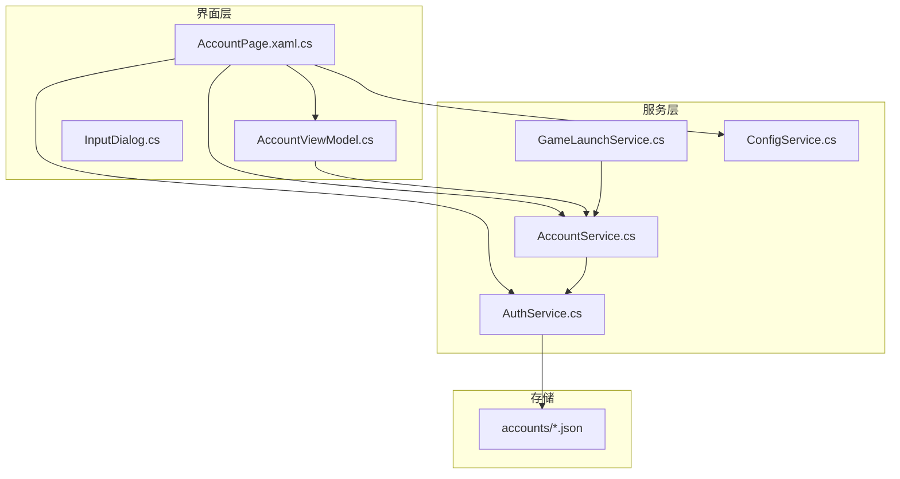
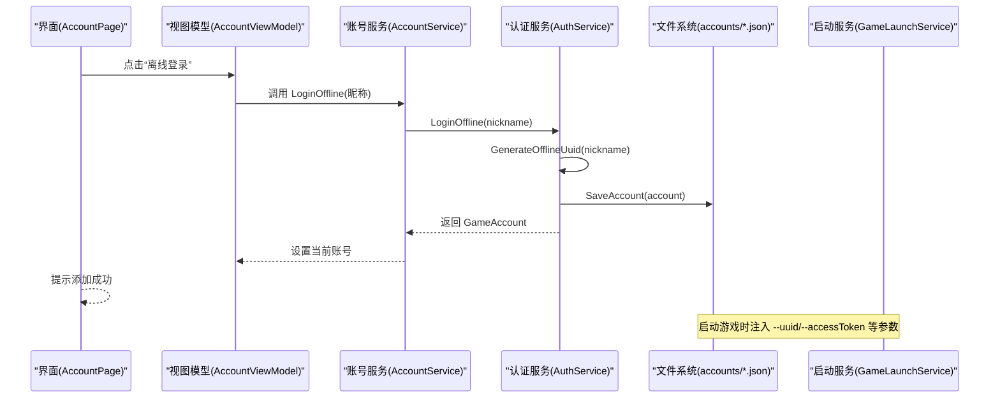
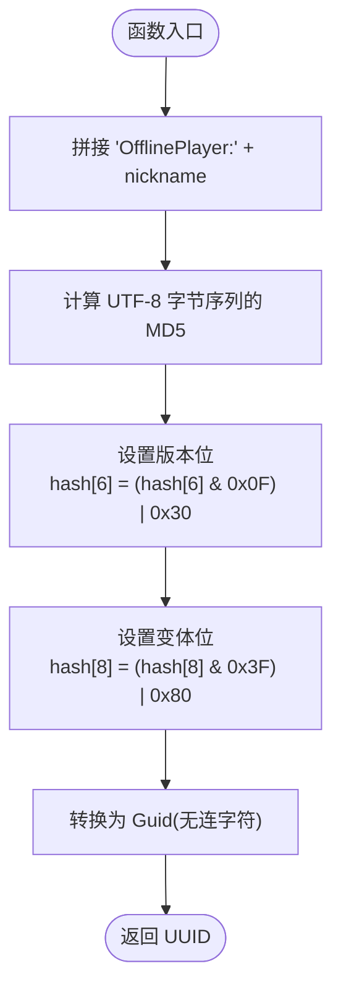
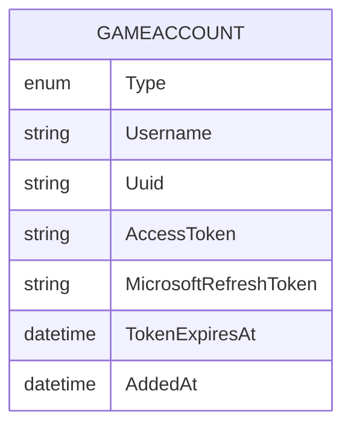
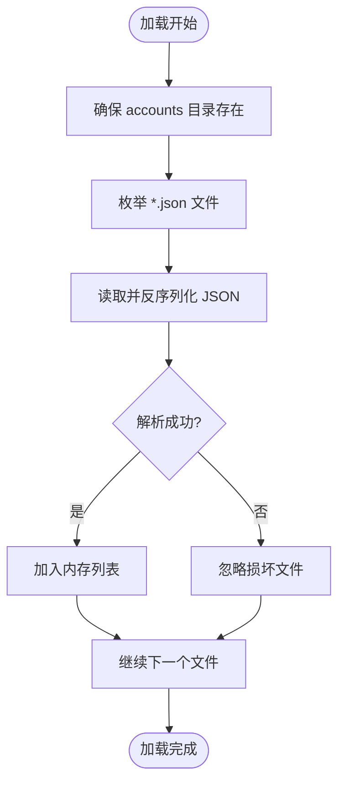
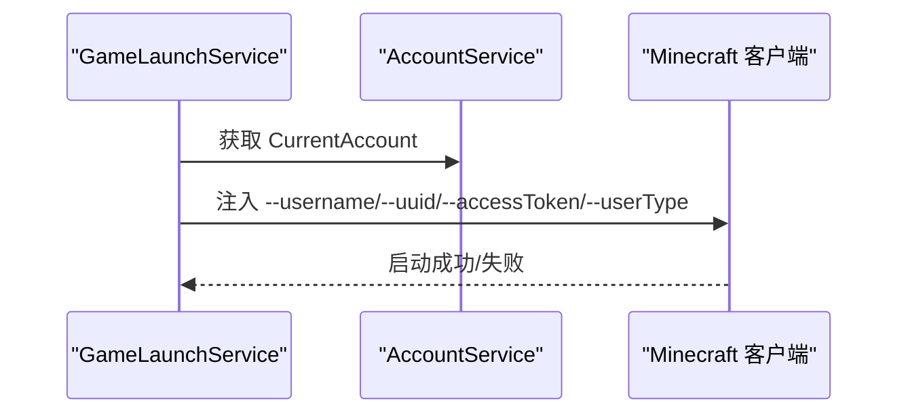
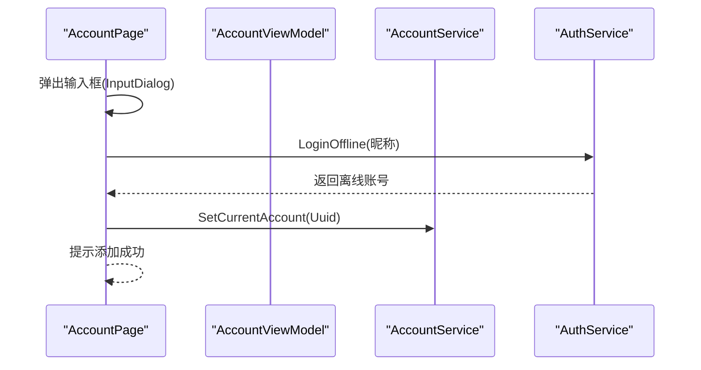
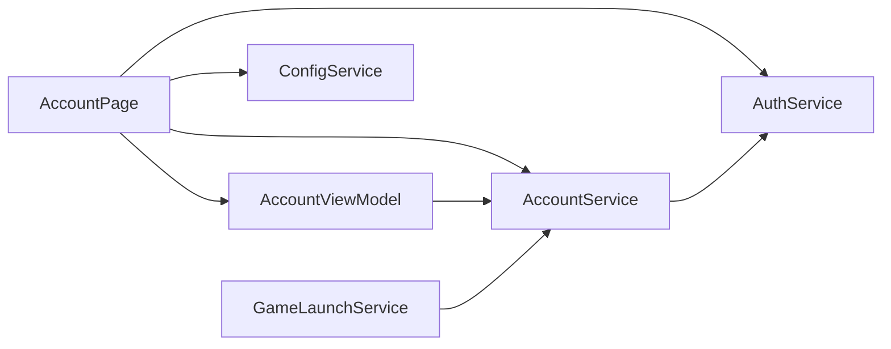

# 离线账号系统

<cite>
**本文引用的文件**   
- [AuthService.cs](file://src/FufuLauncher/Services/AuthService.cs)
- [AccountService.cs](file://src/FufuLauncher/Services/AccountService.cs)
- [GameLaunchService.cs](file://src/FufuLauncher/Services/GameLaunchService.cs)
- [ConfigService.cs](file://src/FufuLauncher/Services/ConfigService.cs)
- [AccountPage.xaml.cs](file://src/FufuLauncher/Views/AccountPage.xaml.cs)
- [AccountViewModel.cs](file://src/FufuLauncher/ViewModels/AccountViewModel.cs)
- [InputDialog.cs](file://src/FufuLauncher/Interaction/InputDialog.cs)
- [43381ea021e59839958af459800e4d11.json](file://Start/appmcGAME/accounts/43381ea021e59839958af459800e4d11.json)
</cite>

## 目录
1. [简介](#简介)
2. [项目结构](#项目结构)
3. [核心组件](#核心组件)
4. [架构总览](#架构总览)
5. [详细组件分析](#详细组件分析)
6. [依赖关系分析](#依赖关系分析)
7. [性能考虑](#性能考虑)
8. [故障排查指南](#故障排查指南)
9. [结论](#结论)
10. [附录](#附录)

## 简介
本文件面向“离线账号系统”，围绕以下目标展开：
- 详细说明离线 UUID 生成算法（基于 "OfflinePlayer:" + nickname 的 MD5 v3）
- 解释离线账号的数据结构与存储格式，以及与在线账号的差异
- 记录离线模式的限制与功能支持情况
- 说明离线账号的持久化存储与加载机制
- 安全性考虑与数据完整性保护
- 提供离线账号创建、管理与删除的完整示例
- 解释与游戏客户端的兼容性处理方式

## 项目结构
离线账号相关代码主要分布在服务层、视图层与交互辅助模块中：
- 服务层
  - AuthService：账号登录、离线 UUID 生成、账户持久化、令牌刷新等
  - AccountService：当前账号管理、列表同步、启动前 Token 校验
  - GameLaunchService：拼接 JVM 参数并启动游戏进程，注入 --uuid/--accessToken 等
  - ConfigService：应用配置与迁移
- 视图层
  - AccountPage：离线登录入口、设置当前账号、删除账号
  - AccountViewModel：UI 数据绑定与刷新
- 交互辅助
  - InputDialog：输入昵称弹窗
- 存储样例
  - accounts/*.json：单个账号 JSON 文件（文件名即 Uuid）

图表来源
- [AccountPage.xaml.cs:105-114](file://src/FufuLauncher/Views/AccountPage.xaml.cs#L105-L114)
- [AccountViewModel.cs:21-34](file://src/FufuLauncher/ViewModels/AccountViewModel.cs#L21-L34)
- [AuthService.cs:123-155](file://src/FufuLauncher/Services/AuthService.cs#L123-L155)
- [AccountService.cs:22-39](file://src/FufuLauncher/Services/AccountService.cs#L22-L39)
- [GameLaunchService.cs:236-256](file://src/FufuLauncher/Services/GameLaunchService.cs#L236-L256)

章节来源
- [AccountPage.xaml.cs:105-114](file://src/FufuLauncher/Views/AccountPage.xaml.cs#L105-L114)
- [AccountViewModel.cs:21-34](file://src/FufuLauncher/ViewModels/AccountViewModel.cs#L21-L34)
- [AuthService.cs:123-155](file://src/FufuLauncher/Services/AuthService.cs#L123-L155)
- [AccountService.cs:22-39](file://src/FufuLauncher/Services/AccountService.cs#L22-L39)
- [GameLaunchService.cs:236-256](file://src/FufuLauncher/Services/GameLaunchService.cs#L236-L256)

## 核心组件
- AuthService
  - 负责离线账号创建（LoginOffline）、离线 UUID 生成（GenerateOfflineUuid）、账户持久化（SaveAccount/DeleteAccount）、在线账号登录链路与令牌刷新。
- AccountService
  - 维护当前账号、提供 SetCurrentAccount/DeleteAccount、在启动前对在线账号进行 Token 有效性检查（离线账号直接通过）。
- GameLaunchService
  - 启动游戏时注入 --username/--version/--gameDir/--assetsDir/--assetIndex/--uuid/--accessToken/--userType 等参数，确保离线账号能正确传入游戏。
- ConfigService
  - 管理应用配置（如 AuthMode、回调端口等），不影响离线账号逻辑，但影响整体认证模式。

章节来源
- [AuthService.cs:403-416](file://src/FufuLauncher/Services/AuthService.cs#L403-L416)
- [AuthService.cs:477-486](file://src/FufuLauncher/Services/AuthService.cs#L477-L486)
- [AuthService.cs:123-155](file://src/FufuLauncher/Services/AuthService.cs#L123-L155)
- [AccountService.cs:28-39](file://src/FufuLauncher/Services/AccountService.cs#L28-L39)
- [GameLaunchService.cs:236-256](file://src/FufuLauncher/Services/GameLaunchService.cs#L236-L256)
- [ConfigService.cs:41-44](file://src/FufuLauncher/Services/ConfigService.cs#L41-L44)

## 架构总览
离线账号流程从 UI 触发，经服务层完成 UUID 生成与持久化，再由启动服务将离线账号信息注入到游戏进程参数中。

图表来源
- [AccountPage.xaml.cs:105-114](file://src/FufuLauncher/Views/AccountPage.xaml.cs#L105-L114)
- [AuthService.cs:403-416](file://src/FufuLauncher/Services/AuthService.cs#L403-L416)
- [AuthService.cs:139-145](file://src/FufuLauncher/Services/AuthService.cs#L139-L145)
- [GameLaunchService.cs:236-256](file://src/FufuLauncher/Services/GameLaunchService.cs#L236-L256)

## 详细组件分析

### 离线 UUID 生成算法（MD5 v3）
- 输入：nickname（用户输入的昵称）
- 步骤：
  1) 拼接固定前缀 "OfflinePlayer:" + nickname
  2) 计算 UTF-8 字节序列的 MD5 哈希
  3) 按 RFC 4122 v3 规则修改版本位与变体位：
     - hash[6] = (hash[6] & 0x0F) | 0x30
     - hash[8] = (hash[8] & 0x3F) | 0x80
  4) 将 16 字节哈希转为 Guid，并以无连字符形式输出（32 位十六进制）
- 复杂度：时间 O(L)，空间 O(1)，L 为昵称长度
- 确定性：相同昵称必得到相同 UUID，便于跨会话一致性与可重现性

图表来源
- [AuthService.cs:477-486](file://src/FufuLauncher/Services/AuthService.cs#L477-L486)

章节来源
- [AuthService.cs:477-486](file://src/FufuLauncher/Services/AuthService.cs#L477-L486)

### 离线账号数据结构与存储格式
- 数据结构（GameAccount）
  - Type：账号类型（Microsoft / Offline）
  - Username：用户名（离线时为昵称）
  - Uuid：离线 UUID（由 GenerateOfflineUuid 生成）
  - AccessToken：离线模式下用 Uuid 代替
  - MicrosoftRefreshToken：仅在线账号使用
  - TokenExpiresAt：仅在线账号使用
  - AddedAt：创建时间
- 存储格式（JSON）
  - 文件名：{Uuid}.json
  - 字段与类属性一一对应，离线账号的 MicrosoftRefreshToken 与 TokenExpiresAt 为空
- 与在线账号差异
  - 在线账号包含完整的令牌链与过期时间；离线账号仅保存必要标识，无需网络令牌

图表来源
- [AuthService.cs:50-63](file://src/FufuLauncher/Services/AuthService.cs#L50-L63)
- [43381ea021e59839958af459800e4d11.json:1-9](file://Start/appmcGAME/accounts/43381ea021e59839958af459800e4d11.json#L1-L9)

章节来源
- [AuthService.cs:50-63](file://src/FufuLauncher/Services/AuthService.cs#L50-L63)
- [43381ea021e59839958af459800e4d11.json:1-9](file://Start/appmcGAME/accounts/43381ea021e59839958af459800e4d11.json#L1-L9)

### 离线账号的持久化与加载
- 加载（LoadAccounts）
  - 扫描 accounts 目录下所有 *.json 文件，反序列化为 GameAccount 并加入内存列表
  - 解析失败忽略，保证健壮性
- 保存（SaveAccount）
  - 以 Uuid 命名写入 accounts/{Uuid}.json，格式化输出
- 删除（DeleteAccount）
  - 删除对应 JSON 文件并从内存列表中移除

图表来源
- [AuthService.cs:123-137](file://src/FufuLauncher/Services/AuthService.cs#L123-L137)

章节来源
- [AuthService.cs:123-155](file://src/FufuLauncher/Services/AuthService.cs#L123-L155)

### 离线模式限制与功能支持
- 支持
  - 离线账号创建、持久化、切换当前账号、删除
  - 启动游戏时注入 --uuid/--accessToken/--username 等参数
- 限制
  - 离线账号不进行网络令牌获取与刷新
  - 无法访问需要在线验证的服务（例如 Minecraft 在线资料查询）
  - 某些服务器或联机功能可能要求在线账号

章节来源
- [AccountService.cs:42-52](file://src/FufuLauncher/Services/AccountService.cs#L42-L52)
- [GameLaunchService.cs:236-256](file://src/FufuLauncher/Services/GameLaunchService.cs#L236-L256)

### 与游戏客户端的兼容性处理
- 启动参数注入
  - --username：离线账号的用户名（昵称）
  - --uuid：离线 UUID
  - --accessToken：离线模式下等于 UUID
  - --userType：固定为 mojang（兼容离线模式）
  - --version/--gameDir/--assetsDir/--assetIndex：实例与资源路径
- 行为说明
  - 离线账号跳过在线令牌校验，直接进入游戏
  - 若服务器要求在线验证，将无法进入或受限

图表来源
- [GameLaunchService.cs:236-256](file://src/FufuLauncher/Services/GameLaunchService.cs#L236-L256)
- [AccountService.cs:17-18](file://src/FufuLauncher/Services/AccountService.cs#L17-L18)

章节来源
- [GameLaunchService.cs:236-256](file://src/FufuLauncher/Services/GameLaunchService.cs#L236-L256)

### 离线账号创建、管理与删除示例
- 创建离线账号
  - 用户在界面输入昵称，调用 LoginOffline，生成离线 UUID 并持久化
- 设置当前账号
  - 通过 SetCurrentAccount 指定当前使用的离线账号
- 删除离线账号
  - 通过 DeleteAccount 删除对应 JSON 文件并从内存移除

图表来源
- [AccountPage.xaml.cs:105-114](file://src/FufuLauncher/Views/AccountPage.xaml.cs#L105-L114)
- [InputDialog.cs:10-44](file://src/FufuLauncher/Interaction/InputDialog.cs#L10-L44)
- [AuthService.cs:403-416](file://src/FufuLauncher/Services/AuthService.cs#L403-L416)
- [AccountService.cs:28-32](file://src/FufuLauncher/Services/AccountService.cs#L28-L32)

章节来源
- [AccountPage.xaml.cs:105-114](file://src/FufuLauncher/Views/AccountPage.xaml.cs#L105-L114)
- [InputDialog.cs:10-44](file://src/FufuLauncher/Interaction/InputDialog.cs#L10-L44)
- [AuthService.cs:403-416](file://src/FufuLauncher/Services/AuthService.cs#L403-L416)
- [AccountService.cs:28-39](file://src/FufuLauncher/Services/AccountService.cs#L28-L39)

## 依赖关系分析
- 组件耦合
  - AccountPage 依赖 AccountViewModel、AuthService、AccountService、ConfigService
  - AccountViewModel 依赖 AccountService、AuthService
  - AccountService 依赖 AuthService
  - GameLaunchService 依赖 AccountService
- 外部依赖
  - 文件系统：accounts/*.json
  - 运行时：HttpClient（在线登录链路，离线不依赖）

图表来源
- [AccountPage.xaml.cs:17-27](file://src/FufuLauncher/Views/AccountPage.xaml.cs#L17-L27)
- [AccountViewModel.cs:21-26](file://src/FufuLauncher/ViewModels/AccountViewModel.cs#L21-L26)
- [AccountService.cs:22-26](file://src/FufuLauncher/Services/AccountService.cs#L22-L26)
- [GameLaunchService.cs:48-65](file://src/FufuLauncher/Services/GameLaunchService.cs#L48-L65)

章节来源
- [AccountPage.xaml.cs:17-27](file://src/FufuLauncher/Views/AccountPage.xaml.cs#L17-L27)
- [AccountViewModel.cs:21-26](file://src/FufuLauncher/ViewModels/AccountViewModel.cs#L21-L26)
- [AccountService.cs:22-26](file://src/FufuLauncher/Services/AccountService.cs#L22-L26)
- [GameLaunchService.cs:48-65](file://src/FufuLauncher/Services/GameLaunchService.cs#L48-L65)

## 性能考虑
- UUID 生成
  - MD5 计算开销极低，适合高频调用
- 持久化 I/O
  - 保存/加载采用顺序读写，单账号文件小，I/O 开销低
- 启动参数构建
  - 字符串拼接与集合操作线性复杂度，开销可控
- 建议
  - 批量导入账号时可合并 I/O 操作
  - 避免重复解析损坏文件（已实现忽略异常）

## 故障排查指南
- 常见问题
  - 离线账号无法进入游戏：检查 --uuid/--accessToken 是否正确注入
  - 离线账号丢失：确认 accounts 目录是否存在且未被清理
  - 多账号切换无效：确认 SetCurrentAccount 是否被调用
- 定位方法
  - 查看应用日志（App.WriteAppLog）
  - 检查 accounts/*.json 内容是否完整
  - 核对启动参数注入位置

章节来源
- [AuthService.cs:123-155](file://src/FufuLauncher/Services/AuthService.cs#L123-L155)
- [GameLaunchService.cs:236-256](file://src/FufuLauncher/Services/GameLaunchService.cs#L236-L256)

## 结论
离线账号系统通过确定性 UUID 生成与轻量级 JSON 存储，实现了无需网络的本地账号能力。其设计简洁、扩展性好，并与游戏启动流程无缝集成。对于需要在线验证的场景，系统仍保留在线账号能力，二者并存互不干扰。

## 附录
- 安全与数据完整性
  - 离线 UUID 不可逆，但同一昵称会生成相同 UUID，应避免敏感信息作为昵称
  - 建议定期备份 accounts 目录，防止数据丢失
  - 如需更高安全性，可在上层增加密码保护或加密存储
- 兼容性
  - 离线模式使用 --userType=mojang，符合 Minecraft 客户端对离线账号的期望
  - 部分服务器或联机功能可能拒绝离线账号