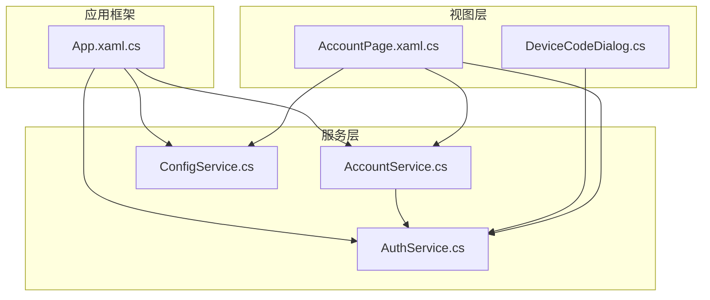
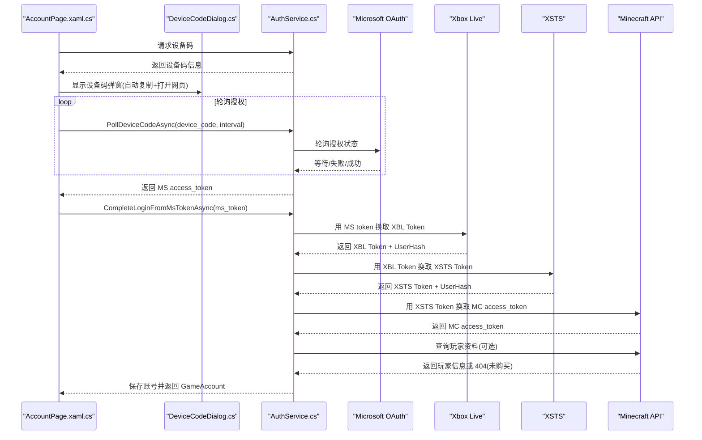
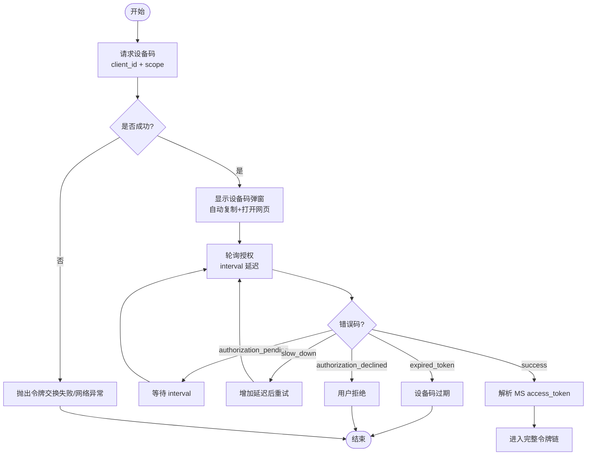
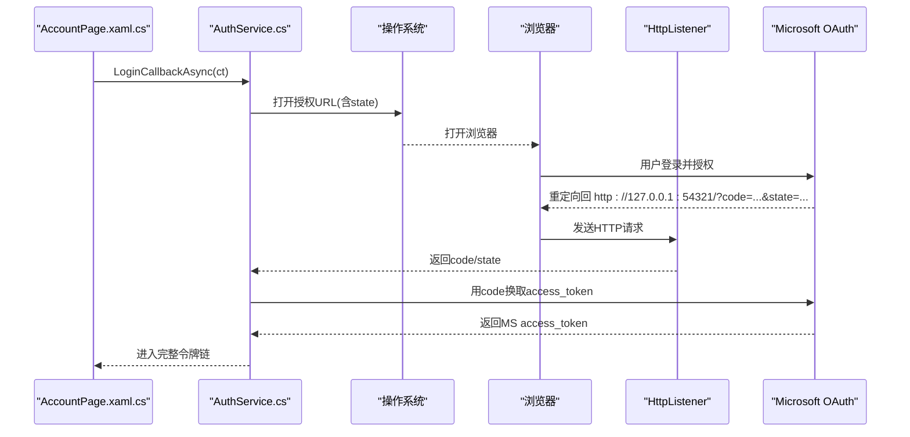
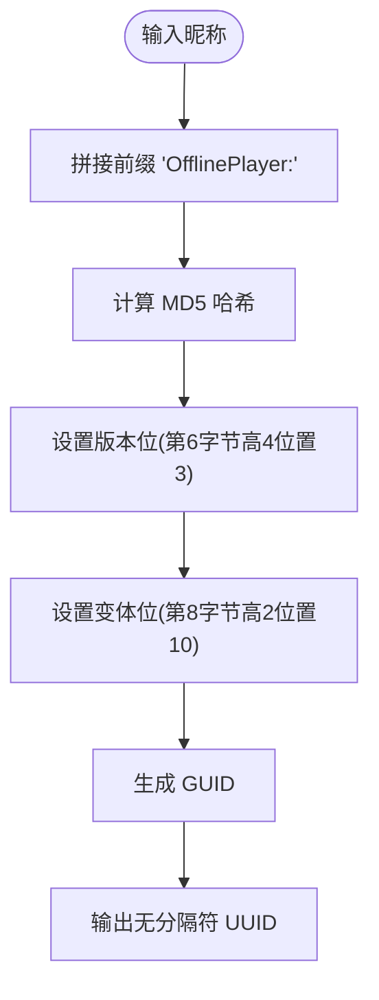
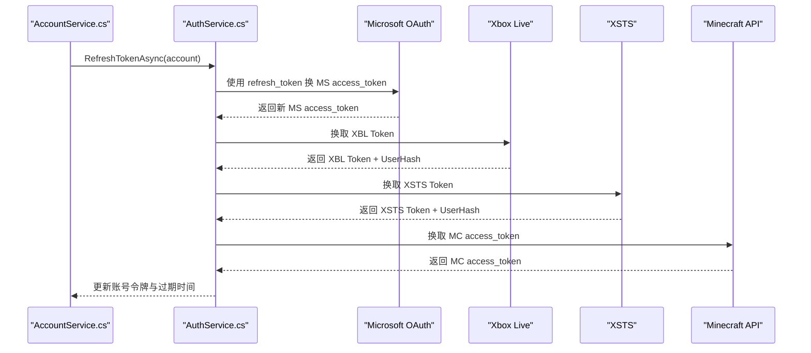
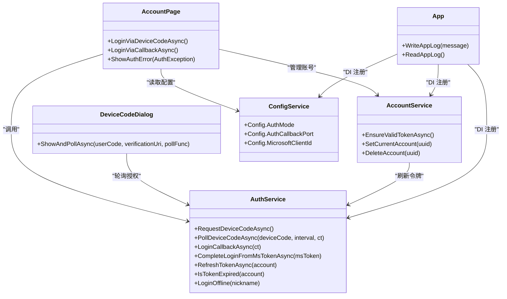

# 认证协议实现

<cite>
**本文引用的文件**   
- [AuthService.cs](file://src/FufuLauncher/Services/AuthService.cs)
- [AccountService.cs](file://src/FufuLauncher/Services/AccountService.cs)
- [DeviceCodeDialog.cs](file://src/FufuLauncher/Interaction/DeviceCodeDialog.cs)
- [AccountPage.xaml.cs](file://src/FufuLauncher/Views/AccountPage.xaml.cs)
- [ConfigService.cs](file://src/FufuLauncher/Services/ConfigService.cs)
- [App.xaml.cs](file://src/FufuLauncher/App.xaml.cs)
- [43381ea021e59839958af459800e4d11.json](file://Start/appmcGAME/accounts/43381ea021e59839958af459800e4d11.json)
</cite>

## 目录
1. [简介](#简介)
2. [项目结构](#项目结构)
3. [核心组件](#核心组件)
4. [架构总览](#架构总览)
5. [详细组件分析](#详细组件分析)
6. [依赖关系分析](#依赖关系分析)
7. [性能考虑](#性能考虑)
8. [故障排查指南](#故障排查指南)
9. [结论](#结论)
10. [附录：配置与示例](#附录配置与示例)

## 简介
本文件为“可爱的芙芙启动器”的认证协议实现提供系统化文档，覆盖以下要点：
- OAuth 2.0 设备码登录流程（设备码请求、轮询授权结果、用户交互）
- 本地回调登录模式（HttpListener 监听与重定向处理）
- 完整令牌链转换：MS access_token → Xbox Live(XBL) → XSTS → Minecraft access_token
- 离线账号 UUID 生成算法与安全性说明
- 错误处理策略（未购买 Minecraft、网络异常、用户取消等）
- 代码级示例路径与配置参数说明

## 项目结构
认证相关代码主要位于 Services、Interaction、Views 三个层次：
- Services：认证核心逻辑（AuthService）、账号管理（AccountService）、配置（ConfigService）
- Interaction：设备码登录弹窗交互（DeviceCodeDialog）
- Views：账户页面 UI 与登录入口（AccountPage.xaml.cs）
- App.xaml.cs：应用初始化、日志系统、服务注册



图表来源
- [AccountPage.xaml.cs:1-143](file://src/FufuLauncher/Views/AccountPage.xaml.cs#L1-L143)
- [DeviceCodeDialog.cs:1-204](file://src/FufuLauncher/Interaction/DeviceCodeDialog.cs#L1-L204)
- [AuthService.cs:1-683](file://src/FufuLauncher/Services/AuthService.cs#L1-L683)
- [AccountService.cs:1-54](file://src/FufuLauncher/Services/AccountService.cs#L1-L54)
- [ConfigService.cs:1-148](file://src/FufuLauncher/Services/ConfigService.cs#L1-L148)
- [App.xaml.cs:1-207](file://src/FufuLauncher/App.xaml.cs#L1-L207)

章节来源
- [AccountPage.xaml.cs:1-143](file://src/FufuLauncher/Views/AccountPage.xaml.cs#L1-L143)
- [AuthService.cs:1-683](file://src/FufuLauncher/Services/AuthService.cs#L1-L683)
- [ConfigService.cs:1-148](file://src/FufuLauncher/Services/ConfigService.cs#L1-L148)
- [App.xaml.cs:1-207](file://src/FufuLauncher/App.xaml.cs#L1-L207)

## 核心组件
- AuthService：封装微软 OAuth 设备码/本地回调登录、XBL/XSTS/MC 令牌链、离线账号 UUID 生成、令牌刷新与持久化。
- AccountService：多账号列表、切换、删除、当前账号校验与自动刷新。
- DeviceCodeDialog：设备码弹窗，自动复制验证码、一键打开网页、后台轮询授权结果。
- ConfigService：配置项（AuthMode、AuthCallbackPort、ClientId 等）。
- App.xaml.cs：全局日志写入、服务注入、异常捕获。

章节来源
- [AuthService.cs:1-683](file://src/FufuLauncher/Services/AuthService.cs#L1-L683)
- [AccountService.cs:1-54](file://src/FufuLauncher/Services/AccountService.cs#L1-L54)
- [DeviceCodeDialog.cs:1-204](file://src/FufuLauncher/Interaction/DeviceCodeDialog.cs#L1-L204)
- [ConfigService.cs:1-148](file://src/FufuLauncher/Services/ConfigService.cs#L1-L148)
- [App.xaml.cs:1-207](file://src/FufuLauncher/App.xaml.cs#L1-L207)

## 架构总览
整体认证流程分为两条路径：设备码登录（默认）和本地回调登录（备选），最终都汇聚到“完整令牌链”并落地账号信息。



图表来源
- [AccountPage.xaml.cs:57-72](file://src/FufuLauncher/Views/AccountPage.xaml.cs#L57-L72)
- [DeviceCodeDialog.cs:26-202](file://src/FufuLauncher/Interaction/DeviceCodeDialog.cs#L26-L202)
- [AuthService.cs:159-398](file://src/FufuLauncher/Services/AuthService.cs#L159-L398)

## 详细组件分析

### OAuth 2.0 设备码登录流程
- 设备码请求：调用 Microsoft 设备码端点，返回 user_code、verification_uri、expires_in、interval 等。
- 轮询授权：按 interval 周期性轮询 token 端点，处理 authorization_pending/slow_down/expired_token/authorization_declined 等响应。
- 用户交互：弹窗展示验证码，自动复制到剪贴板，一键打开验证链接；支持取消操作。
- 成功后获取 MS access_token，进入完整令牌链。



图表来源
- [AuthService.cs:159-265](file://src/FufuLauncher/Services/AuthService.cs#L159-L265)
- [DeviceCodeDialog.cs:26-202](file://src/FufuLauncher/Interaction/DeviceCodeDialog.cs#L26-L202)

章节来源
- [AuthService.cs:159-265](file://src/FufuLauncher/Services/AuthService.cs#L159-L265)
- [DeviceCodeDialog.cs:26-202](file://src/FufuLauncher/Interaction/DeviceCodeDialog.cs#L26-L202)

### 本地回调登录模式（HttpListener）
- 使用 HttpListener 监听 http://127.0.0.1:54321/，构造授权 URL 并打开浏览器。
- 等待重定向，提取 code 和 state，校验 state 一致性。
- 将 code 交换为 MS access_token，随后进入完整令牌链。
- 若端口占用或无法打开浏览器，抛出明确异常提示。



图表来源
- [AuthService.cs:269-338](file://src/FufuLauncher/Services/AuthService.cs#L269-L338)
- [AccountPage.xaml.cs:67-72](file://src/FufuLauncher/Views/AccountPage.xaml.cs#L67-L72)

章节来源
- [AuthService.cs:269-338](file://src/FufuLauncher/Services/AuthService.cs#L269-L338)
- [AccountPage.xaml.cs:67-72](file://src/FufuLauncher/Views/AccountPage.xaml.cs#L67-L72)

### 完整令牌链转换（MS → XBL → XSTS → MC）
- XBL 认证：以 MS access_token 作为 RPS Ticket，换取 XBL Token 与 UserHash。
- XSTS 认证：携带 XBL Token 与 RP 标识，换取 XSTS Token 与 UserHash。
- Minecraft 认证：以 XSTS Token 与 UserHash 组合身份令牌，换取 MC access_token。
- 可选：查询玩家资料，区分未购买 Minecraft（404）与网络异常。

```mermaid
sequenceDiagram
participant Auth as "AuthService.cs"
participant XBL as "Xbox Live"
participant XSTS as "XSTS"
participant MC as "Minecraft API"
Auth->>XBL : 提交 MS access_token(RPS)
XBL-->>Auth : 返回 XBL Token + UserHash
Auth->>XSTS : 提交 XBL Token + RP
XSTS-->>Auth : 返回 XSTS Token + UserHash
Auth->>MC : 提交 identityToken = XBL3.0 x=UserHash;XSTS Token
MC-->>Auth : 返回 MC access_token
Auth->>MC : 查询玩家资料(可选)
MC-->>Auth : 返回玩家信息或 404(未购买)
```

图表来源
- [AuthService.cs:504-606](file://src/FufuLauncher/Services/AuthService.cs#L504-L606)
- [AuthService.cs:608-643](file://src/FufuLauncher/Services/AuthService.cs#L608-L643)

章节来源
- [AuthService.cs:504-606](file://src/FufuLauncher/Services/AuthService.cs#L504-L606)
- [AuthService.cs:608-643](file://src/FufuLauncher/Services/AuthService.cs#L608-L643)

### 离线账号 UUID 生成算法与安全性
- 算法：基于字符串 "OfflinePlayer:" + nickname 计算 MD5，设置版本位与变体位，生成 v3 风格的 UUID。
- 安全性：MD5 用于确定性生成，非加密用途；离线 UUID 仅用于本地离线模式，不对外暴露敏感信息。
- 存储：离线账号的 AccessToken 字段复用 UUID，便于离线场景下统一处理。



图表来源
- [AuthService.cs:477-486](file://src/FufuLauncher/Services/AuthService.cs#L477-L486)

章节来源
- [AuthService.cs:477-486](file://src/FufuLauncher/Services/AuthService.cs#L477-L486)

### 令牌刷新机制
- 使用 refresh_token 向 Microsoft 换取新的 MS access_token。
- 刷新成功后，完整重走 XBL→XSTS→MC 令牌链，更新 MC access_token 与过期时间。
- 在启动游戏前通过 AccountService.EnsureValidTokenAsync 自动检测并刷新。



图表来源
- [AuthService.cs:420-468](file://src/FufuLauncher/Services/AuthService.cs#L420-L468)
- [AccountService.cs:42-52](file://src/FufuLauncher/Services/AccountService.cs#L42-L52)

章节来源
- [AuthService.cs:420-468](file://src/FufuLauncher/Services/AuthService.cs#L420-L468)
- [AccountService.cs:42-52](file://src/FufuLauncher/Services/AccountService.cs#L42-L52)

### 错误处理策略
- 错误类型枚举：Network（网络异常）、NotOwnedMinecraft（未购买 Minecraft）、Cancelled（用户取消）、DeviceCodeExpired（设备码过期）、TokenExchangeFailed（令牌交换失败）、Unknown（未知错误）。
- 各阶段抛出自定义 AuthException，UI 层根据 Error 类型显示不同提示。
- 常见场景：
  - 设备码轮询中遇到 authorization_pending/slow_down：继续等待或增加延迟。
  - expired_token：提示重新登录。
  - authorization_declined：用户拒绝授权。
  - 玩家资料 404：未购买 Minecraft。
  - HttpRequestException：网络异常。

章节来源
- [AuthService.cs:32-48](file://src/FufuLauncher/Services/AuthService.cs#L32-L48)
- [AuthService.cs:159-265](file://src/FufuLauncher/Services/AuthService.cs#L159-L265)
- [AuthService.cs:608-643](file://src/FufuLauncher/Services/AuthService.cs#L608-L643)
- [AccountPage.xaml.cs:75-103](file://src/FufuLauncher/Views/AccountPage.xaml.cs#L75-L103)

## 依赖关系分析
- AccountPage 依赖 AuthService、AccountService、ConfigService 完成登录与账号管理。
- DeviceCodeDialog 依赖 AuthService 进行轮询授权。
- AccountService 依赖 AuthService 执行令牌刷新与账号持久化。
- App.xaml.cs 负责 DI 容器注册与全局日志、异常处理。



图表来源
- [AccountPage.xaml.cs:1-143](file://src/FufuLauncher/Views/AccountPage.xaml.cs#L1-L143)
- [DeviceCodeDialog.cs:1-204](file://src/FufuLauncher/Interaction/DeviceCodeDialog.cs#L1-L204)
- [AuthService.cs:1-683](file://src/FufuLauncher/Services/AuthService.cs#L1-L683)
- [AccountService.cs:1-54](file://src/FufuLauncher/Services/AccountService.cs#L1-L54)
- [ConfigService.cs:1-148](file://src/FufuLauncher/Services/ConfigService.cs#L1-L148)
- [App.xaml.cs:1-207](file://src/FufuLauncher/App.xaml.cs#L1-L207)

章节来源
- [AccountPage.xaml.cs:1-143](file://src/FufuLauncher/Views/AccountPage.xaml.cs#L1-L143)
- [AuthService.cs:1-683](file://src/FufuLauncher/Services/AuthService.cs#L1-L683)
- [AccountService.cs:1-54](file://src/FufuLauncher/Services/AccountService.cs#L1-L54)
- [ConfigService.cs:1-148](file://src/FufuLauncher/Services/ConfigService.cs#L1-L148)
- [App.xaml.cs:1-207](file://src/FufuLauncher/App.xaml.cs#L1-L207)

## 性能考虑
- HttpClient 统一设置 User-Agent 与 Accept 头，避免部分服务端因缺少 UA 返回 401/403。
- 设备码轮询采用指数退避（slow_down）与超时控制，减少无效请求。
- 日志批量写入：后台 Timer 定期落盘，降低 IO 阻塞。
- 令牌刷新前置检查：仅在必要时触发完整令牌链，避免频繁网络请求。

章节来源
- [AuthService.cs:94-100](file://src/FufuLauncher/Services/AuthService.cs#L94-L100)
- [AuthService.cs:198-265](file://src/FufuLauncher/Services/AuthService.cs#L198-L265)
- [App.xaml.cs:33-73](file://src/FufuLauncher/App.xaml.cs#L33-L73)

## 故障排查指南
- 未购买 Minecraft：玩家资料接口返回 404，提示前往商店购买。
- 网络异常：HttpRequestException 捕获并记录日志，建议检查网络与代理。
- 用户取消：弹窗关闭或轮询被取消，提示“登录取消”。
- 设备码过期：轮询超时或收到 expired_token，提示重新登录。
- 令牌交换失败：任一环节（MS/XBL/XSTS/MC）失败，查看应用日志定位具体步骤。
- 本地回调端口占用：HttpListener 启动失败，提示更换端口或切换到设备码模式。

章节来源
- [AuthService.cs:608-643](file://src/FufuLauncher/Services/AuthService.cs#L608-L643)
- [AuthService.cs:269-338](file://src/FufuLauncher/Services/AuthService.cs#L269-L338)
- [AccountPage.xaml.cs:75-103](file://src/FufuLauncher/Views/AccountPage.xaml.cs#L75-L103)

## 结论
该认证协议实现以清晰的模块化设计覆盖了设备码与本地回调两种登录方式，并通过完整的令牌链确保 Minecraft 在线登录。错误处理细致、用户体验友好，离线账号 UUID 生成遵循标准规范。建议在发布前确认 ClientId 与回调端口配置一致，并在生产环境启用更严格的日志审计与监控。

## 附录：配置与示例
- 配置项（AuthMode、AuthCallbackPort、MicrosoftClientId）
  - 默认设备码登录，回调端口 54321，ClientID 可配置。
- 账号文件示例（离线账号）
  - Type、Username、Uuid、AccessToken、MicrosoftRefreshToken、TokenExpiresAt、AddedAt。

章节来源
- [ConfigService.cs:37-44](file://src/FufuLauncher/Services/ConfigService.cs#L37-L44)
- [43381ea021e59839958af459800e4d11.json:1-9](file://Start/appmcGAME/accounts/43381ea021e59839958af459800e4d11.json#L1-L9)