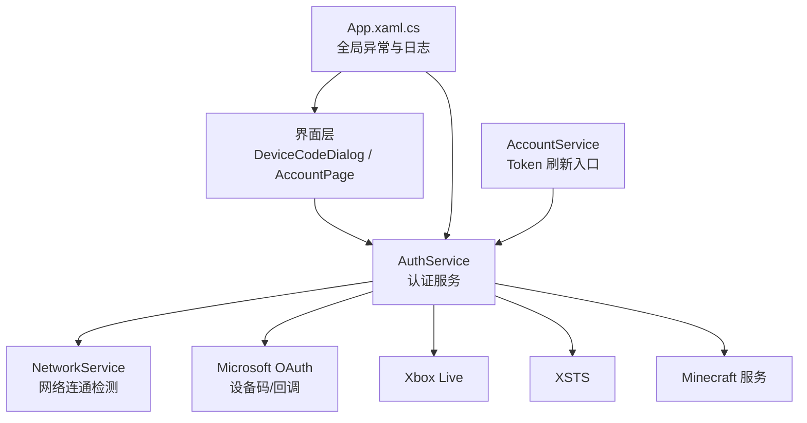
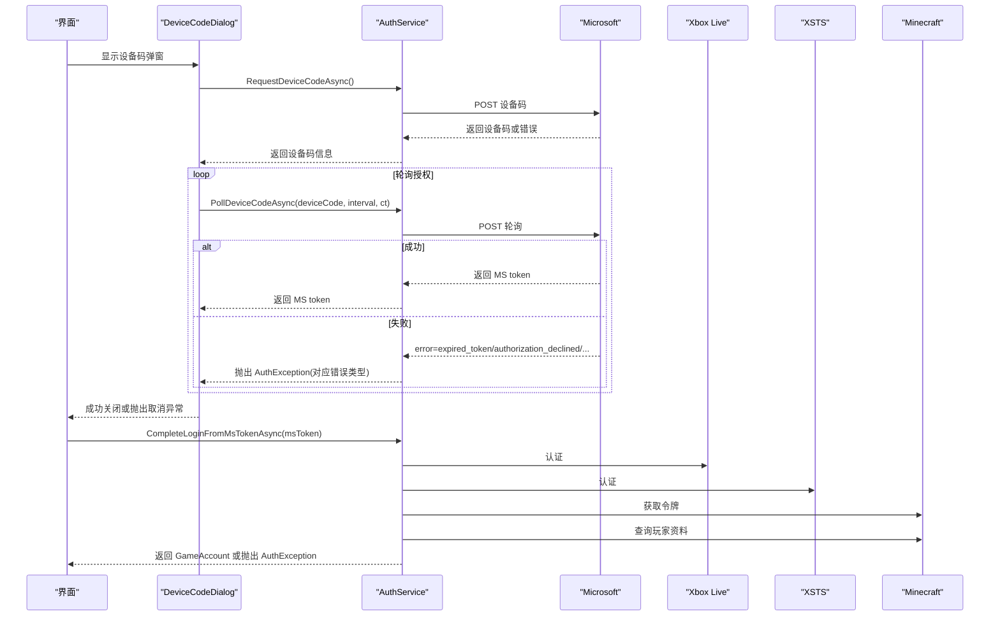
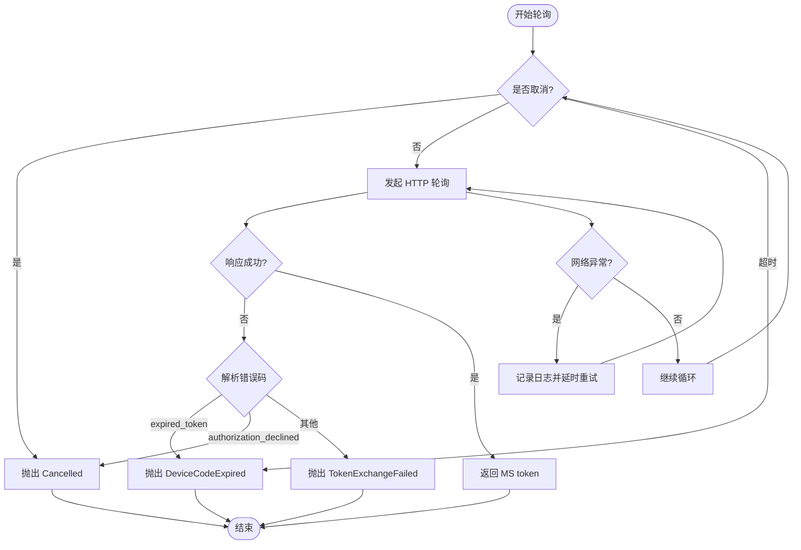
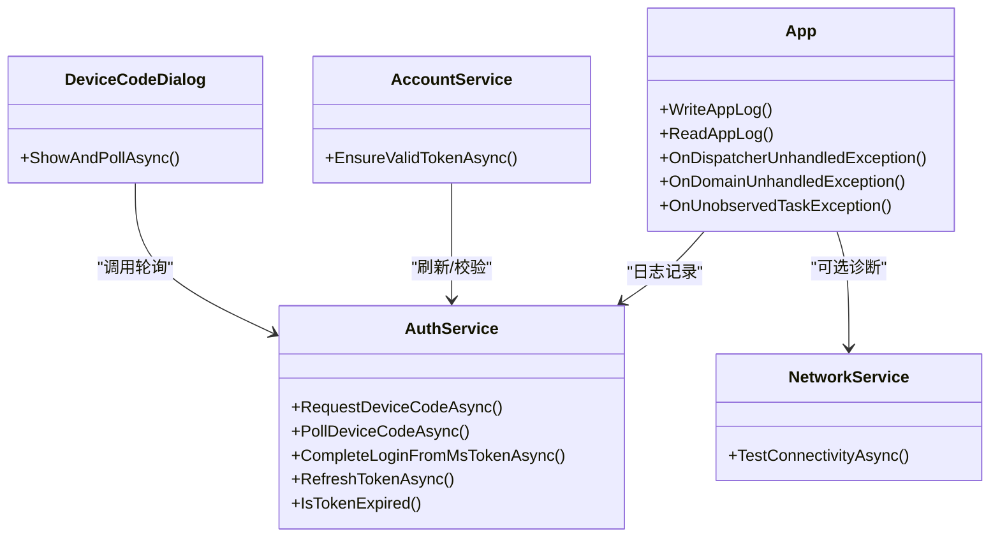

# 错误处理策略

<cite>
**本文引用的文件**   
- [AuthService.cs](file://src/FufuLauncher/Services/AuthService.cs)
- [DeviceCodeDialog.cs](file://src/FufuLauncher/Interaction/DeviceCodeDialog.cs)
- [App.xaml.cs](file://src/FufuLauncher/App.xaml.cs)
- [NetworkService.cs](file://src/FufuLauncher/Services/NetworkService.cs)
- [AccountService.cs](file://src/FufuLauncher/Services/AccountService.cs)
</cite>

## 目录
1. [简介](#简介)
2. [项目结构](#项目结构)
3. [核心组件](#核心组件)
4. [架构总览](#架构总览)
5. [详细组件分析](#详细组件分析)
6. [依赖关系分析](#依赖关系分析)
7. [性能与可靠性](#性能与可靠性)
8. [故障排查指南](#故障排查指南)
9. [结论](#结论)
10. [附录：错误类型与用户提示速查](#附录错误类型与用户提示速查)

## 简介
本文件聚焦认证系统的错误处理策略，围绕 AuthError 枚举、AuthException 异常类以及登录链路中的网络重试、超时、日志记录与用户提示进行系统化说明。目标是帮助开发者与维护者快速定位问题、统一错误语义、完善用户体验，并给出常见错误的诊断与解决方案。

## 项目结构
与认证错误处理直接相关的代码主要位于以下位置：
- 服务层：AuthService（认证流程、令牌链、错误分类）、NetworkService（网络连通性检测）
- 交互层：DeviceCodeDialog（设备码弹窗、取消行为）
- 应用层：App.xaml.cs（全局异常捕获、日志写入）
- 账号管理：AccountService（Token 过期检查与刷新）

图表来源
- [AuthService.cs:76-121](file://src/FufuLauncher/Services/AuthService.cs#L76-L121)
- [DeviceCodeDialog.cs:20-30](file://src/FufuLauncher/Interaction/DeviceCodeDialog.cs#L20-L30)
- [App.xaml.cs:131-178](file://src/FufuLauncher/App.xaml.cs#L131-L178)
- [NetworkService.cs:18-34](file://src/FufuLauncher/Services/NetworkService.cs#L18-L34)
- [AccountService.cs:22-52](file://src/FufuLauncher/Services/AccountService.cs#L22-L52)

章节来源
- [AuthService.cs:1-121](file://src/FufuLauncher/Services/AuthService.cs#L1-L121)
- [App.xaml.cs:1-117](file://src/FufuLauncher/App.xaml.cs#L1-L117)

## 核心组件
- AuthError 枚举：定义认证相关错误类型，便于上层区分处理与提示。
- AuthException 异常：携带具体错误类型与消息，贯穿认证链路。
- AuthService：实现微软设备码/本地回调登录、XBL→XSTS→MC 令牌链、离线账号、Token 刷新与资料查询。
- DeviceCodeDialog：设备码弹窗，支持自动复制验证码、打开浏览器、轮询授权结果与用户取消。
- NetworkService：网络连通性检测，辅助判断网络环境。
- App.xaml.cs：集中式日志写入与全局未处理异常捕获。
- AccountService：在启动游戏前校验 Token 是否过期并触发刷新。

章节来源
- [AuthService.cs:31-48](file://src/FufuLauncher/Services/AuthService.cs#L31-L48)
- [AuthService.cs:76-121](file://src/FufuLauncher/Services/AuthService.cs#L76-L121)
- [DeviceCodeDialog.cs:20-30](file://src/FufuLauncher/Interaction/DeviceCodeDialog.cs#L20-L30)
- [NetworkService.cs:18-34](file://src/FufuLauncher/Services/NetworkService.cs#L18-L34)
- [App.xaml.cs:38-73](file://src/FufuLauncher/App.xaml.cs#L38-L73)
- [AccountService.cs:42-52](file://src/FufuLauncher/Services/AccountService.cs#L42-L52)

## 架构总览
认证流程的错误处理贯穿“请求设备码 → 轮询授权 → 获取 MS token → XBL → XSTS → Minecraft token → 玩家资料”的完整链路。各阶段均通过 AuthException + AuthError 明确错误语义，并在关键路径上记录日志、提供用户提示。

图表来源
- [AuthService.cs:159-265](file://src/FufuLauncher/Services/AuthService.cs#L159-L265)
- [AuthService.cs:342-398](file://src/FufuLauncher/Services/AuthService.cs#L342-L398)
- [DeviceCodeDialog.cs:26-30](file://src/FufuLauncher/Interaction/DeviceCodeDialog.cs#L26-L30)

## 详细组件分析

### AuthError 枚举与含义
- Network：网络异常（如连接失败、超时、DNS 解析失败等）。
- NotOwnedMinecraft：该微软账号未购买 Minecraft Java 版（查询玩家资料返回 404）。
- Cancelled：用户主动取消（关闭窗口、点击取消按钮、操作被中断）。
- DeviceCodeExpired：设备码已过期或等待超时。
- TokenExchangeFailed：令牌交换失败（MS/XBL/XSTS/MC 任一环节响应异常或解析失败）。
- Unknown：未知错误（兜底分类）。

章节来源
- [AuthService.cs:31-40](file://src/FufuLauncher/Services/AuthService.cs#L31-L40)

### AuthException 设计与使用
- 设计要点：继承自 Exception，包含 Error（AuthError）与 Message；支持内层异常传递。
- 使用方式：在认证各阶段抛出自定义异常，上层根据 Error 类型决定提示与后续动作（重试、回退、引导购买等）。

章节来源
- [AuthService.cs:42-48](file://src/FufuLauncher/Services/AuthService.cs#L42-L48)

### 设备码登录与轮询（含取消与过期）
- 请求设备码：失败时按网络异常或未知错误分类抛出。
- 轮询授权：
  - authorization_pending/slow_down：继续延迟轮询。
  - expired_token：抛出 DeviceCodeExpired。
  - authorization_declined：抛出 Cancelled。
  - 其他错误：抛出 TokenExchangeFailed。
  - 网络异常：记录日志后延时重试，避免瞬时抖动导致失败。
  - 超时：超过截止时间抛出 DeviceCodeExpired。
- 用户取消：通过 CancellationToken 触发 OperationCanceledException，最终转换为 Cancelled。

图表来源
- [AuthService.cs:198-265](file://src/FufuLauncher/Services/AuthService.cs#L198-L265)
- [DeviceCodeDialog.cs:157-201](file://src/FufuLauncher/Interaction/DeviceCodeDialog.cs#L157-L201)

章节来源
- [AuthService.cs:159-265](file://src/FufuLauncher/Services/AuthService.cs#L159-L265)
- [DeviceCodeDialog.cs:26-30](file://src/FufuLauncher/Interaction/DeviceCodeDialog.cs#L26-L30)

### 本地回调登录（备选模式）
- 监听本地端口失败：抛出 Unknown（提示端口占用或切换设备码模式）。
- 打开浏览器失败：抛出 Unknown。
- 用户取消：抛出 Cancelled。
- 授权码换取令牌失败：抛出 TokenExchangeFailed。

章节来源
- [AuthService.cs:269-338](file://src/FufuLauncher/Services/AuthService.cs#L269-L338)

### 完整令牌链（XBL→XSTS→MC→Profile）
- XBL 认证失败：抛出 TokenExchangeFailed。
- XSTS 令牌获取失败：抛出 TokenExchangeFailed。
- Minecraft 令牌获取失败：抛出 TokenExchangeFailed。
- 玩家资料查询：
  - 404：抛出 NotOwnedMinecraft（未购买 Minecraft）。
  - 非成功状态：记录日志并返回 null（上层可回退 UUID）。
  - 网络异常：抛出 Network。

章节来源
- [AuthService.cs:342-398](file://src/FufuLauncher/Services/AuthService.cs#L342-L398)
- [AuthService.cs:608-643](file://src/FufuLauncher/Services/AuthService.cs#L608-L643)

### 离线账号
- 生成确定性离线 UUID（基于昵称），保存为离线账号。
- 不涉及网络与外部服务，无认证错误。

章节来源
- [AuthService.cs:402-416](file://src/FufuLauncher/Services/AuthService.cs#L402-L416)

### Token 刷新机制
- 仅在 Microsoft 账号且存在 refresh_token 时尝试刷新。
- 刷新成功后完整重走 XBL→XSTS→MC 令牌链，更新持久化数据。
- 刷新失败：记录日志并返回 false（上层可提示重新登录）。

章节来源
- [AuthService.cs:420-468](file://src/FufuLauncher/Services/AuthService.cs#L420-L468)
- [AccountService.cs:42-52](file://src/FufuLauncher/Services/AccountService.cs#L42-L52)

## 依赖关系分析
- AuthService 依赖 HttpClient（设置 User-Agent/Accept/Timeout），用于所有外部服务调用。
- DeviceCodeDialog 依赖 AuthService 的轮询方法，并通过 CancellationToken 支持取消。
- App.xaml.cs 提供统一的日志写入与全局异常捕获，确保崩溃与未观察异常可追溯。
- NetworkService 独立于认证流程，用于网络连通性检测，辅助诊断。
- AccountService 作为上层入口，在启动游戏前检查 Token 有效期并触发刷新。

图表来源
- [AuthService.cs:76-121](file://src/FufuLauncher/Services/AuthService.cs#L76-L121)
- [DeviceCodeDialog.cs:20-30](file://src/FufuLauncher/Interaction/DeviceCodeDialog.cs#L20-L30)
- [App.xaml.cs:38-73](file://src/FufuLauncher/App.xaml.cs#L38-L73)
- [NetworkService.cs:18-34](file://src/FufuLauncher/Services/NetworkService.cs#L18-L34)
- [AccountService.cs:22-52](file://src/FufuLauncher/Services/AccountService.cs#L22-L52)

章节来源
- [AuthService.cs:76-121](file://src/FufuLauncher/Services/AuthService.cs#L76-L121)
- [App.xaml.cs:131-178](file://src/FufuLauncher/App.xaml.cs#L131-L178)

## 性能与可靠性
- 网络超时：HttpClient 默认超时 30 秒，轮询中针对 slow_down 动态增加延迟，避免频繁请求。
- 重试策略：网络异常时记录日志并延时重试，提升瞬时抖动下的成功率。
- 日志缓冲：采用并发队列与定时器批量落盘，降低高频 IO 对主线程的影响。
- 资源释放：HttpListener 与进程启动均做异常容错，避免阻塞或泄漏。
- 令牌刷新：在 Token 即将过期前自动刷新，减少用户感知到的中断。

章节来源
- [AuthService.cs:94-100](file://src/FufuLauncher/Services/AuthService.cs#L94-L100)
- [AuthService.cs:229-265](file://src/FufuLauncher/Services/AuthService.cs#L229-L265)
- [App.xaml.cs:34-60](file://src/FufuLauncher/App.xaml.cs#L34-L60)

## 故障排查指南
- 网络异常（Network）
  - 现象：请求设备码/轮询/资料查询失败，抛出 Network。
  - 排查：运行网络连通性检测，确认官方源与镜像源可用性；检查代理/防火墙设置。
  - 建议：在网络不稳定环境下适当增大轮询间隔与重试次数。
- 未购买 Minecraft（NotOwnedMinecraft）
  - 现象：查询玩家资料返回 404，抛出 NotOwnedMinecraft。
  - 处理：提示用户前往微软商店/Minecraft.net 购买后重试。
- 用户取消（Cancelled）
  - 现象：关闭弹窗、点击取消、浏览器未授权。
  - 处理：静默退出登录流程，不视为错误。
- 设备码过期（DeviceCodeExpired）
  - 现象：设备码等待超时或服务端返回 expired_token。
  - 处理：提示用户重新发起设备码登录。
- 令牌交换失败（TokenExchangeFailed）
  - 现象：MS/XBL/XSTS/MC 任一环节失败或响应解析失败。
  - 处理：查看应用日志（app.log），关注具体端点与响应片段；必要时切换登录模式（设备码/本地回调）。
- 日志与调试
  - 日志位置：应用数据目录 appmcGAME/app.log。
  - 读取方式：通过应用提供的日志查看器或手动打开文件。
  - 关键日志：登录链路开始/完成、各端点失败详情、刷新令牌结果。

章节来源
- [AuthService.cs:159-265](file://src/FufuLauncher/Services/AuthService.cs#L159-L265)
- [AuthService.cs:342-398](file://src/FufuLauncher/Services/AuthService.cs#L342-L398)
- [AuthService.cs:608-643](file://src/FufuLauncher/Services/AuthService.cs#L608-L643)
- [App.xaml.cs:38-73](file://src/FufuLauncher/App.xaml.cs#L38-L73)
- [NetworkService.cs:34-76](file://src/FufuLauncher/Services/NetworkService.cs#L34-L76)

## 结论
本错误处理策略通过明确的错误分类（AuthError）、统一的异常封装（AuthException）、完善的重试与超时控制、以及集中的日志与全局异常捕获，构建了稳定可靠的认证体验。上层可根据错误类型提供精准的用户提示与引导，同时借助日志与网络诊断工具快速定位问题。建议在后续迭代中持续优化轮询策略、增强错误信息的可读性，并扩展更多诊断指标以提升排障效率。

## 附录：错误类型与用户提示速查
- Network：提示“网络连接异常，请检查网络设置”，并提供网络连通性检测结果。
- NotOwnedMinecraft：提示“该微软账号未购买 Minecraft Java 版，请先购买后重试”。
- Cancelled：提示“已取消登录”，无需报错。
- DeviceCodeExpired：提示“设备码已过期，请重新登录”。
- TokenExchangeFailed：提示“令牌交换失败，请查看应用日志并稍后重试”，并引导至日志位置。

章节来源
- [AuthService.cs:31-40](file://src/FufuLauncher/Services/AuthService.cs#L31-L40)
- [AuthService.cs:608-643](file://src/FufuLauncher/Services/AuthService.cs#L608-L643)
- [App.xaml.cs:38-73](file://src/FufuLauncher/App.xaml.cs#L38-L73)