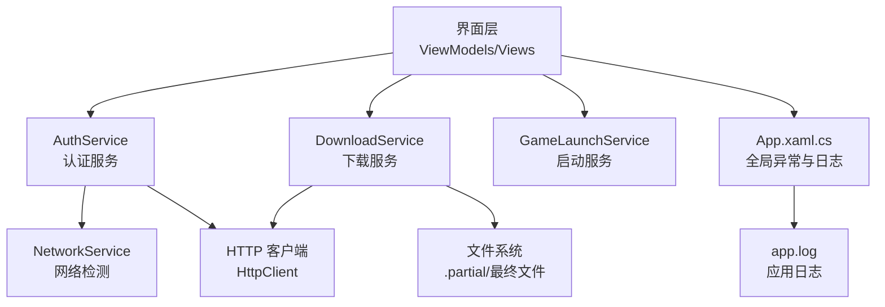
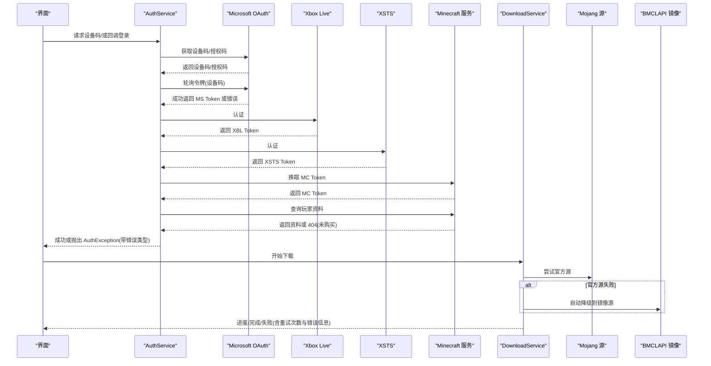
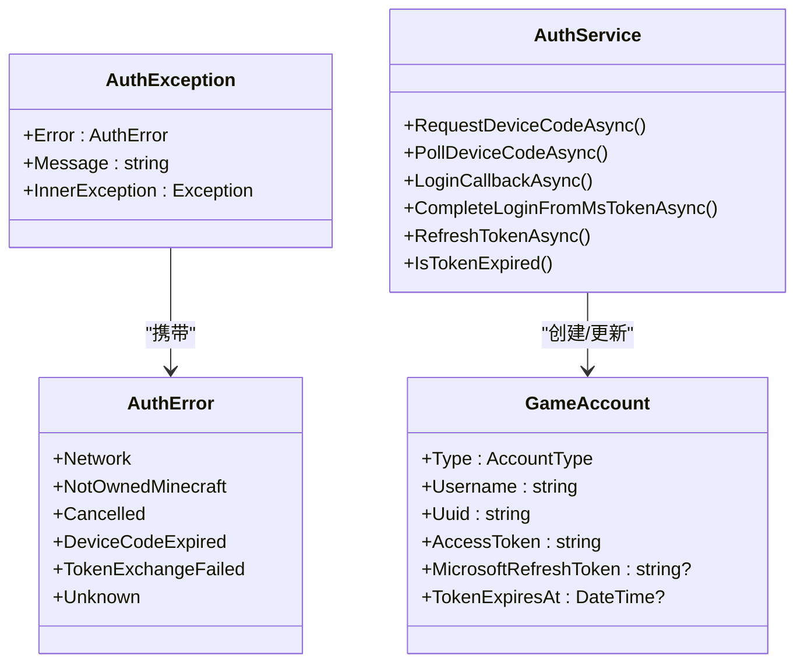
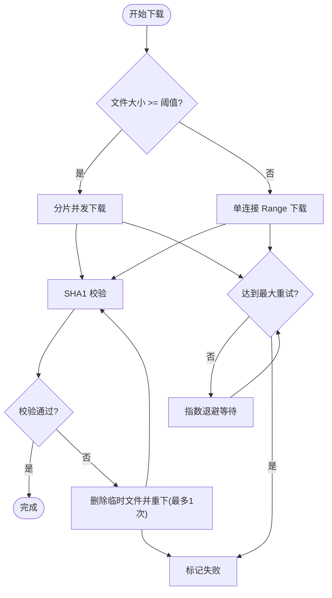
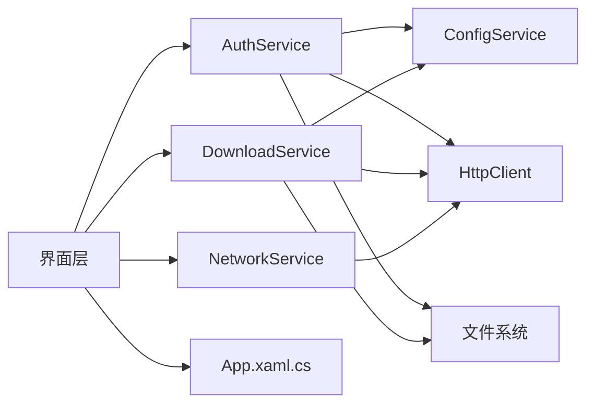

# 错误处理策略

<cite>
**本文引用的文件**   
- [AuthService.cs](file://src/FufuLauncher/Services/AuthService.cs)
- [DownloadService.cs](file://src/FufuLauncher/Services/DownloadService.cs)
- [NetworkService.cs](file://src/FufuLauncher/Services/NetworkService.cs)
- [App.xaml.cs](file://src/FufuLauncher/App.xaml.cs)
- [GameLaunchService.cs](file://src/FufuLauncher/Services/GameLaunchService.cs)
</cite>

## 目录
1. [简介](#简介)
2. [项目结构](#项目结构)
3. [核心组件](#核心组件)
4. [架构总览](#架构总览)
5. [详细组件分析](#详细组件分析)
6. [依赖关系分析](#依赖关系分析)
7. [性能与健壮性](#性能与健壮性)
8. [故障排查指南](#故障排查指南)
9. [结论](#结论)

## 简介
本文件面向“可爱的芙芙启动器”的错误处理策略，聚焦以下目标：
- 解释 AuthException 的设计与使用，包括错误类型枚举与异常层次结构。
- 梳理从网络层到业务层的错误分类与处理方式。
- 说明用户友好的错误提示生成机制（含本地化显示思路）。
- 记录错误日志的记录与分析方法，帮助快速定位问题。
- 阐述重试机制与降级方案，确保系统健壮性。
- 提供常见错误的诊断与解决方案。

## 项目结构
围绕错误处理的关键代码集中在 Services 层与 App 入口中：
- AuthService：认证链路、令牌交换、设备码登录、回调登录、离线账号、令牌刷新；集中抛出 AuthException。
- DownloadService：下载引擎，包含断点续传、分片并发、指数退避重试、SHA1 校验失败重下、镜像源自动降级。
- NetworkService：连通性检测，辅助判断官方源与镜像源可用性。
- App.xaml.cs：全局未处理异常捕获、应用日志缓冲写入与读取。
- GameLaunchService：游戏启动流程中的错误返回与用户提示。

图表来源
- [AuthService.cs:150-265](file://src/FufuLauncher/Services/AuthService.cs#L150-L265)
- [DownloadService.cs:295-366](file://src/FufuLauncher/Services/DownloadService.cs#L295-L366)
- [NetworkService.cs:34-76](file://src/FufuLauncher/Services/NetworkService.cs#L34-L76)
- [App.xaml.cs:75-129](file://src/FufuLauncher/App.xaml.cs#L75-L129)

章节来源
- [AuthService.cs:1-683](file://src/FufuLauncher/Services/AuthService.cs#L1-L683)
- [DownloadService.cs:1-592](file://src/FufuLauncher/Services/DownloadService.cs#L1-L592)
- [NetworkService.cs:1-95](file://src/FufuLauncher/Services/NetworkService.cs#L1-L95)
- [App.xaml.cs:1-207](file://src/FufuLauncher/App.xaml.cs#L1-L207)
- [GameLaunchService.cs:1-200](file://src/FufuLauncher/Services/GameLaunchService.cs#L1-L200)

## 核心组件
- 异常与错误类型
  - AuthError：定义认证阶段可区分的错误类别（网络、未购买 MC、取消、设备码过期、令牌交换失败、未知）。
  - AuthException：继承自 Exception，携带 AuthError，便于上层按类型区分处理与提示。
- 认证服务
  - 设备码登录与轮询、本地回调登录、完整令牌链（MS→XBL→XSTS→MC）、离线账号、令牌刷新。
  - 所有网络与解析异常统一包装为 AuthException，并附带可读消息。
- 下载服务
  - 指数退避重试、SHA1 校验失败重下、镜像源自动降级（Mojang→BMCLAPI）、断点续传与分片并发。
- 网络检测
  - 探测 Mojang 官方源与 BMCLAPI 镜像源连通性与延迟，用于前端提示与策略选择。
- 应用级异常与日志
  - 全局捕获 UI、域、Task 未处理异常，统一写 app.log 并弹窗提示。

章节来源
- [AuthService.cs:31-48](file://src/FufuLauncher/Services/AuthService.cs#L31-L48)
- [AuthService.cs:158-265](file://src/FufuLauncher/Services/AuthService.cs#L158-L265)
- [DownloadService.cs:78-114](file://src/FufuLauncher/Services/DownloadService.cs#L78-L114)
- [DownloadService.cs:295-366](file://src/FufuLauncher/Services/DownloadService.cs#L295-L366)
- [NetworkService.cs:34-76](file://src/FufuLauncher/Services/NetworkService.cs#L34-L76)
- [App.xaml.cs:180-206](file://src/FufuLauncher/App.xaml.cs#L180-L206)

## 架构总览
下图展示认证与下载两条关键路径的错误处理与降级策略。

图表来源
- [AuthService.cs:158-265](file://src/FufuLauncher/Services/AuthService.cs#L158-L265)
- [AuthService.cs:342-398](file://src/FufuLauncher/Services/AuthService.cs#L342-L398)
- [AuthService.cs:608-643](file://src/FufuLauncher/Services/AuthService.cs#L608-L643)
- [DownloadService.cs:171-210](file://src/FufuLauncher/Services/DownloadService.cs#L171-L210)
- [DownloadService.cs:295-366](file://src/FufuLauncher/Services/DownloadService.cs#L295-L366)

## 详细组件分析

### 认证服务（AuthService）错误模型与流程
- 错误类型与异常层次
  - AuthError 枚举覆盖网络、未购买 MC、用户取消、设备码过期、令牌交换失败、未知等场景。
  - AuthException 封装错误类型与消息，支持内嵌异常，便于分层定位。
- 设备码登录与轮询
  - 请求设备码失败、响应解析失败、轮询超时、用户拒绝、网络异常均映射为具体 AuthError。
  - 网络瞬时错误会记录日志并重试，避免误报。
- 本地回调登录
  - 端口监听失败、浏览器打开失败、未收到有效授权码等，均抛出 AuthException。
- 完整令牌链
  - XBL/XSTS/MC 任一环节失败，记录详细日志并抛出令牌交换失败异常。
  - 玩家资料 404 表示未购买 MC，直接抛出对应错误类型。
- 令牌刷新
  - 刷新失败返回 false，不抛异常；内部记录日志，供上层决定是否提示重新登录。

图表来源
- [AuthService.cs:31-48](file://src/FufuLauncher/Services/AuthService.cs#L31-L48)
- [AuthService.cs:50-63](file://src/FufuLauncher/Services/AuthService.cs#L50-L63)
- [AuthService.cs:158-265](file://src/FufuLauncher/Services/AuthService.cs#L158-L265)
- [AuthService.cs:342-398](file://src/FufuLauncher/Services/AuthService.cs#L342-L398)
- [AuthService.cs:420-468](file://src/FufuLauncher/Services/AuthService.cs#L420-L468)

章节来源
- [AuthService.cs:31-48](file://src/FufuLauncher/Services/AuthService.cs#L31-L48)
- [AuthService.cs:158-265](file://src/FufuLauncher/Services/AuthService.cs#L158-L265)
- [AuthService.cs:342-398](file://src/FufuLauncher/Services/AuthService.cs#L342-L398)
- [AuthService.cs:608-643](file://src/FufuLauncher/Services/AuthService.cs#L608-L643)
- [AuthService.cs:420-468](file://src/FufuLauncher/Services/AuthService.cs#L420-L468)

### 下载服务（DownloadService）重试与降级
- 重试机制
  - 指数退避：第 1 次失败等待 1s，第 2 次 2s，第 3 次 4s，最多 MaxRetry 次。
  - SHA1 校验失败：删除临时文件后重下一次，仍失败则标记失败。
- 降级策略
  - GetSourceUrl(attempt)：首次按配置源；若 attempt>0 且配置为 Mojang，强制切换到 BMCLAPI 镜像。
  - ForceBmclUrl：对常见 Mojang 域名进行替换，保证国内可用。
- 断点续传与分片
  - 小文件单连接 Range，大文件多 Range 分片并发，.partial 临时文件持久化中断状态。
- 进度与事件
  - 单任务进度与全局总进度分离，节流上报，避免 UI 卡顿。

图表来源
- [DownloadService.cs:295-366](file://src/FufuLauncher/Services/DownloadService.cs#L295-L366)
- [DownloadService.cs:368-451](file://src/FufuLauncher/Services/DownloadService.cs#L368-L451)
- [DownloadService.cs:453-547](file://src/FufuLauncher/Services/DownloadService.cs#L453-L547)
- [DownloadService.cs:171-210](file://src/FufuLauncher/Services/DownloadService.cs#L171-L210)

章节来源
- [DownloadService.cs:295-366](file://src/FufuLauncher/Services/DownloadService.cs#L295-L366)
- [DownloadService.cs:171-210](file://src/FufuLauncher/Services/DownloadService.cs#L171-L210)

### 网络检测（NetworkService）
- 功能：并行探测 Mojang 官方源与 BMCLAPI 镜像源的连通性与延迟。
- 用途：为 UI 提示与后续下载策略提供依据（如优先镜像源）。

章节来源
- [NetworkService.cs:34-76](file://src/FufuLauncher/Services/NetworkService.cs#L34-L76)

### 应用级异常与日志（App.xaml.cs）
- 全局异常捕获：UI 线程、域、Task 未观察异常均被捕获，写入日志并弹窗提示。
- 日志缓冲：ConcurrentQueue + Timer 批量写入 app.log，降低 IO 开销。
- 读取接口：ReadAppLog 先强制刷新队列再读取，保证最新日志可见。

章节来源
- [App.xaml.cs:75-129](file://src/FufuLauncher/App.xaml.cs#L75-L129)
- [App.xaml.cs:180-206](file://src/FufuLauncher/App.xaml.cs#L180-L206)
- [App.xaml.cs:38-73](file://src/FufuLauncher/App.xaml.cs#L38-L73)

### 游戏启动（GameLaunchService）错误返回
- 启动失败时返回 LaunchResult，包含 Success 与 ErrorMessage，便于 UI 提示。
- 常见错误：实例不存在、账号令牌过期无法刷新等。

章节来源
- [GameLaunchService.cs:31-138](file://src/FufuLauncher/Services/GameLaunchService.cs#L31-L138)

## 依赖关系分析
- 低耦合高内聚
  - AuthService 仅依赖 ConfigService、HttpClient、文件系统；错误类型与消息集中管理。
  - DownloadService 独立于认证逻辑，专注下载与校验，通过 GetSourceUrl 实现源切换。
- 外部依赖
  - Microsoft OAuth、Xbox Live、XSTS、Minecraft 服务；Mojang/BMCLAPI 下载源。
- 潜在循环依赖
  - 当前各服务单向依赖，未见循环引用。

图表来源
- [AuthService.cs:106-121](file://src/FufuLauncher/Services/AuthService.cs#L106-L121)
- [DownloadService.cs:99-114](file://src/FufuLauncher/Services/DownloadService.cs#L99-L114)
- [NetworkService.cs:20-29](file://src/FufuLauncher/Services/NetworkService.cs#L20-L29)
- [App.xaml.cs:131-178](file://src/FufuLauncher/App.xaml.cs#L131-L178)

章节来源
- [AuthService.cs:106-121](file://src/FufuLauncher/Services/AuthService.cs#L106-L121)
- [DownloadService.cs:99-114](file://src/FufuLauncher/Services/DownloadService.cs#L99-L114)
- [NetworkService.cs:20-29](file://src/FufuLauncher/Services/NetworkService.cs#L20-L29)
- [App.xaml.cs:131-178](file://src/FufuLauncher/App.xaml.cs#L131-L178)

## 性能与健壮性
- 认证链路
  - 设备码轮询采用指数退避式延时，避免频繁请求；网络异常短时重试，提升成功率。
  - 令牌刷新失败不抛异常，避免阻断主流程，由上层决定提示。
- 下载引擎
  - 分片并发与断点续传显著提升吞吐与容错；指数退避与 SHA1 校验保障数据完整性。
  - 镜像源自动降级，缓解官方源不稳定问题。
- 日志与监控
  - 应用日志批量写入，减少 IO 阻塞；全局异常捕获防止进程崩溃。
- 建议优化
  - 将错误类型与提示文案抽离至资源文件，支持多语言本地化。
  - 为关键网络调用增加超时与熔断策略，避免雪崩。
  - 引入结构化日志（JSON），便于聚合分析与告警。

[本节为通用指导，无需源码引用]

## 故障排查指南
- 设备码登录失败
  - 现象：轮询超时、设备码过期、用户拒绝。
  - 排查：检查网络、确认设备码有效期、查看 app.log 中“登录”相关条目。
  - 解决：重新发起设备码请求；若频繁失败，切换为本地回调模式。
- 未购买 Minecraft
  - 现象：查询玩家资料返回 404。
  - 排查：确认微软账号是否已购买 Java 版。
  - 解决：购买后重试；或在设置中切换账号。
- 令牌交换失败
  - 现象：XBL/XSTS/MC 任一环节失败。
  - 排查：查看 app.log 中对应阶段的响应截断信息。
  - 解决：检查时间同步、网络代理、证书与防火墙；必要时清理缓存后重试。
- 下载失败
  - 现象：多次重试后仍失败、SHA1 校验失败。
  - 排查：检查磁盘空间、网络稳定性、服务端可达性。
  - 解决：切换下载源（Mojang→BMCLAPI）、清理 .partial 文件后重试。
- 全局异常
  - 现象：程序弹出致命错误或后台任务异常。
  - 排查：查看 app.log 最后条目，复现步骤。
  - 解决：根据堆栈定位问题，必要时重启或重装运行库。

章节来源
- [AuthService.cs:158-265](file://src/FufuLauncher/Services/AuthService.cs#L158-L265)
- [AuthService.cs:608-643](file://src/FufuLauncher/Services/AuthService.cs#L608-L643)
- [DownloadService.cs:295-366](file://src/FufuLauncher/Services/DownloadService.cs#L295-L366)
- [App.xaml.cs:180-206](file://src/FufuLauncher/App.xaml.cs#L180-L206)

## 结论
本项目的错误处理以 AuthException 为核心，结合明确的错误类型枚举，实现了从网络层到业务层的统一抽象。下载服务通过指数退避、SHA1 校验与镜像源降级，显著提升了鲁棒性。应用级全局异常捕获与高效日志缓冲确保了问题可观测与可追溯。建议在后续迭代中完善本地化文案与结构化日志，进一步提升用户体验与运维效率。