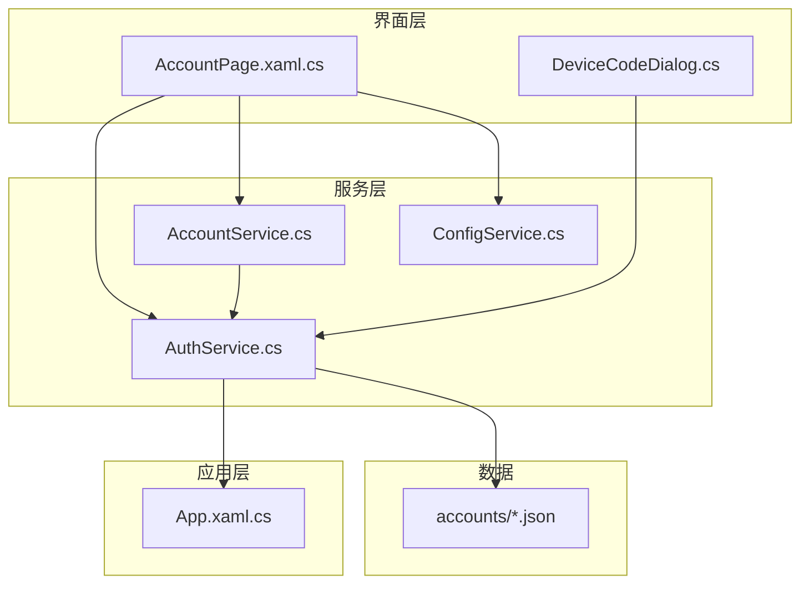
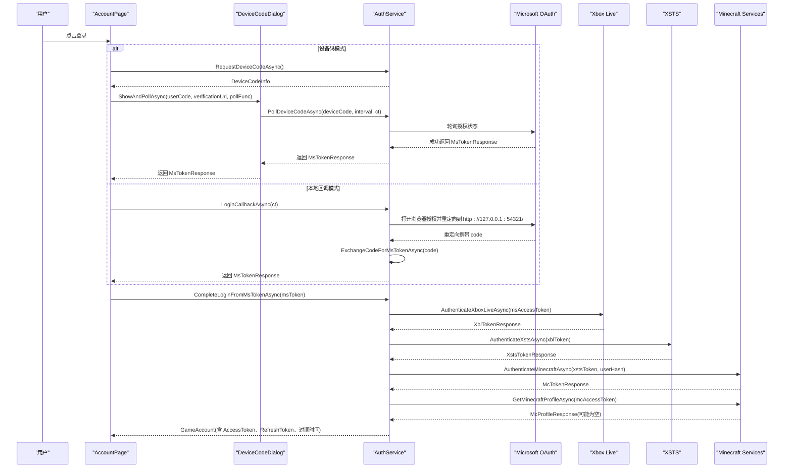
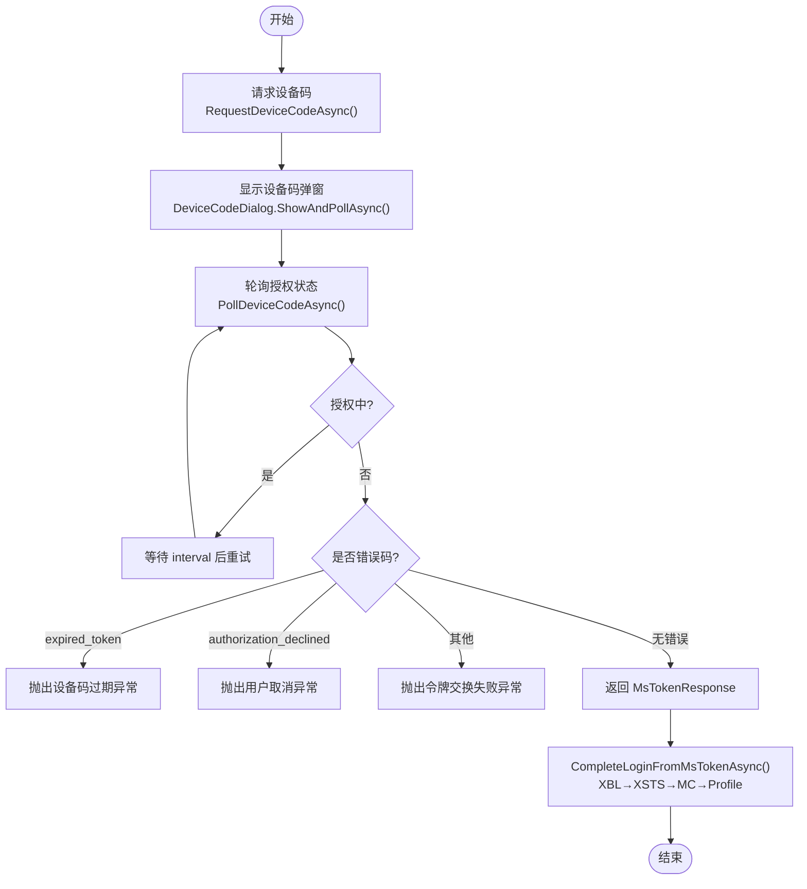
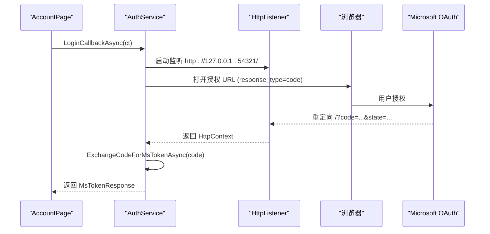
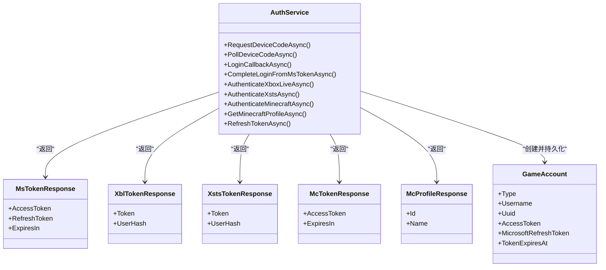
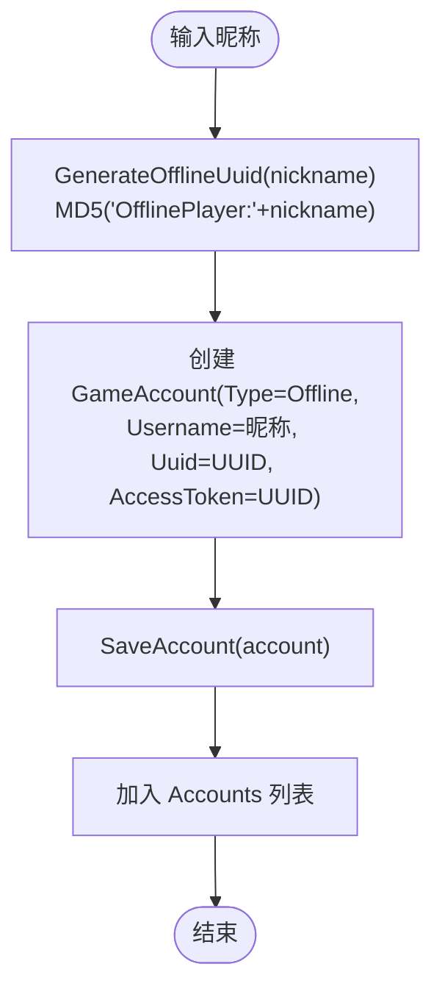
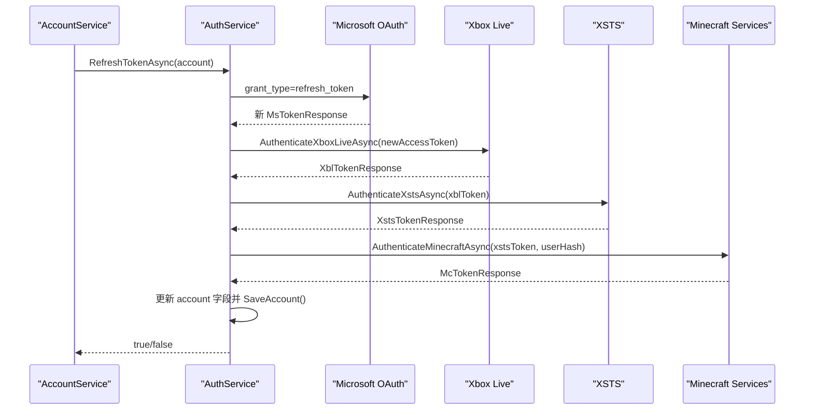
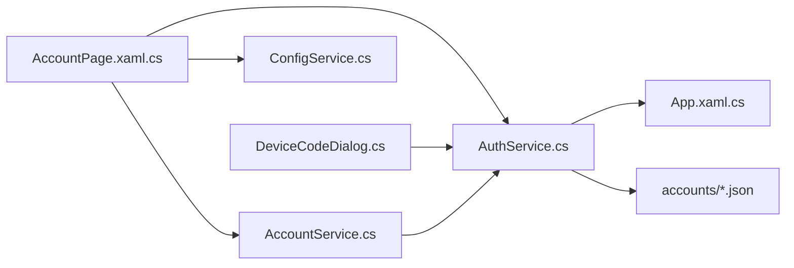

# 微软认证集成

<cite>
**本文引用的文件**   
- [AuthService.cs](file://src/FufuLauncher/Services/AuthService.cs)
- [AccountService.cs](file://src/FufuLauncher/Services/AccountService.cs)
- [DeviceCodeDialog.cs](file://src/FufuLauncher/Interaction/DeviceCodeDialog.cs)
- [AccountPage.xaml.cs](file://src/FufuLauncher/Views/AccountPage.xaml.cs)
- [AccountPage.xaml](file://src/FufuLauncher/Views/AccountPage.xaml)
- [ConfigService.cs](file://src/FufuLauncher/Services/ConfigService.cs)
- [App.xaml.cs](file://src/FufuLauncher/App.xaml.cs)
- [43381ea021e59839958af459800e4d11.json](file://Start/appmcGAME/accounts/43381ea021e59839958af459800e4d11.json)
</cite>

## 目录
1. [简介](#简介)
2. [项目结构](#项目结构)
3. [核心组件](#核心组件)
4. [架构总览](#架构总览)
5. [详细组件分析](#详细组件分析)
6. [依赖关系分析](#依赖关系分析)
7. [性能与可靠性](#性能与可靠性)
8. [故障排查指南](#故障排查指南)
9. [结论](#结论)
10. [附录：令牌链与错误分类](#附录令牌链与错误分类)

## 简介
本文件为“可爱的芙芙”启动器的微软认证集成提供完整示例文档，覆盖设备码登录、本地回调登录、完整的令牌链（MS access_token → XBL → XSTS → Minecraft access_token → 玩家资料）、错误处理策略、Token 刷新机制以及离线账号生成与管理。读者可据此理解并扩展启动器中的微软账号登录流程。

## 项目结构
与微软认证相关的关键代码位于以下位置：
- 服务层：AuthService、AccountService、ConfigService
- 交互层：DeviceCodeDialog（设备码弹窗）
- 视图层：AccountPage（账号页 UI 与登录入口）
- 应用层：App（日志、DI 容器、全局异常捕获）
- 数据持久化：accounts/*.json（账号信息）

图表来源
- [AccountPage.xaml.cs:1-143](file://src/FufuLauncher/Views/AccountPage.xaml.cs#L1-L143)
- [DeviceCodeDialog.cs:1-204](file://src/FufuLauncher/Interaction/DeviceCodeDialog.cs#L1-L204)
- [AuthService.cs:1-683](file://src/FufuLauncher/Services/AuthService.cs#L1-L683)
- [AccountService.cs:1-54](file://src/FufuLauncher/Services/AccountService.cs#L1-L54)
- [ConfigService.cs:1-152](file://src/FufuLauncher/Services/ConfigService.cs#L1-L152)
- [App.xaml.cs:1-207](file://src/FufuLauncher/App.xaml.cs#L1-L207)
- [43381ea021e59839958af459800e4d11.json:1-9](file://Start/appmcGAME/accounts/43381ea021e59839958af459800e4d11.json#L1-L9)

章节来源
- [AccountPage.xaml.cs:1-143](file://src/FufuLauncher/Views/AccountPage.xaml.cs#L1-L143)
- [AuthService.cs:1-683](file://src/FufuLauncher/Services/AuthService.cs#L1-L683)
- [ConfigService.cs:1-152](file://src/FufuLauncher/Services/ConfigService.cs#L1-L152)
- [App.xaml.cs:1-207](file://src/FufuLauncher/App.xaml.cs#L1-L207)

## 核心组件
- AuthService：实现微软 OAuth 两种登录模式（设备码优先、本地回调备选），完成 XBL→XSTS→MC 的令牌链，管理账号持久化与 Token 刷新。
- AccountService：多账号管理（列表、切换、删除），并在启动游戏前自动校验并刷新过期 Token。
- DeviceCodeDialog：设备码登录弹窗，自动复制验证码、一键打开授权页面、后台轮询授权结果。
- AccountPage：账号页 UI，支持切换登录模式、触发设备码或本地回调登录、离线账号登录、错误提示。
- ConfigService：配置项（AuthMode、回调端口等）加载与保存。
- App：统一日志写入、DI 容器注册、全局异常捕获。

章节来源
- [AuthService.cs:1-683](file://src/FufuLauncher/Services/AuthService.cs#L1-L683)
- [AccountService.cs:1-54](file://src/FufuLauncher/Services/AccountService.cs#L1-L54)
- [DeviceCodeDialog.cs:1-204](file://src/FufuLauncher/Interaction/DeviceCodeDialog.cs#L1-L204)
- [AccountPage.xaml.cs:1-143](file://src/FufuLauncher/Views/AccountPage.xaml.cs#L1-L143)
- [ConfigService.cs:1-152](file://src/FufuLauncher/Services/ConfigService.cs#L1-L152)
- [App.xaml.cs:1-207](file://src/FufuLauncher/App.xaml.cs#L1-L207)

## 架构总览
下图展示了从用户点击登录到获取 Minecraft 玩家资料的完整调用序列，涵盖设备码与本地回调两条路径。

图表来源
- [AccountPage.xaml.cs:57-72](file://src/FufuLauncher/Views/AccountPage.xaml.cs#L57-L72)
- [DeviceCodeDialog.cs:26-30](file://src/FufuLauncher/Interaction/DeviceCodeDialog.cs#L26-L30)
- [AuthService.cs:159-265](file://src/FufuLauncher/Services/AuthService.cs#L159-L265)
- [AuthService.cs:270-338](file://src/FufuLauncher/Services/AuthService.cs#L270-L338)
- [AuthService.cs:343-398](file://src/FufuLauncher/Services/AuthService.cs#L343-L398)
- [AuthService.cs:504-606](file://src/FufuLauncher/Services/AuthService.cs#L504-L606)
- [AuthService.cs:608-643](file://src/FufuLauncher/Services/AuthService.cs#L608-L643)

## 详细组件分析

### 设备码登录模式（推荐）
- 请求设备码：向 Microsoft 设备码端点提交 client_id 与 scope，返回 user_code、verification_uri、interval、expires_in 等。
- 展示弹窗：DeviceCodeDialog 自动复制 user_code 到剪贴板，一键打开 verification_uri，后台轮询授权状态。
- 轮询授权：按 interval 间隔轮询 token 端点，处理 authorization_pending/slow_down/expired_token/authorization_declined 等响应。
- 成功返回 MsTokenResponse，失败抛出 AuthException（区分网络异常、取消、过期等）。

图表来源
- [AuthService.cs:159-192](file://src/FufuLauncher/Services/AuthService.cs#L159-L192)
- [AuthService.cs:198-265](file://src/FufuLauncher/Services/AuthService.cs#L198-L265)
- [DeviceCodeDialog.cs:26-204](file://src/FufuLauncher/Interaction/DeviceCodeDialog.cs#L26-L204)

章节来源
- [AuthService.cs:159-265](file://src/FufuLauncher/Services/AuthService.cs#L159-L265)
- [DeviceCodeDialog.cs:26-204](file://src/FufuLauncher/Interaction/DeviceCodeDialog.cs#L26-L204)

### 本地回调登录模式（备选）
- HttpListener 监听固定端口（默认 54321），构造授权 URL 并打开浏览器。
- 等待重定向，解析 code 与 state，校验 state 一致性。
- 使用 authorization_code 换取 MsTokenResponse。
- 若端口占用或无法打开浏览器，抛出相应异常。

图表来源
- [AuthService.cs:270-338](file://src/FufuLauncher/Services/AuthService.cs#L270-L338)
- [AuthService.cs:488-502](file://src/FufuLauncher/Services/AuthService.cs#L488-L502)

章节来源
- [AuthService.cs:270-338](file://src/FufuLauncher/Services/AuthService.cs#L270-L338)

### 完整令牌链：MS access_token → XBL → XSTS → Minecraft access_token → 玩家资料
- XBL 认证：以 MS access_token 作为 RPS 票据，获取 XBL Token 与 UserHash。
- XSTS 认证：以 XBL Token 申请 XSTS Token（SandboxId=RETAIL，RelyingParty 指向 Minecraft 服务）。
- Minecraft 令牌：以 XSTS Token + UserHash 换取 Minecraft access_token。
- 玩家资料：用 Minecraft access_token 查询 profile；若 404 表示未购买 Minecraft，抛出对应错误。

图表来源
- [AuthService.cs:343-398](file://src/FufuLauncher/Services/AuthService.cs#L343-L398)
- [AuthService.cs:504-606](file://src/FufuLauncher/Services/AuthService.cs#L504-L606)
- [AuthService.cs:608-643](file://src/FufuLauncher/Services/AuthService.cs#L608-L643)
- [AuthService.cs:646-682](file://src/FufuLauncher/Services/AuthService.cs#L646-L682)

章节来源
- [AuthService.cs:343-398](file://src/FufuLauncher/Services/AuthService.cs#L343-L398)
- [AuthService.cs:504-606](file://src/FufuLauncher/Services/AuthService.cs#L504-L606)
- [AuthService.cs:608-643](file://src/FufuLauncher/Services/AuthService.cs#L608-L643)

### 离线账号的生成与管理
- 生成离线 UUID：基于 “OfflinePlayer:昵称” 的 MD5 v3 算法，确保确定性且与 Minecraft 离线模式一致。
- 创建离线账号：设置 Type=Offline，Username=昵称，Uuid=生成的 UUID，AccessToken=Uuid（占位）。
- 持久化：保存到 accounts/*.json，文件名即 UUID。

图表来源
- [AuthService.cs:403-416](file://src/FufuLauncher/Services/AuthService.cs#L403-L416)
- [AuthService.cs:477-486](file://src/FufuLauncher/Services/AuthService.cs#L477-L486)

章节来源
- [AuthService.cs:403-416](file://src/FufuLauncher/Services/AuthService.cs#L403-L416)
- [AuthService.cs:477-486](file://src/FufuLauncher/Services/AuthService.cs#L477-L486)

### Token 刷新机制（refresh_token 自动续期）
- 条件：仅 Microsoft 类型账号且存在 MicrosoftRefreshToken。
- 步骤：使用 refresh_token 向 Microsoft 换取新的 MsTokenResponse，随后完整重走 XBL→XSTS→MC 链，更新 AccessToken 与过期时间，并持久化。
- 失败处理：记录日志并返回 false，上层可根据需要提示重新登录。

图表来源
- [AuthService.cs:421-468](file://src/FufuLauncher/Services/AuthService.cs#L421-L468)
- [AccountService.cs:42-52](file://src/FufuLauncher/Services/AccountService.cs#L42-L52)

章节来源
- [AuthService.cs:421-468](file://src/FufuLauncher/Services/AuthService.cs#L421-L468)
- [AccountService.cs:42-52](file://src/FufuLauncher/Services/AccountService.cs#L42-L52)

### 错误处理策略
- 网络异常：HttpRequestException 包装为 AuthError.Network。
- 未购买 Minecraft：查询玩家资料返回 404 时抛出 AuthError.NotOwnedMinecraft。
- 用户取消：CancellationToken 触发或 UI 关闭弹窗，抛出 AuthError.Cancelled。
- 设备码过期：轮询返回 expired_token，抛出 AuthError.DeviceCodeExpired。
- 令牌交换失败：任一环节 JSON 解析失败或状态码非成功，抛出 AuthError.TokenExchangeFailed。
- 未知异常：兜底包装为 AuthError.Unknown。

章节来源
- [AuthService.cs:159-192](file://src/FufuLauncher/Services/AuthService.cs#L159-L192)
- [AuthService.cs:198-265](file://src/FufuLauncher/Services/AuthService.cs#L198-L265)
- [AuthService.cs:608-643](file://src/FufuLauncher/Services/AuthService.cs#L608-L643)
- [AccountPage.xaml.cs:75-103](file://src/FufuLauncher/Views/AccountPage.xaml.cs#L75-L103)

## 依赖关系分析
- AccountPage 依赖 AuthService、AccountService、ConfigService，负责 UI 与登录入口。
- DeviceCodeDialog 依赖 AuthService 的轮询方法，封装设备码交互。
- AccountService 依赖 AuthService，提供账号管理与 Token 自动刷新。
- AuthService 依赖 ConfigService（读取配置）、App（日志）、HttpClient（HTTP 请求）。
- App 通过 DI 容器注册所有服务，并提供统一日志与异常处理。

图表来源
- [AccountPage.xaml.cs:1-143](file://src/FufuLauncher/Views/AccountPage.xaml.cs#L1-L143)
- [DeviceCodeDialog.cs:1-204](file://src/FufuLauncher/Interaction/DeviceCodeDialog.cs#L1-L204)
- [AccountService.cs:1-54](file://src/FufuLauncher/Services/AccountService.cs#L1-L54)
- [AuthService.cs:1-683](file://src/FufuLauncher/Services/AuthService.cs#L1-L683)
- [ConfigService.cs:1-152](file://src/FufuLauncher/Services/ConfigService.cs#L1-L152)
- [App.xaml.cs:1-207](file://src/FufuLauncher/App.xaml.cs#L1-L207)

章节来源
- [AccountPage.xaml.cs:1-143](file://src/FufuLauncher/Views/AccountPage.xaml.cs#L1-L143)
- [AuthService.cs:1-683](file://src/FufuLauncher/Services/AuthService.cs#L1-L683)
- [AccountService.cs:1-54](file://src/FufuLauncher/Services/AccountService.cs#L1-L54)
- [ConfigService.cs:1-152](file://src/FufuLauncher/Services/ConfigService.cs#L1-L152)
- [App.xaml.cs:1-207](file://src/FufuLauncher/App.xaml.cs#L1-L207)

## 性能与可靠性
- HttpClient 复用与超时：统一设置 User-Agent 与 Accept 头，避免部分端点拒绝访问；超时 30s。
- 轮询退避：slow_down 时增加延迟，避免频繁请求。
- 日志缓冲：App.WriteAppLog 使用并发队列与定时器批量落盘，降低 IO 阻塞。
- 资源释放：HttpListener 在回调完成后及时 Stop；窗口关闭触发取消令牌。
- 容错：账号文件损坏忽略；端口占用给出明确提示；网络瞬时错误自动重试。

章节来源
- [AuthService.cs:94-100](file://src/FufuLauncher/Services/AuthService.cs#L94-L100)
- [AuthService.cs:229-232](file://src/FufuLauncher/Services/AuthService.cs#L229-L232)
- [App.xaml.cs:34-60](file://src/FufuLauncher/App.xaml.cs#L34-L60)
- [AuthService.cs:270-338](file://src/FufuLauncher/Services/AuthService.cs#L270-L338)

## 故障排查指南
- 网络异常：检查网络连接与代理设置；查看 app.log 中的网络错误详情。
- 未购买 Minecraft：确认微软账号已购买 Java 版；根据提示前往官方渠道购买。
- 设备码过期：重新发起设备码请求；确保在有效期内完成授权。
- 端口占用：切换为设备码模式或修改回调端口；确保防火墙允许 127.0.0.1:54321。
- 令牌刷新失败：检查 refresh_token 是否有效；必要时重新登录获取新的 refresh_token。
- 日志查看：通过 App.ReadAppLog() 获取最新日志，定位问题阶段。

章节来源
- [AuthService.cs:159-192](file://src/FufuLauncher/Services/AuthService.cs#L159-L192)
- [AuthService.cs:608-643](file://src/FufuLauncher/Services/AuthService.cs#L608-L643)
- [App.xaml.cs:62-73](file://src/FufuLauncher/App.xaml.cs#L62-L73)

## 结论
该集成实现了稳定可靠的微软账号登录流程，支持设备码与本地回调两种模式，完整覆盖 XBL→XSTS→MC 令牌链，具备完善的错误分类与日志记录，并通过 refresh_token 实现自动续期。离线账号采用确定性 UUID，保证与 Minecraft 离线模式兼容。整体设计清晰、可扩展性强，便于后续功能增强与维护。

## 附录：令牌链与错误分类
- 令牌链：MS access_token → XBL Token → XSTS Token → Minecraft access_token → 玩家资料（可选）。
- 错误分类：Network、NotOwnedMinecraft、Cancelled、DeviceCodeExpired、TokenExchangeFailed、Unknown。
- 账号模型：GameAccount（Type、Username、Uuid、AccessToken、MicrosoftRefreshToken、TokenExpiresAt、AddedAt）。
- 配置文件：AuthMode（DeviceCode/LocalCallback）、AuthCallbackPort（默认 54321）。

章节来源
- [AuthService.cs:29-48](file://src/FufuLauncher/Services/AuthService.cs#L29-L48)
- [AuthService.cs:50-63](file://src/FufuLauncher/Services/AuthService.cs#L50-L63)
- [ConfigService.cs:41-44](file://src/FufuLauncher/Services/ConfigService.cs#L41-L44)
- [43381ea021e59839958af459800e4d11.json:1-9](file://Start/appmcGAME/accounts/43381ea021e59839958af459800e4d11.json#L1-L9)