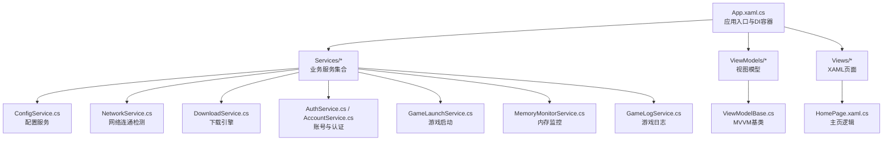
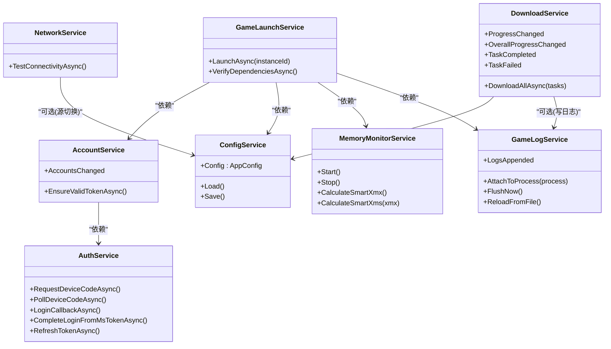
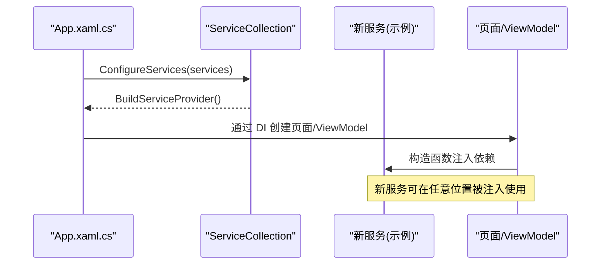
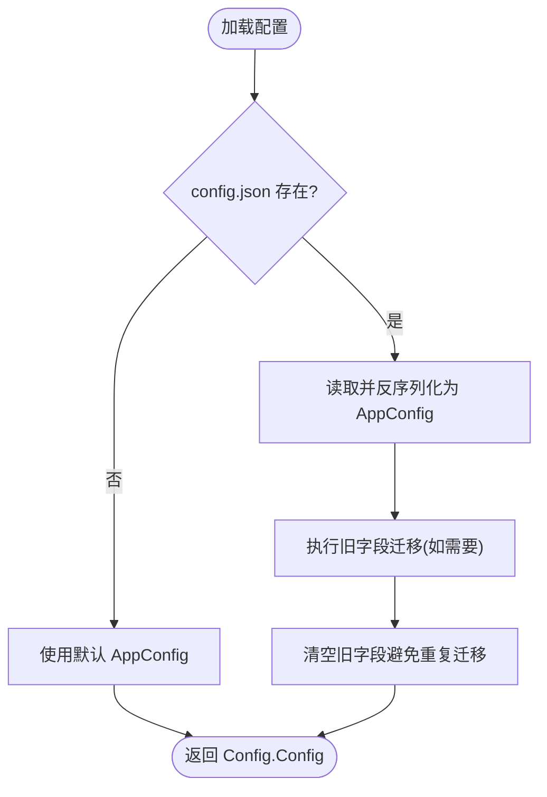
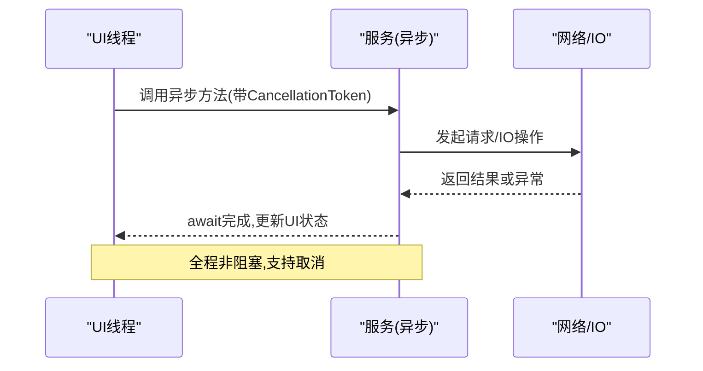
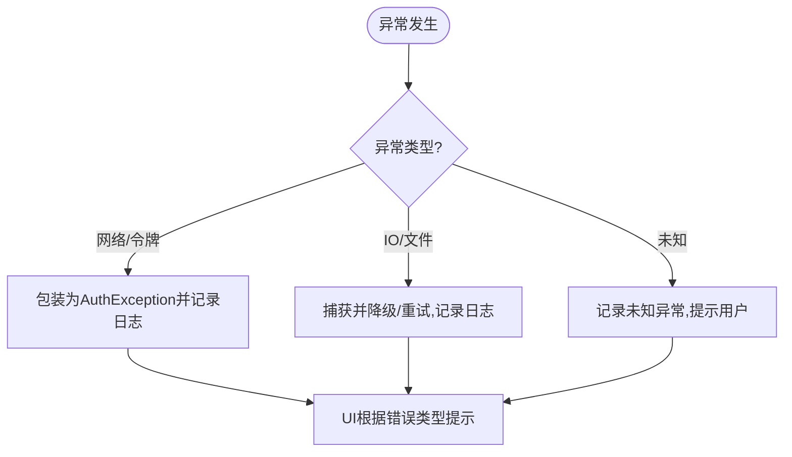
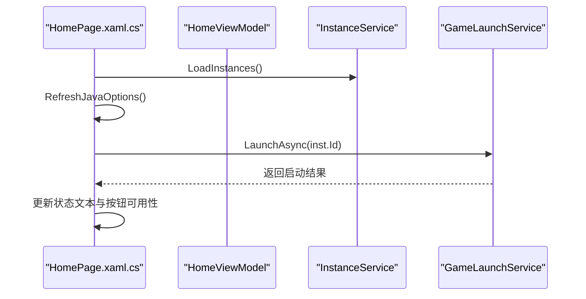
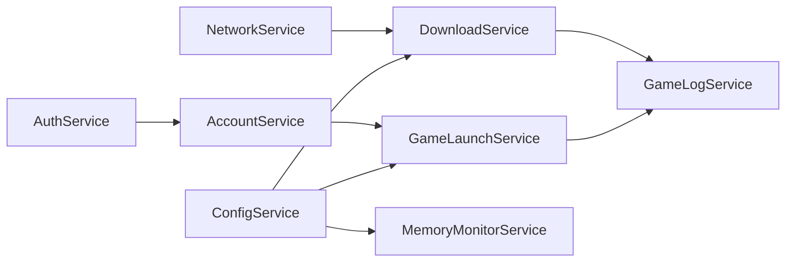

# 扩展新服务集成

<cite>
**本文引用的文件**   
- [App.xaml.cs](file://src/FufuLauncher/App.xaml.cs)
- [ConfigService.cs](file://src/FufuLauncher/Services/ConfigService.cs)
- [AccountService.cs](file://src/FufuLauncher/Services/AccountService.cs)
- [AuthService.cs](file://src/FufuLauncher/Services/AuthService.cs)
- [DownloadService.cs](file://src/FufuLauncher/Services/DownloadService.cs)
- [NetworkService.cs](file://src/FufuLauncher/Services/NetworkService.cs)
- [GameLaunchService.cs](file://src/FufuLauncher/Services/GameLaunchService.cs)
- [MemoryMonitorService.cs](file://src/FufuLauncher/Services/MemoryMonitorService.cs)
- [GameLogService.cs](file://src/FufuLauncher/Services/GameLogService.cs)
- [HomePage.xaml.cs](file://src/FufuLauncher/Views/HomePage.xaml.cs)
- [MainViewModel.cs](file://src/FufuLauncher/ViewModels/MainViewModel.cs)
- [ViewModelBase.cs](file://src/FufuLauncher/ViewModels/ViewModelBase.cs)
</cite>

## 目录
1. [简介](#简介)
2. [项目结构](#项目结构)
3. [核心组件](#核心组件)
4. [架构总览](#架构总览)
5. [详细组件分析](#详细组件分析)
6. [依赖关系分析](#依赖关系分析)
7. [性能考量](#性能考量)
8. [故障排查指南](#故障排查指南)
9. [结论](#结论)
10. [附录：开发示例与审查清单](#附录开发示例与审查清单)

## 简介
本指南面向希望在“可爱的芙芙启动器”中新增第三方服务集成的开发者。内容覆盖：
- 服务注册机制与依赖注入容器使用
- 接口设计与可替换性、可测试性最佳实践
- 配置管理扩展（为新服务添加配置项）
- 异步编程模式与 UI 响应性保障
- 错误处理与日志记录规范
- 页面与功能扩展方法（UI 元素集成）
- 从接口定义到 UI 集成的完整示例
- 代码审查清单与质量标准

## 项目结构
本项目采用 WPF + MVVM + DI 的架构组织方式：
- App.xaml.cs 负责应用生命周期、DI 容器初始化与服务注册
- Services 目录包含各项业务服务（网络、下载、账号、启动、内存监控、日志等）
- ViewModels 提供视图模型，继承 ViewModelBase 实现属性变更通知
- Views 为 XAML 页面，通过构造函数注入所需服务

**图表来源** 
- [App.xaml.cs:131-178](file://src/FufuLauncher/App.xaml.cs#L131-L178)
- [ConfigService.cs:88-151](file://src/FufuLauncher/Services/ConfigService.cs#L88-L151)
- [NetworkService.cs:18-94](file://src/FufuLauncher/Services/NetworkService.cs#L18-L94)
- [DownloadService.cs:56-114](file://src/FufuLauncher/Services/DownloadService.cs#L56-L114)
- [AuthService.cs:76-121](file://src/FufuLauncher/Services/AuthService.cs#L76-L121)
- [AccountService.cs:12-26](file://src/FufuLauncher/Services/AccountService.cs#L12-L26)
- [GameLaunchService.cs:35-65](file://src/FufuLauncher/Services/GameLaunchService.cs#L35-L65)
- [MemoryMonitorService.cs:26-59](file://src/FufuLauncher/Services/MemoryMonitorService.cs#L26-L59)
- [GameLogService.cs:22-52](file://src/FufuLauncher/Services/GameLogService.cs#L22-L52)
- [MainViewModel.cs:8-24](file://src/FufuLauncher/ViewModels/MainViewModel.cs#L8-L24)
- [ViewModelBase.cs:7-21](file://src/FufuLauncher/ViewModels/ViewModelBase.cs#L7-L21)
- [HomePage.xaml.cs:12-41](file://src/FufuLauncher/Views/HomePage.xaml.cs#L12-L41)

**章节来源**
- [App.xaml.cs:75-117](file://src/FufuLauncher/App.xaml.cs#L75-L117)
- [App.xaml.cs:131-178](file://src/FufuLauncher/App.xaml.cs#L131-L178)

## 核心组件
- 应用入口与 DI 容器：在 OnStartup 中创建 ServiceCollection，集中注册所有服务、视图模型与页面；提供静态 Services 供全局访问。
- 配置服务：统一读写 config.json，支持字段迁移与默认值；新增服务应在此处增加配置项。
- 网络服务：检测 Mojang/BMCLAPI 连通性与延迟，为下载与登录提供基础能力。
- 下载服务：多线程分片断点续传、SHA1 校验、失败重试、双进度事件（单任务与全局）。
- 账号与认证：微软设备码/本地回调两种登录模式，完整令牌链与自动刷新。
- 游戏启动：组装 JVM 参数、校验依赖、进程优先级与 CPU 亲和性、实时日志捕获。
- 内存监控：系统内存读取、智能分配 Xmx/Xms、多核 GC 优化参数生成。
- 游戏日志：后台批量写入 game.log，内存缓冲限流，批量事件通知。

**章节来源**
- [App.xaml.cs:131-178](file://src/FufuLauncher/App.xaml.cs#L131-L178)
- [ConfigService.cs:13-86](file://src/FufuLauncher/Services/ConfigService.cs#L13-L86)
- [NetworkService.cs:18-94](file://src/FufuLauncher/Services/NetworkService.cs#L18-L94)
- [DownloadService.cs:28-114](file://src/FufuLauncher/Services/DownloadService.cs#L28-L114)
- [AuthService.cs:76-121](file://src/FufuLauncher/Services/AuthService.cs#L76-L121)
- [AccountService.cs:12-26](file://src/FufuLauncher/Services/AccountService.cs#L12-L26)
- [GameLaunchService.cs:35-65](file://src/FufuLauncher/Services/GameLaunchService.cs#L35-L65)
- [MemoryMonitorService.cs:26-59](file://src/FufuLauncher/Services/MemoryMonitorService.cs#L26-L59)
- [GameLogService.cs:22-52](file://src/FufuLauncher/Services/GameLogService.cs#L22-L52)

## 架构总览
下图展示服务间的主要依赖与交互关系，体现“服务解耦 + DI 注入”的设计原则。

**图表来源** 
- [ConfigService.cs:88-151](file://src/FufuLauncher/Services/ConfigService.cs#L88-L151)
- [NetworkService.cs:18-94](file://src/FufuLauncher/Services/NetworkService.cs#L18-L94)
- [DownloadService.cs:56-114](file://src/FufuLauncher/Services/DownloadService.cs#L56-L114)
- [AuthService.cs:76-121](file://src/FufuLauncher/Services/AuthService.cs#L76-L121)
- [AccountService.cs:12-26](file://src/FufuLauncher/Services/AccountService.cs#L12-L26)
- [GameLaunchService.cs:35-65](file://src/FufuLauncher/Services/GameLaunchService.cs#L35-L65)
- [MemoryMonitorService.cs:26-59](file://src/FufuLauncher/Services/MemoryMonitorService.cs#L26-L59)
- [GameLogService.cs:22-52](file://src/FufuLauncher/Services/GameLogService.cs#L22-L52)

## 详细组件分析

### 服务注册与依赖注入（如何注册新服务）
- 在 App.ConfigureServices 中以单例或瞬态方式注册服务与页面。
- 新增服务时，遵循以下流程：
  1) 在 Services 目录下新建服务类（建议以接口+实现形式，便于替换与测试）
  2) 在 ConfigureServices 中调用 services.AddSingleton<T>() 或 AddTransient<T>()
  3) 在需要使用的地方通过构造函数注入（WPF 页面、ViewModel、其他服务）
  4) 若涉及 UI，确保异步操作不阻塞 UI 线程（await Task、DispatcherTimer 等）

**图表来源** 
- [App.xaml.cs:131-178](file://src/FufuLauncher/App.xaml.cs#L131-L178)

**章节来源**
- [App.xaml.cs:131-178](file://src/FufuLauncher/App.xaml.cs#L131-L178)

### 配置管理（为新服务添加配置选项）
- 在 AppConfig 中添加新字段（含默认值），并在 Save/Load 中保持兼容。
- 建议在 Load 中加入旧字段迁移逻辑（参考背景类型迁移）。
- UI 设置页绑定该字段，用户修改后调用 ConfigService.Save()。

**图表来源** 
- [ConfigService.cs:101-137](file://src/FufuLauncher/Services/ConfigService.cs#L101-L137)

**章节来源**
- [ConfigService.cs:13-86](file://src/FufuLauncher/Services/ConfigService.cs#L13-L86)
- [ConfigService.cs:101-151](file://src/FufuLauncher/Services/ConfigService.cs#L101-L151)

### 异步编程与 UI 响应性
- 所有 IO/网络/耗时操作使用 async/await，避免阻塞 UI 线程。
- UI 定时刷新优先使用 DispatcherTimer（在 UI 线程触发），减少跨线程 Invoke 开销。
- 长轮询/重试需支持 CancellationToken，保证取消与超时控制。

**图表来源** 
- [DownloadService.cs:295-366](file://src/FufuLauncher/Services/DownloadService.cs#L295-L366)
- [AuthService.cs:159-265](file://src/FufuLauncher/Services/AuthService.cs#L159-L265)
- [MemoryMonitorService.cs:62-88](file://src/FufuLauncher/Services/MemoryMonitorService.cs#L62-L88)

**章节来源**
- [MemoryMonitorService.cs:62-88](file://src/FufuLauncher/Services/MemoryMonitorService.cs#L62-L88)
- [DownloadService.cs:295-366](file://src/FufuLauncher/Services/DownloadService.cs#L295-L366)
- [AuthService.cs:159-265](file://src/FufuLauncher/Services/AuthService.cs#L159-L265)

### 错误处理与日志记录规范
- 统一通过 App.WriteAppLog 写入应用日志（app.log），关键路径追加详细上下文。
- 自定义异常类型（如 AuthException）携带错误枚举，便于 UI 区分提示。
- 对 IO/网络异常进行容错与降级（例如下载失败重试、官方源切镜像）。
- 日志查看器打开前强制 FlushNow，确保最新日志落地。

**图表来源** 
- [AuthService.cs:42-48](file://src/FufuLauncher/Services/AuthService.cs#L42-L48)
- [AuthService.cs:159-265](file://src/FufuLauncher/Services/AuthService.cs#L159-L265)
- [DownloadService.cs:345-366](file://src/FufuLauncher/Services/DownloadService.cs#L345-L366)
- [GameLogService.cs:168-172](file://src/FufuLauncher/Services/GameLogService.cs#L168-L172)

**章节来源**
- [AuthService.cs:42-48](file://src/FufuLauncher/Services/AuthService.cs#L42-L48)
- [AuthService.cs:159-265](file://src/FufuLauncher/Services/AuthService.cs#L159-L265)
- [DownloadService.cs:345-366](file://src/FufuLauncher/Services/DownloadService.cs#L345-L366)
- [GameLogService.cs:168-172](file://src/FufuLauncher/Services/GameLogService.cs#L168-L172)

### 扩展现有页面与功能（UI 集成）
- 在页面构造函数中注入所需服务，避免直接依赖 App.Services 获取实例。
- 使用 MVVM 数据绑定更新 UI，避免在事件回调中直接操作控件状态。
- 对于耗时操作，使用异步方法与进度事件（如 DownloadService.ProgressChanged）。

**图表来源** 
- [HomePage.xaml.cs:43-65](file://src/FufuLauncher/Views/HomePage.xaml.cs#L43-L65)
- [HomePage.xaml.cs:277-303](file://src/FufuLauncher/Views/HomePage.xaml.cs#L277-L303)

**章节来源**
- [HomePage.xaml.cs:43-65](file://src/FufuLauncher/Views/HomePage.xaml.cs#L43-L65)
- [HomePage.xaml.cs:277-303](file://src/FufuLauncher/Views/HomePage.xaml.cs#L277-L303)

## 依赖关系分析
- 服务之间通过构造函数注入形成松耦合，便于替换与单元测试。
- 部分服务共享配置（ConfigService）、日志（GameLogService）、内存监控（MemoryMonitorService）。
- 页面与 ViewModel 通过 DI 获取服务实例，避免硬编码依赖。

**图表来源** 
- [ConfigService.cs:88-151](file://src/FufuLauncher/Services/ConfigService.cs#L88-L151)
- [DownloadService.cs:56-114](file://src/FufuLauncher/Services/DownloadService.cs#L56-L114)
- [GameLaunchService.cs:35-65](file://src/FufuLauncher/Services/GameLaunchService.cs#L35-L65)
- [MemoryMonitorService.cs:26-59](file://src/FufuLauncher/Services/MemoryMonitorService.cs#L26-L59)
- [AuthService.cs:76-121](file://src/FufuLauncher/Services/AuthService.cs#L76-L121)
- [AccountService.cs:12-26](file://src/FufuLauncher/Services/AccountService.cs#L12-L26)
- [GameLogService.cs:22-52](file://src/FufuLauncher/Services/GameLogService.cs#L22-L52)
- [NetworkService.cs:18-94](file://src/FufuLauncher/Services/NetworkService.cs#L18-L94)

**章节来源**
- [App.xaml.cs:131-178](file://src/FufuLauncher/App.xaml.cs#L131-L178)

## 性能考量
- 下载服务采用分片并发与断点续传，降低大文件下载时间并提升稳定性。
- 日志写入采用队列与批量刷新，避免频繁 IO 导致 UI 卡顿。
- 内存监控使用 DispatcherTimer 在 UI 线程触发，减少跨线程调度开销。
- 全局总进度节流上报，平衡 UI 流畅度与准确性。

[本节为通用指导，无需特定文件引用]

## 故障排查指南
- 应用日志：通过设置页打开日志查看器，查看 app.log 与 game.log 分离日志。
- 常见问题定位：
  - 登录失败：检查网络连通性、设备码过期、令牌交换失败（参考 AuthException 错误类型）
  - 下载失败：查看重试次数、SHA1 校验失败、磁盘空间不足提示
  - 启动失败：确认 Java 完整性、依赖缺失、令牌过期未刷新
- 调试技巧：
  - 在关键路径插入 App.WriteAppLog 输出上下文
  - 使用 CancellationToken 验证取消与超时行为
  - 通过 DownloadService.TaskFailed/OverallProgressChanged 观察下载状态

**章节来源**
- [GameLogService.cs:168-172](file://src/FufuLauncher/Services/GameLogService.cs#L168-L172)
- [AuthService.cs:159-265](file://src/FufuLauncher/Services/AuthService.cs#L159-L265)
- [DownloadService.cs:345-366](file://src/FufuLauncher/Services/DownloadService.cs#L345-L366)
- [HomePage.xaml.cs:307-312](file://src/FufuLauncher/Views/HomePage.xaml.cs#L307-L312)

## 结论
通过统一的 DI 容器、清晰的配置管理与完善的异步/错误处理机制，本项目具备良好的可扩展性。新增第三方服务时，遵循本文档的接口设计、配置扩展、异步模式与日志规范，即可快速集成并保持系统的可替换性与可测试性。

[本节为总结性内容，无需特定文件引用]

## 附录：开发示例与审查清单

### 完整开发示例（从接口定义到 UI 集成）
- 步骤 1：定义服务接口与实现（建议以接口隔离，便于替换与测试）
- 步骤 2：在 App.ConfigureServices 中注册服务（单例/瞬态）
- 步骤 3：在配置文件中添加新服务的配置项（AppConfig）
- 步骤 4：在需要的页面/ViewModel 中通过构造函数注入服务
- 步骤 5：实现异步方法，使用 CancellationToken 支持取消
- 步骤 6：在关键路径记录日志（App.WriteAppLog），异常分类处理
- 步骤 7：在 UI 中绑定服务事件（如 ProgressChanged、Updated）
- 步骤 8：编写单元测试（Mock 接口，验证边界条件）

[本节为流程说明，无需特定文件引用]

### 代码审查清单与质量标准
- 是否通过 DI 注入依赖，避免全局静态访问
- 是否使用 async/await 与 CancellationToken，确保 UI 响应性
- 是否对 IO/网络异常进行捕获与降级，避免崩溃
- 是否在关键路径记录日志，便于问题定位
- 是否新增配置项并提供默认值与迁移逻辑
- 是否提供事件/回调用于 UI 更新（避免直接操作控件）
- 是否考虑性能（批量 IO、节流上报、并发控制）
- 是否编写单元测试与边界用例

[本节为通用标准，无需特定文件引用]