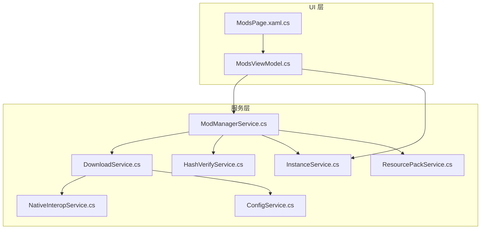
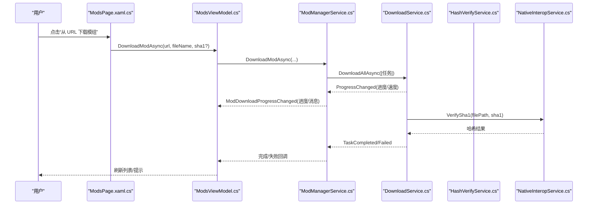
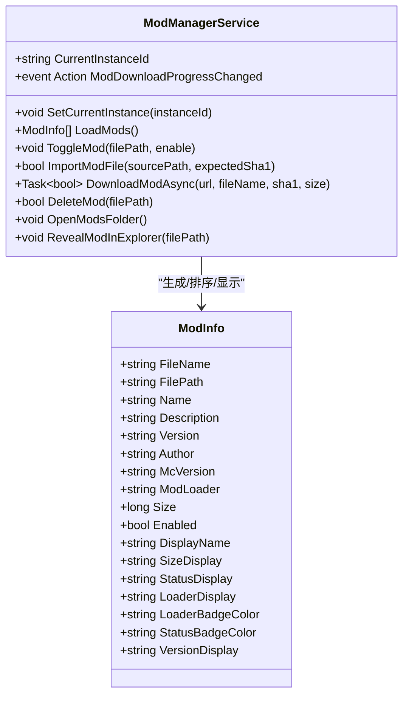
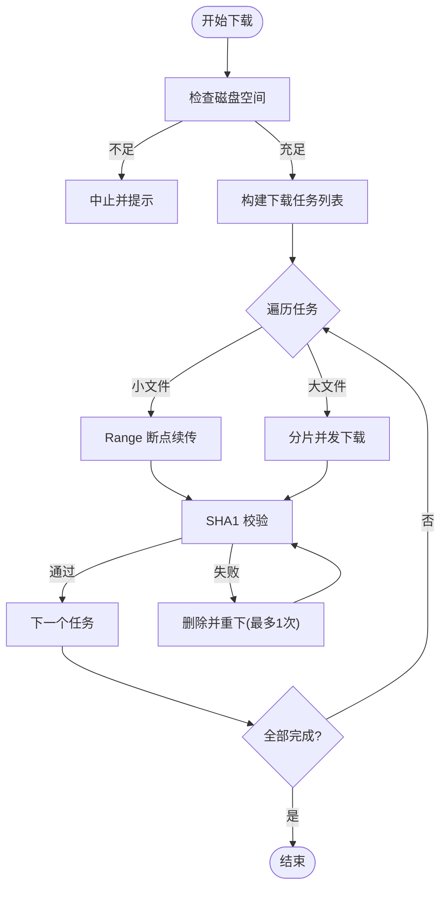
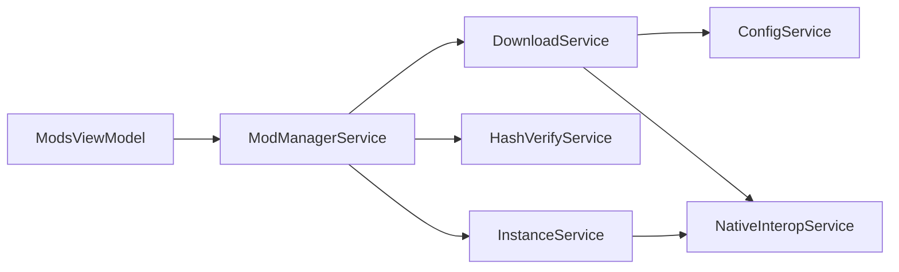
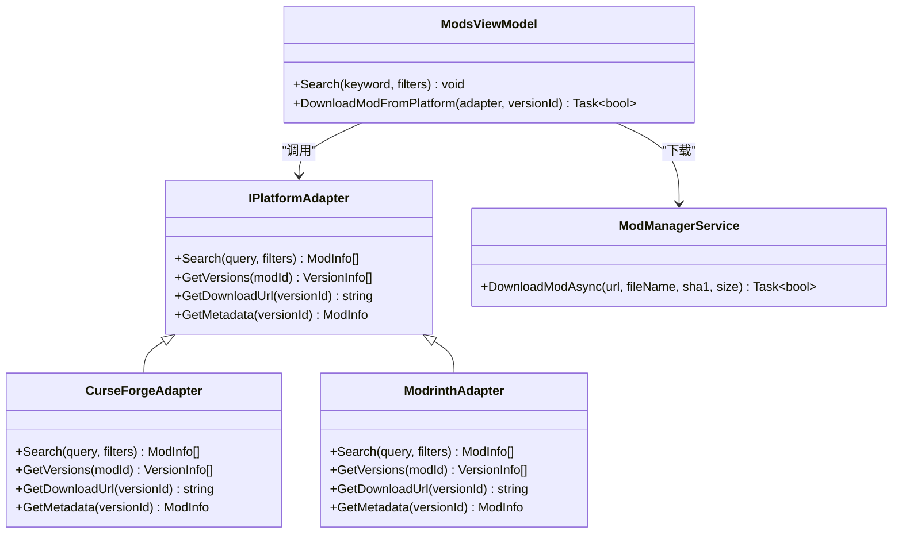

# 模组仓库集成

<cite>
**本文引用的文件**   
- [README.md](file://README.md)
- [ModManagerService.cs](file://src/FufuLauncher/Services/ModManagerService.cs)
- [ModsViewModel.cs](file://src/FufuLauncher/ViewModels/ModsViewModel.cs)
- [ModsPage.xaml.cs](file://src/FufuLauncher/Views/ModsPage.xaml.cs)
- [DownloadService.cs](file://src/FufuLauncher/Services/DownloadService.cs)
- [InstanceService.cs](file://src/FufuLauncher/Services/InstanceService.cs)
- [ConfigService.cs](file://src/FufuLauncher/Services/ConfigService.cs)
- [NativeInteropService.cs](file://src/FufuLauncher/Services/NativeInteropService.cs)
- [HashVerifyService.cs](file://src/FufuLauncher/Services/HashVerifyService.cs)
- [ResourcePackService.cs](file://src/FufuLauncher/Services/ResourcePackService.cs)
- [GameInstallService.cs](file://src/FufuLauncher/Services/GameInstallService.cs)
</cite>

## 目录
1. [简介](#简介)
2. [项目结构](#项目结构)
3. [核心组件](#核心组件)
4. [架构总览](#架构总览)
5. [详细组件分析](#详细组件分析)
6. [依赖关系分析](#依赖关系分析)
7. [性能与稳定性](#性能与稳定性)
8. [故障排查指南](#故障排查指南)
9. [结论](#结论)
10. [附录：扩展新平台适配器](#附录扩展新平台适配器)

## 简介
本文件面向“可爱的芙芙”启动器的模组仓库集成，提供从搜索、下载、安装到配置管理、更新检查、备份恢复的完整示例文档。当前代码库已具备完善的本地模组管理与下载引擎，但未内置 CurseForge、Modrinth 等平台的在线检索与下载能力。本文在现有实现基础上，给出如何以“平台适配器”模式接入这些平台的方案，并说明如何在 UI 层与业务层进行集成。

## 项目结构
- WPF 主程序位于 src/FufuLauncher，采用 MVVM 分层：
  - Services：业务服务（模组管理、下载、实例、配置、哈希校验、资源包等）
  - ViewModels：视图模型（如 ModsViewModel）
  - Views：页面（如 ModsPage）
- 原生加速通过 native\FufuNative C++ DLL 提供高性能 SHA1/SHA256 与 ZIP 操作，C# 侧通过 P/Invoke 调用并在失败时回退到托管实现。

**图表来源** 
- [ModsPage.xaml.cs](file://src/FufuLauncher/Views/ModsPage.xaml.cs)
- [ModsViewModel.cs](file://src/FufuLauncher/ViewModels/ModsViewModel.cs)
- [ModManagerService.cs](file://src/FufuLauncher/Services/ModManagerService.cs)
- [DownloadService.cs](file://src/FufuLauncher/Services/DownloadService.cs)
- [InstanceService.cs](file://src/FufuLauncher/Services/InstanceService.cs)
- [HashVerifyService.cs](file://src/FufuLauncher/Services/HashVerifyService.cs)
- [NativeInteropService.cs](file://src/FufuLauncher/Services/NativeInteropService.cs)
- [ResourcePackService.cs](file://src/FufuLauncher/Services/ResourcePackService.cs)
- [ConfigService.cs](file://src/FufuLauncher/Services/ConfigService.cs)

**章节来源**
- [README.md](file://README.md)

## 核心组件
- 模组管理服务 ModManagerService：读取 mods 目录、解析 Fabric/Quilt/Forge 元数据、启用/禁用、导入/删除、从 URL 下载模组、打开/定位文件夹。
- 下载服务 DownloadService：多线程分片断点续传、类别独立队列、自动重试、SHA1 校验、官方源/BMCLAPI 镜像切换、全局进度统计。
- 实例服务 InstanceService：多实例隔离（mods/saves/resourcepacks/shaderpacks/options），创建/复制/导出备份/导入已有 .minecraft。
- 配置服务 ConfigService：主题、下载源、Java 路径、JVM 参数、分辨率、背景设置等持久化。
- 哈希校验 HashVerifyService：单文件/批量校验，缺失或损坏返回需修复列表。
- 原生互操作 NativeInteropService：P/Invoke 调用 C++ DLL 计算哈希与 ZIP 解压/打包，失败回退托管实现。
- 资源包服务 ResourcePackService：资源包/光影包加载、启用状态识别、顺序调整接口预留。

**章节来源**
- [ModManagerService.cs](file://src/FufuLauncher/Services/ModManagerService.cs)
- [DownloadService.cs](file://src/FufuLauncher/Services/DownloadService.cs)
- [InstanceService.cs](file://src/FufuLauncher/Services/InstanceService.cs)
- [ConfigService.cs](file://src/FufuLauncher/Services/ConfigService.cs)
- [HashVerifyService.cs](file://src/FufuLauncher/Services/HashVerifyService.cs)
- [NativeInteropService.cs](file://src/FufuLauncher/Services/NativeInteropService.cs)
- [ResourcePackService.cs](file://src/FufuLauncher/Services/ResourcePackService.cs)

## 架构总览
下图展示模组从 UI 到服务的调用链，以及下载与校验的关键流程。

**图表来源** 
- [ModsPage.xaml.cs](file://src/FufuLauncher/Views/ModsPage.xaml.cs)
- [ModsViewModel.cs](file://src/FufuLauncher/ViewModels/ModsViewModel.cs)
- [ModManagerService.cs](file://src/FufuLauncher/Services/ModManagerService.cs)
- [DownloadService.cs](file://src/FufuLauncher/Services/DownloadService.cs)
- [HashVerifyService.cs](file://src/FufuLauncher/Services/HashVerifyService.cs)
- [NativeInteropService.cs](file://src/FufuLauncher/Services/NativeInteropService.cs)

## 详细组件分析

### 模组管理服务（ModManagerService）
- 功能要点
  - 扫描 mods 目录，解析 fabric.mod.json、quilt.mod.json、META-INF/mods.toml，提取名称、版本、作者、加载器类型。
  - 启用/禁用通过重命名 .jar/.disabled 实现。
  - 支持拖拽导入 zip/jar，可选 SHA1 校验；失败则清理目标文件。
  - 复用 DownloadService 的多线程下载引擎，按 Category=Mod 独立队列。
  - 下载完成后二次校验完整性，失败则删除并重试。
  - 打开/定位模组文件夹与具体文件。
- 数据结构
  - ModInfo：文件名、路径、显示名、描述、版本、作者、MC 版本、加载器、大小、启用状态及若干显示辅助属性。
- 错误处理
  - 文件移动失败重试机制；删除失败记录日志；异常统一写入应用日志。
- 性能考虑
  - 大文件下载由 DownloadService 负责分片与断点续传；ModManagerService 仅做任务组装与事件转发。

**图表来源** 
- [ModManagerService.cs](file://src/FufuLauncher/Services/ModManagerService.cs)

**章节来源**
- [ModManagerService.cs](file://src/FufuLauncher/Services/ModManagerService.cs)

### 下载服务（DownloadService）
- 功能要点
  - 多线程并发下载，按类别（Game/Asset/Java/Mod/Other）独立信号量控制并发。
  - 大文件自动分片（>=8MB），小文件 Range 断点续传；.partial 临时文件支持中断续传。
  - 失败指数退避重试；下载完成 SHA1 校验，失败自动重下一次。
  - 官方源/Mojang 失败后自动降级 BMCLAPI 镜像；DNS 容错与连接超时控制。
  - 双进度：单文件字节级进度 + 全局总进度（节流优化）。
- 关键方法
  - DownloadAllAsync：批量下载，返回是否全部成功。
  - GetSourceUrl/GetSourceUrl(originalUrl, attempt)：根据配置与尝试次数选择源。
  - VerifySha1：调用 NativeInteropService 计算哈希并比对。
- 错误处理
  - 磁盘空间不足提前拦截；网络异常捕获并记录日志；取消令牌贯穿所有异步操作。

**图表来源** 
- [DownloadService.cs](file://src/FufuLauncher/Services/DownloadService.cs)

**章节来源**
- [DownloadService.cs](file://src/FufuLauncher/Services/DownloadService.cs)

### 实例服务（InstanceService）
- 功能要点
  - 多实例隔离：每个实例拥有独立的 .minecraft、mods、saves、resourcepacks、shaderpacks、options.txt。
  - 支持创建、复制、删除、导出为 zip 备份、导入已有 .minecraft。
  - 提供各目录路径获取方法，供模组/资源包服务使用。
- 备份恢复
  - ExportInstance：调用 NativeInteropService.CreateZip 生成备份包。
  - ImportExistingMinecraft：将已有 .minecraft 目录作为新实例导入。

**章节来源**
- [InstanceService.cs](file://src/FufuLauncher/Services/InstanceService.cs)

### 配置服务（ConfigService）
- 功能要点
  - 持久化主题、下载源（BMCLAPI/Mojang）、Java 路径与版本、JVM 参数、分辨率、背景设置等。
  - 旧字段迁移（Overlay → Background），保证向后兼容。
- 与下载源的关系
  - DownloadService.GetSourceUrl 依据配置决定使用 BMCLAPI 或 Mojang。

**章节来源**
- [ConfigService.cs](file://src/FufuLauncher/Services/ConfigService.cs)

### 哈希校验（HashVerifyService 与 NativeInteropService）
- 功能要点
  - HashVerifyService.Verify：判断文件存在、大小匹配、SHA1 一致。
  - NativeInteropService.ComputeFileSHA1/SHA256：优先 C++ 原生实现，失败回退托管实现。
- 使用场景
  - 模组导入/下载后的完整性校验；游戏安装过程中的校验与修复。

**章节来源**
- [HashVerifyService.cs](file://src/FufuLauncher/Services/HashVerifyService.cs)
- [NativeInteropService.cs](file://src/FufuLauncher/Services/NativeInteropService.cs)

### 资源包服务（ResourcePackService）
- 功能要点
  - 读取 resourcepacks 目录，解析 pack.mcmeta，识别启用状态（基于 options.txt）。
  - 支持 shaderpacks 目录扫描；提供上下移动与启用/禁用的接口预留。

**章节来源**
- [ResourcePackService.cs](file://src/FufuLauncher/Services/ResourcePackService.cs)

### 视图模型与页面（ModsViewModel 与 ModsPage）
- 功能要点
  - ModsViewModel：维护模组集合、过滤（名称/文件名/加载器/版本）、下载进度绑定、启用/禁用、删除、导入、URL 下载。
  - ModsPage：实例选择、拖拽导入、从 URL 下载、打开/定位模组文件夹、右键菜单操作。
- 交互流程
  - 用户在页面输入 URL → ViewModel 调用服务下载 → 订阅进度事件 → 刷新列表。

**章节来源**
- [ModsViewModel.cs](file://src/FufuLauncher/ViewModels/ModsViewModel.cs)
- [ModsPage.xaml.cs](file://src/FufuLauncher/Views/ModsPage.xaml.cs)

## 依赖关系分析
- 模块耦合
  - ModsViewModel 依赖 ModManagerService 与 InstanceService。
  - ModManagerService 依赖 DownloadService、HashVerifyService、InstanceService。
  - DownloadService 依赖 ConfigService（下载源策略）与 NativeInteropService（哈希）。
  - InstanceService 依赖 NativeInteropService（ZIP 备份）。
- 外部依赖
  - C++ 原生 DLL（FufuNative.dll）用于高性能哈希与 ZIP；若不可用则回退托管实现。
  - HTTP 客户端（HttpClient）用于下载，支持超时、User-Agent、重试与镜像切换。

**图表来源** 
- [ModsViewModel.cs](file://src/FufuLauncher/ViewModels/ModsViewModel.cs)
- [ModManagerService.cs](file://src/FufuLauncher/Services/ModManagerService.cs)
- [DownloadService.cs](file://src/FufuLauncher/Services/DownloadService.cs)
- [HashVerifyService.cs](file://src/FufuLauncher/Services/HashVerifyService.cs)
- [InstanceService.cs](file://src/FufuLauncher/Services/InstanceService.cs)
- [ConfigService.cs](file://src/FufuLauncher/Services/ConfigService.cs)
- [NativeInteropService.cs](file://src/FufuLauncher/Services/NativeInteropService.cs)

**章节来源**
- [ModsViewModel.cs](file://src/FufuLauncher/ViewModels/ModsViewModel.cs)
- [ModManagerService.cs](file://src/FufuLauncher/Services/ModManagerService.cs)
- [DownloadService.cs](file://src/FufuLauncher/Services/DownloadService.cs)
- [HashVerifyService.cs](file://src/FufuLauncher/Services/HashVerifyService.cs)
- [InstanceService.cs](file://src/FufuLauncher/Services/InstanceService.cs)
- [ConfigService.cs](file://src/FufuLauncher/Services/ConfigService.cs)
- [NativeInteropService.cs](file://src/FufuLauncher/Services/NativeInteropService.cs)

## 性能与稳定性
- 下载性能
  - 大文件分片并发（默认 4 分片，阈值 8MB），小文件 Range 断点续传，提升吞吐与抗弱网能力。
  - 各类别独立信号量避免相互阻塞（Mod 队列 4 并发）。
  - 全局进度节流（150ms）减少 UI 刷新开销。
- 稳定性
  - 指数退避重试（默认 3 次），失败自动降级镜像源。
  - 下载完成 SHA1 校验，失败自动重下一次。
  - 磁盘空间预检，避免中途失败。
- 原生加速
  - C++ 哈希与 ZIP 加速，缺失时自动回退托管实现，确保可用性。

[本节为通用指导，不直接分析具体文件]

## 故障排查指南
- 下载失败
  - 检查网络与下载源配置（BMCLAPI/Mojang），必要时切换源。
  - 查看应用日志中“下载”相关错误信息。
  - 确认目标磁盘空间充足。
- 校验失败
  - 确认 SHA1 是否正确；若不一致，系统会自动删除并重下。
  - 若仍失败，检查存储介质健康与权限。
- 模组导入失败
  - 确认文件未被占用；ModManagerService 会重试移动文件。
  - 若提供 SHA1 校验失败，目标文件会被清理。
- 实例问题
  - 检查 instance.json 是否损坏；可尝试重新导入已有 .minecraft。
  - 导出备份失败时，检查 ZIP 输出路径与权限。

**章节来源**
- [DownloadService.cs](file://src/FufuLauncher/Services/DownloadService.cs)
- [ModManagerService.cs](file://src/FufuLauncher/Services/ModManagerService.cs)
- [InstanceService.cs](file://src/FufuLauncher/Services/InstanceService.cs)

## 结论
当前代码库已具备稳定的模组本地管理与下载基础设施，能够支撑模组搜索、下载、安装、校验、备份恢复等核心需求。对于 CurseForge、Modrinth 等平台，建议采用“平台适配器”模式扩展，保持与现有服务的解耦与一致性。

[本节为总结性内容，不直接分析具体文件]

## 附录：扩展新平台适配器
为实现对 CurseForge、Modrinth 等平台的统一接入，建议定义抽象适配器接口，并在 UI 与服务层进行集成。以下为推荐的设计模式与步骤：

- 定义平台适配器接口
  - IPlatformAdapter：Search(query, filters)、GetVersions(modId)、GetDownloadUrl(versionId)、GetMetadata(versionId)。
  - 过滤器包含：名称、分类（Fabric/Forge/Quilt）、标签、MC 版本范围、排序方式等。
- 实现具体平台适配器
  - CurseForgeAdapter：调用 CurseForge API，映射返回结果为统一的 ModInfo 与版本信息。
  - ModrinthAdapter：调用 Modrinth API，同样映射为统一模型。
- 集成到 UI 与服务层
  - 在 ModsViewModel 增加“平台搜索”入口，调用 IPlatformAdapter.Search。
  - 搜索结果转换为 ModInfo 列表，支持按名称/分类/标签筛选。
  - 选择版本后，调用 ModManagerService.DownloadModAsync 进行下载与校验。
- 依赖与配置
  - 通过 ConfigService 保存平台 API Key（如需）与默认平台。
  - DownloadService 复用现有下载引擎，无需改动。
- 错误处理与重试
  - 平台 API 限流或失败时，记录日志并提供重试/切换平台选项。
  - 网络异常时，结合 DownloadService 的镜像切换与重试机制。
- 更新检查机制
  - 定期调用 GetVersions/GetLatest，对比本地版本，提示可用更新。
  - 在 ModsViewModel 中展示“新版本”标记，支持一键更新。
- 备份与恢复
  - 使用 InstanceService.ExportInstance 导出实例备份。
  - 导入时可选择覆盖或合并模组列表，冲突检测可通过 ModInfo 的 ID/名称与加载器类型判断。

[该图为概念设计，不直接映射到现有源码文件]

- 实施建议
  - 先在 ModsViewModel 增加“平台搜索”按钮与结果展示区。
  - 实现 CurseForgeAdapter 与 ModrinthAdapter，分别对接其 REST API。
  - 将搜索结果映射为 ModInfo，复用现有筛选与下载流程。
  - 在设置页增加平台配置项（API Key、默认平台、缓存策略）。
  - 增加“更新检查”定时任务，后台拉取最新版本并提示。

[本节为扩展指导，不直接分析具体文件]