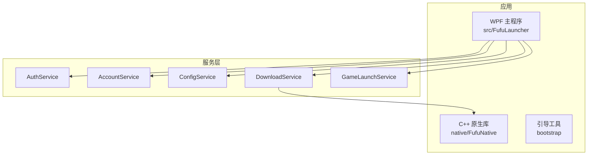
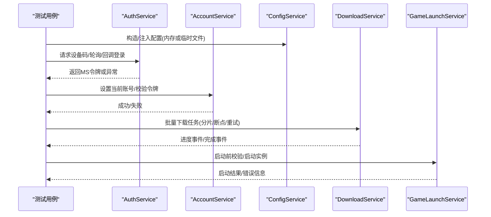
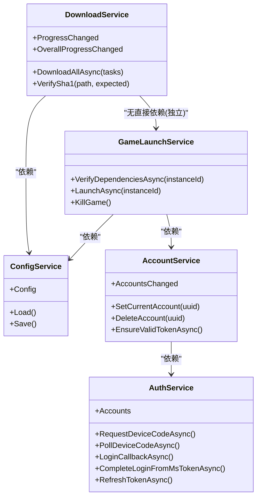

# 测试和模拟数据准备

<cite>
**本文引用的文件**   
- [README.md](file://README.md)
- [FufuLauncher.csproj](file://src/FufuLauncher/FufuLauncher.csproj)
- [bootstrap.csproj](file://bootstrap/bootstrap.csproj)
- [AuthService.cs](file://src/FufuLauncher/Services/AuthService.cs)
- [AccountService.cs](file://src/FufuLauncher/Services/AccountService.cs)
- [ConfigService.cs](file://src/FufuLauncher/Services/ConfigService.cs)
- [DownloadService.cs](file://src/FufuLauncher/Services/DownloadService.cs)
- [GameLaunchService.cs](file://src/FufuLauncher/Services/GameLaunchService.cs)
- [config.json](file://Start/appmcGAME/config.json)
</cite>

## 目录
1. [简介](#简介)
2. [项目结构](#项目结构)
3. [核心组件](#核心组件)
4. [架构总览](#架构总览)
5. [详细组件分析](#详细组件分析)
6. [依赖关系分析](#依赖关系分析)
7. [性能考量](#性能考量)
8. [故障排查指南](#故障排查指南)
9. [结论](#结论)
10. [附录](#附录)

## 简介
本文件面向“可爱的芙芙启动器”的测试与模拟数据准备，提供从单元测试框架选型、Mock 策略、测试数据组织、集成测试设计、性能测试到持续集成与覆盖率分析的完整实践指南。内容基于仓库现有服务层代码（账号认证、下载、配置、游戏启动等）进行拆解，确保读者能在不深入源码细节的情况下快速搭建可维护、可扩展的测试体系。

## 项目结构
- 解决方案包含 WPF 主程序、C++ 原生库、引导工具与打包脚本。
- 测试相关建议：
  - 为每个业务服务创建独立测试项目（xUnit + FluentAssertions + Moq）。
  - 将 JSON 测试数据集中管理，便于复用与维护。
  - 通过配置文件与 Mock 隔离外部依赖（网络、文件系统、进程）。

图表来源
- [FufuLauncher.csproj:1-49](file://src/FufuLauncher/FufuLauncher.csproj#L1-L49)
- [README.md:34-53](file://README.md#L34-L53)

章节来源
- [README.md:11-53](file://README.md#L11-L53)
- [FufuLauncher.csproj:1-49](file://src/FufuLauncher/FufuLauncher.csproj#L1-L49)

## 核心组件
- AuthService：微软设备码/本地回调登录、XBL/XSTS/Minecraft 令牌链、离线账号、Token 刷新与持久化。
- AccountService：账号列表、当前账号切换、删除、令牌有效性校验与自动刷新。
- ConfigService：用户配置加载/保存、旧字段迁移、默认值与扩展项。
- DownloadService：多线程分片断点续传、SHA1 校验、源降级、全局进度统计。
- GameLaunchService：依赖校验、Java 完整性检查、JVM 参数拼接、进程启动与监控。

章节来源
- [AuthService.cs:76-121](file://src/FufuLauncher/Services/AuthService.cs#L76-L121)
- [AccountService.cs:12-26](file://src/FufuLauncher/Services/AccountService.cs#L12-L26)
- [ConfigService.cs:88-100](file://src/FufuLauncher/Services/ConfigService.cs#L88-L100)
- [DownloadService.cs:56-114](file://src/FufuLauncher/Services/DownloadService.cs#L56-L114)
- [GameLaunchService.cs:35-65](file://src/FufuLauncher/Services/GameLaunchService.cs#L35-L65)

## 架构总览
下图展示关键业务流程在测试中的交互边界与 Mock 注入点。

图表来源
- [AuthService.cs:159-265](file://src/FufuLauncher/Services/AuthService.cs#L159-L265)
- [AccountService.cs:28-52](file://src/FufuLauncher/Services/AccountService.cs#L28-L52)
- [DownloadService.cs:222-261](file://src/FufuLauncher/Services/DownloadService.cs#L222-L261)
- [GameLaunchService.cs:104-176](file://src/FufuLauncher/Services/GameLaunchService.cs#L104-L176)

## 详细组件分析

### 单元测试框架选择与配置
- 推荐框架：xUnit（异步友好、生态完善），搭配 FluentAssertions（可读性断言）、Moq（轻量 Mock）。
- 项目模板：
  - .NET 8 xUnit 测试项目（Console 输出，便于 CI 执行）。
  - 使用 Directory.Build.props 统一包版本与公共引用。
- 运行方式：
  - 本地：dotnet test --filter "Category=Unit"
  - CI：dotnet test --no-build --configuration Release

章节来源
- [FufuLauncher.csproj:1-49](file://src/FufuLauncher/FufuLauncher.csproj#L1-L49)
- [bootstrap.csproj:1-18](file://bootstrap/bootstrap.csproj#L1-L18)

### Mock 对象创建与使用
- 目标：隔离网络、文件系统、进程、原生 DLL 调用。
- 常用策略：
  - 对 HttpClient 使用自定义 HttpMessageHandler 或 WireMock/TestServer。
  - 对文件操作使用 InMemoryFileSystem 或临时目录。
  - 对进程与系统 API 使用接口抽象后 Mock。
  - 对 NativeInteropService 计算 SHA1 的方法进行 Mock。

示例要点（以路径代替代码片段）：
- 模拟设备码登录流程：[AuthService.cs:159-265](file://src/FufuLauncher/Services/AuthService.cs#L159-L265)
- 模拟下载分片与断点续传：[DownloadService.cs:369-451](file://src/FufuLauncher/Services/DownloadService.cs#L369-L451)
- 模拟 Java 完整性校验与进程启动：[GameLaunchService.cs:157-177](file://src/FufuLauncher/Services/GameLaunchService.cs#L157-L177)

章节来源
- [AuthService.cs:159-265](file://src/FufuLauncher/Services/AuthService.cs#L159-L265)
- [DownloadService.cs:369-451](file://src/FufuLauncher/Services/DownloadService.cs#L369-L451)
- [GameLaunchService.cs:157-177](file://src/FufuLauncher/Services/GameLaunchService.cs#L157-L177)

### 测试数据准备（JSON 结构与内容）
- 账号数据：按 UUID 命名 JSON 文件，包含类型、用户名、UUID、访问令牌、刷新令牌、过期时间等。
- 配置数据：统一的 AppConfig 模型，支持旧字段迁移与默认值。
- 建议：
  - 在测试项目中维护 fixtures 目录，存放标准账号与配置样例。
  - 使用 JsonDocument 或反序列化为对象进行断言。

参考路径：
- 账号持久化与读取：[AuthService.cs:123-155](file://src/FufuLauncher/Services/AuthService.cs#L123-L155)
- 配置模型与迁移：[ConfigService.cs:13-86](file://src/FufuLauncher/Services/ConfigService.cs#L13-L86)
- 运行时配置样例：[config.json:1-34](file://Start/appmcGAME/config.json#L1-L34)

章节来源
- [AuthService.cs:123-155](file://src/FufuLauncher/Services/AuthService.cs#L123-L155)
- [ConfigService.cs:13-86](file://src/FufuLauncher/Services/ConfigService.cs#L13-L86)
- [config.json:1-34](file://Start/appmcGAME/config.json#L1-L34)

### 集成测试实现（端到端验证）
- 目标：验证“登录 → 令牌刷新 → 下载资源 → 启动游戏”的完整链路。
- 设计要点：
  - 使用真实或 Mock 的网络端点（如 TestServer/WireMock）。
  - 使用临时目录作为 AppDataDir，避免污染真实环境。
  - 控制并发与超时，确保稳定性。
  - 断言关键状态：账号存在、令牌有效、文件校验通过、进程启动成功。

关键流程参考：
- 设备码登录与令牌链：[AuthService.cs:159-398](file://src/FufuLauncher/Services/AuthService.cs#L159-L398)
- 批量下载与进度上报：[DownloadService.cs:222-261](file://src/FufuLauncher/Services/DownloadService.cs#L222-L261)
- 启动前校验与进程启动：[GameLaunchService.cs:104-176](file://src/FufuLauncher/Services/GameLaunchService.cs#L104-L176)

章节来源
- [AuthService.cs:159-398](file://src/FufuLauncher/Services/AuthService.cs#L159-L398)
- [DownloadService.cs:222-261](file://src/FufuLauncher/Services/DownloadService.cs#L222-L261)
- [GameLaunchService.cs:104-176](file://src/FufuLauncher/Services/GameLaunchService.cs#L104-L176)

### 性能测试编写（响应时间与吞吐）
- 关注点：
  - 登录令牌链耗时（设备码轮询、XBL/XSTS/MC 各阶段）。
  - 大文件分片下载吞吐与稳定性。
  - 启动前依赖校验与 Java 完整性检查耗时。
- 方法：
  - 使用 BenchmarkDotNet 对关键方法进行基准测试。
  - 使用 Load Testing（如 k6/JMeter）模拟多任务下载。
  - 记录并断言 P95/P99 延迟与吞吐阈值。

参考实现位置：
- 令牌链与轮询：[AuthService.cs:198-265](file://src/FufuLauncher/Services/AuthService.cs#L198-L265)
- 分片下载与进度节流：[DownloadService.cs:453-547](file://src/FufuLauncher/Services/DownloadService.cs#L453-L547)
- 启动校验与进程优化：[GameLaunchService.cs:179-225](file://src/FufuLauncher/Services/GameLaunchService.cs#L179-L225)

章节来源
- [AuthService.cs:198-265](file://src/FufuLauncher/Services/AuthService.cs#L198-L265)
- [DownloadService.cs:453-547](file://src/FufuLauncher/Services/DownloadService.cs#L453-L547)
- [GameLaunchService.cs:179-225](file://src/FufuLauncher/Services/GameLaunchService.cs#L179-L225)

### 自动化测试集成（CI/CD）
- 建议：
  - 在 GitHub Actions/Azure DevOps 中定义 dotnet test 步骤。
  - 缓存 NuGet 包与构建产物，加速流水线。
  - 并行执行 Unit/Integration/Benchmark 三类测试。
  - 生成覆盖率报告（OpenCover/Coverlet）并上传。

参考入口：
- 解决方案与目标框架：[FufuLauncher.csproj:1-49](file://src/FufuLauncher/FufuLauncher.csproj#L1-L49)
- 引导工具（可选测试）：[bootstrap.csproj:1-18](file://bootstrap/bootstrap.csproj#L1-L18)

章节来源
- [FufuLauncher.csproj:1-49](file://src/FufuLauncher/FufuLauncher.csproj#L1-L49)
- [bootstrap.csproj:1-18](file://bootstrap/bootstrap.csproj#L1-L18)

### 测试覆盖率分析（质量门禁）
- 工具：Coverlet + ReportGenerator。
- 指标：行覆盖率、分支覆盖率、方法覆盖率。
- 门禁：设定最低阈值（如行覆盖率≥80%），未达标则阻断合并。

参考位置：
- 配置与依赖注入：[ConfigService.cs:88-100](file://src/FufuLauncher/Services/ConfigService.cs#L88-L100)
- 下载服务事件与统计：[DownloadService.cs:84-98](file://src/FufuLauncher/Services/DownloadService.cs#L84-L98)

章节来源
- [ConfigService.cs:88-100](file://src/FufuLauncher/Services/ConfigService.cs#L88-L100)
- [DownloadService.cs:84-98](file://src/FufuLauncher/Services/DownloadService.cs#L84-L98)

### 测试环境搭建与维护指南
- 环境要求：
  - Visual Studio 2022 (.NET 8 Desktop SDK)、C++ 桌面开发组件、Windows SDK。
  - 目标机器安装 .NET 8 Desktop Runtime。
- 维护要点：
  - 固定第三方包版本，定期安全更新。
  - 使用容器或专用 VM 隔离测试环境。
  - 清理临时目录与日志，避免磁盘占用。

参考说明：
- 编译环境与构建步骤：[README.md:11-33](file://README.md#L11-L33)
- 运行时依赖说明：[README.md:77-83](file://README.md#L77-L83)

章节来源
- [README.md:11-33](file://README.md#L11-L33)
- [README.md:77-83](file://README.md#L77-L83)

## 依赖关系分析
- 服务间耦合：
  - AccountService 依赖 AuthService。
  - GameLaunchService 依赖多个服务（Instance、VersionManifest、HashVerify、Account、GameLog、Config、JavaRuntime、MemoryMonitor）。
  - DownloadService 依赖 ConfigService 与 NativeInteropService。
- 外部依赖：
  - 网络（HttpClient、HttpListener）。
  - 文件系统（账户 JSON、配置 JSON、下载文件）。
  - 原生库（SHA1 校验）。

图表来源
- [AccountService.cs:12-26](file://src/FufuLauncher/Services/AccountService.cs#L12-L26)
- [AuthService.cs:76-121](file://src/FufuLauncher/Services/AuthService.cs#L76-L121)
- [ConfigService.cs:88-100](file://src/FufuLauncher/Services/ConfigService.cs#L88-L100)
- [DownloadService.cs:56-114](file://src/FufuLauncher/Services/DownloadService.cs#L56-L114)
- [GameLaunchService.cs:35-65](file://src/FufuLauncher/Services/GameLaunchService.cs#L35-L65)

章节来源
- [AccountService.cs:12-26](file://src/FufuLauncher/Services/AccountService.cs#L12-L26)
- [AuthService.cs:76-121](file://src/FufuLauncher/Services/AuthService.cs#L76-L121)
- [ConfigService.cs:88-100](file://src/FufuLauncher/Services/ConfigService.cs#L88-L100)
- [DownloadService.cs:56-114](file://src/FufuLauncher/Services/DownloadService.cs#L56-L114)
- [GameLaunchService.cs:35-65](file://src/FufuLauncher/Services/GameLaunchService.cs#L35-L65)

## 性能考量
- 登录链路：设备码轮询间隔与超时、令牌交换失败重试策略。
- 下载引擎：分片数量、并发信号量、节流频率、指数退避。
- 启动流程：依赖校验范围、Java 完整性检查、进程优先级与亲和性设置。
- 建议：
  - 对热点路径添加计时与度量（Stopwatch、Activity、Telemetry）。
  - 使用压测工具模拟高并发下载与多实例启动。
  - 监控内存与 CPU 占用，避免 GC 抖动。

参考位置：
- 轮询与超时：[AuthService.cs:198-265](file://src/FufuLauncher/Services/AuthService.cs#L198-L265)
- 分片与节流：[DownloadService.cs:453-547](file://src/FufuLauncher/Services/DownloadService.cs#L453-L547)
- 启动优化：[GameLaunchService.cs:215-225](file://src/FufuLauncher/Services/GameLaunchService.cs#L215-L225)

章节来源
- [AuthService.cs:198-265](file://src/FufuLauncher/Services/AuthService.cs#L198-L265)
- [DownloadService.cs:453-547](file://src/FufuLauncher/Services/DownloadService.cs#L453-L547)
- [GameLaunchService.cs:215-225](file://src/FufuLauncher/Services/GameLaunchService.cs#L215-L225)

## 故障排查指南
- 常见问题：
  - 设备码过期/用户取消：检查轮询逻辑与取消令牌传播。
  - 令牌交换失败：查看网络状态、User-Agent、重定向 URI。
  - 下载失败：确认源 URL、分片大小、SHA1 校验、磁盘空间。
  - 启动失败：Java 路径与完整性、依赖缺失、权限不足。
- 定位手段：
  - 启用详细日志（App.WriteAppLog）。
  - 使用临时目录与最小化复现用例。
  - 逐步隔离依赖（Mock 网络/文件/进程）。

参考位置：
- 登录异常处理：[AuthService.cs:183-265](file://src/FufuLauncher/Services/AuthService.cs#L183-L265)
- 下载失败与重试：[DownloadService.cs:305-366](file://src/FufuLauncher/Services/DownloadService.cs#L305-L366)
- 启动前校验与提示：[GameLaunchService.cs:112-176](file://src/FufuLauncher/Services/GameLaunchService.cs#L112-L176)

章节来源
- [AuthService.cs:183-265](file://src/FufuLauncher/Services/AuthService.cs#L183-L265)
- [DownloadService.cs:305-366](file://src/FufuLauncher/Services/DownloadService.cs#L305-L366)
- [GameLaunchService.cs:112-176](file://src/FufuLauncher/Services/GameLaunchService.cs#L112-L176)

## 结论
通过分层测试策略（单元、集成、性能）与完善的 Mock/数据准备，可在保证质量的同时提升迭代效率。结合 CI/CD 与覆盖率门禁，可有效降低回归风险并保障用户体验。建议在后续迭代中持续完善测试套件，覆盖更多边界场景与异常路径。

## 附录
- 测试数据样例（账号 JSON 字段建议）：
  - Type、Username、Uuid、AccessToken、MicrosoftRefreshToken、TokenExpiresAt、AddedAt
- 配置样例（参考）：[config.json:1-34](file://Start/appmcGAME/config.json#L1-L34)
- 构建与运行环境说明：[README.md:11-33](file://README.md#L11-L33)

章节来源
- [config.json:1-34](file://Start/appmcGAME/config.json#L1-L34)
- [README.md:11-33](file://README.md#L11-L33)