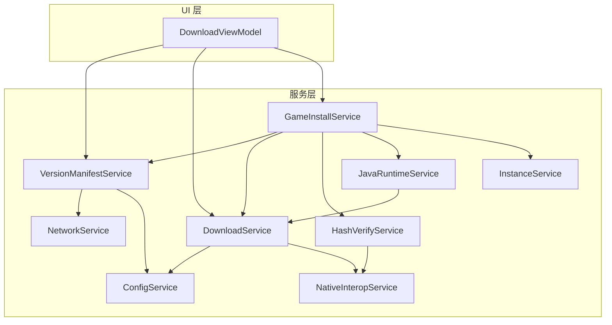
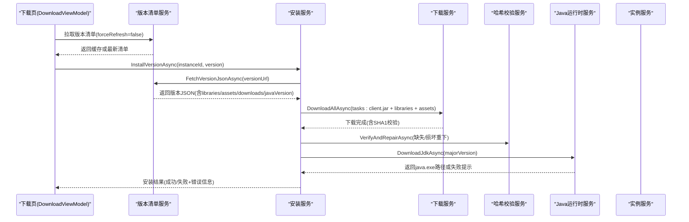
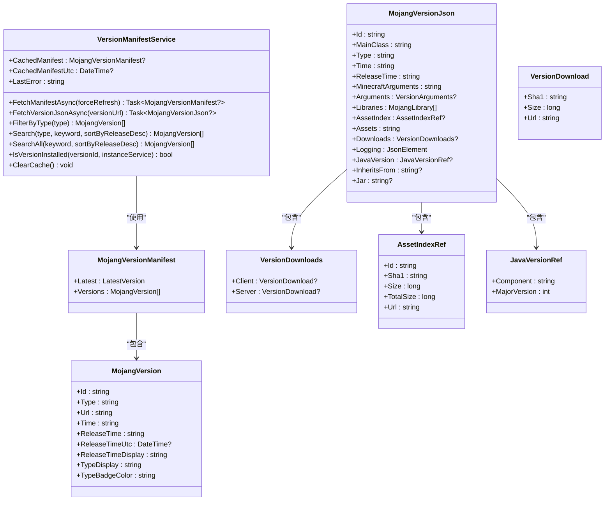
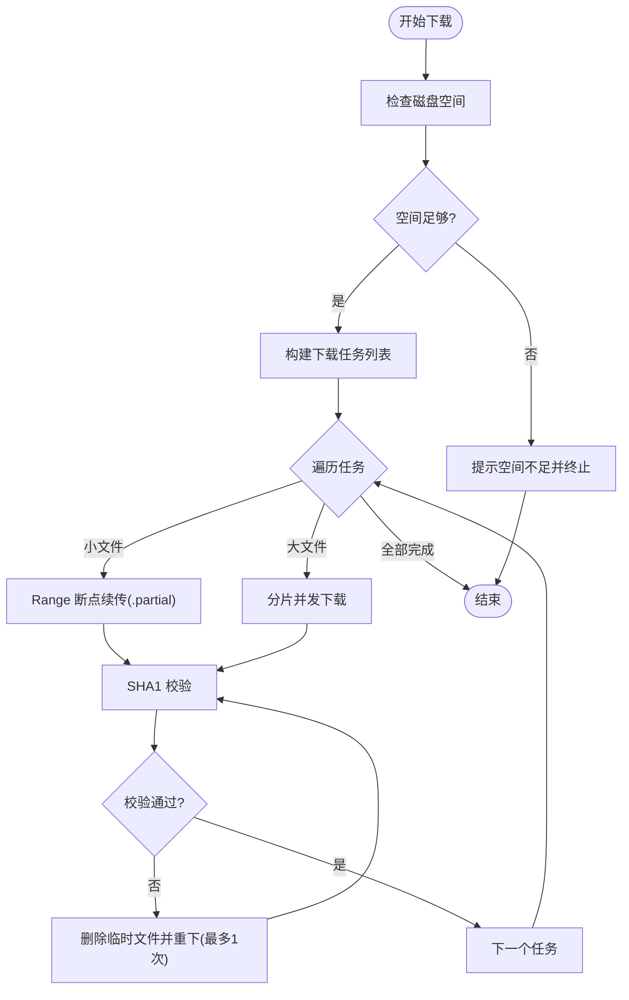
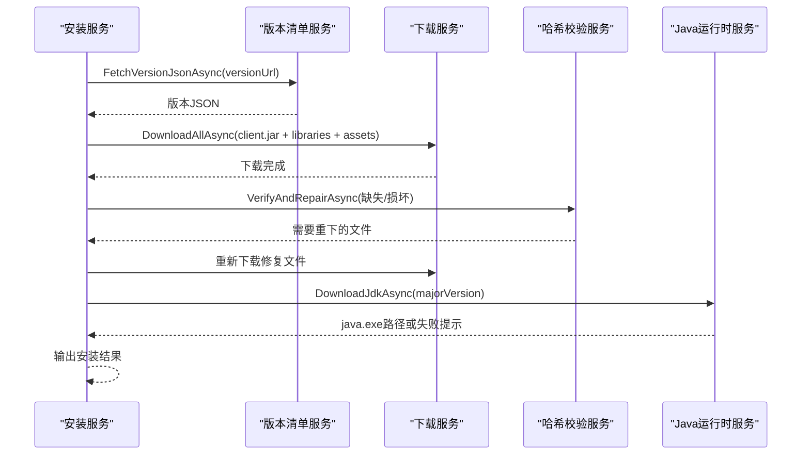
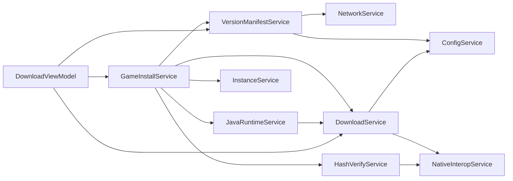

# 版本管理集成

<cite>
**本文引用的文件**   
- [VersionManifestService.cs](file://src/FufuLauncher/Services/VersionManifestService.cs)
- [DownloadService.cs](file://src/FufuLauncher/Services/DownloadService.cs)
- [GameInstallService.cs](file://src/FufuLauncher/Services/GameInstallService.cs)
- [HashVerifyService.cs](file://src/FufuLauncher/Services/HashVerifyService.cs)
- [JavaRuntimeService.cs](file://src/FufuLauncher/Services/JavaRuntimeService.cs)
- [InstanceService.cs](file://src/FufuLauncher/Services/InstanceService.cs)
- [ConfigService.cs](file://src/FufuLauncher/Services/ConfigService.cs)
- [NetworkService.cs](file://src/FufuLauncher/Services/NetworkService.cs)
- [NativeInteropService.cs](file://src/FufuLauncher/Services/NativeInteropService.cs)
- [DownloadViewModel.cs](file://src/FufuLauncher/ViewModels/DownloadViewModel.cs)
</cite>

## 目录
1. [简介](#简介)
2. [项目结构](#项目结构)
3. [核心组件](#核心组件)
4. [架构总览](#架构总览)
5. [详细组件分析](#详细组件分析)
6. [依赖关系分析](#依赖关系分析)
7. [性能考量](#性能考量)
8. [故障排查指南](#故障排查指南)
9. [结论](#结论)
10. [附录](#附录)

## 简介
本文件面向“可爱的芙芙启动器”的版本管理系统，提供从官方服务器获取 Minecraft 版本清单、解析 release/snapshot 版本、下载游戏核心与库/资源文件、校验完整性、缓存策略、版本切换以及元数据解析（Java 要求、模组加载器支持、启动参数）的完整示例说明。文档以代码级实现为依据，结合流程图与序列图帮助读者快速理解并落地集成。

## 项目结构
围绕版本管理的核心服务位于 Services 层，视图模型在 ViewModels 层负责 UI 交互与状态展示；配置与网络能力由 ConfigService 与 NetworkService 提供；原生加速通过 NativeInteropService 封装。

图表来源
- [DownloadViewModel.cs](file://src/FufuLauncher/ViewModels/DownloadViewModel.cs)
- [VersionManifestService.cs](file://src/FufuLauncher/Services/VersionManifestService.cs)
- [DownloadService.cs](file://src/FufuLauncher/Services/DownloadService.cs)
- [GameInstallService.cs](file://src/FufuLauncher/Services/GameInstallService.cs)
- [HashVerifyService.cs](file://src/FufuLauncher/Services/HashVerifyService.cs)
- [JavaRuntimeService.cs](file://src/FufuLauncher/Services/JavaRuntimeService.cs)
- [InstanceService.cs](file://src/FufuLauncher/Services/InstanceService.cs)
- [ConfigService.cs](file://src/FufuLauncher/Services/ConfigService.cs)
- [NetworkService.cs](file://src/FufuLauncher/Services/NetworkService.cs)
- [NativeInteropService.cs](file://src/FufuLauncher/Services/NativeInteropService.cs)

章节来源
- [VersionManifestService.cs:172-338](file://src/FufuLauncher/Services/VersionManifestService.cs#L172-L338)
- [DownloadService.cs:56-592](file://src/FufuLauncher/Services/DownloadService.cs#L56-L592)
- [GameInstallService.cs:50-457](file://src/FufuLauncher/Services/GameInstallService.cs#L50-L457)
- [DownloadViewModel.cs:10-307](file://src/FufuLauncher/ViewModels/DownloadViewModel.cs#L10-L307)

## 核心组件
- 版本清单服务：拉取 version_manifest_v2.json，分类 release/snapshot/old_beta/old_alpha，并提供搜索、过滤、本地缓存与 URL 重写（Mojang/BMCLAPI）。
- 下载服务：多线程分片断点续传、双进度（单文件+全局）、失败重试、SHA1 校验、源降级（官方→BMCLAPI）。
- 安装服务：按版本 JSON 组装下载任务（client.jar、libraries/natives、asset index + assets），自动修复损坏文件，按需下载匹配的 Java 运行时。
- 哈希校验服务：基于原生或托管实现的 SHA1 校验，批量校验返回需重下列表。
- Java 运行时服务：按主版本下载完整 JDK（Adoptium/华为云镜像），解压与目录整理，列出已安装运行环境。
- 实例服务：多实例隔离目录结构、创建/复制/导入/导出、路径工具方法。
- 配置服务：下载源、Java 镜像、JVM 参数、分辨率等持久化。
- 网络服务：连通性检测与延迟统计，定义 Mojang/BMCLAPI 清单端点。
- 原生互操作：SHA1/ZIP 的高性能实现与托管回退。

章节来源
- [VersionManifestService.cs:16-338](file://src/FufuLauncher/Services/VersionManifestService.cs#L16-L338)
- [DownloadService.cs:28-592](file://src/FufuLauncher/Services/DownloadService.cs#L28-L592)
- [GameInstallService.cs:22-457](file://src/FufuLauncher/Services/GameInstallService.cs#L22-L457)
- [HashVerifyService.cs:13-85](file://src/FufuLauncher/Services/HashVerifyService.cs#L13-L85)
- [JavaRuntimeService.cs:25-527](file://src/FufuLauncher/Services/JavaRuntimeService.cs#L25-L527)
- [InstanceService.cs:27-253](file://src/FufuLauncher/Services/InstanceService.cs#L27-L253)
- [ConfigService.cs:13-152](file://src/FufuLauncher/Services/ConfigService.cs#L13-L152)
- [NetworkService.cs:18-95](file://src/FufuLauncher/Services/NetworkService.cs#L18-L95)
- [NativeInteropService.cs:20-214](file://src/FufuLauncher/Services/NativeInteropService.cs#L20-L214)

## 架构总览
版本管理的关键流程包括：拉取清单 → 解析版本 → 构建下载任务 → 执行下载与校验 → 自动修复 → 可选下载 Java → 完成安装。

图表来源
- [DownloadViewModel.cs:156-193](file://src/FufuLauncher/ViewModels/DownloadViewModel.cs#L156-L193)
- [VersionManifestService.cs:205-292](file://src/FufuLauncher/Services/VersionManifestService.cs#L205-L292)
- [GameInstallService.cs:83-286](file://src/FufuLauncher/Services/GameInstallService.cs#L83-L286)
- [DownloadService.cs:222-366](file://src/FufuLauncher/Services/DownloadService.cs#L222-L366)
- [HashVerifyService.cs:33-85](file://src/FufuLauncher/Services/HashVerifyService.cs#L33-L85)
- [JavaRuntimeService.cs:199-277](file://src/FufuLauncher/Services/JavaRuntimeService.cs#L199-L277)

## 详细组件分析

### 版本清单服务（VersionManifestService）
- 功能要点
  - 拉取 version_manifest_v2.json，优先 BMCLAPI/Mojang 根据配置选择，失败自动回退。
  - 内存缓存清单与最后更新时间，避免频繁网络请求。
  - 提供类型过滤、关键词搜索、排序（发布时间倒序或 ID 倒序）。
  - 版本 JSON 拉取时统一 URL 重写规则，保持与下载服务一致的源映射。
- 关键数据结构
  - MojangVersionManifest/LatestVersion/MojangVersion：清单与版本条目。
  - MojangVersionJson/VersionArguments/MojangLibrary/LibraryDownloads/LibraryArtifact/AssetIndexRef/VersionDownloads/VersionDownload/JavaVersionRef：版本详情、库、资产索引、下载信息与 Java 要求。
- 错误处理
  - LastError 记录最后一次拉取失败的异常信息，供 UI 展示。
  - 网络全失败时返回旧缓存，不阻塞 UI。

图表来源
- [VersionManifestService.cs:16-171](file://src/FufuLauncher/Services/VersionManifestService.cs#L16-L171)
- [VersionManifestService.cs:172-338](file://src/FufuLauncher/Services/VersionManifestService.cs#L172-L338)

章节来源
- [VersionManifestService.cs:16-338](file://src/FufuLauncher/Services/VersionManifestService.cs#L16-L338)

### 下载服务（DownloadService）
- 功能要点
  - 多线程并发下载，按类别独立信号量控制（Game/Asset/Java/Mod/Other）。
  - 大文件分片下载（≥8MB），小文件 Range 断点续传（.partial 临时文件）。
  - 双进度事件：单文件字节级进度与全局总进度（节流 150ms）。
  - 失败指数退避重试（默认 3 次），完成后 SHA1 校验，失败自动重下一次。
  - 下载源切换：GetSourceUrl/ForceBmclUrl 将 Mojang URL 替换为 BMCLAPI。
- 关键数据结构
  - DownloadTaskItem：URL、本地路径、SHA1、大小、类别、是否分片、状态等。
  - DownloadProgressInfo：总字节、已下载、速度、剩余时间、进度百分比。
- 错误处理
  - 磁盘空间不足提前拦截并提示。
  - 每步异常记录日志，最终失败触发 TaskFailed 事件。

图表来源
- [DownloadService.cs:222-366](file://src/FufuLauncher/Services/DownloadService.cs#L222-L366)
- [DownloadService.cs:368-547](file://src/FufuLauncher/Services/DownloadService.cs#L368-L547)

章节来源
- [DownloadService.cs:56-592](file://src/FufuLauncher/Services/DownloadService.cs#L56-L592)

### 安装服务（GameInstallService）
- 功能要点
  - 拉取版本 JSON，保存至实例 versions/{id}/{id}.json。
  - 构建下载任务：client.jar、libraries（artifact + natives）、asset index + assets。
  - 执行下载后校验并修复损坏/缺失文件。
  - 自动下载匹配的 Java 运行时（失败不阻塞安装，仅提示）。
  - 主页完整性快速校验（仅检查关键文件存在性）。
- 关键数据结构
  - AssetIndexManifest/AssetObject：资产索引与对象。
  - InstallProgress：阶段、当前/总数、当前文件。
  - IntegrityCheckResult：快速校验结果（缺失/损坏/摘要）。
- 操作系统规则
  - IsLibraryAllowedForOs 根据 rules 的 allow/disallow 与 Os.Name 判断库是否适用。

图表来源
- [GameInstallService.cs:83-286](file://src/FufuLauncher/Services/GameInstallService.cs#L83-L286)
- [GameInstallService.cs:288-323](file://src/FufuLauncher/Services/GameInstallService.cs#L288-L323)
- [GameInstallService.cs:325-424](file://src/FufuLauncher/Services/GameInstallService.cs#L325-L424)

章节来源
- [GameInstallService.cs:50-457](file://src/FufuLauncher/Services/GameInstallService.cs#L50-L457)

### 哈希校验服务（HashVerifyService）
- 功能要点
  - 单个文件校验：存在性、大小匹配、SHA1 比对。
  - 批量校验：返回需重下载的文件列表。
  - 底层调用 NativeInteropService.ComputeFileSHA1，失败回退托管实现。

章节来源
- [HashVerifyService.cs:13-85](file://src/FufuLauncher/Services/HashVerifyService.cs#L13-L85)
- [NativeInteropService.cs:38-73](file://src/FufuLauncher/Services/NativeInteropService.cs#L38-L73)

### Java 运行时服务（JavaRuntimeService）
- 功能要点
  - 支持多主版本 JDK 下载（Adoptium/华为云镜像）。
  - 下载 zip 后解压到 runtimes/jdk-{major}-{arch}，自动上提内层目录。
  - 列出已安装运行环境，探测主版本与架构（java -version）。
  - 完整性校验（java.exe 存在且可执行）。

章节来源
- [JavaRuntimeService.cs:25-527](file://src/FufuLauncher/Services/JavaRuntimeService.cs#L25-L527)

### 实例服务（InstanceService）
- 功能要点
  - 多实例隔离目录结构（.minecraft、mods、saves、resourcepacks、shaderpacks）。
  - 创建/复制/删除/导入已有 .minecraft/导出 zip 备份。
  - 提供路径工具方法（GetMinecraftDir/GetModsDir 等）。

章节来源
- [InstanceService.cs:27-253](file://src/FufuLauncher/Services/InstanceService.cs#L27-L253)

### 配置服务（ConfigService）
- 功能要点
  - 下载源（Mojang/BMCLAPI）、Java 镜像（Official/Huaweicloud）、JVM 参数、分辨率等。
  - 配置迁移兼容旧字段（背景相关）。

章节来源
- [ConfigService.cs:13-152](file://src/FufuLauncher/Services/ConfigService.cs#L13-L152)

### 网络服务（NetworkService）
- 功能要点
  - 连通性检测与延迟统计（Mojang/BMCLAPI）。
  - 定义清单端点常量。

章节来源
- [NetworkService.cs:18-95](file://src/FufuLauncher/Services/NetworkService.cs#L18-L95)

### 原生互操作（NativeInteropService）
- 功能要点
  - SHA1/SHA256 计算与 ZIP 解压/打包，优先原生 DLL，失败回退托管实现。
  - 首次调用探测可用性并缓存结果。

章节来源
- [NativeInteropService.cs:20-214](file://src/FufuLauncher/Services/NativeInteropService.cs#L20-L214)

### 下载页视图模型（DownloadViewModel）
- 功能要点
  - 页面加载时优先使用缓存清单，零网络刷新。
  - 订阅安装与下载进度事件，更新 UI（总进度、子进度、速度、状态文本）。
  - 下载并安装选中的版本，引导创建新实例或使用当前实例。

章节来源
- [DownloadViewModel.cs:10-307](file://src/FufuLauncher/ViewModels/DownloadViewModel.cs#L10-L307)

## 依赖关系分析
- 版本清单服务依赖配置与网络服务，提供清单与版本 JSON 拉取、缓存与 URL 重写。
- 安装服务组合版本清单、下载、哈希校验、Java 运行时与实例服务，编排完整安装流程。
- 下载服务依赖配置与原生互操作，提供高性能下载与校验。
- Java 运行时服务依赖下载服务与配置，实现多镜像源 JDK 下载与解压。
- 视图模型依赖各服务，驱动 UI 行为与状态绑定。

图表来源
- [VersionManifestService.cs:172-338](file://src/FufuLauncher/Services/VersionManifestService.cs#L172-L338)
- [DownloadService.cs:56-592](file://src/FufuLauncher/Services/DownloadService.cs#L56-L592)
- [GameInstallService.cs:50-457](file://src/FufuLauncher/Services/GameInstallService.cs#L50-L457)
- [JavaRuntimeService.cs:25-527](file://src/FufuLauncher/Services/JavaRuntimeService.cs#L25-L527)
- [DownloadViewModel.cs:10-307](file://src/FufuLauncher/ViewModels/DownloadViewModel.cs#L10-L307)

章节来源
- [VersionManifestService.cs:172-338](file://src/FufuLauncher/Services/VersionManifestService.cs#L172-L338)
- [DownloadService.cs:56-592](file://src/FufuLauncher/Services/DownloadService.cs#L56-L592)
- [GameInstallService.cs:50-457](file://src/FufuLauncher/Services/GameInstallService.cs#L50-L457)
- [JavaRuntimeService.cs:25-527](file://src/FufuLauncher/Services/JavaRuntimeService.cs#L25-L527)
- [DownloadViewModel.cs:10-307](file://src/FufuLauncher/ViewModels/DownloadViewModel.cs#L10-L307)

## 性能考量
- 清单缓存：内存缓存清单与最后更新时间，避免重复网络请求。
- 下载优化：
  - 大文件分片并发下载（≥8MB），小文件 Range 断点续传。
  - 各类别独立信号量，互不阻塞。
  - 全局总进度节流 150ms，提升 UI 流畅度。
- 校验与修复：SHA1 校验失败自动重下一次，减少用户干预。
- 原生加速：SHA1/ZIP 优先原生实现，失败回退托管。

[本节为通用指导，无需引用具体文件]

## 故障排查指南
- 无法获取版本清单
  - 检查网络连通性（Mojang/BMCLAPI），查看 LastError 信息。
  - 尝试强制刷新清单（forceRefresh=true）。
- 下载失败或中断
  - 确认磁盘空间充足（CheckDiskSpace）。
  - 观察单文件进度与速度，检查网络稳定性。
  - 失败会指数退避重试，若仍失败查看 TaskFailed 事件错误信息。
- 校验失败
  - 下载完成后进行 SHA1 校验，失败自动删除临时文件并重下一次。
  - 安装后执行 VerifyAndRepairAsync 修复缺失/损坏文件。
- Java 运行时问题
  - 自动下载失败时查看 JavaAutoDownloadHint，前往 Java 页面手动下载。
  - 使用 VerifyJavaIntegrity 验证 java.exe 是否可用。

章节来源
- [VersionManifestService.cs:205-255](file://src/FufuLauncher/Services/VersionManifestService.cs#L205-L255)
- [DownloadService.cs:222-366](file://src/FufuLauncher/Services/DownloadService.cs#L222-L366)
- [GameInstallService.cs:288-323](file://src/FufuLauncher/Services/GameInstallService.cs#L288-L323)
- [JavaRuntimeService.cs:482-510](file://src/FufuLauncher/Services/JavaRuntimeService.cs#L482-L510)

## 结论
该版本管理系统以清晰的服务分层与强化的下载/校验机制为核心，实现了从清单拉取、版本解析、文件下载与校验、自动修复到 Java 运行时准备的全链路自动化。通过缓存策略、源降级与原生加速，兼顾了用户体验与系统稳定性。配合视图模型的进度反馈与错误提示，形成完整的版本管理与切换体验。

[本节为总结，无需引用具体文件]

## 附录
- 版本切换建议
  - 在设置中切换下载源（Mojang/BMCLAPI），必要时清空清单缓存后刷新。
  - 不同实例可独立配置 Java 主版本与 JVM 参数，便于多版本并行。
- 元数据解析要点
  - Java 主版本号来自 JavaVersion.MajorVersion。
  - 模组加载器支持可通过实例的 ModLoader/ModLoaderVersion 字段维护（由上层业务决定如何安装与注入）。
  - 启动参数可从 VersionArguments.Game/Jvm 或 MinecraftArguments 解析（由上层拼装命令行）。

[本节为补充说明，无需引用具体文件]