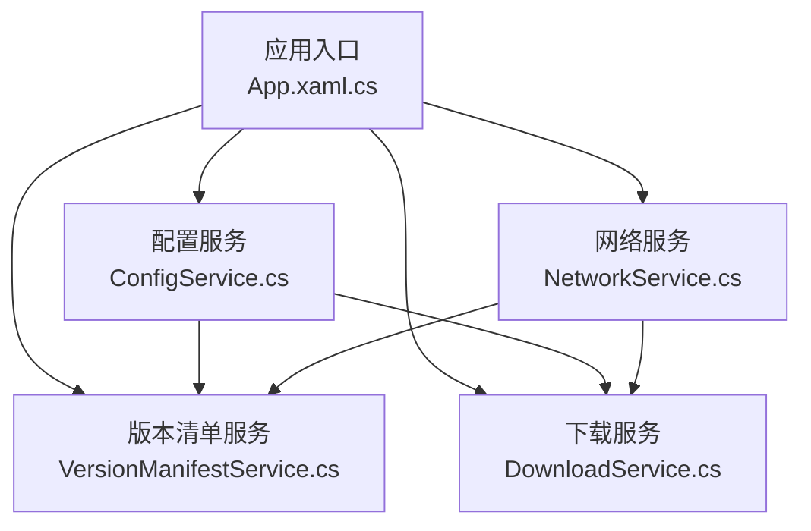
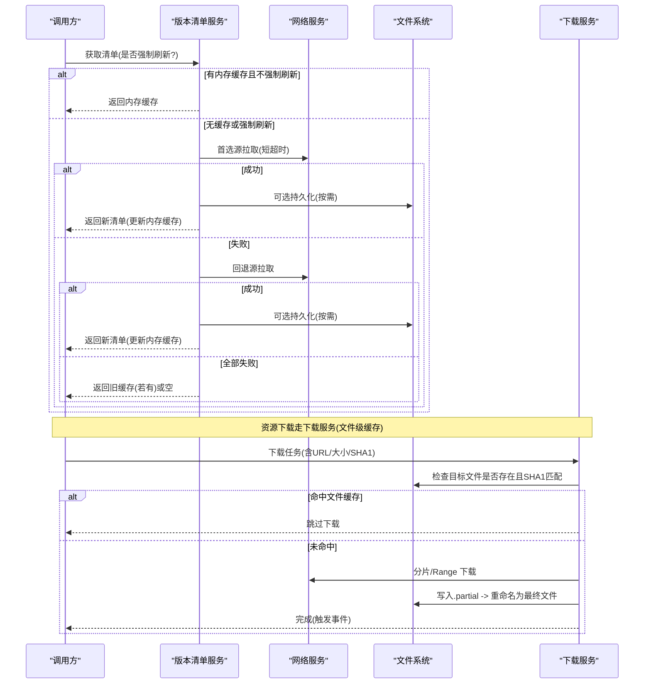
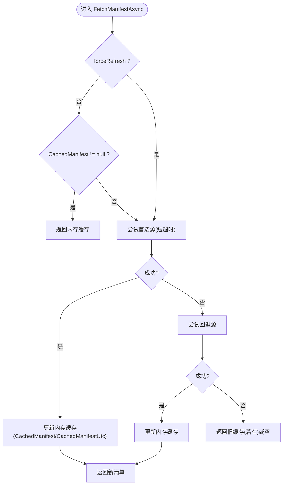
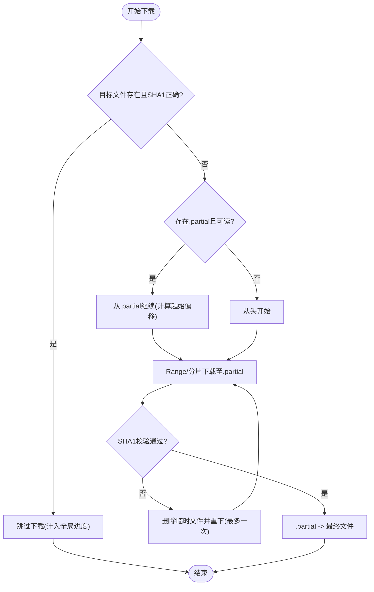
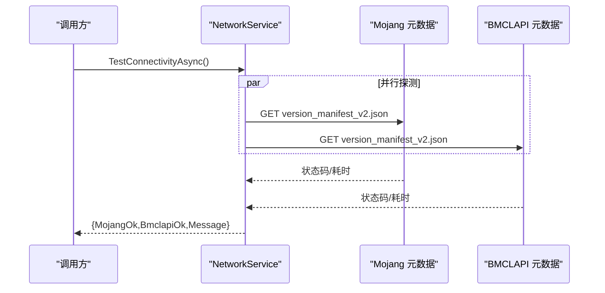
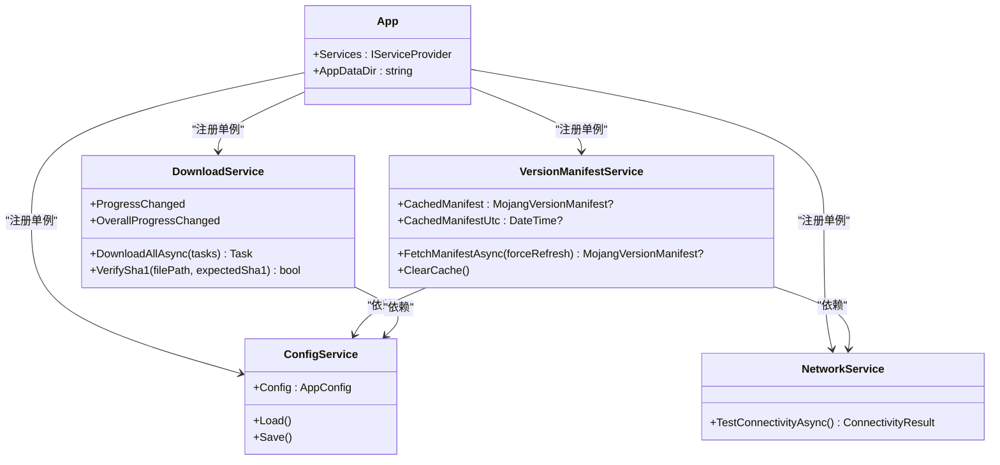

# 缓存策略实现

<cite>
**本文引用的文件**   
- [App.xaml.cs](file://src/FufuLauncher/App.xaml.cs)
- [ConfigService.cs](file://src/FufuLauncher/Services/ConfigService.cs)
- [NetworkService.cs](file://src/FufuLauncher/Services/NetworkService.cs)
- [VersionManifestService.cs](file://src/FufuLauncher/Services/VersionManifestService.cs)
- [DownloadService.cs](file://src/FufuLauncher/Services/DownloadService.cs)
</cite>

## 目录
1. [简介](#简介)
2. [项目结构](#项目结构)
3. [核心组件](#核心组件)
4. [架构总览](#架构总览)
5. [详细组件分析](#详细组件分析)
6. [依赖关系分析](#依赖关系分析)
7. [性能考量](#性能考量)
8. [故障排查指南](#故障排查指南)
9. [结论](#结论)
10. [附录](#附录)

## 简介
本文件为“可爱的芙芙启动器”的缓存策略实现示例文档，围绕多级缓存架构（内存、文件、网络）展开，给出键生成规则、失效策略、预热机制、监控统计与清理工具的设计建议，并结合现有代码中的实际实现进行对照说明。目标是让非技术读者也能理解整体设计，同时为开发者提供可落地的参考方案。

## 项目结构
- 应用入口负责初始化数据目录与 DI 容器，创建统一的 appmcGAME 目录，并预建 cache 等子目录，为后续文件级缓存奠定基础。
- 配置服务集中管理下载源、Java 镜像、JVM 参数等设置，影响缓存命中与回退路径选择。
- 网络服务用于连通性检测与延迟测量，辅助选择最优源与降级策略。
- 版本清单服务对 Mojang/BMCLAPI 的 manifest 做内存缓存，并提供按类型过滤与搜索能力。
- 下载服务实现断点续传、分片下载、SHA1 校验与失败重试，天然具备“文件级缓存”的能力。

**图表来源** 
- [App.xaml.cs:75-117](file://src/FufuLauncher/App.xaml.cs#L75-L117)
- [ConfigService.cs:88-152](file://src/FufuLauncher/Services/ConfigService.cs#L88-L152)
- [NetworkService.cs:18-95](file://src/FufuLauncher/Services/NetworkService.cs#L18-L95)
- [VersionManifestService.cs:172-255](file://src/FufuLauncher/Services/VersionManifestService.cs#L172-L255)
- [DownloadService.cs:56-114](file://src/FufuLauncher/Services/DownloadService.cs#L56-L114)

**章节来源**
- [App.xaml.cs:75-117](file://src/FufuLauncher/App.xaml.cs#L75-L117)
- [ConfigService.cs:88-152](file://src/FufuLauncher/Services/ConfigService.cs#L88-L152)
- [NetworkService.cs:18-95](file://src/FufuLauncher/Services/NetworkService.cs#L18-L95)
- [VersionManifestService.cs:172-255](file://src/FufuLauncher/Services/VersionManifestService.cs#L172-L255)
- [DownloadService.cs:56-114](file://src/FufuLauncher/Services/DownloadService.cs#L56-L114)

## 核心组件
- 内存缓存：版本清单服务的内存对象缓存，避免重复拉取与解析。
- 文件缓存：下载服务通过 .partial 与最终文件存在性 + SHA1 校验实现幂等与断点续传，等价于文件级缓存。
- 网络缓存：通过双源（Mojang/BMCLAPI）与快速超时+回退策略，减少无效请求与等待时间。

关键职责映射：
- 内存缓存：VersionManifestService.CachedManifest/CachedManifestUtc
- 文件缓存：DownloadService 的本地路径 + .partial + SHA1 校验
- 网络缓存：NetworkService 连通性检测 + VersionManifestService 的双源拉取与回退

**章节来源**
- [VersionManifestService.cs:182-255](file://src/FufuLauncher/Services/VersionManifestService.cs#L182-L255)
- [DownloadService.cs:295-366](file://src/FufuLauncher/Services/DownloadService.cs#L295-L366)
- [NetworkService.cs:34-76](file://src/FufuLauncher/Services/NetworkService.cs#L34-L76)

## 架构总览
下图展示“读取/写入”的多级缓存流程：优先内存命中；未命中则尝试文件缓存（存在且校验通过即命中）；否则发起网络请求，成功后写回文件并更新内存缓存。

**图表来源** 
- [VersionManifestService.cs:205-255](file://src/FufuLauncher/Services/VersionManifestService.cs#L205-L255)
- [NetworkService.cs:34-76](file://src/FufuLauncher/Services/NetworkService.cs#L34-L76)
- [DownloadService.cs:295-366](file://src/FufuLauncher/Services/DownloadService.cs#L295-L366)

## 详细组件分析

### 内存缓存：版本清单服务
- 缓存内容：MojangVersionManifest 对象与更新时间戳。
- 命中条件：非强制刷新且有缓存直接返回。
- 失效策略：切换下载源后需清空缓存；也可显式调用清除方法。
- 一致性保证：优先首选源，失败自动回退另一源；全失败时返回旧缓存（不阻塞 UI）。

**图表来源** 
- [VersionManifestService.cs:205-255](file://src/FufuLauncher/Services/VersionManifestService.cs#L205-L255)

**章节来源**
- [VersionManifestService.cs:182-255](file://src/FufuLauncher/Services/VersionManifestService.cs#L182-L255)

### 文件缓存：下载服务（断点续传 + SHA1 校验）
- 命中条件：目标文件已存在且 SHA1 校验通过；或 .partial 存在且起始位置有效。
- 失效策略：校验失败删除并重下；支持暂停/取消；失败指数退避重试。
- 一致性保证：先写 .partial，完成后原子重命名；大文件多 Range 并发写入各自偏移，避免竞争。

**图表来源** 
- [DownloadService.cs:295-366](file://src/FufuLauncher/Services/DownloadService.cs#L295-L366)
- [DownloadService.cs:369-451](file://src/FufuLauncher/Services/DownloadService.cs#L369-L451)
- [DownloadService.cs:454-547](file://src/FufuLauncher/Services/DownloadService.cs#L454-L547)

**章节来源**
- [DownloadService.cs:295-366](file://src/FufuLauncher/Services/DownloadService.cs#L295-L366)
- [DownloadService.cs:369-451](file://src/FufuLauncher/Services/DownloadService.cs#L369-L451)
- [DownloadService.cs:454-547](file://src/FufuLauncher/Services/DownloadService.cs#L454-L547)

### 网络缓存：连通性与源选择
- 连通性检测：并行探测 Mojang 与 BMCLAPI 的元数据接口，记录延迟与可用性。
- 源选择策略：根据配置选择首选源，失败快速回退；下载阶段也遵循相同 URL 重写规则。

**图表来源** 
- [NetworkService.cs:34-76](file://src/FufuLauncher/Services/NetworkService.cs#L34-L76)

**章节来源**
- [NetworkService.cs:34-76](file://src/FufuLauncher/Services/NetworkService.cs#L34-L76)

### 缓存键生成规则（建议）
为保证唯一性与可预测性，建议采用以下键生成策略（当前代码未显式实现通用缓存键，以下为推荐实践）：
- 内存缓存键：以“数据类型 + 关键维度”组合，例如 “manifest:source:BMCLAPI”，确保不同下载源的清单互不影响。
- 文件缓存键：直接使用最终文件路径作为键；若同一逻辑对应多个物理路径，则以“业务标识 + SHA1”作为逻辑键，便于跨实例复用。
- 网络缓存键：以“URL 规范化 + 查询参数排序”作为键，避免重复请求。

注意：
- 键应包含版本号、平台、架构等上下文信息，防止脏命中。
- 对于清单类数据，建议将“下载源”纳入键空间，避免混用。

[本节为概念性建议，不直接分析具体文件]

### 缓存失效策略（建议）
- 时间过期：为内存缓存增加 TTL（如清单缓存 5–15 分钟），到期自动失效；文件缓存可通过元数据文件记录最后修改时间。
- 空间限制：对文件缓存目录实施 LRU/LFU 淘汰，保留最近使用或高频使用的条目；对内存缓存使用容量上限与淘汰策略。
- 数据一致性：下载完成后立即校验 SHA1，失败则删除并重下；清单拉取失败时回退另一源，保证可用性与时效性平衡。

[本节为概念性建议，不直接分析具体文件]

### 缓存预热机制（建议）
- 启动时预热：在应用启动阶段，基于配置与网络检测结果，预拉取常用清单与热门资源索引，写入内存与文件缓存。
- 渐进预热：首次访问某版本时，异步预热其资源索引与常见模组列表，降低首屏等待。

[本节为概念性建议，不直接分析具体文件]

### 缓存监控与统计（建议）
- 指标采集：命中率、平均响应时间、文件大小分布、缓存占用、淘汰次数。
- 暴露方式：通过事件或计数器聚合，供 UI 展示与日志输出。
- 结合现有实现：下载服务已有全局进度与速度统计，可在此基础上扩展缓存命中计数与失败计数。

[本节为概念性建议，不直接分析具体文件]

### 缓存清理工具（建议）
- 手动清理：提供“清理缓存”按钮，按类型（清单、资源、模组）选择性清理，并显示释放空间。
- 自动清理：定时扫描文件缓存目录，按 TTL 与 LRU 策略清理过期与冷数据。
- 安全清理：清理前校验引用（如被实例使用），避免误删活跃数据。

[本节为概念性建议，不直接分析具体文件]

### 不同类型数据的缓存策略选择（建议）
- 小体积、高频率：优先内存缓存（如主题、配置片段）。
- 中体积、中等频率：文件缓存 + 短期 TTL（如清单、索引）。
- 大体积、低频率：仅文件缓存，按需加载（如资源包、光影包）。
- 强一致性要求：下载后必须 SHA1 校验，失败即失效并重试。

[本节为概念性建议，不直接分析具体文件]

## 依赖关系分析
- App 初始化 DI 并注册各服务单例，形成松耦合的服务层。
- VersionManifestService 依赖 NetworkService 与 ConfigService，决定拉取源与回退策略。
- DownloadService 依赖 ConfigService（源选择）与 NativeInteropService（SHA1 计算），并通过事件上报进度与结果。

**图表来源** 
- [App.xaml.cs:131-178](file://src/FufuLauncher/App.xaml.cs#L131-L178)
- [ConfigService.cs:88-152](file://src/FufuLauncher/Services/ConfigService.cs#L88-L152)
- [NetworkService.cs:18-95](file://src/FufuLauncher/Services/NetworkService.cs#L18-L95)
- [VersionManifestService.cs:172-255](file://src/FufuLauncher/Services/VersionManifestService.cs#L172-L255)
- [DownloadService.cs:56-114](file://src/FufuLauncher/Services/DownloadService.cs#L56-L114)

**章节来源**
- [App.xaml.cs:131-178](file://src/FufuLauncher/App.xaml.cs#L131-L178)
- [ConfigService.cs:88-152](file://src/FufuLauncher/Services/ConfigService.cs#L88-L152)
- [NetworkService.cs:18-95](file://src/FufuLauncher/Services/NetworkService.cs#L18-L95)
- [VersionManifestService.cs:172-255](file://src/FufuLauncher/Services/VersionManifestService.cs#L172-L255)
- [DownloadService.cs:56-114](file://src/FufuLauncher/Services/DownloadService.cs#L56-L114)

## 性能考量
- 内存缓存：避免重复解析 JSON，显著降低 CPU 与网络开销。
- 文件缓存：断点续传与分片下载提升吞吐，减少重复 IO 与网络请求。
- 网络优化：短超时 + 双源回退，避免长时间阻塞；User-Agent 设置避免被限流。
- 进度统计节流：全局进度事件节流（约 150ms），降低 UI 刷新压力。

[本节为通用性能讨论，不直接分析具体文件]

## 故障排查指南
- 清单拉取失败：检查网络连接与源可达性；查看 LastError 字段；确认是否强制刷新导致频繁网络请求。
- 下载失败：查看重试次数与错误信息；确认磁盘空间与权限；核查 SHA1 是否与清单一致。
- 缓存不一致：切换下载源后需清空内存缓存；必要时删除 .partial 与目标文件重新下载。

**章节来源**
- [VersionManifestService.cs:205-255](file://src/FufuLauncher/Services/VersionManifestService.cs#L205-L255)
- [DownloadService.cs:295-366](file://src/FufuLauncher/Services/DownloadService.cs#L295-L366)

## 结论
本项目已在内存与文件层面实现了有效的缓存机制：版本清单的内存缓存减少了不必要的网络与解析开销；下载服务的文件级缓存通过断点续传与 SHA1 校验保证了可靠性与幂等性。建议在现有基础上补充统一的缓存键生成、TTL 与 LRU 淘汰、预热与监控统计，以构建更完善的多级缓存体系。

[本节为总结性内容，不直接分析具体文件]

## 附录
- 数据目录：应用入口统一创建 appmcGAME/cache 等目录，为文件级缓存提供基础。
- 配置项：下载源、Java 镜像、JVM 参数等会影响缓存命中与回退路径。

**章节来源**
- [App.xaml.cs:84-98](file://src/FufuLauncher/App.xaml.cs#L84-L98)
- [ConfigService.cs:13-86](file://src/FufuLauncher/Services/ConfigService.cs#L13-L86)