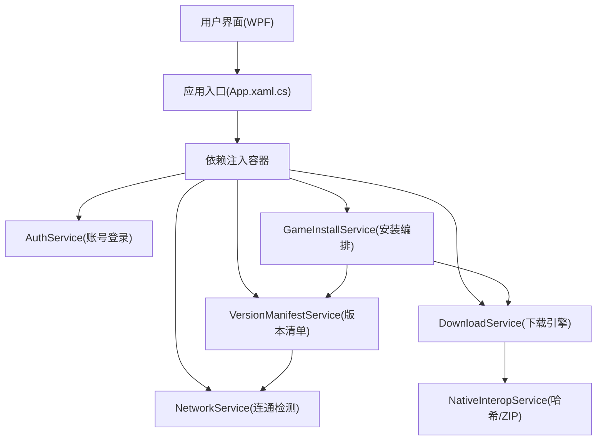
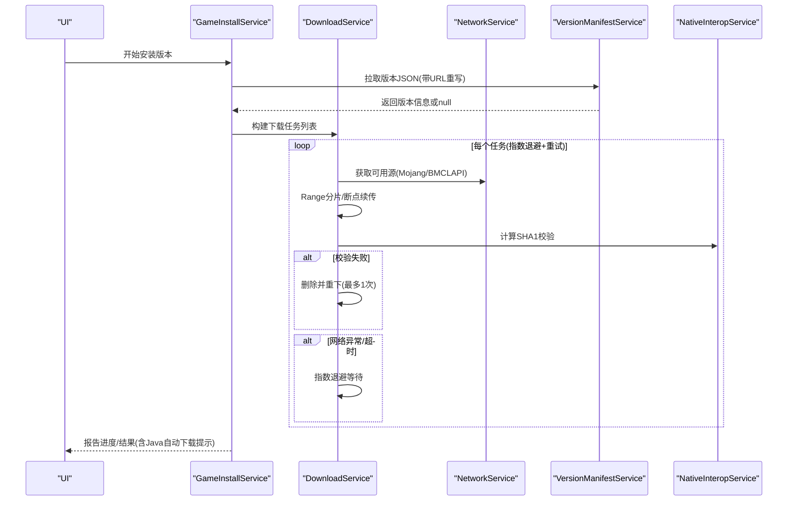
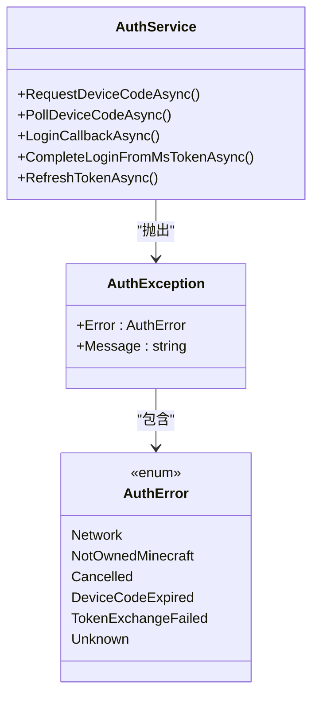
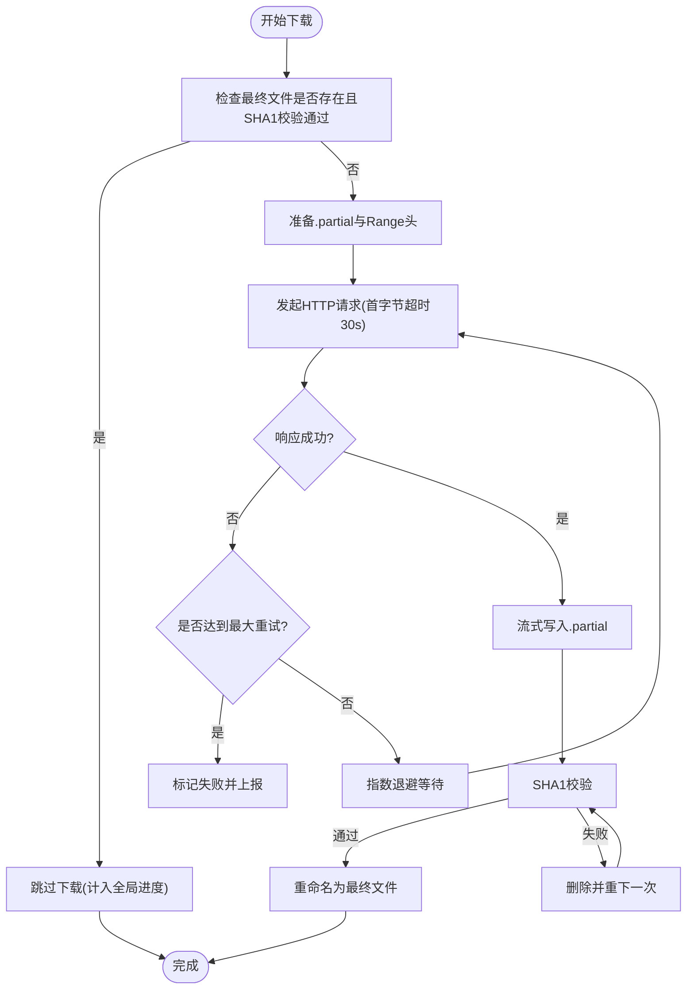
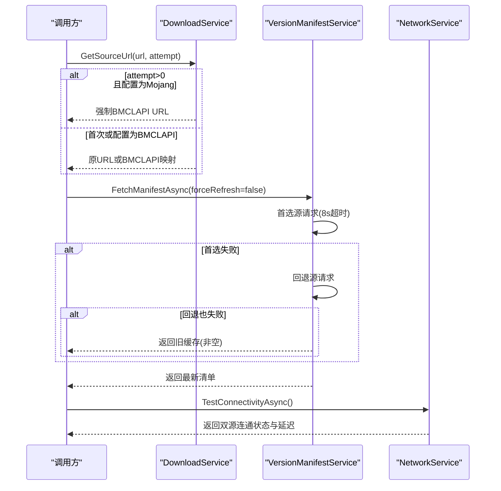
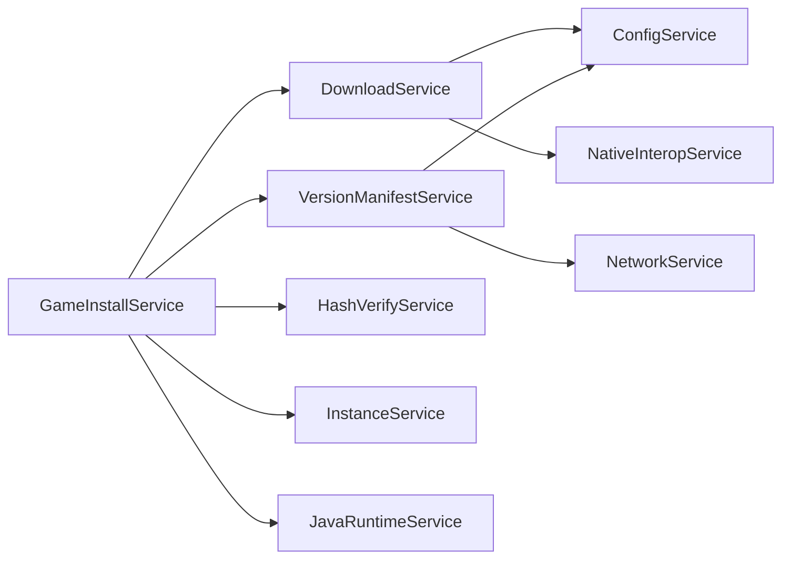

# 错误处理和重试模式

<cite>
**本文引用的文件**   
- [App.xaml.cs](file://src/FufuLauncher/App.xaml.cs)
- [DownloadService.cs](file://src/FufuLauncher/Services/DownloadService.cs)
- [AuthService.cs](file://src/FufuLauncher/Services/AuthService.cs)
- [NetworkService.cs](file://src/FufuLauncher/Services/NetworkService.cs)
- [VersionManifestService.cs](file://src/FufuLauncher/Services/VersionManifestService.cs)
- [GameInstallService.cs](file://src/FufuLauncher/Services/GameInstallService.cs)
- [ConfigService.cs](file://src/FufuLauncher/Services/ConfigService.cs)
- [NativeInteropService.cs](file://src/FufuLauncher/Services/NativeInteropService.cs)
</cite>

## 目录
1. [简介](#简介)
2. [项目结构](#项目结构)
3. [核心组件](#核心组件)
4. [架构总览](#架构总览)
5. [详细组件分析](#详细组件分析)
6. [依赖关系分析](#依赖关系分析)
7. [性能考量](#性能考量)
8. [故障排查指南](#故障排查指南)
9. [结论](#结论)
10. [附录：测试用例与验证建议](#附录测试用例与验证建议)

## 简介
本文件围绕“可爱的芙芙启动器”的错误处理与重试模式，系统化梳理统一的异常处理框架、自定义异常类型与错误码、指数退避重试算法、网络请求重试策略（连接超时、读取超时、服务器错误）、幂等性保证、失败降级机制、错误日志记录与分析，以及面向错误场景的测试建议。目标是帮助开发者快速理解并扩展该系统的健壮性与可观测性。

## 项目结构
本项目采用服务化分层组织，关键错误处理与重试逻辑集中在 Services 层，应用级全局异常捕获与日志在 App 入口实现。下载与认证是网络密集型模块，具备完善的重试与降级能力；版本清单拉取具备双源回退；哈希校验与 ZIP 操作通过原生 DLL 加速并提供托管 fallback。

图表来源 
- [App.xaml.cs:75-117](file://src/FufuLauncher/App.xaml.cs#L75-L117)
- [DownloadService.cs:56-114](file://src/FufuLauncher/Services/DownloadService.cs#L56-L114)
- [AuthService.cs:76-121](file://src/FufuLauncher/Services/AuthService.cs#L76-L121)
- [VersionManifestService.cs:172-189](file://src/FufuLauncher/Services/VersionManifestService.cs#L172-L189)
- [GameInstallService.cs:50-80](file://src/FufuLauncher/Services/GameInstallService.cs#L50-L80)
- [NativeInteropService.cs:20-55](file://src/FufuLauncher/Services/NativeInteropService.cs#L20-L55)

章节来源
- [App.xaml.cs:75-117](file://src/FufuLauncher/App.xaml.cs#L75-L117)
- [README.md:34-53](file://README.md#L34-L53)

## 核心组件
- 统一异常与错误码
  - 认证域：AuthException + AuthError 枚举，区分网络异常、未购买MC、取消、设备码过期、令牌交换失败等，便于 UI 精准提示。
  - 下载域：使用标准异常（如 InvalidDataException）配合任务状态与事件上报，结合日志输出定位问题。
- 指数退避重试
  - 下载任务默认最大重试次数为 3，每次失败后按 1s、2s、4s… 指数退避等待，避免雪崩与瞬时抖动。
- 网络请求重试与降级
  - 下载：官方源失败自动降级到 BMCLAPI 镜像；单请求首字节超时 30s，HttpClient 总超时 5min。
  - 版本清单：首选源失败快速回退另一源，失败时返回旧缓存避免阻塞 UI。
- 幂等性保证
  - 断点续传：.partial 临时文件 + 已下载字节数记录，中断后可继续；若最终文件存在且 SHA1 校验通过则直接跳过。
  - 校验失败重下：SHA1 校验失败删除并重下一次，确保数据一致性。
- 失败降级机制
  - 下载源切换、版本清单双源回退、Java 运行时自动下载失败不阻塞主流程。
- 错误日志与分析
  - 应用级异步日志队列，后台定时批量写入 app.log；各模块关键路径均记录失败原因与上下文。

章节来源
- [AuthService.cs:32-48](file://src/FufuLauncher/Services/AuthService.cs#L32-L48)
- [DownloadService.cs:78-114](file://src/FufuLauncher/Services/DownloadService.cs#L78-L114)
- [DownloadService.cs:305-358](file://src/FufuLauncher/Services/DownloadService.cs#L305-L358)
- [VersionManifestService.cs:205-255](file://src/FufuLauncher/Services/VersionManifestService.cs#L205-L255)
- [App.xaml.cs:39-73](file://src/FufuLauncher/App.xaml.cs#L39-L73)

## 架构总览
下图展示错误处理与重试在主流程中的位置与交互：

图表来源 
- [GameInstallService.cs:83-122](file://src/FufuLauncher/Services/GameInstallService.cs#L83-L122)
- [VersionManifestService.cs:257-292](file://src/FufuLauncher/Services/VersionManifestService.cs#L257-L292)
- [DownloadService.cs:295-366](file://src/FufuLauncher/Services/DownloadService.cs#L295-L366)
- [NativeInteropService.cs:38-55](file://src/FufuLauncher/Services/NativeInteropService.cs#L38-L55)

## 详细组件分析

### 统一异常与错误码（认证域）
- 自定义异常类型
  - AuthException：携带 AuthError 枚举，明确错误分类，上层可按类型给出差异化提示。
- 错误码定义
  - Network：网络异常
  - NotOwnedMinecraft：未购买 Minecraft
  - Cancelled：用户取消
  - DeviceCodeExpired：设备码过期
  - TokenExchangeFailed：令牌交换失败（MS/XBL/XSTS/MC任一环节）
  - Unknown：未知异常
- 典型调用链
  - 设备码请求/轮询、本地回调、完整令牌链（XBL→XSTS→MC→Profile）均抛出 AuthException，便于集中处理。

图表来源 
- [AuthService.cs:32-48](file://src/FufuLauncher/Services/AuthService.cs#L32-L48)
- [AuthService.cs:160-192](file://src/FufuLauncher/Services/AuthService.cs#L160-L192)
- [AuthService.cs:198-265](file://src/FufuLauncher/Services/AuthService.cs#L198-L265)
- [AuthService.cs:343-398](file://src/FufuLauncher/Services/AuthService.cs#L343-L398)

章节来源
- [AuthService.cs:32-48](file://src/FufuLauncher/Services/AuthService.cs#L32-L48)
- [AuthService.cs:160-192](file://src/FufuLauncher/Services/AuthService.cs#L160-L192)
- [AuthService.cs:198-265](file://src/FufuLauncher/Services/AuthService.cs#L198-L265)
- [AuthService.cs:343-398](file://src/FufuLauncher/Services/AuthService.cs#L343-L398)

### 指数退避重试算法（下载域）
- 配置项
  - MaxRetry：最大重试次数（默认 3）
  - ShardThreshold/ShardCount：大文件分片阈值与并发分片数
- 重试策略
  - 每任务独立循环 attempt=0..MaxRetry，失败后 Task.Delay(1000 * (1 << attempt)) 指数退避
  - 支持取消令牌，避免长时间阻塞
- 幂等性
  - .partial 断点续传 + 最终文件存在且校验通过即跳过
  - SHA1 校验失败删除并重下一次，确保一致性

图表来源 
- [DownloadService.cs:295-366](file://src/FufuLauncher/Services/DownloadService.cs#L295-L366)
- [DownloadService.cs:369-451](file://src/FufuLauncher/Services/DownloadService.cs#L369-L451)
- [DownloadService.cs:454-547](file://src/FufuLauncher/Services/DownloadService.cs#L454-L547)

章节来源
- [DownloadService.cs:78-114](file://src/FufuLauncher/Services/DownloadService.cs#L78-L114)
- [DownloadService.cs:305-358](file://src/FufuLauncher/Services/DownloadService.cs#L305-L358)
- [DownloadService.cs:369-451](file://src/FufuLauncher/Services/DownloadService.cs#L369-L451)
- [DownloadService.cs:454-547](file://src/FufuLauncher/Services/DownloadService.cs#L454-L547)

### 网络请求重试与降级（多模块）
- 下载服务
  - GetSourceUrl(originalUrl, attempt)：attempt>0 且配置为 Mojang 时强制切换到 BMCLAPI
  - ForceBmclUrl：域名替换规则覆盖 Mojang 常见域名
  - 单请求首字节超时 30s，HttpClient 总超时 5min
- 版本清单服务
  - FetchManifestAsync：首选源失败快速回退另一源，失败时返回旧缓存
  - FetchVersionJsonAsync：URL 重写规则与下载服务一致
- 网络连通检测
  - TestConnectivityAsync：并行检测 Mojang 与 BMCLAPI 延迟与可用性

图表来源 
- [DownloadService.cs:172-210](file://src/FufuLauncher/Services/DownloadService.cs#L172-L210)
- [VersionManifestService.cs:205-255](file://src/FufuLauncher/Services/VersionManifestService.cs#L205-L255)
- [VersionManifestService.cs:257-292](file://src/FufuLauncher/Services/VersionManifestService.cs#L257-L292)
- [NetworkService.cs:34-76](file://src/FufuLauncher/Services/NetworkService.cs#L34-L76)

章节来源
- [DownloadService.cs:172-210](file://src/FufuLauncher/Services/DownloadService.cs#L172-L210)
- [VersionManifestService.cs:205-255](file://src/FufuLauncher/Services/VersionManifestService.cs#L205-L255)
- [NetworkService.cs:34-76](file://src/FufuLauncher/Services/NetworkService.cs#L34-L76)

### 幂等性保证（下载与校验）
- 断点续传：.partial 文件记录已下载字节，重启后从偏移继续
- 最终文件存在且校验通过：直接跳过下载并计入全局进度
- 校验失败：删除并重下一次，确保最终一致性
- 并发安全：分片写入不同偏移，避免竞争

章节来源
- [DownloadService.cs:369-451](file://src/FufuLauncher/Services/DownloadService.cs#L369-L451)
- [DownloadService.cs:454-547](file://src/FufuLauncher/Services/DownloadService.cs#L454-L547)
- [DownloadService.cs:584-590](file://src/FufuLauncher/Services/DownloadService.cs#L584-L590)

### 失败降级机制
- 下载源降级：官方源失败自动切 BMCLAPI
- 版本清单降级：首选源失败回退另一源，失败返回旧缓存
- Java 运行时：自动下载失败不阻塞安装，仅提示用户手动下载

章节来源
- [DownloadService.cs:172-210](file://src/FufuLauncher/Services/DownloadService.cs#L172-L210)
- [VersionManifestService.cs:205-255](file://src/FufuLauncher/Services/VersionManifestService.cs#L205-L255)
- [GameInstallService.cs:248-270](file://src/FufuLauncher/Services/GameInstallService.cs#L248-L270)

### 错误日志记录与分析
- 应用级日志：ConcurrentQueue + Timer 批量写入 app.log，避免高频 IO 阻塞
- 模块日志：下载失败、SHA1 校验失败、网络异常、令牌刷新失败等均记录
- 全局异常捕获：UI 线程、域内、Task 未观察异常统一捕获并弹窗提示

章节来源
- [App.xaml.cs:39-73](file://src/FufuLauncher/App.xaml.cs#L39-L73)
- [App.xaml.cs:180-205](file://src/FufuLauncher/App.xaml.cs#L180-L205)
- [DownloadService.cs:323-358](file://src/FufuLauncher/Services/DownloadService.cs#L323-L358)
- [AuthService.cs:440-468](file://src/FufuLauncher/Services/AuthService.cs#L440-L468)

## 依赖关系分析
- 服务间耦合
  - GameInstallService 依赖 DownloadService、VersionManifestService、HashVerifyService、InstanceService、JavaRuntimeService
  - DownloadService 依赖 ConfigService、NativeInteropService
  - VersionManifestService 依赖 NetworkService、ConfigService
- 外部依赖
  - HttpClient：网络请求与超时控制
  - C++ 原生 DLL：哈希与 ZIP 加速，缺失时自动 fallback 托管实现

图表来源 
- [GameInstallService.cs:50-80](file://src/FufuLauncher/Services/GameInstallService.cs#L50-L80)
- [DownloadService.cs:56-114](file://src/FufuLauncher/Services/DownloadService.cs#L56-L114)
- [VersionManifestService.cs:172-189](file://src/FufuLauncher/Services/VersionManifestService.cs#L172-L189)

章节来源
- [GameInstallService.cs:50-80](file://src/FufuLauncher/Services/GameInstallService.cs#L50-L80)
- [DownloadService.cs:56-114](file://src/FufuLauncher/Services/DownloadService.cs#L56-L114)
- [VersionManifestService.cs:172-189](file://src/FufuLauncher/Services/VersionManifestService.cs#L172-L189)

## 性能考量
- 下载吞吐优化
  - 大文件分片并发下载（>=8MB），默认 4 分片，按文件大小动态调整
  - 单连接 Range 断点续传小文件，减少握手开销
- 进度更新节流
  - 全局总进度节流 150ms，避免 UI 卡顿
- 超时控制
  - 单请求首字节超时 30s，HttpClient 总超时 5min，版本清单 8s 快速失败
- 资源复用
  - HttpClient 单例 + User-Agent/Accept 头，避免被限流

[本节为通用指导，无需引用具体文件]

## 故障排查指南
- 常见问题定位
  - 下载失败：查看 app.log 中“下载”相关条目，确认是否触发指数退避与源降级
  - 校验失败：关注 SHA1 校验失败的重下日志，必要时清理缓存目录重新下载
  - 登录失败：根据 AuthError 类型判断（网络、未购买、取消、设备码过期、令牌交换失败）
  - 版本清单不可用：检查首选/回退源连通性，必要时清空缓存强制刷新
- 诊断步骤
  - 打开设置页查看应用日志
  - 切换下载源后重试
  - 检查磁盘空间与权限
  - 确认 Java 运行库匹配版本

章节来源
- [App.xaml.cs:39-73](file://src/FufuLauncher/App.xaml.cs#L39-L73)
- [DownloadService.cs:323-358](file://src/FufuLauncher/Services/DownloadService.cs#L323-L358)
- [AuthService.cs:440-468](file://src/FufuLauncher/Services/AuthService.cs#L440-L468)
- [VersionManifestService.cs:205-255](file://src/FufuLauncher/Services/VersionManifestService.cs#L205-L255)

## 结论
本项目的错误处理与重试体系以“统一异常 + 指数退避 + 多源降级 + 幂等校验 + 异步日志”为核心，覆盖了网络不稳定、服务端限制、文件损坏、令牌过期等典型场景。通过模块化设计与清晰的职责边界，既保证了用户体验（流畅进度、友好提示），又提升了系统鲁棒性（自动恢复、快速失败）。建议在后续迭代中持续完善可观测性指标（成功率、延迟分布、重试率）与自动化测试覆盖。

[本节为总结性内容，无需引用具体文件]

## 附录：测试用例与验证建议
- 下载服务
  - 正常下载：验证分片/断点续传、进度上报、SHA1 校验通过
  - 网络异常：模拟连接超时/读取超时，验证指数退避与源降级
  - 校验失败：伪造损坏文件，验证删除并重下一次
  - 取消/暂停：验证 CancellationToken 生效与状态机转换
- 认证服务
  - 设备码流程：模拟授权_pending/slow_down/expired_token/cancelled
  - 本地回调：端口占用、浏览器打开失败、回调参数校验
  - 令牌刷新：refresh_token 失效、XBL/XSTS/MC 链路失败
- 版本清单
  - 首选源失败：验证回退源与旧缓存返回
  - URL 重写：BMCLAPI 映射规则正确性
- 日志与异常
  - 全局异常捕获：UI/域/Task 未观察异常是否弹窗并记录
  - 日志落盘：app.log 是否按时刷新与内容完整性

[本节为测试建议，无需引用具体文件]